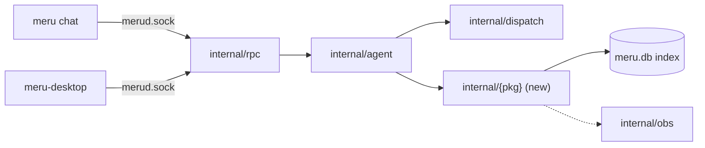
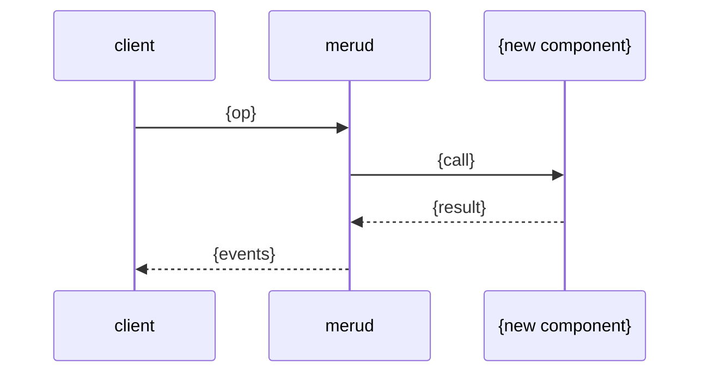

# New Feature Design

Use this skill when the user wants to design a Meru feature. Write the design so an
implementer can build from it and a developer new to Go can learn from it.

Adapted from the `new-feature-design` skill in
[agentic-community/mcp-gateway-registry](https://github.com/agentic-community/mcp-gateway-registry),
rewritten for Meru's Go code, its three clients and its non-negotiables.

Every document this skill writes (issue, LLD, review, testing plan and summary) follows
the `writing` skill. Load it before drafting and run its revision pass on each file.

Meru in one paragraph: a personal AI (artificial intelligence) assistant, written in
Go, that runs on the owner's machine. macOS on Apple silicon comes first, Linux is
supported, and Windows should work but goes untested. `merud`, the resident daemon,
keeps models warm in Ollama on loopback and owns the store, the tools and the
hand-written agent loop. Three thin clients talk to it over `~/.meru/merud.sock`:
`meru` (one question, subcommands, and `meru run --json` for scripts), `meru chat` (a
Bubble Tea terminal UI) and `meru-desktop` (a Wails v3 window with a plain HTML page).
A Mac installer sets up Ollama, web search, folders and `merud` before `merud` exists.
Meru calls MCP (Model Context Protocol) servers over stdio or Streamable HTTP, other
agents over A2A (agent-to-agent), local programs through `[[commands]]`, and built-in
tools such as `web_search`, `web_fetch`, `write_file` and the read-only file tools,
every one through `dispatch`. JSONL (JSON Lines) session transcripts and Markdown memory
files are the source of truth; SQLite (`ncruces/go-sqlite3`, no cgo, with FTS5 and
vec1) is a rebuildable index. OpenTelemetry (OTel) goes only to a loopback endpoint.
Meru has no sandbox, no cloud service, no auth server and no second user; control sits
in `dispatch`, the allowlists and the approval prompts.

**Design philosophy: simple wins every time.** The best design is the smallest one
that meets the milestone's "Done when" line. Every section of the LLD should make it
easier to say no to extra machinery.

## Input modes

- **GitHub issue URL** (for example `https://github.com/{owner}/{repo}/issues/123`):
  issue mode.
- **Anything else**: description mode.

## Workflow

| Step | Description mode | Issue mode |
|------|------------------|------------|
| 1 | Ask clarifying questions | Fetch the issue with `gh` and list its gaps |
| 2 | Read the repo docs and code (quick pass) | same |
| 3 | Create `.scratchpad/{feature-name}/` | Create `.scratchpad/issue-{n}/` |
| 4 | Write `github-issue.md` (new issue) | Write `github-issue.md` (summary of the issue plus clarifications) |
| 5 | Read the packages the feature touches, in depth | same |
| 6 | Write `lld.md` | same |
| 7 | Write `review.md` | same |
| 8 | Write `testing.md` | same |
| 9 | Present the summary and ask for direction | same |

```text
.scratchpad/{feature-name}/    # or .scratchpad/issue-{n}/
├── github-issue.md
├── lld.md
├── review.md
└── testing.md
```

Name the folder after the issue in issue mode, so the design traces back to it and two
people don't design the same issue twice. Git ignores `.scratchpad/`; never commit
design files.

---

## Step 1: Requirements

### Description mode

Ask, in one message, only what you can't infer:

1. Feature name (kebab-case, used as the folder name)
2. What problem it solves, in the owner's day-to-day use
3. Which ROADMAP milestone it belongs to, if the user knows
4. Which clients show it: `meru`, `meru chat`, the desktop app, `meru run --json`
5. Constraints (model set, latency, tools it may touch, network needs)
6. Scope: small, medium or large

### Issue mode

```bash
gh issue view {n} --repo {owner}/{repo} --json title,body,labels,state,assignees,comments
gh pr list --repo {owner}/{repo} --search "{n}" --state all   # earlier attempts
```

Pull out the problem statement, acceptance criteria, any design the issue already
proposes, decisions and open questions from the comments, and earlier pull requests.
Then ask the user only about the gaps. If the issue weighs two approaches without
choosing, ask which one to design:

```text
Issue #{n}, "{title}", gives: {what it has}.
It leaves open:
1. {gap}
2. {gap}
It weighs two ways to {topic}: A, {one line}; B, {one line}. Which should I design?
```

---

## Steps 2 and 5: Read the repo (quick pass, then deep)

Read these before you ask a design question or write the LLD:

- `ARCHITECTURE.md`: the design contract. Read "Principles", "The shape: daemon + thin
  client", "Privacy boundary" and "Deliberate non-goals" every time, plus the sections
  the feature touches.
- `ROADMAP.md`: find the milestone that owns this feature and quote its "Done when"
  line. If the feature belongs to a later milestone than the current one, say so; Meru
  doesn't build ahead of its milestones.
- `AGENTS.md`: non-negotiables, layout, the dependency rule, Go practices.
- `docs/lld.md`: the packages, the interfaces between them, and one question traced
  function by function.
- `.claude/skills/pr-review/personas/security-patterns.md`: the guards the feature must
  keep.
- `docs/coding-notes/`: the explainers that already exist, so the design links to them
  instead of explaining again.
- The packages the feature touches under `internal/`, plus the commands under `cmd/`
  and the client code in `internal/tui` and `internal/desktop` if users see the
  feature. Open the files and read the code. Note the types, interfaces, error-wrapping
  style, `context.Context` plumbing and test helpers.

If the code and ARCHITECTURE.md disagree on something the feature depends on, stop and
tell the user which one looks wrong. Wait for an answer before you design on top of
either. If the feature would change a principle, a non-negotiable or a non-goal, say so
to the user now; the LLD must argue for it in section 3.

For a wide feature, hand the deep read in Step 5 to an Explore subagent, for example:
"Read `internal/agent` and `internal/dispatch`. Report how a tool call reaches
`tool_calls`, the span and metric names used, how incognito calls differ, and the test
helpers available." Read its report, then open the files it names.

---

## Steps 3 and 4: Folder and github-issue.md

Create the folder from the table above, then write the issue file.

### New issue (description mode)

```markdown
# {Feature title}

**Milestone:** {v0.x}, "Done when: {quoted line}"
**Labels:** {enhancement | bug | documentation | ...}

## Problem
{What hurts today, in one short paragraph.}

## Proposal
{The simplest version, two to four sentences.}

## What the user does
- In `meru chat`: {command or key, or "nothing new"}
- In the desktop app: {screen and control, or "nothing new"}
- From a script: {`meru run --json` event, or "nothing new"}

## Acceptance criteria
- [ ] {Observable from a client, the store, a transcript or the dashboard}
- [ ] {...}

## Out of scope
- {What this leaves out on purpose}

## Dependencies
- {Earlier milestone work or issues this needs, or "none"}
```

### Summary of an existing issue (issue mode)

```markdown
# Issue summary: {title}

*Source: [{owner}/{repo}#{n}]({url}), fetched {date}, state {open|closed}*

## Problem (from the issue)
## Requirements (issue body / comments / clarified with the user)
## Design already proposed in the issue
## Acceptance criteria (from the issue / added here)
## Decisions from the discussion
| Decision | Why | Who |
## Open questions and how we resolved them
| Question | Answer |
## Out of scope
## Earlier pull requests
```

---

## Step 6: lld.md

The LLD is the main document. Write it for an implementer new to Go: every code block
is Go pseudo-code with comments that explain the *why* and the Go idiom in use
(interfaces, `context.Context`, error wrapping, goroutines, `iter.Seq2`, table-driven
tests). Use real Go syntax; you may leave function bodies out.

````markdown
# LLD: {Feature name}

*Created {date}. Status: Draft.*

## 1. Problem
{What is wrong or missing, who notices, and why now. Keep it short.}

**Goals:** {bullets}
**Non-goals:** {bullets; include anything a reader might assume is in scope}

## 2. Milestone
{v0.x. Quote the "Done when" line and say how this feature moves it forward. If it
belongs to a later milestone, say so and stop to ask the user.}

## 3. Fit with ARCHITECTURE.md
- Sections this touches: {Engine layer / Agent loop / Storage / MCP / Desktop app / ...}
- Principles it leans on: {for example "files are the source of truth"}
- **Principle, non-negotiable or non-goal affected:** {None. / Which one, why the
  change is worth it, and what follows from it. Flag it; don't bury it.}
- **Does ARCHITECTURE.md need to change?** {No. / Yes: which section, the proposed
  wording, and which of 200.md, 100.md, the three HTML pages and the figures follow.}

## 4. Codebase analysis
| Path | What it does | How this feature uses it |
|------|--------------|--------------------------|
| `internal/dispatch/dispatcher.go` | the one tool-call path | {...} |

**Patterns to follow:**
1. {Pattern}, seen in `{file}`. This feature follows it by {...}.

**Integration points:**
| Component | Extends / uses / depends on | Details |
|-----------|-----------------------------|---------|

**Constraints found while reading the code:** {bullets}

**Code the feature builds on:**
```go
// From internal/{pkg}/{file}.go:{lines}. The pattern this feature copies.
```

## 5. Diagrams

### Components


### Sequence


## 6. Package placement
| Package | New / changed | Why here |
|---------|---------------|----------|
| `internal/{pkg}` | new | {one sentence} |
| `internal/tui` | changed | {drawing and sending only; no model, store or tool logic} |

Keep the clients thin; the dependency rule in AGENTS.md says what each may import. A new
package needs a `doc.go` and a line in the AGENTS.md layout.

## 7. Types and interfaces
```go
// Package {pkg} {one line on what it owns}.
package {pkg}

// Thing is {what it represents}. It is a plain struct, not an interface,
// because there is only one implementation. (Go idiom: accept interfaces,
// return structs. Add an interface only when a second implementation needs it.)
type Thing struct {
    Name string    // bounded, safe to use as a metric attribute
    Path string    // file path: goes on spans only, never on metrics
    Seen time.Time
}

// Do {what it does}. ctx comes first so a cancelled turn stops the work
// (Ctrl-C in meru chat or Stop in the desktop app cancels the whole turn).
func (t *Thing) Do(ctx context.Context, in Input) (Output, error) {
    if err := in.validate(); err != nil {
        // %w wraps the error so callers can errors.Is / errors.As it.
        return Output{}, fmt.Errorf("thing %s: %w", t.Name, err)
    }
    // ...
}
```
{If the feature touches the `Engine` interface, say so. Four methods is a hard limit;
justify any change or put the logic somewhere else.}

## 8. Walkthrough
{Numbered steps for the main path, each with the file it lives in and a short
pseudo-code block where the logic isn't obvious. Cover errors, cancellation and
timeouts. Say which goroutines exist and who stops them.}

## 9. Socket protocol
{"None" if the feature adds no op, event or field. Otherwise:}
| Op or event | Request / event fields | Sent by | Handled in |
|-------------|------------------------|---------|------------|
| `Op{Name}` | {fields} | {desktop, meru chat, meru} | `cmd/merud/{file}.go` |

- Both interactive clients get it, or this section says why one doesn't.
- Older clients keep working: new fields are optional.
- A new event on the `ask` stream reaches scripts through `meru run --json`; say what
  a script sees.

## 10. Clients
| Client | Change | Files |
|--------|--------|-------|
| `meru chat` | {slash command, box, key} | `internal/tui/{file}.go` |
| Desktop app | {screen, control, Bridge method} | `internal/desktop/{file}.go`, `web/js/{file}.js` |
| `meru` | {subcommand or flag} | `cmd/meru/{file}.go` |

{The states the user sees (loading, empty, error, done) and the words for each, the
same in both clients. Keyboard use in the desktop app. "None" if users see nothing.}

## 11. Configuration (`~/.meru/config.toml`)
```toml
[{section}]
enabled = false   # default keeps today's behavior
{key}   = "..."   # what it does, valid range
```
| Key | Type | Default | Validated how |
|-----|------|---------|---------------|

Each new key reaches every surface:
| Surface | What to add | Done |
|---------|-------------|------|
| `internal/config` | field, default, validation (`loopback.CheckURL` for an address, `secret:<name>` for a secret) | [ ] |
| `internal/config/template.toml` | the key, its default and a comment | [ ] |
| `config.example.toml` | `cp internal/config/template.toml config.example.toml` | [ ] |
| ARCHITECTURE.md | the key, if users see its effect | [ ] |
| Desktop Settings and a `meru chat` command | only if users change it at run time, through a socket op that `merud` acts on | [ ] |
| `docs/faq/` | a how-to page, if users will ask | [ ] |

- An existing config without these keys must load unchanged; `merud` fills in the
  defaults.
- Model names belong in config, never in code. Secrets live in `~/.meru/secrets.toml`.

## 12. Storage
- Source-of-truth files this reads or writes: {transcripts, memory files, skills, ...}
- SQLite changes: {"none" or the DDL below}
```sql
CREATE TABLE IF NOT EXISTS {table} (
    id         INTEGER PRIMARY KEY,
    {col}      TEXT NOT NULL,   -- readable rows, not blobs
    trace_id   TEXT             -- links back to the OTel trace
);
```
- **Rebuild:** how `merud` builds this again from files after `rm ~/.meru/meru.db`. A
  table you can't rebuild from files doesn't belong in the index; redesign it.
- **Data access (no N+1):** for each read path, how the data comes back. A count or
  lookup over a list is one query (`IN`, a join, `GROUP BY`), never one query per item
  in a loop. If you can't avoid a per-item read, say why and bound the count.
- **Incognito and delete:** what this keeps for an incognito chat (nothing but the
  stripped `tool_calls` row) and what deleting a chat removes.
- Migration: how an existing `meru.db` picks up the change, or "delete and rebuild".

## 13. Observability
| Span | Parent | Attributes |
|------|--------|------------|
| `meru.{stage}` | `meru.turn` | {IDs and paths are fine on spans} |

| Metric | Type | Attributes (bounded sets only) | Answers |
|--------|------|--------------------------------|---------|
| `meru.{name}` | histogram | {model, tier, server, tool, outcome} | {question} |

| Log level | Event | Fields (no question or answer text) |
|-----------|-------|-------------------------------------|

Use GenAI and MCP semantic-convention names where they exist. No prompt or response
text in spans unless `capture_content = true`. Add a dashboard panel in
`deploy/observability/dashboards/` if the metric answers a question the owner will ask.

## 14. Performance
Meru serves one user on one machine, so the questions are local ones:
- Time to first token: does this add work before it? How much?
- Model memory: does it load another model or grow the context?
- Size: how it behaves with 10,000 indexed files, 1,000 chats or a 50-page PDF.
- What it caches, for how long, and what clears the cache.

## 15. Network and trust
- Does `merud` open a new connection? It must go to loopback, to an A2A agent or
  Streamable HTTP MCP server marked `remote = true`, or through the web tools' guard.
- A new tool? It goes through `dispatch`, and one that writes, sends or deletes starts
  in `confirm`.
- The patterns in `security-patterns.md` this touches, and how the design keeps each
  guard.

## 16. Non-negotiables check
| Rule | Holds? | How |
|------|--------|-----|
| No cloud-model code path | | |
| No telemetry off the machine; OTLP loopback only | | |
| Deny-by-default for tools and agents | | |
| Every tool call through `dispatch` and `tool_calls` | | |
| Nothing for sale | | |

## 17. New dependencies
| Module | Why the standard library isn't enough | Pulls in |
|--------|---------------------------------------|----------|
Write "None" if there are none. Check that no dependency brings in a cloud-model client
or sends data off the machine. A library for the desktop page gets vendored under
`internal/desktop/web/vendor/` with a line in `THIRD-PARTY.md`.

## 18. Simplest version that works
{The smallest change that meets the acceptance criteria. What it leaves out, and what
would have to happen before those parts are worth adding.}

## 19. Alternatives considered
### {Option}
{What it is, what it does better, what it costs, why we didn't pick it.}

| | Chosen | {Option A} | {Option B} |
|--|--------|------------|------------|
| Moving parts | | | |
| Time to first token | | | |
| What a reader must learn | | | |

## 20. Files
| Path | New / changed | ~Lines |
|------|---------------|--------|

| Kind | ~Lines |
|------|--------|
| New Go | |
| New tests | |
| Changed | |
| **Total** | |

## 21. Docs to write
| File | New / update | Covers |
|------|--------------|--------|
| `docs/coding-notes/{pkg}.md` | update | {what changed} |
| `docs/coding-notes/go-basics/{topic}.md` | new | {the Go idea this feature uses first, for example errgroup, iter.Seq2, embed.FS} |
| `docs/lld.md` | update | {if packages or interfaces change} |
| `docs/faq/{question}.md` | new | {if users will ask how} |

Every feature adds or updates at least one coding note. Pick the Go idea a newcomer
would find least obvious in this change.

## 22. Rollout
- Release notes: the line for `docs/release-notes/`, and any upgrade step (a new key, a
  model to pull, a service file to reload).
- ROADMAP.md: the item to tick, if any. The README's status line changes only when a
  milestone ships.
- How to turn it off if it misbehaves, and what that leaves behind.

## 23. Open questions
````

---

## Step 7: review.md

Each persona gives its strengths, concerns, better options it sees, new libraries it
would add or refuse, and a verdict. Keep each section to what that persona would say
out loud; one with nothing to add says so in one line. The personas match the
`pr-review` skill, so a design and its later PR face the same reviewers.

```markdown
# Review: {Feature name}

*{date}, against the lld.md draft*

## Go developer (Byte)
Package boundaries, exported surface, error wrapping, context plumbing, goroutine
lifetimes and leaks, data races, testability without mocks everywhere.
**N+1 check (required):** walk every read path in section 12. Flag any query per item
in a loop and give the single-query fix, or write "None found".
- Strengths: ...
- Concerns: ...
- Better options: ...
- New modules: {module and reason, or "none"}
**Verdict:** approve | approve with changes | revise

## Client developer (Pixel)
Both clients in step, thin clients, the states and words the user sees, keyboard use,
the desktop page's rendering and CSP, `meru run --json` events.
- ...
**Verdict:**

## Security (Cipher)
Read `.claude/skills/pr-review/personas/security-patterns.md` first. Name each pattern
the feature touches and how the design keeps its guard: new outbound connections, URLs
the model picks, a tool that skips `dispatch`, tool output as instructions, paths,
programs, secrets, file modes, incognito, the desktop page.
- ...
**Verdict:**

## SRE / observability (Monitor)
Can you tell from Grafana or `merud.log` where a slow or failed turn spent its time?
Span names, metric cardinality, time to first token, restart under launchd or systemd,
rebuild time, what happens when Ollama or an MCP server is down.
- ...
**Verdict:**

## Release engineer (Circuit)
Only when the feature touches config, the build, CI, the installers or service files:
the config surfaces in section 11, the five-platform build without cgo, `make check`,
release notes and upgrade steps.
- ...
**Verdict:**

## AI-agent developer (Sage)
Effect on the turn: prompt budget, tool schemas the model sees, router and skill pick,
`max_rounds`, how the lite model set copes, failure modes the model can cause.
- ...
**Verdict:**

## Chief architect (Atlas)
Is this the smallest design that meets the milestone? What can it drop? Does it grow
the `Engine` interface, add a second dispatch path, add state that can't be rebuilt
from files, change a principle or build ahead of the roadmap? Does ARCHITECTURE.md
need an update?
- ...
**Verdict:**

## Go mentor (Tutor)
Can the owner read and extend this in six months? Do the pseudo-code comments teach the
right idioms? Is the coding note the right one? Is anything clever that should be
plain? Does the prose follow the `writing` skill?
- ...
**Verdict:**

## Summary
| Persona | Verdict | Blockers | Key concern |
|---------|---------|----------|-------------|

**Must fix:** ...
**Should fix:** ...
**Consider:** ...

## Sign-off
- [ ] Blockers resolved in lld.md
- [ ] Ready to build
```

---

## Step 8: testing.md

Someone must be able to run every test as written. Every command, flag, config key,
socket op and package path must exist in the LLD or the current code; don't invent
them. Keep every section heading; if one doesn't apply, write "Not applicable:" and a
one-line reason, so a reader sees you weighed the category.

| Section | Include when |
|---------|--------------|
| 1 Unit | Always |
| 2 Integration | The feature calls Ollama, an MCP server or an A2A agent |
| 3 End-to-end | The feature spans `merud` and a client, or changes a turn |
| 4 Clients | Users see the feature in `meru chat` or the desktop app |
| 5 Backwards compatibility | It changes config, the socket protocol, transcripts or `meru.db` |
| 6 Config surfaces | It adds, renames or removes a config key |
| 7 Observability | It adds a span, metric or log line |
| 8 Security | It touches a pattern in `security-patterns.md` |
| 9 Evals | It changes the router, the skill pick or what the answer model sees |

````markdown
# Testing plan: {Feature name}

*Related: ./lld.md, ./github-issue.md*

## 0. Acceptance
ROADMAP {v0.x} "Done when: {line}". This feature's part of it: {one sentence}.
The end-to-end test in section 3 shows it.

## 1. Unit tests
Table-driven, in the package under test (`internal/{pkg}/{file}_test.go`).
```go
func TestThingDo(t *testing.T) {
    // One table, one loop: each case has a name, so a failure says which case broke.
    tests := []struct {
        name    string
        in      Input
        want    Output
        wantErr error // compared with errors.Is, which is why the code wraps with %w
    }{
        {name: "happy path", in: Input{...}, want: Output{...}},
        {name: "empty input", in: Input{}, wantErr: ErrInvalid},
        {name: "cancelled context", ...},
    }
    for _, tc := range tests {
        t.Run(tc.name, func(t *testing.T) {
            // ...
        })
    }
}
```
| Test | Package | Covers |
|------|---------|--------|

```bash
make test        # go test -race over every package
```

## 2. Integration tests
Behind the `integration` build tag, so plain `go test ./...` stays fast.
- **Ollama:** against the local Ollama on `127.0.0.1:11434` with the configured model
  set; skip with a clear message if it isn't running.
- **MCP:** against a stub MCP server built in the test (official Go SDK, in-process or
  over stdio) with one allowed tool and one the allowlist leaves out. Assert the left-out
  tool never runs and both outcomes land in `tool_calls`.
- **A2A** (if touched): against a stub agent on loopback.
```bash
go test -race -tags integration ./internal/{pkg}/...
```

## 3. End-to-end
In `test/e2e/`, behind the `e2e` tag: real `merud` and `meru` binaries against
`cmd/fakeollama` and, for tools, `cmd/fakemcp`. Use the harness in `harness_test.go`:
`newHome` for a private Meru home, `startStack` or `startFake` plus `startMerud`,
`enqueue` to script the fake model's replies, `runMeru` or `ask` to drive a turn, and
`readTranscript` to check the file.
| Test | Scenario | Asserts |
|------|----------|---------|
```bash
make e2e
```
A manual pass against a real daemon, for the record:
```bash
go run ./cmd/merud &
go run ./cmd/meru "{question}"                           # expected: {fragment}
go run ./cmd/meru run --json "{question}" | jq -c '.type' # expected event types, in order
```
- [ ] Errors are one line that says what to do, with no stack trace
- [ ] Ctrl-C cancels the turn, and the `tool_calls` row records it

## 4. Clients
- **`meru chat`:** a test that drives `Update` with the fake `merud`, and a case in
  `internal/tui/parity_test.go`. Manual: {slash command}, expected {box or notice}.
- **Desktop app:** a Bridge test in `internal/desktop` (no Wails needed). Manual, in
  `bin/Meru.app` from `make desktop-app`: {steps}, expected {result}; keyboard only;
  light and dark; a narrow window.
- [ ] Both clients show the same words for the same state

## 5. Backwards compatibility
- [ ] An existing `config.toml` without the new keys loads and behaves as before
- [ ] Older transcripts replay: {how}
- [ ] Rebuild matches: `rm ~/.meru/meru.db`, restart `merud`, compare {row counts or a query}
- [ ] Existing `meru` commands and socket requests unchanged, or the LLD lists the change
- [ ] A client from the previous release still works against the new `merud`: {how}

## 6. Config surfaces
```bash
grep -n "{key}" internal/config/template.toml config.example.toml ARCHITECTURE.md docs/faq/*.md
go test ./internal/config -run TestExampleIsTemplate
```
- [ ] Default, validation error message, and the Settings screen or slash command if any

## 7. Observability
With the stack from `deploy/observability/` running and
`otlp_endpoint = "http://127.0.0.1:4318"`:
- [ ] Span `meru.{stage}` appears under `meru.turn`
- [ ] Metric `meru.{name}` shows in Grafana with bounded attributes only
- [ ] With `capture_content = false`, no prompt or response text in any span
- [ ] `merud.log` holds no question or answer text at `debug`

## 8. Security
For each pattern the LLD names in section 15, the test that shows the guard holds:
| Pattern | Test | Expected |
|---------|------|----------|
| #{n} {name} | {command or test name} | {refused / asks / stripped} |

## 9. Evals
- [ ] `make router-eval` scores at least as well as on `main` (router changes)
- [ ] `make pick-eval` scores at least as well as on `main` (skill-pick changes)
- [ ] `make bench` on the model sets, if the change affects what the answer model sees

## 10. Checklist for the PR
- [ ] `make check` passes
- [ ] `make desktop installer desktop-check` passes (desktop or installer changes)
- [ ] Sections 2 to 9 verified or marked not applicable
- [ ] Coding notes and the docs from LLD section 21 written
- [ ] ARCHITECTURE.md and its pages updated if the LLD said so
- [ ] Code comments, coding notes and the PR description follow the `writing` skill
````

---

## Step 9: Present the summary and ask for direction

```markdown
## Design summary: {feature}

| File | Holds |
|------|-------|
| `.scratchpad/{folder}/github-issue.md` | issue text |
| `.scratchpad/{folder}/lld.md` | design |
| `.scratchpad/{folder}/review.md` | persona review |
| `.scratchpad/{folder}/testing.md` | test plan |

**Milestone:** v0.x. **ARCHITECTURE.md change:** none / {section}.
**Principle affected:** none / {which, and why}.

| New config key | Type | Default |
|----------------|------|---------|

| New socket op or event | Clients |
|------------------------|---------|

| New module | Why |
|------------|-----|

| New test file | Kind |
|---------------|------|

**Size:** ~{n} lines of Go, ~{n} of tests. **Coding notes:** ...

| Persona | Verdict | Blockers |
|---------|---------|----------|

### Blockers (I will fold these into the LLD)
1. ...

### Recommendations: which should I take?
| # | Recommendation | From | Priority | Take it? |
|---|----------------|------|----------|----------|

### Other designs the reviewers raised
| Option | From | Trade-off |
|--------|------|-----------|

### Questions
1. Update the LLD with the blockers and the recommendations you pick?
2. Anything missing from the requirements?
3. Create the GitHub issue from github-issue.md?
```

Then act on the answer: update `lld.md` (and `testing.md` if affected), explore an
option the user picks, or create the issue with
`gh issue create --title ... --body-file .scratchpad/{folder}/github-issue.md`.

## Guidelines

- Simple wins. If a section has nothing to say, write "None" and move on.
- Don't design ahead of the roadmap. A v0.5 feature proposed during v0.4 gets a design
  note and no build plan.
- Don't propose a cloud service, auth layer, second user, sync or cloud-model
  fallback; ARCHITECTURE.md lists them as non-goals.
- Mermaid for diagrams, Go for pseudo-code, TOML for config, SQL for schema.
- Make the reviews real: each persona names problems, not praise alone.
- Never announce a feature by growing README.md. Put the design in ARCHITECTURE.md (if
  it changes), the code in `docs/coding-notes/`, the how-to in `docs/faq/`, and the
  news in the release notes.
- Examples use the catalog servers (`google`, `obsidian`) and `web_search`. No trading
  or personal-finance examples, and no cloud vendor names.
- No AI or assistant attribution in any file this skill writes: no author lines naming
  a model, no "generated by" notes.
