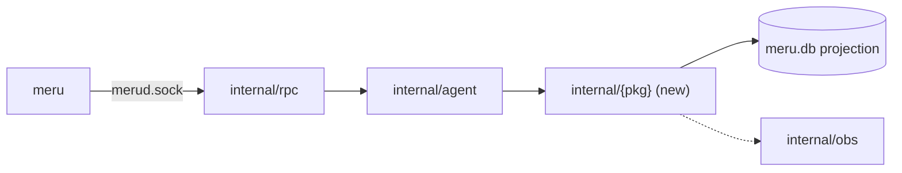
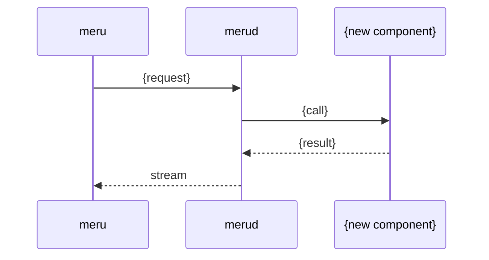

# New Feature Design

Use this skill when the user wants to design a Meru feature. Write the design so an
implementer can build from it and the owner, who is learning Go through this project, can
learn from it.

Every document this skill writes (issue, LLD, review, testing plan and summary) follows
the `writing` skill. Load it before drafting and run its revision pass on each file.

Meru in one paragraph: a personal AI (artificial intelligence) assistant, written in Go,
that runs on the owner's machine. macOS is the primary platform, Linux is supported, and
Windows should work but goes untested at first. One module holds `cmd/meru` (thin socket
client), `cmd/merud` (resident daemon) and everything else under `internal/`. Models run in
Ollama on loopback. The agent loop is hand-written. Meru is a client of MCP (Model Context
Protocol) servers over stdio or Streamable HTTP, through the official Go SDK (software
development kit), and a client of other agents over A2A (agent-to-agent). JSONL (JSON Lines)
session transcripts and other files are the source of truth; SQLite (`ncruces/go-sqlite3` +
`sqlite-vec`, no cgo) is a rebuildable projection. OpenTelemetry (OTel) metrics and traces go
to a loopback-only OTLP (OpenTelemetry Protocol) endpoint. Meru has no sandbox: it runs as
an ordinary user process, and control sits at the tool and agent allowlists. It has no
frontend, cloud service, auth server or second user.

**Design philosophy: simple wins every time.** The best design is the smallest one that
meets the milestone's "Done when" line. Every section of the LLD should make it easier to
say no to extra machinery.

## Input modes

- **GitHub issue URL** (for example `https://github.com/{owner}/{repo}/issues/123`): issue mode.
- **Anything else**: description mode.

## Workflow

| Step | Description mode | Issue mode |
|------|------------------|------------|
| 1 | Ask clarifying questions | Fetch the issue with `gh` and list its gaps |
| 2 | Read the repo docs and code (quick pass) | same |
| 3 | Create `.scratchpad/{feature-name}/` | Create `.scratchpad/issue-{n}/` |
| 4 | Write `github-issue.md` (new issue) | Write `github-issue.md` (summary of the issue plus clarifications) |
| 5 | Read the packages the feature touches, in depth | same |
| 6 | Write `lld.md` | same |
| 7 | Write `review.md` | same |
| 8 | Write `testing.md` | same |
| 9 | Present the summary and ask for direction | same |

```text
.scratchpad/{feature-name}/    # or .scratchpad/issue-{n}/
├── github-issue.md
├── lld.md
├── review.md
└── testing.md
```

Git ignores `.scratchpad/`. Never commit design files.

---

## Step 1: Requirements

### Description mode

Ask, in one message, only what you cannot infer:

1. Feature name (kebab-case, used as the folder name)
2. What problem it solves, in the owner's day-to-day use
3. Which ROADMAP milestone it belongs to, if the user knows
4. Constraints (model tier, latency, tools it may touch, network needs)
5. Scope: small, medium or large

### Issue mode

```bash
gh issue view {n} --repo {owner}/{repo} --json title,body,labels,state,comments
```

Extract the problem statement, acceptance criteria, any design already proposed, and
decisions or open questions from the comments. Then ask the user only about the gaps,
and if the issue weighs two approaches without choosing, ask which one to design.

---

## Steps 2 and 5: Read the repo (quick pass, then deep)

Read these before you ask a design question or write the LLD:

- `ARCHITECTURE.md`: the design contract. Principles, engine interface, agent loop,
  storage, MCP, observability, privacy boundary, non-goals, open questions.
- `ROADMAP.md`: find the milestone that owns this feature and quote its "Done when"
  line. If the feature belongs to a later milestone than the current one, say so; Meru
  does not build ahead of its milestones.
- `AGENTS.md` / `CLAUDE.md`: non-negotiables, layout, conventions.
- `docs/coding-notes/`: the Go explainers that already exist, so the design can link to
  them instead of re-explaining.
- The packages the feature touches under `internal/`, plus `cmd/meru` and `cmd/merud`
  if it adds a command or a daemon hook. Open the files and read the code. Note
  existing types, interfaces, error-wrapping style, `context.Context` plumbing and test
  helpers.

If the code and ARCHITECTURE.md disagree on something the feature depends on, stop and
tell the user which one looks wrong. Wait for an answer before you design on top of either.

For a wide feature, a subagent can do the deep read in Step 5, for example: "Read
`internal/agent` and `internal/mcp`. Report the dispatch path, how tool calls reach
`tool_calls`, the span and metric names used, and the test helpers available."

---

## Steps 3 and 4: Folder and github-issue.md

Create the folder from the table above, then write the issue file.

### New issue (description mode)

```markdown
# {Feature title}

**Milestone:** {v0.x}, "Done when: {quoted line}"
**Labels:** {enhancement | bug | docs | ...}

## Problem
{What hurts today, in one short paragraph.}

## Proposal
{The simplest version, two to four sentences.}

## Acceptance criteria
- [ ] {Observable from `meru ...`, the store, or the dashboard}
- [ ] {...}

## Out of scope
- {What this leaves out on purpose}

## Dependencies
- {Earlier milestone work this needs, or "none"}
```

### Summary of an existing issue (issue mode)

```markdown
# Issue summary: {title}

*Source: [{owner}/{repo}#{n}]({url}), fetched {date}, state {open|closed}*

## Problem (from the issue)
## Requirements (issue body / comments / clarified with the user)
## Design already proposed in the issue
## Acceptance criteria (from the issue / added here)
## Decisions from the discussion
## Open questions and how we resolved them
## Out of scope
```

---

## Step 6: lld.md

The LLD is the main document. Write it for an implementer new to Go: every code block
is Go-flavored pseudo-code with comments that explain the *why* and the Go idiom in use
(interfaces, `context.Context`, error wrapping, goroutines, `iter.Seq2`, table-driven
tests). Use real Go syntax; you may leave function bodies out.

````markdown
# LLD: {Feature name}

*Created {date}. Status: Draft.*

## 1. Problem
{What is wrong or missing, who notices, and why now. Keep it short.}

**Goals:** {bullets}
**Non-goals:** {bullets; include anything a reader might assume is in scope}

## 2. Milestone
{v0.x. Quote the "Done when" line and say how this feature moves it forward. If it
belongs to a later milestone, say so and stop to ask the user.}

## 3. Fit with ARCHITECTURE.md
- Sections this touches: {Engine layer / Agent loop / Storage / MCP / A2A / Observability / ...}
- Principles it leans on: {e.g. "files are the source of truth"}
- **Does ARCHITECTURE.md need to change?** {No. / Yes: which section, the proposed
  wording, and why. Argue any architecture change here, before the code makes it.}

## 4. What exists today
| Path | What it does | How this feature uses it |
|------|--------------|--------------------------|
| `internal/agent/dispatch.go` | the one tool-dispatch path | {...} |

Constraints found while reading the code: {bullets}

## 5. Diagrams

### Components


### Sequence


## 6. Package placement
| Package | New / changed | Why here |
|---------|---------------|----------|
| `internal/{pkg}` | new | {one sentence} |
| `cmd/meru` | changed | {only argument parsing and printing; no model or store logic} |

Keep `cmd/meru` thin: it must not import engine or store packages.

## 7. Types and interfaces
```go
// Package {pkg} {one line on what it owns}.
package {pkg}

// Thing is {what it represents}. It is a plain struct, not an interface,
// because there is only one implementation. (Go idiom: accept interfaces,
// return structs. Add an interface only when a second implementation or a
// test fake needs it.)
type Thing struct {
    Name string    // bounded, safe to use as a metric attribute
    Path string    // file path: goes on spans only, never on metrics
    Seen time.Time
}

// Do {what it does}. ctx is first so a cancelled turn stops the work
// (Ctrl-C in `meru` cancels the whole turn).
func (t *Thing) Do(ctx context.Context, in Input) (Output, error) {
    if err := in.validate(); err != nil {
        // %w wraps the error so callers can errors.Is / errors.As it.
        return Output{}, fmt.Errorf("thing %s: %w", t.Name, err)
    }
    // ...
}
```
{If the feature touches the `Engine` interface, say so. Four methods is a hard limit;
justify any change or put the logic somewhere else.}

## 8. Walkthrough
{Numbered steps for the main path, each with the file it lives in and a short
pseudo-code block where the logic is not obvious. Cover error handling, cancellation
and timeouts. Say which goroutines exist and who stops them.}

## 9. Configuration (`~/.meru/config.toml`)
```toml
[{section}]
enabled = false   # default keeps today's behavior
{key}   = "..."   # what it does, valid range
```
| Key | Type | Default | Validated how |
|-----|------|---------|---------------|
- An existing config without these keys must load unchanged; `merud` fills in the defaults.
- Concrete model names belong in config, never in code.

## 10. Storage
- Source-of-truth files this reads or writes: {JSONL transcripts, skills, notes, ...}
- SQLite changes: {"none" or the DDL below}
```sql
CREATE TABLE IF NOT EXISTS {table} (
    id         INTEGER PRIMARY KEY,
    {col}      TEXT NOT NULL,   -- readable rows, not blobs
    trace_id   TEXT             -- links back to the OTel trace
);
```
- **Rebuild:** how `merud` re-derives `meru.db` from files after `rm ~/.meru/meru.db`. A
  table you cannot rebuild from files does not belong in the projection; redesign it.
- Migration: how an existing `meru.db` picks up the change (or "delete and rebuild").

## 11. Observability
| Span | Parent | Attributes |
|------|--------|------------|
| `meru.{stage}` | `meru.turn` | {IDs and paths are fine on spans} |

| Metric | Type | Attributes (bounded sets only) | Answers |
|--------|------|--------------------------------|---------|
| `meru.{name}` | histogram | {model, tier, server, tool, outcome} | {question} |

Use GenAI / MCP semantic-convention names where they exist. No prompt or response text
in spans unless `capture_content = true`. Add a dashboard panel if the metric answers
a question the owner will ask.

## 12. Network and trust
- Does `merud` open a new connection? It must go to loopback, or to an A2A agent or
  Streamable HTTP MCP server marked `network = true`.
- New MCP server or A2A peer? It contributes no tools until config allowlists them. Meru
  does not confine MCP servers; each runs with the user's permissions, so say what the
  server can reach.

## 13. Non-negotiables check
| Rule | Holds? | How |
|------|--------|-----|
| No hosted-model code path | | |
| No telemetry off the machine, update check or crash reporting; OTLP loopback only | | |
| Deny-by-default for tools and agents | | |
| Every external action goes through `dispatch` and lands in `tool_calls` | | |

## 14. New dependencies
| Module | Why the standard library is not enough | Pulls in |
|--------|----------------------------------------|----------|
Write "None" if there are none. Check that no dependency brings in a hosted-model client or sends data off the machine.

## 15. Simplest version that works
{The smallest change that meets the acceptance criteria. What it leaves out, and what
would have to happen before those parts are worth adding.}

## 16. Alternatives considered
| Option | Why rejected |
|--------|--------------|
| {framework / extra table / new interface / background worker} | {often: more moving parts than the problem needs} |

## 17. Files
| Path | New / changed | ~Lines |
|------|---------------|--------|

## 18. Coding notes to write
| File | New / update | Explains |
|------|--------------|----------|
| `docs/coding-notes/{topic}.md` | new | {the Go concept this feature is the first real use of, for example errgroup, iter.Seq2, embed.FS} |

Every feature adds or updates at least one explainer. Pick the Go idea a newcomer would
find least obvious in this change.

## 19. Open questions
````

---

## Step 7: review.md

One short section per persona, two to six bullets each. Each bullet names a problem. A
persona with nothing to add says so in one line.

```markdown
# Review: {Feature name}

*{date}, against lld.md draft*

## Go developer
Idiomatic Go: package boundaries, exported surface, error wrapping, context plumbing,
goroutine lifetimes and leaks, data races, testability without mocks everywhere.
- ...
**Verdict:** approve | approve with changes | revise

## Security
Privacy boundary: new outbound connections from `merud`, allowlist bypass, any call to an
MCP server or A2A agent that skips `dispatch`, prompt-injected tool output that could
trigger writes, secrets or content in logs and spans, A2A peer trust.
- ...
**Verdict:**

## SRE / observability
Can you tell from Grafana where a slow or failed turn spent its time? Span names,
metric cardinality, daemon restart behavior under `launchd`/`systemd`, projection rebuild time,
what happens when Ollama or an MCP server is down.
- ...
**Verdict:**

## AI-agent developer
Effect on the turn: context budget, tool schemas the model sees, router behavior, tool-call
iteration cap, how a small local model copes with this, failure modes the model can cause.
- ...
**Verdict:**

## Chief architect (simplicity)
Is this the smallest design that meets the milestone? What can the design drop? Does it grow the
`Engine` interface, add a second dispatch path, add state that cannot be rebuilt from files,
or build ahead of the roadmap? Does ARCHITECTURE.md need an update?
- ...
**Verdict:**

## Go mentor (learnability)
Can the owner read and extend this in six months? Do the pseudo-code comments teach the
right idioms? Is the coding-notes explainer the right one, and is anything clever that
should be plain? Does the prose follow the `writing` skill?
- ...
**Verdict:**

## Summary
| Persona | Verdict | Blockers |
|---------|---------|----------|

**Must fix:** ...
**Should fix:** ...
**Consider:** ...
```

---

## Step 8: testing.md

Someone must be able to run every test as written. Every command, flag, config key and
package path must exist in the LLD or the current code; do not invent them. Keep every section heading; if
one does not apply, write "Not applicable:" and a one-line reason.

````markdown
# Testing plan: {Feature name}

*Related: ./lld.md, ./github-issue.md*

## 0. Acceptance
ROADMAP {v0.x} "Done when: {line}". This feature's part of it: {one sentence}.
The final end-to-end (E2E) test in section 3 shows it.

## 1. Unit tests
Table-driven, in the package under test (`internal/{pkg}/{file}_test.go`).
```go
func TestThingDo(t *testing.T) {
    // One table, one loop: each case names itself so failures read clearly.
    tests := []struct {
        name    string
        in      Input
        want    Output
        wantErr error // compared with errors.Is, which is why the code wraps with %w
    }{
        {name: "happy path", in: Input{...}, want: Output{...}},
        {name: "empty input", in: Input{}, wantErr: ErrInvalid},
        {name: "cancelled context", ...},
    }
    for _, tc := range tests {
        t.Run(tc.name, func(t *testing.T) {
            // ...
        })
    }
}
```
| Test | Package | Covers |
|------|---------|--------|

```bash
go test -race ./...
go vet ./...
gofmt -l .   # must print nothing
```

## 2. Integration tests
Put these behind a build tag or `testing.Short()` so plain `go test ./...` stays fast.
- **Ollama:** against the local Ollama on `127.0.0.1:11434` with the configured tiers;
  skip with a clear message if it is not running.
- **MCP:** against a stub MCP server built in the test (official Go SDK, in-process or
  stdio) that exposes one allowed and one non-allowlisted tool. Assert the denied tool
  never runs and both outcomes land in `tool_calls`.
- **A2A** (if touched): against a stub peer on loopback.
```bash
go test -race -tags integration ./internal/{pkg}/...
```

## 3. CLI end-to-end
Against a running daemon:
```bash
go run ./cmd/merud &           # or the merud run by launchd/systemd
go run ./cmd/meru "{query}"    # expected: {output fragment}
go run ./cmd/meru {subcommand} # expected: {output fragment}, exit 0
```
- [ ] Error output is one line that tells the user what to do, with no stack trace
- [ ] Ctrl-C cancels the turn and the `tool_calls` row records it (if the turn calls tools)

## 4. Backwards compatibility
- [ ] An existing `config.toml` without the new keys loads and behaves as before
- [ ] An existing `meru.db` migrates, or `merud` rebuilds it without errors
- [ ] Rebuild from files matches: `rm ~/.meru/meru.db`, re-index, compare {row counts / a query}
- [ ] Existing `meru` commands and socket messages unchanged (or the LLD lists the change)

## 5. Observability
With the `deploy/` stack running and `otlp_endpoint = "http://127.0.0.1:4318"`:
- [ ] Span `meru.{stage}` appears under `meru.turn` in Tempo
- [ ] Metric `meru.{name}` visible in Grafana (localhost:3000) with only bounded attributes
- [ ] With `capture_content = false`, no prompt or response text in any span
- [ ] With no endpoint set, `merud` runs with no-op providers; it refuses a non-loopback endpoint

## 6. Allowlist and network
- [ ] New tools stay hidden from the model until config allowlists them: {command and expected result}
- [ ] `merud` refuses a non-loopback A2A agent or Streamable HTTP MCP server without `network = true`: {command}

## 7. Checklist for the PR
- [ ] `go test -race ./...`, `go vet ./...`, `gofmt -l .` clean
- [ ] Integration tests pass locally
- [ ] Sections 3 to 6 verified or marked not applicable
- [ ] `docs/coding-notes/` explainer(s) from the LLD written
- [ ] ARCHITECTURE.md updated if the LLD said it must be
- [ ] Code comments, coding notes and the PR description follow the `writing` skill
````

---

## Step 9: Present the summary and ask for direction

```markdown
## Design summary: {feature}

| File | Holds |
|------|-------|
| `.scratchpad/{folder}/github-issue.md` | issue text |
| `.scratchpad/{folder}/lld.md` | design |
| `.scratchpad/{folder}/review.md` | persona review |
| `.scratchpad/{folder}/testing.md` | test plan |

**Milestone:** v0.x. **ARCHITECTURE.md change:** none / {section}.
**New config keys:** ... **New tables:** ... **New dependencies:** none / ...
**Coding notes:** ...

| Persona | Verdict | Blockers |
|---------|---------|----------|

### Blockers (I will fold these into the LLD)
1. ...

### Recommendations: which should I take?
| # | Recommendation | From | Take it? |
|---|----------------|------|----------|

### Questions
1. Update the LLD with the blockers and the recommendations you pick?
2. Anything missing from the requirements?
3. Create the GitHub issue from github-issue.md?
```

Then act on the answer: update `lld.md` (and `testing.md` if affected), or create the
issue with `gh issue create --title ... --body-file .scratchpad/{folder}/github-issue.md`.

## Guidelines

- Simple wins. If a section has nothing to say, write "None" and move on.
- Don't design ahead of the roadmap. A v0.4 feature proposed during v0.1 gets a design
  note and no implementation plan.
- Don't propose a frontend, cloud service, auth layer, second user, or hosted model
  fallback. ARCHITECTURE.md lists them as non-goals.
- Mermaid for diagrams, Go for pseudo-code, TOML for config, SQL for schema.
- Never announce a feature by growing README.md; put details in ARCHITECTURE.md (if the
  design changes) and in `docs/coding-notes/`.
- No AI or assistant attribution in any file this skill writes: no author lines naming
  a model, no "generated by" notes.
