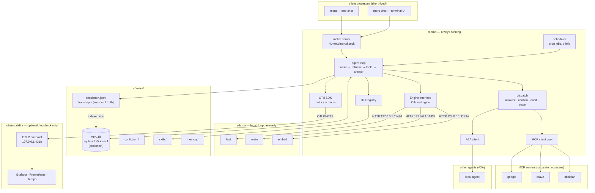
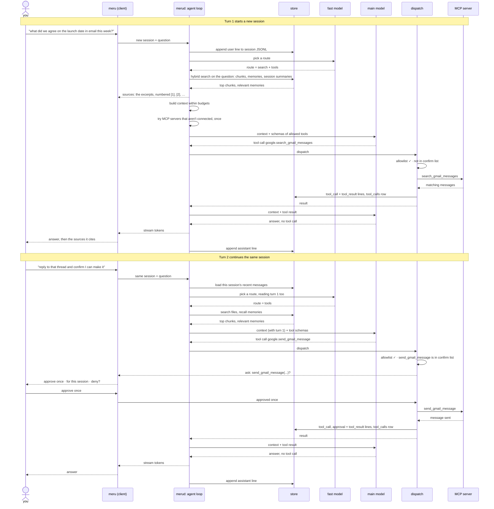
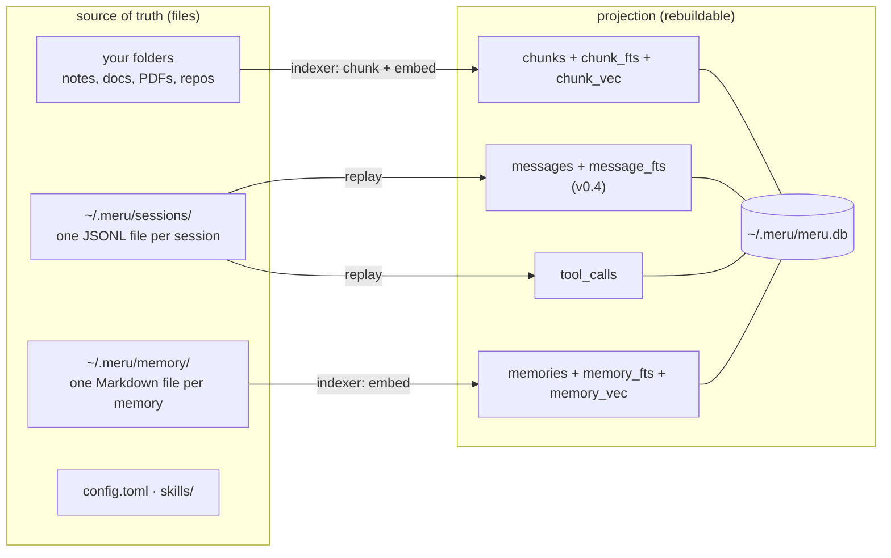
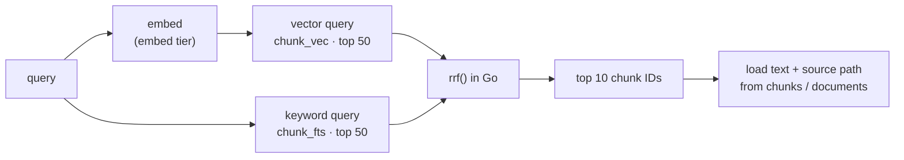
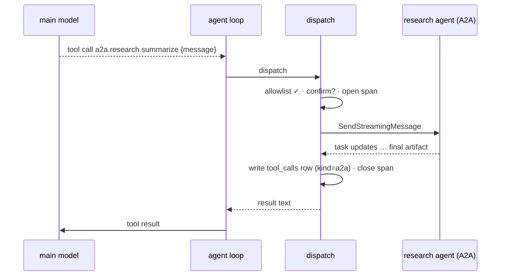

# Meru — Architecture

*Meru* (मेरु) is a personal AI assistant that runs on a machine you control. This
document describes how it works and why.

This is the level-300 document: the full design, for people building Meru. For a
shorter start, read [level 100](docs/architecture/100.md) (the big picture) and
[level 200](docs/architecture/200.md) (how it works). All three are also
[web pages](https://aarora79.github.io/meru/architecture/).

> We wrote this design before the code. If the code and this file disagree, one of
> them has a bug; say which.

## Principles

1. **Nothing leaves the machine by accident.** Meru connects only to loopback, except
   to A2A agents and MCP servers you mark as remote in config. Meru measures itself,
   but no telemetry leaves the machine, and the codebase has no path that sends a
   prompt to a cloud model.
   MCP servers are separate programs: one you add, such as web search or Gmail, can
   reach the network on its own (see [MCP](#mcp)).
2. **Files are the source of truth; SQLite is a projection.** Meru can rebuild
   everything in the database from your files and config. Delete `meru.db` and it
   re-indexes.
3. **You can inspect everything.** Memories and skills are Markdown files, and
   answers cite the files they drew on. Meru traces and times every turn, so you can
   find out why it said something and why it took so long.
4. **Few, narrow abstractions.** One engine interface, one store, one agent loop we
   own, and two wire protocols: MCP (Model Context Protocol) for tools and A2A
   (Agent2Agent) for other agents. Broad LLM frameworks change their APIs every few
   releases, and we don't want to chase them.
5. **Fast or unused.** People stop asking an assistant that makes them wait. The
   process model below exists to keep answers quick.
6. **Simple wins every time.** Pick the design with fewer moving parts, even if it is
   slower or less general, until a measurement says otherwise. Write code that a
   developer new to Go can follow.

---

## Language and distribution

Meru is written in **Go**. `meru` and `merud` build as native binaries that you can
copy to another machine and run, with no interpreter or virtualenv.

### Why Go

We chose Go over Python, the usual language for AI tools, for these reasons:

1. **A small footprint.** Each program is one binary, typically tens of megabytes. A
   Python app ships an interpreter, a virtual environment and its packages, often
   hundreds of megabytes. `merud` never stops running, so its idle memory matters,
   and the `meru` client starts in milliseconds instead of waiting on Python imports.
2. **Easy distribution.** One command builds for macOS, Linux or Windows, on Intel or
   ARM. Installing Meru means copying a file: no Python version to match, no
   dependency conflicts, and a container image that holds little more than the
   binary.
3. **Room to scale.** Meru serves one person, but nothing stops one server from
   running many Merus. A company, a school or a home lab could give each person their
   own `merud`, all sharing one Ollama on the same GPU server. At that point the
   overhead of each daemon multiplies, and a lean compiled daemon lets one server hold
   many more people than an interpreted one would. The models dominate the cost on a
   single laptop; across a rack of servers, Meru's own overhead adds up.
4. **Concurrency built in.** A turn streams tokens, runs tool calls in parallel, keeps
   MCP connections open, and shares the process with the scheduler and the indexer.
   Goroutines and `context` cancellation handle that directly, without Python's
   global interpreter lock.
5. **Fewer dependencies.** Go's standard library covers HTTP, JSON, Unix sockets,
   cancellation, structured logging and embedding files in the binary. Fewer
   third-party packages means less supply-chain risk, which matters for a tool that
   reads your mail.
6. **Errors caught before it runs.** Static types and the compiler catch mistakes that
   Python finds only at runtime, which suits a daemon that runs for weeks.
7. **It keeps building.** Go's compatibility promise means code written today still
   compiles years from now, which matches the goal that Meru keeps working without
   anyone's permission.
8. **The ecosystem is already Go.** Ollama is written in Go, and the official MCP SDK,
   the A2A SDK, OpenTelemetry and Bubble Tea all have first-class Go libraries.

The trade-off: Python has the stronger libraries for machine learning and PDF
parsing. That is one reason models run in Ollama rather than inside Meru, and why PDF
extraction is still an open question.

Three things stay outside the binaries:

- **Ollama**, which runs the models (see [Engine layer](#engine-layer)).
- **The observability stack**, which you can skip (see [Observability](#observability)).
- **MCP servers and A2A agents**, which run as their own processes.

The store uses `ncruces/go-sqlite3`, a Go library that runs SQLite compiled to
WebAssembly, with FTS5 and vec1, SQLite's own vector extension, built in. It needs no
cgo (Go's bridge to C code), so a plain `go build` works without a C compiler (see
[Storage](#storage)), and one command builds for another platform:
`GOOS=linux GOARCH=amd64 go build ./...`.

### Platforms

Every part Meru depends on runs on all three major desktop and server systems:
Ollama, SQLite, Go's Unix sockets (Windows 10 and later has them too) and the
OpenTelemetry stack.

| Platform | Status | Restarts `merud` after a reboot |
| --- | --- | --- |
| macOS, Apple silicon | supported and tested; the development machine is a Mac Studio (M4 Max, 64 GB) | `launchd` |
| Linux, x86-64 or arm64 (home servers, cloud VMs such as EC2) | supported | `systemd` |
| Windows 10 and later | should work; not tested at first | a Windows service |

Code must not assume one platform: build paths with `filepath`, find the home
directory with `os.UserHomeDir`, and keep platform-specific code behind Go build tags
in as few files as possible.

**On a cloud server** such as EC2, Meru still sends no prompt to a model provider,
but your notes, email and transcripts live on that server. Meru's promise is "a
machine you control"; where that machine sits is your call. You'd run `meru` over SSH,
because it reaches `merud` through a local socket.

---

## The shape: daemon + thin client

A command-line tool that starts, loads a model, answers and exits would be too slow:
the `full` profile's main model is ~18 GB at 4-bit and takes many seconds to load
from disk. So Meru has two programs:

- **`merud`** runs all the time. It keeps models loaded in Ollama, owns the store,
  holds the MCP and A2A connections, runs the scheduler and the agent loop, and emits
  metrics and traces.
- **`meru`** is a thin client. It connects to `merud` over a Unix socket at
  `~/.meru/merud.sock`, starts in ~50 ms, streams the answer back and exits.

A daemon that keeps models warm can also run scheduled jobs for almost no extra
work. That is why we build `merud` first and add the scheduler to it later.



### Terminal UI

`meru chat` uses [Bubble Tea](https://github.com/charmbracelet/bubbletea), a Go
library for interactive terminal apps. A Bubble Tea program has three parts: a model
struct that holds the screen's state, an `Update` function that turns each event (a
key press, a window resize, a streamed token) into a new state, and a `View` function
that draws the state as text. The client reads tokens from the socket in a goroutine
and passes each one to the program with `program.Send`, so the answer grows on screen
as it arrives.

`meru chat` also uses Bubbles, from the same authors, for the text input and the
scrolling answer pane, and two more Charm libraries for its look:

- **Lip Gloss** styles the screen: a header with the profile, model, what the
  index holds (`2637 docs (11698 vectors, 84 MB)`, with `· indexing` while a
  scan runs), the session, the last hour's use (`1h: 4 questions · 18k in ·
  2.1k out`) and whether `merud` is reachable; "You" and "Meru" labels; a route badge on each
  answer, amber when the router fell back; and a stats line with time to first
  token, tokens per second and total time. Colors adapt to light and dark
  terminals, and `NO_COLOR` turns them off. The chat asks `merud` for the
  header's numbers every 5 seconds while a scan runs and every 30 seconds
  otherwise. Typing `/usage` opens a table of sessions, questions, tokens in
  and out, active time, files touched and tool calls for the last hour, today,
  this week, this month, the last 30 days and all time; `meru usage` prints
  the same table. Typing `/new` starts a new session, so a conversation that
  went wrong stops shaping the answers after it. In both clients, each source
  line is a link (OSC 8) to its `file://` path, which terminals that support
  links open on a click.
- **Glamour** renders each finished answer as Markdown: headings, lists, and code
  blocks with syntax highlighting. While the answer streams, the screen shows the
  raw text with a cursor, because half-written Markdown renders wrong.

The stats come from the `done` event that ends each reply, which carries the
turn's timings and token counts.

Answers always stream: `meru chat` and one-shot `meru` both show text as the model
writes it. Each tool call shows as a dim line inside the answer, `→ notes.search`
while it runs and `✓` or `✗` with its time or outcome when it ends. When `dispatch`
needs your approval, `meru chat` opens a box under that line with the tool's name
and arguments and three choices: approve once, approve for this session, or deny.
The box opens with deny selected, so a stray Enter runs nothing (see
[Approving a tool call](#approving-a-tool-call)).

The UI code holds no model or store logic; it draws what `merud` sends. One-shot
`meru "..."` doesn't use Bubble Tea at all: it prints the stream as plain text, which
also keeps it usable in scripts and pipes.

---

## A question, end to end

The diagram below follows two turns of one conversation. The first turn searches
your files and calls a read-only tool. The second turn builds on the first and calls
a tool that changes something, so Meru asks you before it runs. Later sections
explain each step in detail.



### Who decides what

| Decision | Made by | How |
| --- | --- | --- |
| Answer directly, search, call tools, or search and call tools | the `fast` model (the router) | It reads the probability of each route letter from one decoded token, and falls back to search and tools when unsure. `merud` searches anyway when a `direct` question names an indexed folder, and adds tools when a question names a connected tool server. From v0.4, a separate short call picks the skills to load |
| What to search for | `merud`, with no model | The question as you typed it. A question with three or more words that aren't filler names its own subject and is searched alone. A shorter one is a follow-up: `merud` appends the session's latest earlier question that names a subject, because "and the one after that?" finds nothing on its own. It skips a question made only of filler words, such as "try the last question again" |
| Which tools the model may use | you, in `config.toml` | Only tools in each server's or agent's `allow` list reach the model; the rest don't exist to it. Each `[[commands]]` entry is one tool. The built-in tools need no entry |
| Which tool to call, with what arguments | the `main` model | It reads each allowed tool's name, description and argument schema, as the MCP server, agent card or `[[commands]]` entry wrote them, and picks. For a local command it picks only the parameter values; the program and its flags come from config |
| Whether a call runs without asking | you, in `config.toml` and at the prompt | `dispatch` stops and asks when the tool is in its entry's `confirm` list, or its `[[commands]]` entry says `confirm = true`, unless you already approved that tool for this session. `configure` asks every time |
| When the turn ends | the `main` model, with a cap | The turn ends when the model answers without calling a tool, or at the round cap (`[agent] max_rounds`, default 8). The last round offers no tools, so the model has to answer |

The `tools` and `search+tools` routes offer every allowed tool. `search` offers
the three read-only file tools, `read_file`, `list_folder` and `grep`, and the
local commands that don't ask first. A question such as "write about everything
in my work folder" lands on `search`, and ten excerpts can't cover a folder. So
does "what changed in the meru repo this week?" when `meru` is an indexed folder,
and a declared `git log` answers it. A command with `confirm = true` changes
something, so it waits for a tools route. `direct` offers none. The model can't
call a tool it hasn't seen, and the prompt stays shorter.

### Approving a tool call

When `dispatch` reaches a tool in the `confirm` list, the client shows the tool's name
and arguments and offers the choices `merud` sends, at most these three:

| Choice | What happens |
| --- | --- |
| Approve once | This call runs. The next call to the same tool asks again. |
| Approve for this session | This call runs, and `dispatch` skips the prompt for that tool until the session ends. The approval covers the tool, whatever its arguments. |
| Deny | The call doesn't run. Its outcome is `declined`, and the model hears that you said no, so it can answer without the tool or ask you what to do. |

- **The question travels on the same socket.** `merud` sends the client an
  `approval` event with an ID, the call and the choices it offers, and holds the
  call. The client writes back one `Reply` line with that ID and a choice. A choice
  the approval didn't offer counts as deny.
- **Each choice is recorded.** `merud` appends an `approval` line to the transcript,
  between the call's `tool_call` and `tool_result` lines, and the `tool_calls` row
  keeps the choice:

  ```json
  {"ts":"2026-09-23T10:17:21Z","type":"approval","call_id":"call-1","server":"google","tool":"send_gmail_message","choice":"once","trace_id":"9c2e…"}
  ```

- **Built-in tools have their own confirm list.** Built-ins belong to no server
  entry, so `config.toml` gives them one section:

  ```toml
  [builtin]
  confirm = ["write_file"]   # the shipped default; add "remember" to approve each memory
  ```

  The built-in tools are `configure`, which always asks, whatever this list says
  (see [First run and setup](#first-run-and-setup)); `remember`, which saves a
  memory without asking unless you list it here; `write_file`, which asks
  before each file it saves because the shipped list names it; and three
  read-only file tools that run without asking unless you list them:

  | Tool | What it returns |
  | --- | --- |
  | `read_file` | A file's whole text, 12,000 characters per call, with the offset for the next call. PDFs come page by page. |
  | `list_folder` | A folder's folders, then its files with size and modified date, 1 to 3 levels deep, at most 300 entries. |
  | `grep` | Every line that holds a word or an RE2 regular expression, as `path:line: text`, until 200 lines, 5 seconds or 20,000 files. |

  The file tools reach only the `[index] folders`, and they skip what the
  indexer skips (see [What stays out](#what-stays-out)): they never follow a
  symlink, and they refuse secret, hidden, ignored, binary and oversized files
  with the indexer's reason. They read nothing that search couldn't already
  put in the prompt. `merud` leaves them out when no folder is listed.

  In `tool_calls` and the metrics, a built-in call has `kind = "builtin"` and
  `server = "meru"`.
- **Local commands ask per entry.** A `[[commands]]` entry with `confirm = true`
  asks before each run and offers all three choices; one without runs without
  asking. Read-only commands run freely, and anything that changes something
  should ask. A command call has `kind = "command"`, `server = "meru"` and
  `tool = "cmd.<name>"`, and its `tool_call` line, prompt and row show the argv
  it runs (see [Local commands](#local-commands)).
- **Session approvals stay inside the running `merud`.** `dispatch` keeps them in
  memory, per session and tool. They end with the session or with `merud`, and
  never reach `config.toml`. To stop Meru asking about a tool for good, remove it
  from the `confirm` list yourself; config stays the one place that grants lasting
  trust.
- **One-shot `meru "..."`** asks on standard error with the same choices, as
  `[o]nce [s]ession [d]eny`, so the answer on standard output stays clean. Its
  session ends with the answer, so "for this session" covers only this question.
  When standard input isn't a terminal (a script or a pipe), nobody can answer, so
  the client denies without asking and says so.
- **Nobody to ask means no.** A scheduled job, or a client that passed no way to
  ask, can't say yes, so `dispatch` ends every call that needs a yes as `declined`
  without a prompt. A job's output says which calls it skipped.

### How a conversation continues

- **A session is one transcript file.** `meru chat` keeps one session open until you
  quit. Each `meru "..."` one-shot starts a new session.
- **Each turn starts with the session's history.** `merud` loads your earlier
  questions and Meru's earlier answers from this session, newest first, until the
  history budget is full. Older turns drop out of the prompt but stay in the
  transcript. From v0.4, search can find them there.
- **Earlier tool results stay out of the history.** The answer that used a result
  already carries what mattered from it, and raw results can run to thousands of
  tokens. The transcript keeps the full results.
- **The router sees the history too**, so it can tell that a follow-up like "reply
  to that thread and confirm I can make it" needs tools. It picks a route and nothing else;
  no model rewrites the follow-up.
- **A follow-up search adds an earlier question.** On the search routes, a short
  question (fewer than three words that aren't filler) gets the session's latest
  earlier question appended, so "and the one after that?" still finds the right
  files. A longer question names its own subject and is searched alone: appending
  a question about a trip to one about a work project filled the results with
  travel papers. It skips earlier questions made only
  of filler words, so "search again" after "try that again" still carries the
  subject from before them.
- **The `main` model resolves the reference.** It reads turn 1's answer in the
  history, which named the thread and the date agreed in it, and works out which
  thread "that thread" means. It reads answers, not the raw tool results behind
  them.

---

## Model tiers

Meru gives models three jobs, called tiers. Code depends on the tiers; `config.toml`
says which model fills each one.

| Tier | Job |
| --- | --- |
| `fast` | routing, classification, trivial answers |
| `main` | reasoning, writing the answer, choosing tools |
| `embed` | embeddings for the index and for queries |

Two profiles ship in `config.toml`. **`lite` is the default.**

| Tier | `lite` (default) | `full` |
| --- | --- | --- |
| `fast` | `hf.co/openbmb/MiniCPM5-2B-GGUF:Q4_K_M` (1.6 GB) | same |
| `main` | same model as `fast` | `qwen3.8:27b` (~18 GB, 4-bit) |
| `embed` | `nomic-embed-text` (~260 MB, 768 dims) | `qwen3-embedding:0.6b` (1024 dims) |
| Hardware | 16 GB of RAM; runs on a CPU, faster with a GPU or Apple silicon | Apple silicon with 32 GB (64 GB comfortable), or a GPU with ~24 GB of memory |

- **`lite`** uses two small models. It downloads in a couple of
  minutes and runs on almost any computer. One model fills both `fast` and `main`, so
  only two models sit in memory.
- **`full`** swaps in Qwen 3.8 27B, a dense model built for agent and tool work, and
  a stronger embedding model. On Apple silicon, Ollama also offers the
  `qwen3.8:27b-mlx` tag, which runs the same model on its MLX backend; we'll measure
  which tag is faster.

`merud` keeps each model loaded by asking Ollama for `keep_alive: -1`, and warms every
tier at startup. Ollama must allow enough models in memory at once
(`OLLAMA_MAX_LOADED_MODELS`, 3 for `full`).

The `fast` tier needs a runtime that reports log probabilities, because
[routing](#routing) reads them. Ollama added them in v0.12.11; `merud` reads
`/api/version` at startup and refuses to start on anything older, naming both
versions. Routing costs no extra model: the `fast` model is already loaded.

A new embedding model makes vectors of a different size, and every stored vector
goes stale. The store records the embedding model's name and vector size. When
either stops matching config, the store drops every vector and keeps the text, so
keyword search keeps working while the indexer re-embeds your files (see
[Storage](#storage)).

A 120B model at 4-bit needs ~60 GB, which leaves even the 64 GB development machine
no room and makes it swap. Meru won't support models that size.

---

## Engine layer

The interface has four methods:

```go
type Engine interface {
    Generate(ctx context.Context, msgs []Message, tools []ToolSpec, opts Options) (Completion, error)
    Stream(ctx context.Context, msgs []Message, tools []ToolSpec, opts Options) (iter.Seq2[Delta, error], error)
    Embed(ctx context.Context, texts []string) ([]Vector, error)
    Info(ctx context.Context) (ModelInfo, error)
}
```

**`OllamaEngine` is the only implementation.** It talks to Ollama over HTTP on
loopback and refuses to start if the configured URL points anywhere else. It is the
codebase's only HTTP client for a model runtime, and it can't reach a cloud model.

Each model writes tool calls in its own format; Ollama converts them to structured
JSON, and the engine converts that JSON to Meru's own types. The agent loop never
sees a model-specific token. Each `Completion` also carries Ollama's counters
(`prompt_eval_count`, `eval_count`, `load_duration`, `prompt_eval_duration`,
`eval_duration`), which feed [Observability](#observability).

For [routing](#routing), `Options` gains two fields, `LogProbs` and `TopLogProbs`,
and `Completion` gains `LogProbs`: for each generated position, the chosen token and
the alternatives the model weighed, each with its log probability. Both default to
off, so other callers see no change, and the interface keeps its four methods.

Two engines may come later, behind the same interface:

- **`LlamaCppEngine`** would compile llama.cpp into `merud` through cgo, using the
  GPU (Metal on a Mac, CUDA on NVIDIA). Meru would then need no Ollama install, but it would have
  to parse each model's tool-call format itself.
- **`MLXEngine`**, if MLX gets usable C or Go bindings and runs faster enough than
  llama.cpp to justify a second backend.

---

## Agent loop

We write the agent loop ourselves; we looked at Eino and ADK Go and chose not to use
a framework. The loop is small, and every rule Meru enforces lives inside it: the
allowlist, the audit log, the context budget and confirmation prompts. We want that
code where we can read it, not inside another project's callbacks. The only
third-party code in the loop is the official MCP Go SDK and the A2A Go SDK.

A turn has five steps. [A question, end to end](#a-question-end-to-end) shows them in
order.

1. **Route.** The `fast` model picks one of four routes: answer directly, search your
   files first (RAG, retrieval-augmented generation), call tools, or search and call
   tools. It picks by classification, reading one decoded token's probabilities (see
   [Routing](#routing)). On the search routes, `merud` then searches your files for
   the question, with an earlier question appended on a follow-up. No model
   rewrites the query. The `tools` route searches too: the router sends some
   questions about your files there, and an answer from the files beats one from
   the model alone. Three rules then adjust the route (see [Routing](#routing)):
   a `direct` question that names an indexed folder becomes `search`, a
   question that names a connected tool server gets tools, and so does a
   question that says "remember". From v0.4, a separate
   short call picks the skills to load.
2. **Build the context.** The system prompt puts the parts that stay the same
   from turn to turn first: the configured prompt, the rule that "I" means the
   user, today's date (a model knows only its training data, so without it a trip
   that ended last week reads as one still to come), your profile, the note on your folders, the tools note, and the list of
   skills. The parts each question changes come after: recalled memories, the
   picked skills' instructions, and file excerpts with earlier conversations.
   Ollama reuses its work on a prompt's opening until the first token that
   differs, so this order lets a follow-up reprocess only the changing parts, the
   history and the question. Each part has its own cap, in characters (a token is
   about four):

   | Part | Cap | Past the cap |
   | --- | --- | --- |
   | Profile (`me`, `preferences`) | 2,000 | the oldest facts drop |
   | Recalled memories | 2,400 | the lowest-ranked drop |
   | Skill instructions | 12,000 | the first skill stays whole; the second is cut |
   | Earlier conversations | 2,400 | the lowest-ranked drop |
   | History | 8,000 | the oldest turns drop, each question with its answer |

   File excerpts need no cap of their own: a search keeps 10 chunks of about 500
   tokens. The caps keep one part from crowding out the others; a `lite` turn
   uses well under a tenth of the model's 131k-token window. On the `tools` and
   `search+tools` routes the model also gets the allowed tools' schemas; on
   `search` it gets the three file tools' schemas and those of the local
   commands that don't ask, with a note that says it may read whole files, list
   folders and grep when the excerpts fall short, and run the `cmd.` tools.
   `meru.context.tokens` records each part's size per turn, to tune the caps by.
   On a route that offers tools, the loop first gives each MCP server that isn't
   connected one try, then lists the tools (see [MCP](#mcp)).
3. **Call `main`.** Stream text to the client as it arrives. Ollama sends each tool
   call whole, in a chunk of its own, and the loop collects them. It tells the
   client about each call with a `tool_call` event.
4. **Dispatch tools.** Every call goes through one function, `dispatch`, in this
   order:
   1. **Allowlist.** A tool that no backend offers is `denied`. It doesn't run,
      but it still gets a `tool_call` line, a `tool_result` line and a
      `tool_calls` row, so a model that keeps reaching for forbidden tools shows
      up in the log.
   2. **Transcript.** The `tool_call` line goes in before the call runs. If it
      can't be written, the call doesn't run.
   3. **Confirm.** Each tool asks never, asks unless approved for this session, or
      asks every time (`configure` only). If you say no, or nobody can be asked,
      the outcome is `declined`.
   4. **Call.** The MCP server, A2A agent, built-in tool or local command runs,
      under its own timeout. The outcome is `ok`, `error`, `timeout` or
      `cancelled`.
   5. **Record.** `dispatch` removes secret values from the arguments, the result
      and any error text, then writes the `tool_result` line, the `tool_calls` row,
      the metrics and the `meru.dispatch` span. The model reads up to 16,000
      characters of the result, with a note when `dispatch` cut it; the transcript
      and the row keep 4,000.

   No other code path reaches a server, agent, built-in tool or local command. The calls of one
   round run at the same time (`errgroup`), and each sends its `tool_result` event
   to the client as it ends. A denied or declined call still reaches the model as
   a result, so it can answer without the tool or ask you what to do.
5. **Repeat** from step 3 with the tool results, until the model answers without
   calling a tool or the turn reaches `[agent] max_rounds` model calls (default 8).
   The last allowed round offers no tools, so the model has to answer with what it
   has.

`dispatch` sees the tools through one interface, `Backend`, with four
implementations in a fixed order: the built-in tools, the local commands, the MCP
client pool, then the A2A client. When two backends offer the same name, the
first keeps it, so no MCP server can shadow `configure` or a `cmd.` tool.

A `context.Context` runs through the whole turn. If the client disconnects or you
press Ctrl-C, `merud` cancels the turn: generation stops, in-flight tool calls are
dropped, and their `tool_calls` rows record the cancellation.

### Routing

A small model asked to write its route as JSON (JavaScript Object Notation) fails in
three ways: it writes broken JSON, invents a fifth route, or answers wrong with no
sign that it was unsure. So the router doesn't ask for text. It treats the route as a
classification and reads the answer from the model's probabilities:

1. The prompt opens with four lettered options (A = answer directly, B = search,
   C = tools, D = search and tools) and two examples per route. Each option's
   description names the questions that belong to it and the ones that don't.
   Option B also names the folders in `[index] folders` and says that questions
   about projects kept there, by name, are B. Without that line the model can't
   tell that "meru" in "what database does meru use" is your own project. The
   session history and the question come last, and the prompt ends with
   `Answer: `. The fixed part, folders included, stays the same from turn to turn,
   so Ollama reuses its work on it from the previous turn.
2. `merud` asks Ollama's `/api/chat` for one token with log probabilities
   (`num_predict = 1`, `logprobs = true`, `top_logprobs = 20`) and with thinking
   off (`think = false`). A thinking model such as MiniCPM5 otherwise spends its
   one token starting its hidden reasoning, and no letter comes back.
3. The router keeps the alternatives whose text is one of the four letters, turns
   each log probability back into a probability, divides by a fitted temperature,
   and normalizes the four so they sum to 1.
4. The most likely letter is the route, and its probability is the confidence.

The model decodes one token, so routing costs a prompt evaluation and nothing more,
and it can't name a route that doesn't exist. When the confidence falls below
`min_confidence`, or fewer than two letters appear at all, the router takes the
fallback route, `search+tools`. That's the one route that can't fail a turn for
lack of context: an unsure router spends tokens rather than guesses.

```toml
[router]
top_logprobs   = 20             # Ollama's cap
temperature    = 1.25           # fitted by `make router-eval`
min_confidence = 0.45           # below this, take the fallback
fallback       = "search+tools"
```

The router lives in `internal/router` as one function, `Decide`, which returns the
route, its confidence, the full distribution and an outcome (`ok`,
`low_confidence` or `degraded`). A model that answers unclearly isn't an error;
`Decide` returns the fallback and says why.

Three rules override the router, in this order. The first: when it picks `direct` and
the question names an indexed folder as a whole word, such as "meru" for
`~/repos/meru`, the agent loop changes the route to `search`. Even with the folders
in the prompt, the router sent "what database does Meru use to store its index?" to
`direct` at 0.621, and the model made up an answer. A wrong guess costs one search
of about 50 ms, and the model uses only the excerpts that help. The turn's route
event, log line and span show `search`; the `meru.route` span and metric still
record what the router chose. The rule matches the last part of each folder path, in
any case, and skips names under three letters. "hey meru, what's the capital of
France" searches too, because the assistant shares its name with the folder.

The second: when the question names a connected MCP server or A2A agent as a whole
word, and the route is `direct` or `search`, the agent loop adds the rest. `direct` becomes
`tools`, and `search` becomes `search+tools`. The names come from the tools
`dispatch` offers, such as "obsidian" from `obsidian.search_vault` and "research"
from `a2a.research.summarize`, and the loop reads them on each turn, because
`configure` can add a server while `merud` runs. Built-in tools don't count: their
owner is `meru`, the assistant's own name, which would match most questions. The
router sent "Search my Obsidian vault for notes mentioning 'AI'" to `search` at
0.65; with no tools offered, the model said it couldn't search the vault. With the
rule it listed the vaults, searched one and answered. A wrong guess costs a prompt
that holds the tool schemas.

The third: when the question holds "remember" as a whole word and the route is
`direct` or `search`, the loop adds the rest, so the model can call `remember`. "Remember that I
work on the registry team" reads like chit-chat to the router, and a `direct` turn
would answer "noted" and save nothing.

`make router-eval` scores the router against the local Ollama on a labelled set of
135 questions, 40 of them held out, and fits the temperature. At 1.25 the
probabilities sit close to calibrated, so `min_confidence = 0.45` means what it
says. Refit after any change to the prompt, the examples or the `fast` model.

The full design, with the prompt contract, tests and calibration results, is in
[docs/fast-router.md](docs/fast-router.md).

---

## Storage

Meru keeps two kinds of data, with one rule between them: **files hold the truth,
and the database indexes them.** Delete `meru.db` and `merud` rebuilds it.



### Session transcripts

Each session is one JSON Lines (JSONL) file: one JSON object per line, one line per
event. `merud` appends a line as each event happens and never rewrites old ones.

```text
~/.meru/sessions/2026/09/2026-09-23T101502-7f3a.jsonl
```

```json
{"ts":"2026-09-23T10:15:02Z","type":"user","text":"what did we agree on the launch date in email this week?","trace_id":"4bf9…"}
{"ts":"2026-09-23T10:15:03Z","type":"tool_call","call_id":"call-1","kind":"mcp","server":"google","tool":"search_gmail_messages","args":{"query":"launch date"},"trace_id":"4bf9…"}
{"ts":"2026-09-23T10:15:04Z","type":"tool_result","call_id":"call-1","outcome":"ok","ok":true,"ms":812,"result":"Re: Launch date, from Sam…","trace_id":"4bf9…"}
{"ts":"2026-09-23T10:15:09Z","type":"assistant","text":"Sam and Priya agreed on 14 October…","tokens_in":2310,"tokens_out":188,"trace_id":"4bf9…"}
{"ts":"2026-09-23T10:31:40Z","type":"summary","text":"Found the launch date agreed in email: 14 October, in the thread with Sam."}
```

A tool call's lines share a `call_id`, because the calls of one round run at the
same time and their lines can interleave. An `approval` line sits between the two
when the call asked you first. `result` holds the first 4,000 characters of what
the tool returned, with secrets removed.

You can `grep`, `tail -f` or back up these files with no special tools, and a crash
loses at most the line being written. The database keeps a copy for search and for
`meru log`.

### The database

`~/.meru/meru.db` is one SQLite file, opened through `ncruces/go-sqlite3`. FTS5,
SQLite's built-in full-text search, handles keywords. Vectors sit in plain tables,
one row per vector, and vec1, SQLite's own vector extension, supplies the distance
function that compares them. `merud` creates `meru.db` and its `-wal` and `-shm`
files with mode `0600`, so only you can read them.

| Table | Holds | Rebuilt from |
| --- | --- | --- |
| `documents` | indexed source files: path, mtime, hash, type | your folders |
| `chunks` | pieces of each file's text, plus metadata and the parent document | your folders |
| `chunk_vec` | one vector per chunk, a blob of 32-bit floats scaled to length 1 | chunks, re-embedded |
| `chunk_fts` | keyword index over chunks (FTS5) | chunks |
| `sessions` / `messages` (v0.4) | every session and message, plus each session's summary, for context and `meru log` | `sessions/*.jsonl` |
| `session_vec` (v0.4) | one vector per session summary, for "what did we decide last week" | session summaries |
| `message_fts` (v0.4) | keyword index over messages, for "what did we say about X" | messages |
| `summary_fts` (v0.4) | keyword index over session summaries | session summaries |
| `tool_calls` | audit log: every MCP, A2A, built-in and local command call, with its call ID, session, `kind` (`mcp`, `a2a`, `builtin` or `command`), server, tool, args, result (first 4,000 characters), outcome, approval choice, duration and trace ID | `sessions/*.jsonl` |
| `memories` (v0.4) | one row per memory file: its ID (`<kind>/<name>.md`), kind, text, created, source, mtime and content hash | `memory/*/*.md` |
| `memory_vec` / `memory_fts` (v0.4) | vector and keyword indexes over memories | memories |
| `turns` | one row per answered question: session, start time, source, route, tokens in and out, duration, tool calls, the files its prompt read, and trace ID. `meru usage` and the chat's usage numbers count it | `sessions/*.jsonl` (the assistant line holds route, duration and files) |
| `jobs` / `job_runs` (v0.5) | scheduled jobs and each run's outcome | jobs: `[[jobs]]` in `config.toml`; runs: the job's session transcript |
| `meta` | schema version, embedding model name and vector size | config |

v0.2 built `documents`, `chunks`, `chunk_vec`, `chunk_fts` and `meta`, and v0.3
added `tool_calls`. Each other table arrives with the milestone marked beside it.
v0.4 replays the transcripts into `sessions`, `messages` and their indexes: at
startup, after each turn and after each summary. `sessions` records how many bytes
of each file it has read, so a replay reads only the lines added since the last one.

`tool_calls` is mandatory. An assistant with tools that change things needs a record
you can read afterwards. `dispatch` writes a row as each call ends, and `meru log`
reads the newest rows. When `merud` starts and finds the table empty, it rebuilds
the table from the transcripts, pairing each call's lines by `call_id`; a call with
no `tool_result` line, because `merud` stopped mid-call, gets the outcome
`cancelled`. `messages` and `tool_calls` store the trace ID of their turn, so you
can jump from a slow trace in Grafana to the rows it produced, and back.

When the embedding model's name or vector size in `meta` stops matching config, the
store deletes every row of `chunk_vec`, `memory_vec` and `session_vec` and keeps
`documents`, `chunks`, `memories` and `sessions`. Keyword search keeps working while
the indexer re-embeds. The store reports the gap by counting chunks that lack a
vector (`NeedsReembed`), so the count stays right if `merud` stops halfway through.
The memory syncer re-embeds each memory that lacks a vector, and the summarizer
does the same for each summary.

### Why this driver and this vector store

- **`ncruces/go-sqlite3` with vec1 and FTS5.** No cgo, no C compiler, and vectors
  live in the same file as everything else. One query can join vector hits, keyword
  hits and document metadata. vec1 ships with the driver, so Meru adds no extension
  of its own.
- **A plain table, no vector index.** Vector search reads every row of `chunk_vec`
  and orders by `vec1_l2_distance(vector, ?) / 2`. The store keeps every vector at
  length 1, and for such vectors half the squared straight-line distance equals the
  cosine distance that embedding models are trained for. vec1 also offers an exact
  "flat" index, but writes slowed as it grew: replacing one 100-chunk file took
  186 ms at 10,000 chunks, and indexing 100,000 chunks would take about ten minutes.
  Plain rows index 100,000 chunks in 6.1 s.
- **Measured.** On the development machine (M4 Max), with 768-dimension vectors and
  100 chunks per file:

  | Operation | 10,000 chunks | 100,000 chunks |
  | --- | --- | --- |
  | index every chunk | 0.59 s | 6.1 s |
  | replace one file | 6.4 ms | 6.1 ms |
  | vector search, top 50 | 13 ms | 147 ms |
  | keyword search, top 50 | 9 ms | 90 ms |

  Search time grows with the index, because both searches read every candidate;
  write time doesn't. `meru.retrieval.duration` will show when search needs to get
  faster. The first fixes are fewer dimensions, or computing distances in Go, not
  another database.
- **Rejected:** `sqlite-vec`, because its Go bindings work only with the 2024
  release of the driver (v0.17.1), 18 releases behind and without the security
  fixes since, and the driver already bundles vec1, which supplies the distance
  function the store needs. Also `chromem-go` (pure Go, but a second store we
  can't join with keyword search), LanceDB and DuckDB (both need cgo and do more
  than we need), Qdrant and Chroma (extra server processes).

---

## Getting your content in

The indexer reads the folders you name into the store, keeps them current while
`merud` runs, and reads nothing else on disk.

### What gets indexed

Only the folders under `[index] folders` in `config.toml`. The list ships empty, so a
fresh Meru indexes nothing, and it reads your home folder only if you list `~`.
`merud` reads the list when it starts, so a change takes a restart.

```toml
[index]
folders        = ["~/notes", "~/Documents/papers"]
ignore         = ["*.log", "drafts/"]   # .gitignore-style, on top of the built-in list
max_file_mb    = 5
chunk_tokens   = 500
overlap_tokens = 50
watch          = true
```

Inside those folders the indexer checks each entry against these rules, in order,
and skips it at the first one that matches:

| Order | Skipped as | What it catches |
| --- | --- | --- |
| 1 | `symlink` | any symbolic link; the indexer never follows one |
| 2 | `secret` | `.env*`, `*.pem`, `*.key`, `id_rsa*`, `*.kdbx`, `credentials*`, `.netrc` and similar |
| 3 | `hidden` | a name that starts with `.` |
| 4 | `build-folder` | `node_modules`, `.venv`, `venv`, `vendor`, `target`, `dist`, `build`, `__pycache__` |
| 5 | `ignored` | `[index] ignore`, then each folder's `.gitignore` and `.meruignore`, from the top folder down |
| 6 | `media`, `binary`, `unsupported` | by extension: images, audio, video, archives, programs, databases, and any type with no chunker |
| 7 | `too-large` | over `max_file_mb` |
| 8 | `binary` | a NUL byte in the first 8 KB (PDFs excepted) |

- **Secrets sit beyond any ignore file's reach.** No `.gitignore` or `.meruignore`
  line can bring one back, because a key in the index would end up in a prompt.
- **Config patterns come next**, and no ignore file can undo them either.
- **Each skip has a reason.** A scan counts skips by reason, and `merud -v` logs
  each skipped path with its reason.

A `.meruignore` uses `.gitignore` syntax: one pattern per line, `#` for a comment,
`*` for any run of characters within a name, `**/` for any number of folders, a
trailing `/` for folders only, a `/` at the start to anchor the pattern to the
file's own folder, and `!` to re-include. Git's rule holds across the ignore files:
the last matching line wins, and a deeper folder's file beats a shallower one's.
Meru reads `.meruignore` after `.gitignore` in the same folder, so it can skip more
for Meru alone, or bring back with `!name` a file git ignores.

### Chunking

The indexer cuts each file into chunks along its own structure:

| File | Split by | Heading kept | Citation points to |
| --- | --- | --- | --- |
| Markdown | heading, then paragraphs | the heading path, such as `Garden > Spring` | lines |
| Go | top-level declaration, read with Go's own parser | the declaration's name | lines |
| other code, plain text | blank-line blocks | none | lines |
| HTML | `<h1>` to `<h6>`, then paragraphs; scripts, styles and `<head>` dropped | the heading path | none |
| PDF | page, then paragraphs; plain text, no layout | none | page |

- **Size.** A chunk holds about `chunk_tokens` (500) tokens and repeats the last
  `overlap_tokens` (50) of the chunk before it, so a sentence cut at a boundary
  still appears whole in one chunk. Meru estimates a token as four characters,
  because Ollama doesn't expose the embedding model's tokenizer.
- **No chunk passes the limit.** A paragraph too big for one chunk gets split at
  line breaks, then between words, and last at a fixed width.
- **The heading path travels with the text.** Each embedded chunk starts with its
  heading path, so the third chunk of a long "Garden > Spring" section still embeds
  as being about the garden in spring.

### Keeping it current

- **Changed files only.** At startup `merud` scans every folder and compares each
  file's mtime and SHA-256 hash with the store's copy. It re-chunks and re-embeds a
  file only when either differs. It hashes every file, because some sync tools and
  editors keep the mtime when the content changes.
- **Removals.** After a folder's scan, the indexer deletes the store's entries for
  files the scan didn't keep: deleted files, and files a new ignore rule now covers.
- **Missing folders keep their entries.** A folder that doesn't exist, such as one
  on an unplugged drive, and a folder the scan can't read both keep what the store
  holds for them.
- **Watching.** With `watch = true`, `merud` asks the operating system to report
  changes in every folder the skip rules keep. It indexes a changed path once the
  path has been quiet for 500 ms, so an editor can finish a save that takes several
  writes. When the operating system refuses another watch (Linux's
  `fs.inotify.max_user_watches`, or the open-file limit on macOS), `merud` logs one
  warning and keeps the watches it has; the next startup scan catches the rest.
- **On demand.** `meru index` rescans every configured folder, `meru index <path>`
  rescans one folder or file inside them, and `meru index -status` prints counts.

### What stays out

- **Symlinks are never followed.** A link inside a folder could index files twice
  or loop, and a link out of it would break the promise that Meru reads only the
  folders you list. A link's target inside the folder gets indexed at its real path.
- **Email, calendar and Drive stay live.** Meru reaches them through their MCP
  servers at question time and copies none of them into `meru.db`. Answers see
  today's inbox, and your mail never lands in the index.

---

## Retrieval

Vector search misses exact strings such as project code names and error codes. BM25, the
standard keyword-ranking formula, misses paraphrase. Meru runs both.

[A question, end to end](#a-question-end-to-end) shows where retrieval sits in a turn,
and [Getting your content in](#getting-your-content-in) shows how files become
chunks: Markdown by heading, code by declaration or blank-line block, PDFs by page as
plain text with no layout.

### How hybrid search works

SQLite does both searches; our code merges the results.

A search runs on the `search`, `tools` and `search+tools` routes. `tools` searches
because the router sends some questions about your files there. It also runs on a
`direct` question that
names an indexed folder (see [Routing](#routing)). Its query is the question, with an earlier
question appended on a follow-up (see
[How a conversation continues](#how-a-conversation-continues)).

So far a turn searches file chunks. From v0.4 it also searches memories and the
summaries of past sessions. Each source gets the same keyword and meaning search,
`rrf` merges the results within that source, and each source has its own share of
the context budget, so one busy source can't crowd out the others.

| Piece | Comes from |
| --- | --- |
| Keyword search, ranked by BM25 | FTS5 (`ORDER BY rank`, where `rank` is BM25) |
| Similarity search, ranked by distance | every row of `chunk_vec`, with vec1's distance function (`ORDER BY vec1_l2_distance(vector, ?) / 2 LIMIT ?`) |
| Merging the two lists | our Go code: reciprocal-rank fusion |



The keyword query quotes every word of the query and joins them with `OR`, so text
from the user can never reach FTS5 as query syntax. It keeps the first 32 distinct
words, which is why the new question comes before the previous one.

`merud` runs the vector query and the keyword query one after the other, then merges the two
ranked lists with reciprocal-rank fusion (RRF). BM25 scores and vector distances use
different scales, so RRF ignores them and uses each chunk's position in each list:

```text
score(chunk) = Σ over lists  1 / (60 + rank of chunk in that list)
```

A chunk near the top of either list scores well, and one near the top of both scores
best. The constant 60 is the usual choice; it keeps the gap between rank 1 and rank 2
small.

```go
// rrf merges ranked lists of chunk IDs into one score per chunk.
func rrf(lists ...[]int64) map[int64]float64 {
    const k = 60
    scores := map[int64]float64{}
    for _, list := range lists {
        for rank, id := range list {
            scores[id] += 1.0 / float64(k+rank+1)
        }
    }
    return scores
}
```

SQLite could do the merge in one query with window functions and a full outer join.
We merge in Go instead:

- Two short queries and one small function are easier to read than one dense query.
- `rrf` is a pure function, so a table-driven test covers it without a database.
- Each stage gets its own timing in `meru.retrieval.duration` (`vector`, `fts`,
  `fusion`).
- Memory retrieval reuses `rrf` with a third list ranked by recency.

The extra query costs microseconds, because SQLite runs inside `merud`.

**Schema detail.** `chunk_fts` is an FTS5 *external content* table
(`content='chunks'`). It indexes the text in `chunks` without storing a second copy,
and its `rowid` equals the chunk ID. `chunk_vec` uses the same chunk ID as its key, so
both lists name chunks the same way and the merge needs no lookup.

The list sizes are fixed constants in `internal/retrieve`: 50 hits from each search
and 10 chunks after the merge. They aren't config keys. We'll tune them once we have
measurements from real questions.

### Citations

`merud` numbers the chunks it found and puts them in the prompt under "From your
files", with a rule that tells the model to cite each excerpt it uses as `[1]`,
`[2]` and so on, and never to invent one. When a search finds nothing, the prompt
says so instead, and the model answers without citing files.

The system prompt names the folders in `[index] folders` on every turn, says that
Meru searches them before it answers, and says the model can't open or list files
itself. With no folders set, it tells the model that Meru hasn't indexed anything
yet and where you add folders. Without this note a small model answers "I don't
have access to your files" while it reads excerpts from them, and can't say what
Meru indexes.

Before the first token, `merud` sends the client a `sources` event that lists each
excerpt with its number, path (as `~/…`), heading, and line range or PDF page. Once
the answer ends, one-shot `meru` prints a `Sources:` list and `meru chat` shows the
same list under the answer. Both list only the sources the answer cites, and an
answer that cites none gets no list: the model decides when a source matters. An
earlier rule listed every excerpt when the answer cited none, in case a small model
forgot to cite; in use it printed ten unrelated files under general answers and
under an answer built from an Obsidian search.

```text
The garden project sows tomatoes on 12 April [1].

Sources:
[1] ~/notes/garden.md, "Planting", lines 3–5
```

With a tiny index, every chunk lands in the top 10. A minimum fused score, or
keeping fewer than 10 chunks, would shorten the prompt; choosing either waits for
measurements (see [Open questions](#open-questions)).

---

## Memory

Each memory is a small Markdown file you can read, edit or delete by hand. The files
hold the truth; the database indexes them so Meru can search them, and rebuilds from
them if you delete it.

### Layout

One file per memory, and one folder per kind:

```text
~/.meru/memory/
  me/            who you are: role, family, where you live
  preferences/   how you like things done
  projects/      ongoing work, goals, deadlines
  people/        people you mention and how they relate to you
  reference/     where things live: accounts, URLs, tools
  other/         anything worth keeping that fits no folder above
```

```markdown
---
created: 2026-09-23
source: session 2026-09-23T101502-7f3a
---
Prefers short replies, with the answer in the first sentence.
```

- **The folder is the kind.** No `kind:` field can disagree with the path, and you can
  browse by kind in a file manager or with `ls`.
- **One fact per file**, so forgetting a memory means deleting one file. You can do
  that by hand, or `meru memory forget` does it.
- **`other/` holds anything that fits no other folder.** If it fills up with one kind
  of thing, create a new folder for that kind; Meru picks it up with no code change.
  A kind's folder name uses letters, digits, `-` and `_`; Meru skips any other
  folder. `merud` creates the six default folders when it opens the memory folder.
- **The frontmatter records when and where** each memory came from, so you can trace
  it back to the session that produced it.
- **Memories stay small.** Meru saves a new memory only up to 4 KiB of text, and
  reads a memory file only up to 64 KiB, which leaves room for hand edits. It
  skips a larger file and says which.
- **Meru never follows a link.** It won't read or delete a memory file, or a kind
  folder, that is a symbolic link, and every file operation stays inside
  `~/.meru/memory/`.

Meru keeps no index file. The database already indexes the files, and
`meru memory list` shows them.

### Facts and episodes

- **Facts** (semantic memory) stay true over time: everything in the folders above.
- **Episodes** (what happened when) already live in the session transcripts, so
  memory files don't copy them. When a session ends, `merud` asks the `fast` model for
  a one- or two-sentence summary and appends it to the transcript as a `summary`
  line. A session ends when it has had no question for `[agent] summary_idle` (30
  minutes by default); a session that goes on later gets a new summary, and the
  newest wins. `merud` embeds each summary into `session_vec`, so "what did we
  decide about the garden beds last week?" finds the right session. On the routes that
  search files, the prompt gets up to three past sessions under "From earlier
  conversations", each with its date, summary and best-matching message.

### How Meru uses them

0. **Your profile, in every prompt.** Every file in `me/` and `preferences/` goes
   into the system prompt of every turn, under "What you know about the user",
   up to 2,000 characters; past that, the newest files win and the rest wait
   for recall. These are the facts Meru should never have to search for: your
   name, your work, where you live, how you like answers. Without them, the
   model can't tell whether "Sam" in a letter is you or someone you know.
   `meru setup user` asks for them one at a time and saves each as a memory,
   and you can add more in chat ("remember that I work on the registry team").
   While both folders are empty, `meru chat` says Meru doesn't know you yet and
   points at `meru setup user`.
1. **Indexing.** The indexer treats `~/.meru/memory/` like any folder you index: each
   file gets a vector and a keyword entry. It picks up hand edits through the usual
   mtime and content-hash check.
2. **Recall.** Each turn searches memories by meaning and by keyword, adds a third
   list ranked by recency, and merges all three with `rrf`. The top results go into
   the context, up to the memory budget. Recall runs on every route, including
   tools-only turns, because a preference such as "always ask before sending mail" matters
   most when tools run.
3. **Saving.** The model saves a memory by calling the built-in `remember` tool with
   a folder and the text. The call goes through `dispatch` like any other tool, so it
   lands in `tool_calls` and the transcript. Memories save without asking; add
   `remember` to `builtin.confirm` in `config.toml` if you want to approve each one.
4. **Your commands.** `meru memory list | add | forget` work on the files,
   through `merud`, which owns the memory folder.

If Meru believes something wrong about you, you can find the file and fix or delete
it. A vector blob you can't read would leave you no way to audit or correct it.

---

## Skills

A skill is a markdown file with YAML frontmatter, at `~/.meru/skills/<name>/SKILL.md`:

```markdown
---
name: meeting-notes
description: Turn a meeting transcript into decisions and action items. Use when
  asked to write up a meeting, list what was agreed, or who owns what.
---

<the instructions, loaded only when the skill is chosen>
```

The system prompt carries only each skill's `name` and `description`. From v0.4, a
short call to the `fast` model picks the skills a turn needs, and `merud` loads only
their bodies, so adding skills barely grows the prompt.

A skill's `name` is lowercase letters and digits in words joined by `-`, such as
`meeting-notes`, and must match its folder's name. A `SKILL.md` may be up to
256 KiB. A skill that breaks a rule is skipped with a warning that says why, and
the other skills still load.

Skills are plain files, so any other agent that reads this format can use the same
directory.

### Built-in skills

Meru ships with two skills, taken from the owner's `my-ai-assets` repo:

| Skill | What it does |
| --- | --- |
| `writing` | Plain-English rules for any prose Meru writes: emails, summaries, reports |
| `explainer` | Builds a self-contained HTML page that teaches a topic, with diagrams |

- **They ship inside the binary** (Go's `embed` package) and live in the repo under
  `internal/skills/builtin/`. On first run, `merud` copies each one to
  `~/.meru/skills/<name>/` unless that folder already exists.
- **Your copy wins.** `merud` never overwrites a skill you've edited. To get the
  shipped version back, run `meru skills reset <name>`.
- **You add more by dropping in a folder.** Any `SKILL.md` under `~/.meru/skills/`
  counts, whether you wrote it or copied it from elsewhere.
- **Skills that make files need somewhere to put them.** The built-in `write_file`
  tool (v0.4) writes only inside `~/meru-output/` (configurable). It can't touch any other
  path, and it goes through `dispatch` like every tool.
- **These skills want the `full` profile.** The `lite` model can run them, but a 2B
  model writes weaker explainers.

---

## First run and setup

`meru setup` walks you through setup in the terminal. Nothing in it needs you to
know how MCP works. You can run it again at any time. v0.3 doesn't start it on its
own the first time you run `meru`.

1. **Ollama.** Meru checks that Ollama answers. If it doesn't, Meru prints the
   install step for your platform and waits for you to press Enter.
2. **Models.** With no `config.toml` yet, you pick `lite` (the default) or `full`.
   Meru names the profile's models and, after a yes, downloads each with
   `ollama pull`, which draws its own progress bar.
3. **Your files.** Meru asks which folders to index (for example `~/notes`) and
   writes a short `config.toml` with the profile and the folders. It writes the
   file only when none exists: rewriting yours would drop your comments, so for an
   existing file setup says what to edit instead. `merud` creates the rest of
   `~/.meru/` when it starts; setup doesn't write `prompt.md` or the built-in
   skills yet.
4. **Tools.** Meru offers the catalog's servers, one at a time, and you pick a path
   for each (see below). You can skip any of them and add them later.
5. **About you.** When `merud` runs, Meru offers `meru setup user`, which asks your
   name, your work, where you live and how you like answers, and saves each as a
   memory (see [Memory](#memory)).
6. **A test question.** When `merud` runs, Meru asks it one question so you see it
   working. Otherwise it tells you how to start `merud`. A new `config.toml`
   takes a restart of `merud`; a new server doesn't (see
   [MCP](#mcp)).

### Adding an MCP server

Meru carries a small catalog of known servers in the binary, one for each kind of
example this document uses: mail and calendar, web search, and notes.

| Name | Server | Transport | Needs | Asks first |
| --- | --- | --- | --- | --- |
| `google` | `taylorwilsdon/google_workspace_mcp` (`uvx workspace-mcp`) | Streamable HTTP on `127.0.0.1:8000/mcp` | a Google OAuth client, a sign-in, and you running it | sending mail, changing an event |
| `brave` | Brave Search (`@brave/brave-search-mcp-server`) | stdio | an API key in `secrets.toml` | nothing |
| `obsidian` | `mcp-obsidian`, through Obsidian's Local REST API plugin | stdio | the plugin's API key | appending to a note |

Each entry lists the install command, what the server needs, and a starting `allow`
and `confirm` list: reading allowed, anything that sends, writes, runs or changes
something in `confirm`.

`google` is the one `url` entry. The server's README marks stdio as legacy, and its
OAuth 2.1 mode needs HTTP, so you start it yourself and `merud` connects to it
(see [MCP](#mcp)). The catalog prints the command:

```sh
GOOGLE_OAUTH_CLIENT_ID=<your client ID> GOOGLE_OAUTH_CLIENT_SECRET=<your client secret> \
  uvx workspace-mcp --transport streamable-http --tools gmail calendar drive docs
```

The server offers 120-odd tools across twelve Google services. `--tools` limits the
process to Gmail, Calendar, Drive and Docs, and the catalog's `allow` limits the
model to eight of those: search and read mail and threads, send mail, list and
change calendar events, search Drive, and read a doc. Sending mail and changing an
event sit in `confirm`. So two layers apply: the server decides what exists, and
Meru decides what the model sees. The OAuth client ID and secret go in the
server's environment when you start it, never through Meru. Google's own Workspace
MCP servers are remote only, so the catalog keeps the local one.

The catalog has no shell server; to let the model run a program, declare it in
`[[commands]]` (see [Local commands](#local-commands)).

For each server, you choose one of two paths:

- **"Do it for me."** Meru asks only for what the server needs, one question at a
  time, and reads each key without showing it on screen: "Paste your Brave Search
  API key". For `google`, Meru prints the command that starts the server and never
  runs it, and notes that the server gives you a sign-in link the first time the
  model uses a Google tool. Then Meru shows you the exact config block it will
  add, and writes it only after you approve.
- **"Show me how."** Meru prints the config block, any install command and the
  `secrets.toml` lines, and names the file to paste them into. Nothing changes
  until you do it yourself.

Meru adds the block to the end of `config.toml` as plain text, so your comments
stay. It writes a temporary copy first and loads it, and replaces the file only
when the copy loads and its servers pass the same checks `merud` runs.

Outside setup, one command adds any server:

```sh
meru mcp add <catalog-name>                        # a catalog entry
meru mcp add stdio <name> -- <command> [args...]   # a server merud starts
meru mcp add http <name> <url> [--remote]          # a Streamable HTTP server you run
```

`meru mcp add google` offers the same two paths as setup. The older forms, `meru
mcp add <name> -- <command>` and `--url <url>`, still work. `meru mcp` shows the
state of each configured server (see [MCP](#mcp)). `meru mcp list` shows the
catalog, then each server in `config.toml` with what `merud` says
about it: connected or not, and how many tools it offers and allows. `meru mcp
remove <name>` takes one `[[mcp.servers]]` block out of `config.toml`, with the
comment lines above it, keeps every other line, and checks the result loads before
it replaces the file, as the append does.

Nobody knows a server's tool names until something connects to it, and a guess would either
miss or allow a tool nobody has read. So `meru` asks `merud` to **probe** the
server first: `merud` starts it for a moment (or connects, for a URL), lists every
tool it offers, and stops it. The probe uses the same code, trimmed environment,
loopback rule and resolved secrets as the pool, calls no tool, and saves nothing.
It gives up after 30 seconds; a first `npx -y` or `uvx` run downloads the server,
so the error says to try again.

For each tool the probe reports two MCP hints, when the server gives them:
`readOnlyHint` (the tool changes nothing) and `destructiveHint` (it may delete or
overwrite). From them `meru` proposes a split: read-only tools go in `allow`, and
tools that may change something go in `allow` and `confirm`, so each call asks
first. A tool with no hints counts as one that may change something. For a catalog
entry the probe runs too, but the catalog's own lists win over the hints, and a tool
the catalog doesn't name starts out of `allow`. You edit the proposal before `meru`
writes the entry: Enter accepts, and `-name`, `+name` and `?name` leave a tool out,
allow it without asking, or make it ask. MCP calls these hints, not promises: a
server can mislabel a tool, so the proposal is a starting point and you make the
call. When the probe fails, `meru` says why and offers to try again, to write the
entry anyway (with the catalog's lists, or an empty `allow`), or to cancel. For a
server you run, such as `google`, `meru` probes only when something answers at the
URL. When nothing does, it writes the catalog's lists and says `merud` connects on
your first question after you start the server. A URL off this machine needs
`--remote`, and `meru` says that each tool call sends your data there; the entry
gets `remote = true`.

After it writes the entry, `meru` asks `merud` to reload its MCP servers, so the new
tools work without a restart.

In chat, "connect my Gmail" works too: the model calls the built-in `configure`
tool, which adds a catalog entry, or a custom one from a name and a command or URL.
`configure` never writes an entry whose secret is missing from `secrets.toml`. It
tells the model to send you to `meru mcp add <name>` in a terminal instead, because
a key typed into chat would pass through the model, the approval prompt and the
transcript. After it writes, `merud` rebuilds the MCP client pool and swaps it in,
so the new server works without a restart.

**Config changes always ask.** `configure` goes through `dispatch` and asks you
every time, and offers only "approve once" and "deny". A session approval isn't
available for it, and `builtin.confirm` can't switch the prompt off. Config grants
lasting trust, so the model can't grant any to itself. (Built-in tools need no
allowlist entry: the model always sees `configure`, and from v0.4 `remember` and
`write_file`.)

**Secrets stay out of config.** API keys go in `~/.meru/secrets.toml`, a flat list of `name = "value"` lines. A config value
refers to one as `secret:<name>`, in an MCP server's `env` or `headers` or an A2A
agent's `headers`:

```toml
env = { BRAVE_API_KEY = "secret:brave_api_key" }
```

`env` belongs to a stdio server, which `merud` starts. A `url` entry with `env`
fails at startup: `merud` starts no process for it, so the variables would go
nowhere. The message names the server and points at `headers`, the way to send a
key to an HTTP server.

`merud` swaps in the value when it starts a server or calls an agent, and refuses
to start when group or other users can read `secrets.toml` (it says to run
`chmod 600`). `meru mcp add` writes the file with mode `0600`. Before `dispatch`
writes a transcript line, a `tool_calls` row, a log line or a span, it replaces each
stored value of 8 or more characters with `[secret:<name>]`; shorter values would
match ordinary words. A config file you share or commit holds names only.

---

## MCP

Meru is an MCP **client**; it hosts no servers. `config.toml` lists the servers, and
Meru merges their tools into one set of names, prefixed per server: the model sees
`search_vault` from the `obsidian` server as `obsidian.search_vault`. It supports the
two transports in the current MCP spec, both provided by the official Go SDK:

- **stdio:** `merud` starts the server as a child process and talks to it over
  stdin and stdout. Most local servers work this way.
- **Streamable HTTP:** `merud` connects to a server that is already running, at a
  URL. It replaced the older HTTP+SSE transport in the 2025 spec, so Meru doesn't
  support SSE.

Every MCP server you already run becomes a Meru capability with no new code.

**`merud` doesn't supervise servers.** The operating system already ships a
process supervisor, and a second one inside the daemon would trade the first
design rule for convenience:

| Transport | What `merud` does | What it never does |
| --- | --- | --- |
| stdio | starts the server as a child, because the transport is the child's stdin and stdout | restart it on its own, watch its health, back off and retry |
| Streamable HTTP | connects to a URL | start it, restart it, health-check it, wait for it |

Starting a stdio child isn't supervision: until the child exists there is no server
to talk to. An HTTP server is somebody else's process with its own lifetime. You
start it with `launchd`, `systemd` or by hand, the way you start Ollama.

**Connecting: once at startup, once more per turn.** `merud` tries each configured
server once when it starts: connect, `initialize`, `tools/list`. A failure is
recorded with its reason, and the server stays listed as not connected. A server
that isn't connected has no tool list, so its tools aren't offered. At the start
of each turn that offers tools, before it lists them, `merud` tries each server
that isn't connected once more, inside that turn: 5 seconds for an HTTP server, 30
seconds for a stdio child, which may still be downloading. If the try fails, the
turn carries on without that server. A stdio child that crashed counts as not
connected and follows the same rule. For stdio, "try" means start the child and
run the handshake; for HTTP, connect to the URL.

| | What happens |
| --- | --- |
| `merud` starts | one try per server |
| a turn that offers tools | one try per server that isn't connected, before the tool list |
| a turn that offers no tools, or no turn at all | nothing |
| a call to a server that died mid-turn | fails at once; the next turn tries again |

There is no loop, timer, goroutine or backoff, and nothing runs while nobody asks: a
server that fails and is never needed again is never touched again. The one
goroutine per session waits for the session to end so that `/mcp` reports a dead
server at once; it marks the server not connected and never reconnects. So you can
start `workspace-mcp` after `merud`, and it works on your next question with no
restart.

```toml
[[mcp.servers]]
name    = "obsidian"
command = "uvx"                   # stdio: merud starts this process
args    = ["mcp-obsidian"]
env     = { OBSIDIAN_API_KEY = "secret:obsidian_api_key", OBSIDIAN_PORT = "27124" }  # stdio only
allow   = ["obsidian_simple_search", "obsidian_get_file_contents", "obsidian_append_content"]  # tool-level allowlist
confirm = ["obsidian_append_content"]   # allowed tools that still need a yes per call
always_confirm = []               # ask every call, with no approval for the session
timeout = "60s"                   # longest one call may take; the default

[[mcp.servers]]
name    = "google"
url     = "http://127.0.0.1:8000/mcp"   # Streamable HTTP: you start the server
headers = { Authorization = "secret:google_token" }   # value from secrets.toml
allow   = ["search_gmail_messages", "send_gmail_message"]
confirm = ["send_gmail_message"]
remote  = false                          # true only if the URL isn't loopback
```

A server entry has either `command` or `url`. `env` goes only with `command`: a `url`
entry with `env` fails to load, with a message that points at `headers`. `merud`
refuses a Streamable HTTP URL that isn't loopback unless the entry says
`remote = true`, the same rule A2A agents follow. `remote` covers one thing: whether
`merud` may connect to a URL on another machine. It says nothing about what the
server itself reaches; `google` has `remote = false` and talks to Google all day.
Before the rename it was called `network`, and a config that still says `network`
fails to load with "network was renamed remote". `env` and `headers` values may name
a secret as `secret:<name>` (see [Adding an MCP server](#adding-an-mcp-server)).

`merud` reads the servers when it starts, and again on a **reload**: after
`configure` adds a server, and when a client sends the `mcp_reload` op, as
`meru mcp add` does. A reload reads `config.toml` and `secrets.toml`, builds a new
pool from the servers config lists now, swaps it in, and closes the old one, which
stops its child processes. So a server you add, change or remove takes effect
without a restart. A config that doesn't load, or a bad server entry, fails the
reload with an error that names the problem, and the old pool keeps running.

`merud` can also **probe** a server that isn't in config yet (the `mcp_probe` op):
start it, list every tool with its `readOnlyHint` and `destructiveHint`, and stop
it (see [Adding an MCP server](#adding-an-mcp-server)). A probe needs no allow list,
since it calls no tool, and the model never sees what it finds. It is a user
command, like the memory ops, so it doesn't go through `dispatch`.

**Status.** `meru mcp` (or `meru mcp status`) and `/mcp` in `meru chat` show one
row per configured server:

```text
$ meru mcp
SERVER     TRANSPORT  STATE         TOOLS  ALLOWED  CONFIRM
google     http       connected       124        8        2   127.0.0.1:8000/mcp
brave      stdio      connected         4        2        0
obsidian   stdio      not connected     —        5        1   exec: "uvx": executable file not found in $PATH
```

| Column | Meaning |
| --- | --- |
| `SERVER` | the `name` from config |
| `TRANSPORT` | `stdio` or `http` |
| `STATE` | `connected` or `not connected`; config has no key that turns a server off, so there is no third state |
| `TOOLS` | how many tools the server offers, from its `tools/list`; `—` when not connected, since there is no list to count |
| `ALLOWED` | how many tools config allows |
| `CONFIRM` | how many allowed tools ask first, from `confirm` and `always_confirm` |
| last field | the URL of an HTTP server, or why the server isn't connected |

The data comes from the `mcp_status` op, which `merud` answers from config and the
pool's own record of each server. It sends nothing to any server, so the view is
instant and works while a server is down. `ALLOWED` and `CONFIRM` come from config
and show either way, which tells you what you would get. `meru mcp --json` prints
the same rows for scripts. Tool names stay out of this view: `meru tools` lists each
server, whether `merud` reached it, the tools the model may use and which of them
ask first, and warns about each `allow` entry the server doesn't offer, most often a
typo.

Tools are **deny-by-default**. A server that offers 40 tools gives the model none
until you allow specific ones.

- **Commands ask every time.** A tool in `always_confirm` asks before every call and
  offers only "approve once" and "deny", like the built-in `configure`. It is for a
  tool that runs commands, where a session approval would let the model run any
  command unseen for the rest of the session. No catalog entry needs it today.
- **No wildcards.** `allow` and `confirm` name each tool; `merud` refuses `*` or any
  other pattern. A wildcard would admit tools a server adds in a later release,
  which nobody has read.
- **A timeout per call.** Each server entry may set `timeout`, 60 seconds unless
  set. When it passes, or you cancel the turn, Meru tells the server to cancel the
  call.
- **One try per turn, no retry loop.** A server that crashes, or fails to start,
  gets one try at the start of the next turn that offers tools (see above). A call
  to a server that isn't connected fails at once. Nothing retries on a timer, so a
  server that crashes on start doesn't spin.
- **A short environment for stdio servers.** A child process gets only `PATH`,
  `HOME` and the few variables Windows programs need, plus the entry's own `env`.
  The rest of `merud`'s environment stays out, because it may hold another tool's
  API key.

Meru doesn't confine MCP servers. Each one runs as an ordinary process with your
user's permissions, and can read files or reach the network by itself. Adding a
server to config is a trust decision: Meru decides which tools the model may call,
and the server decides what each call does.

Meru uses no MCP shell server. It runs the programs you declare in `[[commands]]`
itself (see [Local commands](#local-commands)), because a shell server confines
nothing Meru doesn't, adds a runtime and a process to supervise, and keeps the real
policy, which program with which arguments, where `dispatch` can't see or log it.

---

## Local commands

Meru runs local programs as built-in tools that you declare in `config.toml`. The
model picks a declared command and fills in its parameters. It never writes a
command line.

```toml
[[commands]]
name        = "git-log"
description = "Commits from the past week in one of the user's repositories"
argv        = ["git", "-C", "{repo}", "log", "--since=1.week", "--oneline"]
timeout     = "10s"           # default 30s, at most 300s
confirm     = false           # true asks before each run
cwd         = "~"             # the default
env_allowlist = []            # names passed through besides PATH, HOME and LANG

  [commands.params.repo]
  type        = "path"        # string, int, enum or path
  under       = "~/repos"     # a path must resolve inside this folder
  description = "The repository's folder, such as meru"
```

Each entry becomes one tool, `cmd.<name>`, whose description ends with the argv
template, and whose argument schema has one required property per parameter.

**Why named commands, not a command allowlist.** One `run_command` tool with a list
of allowed programs looks like deny-by-default and isn't. Half the Unix toolbox runs
a shell through its flags:

| Allow this | And you have allowed |
| --- | --- |
| `git` | `git -c core.pager='sh -c …' log` |
| `find` | `find . -exec sh -c … \;` |
| `awk` | `awk 'BEGIN{system("…")}'` |
| `tar` | `tar --checkpoint-action=exec=…` |
| `ssh` | `ssh host <any command>` |
| `rsync` | `rsync -e '…'` |

`sonirico/mcp-shell` carried CVE-2026-55581 (CVSS 8.4) until 0.6.0: its validator
checked only the first token and let `/bin/bash -c` through. Checking arguments
means owning a validation engine that is never finished. A declared command needs
none: the program and its flags come from config, and a parameter fills one argv
element.

**How a call runs.**

1. `exec.CommandContext(argv[0], argv[1:]...)`. Never `sh -c`, never a string.
2. A `{param}` placeholder becomes part of exactly one argv element, even when the
   value holds spaces, quotes or a semicolon. A placeholder inside a longer element,
   such as `"--repo={repo}"`, is fine: the result is still one element. `{{` and
   `}}` write a literal brace; any other brace fails the entry at startup.
3. `merud` refuses at startup an `argv[0]` that runs code given as text: `sh`,
   `bash`, `zsh`, `dash`, `ksh`, `fish`, `python`, `perl`, `ruby`, `node`, `env`,
   `pwsh`, `powershell`, `cmd` and `osascript`, matched on the base name without
   case, `.exe` or a version (`python3.12` counts). You declared the command, so this
   guards against a slip, not an attacker; a script of your own, run by its path, is
   fine.
4. The program gets `PATH`, `HOME` and `LANG`, plus the names in `env_allowlist`,
   and on Windows `SystemRoot` and `USERPROFILE`. The rest of `merud`'s environment
   stays out.
5. It starts in `cwd`, your home folder unless set.
6. Each run has a timeout, 30 seconds unless set, at most 300. On Unix the program
   runs in its own process group, and the timeout kills the whole group, so a child
   it started dies too. On Windows the timeout kills the program alone.
7. `merud` keeps the first 1 MiB of stdout and of stderr and says when it cut.
8. The model reads the exit code, stdout, and stderr when there is any, each
   labelled. A non-zero exit is a result, not an error: the call's outcome is `ok`,
   and the model sees the code and decides what to do.

**Parameter types.** Every parameter is required, and an unknown one fails the call.

| Type | Accepts |
| --- | --- |
| `string` | non-empty text, no null byte, at most `max_len` bytes (default 4096). It may not start with `-` when it fills a whole element, where the program would read it as a flag |
| `int` | a whole number, within `min` and `max` when set |
| `enum` | one of `values` |
| `path` | a path that exists and, once `filepath.EvalSymlinks` resolves every link, lies inside `under`. `~` expands, and a relative path starts at `under`. The argv gets the resolved path |

A path resolves before the check, because a prefix check on the path as written lets
a symlink out of the tree. This mirrors `write_file`'s rule for `~/meru-output/`.

**Checked at startup.** `merud` refuses to start, naming the command, on a duplicate
or badly formed `name`; an empty `argv`; a placeholder or an interpreter in
`argv[0]`; a placeholder with no parameter, or a parameter no placeholder uses; an
unknown type, or a key the type doesn't take; a `path` with no `under`; an `under` or
`cwd` that isn't an existing folder; an `enum` with no `values`; `min` above `max`;
and a timeout over 300 seconds. A program missing from `PATH` gets a warning in
`merud.log`, not a refusal. `merud` reads the list when it starts; restart it after a
change.

**The audit record.** `dispatch` asks the commands backend, before it writes the
`tool_call` line, which argv the call will run, and records
`{"argv":[...],"params":{...}}` in place of the model's arguments: in the transcript,
the approval prompt and the `tool_calls` row. An audit log without the arguments
isn't one. `meru log` shows the argv as a command line, and `meru tools` shows each
command's template. The `meru.dispatch` span carries `meru.command.exit_code` and
`meru.command.truncated`; the argv goes on the span only with
`capture_content = true`, since a path or search term can say something about the
question. The metrics use `kind = "command"`, `server = "meru"` and
`tool = "cmd.<name>"`, all names from config, never the arguments.

---

## Other agents (A2A)

Meru hands tasks to other agents over A2A, an open protocol for agent-to-agent work.
As with MCP, Meru is only a client; it doesn't serve A2A. The client comes from the
A2A project's Go SDK, `github.com/a2aproject/a2a-go/v2` (v2.5.0), and speaks version
1.0 of the protocol over JSON-RPC or REST. An agent whose card speaks only an older
version fails with an error that says so.

The model sees each allowed agent skill as one more tool, named
`a2a.<agent>.<skill>`, that takes one argument, `{"message": "..."}`, and returns
the agent's answer as text. A2A has no field that picks a skill: the agent reads
the message and decides. The skill in the tool name picks the description the
model sees and the `allow` entry the call needs. The call goes through the same
`dispatch` function as MCP tools, so it gets the same allowlist check,
confirmation, `tool_calls` row (with `kind = "a2a"`) and trace span.

```toml
[[a2a.agents]]
name    = "research"
url     = "http://127.0.0.1:9100"   # Meru reads the agent card from here
allow   = ["summarize"]              # skills from the agent card
confirm = []
remote  = false                      # true only if the agent isn't on loopback
timeout = "60s"                      # the default
```



Agents are deny-by-default too. Meru can reach only the agents in config, and only
the skills in `allow` become tools. An agent on another machine may use a cloud
model, so your data would leave the machine. Reaching one takes `remote = true`;
without it, `merud` refuses any agent URL that isn't loopback. As for MCP, `remote`
covers only where `merud` connects, and a config that still says `network` fails
with "network was renamed remote".

- **Lazy card fetch.** `merud` starts without contacting any agent. It reads an
  agent's card the first time a turn needs its tools, so an agent that starts after
  `merud` shows up on the next turn. A failed fetch waits 10 seconds before the
  next try; inside that wait the agent offers no tools and a call fails at once.
- **Always a stream.** Meru sends every call with `SendStreamingMessage`, under the
  same per-call timeout as a tool (60 seconds unless the entry sets `timeout`).
  When the card says the agent can't stream, the SDK sends a plain request instead,
  so one code path covers both. When the timeout passes or you cancel the turn,
  Meru asks the agent to cancel the task.
- **No follow-up turns.** An agent that asks for more input ends the call with an
  error result. Carrying a task across turns waits until something needs it.
- **Guards on the connection.** The config check covers the card's URL, but the
  card names the URLs the calls go to. So the client's dialer checks each address
  just before it connects, after DNS, and refuses anything off loopback unless the
  entry says `remote = true`. The client follows no redirects, because a redirect
  could carry the entry's `headers`, which may hold an API key, to another host.

---

## Scheduler

A job is a prompt plus a cron expression, declared in `config.toml`:

```toml
[[jobs]]
name     = "morning-brief"
schedule = "0 7 * * 1-5"          # 7:00 on weekdays
prompt   = "Brief me on today's calendar, unread email and anything due this week."
output   = "notification"          # or "digest", or a file path
```

Each run is a session with its own transcript, so a job's work lands in the same log
and traces as your questions. `merud` runs it through the same agent loop
as a question you type, and sends the output to a digest, a file or a notification.
Jobs don't stream, since no one is watching, and nobody can approve a tool call, so
`dispatch` declines every call that needs a yes during a job. That includes a local
command with `confirm = true`: its outcome is `declined`, its row still goes in, and
the job's output says it skipped the call, so a brief with a missing section has a
reason on record.
The operating system's service manager (`launchd`, `systemd` or a Windows service)
restarts `merud` after a reboot. The scheduler lives inside `merud`, not in the
service manager, so jobs use the loaded models and land in the same audit log and
traces.

---

## Observability

Every stage of a turn emits OpenTelemetry (OTel) metrics and traces: routing,
retrieval, each model call and each tool call. A dashboard can then show where a slow
answer spent its time, how many tokens it used, and which tool failed.

### Local only

Meru collects this data about itself, and none of it leaves your machine. It goes
only to an endpoint you run on this machine:

- The OTLP (OpenTelemetry Protocol) exporter stays **off until you set
  `observability.otlp_endpoint`.** Without an endpoint, metrics go to a no-op
  provider and spans record nothing. Each span still gets a trace ID, so the log and
  the transcript can name the turn. Instrumentation then costs almost nothing.
- `merud` **refuses to start if the endpoint isn't a loopback address.** No setting
  sends metrics or traces anywhere else.
- **Spans carry no prompt or response text** unless you set `capture_content = true`.
  They always carry token counts, durations, model names and tool names, which reveal
  nothing about what you asked.

```toml
[observability]
otlp_endpoint    = "http://127.0.0.1:4318"   # OTLP/HTTP; loopback only; unset = off
metrics_interval = "10s"
traces           = true
capture_content  = false                     # prompt/response text in spans
```

### Traces

Each turn produces one trace. A question over the socket starts at `rpc.request`;
a scheduled job (v0.5) starts at `meru.turn`. In v0.3 a turn on the `search+tools`
route with one round of tool calls looks like this:

```text
rpc.request                       op, source, question length
└── meru.turn                     route, source, session, iterations, outcome
    ├── meru.session              new or opened; history turns and messages
    ├── meru.transcript.append    the user line
    ├── meru.route                decision, confidence, outcome, meru.route.p.<route>
    │   └── gen_ai.chat  fast     one token with log probabilities
    │       └── POST /api/chat    HTTP status
    ├── meru.search               results found
    │   └── meru.retrieve         hits per list, fused count, time per stage
    │       └── POST /api/embed   the query's vector
    ├── meru.prompt               messages, characters, estimated tokens
    ├── gen_ai.chat  main         round 1: text and tool calls; first_token event
    │   └── POST /api/chat        HTTP status, thinking chunks
    ├── meru.dispatch             one per call: tool, kind, server, outcome, approval
    │   └── tools/call <tool>     MCP; an A2A call is invoke_agent <agent>
    ├── meru.transcript.append    the call's tool_call, approval and tool_result lines
    ├── gen_ai.chat  main         round 2: the answer
    │   └── POST /api/chat
    └── meru.transcript.append    the assistant line
```

A turn on the `direct` route has no `meru.search`, unless the question names an
indexed folder. A turn on `direct` or `search` has no tool spans, and one
`gen_ai.chat main`. The calls of one round run at the same time, so their
`meru.dispatch` spans overlap. v0.4 adds memories under `meru.retrieve`, and a
`meru.retrieve.sessions` span under `meru.turn` for past sessions. Each session
summary is a trace of its own: `meru.summarize`, with the fast model's
`gen_ai.chat` inside.

Indexing has traces of its own, apart from any turn. A scan of every folder is one
`meru.index.scan` span (folders, whether it re-embeds, and the counts it ends with),
with a `meru.index.file` span for each file it reads (kind, outcome, chunks, bytes,
and the skip reason). Indexing one path, as the watcher and `meru index <path>` do,
records only `meru.index.file` spans. The startup scan and each file the watcher
re-indexes start a new trace; `meru index` puts its spans under its own
`rpc.request`.

Model spans follow the OTel GenAI semantic conventions (`gen_ai.operation.name`,
`gen_ai.request.model`, `gen_ai.request.max_tokens`, `gen_ai.usage.input_tokens`,
`gen_ai.usage.output_tokens`, `gen_ai.response.finish_reasons`) and add `meru.tier`
plus Ollama's own timings: `meru.ollama.load_ms`, `meru.ollama.prompt_eval_ms` and
`meru.ollama.eval_ms`. The HTTP spans follow the OTel HTTP conventions. A failed
span records the error and sets its status to Error; a cancelled one gets a
`cancelled` event instead.

Every tool call gets a `meru.dispatch` span, whatever its kind. It carries
`gen_ai.tool.name`, `meru.tool.kind`, `meru.tool.server`, `meru.tool.outcome` and
`meru.tool.approval`, the same keys the tool metrics use, so a dashboard can go from
a metric to its traces. The backend's own span nests under it:

- **MCP** spans follow the OTel MCP semantic conventions: each is named
  `tools/call <tool>` and carries `mcp.method.name` and `gen_ai.tool.name`.
- **A2A** spans follow the GenAI convention for a call to a remote agent: each is
  named `invoke_agent <agent>`, with `gen_ai.operation.name = invoke_agent`,
  `gen_ai.agent.name`, `server.address` and `server.port`. Meru adds
  `meru.a2a.skill`, `meru.a2a.task.id` and `meru.a2a.task.state`.
- **Built-in** tools have only the `meru.dispatch` span.
- **Local commands** add `meru.command.exit_code` and `meru.command.truncated` to
  the `meru.dispatch` span, which has no child.

MCP and A2A spans also carry `meru.tool.server` and `meru.tool.allowed`. A failed
call's `error.type` says how it failed: `tool_error` (the MCP convention's name)
when the server or agent reports failure, or Meru's own `denied`, `unavailable` or
`timeout`. Arguments and results go on the spans only when `capture_content = true`.
`merud` writes each trace ID to the session transcript, `messages` and
`tool_calls`, and to every log line of the turn.

### Metrics

Metrics use the standard GenAI names where a convention exists, and `meru.*` names
for the rest.

| Metric | Type | Attributes | Answers |
| --- | --- | --- | --- |
| `gen_ai.client.token.usage` | histogram | model, tier, `gen_ai.token.type` (input/output) | tokens per call |
| `gen_ai.client.operation.duration` | histogram | model, tier, operation | model call latency |
| `gen_ai.server.time_to_first_token` | histogram | model, tier | the v0.1 "first token < 1 s" target |
| `gen_ai.server.time_per_output_token` | histogram | model, tier | decode speed |
| `meru.engine.load.duration` | histogram | model | cold loads Ollama had to do (should be ~0) |
| `meru.route.decisions` | counter | route, outcome (ok/low_confidence/degraded) | how often each route wins, and how often the router is unsure |
| `meru.turn.duration` | histogram | route, source (cli/tui/job), outcome | end-to-end latency; its sum over `outcome="ok"` is active time |
| `meru.sessions` | counter | source | sessions started |
| `meru.turn.tokens` | counter | `gen_ai.token.type` (input/output), route, source | the main model's tokens per answered question, summed over its model calls |
| `meru.turn.docs` | histogram | route | distinct files each answered question read |
| `meru.turn.iterations` | histogram | route | loop depth |
| `meru.context.tokens` | histogram | section (system/skills/memories/sessions/chunks/history/tools) | data for the context budget policy |
| `meru.tool.calls` | counter | `meru.tool.kind` (mcp/a2a/builtin/command), `meru.tool.server`, `gen_ai.tool.name`, `meru.outcome` (ok/error/denied/declined/cancelled/timeout) | tool usage and failures |
| `meru.tool.duration` | histogram | `meru.tool.kind`, `meru.tool.server`, `gen_ai.tool.name` | tool latency, for calls that ran |
| `meru.retrieval.duration` | histogram | stage (vector/fts/fusion/memories/sessions) | retrieval cost (v0.2; memories and sessions stages v0.4) |
| `meru.rpc.active_streams` | up-down counter | — | open client sessions |
| `meru.scheduler.job_runs` | counter | job, outcome | (v0.5) scheduled work |

The OTel Go runtime package adds heap, garbage-collection and goroutine metrics.

Token counts come from Ollama's counters on each response; Meru doesn't estimate
them. `merud` measures time to first token from the start of the request to the
first streamed text, so it includes time spent waiting in the queue and reading the
prompt.

**Keep attribute values to small, fixed sets** such as model, tier, server, tool,
route and outcome. Session IDs, file paths and text belong on spans, never on
metrics. Server and tool names come from config, with one exception: a denied call
names a tool the model made up, and a model can make up any number. The tool
metrics record such a call's server and tool as `other`; its `tool_calls` row
keeps the real names. `meru.tool.duration` covers only the time a tool ran, so a
call that never ran (denied, declined, or cancelled before it started) adds to
`meru.tool.calls` and records no duration.

### The stack

`merud` speaks plain OTLP/HTTP, so any OTLP backend works. The reference setup is one
container, **`grafana/otel-lgtm`**, which bundles an OTel Collector, Prometheus,
Tempo and Grafana. The repo ships its compose file and a ready-made Meru dashboard.
The compose file:

- binds ports to `127.0.0.1` only (4318 for OTLP, 3000 for Grafana);
- turns off Grafana's own reporting and update checks:
  `GF_ANALYTICS_REPORTING_ENABLED=false`, `GF_ANALYTICS_CHECK_FOR_UPDATES=false`,
  `GF_ANALYTICS_CHECK_FOR_PLUGIN_UPDATES=false`.

To run the parts as separate binaries (Collector, Prometheus, Jaeger or Tempo), point
`otlp_endpoint` at the Collector. `merud` needs no change.

### Logs

`merud` writes `key=value` lines with `log/slog` to `merud.log` in its home folder,
and doesn't export them. `[log] level` picks how much it writes; `merud -v` forces
`debug`.

- **`info`** (the default): startup settings, each model warm-up, the store's
  counts, each index scan's counts, shutdown, and one `turn` line per turn with its
  route, outcome, total time, time to first token and token counts.
- **`debug`**: adds a line for each stage of a turn: the request, the session, the
  history, each transcript write, the route with its whole distribution, the
  search's result count, the prompt's size, each Ollama call (status, time to headers, first token, Ollama's
  own timings, tokens per second) and the reply.

Every line of a turn carries its `trace_id`, the same ID the trace and the
transcript lines hold. No level writes question or answer text. With
`capture_content = true`, the debug lines add the first 200 characters of each.

---

## Privacy boundary

- The codebase contains no path to a cloud model. The engine talks only to a model
  runtime on loopback.
- You allow MCP tools and A2A skills one by one. A remote A2A agent or Streamable
  HTTP server needs `remote = true` in its config entry. `remote` says where
  `merud` may connect, not what the server reaches: a loopback server such as
  `google` still talks to Google. The A2A client checks
  each address again as it connects and follows no redirects, so an agent card
  can't send your messages elsewhere.
- API keys live in `~/.meru/secrets.toml`, which `merud` refuses to read when other
  users can. Config names them, never holds them, and `dispatch` strips their
  values from transcripts, `tool_calls`, logs and spans. No key passes through the
  model: `configure` sends you to `meru mcp add` to type one.
- Meru doesn't sandbox MCP servers. They run with your permissions, so choose them as
  carefully as any program you install.
- A local command runs with your permissions too, and reaches the network if you
  declare one that does, such as `curl` or `ssh`. You chose it, and the
  `tool_calls` row records each run with its argv.
- No telemetry leaves the machine. Meru's own metrics and traces are off by default,
  go only to loopback when on, and leave out prompt text unless you opt in. Meru
  sends no crash reports and never checks for updates.
- The store is a plain file, readable only by you (mode `0600`). Back it up or
  delete it; it's yours.
- The indexer reads only the folders you list, never follows a symlink, and never
  indexes a file that looks like a secret. The file tools, `read_file`,
  `list_folder` and `grep`, apply the same rules through the indexer's own code,
  so the model can read no file that search couldn't reach.
- `meru log` and the `tool_calls` table let you review every external action.

---

## Deliberate non-goals

- **Not a chat app clone.** No accounts, sync or mobile client.
- **Not a training framework.** Meru runs weights; it doesn't produce them.
- **Not multi-user.** One machine and one person, which keeps the design simple.
- **No cloud fallback.** Calling a cloud AI service when the local model struggles would
  break principle 1.
- **Not an agent framework.** The loop exists to serve Meru, and we won't package it
  as a library.
- **Not a shell.** Meru runs programs you declared, with parameters the model fills
  in. It never runs a command line a model composed, and ships no shell tool.

---

## Open questions

We'll settle these with working code and measurements.

1. **Router quality.** The router reads probabilities instead of parsing text (see
   [Routing](#routing)). A labelled set of 135 questions and `make router-eval`
   measure it. On the development machine with MiniCPM5-2B, a prompt that puts
   contrastive option text, the indexed folders and two examples per route ahead
   of the turn picks the labelled route for 32 of 40 held-out questions, and takes
   about 28 ms per warm decision. The v0.1 prompt picked 17 of 36. Naming the
   folders lifted held-out search recall from 8 of 12 to 11 of 12. At a
   temperature of 1.25 the probabilities are close to calibrated (expected
   calibration error 0.065 over all 135 rows), so `min_confidence = 0.45` means
   what it says. The weak spot is tools recall (4 of 9 held out): the model answers
   questions about recent events from memory, and sends requests such as "text
   alex that I'm on my way" to search. Next:
   label real turns from transcripts, refit, and decide whether `lite` needs a
   larger `fast` model for tool-heavy use.
2. **Context caps.** v0.4 sets a cap per part of the prompt and orders the parts
   for Ollama's prompt reuse (see [Agent loop](#agent-loop), step 2). The caps are
   first guesses; `meru.context.tokens` will show whether any part runs into its
   cap often.
3. **PDF extraction.** v0.2 reads each page's plain text with a pure-Go library and
   keeps no layout, so tables and columns come out as running text. A scanned PDF
   with no text layer yields nothing. Local tools that keep layout are weak, and Go
   has fewer of them than Python; better extraction may need a cgo library or an
   external tool.
4. **Leaving Ollama.** An embedded llama.cpp engine would make `merud` self-contained,
   but Meru would take over tool-call parsing and loading models. v0.3's tool calls
   work through Ollama's parser; decide once we can measure what taking it over
   would cost.
5. **WASM SQLite speed (answered in v0.2).** `ncruces/go-sqlite3` runs SQLite as
   WebAssembly, slower than native SQLite, so v0.2 measured it before building on
   it. On the development machine with 768-dimension vectors, 100,000 chunks index
   in 6.1 s, a file replaces in about 6 ms, a vector search takes 147 ms and a
   keyword search 90 ms; at 10,000 chunks the searches take 13 ms and 9 ms (see
   [Why this driver and this vector store](#why-this-driver-and-this-vector-store)).
   That fits a personal index. If search must get faster, use fewer dimensions or
   compute distances in Go.
6. **How many excerpts to keep.** Each search keeps the top 10 chunks, and with a
   tiny index that is every chunk, so the prompt carries excerpts that don't help.
   The clients list only the sources an answer cites (see [Citations](#citations)),
   so this costs prompt length, not a noisy list. A minimum fused score or fewer
   than 10 chunks would fix it; measurements from real questions will pick one.

### Resolved

- **Language:** Go, for a small footprint, easy distribution, room to scale, built-in
  concurrency and fewer dependencies (see [Why Go](#why-go)).
- **Platforms:** macOS on Apple silicon first, Linux supported, Windows untested at
  first. Cloud servers such as EC2 count as "a machine you control".
- **Agent harness:** our own loop plus the official MCP and A2A Go SDKs. We looked at
  Eino and ADK Go. ADK Go pulls a cloud-model client into the dependency tree, and
  neither saves much once the allowlist, audit and budget logic are ours.
- **Model runtime:** Ollama on loopback for now (see open question 4).
- **Models:** the `lite` profile by default (MiniCPM5-2B + `nomic-embed-text`), and
  `full` for Apple silicon with 32 GB or more, or a ~24 GB GPU (`qwen3.8:27b` +
  `qwen3-embedding:0.6b`).
- **Storage:** JSONL transcripts as the source of truth; SQLite via
  `ncruces/go-sqlite3` as the index, with vectors in a plain table and vec1's
  distance function. No separate vector database.
- **Routing:** a one-token classification read from log probabilities, falling back
  to search and tools when unsure ([docs/fast-router.md](docs/fast-router.md)).
  Temperature 1.25 and `min_confidence = 0.45`, fitted with `make router-eval`.
- **Hybrid search:** FTS5 BM25 plus vector distance over every stored vector,
  merged in Go with reciprocal-rank fusion. The query is the question, plus on a
  short follow-up the session's latest earlier question that isn't only filler
  words; no model call rewrites it. List sizes
  are constants (50, 50, 10) until measurements say otherwise.
- **Indexing:** only the folders in `[index] folders`, nothing by default; secrets,
  hidden files, build folders and ignored files skipped; symlinks never followed;
  email, calendar and Drive reached live through MCP, not indexed.
- **Built-in skills:** `writing` and `explainer` ship in the binary
  and are copied to `~/.meru/skills/` on first run; your edits always win.
- **Setup:** `meru setup` checks Ollama, pulls the models, writes a first
  `config.toml`, and offers a catalog of MCP servers, each added "for you" (with
  approval of the exact config block) or by copy-paste. For a server outside the
  catalog, `merud` probes it first, and `meru` proposes `allow` and `confirm`
  from the tools' read-only and destructive hints. A reload makes the server
  work without a restart.
- **Terminal UI:** Bubble Tea, with Bubbles for input and scrolling, Lip Gloss for
  styling and Glamour for Markdown answers, in `meru chat` only. Answers always
  stream.
- **Tool approvals:** approve once, approve for this session, or deny, asked over
  the same socket as the answer. Session approvals never touch config; lasting
  trust comes only from editing the `confirm` list. With no one to ask (scripts,
  scheduled jobs), `dispatch` declines the call.
- **Tool results:** the model reads up to 16,000 characters of each result; the
  transcript and `tool_calls` keep 4,000, with secrets removed.
- **Secrets:** one file, `~/.meru/secrets.toml`, mode `0600`, referred to from
  config as `secret:<name>`. No system keychain: each platform has its own, and a
  file only you can read works the same everywhere.
- **Memory:** one Markdown file per memory under `~/.meru/memory/<kind>/`, no index
  file; session summaries in the transcripts serve as episodic memory. Memories save
  without asking, through the `remember` tool and `dispatch`.
- **Other agents:** an A2A client on the A2A project's Go SDK (protocol 1.0),
  through the same `dispatch` path as MCP tools.
- **Local commands:** named commands in `[[commands]]`, with typed parameters that
  each fill one argv element, run with no shell; no MCP shell server and no
  command allowlist.
- **Isolation:** no sandbox. Meru runs as an ordinary user process, and the tool and
  agent allowlists do the controlling.
