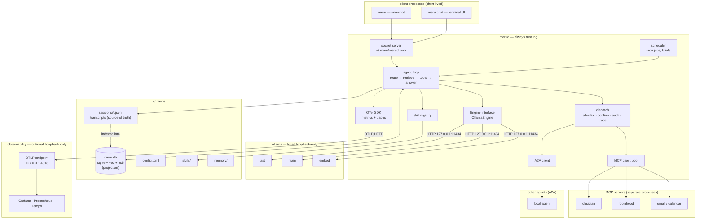
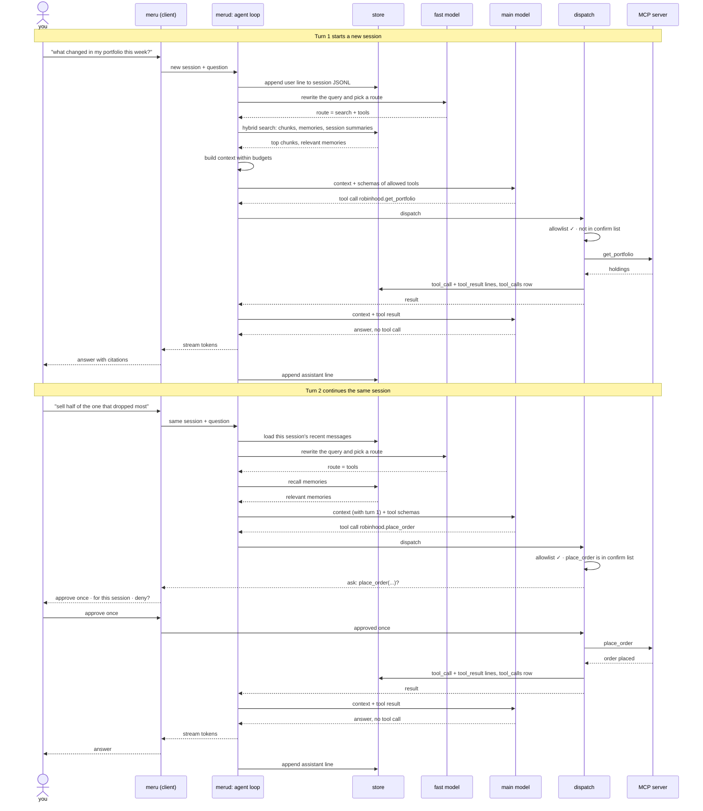
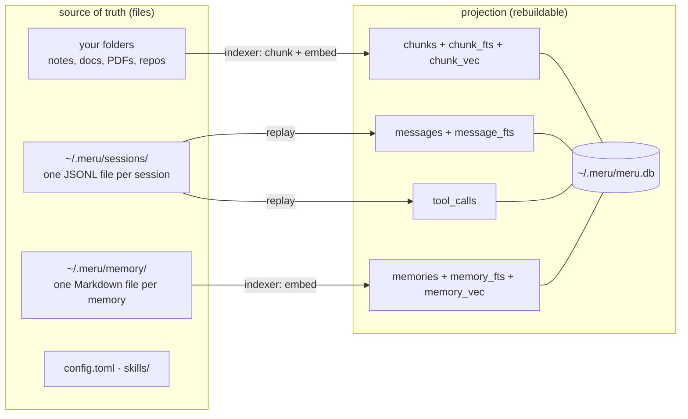
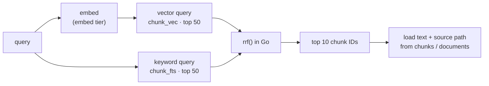
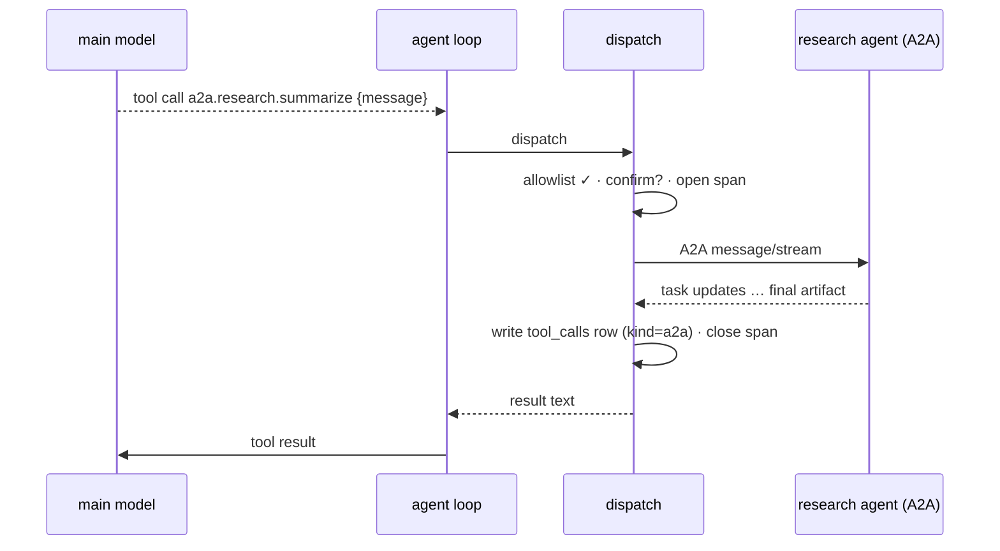

# Meru — Architecture

*Meru* (मेरु) is a personal AI assistant that runs on a machine you control. This
document describes how it works and why.

This is the level-300 document: the full design, for people building Meru. For a
shorter start, read [level 100](docs/architecture/100.md) (the big picture) and
[level 200](docs/architecture/200.md) (how it works). All three are also
[web pages](https://aarora79.github.io/meru/architecture/).

> We wrote this design before the code. If the code and this file disagree, one of
> them has a bug; say which.

## Principles

1. **Nothing leaves the machine by accident.** Meru connects only to loopback, except
   to A2A agents and MCP servers you mark as remote in config. Meru measures itself,
   but no telemetry leaves the machine, and the codebase has no path that sends a
   prompt to a cloud model.
   MCP servers are separate programs: one you add, such as web search or Gmail, can
   reach the network on its own (see [MCP](#mcp)).
2. **Files are the source of truth; SQLite is a projection.** Meru can rebuild
   everything in the database from your files and config. Delete `meru.db` and it
   re-indexes.
3. **You can inspect everything.** Memories and skills are Markdown files, and
   answers cite the files they drew on. Meru traces and times every turn, so you can
   find out why it said something and why it took so long.
4. **Few, narrow abstractions.** One engine interface, one store, one agent loop we
   own, and two wire protocols: MCP (Model Context Protocol) for tools and A2A
   (Agent2Agent) for other agents. Broad LLM frameworks change their APIs every few
   releases, and we don't want to chase them.
5. **Fast or unused.** People stop asking an assistant that makes them wait. The
   process model below exists to keep answers quick.
6. **Simple wins every time.** Pick the design with fewer moving parts, even if it is
   slower or less general, until a measurement says otherwise. Write code that a
   developer new to Go can follow.

---

## Language and distribution

Meru is written in **Go**. `meru` and `merud` build as native binaries that you can
copy to another machine and run, with no interpreter or virtualenv.

### Why Go

We chose Go over Python, the usual language for AI tools, for these reasons:

1. **A small footprint.** Each program is one binary, typically tens of megabytes. A
   Python app ships an interpreter, a virtual environment and its packages, often
   hundreds of megabytes. `merud` never stops running, so its idle memory matters,
   and the `meru` client starts in milliseconds instead of waiting on Python imports.
2. **Easy distribution.** One command builds for macOS, Linux or Windows, on Intel or
   ARM. Installing Meru means copying a file: no Python version to match, no
   dependency conflicts, and a container image that holds little more than the
   binary.
3. **Room to scale.** Meru serves one person, but nothing stops one server from
   running many Merus. A company, a school or a home lab could give each person their
   own `merud`, all sharing one Ollama on the same GPU server. At that point the
   overhead of each daemon multiplies, and a lean compiled daemon lets one server hold
   many more people than an interpreted one would. The models dominate the cost on a
   single laptop; across a rack of servers, Meru's own overhead adds up.
4. **Concurrency built in.** A turn streams tokens, runs tool calls in parallel, keeps
   MCP connections open, and shares the process with the scheduler and the indexer.
   Goroutines and `context` cancellation handle that directly, without Python's
   global interpreter lock.
5. **Fewer dependencies.** Go's standard library covers HTTP, JSON, Unix sockets,
   cancellation, structured logging and embedding files in the binary. Fewer
   third-party packages means less supply-chain risk, which matters for a tool that
   reads your mail.
6. **Errors caught before it runs.** Static types and the compiler catch mistakes that
   Python finds only at runtime, which suits a daemon that runs for weeks.
7. **It keeps building.** Go's compatibility promise means code written today still
   compiles years from now, which matches the goal that Meru keeps working without
   anyone's permission.
8. **The ecosystem is already Go.** Ollama is written in Go, and the official MCP SDK,
   the A2A SDK, OpenTelemetry and Bubble Tea all have first-class Go libraries.

The trade-off: Python has the stronger libraries for machine learning and PDF
parsing. That is one reason models run in Ollama rather than inside Meru, and why PDF
extraction is still an open question.

Three things stay outside the binaries:

- **Ollama**, which runs the models (see [Engine layer](#engine-layer)).
- **The observability stack**, which you can skip (see [Observability](#observability)).
- **MCP servers and A2A agents**, which run as their own processes.

The store uses `ncruces/go-sqlite3`, a Go library that runs SQLite compiled to
WebAssembly, with `sqlite-vec` built in. It needs no cgo (Go's bridge to C code), so
a plain `go build` works without a C compiler (see [Storage](#storage)), and one
command builds for another platform: `GOOS=linux GOARCH=amd64 go build ./...`.

### Platforms

Every part Meru depends on runs on all three major desktop and server systems:
Ollama, SQLite, Go's Unix sockets (Windows 10 and later has them too) and the
OpenTelemetry stack.

| Platform | Status | Restarts `merud` after a reboot |
| --- | --- | --- |
| macOS, Apple silicon | supported and tested; the development machine is a Mac Studio (M4 Max, 64 GB) | `launchd` |
| Linux, x86-64 or arm64 (home servers, cloud VMs such as EC2) | supported | `systemd` |
| Windows 10 and later | should work; not tested at first | a Windows service |

Code must not assume one platform: build paths with `filepath`, find the home
directory with `os.UserHomeDir`, and keep platform-specific code behind Go build tags
in as few files as possible.

**On a cloud server** such as EC2, Meru still sends no prompt to a model provider,
but your notes, email and transcripts live on that server. Meru's promise is "a
machine you control"; where that machine sits is your call. You'd run `meru` over SSH,
because it reaches `merud` through a local socket.

---

## The shape: daemon + thin client

A command-line tool that starts, loads a model, answers and exits would be too slow:
the `full` profile's main model is ~18 GB at 4-bit and takes many seconds to load
from disk. So Meru has two programs:

- **`merud`** runs all the time. It keeps models loaded in Ollama, owns the store,
  holds the MCP and A2A connections, runs the scheduler and the agent loop, and emits
  metrics and traces.
- **`meru`** is a thin client. It connects to `merud` over a Unix socket at
  `~/.meru/merud.sock`, starts in ~50 ms, streams the answer back and exits.

A daemon that keeps models warm can also run scheduled jobs for almost no extra
work. That is why we build `merud` first and add the scheduler to it later.



### Terminal UI

`meru chat` uses [Bubble Tea](https://github.com/charmbracelet/bubbletea), a Go
library for interactive terminal apps. A Bubble Tea program has three parts: a model
struct that holds the screen's state, an `Update` function that turns each event (a
key press, a window resize, a streamed token) into a new state, and a `View` function
that draws the state as text. The client reads tokens from the socket in a goroutine
and passes each one to the program with `program.Send`, so the answer grows on screen
as it arrives.

`meru chat` also uses Bubbles, from the same authors, for the text input and the
scrolling answer pane. We'll add Glamour (markdown rendering) or Lip Gloss (styling)
only if plain text proves hard to read.

Answers always stream: `meru chat` and one-shot `meru` both show text as the model
writes it. When `dispatch` needs your approval, `meru chat` shows the tool name and
arguments with three choices: approve once, approve for this session, or deny (see
[Approving a tool call](#approving-a-tool-call)).

The UI code holds no model or store logic; it draws what `merud` sends. One-shot
`meru "..."` doesn't use Bubble Tea at all: it prints the stream as plain text, which
also keeps it usable in scripts and pipes.

---

## A question, end to end

The diagram below follows two turns of one conversation. The first turn searches
your files and calls a read-only tool. The second turn builds on the first and calls
a tool that changes something, so Meru asks you before it runs. Later sections
explain each step in detail.



### Who decides what

| Decision | Made by | How |
| --- | --- | --- |
| Answer directly, search, call tools, or search and call tools | the `fast` model (the router) | It reads the probability of each route letter from one decoded token, and falls back to search and tools when unsure. A separate short call rewrites the query and picks the skills to load |
| Which tools the model may use | you, in `config.toml` | Only tools in each server's `allow` list reach the model; the rest don't exist to it |
| Which tool to call, with what arguments | the `main` model | It reads each allowed tool's name, description and argument schema, as the MCP server wrote them, and picks |
| Whether a call runs without asking | you, in `config.toml` and at the prompt | `dispatch` stops and asks when the tool is in the server's `confirm` list, unless you already approved that tool for this session |
| When the turn ends | the `main` model, with a cap | The turn ends when the model answers without calling a tool, or at the round cap (config, default 8) |

When the route leaves tools out, `merud` sends the model no tool schemas at all. The
model can't call a tool it hasn't seen, and the prompt stays shorter.

### Approving a tool call

When `dispatch` reaches a tool in the `confirm` list, the client shows the tool's name
and arguments and offers three choices:

| Choice | What happens |
| --- | --- |
| Approve once | This call runs. The next call to the same tool asks again. |
| Approve for this session | This call runs, and `dispatch` skips the prompt for that tool until the session ends. The approval covers the tool, whatever its arguments. |
| Deny | The call doesn't run. Its outcome is `declined`, and the model hears that you said no, so it can answer without the tool or ask you what to do. |

- **Each choice is recorded.** `merud` appends an `approval` line to the transcript,
  and replay copies the choice into the call's `tool_calls` row:

  ```json
  {"ts":"2026-09-23T10:17:21Z","type":"approval","server":"robinhood","tool":"place_order","choice":"once","trace_id":"9c2e…"}
  ```

- **Built-in tools have their own confirm list.** Built-ins such as `remember` belong
  to no server entry, so `config.toml` gives them one section:

  ```toml
  [builtin]
  confirm = ["write_file"]   # the shipped default; add "remember" to approve each new memory
  ```

  The built-in tools are `remember`, `write_file` and `configure`. `configure`
  always asks, whatever this list says (see [First run and setup](#first-run-and-setup)).

  In `tool_calls` and the metrics, a built-in call has `kind = "builtin"` and
  `server = "meru"`.
- **Session approvals stay inside the running `merud`.** They end with the session and never
  reach `config.toml`. To stop Meru asking about a tool for good, remove it from the
  `confirm` list yourself; config stays the one place that grants lasting trust.
- **One-shot `meru "..."`** asks on the terminal with the same three choices. Its
  session ends with the answer, so "for this session" covers only this question. When
  nothing can answer the prompt, because standard input isn't a terminal (a script or
  a pipe), the call is denied.
- **Scheduled jobs** have no one to ask, so `dispatch` denies every tool in the
  `confirm` list and the job's output says which calls it skipped.

### How a conversation continues

- **A session is one transcript file.** `meru chat` keeps one session open until you
  quit. Each `meru "..."` one-shot starts a new session.
- **Each turn starts with the session's history.** `merud` loads your earlier
  questions and Meru's earlier answers from this session, newest first, until the
  history budget is full. Older turns drop out of the prompt but stay in the
  transcript, where search can still find them.
- **Earlier tool results stay out of the history.** The answer that used a result
  already carries what mattered from it, and raw results can run to thousands of
  tokens. The transcript keeps the full results.
- **The router sees the history too**, so a follow-up like "sell half of the one that
  dropped most" gets rewritten into a query that names the stock.
  This works because turn 1's answer named the stocks and their moves; the router
  reads answers, not the raw tool results behind them.

---

## Model tiers

Meru gives models three jobs, called tiers. Code depends on the tiers; `config.toml`
says which model fills each one.

| Tier | Job |
| --- | --- |
| `fast` | routing, query rewrites, classification, trivial answers |
| `main` | reasoning, writing the answer, choosing tools |
| `embed` | embeddings for the index and for queries |

Two profiles ship in `config.toml`. **`lite` is the default.**

| Tier | `lite` (default) | `full` |
| --- | --- | --- |
| `fast` | `hf.co/openbmb/MiniCPM5-2B-GGUF:Q4_K_M` (1.6 GB) | same |
| `main` | same model as `fast` | `qwen3.8:27b` (~18 GB, 4-bit) |
| `embed` | `nomic-embed-text` (~260 MB, 768 dims) | `qwen3-embedding:0.6b` (1024 dims) |
| Hardware | 16 GB of RAM; runs on a CPU, faster with a GPU or Apple silicon | Apple silicon with 32 GB (64 GB comfortable), or a GPU with ~24 GB of memory |

- **`lite`** uses two small models. It downloads in a couple of
  minutes and runs on almost any computer. One model fills both `fast` and `main`, so
  only two models sit in memory.
- **`full`** swaps in Qwen 3.8 27B, a dense model built for agent and tool work, and
  a stronger embedding model. On Apple silicon, Ollama also offers the
  `qwen3.8:27b-mlx` tag, which runs the same model on its MLX backend; we'll measure
  which tag is faster.

`merud` keeps each model loaded by asking Ollama for `keep_alive: -1`, and warms every
tier at startup. Ollama must allow enough models in memory at once
(`OLLAMA_MAX_LOADED_MODELS`, 3 for `full`).

The `fast` tier needs a runtime that reports log probabilities, because
[routing](#routing) reads them. Ollama added them in v0.12.11; `merud` reads
`/api/version` at startup and refuses to start on anything older, naming both
versions. Routing costs no extra model: the `fast` model is already loaded.

A new embedding model makes vectors of a different size, and every stored vector
goes stale. The store records the embedding model's name and vector size. When
either stops matching config, `merud` rebuilds the vectors from your files (see
[Storage](#storage)).

A 120B model at 4-bit needs ~60 GB, which leaves even the 64 GB development machine
no room and makes it swap. Meru won't support models that size.

---

## Engine layer

The interface has four methods:

```go
type Engine interface {
    Generate(ctx context.Context, msgs []Message, tools []ToolSpec, opts Options) (Completion, error)
    Stream(ctx context.Context, msgs []Message, tools []ToolSpec, opts Options) (iter.Seq2[Delta, error], error)
    Embed(ctx context.Context, texts []string) ([]Vector, error)
    Info(ctx context.Context) (ModelInfo, error)
}
```

**`OllamaEngine` is the only implementation.** It talks to Ollama over HTTP on
loopback and refuses to start if the configured URL points anywhere else. It is the
codebase's only HTTP client for a model runtime, and it can't reach a cloud model.

Each model writes tool calls in its own format; Ollama converts them to structured
JSON, and the engine converts that JSON to Meru's own types. The agent loop never
sees a model-specific token. Each `Completion` also carries Ollama's counters
(`prompt_eval_count`, `eval_count`, `load_duration`, `prompt_eval_duration`,
`eval_duration`), which feed [Observability](#observability).

For [routing](#routing), `Options` gains two fields, `LogProbs` and `TopLogProbs`,
and `Completion` gains `LogProbs`: for each generated position, the chosen token and
the alternatives the model weighed, each with its log probability. Both default to
off, so other callers see no change, and the interface keeps its four methods.

Two engines may come later, behind the same interface:

- **`LlamaCppEngine`** would compile llama.cpp into `merud` through cgo, using the
  GPU (Metal on a Mac, CUDA on NVIDIA). Meru would then need no Ollama install, but it would have
  to parse each model's tool-call format itself.
- **`MLXEngine`**, if MLX gets usable C or Go bindings and runs faster enough than
  llama.cpp to justify a second backend.

---

## Agent loop

We write the agent loop ourselves; we looked at Eino and ADK Go and chose not to use
a framework. The loop is small, and every rule Meru enforces lives inside it: the
allowlist, the audit log, the context budget and confirmation prompts. We want that
code where we can read it, not inside another project's callbacks. The only
third-party code in the loop is the official MCP Go SDK and the A2A Go SDK.

A turn has five steps. [A question, end to end](#a-question-end-to-end) shows them in
order.

1. **Route.** The `fast` model picks one of four routes: answer directly, search your
   files first (RAG, retrieval-augmented generation), call tools, or search and call
   tools. It picks by classification, reading one decoded token's probabilities (see
   [Routing](#routing)). A separate short generation call rewrites the query and
   picks the skills to load.
2. **Build the context.** System prompt, skill descriptions, relevant memories,
   retrieved chunks, this session's history and the allowed tools' schemas, each
   within its own token budget.
3. **Call `main`.** Stream text to the client as it arrives. Tool-call arguments also
   arrive in pieces; buffer each call until it is complete.
4. **Dispatch tools.** Every call goes through one function, `dispatch`. It checks the
   allowlist, asks you to confirm if config lists the tool under `confirm`, calls the
   MCP server, A2A agent or built-in tool (such as `remember`), writes the
   `tool_calls` row, and records the span and metrics. If you say no, the call
   doesn't run and its outcome is `declined`. A call to a tool outside the allowlist
   doesn't run either; its outcome is `denied`, and it still gets a `tool_calls` row,
   so a model that keeps reaching for forbidden tools shows up in the log. No other
   code path reaches a server, agent or built-in tool. Independent calls run at the same time (`errgroup`), each
   with its own timeout.
5. **Repeat** from step 3 with the tool results, until the model answers without
   calling a tool or the loop hits its iteration cap (config, default 8).

A `context.Context` runs through the whole turn. If the client disconnects or you
press Ctrl-C, `merud` cancels the turn: generation stops, in-flight tool calls are
dropped, and their `tool_calls` rows record the cancellation.

### Routing

A small model asked to write its route as JSON (JavaScript Object Notation) fails in
three ways: it writes broken JSON, invents a fifth route, or answers wrong with no
sign that it was unsure. So the router doesn't ask for text. It treats the route as a
classification and reads the answer from the model's probabilities:

1. The prompt gives the question, the session history and four lettered options
   (A = answer directly, B = search, C = tools, D = search and tools), each with a
   one-line description, and ends with `Answer: `.
2. `merud` asks Ollama's `/api/chat` for one token with log probabilities
   (`num_predict = 1`, `logprobs = true`, `top_logprobs = 20`) and with thinking
   off (`think = false`). A thinking model such as MiniCPM5 otherwise spends its
   one token starting its hidden reasoning, and no letter comes back.
3. The router keeps the alternatives whose text is one of the four letters, turns
   each log probability back into a probability, divides by a fitted temperature,
   and normalizes the four so they sum to 1.
4. The most likely letter is the route, and its probability is the confidence.

The model decodes one token, so routing costs a prompt evaluation and nothing more,
and it can't name a route that doesn't exist. When the confidence falls below
`min_confidence`, or fewer than two letters appear at all, the router takes the
fallback route, `search+tools`. That's the one route that can't fail a turn for
lack of context: an unsure router spends tokens rather than guesses.

```toml
[router]
top_logprobs   = 20             # Ollama's cap
temperature    = 1.0            # raw; fit later from labelled turns
min_confidence = 0.45           # below this, take the fallback
fallback       = "search+tools"
```

The router lives in `internal/router` as one function, `Decide`, which returns the
route, its confidence, the full distribution and an outcome (`ok`,
`low_confidence` or `degraded`). A model that answers unclearly isn't an error;
`Decide` returns the fallback and says why. Small models are overconfident, so
`min_confidence` means little until a temperature is fitted from about 200 labelled
turns.

The full design, with the prompt contract, tests and calibration plan, is in
[docs/fast-router.md](docs/fast-router.md).

---

## Storage

Meru keeps two kinds of data, with one rule between them: **files hold the truth,
and the database indexes them.** Delete `meru.db` and `merud` rebuilds it.



### Session transcripts

Each session is one JSON Lines (JSONL) file: one JSON object per line, one line per
event. `merud` appends a line as each event happens and never rewrites old ones.

```text
~/.meru/sessions/2026/09/2026-09-23T101502-7f3a.jsonl
```

```json
{"ts":"2026-09-23T10:15:02Z","type":"user","text":"what changed in my portfolio this week?","trace_id":"4bf9…"}
{"ts":"2026-09-23T10:15:03Z","type":"tool_call","kind":"mcp","server":"robinhood","tool":"get_portfolio","args":{},"trace_id":"4bf9…"}
{"ts":"2026-09-23T10:15:04Z","type":"tool_result","ok":true,"ms":812,"result":{…},"trace_id":"4bf9…"}
{"ts":"2026-09-23T10:15:09Z","type":"assistant","text":"Two positions moved…","tokens_in":2310,"tokens_out":188,"trace_id":"4bf9…"}
{"ts":"2026-09-23T10:31:40Z","type":"summary","text":"Reviewed the week's portfolio changes; two positions fell more than 5%."}
```

You can `grep`, `tail -f` or back up these files with no special tools, and a crash
loses at most the line being written. The database keeps a copy for search and for
`meru log`.

### The database

`~/.meru/meru.db` is one SQLite file, opened through `ncruces/go-sqlite3` with
`sqlite-vec` built in. FTS5, SQLite's built-in full-text search, handles keywords;
`sqlite-vec` handles vectors.

| Table | Holds | Rebuilt from |
| --- | --- | --- |
| `documents` | indexed source files: path, mtime, hash, type | your folders |
| `chunks` | pieces of each file's text, plus metadata and the parent document | your folders |
| `chunk_vec` | one vector per chunk (sqlite-vec) | chunks, re-embedded |
| `chunk_fts` | keyword index over chunks (FTS5) | chunks |
| `sessions` / `messages` | every session and message, plus each session's summary, for context and `meru log` | `sessions/*.jsonl` |
| `session_vec` | one vector per session summary, for "what did we decide last week" | session summaries |
| `message_fts` | keyword index over messages, for "what did we say about X" | messages |
| `tool_calls` | audit log: every MCP, A2A and built-in tool call, with `kind` (`mcp`, `a2a` or `builtin`), args, result, duration, approval choice, trace ID | `sessions/*.jsonl` |
| `memories` | one row per memory file: path, folder (its kind), text, created, source, last used | `memory/*/*.md` |
| `memory_vec` / `memory_fts` | vector and keyword indexes over memories | memories |
| `jobs` / `job_runs` | scheduled jobs and each run's outcome | jobs: `[[jobs]]` in `config.toml`; runs: the job's session transcript |
| `meta` | schema version, embedding model name and vector size | config |

`tool_calls` is mandatory. An assistant with tools that change things needs a record
you can read afterwards. `messages` and `tool_calls` store the trace ID of their turn,
so you can jump from a slow trace in Grafana to the rows it produced, and back.

### Why this driver and this vector store

- **`ncruces/go-sqlite3` + `sqlite-vec`.** No cgo, no C compiler, and vectors live in
  the same file as everything else. One query can join vector hits, keyword hits and
  document metadata.
- **Search compares against every vector.** `sqlite-vec` has no approximate index. For
  a personal index of up to a few hundred thousand chunks, that should stay inside the
  latency budget, and `meru.retrieval.duration` will show when it doesn't. The first
  fix is smaller vectors (int8, or fewer dimensions), not another database.
- **Rejected:** `chromem-go` (pure Go, but a second store we can't join with keyword
  search), LanceDB and DuckDB (both need cgo and do more than we need), Qdrant and
  Chroma (extra server processes).

---

## Retrieval

Vector search misses exact strings such as ticker symbols and error codes. BM25, the
standard keyword-ranking formula, misses paraphrase. Meru runs both.

[A question, end to end](#a-question-end-to-end) shows where retrieval sits in a turn.

The indexer splits files along their structure: markdown by heading, code by
function or type, PDFs by page with layout kept. It re-indexes a file only when its
mtime and content hash change.

### How hybrid search works

SQLite does both searches; our code merges the results.

Each turn searches three sources: file chunks, memories and the summaries of past
sessions. Each source gets the same keyword and meaning search, `rrf` merges the
results within that source, and each source has its own share of the context
budget, so one busy source can't crowd out the others.

| Piece | Comes from |
| --- | --- |
| Keyword search, ranked by BM25 | FTS5 (`ORDER BY rank`, where `rank` is BM25) |
| Similarity search, ranked by distance | `sqlite-vec` (`embedding MATCH ? AND k = ?`) |
| Merging the two lists | our Go code: reciprocal-rank fusion |



`merud` runs the vector query and the keyword query one after the other, then merges the two
ranked lists with reciprocal-rank fusion (RRF). BM25 scores and vector distances use
different scales, so RRF ignores them and uses each chunk's position in each list:

```text
score(chunk) = Σ over lists  1 / (60 + rank of chunk in that list)
```

A chunk near the top of either list scores well, and one near the top of both scores
best. The constant 60 is the usual choice; it keeps the gap between rank 1 and rank 2
small.

```go
// rrf merges ranked lists of chunk IDs into one score per chunk.
func rrf(lists ...[]int64) map[int64]float64 {
    const k = 60
    scores := map[int64]float64{}
    for _, list := range lists {
        for rank, id := range list {
            scores[id] += 1.0 / float64(k+rank+1)
        }
    }
    return scores
}
```

SQLite could do the merge in one query with window functions and a full outer join.
We merge in Go instead:

- Two short queries and one small function are easier to read than one dense query.
- `rrf` is a pure function, so a table-driven test covers it without a database.
- Each stage gets its own timing in `meru.retrieval.duration` (`vector`, `fts`,
  `fusion`).
- Memory retrieval reuses `rrf` with a third list ranked by recency.

The extra query costs microseconds, because SQLite runs inside `merud`.

**Schema detail.** `chunk_fts` is an FTS5 *external content* table
(`content='chunks'`). It indexes the text in `chunks` without storing a second copy,
and its `rowid` equals the chunk ID. `chunk_vec` uses the same chunk ID as its key, so
both lists name chunks the same way and the merge needs no lookup.

The list sizes (50 from each search, top 10 after the merge) are starting values in
`config.toml`. We'll tune them against real questions.

---

## Memory

Each memory is a small Markdown file you can read, edit or delete by hand. The files
hold the truth; the database indexes them so Meru can search them, and rebuilds from
them if you delete it.

### Layout

One file per memory, and one folder per kind:

```text
~/.meru/memory/
  me/            who you are: role, family, where you live
  preferences/   how you like things done
  projects/      ongoing work, goals, deadlines
  people/        people you mention and how they relate to you
  reference/     where things live: accounts, URLs, tools
  other/         anything worth keeping that fits no folder above
```

```markdown
---
created: 2026-09-23
source: session 2026-09-23T101502-7f3a
---
Prefers index funds over individual stocks for retirement accounts.
```

- **The folder is the kind.** No `kind:` field can disagree with the path, and you can
  browse by kind in a file manager or with `ls`.
- **One fact per file**, so forgetting a memory means deleting one file. You can do
  that by hand, or `meru memory forget` does it.
- **`other/` holds anything that fits no other folder.** If it fills up with one kind
  of thing, create a new folder for that kind; Meru picks it up with no code change.
- **The frontmatter records when and where** each memory came from, so you can trace
  it back to the session that produced it.

Meru keeps no index file. The database already indexes the files, and
`meru memory list` shows them.

### Facts and episodes

- **Facts** (semantic memory) stay true over time: everything in the folders above.
- **Episodes** (what happened when) already live in the session transcripts, so
  memory files don't copy them. When a session ends, `merud` asks the `fast` model for
  a one- or two-sentence summary and appends it to the transcript as a `summary`
  line. The indexer embeds those summaries, so "what did we decide about the
  portfolio last week?" finds the right session.

### How Meru uses them

1. **Indexing.** The indexer treats `~/.meru/memory/` like any folder you index: each
   file gets a vector and a keyword entry. It picks up hand edits through the usual
   mtime and content-hash check.
2. **Recall.** Each turn searches memories by meaning and by keyword, adds a third
   list ranked by recency, and merges all three with `rrf`. The top results go into
   the context, up to the memory budget. Recall runs on every route, including
   tools-only turns, because a preference such as "always ask before trading" matters
   most when tools run.
3. **Saving.** The model saves a memory by calling the built-in `remember` tool with
   a folder and the text. The call goes through `dispatch` like any other tool, so it
   lands in `tool_calls` and the transcript. Memories save without asking; add
   `remember` to `builtin.confirm` in `config.toml` if you want to approve each one.
4. **Your commands.** `meru memory list | add | forget` work on the files.

If Meru believes something wrong about you, you can find the file and fix or delete
it. A vector blob you can't read would leave you no way to audit or correct it.

---

## Skills

A skill is a markdown file with YAML frontmatter, at `~/.meru/skills/<name>/SKILL.md`:

```markdown
---
name: portfolio-review
description: Review holdings through a valuation lens. Use when asked about
  positions, concentration, or whether to buy or sell.
---

<the instructions, loaded only when the skill is chosen>
```

The system prompt carries only each skill's `name` and `description`. `merud` loads
the body when the router picks the skill, so adding skills barely grows the prompt.

Skills are plain files, so any other agent that reads this format can use the same
directory.

### Built-in skills

Meru ships with two skills, taken from the owner's `my-ai-assets` repo:

| Skill | What it does |
| --- | --- |
| `writing` | Plain-English rules for any prose Meru writes: emails, summaries, reports |
| `explainer` | Builds a self-contained HTML page that teaches a topic, with diagrams |

- **They ship inside the binary** (Go's `embed` package) and live in the repo under
  `internal/skills/builtin/`. On first run, `merud` copies each one to
  `~/.meru/skills/<name>/` unless that folder already exists.
- **Your copy wins.** `merud` never overwrites a skill you've edited. To get the
  shipped version back, run `meru skills reset <name>`.
- **You add more by dropping in a folder.** Any `SKILL.md` under `~/.meru/skills/`
  counts, whether you wrote it or copied it from elsewhere.
- **Skills that make files need somewhere to put them.** The built-in `write_file`
  tool writes only inside `~/meru-output/` (configurable). It can't touch any other
  path, and it goes through `dispatch` like every tool.
- **These skills want the `full` profile.** The `lite` model can run them, but a 2B
  model writes weaker explainers.

---

## First run and setup

The first time you run `meru`, or any time you run `meru setup`, Meru walks you
through setup in the terminal. Nothing in it needs you to know how MCP works.

1. **Ollama.** Meru checks that Ollama is running. If it isn't, Meru prints the one
   install command for your platform and waits.
2. **Models.** You pick `lite` (the default) or `full`, and Meru downloads the models
   with a progress bar.
3. **Your files.** Meru writes `config.toml`, `prompt.md` and the built-in skills to
   `~/.meru/`, then asks which folders to index (for example `~/notes`).
4. **Tools.** Meru offers the starter MCP servers, one at a time, and you pick a path
   for each (see below). You can skip any of them and add them later.
5. **A test question.** Meru answers one question so you see it working.

### Adding an MCP server

Meru carries a small catalog of known servers in the binary: web search, web page
fetch, Gmail, Calendar, Drive and Docs, and Obsidian. Each catalog entry lists the
install command, what the server needs (a URL, an API key, or a Google sign-in), and
a safe starting `allow` and `confirm` list: reading allowed, anything that sends,
deletes or shares in `confirm`.

For each server, you choose one of two paths:

- **"Do it for me."** Meru asks only for what the server needs, one question at a
  time: "Paste your Brave Search API key", or "A browser window will open; sign in to
  Google". Then it shows you the exact config block it will add, and writes it only
  after you approve.
- **"Show me how."** Meru prints the config block and any install command, and names
  the file to paste them into. Nothing changes until you do it yourself.

Outside setup, you can run `meru mcp add gmail`, or ask in chat ("connect my Gmail")
and get the same two paths. A server that isn't in the catalog works too: give Meru
its command or URL, and it proposes an entry with every tool in `confirm`.

**Config changes always ask.** The built-in `configure` tool, which edits
`config.toml`, goes through `dispatch` and asks you every time, and offers only
"approve once" and "deny". A session approval isn't available for it, and
`builtin.confirm` can't switch the prompt off. Config grants lasting trust, so the
model can't grant any to itself. (Built-in tools need no allowlist entry: the model
always sees `remember`, `write_file` and `configure`.)

**Secrets stay out of config.** API keys and sign-in tokens go in
`~/.meru/secrets.toml`, readable only by you (file mode `0600`), and config entries
refer to them by name. `merud` redacts them from transcripts, logs and spans.

---

## MCP

Meru is an MCP **client**; it hosts no servers. `config.toml` lists the servers, and
Meru merges their tools into one set of names, prefixed per server. It supports the
two transports in the current MCP spec, both provided by the official Go SDK:

- **stdio:** `merud` starts the server as a child process and talks to it over
  stdin and stdout. Most local servers work this way.
- **Streamable HTTP:** `merud` connects to a server that is already running, at a
  URL. It replaced the older HTTP+SSE transport in the 2025 spec, so Meru doesn't
  support SSE.

Every MCP server you already run becomes a Meru capability with no new code.

```toml
[[mcp.servers]]
name    = "obsidian"
command = "..."                   # stdio: merud starts this process
allow   = ["read", "search"]     # tool-level allowlist
confirm = []                      # allowed tools that still need a yes per call

[[mcp.servers]]
name    = "calendar"
url     = "http://127.0.0.1:8123/mcp"   # Streamable HTTP: server already running
allow   = ["list_events"]
network = false                          # true only if the URL isn't loopback
```

A server entry has either `command` or `url`. `merud` refuses a Streamable HTTP URL
that isn't loopback unless the entry says `network = true`, the same rule A2A agents
follow.

Tools are **deny-by-default**. A server that offers 40 tools gives the model none
until you allow specific ones.

Meru doesn't confine MCP servers. Each one runs as an ordinary process with your
user's permissions, and can read files or reach the network by itself. Adding a
server to config is a trust decision: Meru decides which tools the model may call,
and the server decides what each call does.

---

## Other agents (A2A)

Meru hands tasks to other agents over A2A, an open protocol for agent-to-agent work.
As with MCP, Meru is only a client; it doesn't serve A2A. The client comes from the
A2A project's Go SDK.

The model sees each allowed agent skill as one more tool, named
`a2a.<agent>.<skill>`, that takes a message and returns the agent's answer. The call
goes through the same `dispatch` function as MCP tools, so it gets the same allowlist
check, confirmation, `tool_calls` row (with `kind = "a2a"`) and trace span.

```toml
[[a2a.agents]]
name    = "research"
url     = "http://127.0.0.1:9100"   # Meru reads the agent card from here
allow   = ["summarize"]              # skills from the agent card
confirm = []
network = false                      # true only if the agent isn't on loopback
```



Agents are deny-by-default too. Meru can reach only the agents in config, and only
the skills in `allow` become tools. An agent on another machine may use a cloud
model, so your data would leave the machine. Reaching one takes `network = true`;
without it, `merud` refuses any agent URL that isn't loopback. For long tasks, Meru
uses the protocol's streaming updates, with the same per-call timeout as a tool.

---

## Scheduler

A job is a prompt plus a cron expression, declared in `config.toml`:

```toml
[[jobs]]
name     = "morning-brief"
schedule = "0 7 * * 1-5"          # 7:00 on weekdays
prompt   = "Brief me on today's calendar, unread email and anything due this week."
output   = "notification"          # or "digest", or a file path
```

Each run is a session with its own transcript, so a job's work lands in the same log
and traces as your questions. `merud` runs it through the same agent loop
as a question you type, and sends the output to a digest, a file or a notification.
Jobs don't stream, since no one is watching, and nobody can approve a tool call, so
`dispatch` denies every tool in the `confirm` list during a job.
The operating system's service manager (`launchd`, `systemd` or a Windows service)
restarts `merud` after a reboot. The scheduler lives inside `merud`, not in the
service manager, so jobs use the loaded models and land in the same audit log and
traces.

---

## Observability

Every stage of a turn emits OpenTelemetry (OTel) metrics and traces: routing,
retrieval, each model call and each tool call. A dashboard can then show where a slow
answer spent its time, how many tokens it used, and which tool failed.

### Local only

Meru collects this data about itself, and none of it leaves your machine. It goes
only to an endpoint you run on this machine:

- The OTLP (OpenTelemetry Protocol) exporter stays **off until you set
  `observability.otlp_endpoint`.** Without an endpoint, `merud` uses no-op providers,
  and instrumentation costs almost nothing.
- `merud` **refuses to start if the endpoint isn't a loopback address.** No setting
  sends metrics or traces anywhere else.
- **Spans carry no prompt or response text** unless you set `capture_content = true`.
  They always carry token counts, durations, model names and tool names, which reveal
  nothing about what you asked.

```toml
[observability]
otlp_endpoint    = "http://127.0.0.1:4318"   # OTLP/HTTP; loopback only; unset = off
metrics_interval = "10s"
traces           = true
capture_content  = false                     # prompt/response text in spans
```

### Traces

Each turn produces one trace, whether it came from the CLI or a scheduled job:

```text
meru.turn                         route, iterations, outcome
├── meru.route                    one-token route pick: decision, confidence, outcome
├── meru.retrieve                 vector, fts, fusion (v0.2); memories (v0.4)
├── gen_ai.chat  main             one span per model call in the loop
├── mcp.tool_call  obsidian.search
└── gen_ai.chat  main             final answer
```

Model spans follow the OTel GenAI semantic conventions (`gen_ai.operation.name`,
`gen_ai.request.model`, `gen_ai.usage.input_tokens`, `gen_ai.usage.output_tokens`).
Tool spans follow the MCP semantic conventions and add `meru.tool.server` and
`meru.tool.allowed`. `merud` writes each trace ID to `messages` and `tool_calls`.

### Metrics

Metrics use the standard GenAI names where a convention exists, and `meru.*` names
for the rest.

| Metric | Type | Attributes | Answers |
| --- | --- | --- | --- |
| `gen_ai.client.token.usage` | histogram | model, tier, `gen_ai.token.type` (input/output) | tokens per call |
| `gen_ai.client.operation.duration` | histogram | model, tier, operation | model call latency |
| `gen_ai.server.time_to_first_token` | histogram | model, tier | the v0.1 "first token < 1 s" target |
| `gen_ai.server.time_per_output_token` | histogram | model, tier | decode speed |
| `meru.engine.load.duration` | histogram | model | cold loads Ollama had to do (should be ~0) |
| `meru.route.decisions` | counter | route, outcome (ok/low_confidence/degraded) | how often each route wins, and how often the router is unsure |
| `meru.turn.duration` | histogram | route, source (cli/tui/job), outcome | end-to-end latency |
| `meru.turn.iterations` | histogram | route | loop depth |
| `meru.context.tokens` | histogram | section (system/skills/memories/chunks/history/tools) | data for the context budget policy |
| `meru.tool.calls` | counter | server, tool, outcome (ok/error/denied/declined/cancelled/timeout) | tool usage and failures |
| `meru.tool.duration` | histogram | server, tool | tool latency |
| `meru.retrieval.duration` | histogram | stage (vector/fts/fusion/memories) | retrieval cost (v0.2; memories stage v0.4) |
| `meru.rpc.active_streams` | up-down counter | — | open client sessions |
| `meru.scheduler.job_runs` | counter | job, outcome | (v0.5) scheduled work |

The OTel Go runtime package adds heap, garbage-collection and goroutine metrics.

Token counts come from Ollama's counters on each response; Meru doesn't estimate
them. `merud` measures time to first token from the start of the request to the
first streamed text, so it includes time spent waiting in the queue and reading the
prompt.

**Keep attribute values to small, fixed sets** such as model, tier, server, tool,
route and outcome. Session IDs, file paths and text belong on spans, never on
metrics.

### The stack

`merud` speaks plain OTLP/HTTP, so any OTLP backend works. The reference setup is one
container, **`grafana/otel-lgtm`**, which bundles an OTel Collector, Prometheus,
Tempo and Grafana. The repo ships its compose file and a ready-made Meru dashboard.
The compose file:

- binds ports to `127.0.0.1` only (4318 for OTLP, 3000 for Grafana);
- turns off Grafana's own reporting and update checks:
  `GF_ANALYTICS_REPORTING_ENABLED=false`, `GF_ANALYTICS_CHECK_FOR_UPDATES=false`,
  `GF_ANALYTICS_CHECK_FOR_PLUGIN_UPDATES=false`.

To run the parts as separate binaries (Collector, Prometheus, Jaeger or Tempo), point
`otlp_endpoint` at the Collector. `merud` needs no change.

`merud` writes application logs to a local file with `log/slog` and doesn't export
them.

---

## Privacy boundary

- The codebase contains no path to a cloud model. The engine talks only to a model
  runtime on loopback.
- You allow MCP tools and A2A skills one by one. A remote A2A agent or Streamable
  HTTP server needs `network = true` in its config entry.
- Meru doesn't sandbox MCP servers. They run with your permissions, so choose them as
  carefully as any program you install.
- No telemetry leaves the machine. Meru's own metrics and traces are off by default,
  go only to loopback when on, and leave out prompt text unless you opt in. Meru
  sends no crash reports and never checks for updates.
- The store is a plain file. Back it up or delete it; it's yours.
- `meru log` and the `tool_calls` table let you review every external action.

---

## Deliberate non-goals

- **Not a chat app clone.** No accounts, sync or mobile client.
- **Not a training framework.** Meru runs weights; it doesn't produce them.
- **Not multi-user.** One machine and one person, which keeps the design simple.
- **No cloud fallback.** Calling a cloud AI service when the local model struggles would
  break principle 1.
- **Not an agent framework.** The loop exists to serve Meru, and we won't package it
  as a library.

---

## Open questions

We'll settle these with working code and measurements.

1. **Router quality.** The router no longer has to write valid output; it reads
   probabilities (see [Routing](#routing)). The open question is whether a 2B model's
   probabilities separate the four routes well enough to act on.
   `meru.route.decisions` by outcome, and a temperature fitted from labelled turns,
   will show. If they don't, `lite` gets a larger `fast` model. The first run, on
   the development machine with MiniCPM5-2B and the raw temperature of 1.0, took
   about 13 ms per warm decision and picked the expected route for 2 of 7
   hand-picked questions. It leaned towards `search+tools`, the safe fallback, so
   no answer lacked context, but it did more work than needed. Next: label real
   turns, fit the temperature, and tune the option descriptions.
2. **Context order.** Skills, memories and retrieved chunks compete for the same
   window. `meru.context.tokens` will supply the numbers to set a budget per section.
3. **PDF extraction.** Local tools that keep a PDF's layout are weak, and Go has fewer
   of them than Python. We may need a cgo library or an external tool.
4. **Leaving Ollama.** An embedded llama.cpp engine would make `merud` self-contained,
   but Meru would take over tool-call parsing and loading models. Decide once v0.3
   works on Ollama and we can measure the cost.
5. **WASM SQLite speed.** `ncruces/go-sqlite3` runs slower than native SQLite. In
   v0.2, measure indexing and search on a real notes folder before building further
   on it.

### Resolved

- **Language:** Go, for a small footprint, easy distribution, room to scale, built-in
  concurrency and fewer dependencies (see [Why Go](#why-go)).
- **Platforms:** macOS on Apple silicon first, Linux supported, Windows untested at
  first. Cloud servers such as EC2 count as "a machine you control".
- **Agent harness:** our own loop plus the official MCP and A2A Go SDKs. We looked at
  Eino and ADK Go. ADK Go pulls a cloud-model client into the dependency tree, and
  neither saves much once the allowlist, audit and budget logic are ours.
- **Model runtime:** Ollama on loopback for now (see open question 4).
- **Models:** the `lite` profile by default (MiniCPM5-2B + `nomic-embed-text`), and
  `full` for Apple silicon with 32 GB or more, or a ~24 GB GPU (`qwen3.8:27b` +
  `qwen3-embedding:0.6b`).
- **Storage:** JSONL transcripts as the source of truth; SQLite via
  `ncruces/go-sqlite3` with `sqlite-vec` as the index. No separate vector database.
- **Routing:** a one-token classification read from log probabilities, falling back
  to search and tools when unsure ([docs/fast-router.md](docs/fast-router.md)).
- **Hybrid search:** FTS5 BM25 plus `sqlite-vec` similarity, merged in Go with
  reciprocal-rank fusion.
- **Built-in skills:** `writing` and `explainer` ship in the binary
  and are copied to `~/.meru/skills/` on first run; your edits always win.
- **Setup:** `meru setup` runs on first use and offers a catalog of MCP servers, each
  added "for you" (with approval of the exact config block) or by copy-paste.
- **Terminal UI:** Bubble Tea, with Bubbles for input and scrolling, in `meru chat`
  only. Answers always stream.
- **Tool approvals:** approve once, approve for this session, or deny. Session
  approvals never touch config; lasting trust comes only from editing the `confirm`
  list. With no one to ask (scripts, scheduled jobs), `dispatch` denies.
- **Memory:** one Markdown file per memory under `~/.meru/memory/<kind>/`, no index
  file; session summaries in the transcripts serve as episodic memory. Memories save
  without asking, through the `remember` tool and `dispatch`.
- **Other agents:** an A2A client, through the same `dispatch` path as MCP tools.
- **Isolation:** no sandbox. Meru runs as an ordinary user process, and the tool and
  agent allowlists do the controlling.
