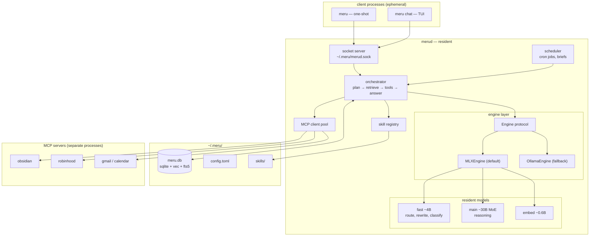
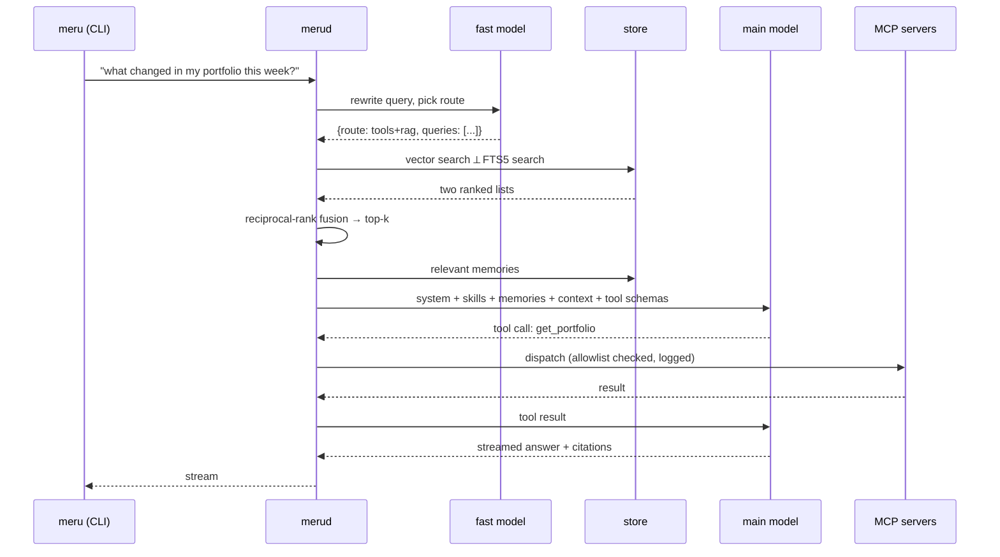

# Meru — Architecture

> Design document. Written before the implementation, deliberately. If the code and
> this file disagree, that's a bug in one of them — say which.

## Principles

1. **On-device is a boundary, not a marketing claim.** Network egress is denied by
   default and allowlisted per MCP server. There is no telemetry, and there is no
   code path that sends a prompt to a hosted model.
2. **Files are the source of truth; SQLite is a projection.** Everything in the
   database can be rebuilt from your files and config. Delete `meru.db` and re-index.
3. **Inspectable over clever.** Memory is readable rows. Skills are markdown files.
   Retrieved context is cited. You can always answer "why did it say that?"
4. **Narrow abstractions.** One thin engine protocol, one store, one tool protocol
   (MCP). Broad LLM framework abstractions rot within a release cycle.
5. **Latency is a feature.** If it isn't instant it won't get used, and the whole
   process model below exists to serve that.

---

## The shape: daemon + thin client

The central constraint: **a 30B MoE at 4-bit is ~17 GB and takes 20–30 s to load.**
A conventional CLI that spawns, loads, answers and exits is unusable. So Meru splits:

- **`merud`** — long-lived. Holds models resident, owns the store, maintains MCP
  connections, runs the scheduler.
- **`meru`** — thin client over a Unix domain socket at `~/.meru/merud.sock`.
  Starts in ~50 ms, streams tokens back, exits.

The useful consequence: **the resident-model requirement and the proactive-assistant
requirement are the same component.** Once `merud` exists to keep weights warm, the
scheduler is nearly free. This is why it's built first rather than retrofitted.



---

## Model tiers

Budget ~45 GB of the 64 GB for weights and KV cache; the rest keeps the machine
usable. At that ceiling, **MoE architecture matters more than parameter count.**

| Tier | Role | Size @ 4-bit | Resident |
|---|---|---|---|
| `fast` | routing, query rewrite, classification, trivial answers | ~3 GB | yes |
| `main` | reasoning, synthesis, tool selection | ~17 GB | yes |
| `embed` | index + query embeddings | ~1 GB | yes |
| `heavy` | optional escalation for hard problems | ~40 GB | on demand, evicts `main` |

Total steady-state ≈ 21 GB, leaving ~43 GB free.

**What does not fit:** a 120B MoE at 4-bit is ~60 GB. It will swap and thrash. Don't.

Concrete model choices live in `config.toml`, not here — they change faster than this
document should. The tiers are the contract; the weights are configuration.

---

## Engine layer

Deliberately small. Four methods, one dataclass of options:

```
Engine (protocol)
  ├── generate(messages, tools, opts)  -> Completion
  ├── stream(messages, tools, opts)    -> Iterator[Delta]
  ├── embed(texts)                     -> list[Vector]
  └── info()                           -> ModelInfo
```

Implementations: `MLXEngine` (default on Apple silicon — materially faster than the
alternatives for the same weights) and `OllamaEngine` (zero-setup fallback, also the
escape hatch for any model MLX hasn't got a conversion for).

Tool-call parsing normalizes per-model formats into one internal shape at this
boundary, so the orchestrator never sees a model-specific token.

---

## Storage

One SQLite file: `~/.meru/meru.db`. Extensions: `sqlite-vec` for vectors, built-in
FTS5 for keyword.

| Table | Holds |
|---|---|
| `documents` | indexed source files: path, mtime, hash, type |
| `chunks` | chunked text + metadata, FK to document |
| `chunk_vec` | vector index over chunks (sqlite-vec) |
| `chunk_fts` | FTS5 index over chunks |
| `memories` | durable facts: text, kind, source, created, last_used |
| `conversations` / `messages` | history, for context and for `meru log` |
| `tool_calls` | audit trail: every MCP call, args, result, duration |
| `jobs` / `job_runs` | scheduler definitions and outcomes |

`tool_calls` is not optional. An assistant with write-capable tools needs a ledger
you can read after the fact.

---

## Retrieval

Hybrid, because neither half is sufficient alone — vectors miss exact identifiers,
BM25 misses paraphrase.



Chunking is structure-aware: markdown by heading, code by symbol, PDF by page with
layout retained. Re-index is incremental on mtime + content hash.

---

## Memory

Memory is **explicit and writable by hand.** The model writes facts through a tool
call; each is one row with text, kind (`identity` / `preference` / `project` /
`reference`), provenance, and timestamps. Retrieval is by embedding similarity plus
recency, capped at a fixed context budget.

`meru memory list | add | forget` operates on it directly. If Meru believes something
wrong about you, you can find the row and delete it. An opaque vector blob you cannot
audit is not memory, it's a liability.

---

## Skills

Markdown with YAML frontmatter, in `~/.meru/skills/<name>/SKILL.md`:

```markdown
---
name: portfolio-review
description: Review holdings through a valuation lens. Use when asked about
  positions, concentration, or whether to buy or sell.
---

<the actual instructions, loaded only when triggered>
```

**Progressive disclosure:** only `name` and `description` sit in the system prompt.
The body loads when the router selects the skill. This keeps the context budget flat
as the skill count grows.

Because skills are just files, they're portable — the same directory can serve Meru
and any other agent that reads this format.

---

## MCP

Meru is a **client**, not a server host. It connects to MCP servers over stdio and
SSE, declared in `config.toml`, and merges their tools into one namespace with
per-server prefixes.

This is the highest-leverage decision in the project: every MCP server you already
run becomes a Meru capability with no code written.

```toml
[[mcp.servers]]
name    = "obsidian"
command = "..."
allow   = ["read", "search"]     # tool-level allowlist
network = false                   # egress denied
```

Tool exposure is **deny-by-default**. A server offering 40 tools contributes zero
until you allow specific ones.

---

## Scheduler

Jobs are prompts plus a cron expression, run by `merud` against the same
orchestrator a human query uses. Output goes to a digest, a file, or a notification.
`launchd` keeps `merud` alive across reboots; the scheduler lives inside the daemon
rather than in `launchd` so jobs share the warm model and the same audit trail.

---

## Privacy boundary

- No hosted-model code path exists. Not disabled — absent.
- MCP servers are allowlisted per tool; egress is opt-in per server.
- No telemetry, no crash reporting, no update check.
- The store is a plain file. Back it up or delete it; it's yours.
- `meru log` and the `tool_calls` table make every external action reviewable.

---

## Deliberate non-goals

- **Not a chat app clone.** No accounts, no sync, no mobile client.
- **Not a training framework.** Meru runs weights; it does not produce them.
- **Not multi-user.** One machine, one person. That assumption buys a lot of simplicity.
- **Not cloud-fallback-capable.** Adding "just call an API when the local model
  struggles" would quietly dissolve principle #1.

---

## Open questions

Carried forward, to be resolved with working code rather than argument:

1. **Router quality.** Can a ~4B model reliably choose between direct answer / RAG /
   tools? If not, the fast tier moves to ~8B and the memory budget shifts.
2. **Context assembly order.** Skills, memories and retrieved chunks compete for the
   same window. Needs a measured budget policy, not a guessed one.
3. **Model eviction.** When `heavy` loads, `main` must unload cleanly and reload fast.
   Worth measuring before committing to the tier design.
4. **TUI framework.** Textual is the obvious choice; confirm streaming feels right.
5. **PDF extraction.** Layout-aware extraction locally is still the weak link.
6. **Agent harness.** Unresolved, and the highest-impact open item. If Meru is built on
   an existing agent SDK rather than a hand-rolled loop, then the orchestrator, the tool
   loop and possibly the engine layer above are replaced by that harness — and Meru
   becomes retrieval + memory + skills + scheduling layered on top of it. That is a
   smaller, better project *if* the harness can be pointed at a local model endpoint and
   carries no hosted-model dependency. Decide this before writing v0.1.
