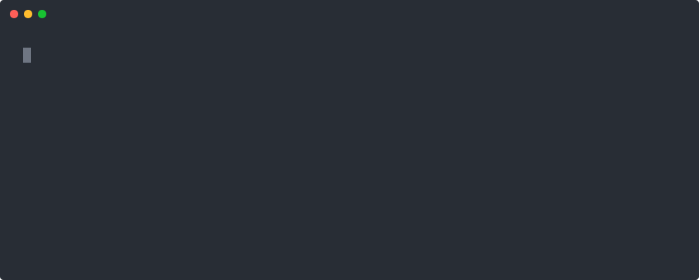

<p align="center"></p>

# Meru

**A personal AI assistant that runs entirely on your own machine.**

You have years of notes, a full inbox and a folder of repositories. The
assistants that could help with them want to read all of it in somebody else's
data center.

Meru reads it on your machine. Its code has no path to a cloud AI model, not even
a disabled one. It keeps open-weight models loaded in your computer's memory, so a
question needs no API key and costs only electricity, and the installer picks the
model that fits your Mac's memory.

[](https://github.com/aarora79/meru/releases/latest/download/Meru-macos-arm64.dmg)
[](https://github.com/aarora79/meru/releases/latest)

> **Status: pre-alpha, v0.4.9.** Answers from local models, your own files and
> tools you allow, with every tool call logged. Scheduled jobs come in v0.5.
> [ROADMAP.md](ROADMAP.md) · [release notes](docs/release-notes/README.md)

<p align="center"></p>

Meru answering from a folder of garden notes, recorded in real time on a Mac
Studio with the answer model for 64 GB Macs. The notes are invented;
[docs/demo/](docs/demo/README.md) holds them and shows how to record it again.

## How good are the local models?

We ran six answer models through a benchmark of 50 tasks, each three times:
direct questions, searches of your files, tasks that need one tool or several,
conversations over several turns, and honesty checks. Each installer picks the
answer model by your Mac's memory:

| Mac memory | Answer model | Tasks passed | Time to first token | Time to last token |
|------------|--------------|-------------:|--------------------:|-------------------:|
| under 32 GB | MiniCPM5-2B, the `lite` model | 68% | 11.6 s | 13.1 s |
| 32 to 47 GB | `gemma4:26b-a4b-it-qat` | 80% | 17.6 s | 18.3 s |
| 48 to 63 GB | `qwen3.6:35b` | 89% | 5.6 s | 10.4 s |
| 64 GB or more | `qwen3.6:35b-a3b-mxfp8` | 89% | 4.1 s | 6.5 s |

Times are medians on a Mac Studio (M4 Max, 64 GB) and count from the question
to the answer's first and last token, routing, search and tool calls included.
The tasks use the author's own files and mail, so they stay private; [the
benchmark results](docs/benchmarks/results.md) show every model we tried, pass
rates by kind of task, and charts of accuracy against speed.

## Install on a Mac

**In a window:** [download the Mac installer](https://github.com/aarora79/meru/releases/latest/download/Meru-macos-arm64.dmg), a disk image for Macs with
Apple silicon, open it, and open "Install Meru.app". Apple hasn't checked Meru,
so the first time macOS refuses: click Done, then Open Anyway in System
Settings, Privacy & Security.
It walks you through nine steps: Meru, Ollama and the models, the folders Meru
reads, web search in Docker, skills and commands, Gmail and Calendar, your name,
and starting `merud`. Each step says what it downloads before it starts, and you
can skip any but your name. [The Mac installer](docs/running.md#the-mac-installer)
lists what each step does.

**In Terminal:**

```sh
curl -fsSL https://github.com/aarora79/meru/releases/latest/download/install.sh | bash
```

The script downloads the latest release and checks it against `SHA256SUMS`. It
puts `meru` and `merud` in `~/.local/bin` and Meru.app in `/Applications`, then
offers Ollama, the models, `meru setup` and starting `merud` at login, asking
before each step. [docs/running.md](docs/running.md) covers Linux, Windows and
[building from source](docs/running.md#build-from-source).

Meru.app talks to `merud`, and `merud` to Ollama, so all three run together.
Either installer sets up all three; copying Meru.app by hand gives you a window
with nothing behind it.

## What it does

| Capability | What it means |
| --- | --- |
| **Local models** | Ollama runs the models on your machine, and `merud` keeps them loaded. |
| **Search over your files** | Meru searches your notes, docs, PDFs and repos by keyword (BM25) and by meaning, and names the file behind each answer. |
| **Web search** | The built-in `web_search` tool searches through SearXNG, which you run in Docker; no account or API key. The built-in `web_fetch` tool reads a whole public page, answers a question from it with the fast model, or downloads a file; it asks you before it opens an address no search or question of yours gave. Taking it out of `[builtin] tools` turns it off. [docs/running.md](docs/running.md#web-search) shows the setup. |
| **MCP tools** | `meru setup` offers two servers: `google` for Gmail, Calendar and Drive, and `obsidian` for notes. It adds each one for you or shows you what to paste, and `meru mcp` shows which ones are connected. |
| **Other agents** | Meru hands tasks to agents you have allowed, over A2A. |
| **Memory** | Meru saves what it learns about you as small Markdown files you can edit or delete. |
| **Skills** | A skill is a Markdown file of instructions that Meru loads when a question needs it. Meru ships with `writing`, `explainer`, `web-research` and `file-research`; `[skills] disabled` turns one off. |
| **Scheduled jobs** (v0.5) | Meru will run briefs and other jobs on a schedule, so it can tell you things before you ask. |
| **Observability** | Meru records the tokens, time and tool calls of every question as OpenTelemetry metrics and traces, and shows them in Grafana on your machine. |

## Why your own machine

Four reasons, most important first:

1. **Privacy you can check.** Meru reads your email, notes and calendar.
   On a machine you control, none of it ends up in anyone's training set.
2. **No cost per question.** Once you own the hardware, indexing ten years of notes
   or running a brief every morning adds nothing to any bill.
3. **It keeps working.** No deprecation notices, rate limits, outages or price
   changes. The model on your disk today still runs a year from now.
4. **You can inspect everything.** Your files are the source of truth, and the
   database is a copy Meru rebuilds from them: delete `meru.db` and Meru re-indexes.
   Memories and skills are Markdown files you can read, edit or delete.

Many assistants offer local models as one option next to cloud ones. Meru supports
local models only.

Two kinds of program can reach beyond your machine, and only once you add them to
config: MCP (Model Context Protocol) servers, such as Gmail and Calendar or your
Obsidian notes, and other agents over A2A (Agent2Agent). Meru allows none of their
tools until you name them, and logs every call. Web search goes through SearXNG, a
search engine you run on your machine, so only the search words leave it. When the
model needs what a page says, `merud` fetches that public page itself, and asks you
first for any address that no search or question of yours gave.

## What it is

Meru is two Go programs. `merud` is a daemon: it runs in the background, keeps the
models loaded, owns your index and memory, and talks to MCP servers and other
agents. `meru` is the command-line client; it connects to the daemon over a local
socket and starts in milliseconds, and Meru.app is a window onto the same daemon.
Go builds each program into one file that runs on macOS, Linux and Windows
([why Go](ARCHITECTURE.md#why-go)).

```
$ meru setup                               # Ollama, models, folders, tools
$ meru "what is the capital of France?"    # answered from the model alone
$ meru "when do I sow the tomatoes?"       # answered from your files, with Sources:
$ meru "search my obsidian vault for AI"   # calls a tool you allowed
$ meru chat                                # the terminal UI
$ meru log -n 20 -v                        # every tool call, with results
```

Config lives in `~/.meru/config.toml` and API keys in `~/.meru/secrets.toml`;
`meru setup` writes both. [Every command](docs/running.md#every-command) and
[every setting](docs/running.md#6-change-settings) are in docs/running.md.

## Why an enterprise would care

I built Meru for myself, and its design fits a common company problem: staff want
an assistant, and the data they would use it on can't leave the building.

- **The data stays put.** Meru runs on a laptop, a virtual desktop or a server in
  your own account, and reads email, documents, code and notes without sending any of
  it to a model provider. It can work on material that policy or regulation keeps
  in-house.
- **Every action is logged.** Each server's tools stay off until you allow them,
  risky ones ask before they run, and every call goes into an audit table and the
  session transcript. One function, `dispatch`, does all of this, so a reviewer
  checks one code path.
- **You can measure it.** For every question, Meru sends OpenTelemetry metrics and
  traces (tokens, time, which tool ran and which failed) to a collector you run, so
  usage and failures show up on a dashboard.
- **It installs anywhere.** Meru ships as native binaries, with no interpreter to
  install. It runs on employee laptops, virtual desktops, servers on your own network
  and machines with no internet connection.
- **No per-question bill.** You pay for the hardware you already own, so indexing
  ten years of records or running a daily brief for every employee depends on how
  much hardware you have.

Meru serves one person on one machine by design. A company would also want central
control over who may use which tools, and a summary of what the agents did, without
collecting anyone's data. The design leaves room for that; none of it exists yet.

## Hardware

Meru runs wherever Ollama and Go do:

- **macOS on Apple silicon:** supported and tested. Developed on a Mac Studio, M4 Max,
  64 GB.
- **Linux:** supported, including home servers and cloud virtual machines.
- **Windows 10 and later:** should work; not tested at first.

Two model profiles ship with it (see [ARCHITECTURE.md](ARCHITECTURE.md#model-tiers)):

- **`lite` (default):** MiniCPM5-2B and `nomic-embed-text`, about 2 GB of downloads.
  Needs 16 GB of RAM and runs on a CPU, faster with a GPU or Apple silicon.
- **`full`:** `qwen3.6:35b-a3b-mxfp8`, a 38 GB mixture of experts, and
  `qwen3-embedding:0.6b`. Needs Apple silicon with 64 GB or more.

[How good are the local models?](#how-good-are-the-local-models) gives the
answer model each installer picks for your Mac's memory, with its benchmark
results. The desktop app's Settings, Models lists the models we tried with
their `ollama pull` and `ollama run` commands and switches between them without
a restart. [docs/running.md](docs/running.md#which-model-for-which-mac) says
which model suits which Mac.

On a cloud server, Meru still sends no prompt to a model provider, but your data
lives on that server. The promise is "a machine you control"; where it sits is your
call.

## Docs

- [aarora79.github.io/meru](https://aarora79.github.io/meru/) — the web page: what
  Meru does, the install command and links to the three levels below
- Architecture, in three levels ([web pages](https://aarora79.github.io/meru/architecture/100.html)):
  - [100: the big picture](docs/architecture/100.md)
  - [200: how it works](docs/architecture/200.md)
  - [300: the full design](ARCHITECTURE.md), the design contract
- [docs/posters/](docs/posters/) — the Meru poster
- [docs/running.md](docs/running.md) — install, run and troubleshoot Meru
- [docs/faq/](docs/faq/index.md) — short answers to "how do I…" questions, one page each
- [docs/observability.md](docs/observability.md) — watch Meru on a local Grafana dashboard
- [docs/releasing.md](docs/releasing.md) — how a release gets built and published
- [docs/lld.md](docs/lld.md) — how the code fits together, for readers new to Go
- [ROADMAP.md](ROADMAP.md) — milestones, in shipping order
- [AGENTS.md](AGENTS.md) — repo rules for AI coding agents
- [CONTRIBUTING.md](CONTRIBUTING.md) — how to report a problem or send a change, and the contributor agreement

## Development

`make check` runs everything CI runs, and `make e2e` the end-to-end tests against a
fake Ollama. [CONTRIBUTING.md](CONTRIBUTING.md) says how to send a change,
[docs/ci.md](docs/ci.md) explains each check, and
[building from source](docs/running.md#build-from-source) is in docs/running.md.

## License

Apache License 2.0. [LICENSE](LICENSE) holds the full text, and [NOTICE](NOTICE)
the copyright line. You may use, change and ship Meru, in your own products
included, as long as you keep the notices.

Meru is a personal project. It is not affiliated with, endorsed by, or supported by
my employer.

Contributions come under the agreement in [CONTRIBUTING.md](CONTRIBUTING.md).

## The name

In some Eastern traditions, *Meru* (मेरु) is the cosmic mountain that the sun,
moon and stars turn around. This assistant takes the name because it works the
same way: it stays in one place, on your machine, and your notes, tools and daily
routine turn around it.
