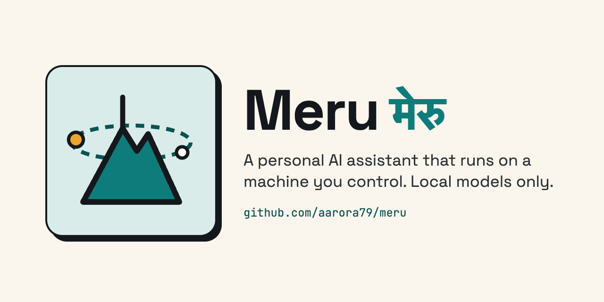

<p align="center"></p>

# Meru

**A personal AI assistant that runs entirely on your own machine.**

Meru runs local models only. Its code has no path to a cloud AI model, not even a
disabled one. It loads open-weight models into your computer's memory and keeps them
there, so a question needs no API key and costs only electricity.

Two kinds of program can reach beyond your machine, and only once you add them to
config: MCP (Model Context Protocol) servers such as web search or Gmail, and other
agents over A2A (Agent2Agent). Meru allows none of their tools until you name them,
and logs every call.

> **Status: pre-alpha, v0.1.** `merud` and `meru` answer questions with local models,
> stream the answer, keep session transcripts and pick a route with the one-token
> router. Search over your files, tools, memory and scheduled jobs come in later
> milestones; [ROADMAP.md](ROADMAP.md) lists them in order.

---

## What it is

Meru is two Go programs. `merud` is a daemon: it runs in the background, keeps the
models loaded, owns your index and memory, talks to MCP servers and runs scheduled
jobs. `meru` is the command-line client; it connects to the daemon over a local
socket and starts in milliseconds. Go builds each program into one file that runs on
macOS, Linux and Windows ([why Go](ARCHITECTURE.md#why-go)).

Working in v0.1:

```
$ meru "what is the capital of France?"   # one question, answer streamed as text
$ meru chat                                # interactive terminal UI
$ meru ping                                # is merud running?
```

Planned for later milestones:

```
$ meru setup                       # first run: models, folders, MCP servers (v0.3)
$ meru index ~/notes ~/repos       # build the local knowledge index (v0.2)
$ meru memory list                 # what it knows about you, in plain text (v0.4)
$ meru skills list                 # what it knows how to do (v0.4)
$ meru brief                       # today's digest, prepared in advance (v0.5)
```

## Quick start

You need [Go](https://go.dev/dl/) 1.26 or later and [Ollama](https://ollama.com)
0.12.11 or later, running on this machine.

```
$ ollama pull hf.co/openbmb/MiniCPM5-2B-GGUF:Q4_K_M   # the lite profile's chat model
$ ollama pull nomic-embed-text                         # the lite profile's embedding model
$ git clone https://github.com/aarora79/meru.git && cd meru
$ go install ./cmd/merud ./cmd/meru                    # into ~/go/bin
$ merud &                                              # loads the models and listens
$ meru "what is the capital of France?"
```

[docs/running.md](docs/running.md) is the full guide: settings, the `full` profile,
`meru chat`, running `merud` as a service, the local dashboard, troubleshooting and
uninstalling.

## Development

`make check` runs everything CI runs: formatting, `go vet`, staticcheck, the race
detector over every test, builds for five platforms, govulncheck, gosec, gitleaks
and actionlint. `make e2e` runs the end-to-end tests against a fake Ollama.
[docs/ci.md](docs/ci.md) explains each check, and [AGENTS.md](AGENTS.md) holds the
rules for changing the code.

## What it does

| Capability | What it means |
| --- | --- |
| **Local models** | Ollama runs the models on your machine, and `merud` keeps them loaded. |
| **Search over your files** | Meru searches your notes, docs, PDFs and repos by keyword (BM25) and by meaning, and names the file behind each answer. |
| **MCP tools** | `meru setup` offers web search, Gmail, Calendar, Drive and other servers, and either adds each one for you or shows you what to paste. |
| **Other agents** | Meru hands tasks to agents you have allowed, over A2A. |
| **Memory** | Meru saves what it learns about you as small Markdown files you can edit or delete. |
| **Skills** | A skill is a Markdown file of instructions that Meru loads when a question needs it. Meru ships with `writing` and `explainer`. |
| **Scheduled jobs** | Meru runs briefs and other jobs on a schedule, so it can tell you things before you ask. |
| **Observability** | Meru records the tokens, time and tool calls of every question as OpenTelemetry metrics and traces, and shows them in Grafana on your machine. |

## Why your own machine

Four reasons, most important first:

1. **Privacy you can check.** Meru reads your email, notes, finances and calendar.
   On a machine you control, none of it ends up in anyone's training set.
2. **No cost per question.** Once you own the hardware, indexing ten years of notes
   or running a brief every morning adds nothing to any bill.
3. **It keeps working.** No deprecation notices, rate limits, outages or price
   changes. The model on your disk today still runs a year from now.
4. **You can inspect everything.** Your files are the source of truth, and the
   database is a copy Meru rebuilds from them: delete `meru.db` and Meru re-indexes.
   Memories and skills are Markdown files you can read, edit or delete.

Many assistants offer local models as one option next to cloud ones. Meru supports
local models only.

## Why an enterprise would care

I built Meru for myself, and its design fits a common company problem: staff want
an assistant, and the data they would use it on can't leave the building.

- **The data stays put.** Meru runs on a laptop, a virtual desktop or a server in
  your own account, and reads email, documents, code and notes without sending any of
  it to a model provider. It can work on material that policy or regulation keeps
  in-house.
- **Every action is logged.** Each server's tools stay off until you allow them,
  risky ones ask before they run, and every call goes into an audit table and the
  session transcript. One function, `dispatch`, does all of this, so a reviewer
  checks one code path.
- **You can measure it.** For every question, Meru sends OpenTelemetry metrics and
  traces (tokens, time, which tool ran and which failed) to a collector you run, so
  usage and failures show up on a dashboard.
- **It installs anywhere.** Meru ships as native binaries, with no interpreter to
  install. It runs on employee laptops, virtual desktops, servers on your own network
  and machines with no internet connection.
- **No per-question bill.** You pay for the hardware you already own, so indexing
  ten years of records or running a daily brief for every employee depends on how
  much hardware you have.

Meru serves one person on one machine by design. A company would also want central
control over who may use which tools, and a summary of what the agents did, without
collecting anyone's data. The design leaves room for that; none of it exists yet.

## Hardware

Meru runs wherever Ollama and Go do:

- **macOS on Apple silicon:** supported and tested. Developed on a Mac Studio, M4 Max,
  64 GB.
- **Linux:** supported, including home servers and cloud VMs such as EC2.
- **Windows 10 and later:** should work; not tested at first.

Two model profiles ship with it (see [ARCHITECTURE.md](ARCHITECTURE.md#model-tiers)):

- **`lite` (default):** MiniCPM5-2B and `nomic-embed-text`, about 2 GB of downloads.
  Needs 16 GB of RAM and runs on a CPU, faster with a GPU or Apple silicon.
- **`full`:** Qwen 3.8 27B and `qwen3-embedding:0.6b`. Needs Apple silicon with
  32 GB (64 GB is comfortable), or a GPU with about 24 GB of memory.

On a cloud server, Meru still sends no prompt to a model provider, but your data
lives on that server. The promise is "a machine you control"; where it sits is your
call.

## Docs

- Architecture, in three levels ([web pages](https://aarora79.github.io/meru/architecture/)):
  - [100: the big picture](docs/architecture/100.md)
  - [200: how it works](docs/architecture/200.md)
  - [300: the full design](ARCHITECTURE.md), the design contract
- [docs/posters/](docs/posters/) — the Meru poster
- [docs/running.md](docs/running.md) — install, run and troubleshoot Meru
- [ROADMAP.md](ROADMAP.md) — milestones, in shipping order
- [AGENTS.md](AGENTS.md) — repo rules for AI coding agents

## License

MIT — see [LICENSE](LICENSE).

## The name

*Meru* (मेरु) is the cosmic mountain that the sun, moon and stars turn around. This
assistant takes the name because it works the same way: it stays in one place, on
your machine, and your notes, tools and daily routine turn around it.
