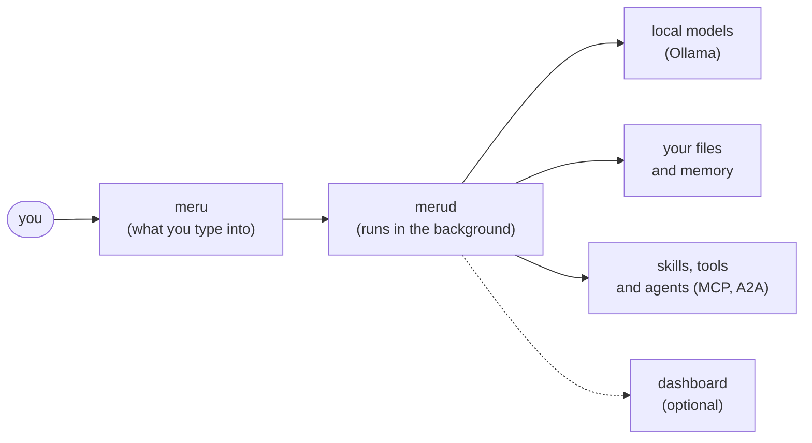
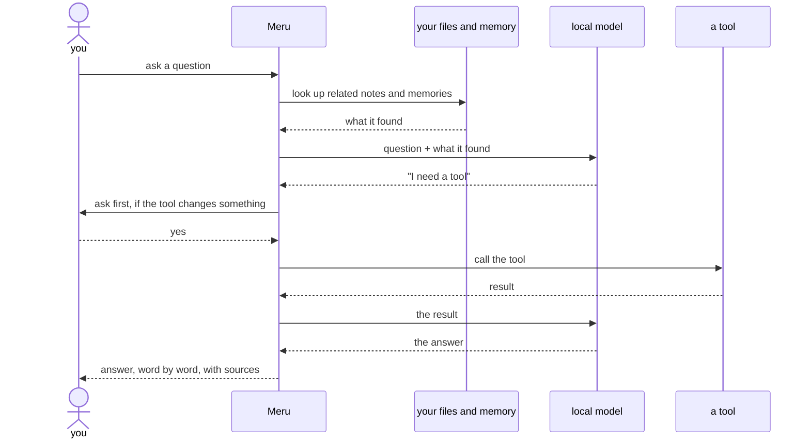

# Meru architecture, level 100: the big picture

*Meru* (मेरु) is a personal AI assistant that runs on a machine you control. It
answers questions from your notes and files, remembers what matters about you, and
uses tools such as web search, Gmail and your calendar. The models run on your own
machine, so no prompt goes to an AI company.

> **Why "Meru"?** Meru is the cosmic mountain that the sun, moon and stars turn
> around. This assistant takes the name because it works the same way: it stays in
> one place, on your machine, and your notes, tools and daily routine turn around it.

This page covers the main parts in a few minutes. [Level 200](200.md) explains how
each part works, and [level 300](../../ARCHITECTURE.md) is the full design.

## The parts

- **Built in Go.** Meru is two small programs: `meru`, which you type questions into,
  and `merud`, which runs in the background and does the work. Go builds them into
  single files that run on macOS, Linux and Windows with nothing else to install.
- **Local models.** Ollama, a free program, runs open-weight models, models whose
  files anyone can download, on your machine. The default `lite` setup needs about 2
  GB of downloads and runs on most computers; the `full` setup uses a bigger model
  for better answers and needs a stronger machine. `merud` keeps the models loaded,
  so answers start fast.
- **Your files.** You choose folders to index, such as your notes or documents. Meru
  searches them by keyword and by meaning, and names the file behind each answer.
- **Memory.** Meru saves what it learns about you as small Markdown files (plain text
  you can open in any editor), sorted into folders such as `me/`, `preferences/` and
  `projects/`. You can read, edit or delete any of them. It also writes a short
  summary of each conversation, so it can recall what you discussed last week.
- **Skills.** A skill is a Markdown file of instructions for one kind of task, such
  as writing a report or making a poster. Meru ships with three (`writing`,
  `explainer` and `poster-making`), loads a skill only when a question needs it, and
  picks up any skill you add.
- **Tools and other agents.** Meru uses tools through MCP (Model Context Protocol),
  an open standard many services already support: web search, Gmail, Calendar,
  Drive, your notes app. It can also hand a task to another agent over A2A
  (Agent2Agent). Tools start switched off; you turn on the ones you want, and Meru
  asks you before any tool call that sends, deletes or buys something.
- **Observability.** Meru records how long each step takes, how many words the model
  read and wrote, and which tools it called. With the optional dashboard (Grafana)
  running on your machine, you can see why an answer was slow or which tool failed.
  That data never leaves the machine.

## What happens when you ask

Most questions skip the tool steps. When the model needs live information or an
action, Meru calls the tool, and it only stops to ask you when the call would change
something. The answer appears word by word as the model writes it.

## What Meru won't do

- Send your questions to a hosted AI model. The code has no way to do it.
- Send telemetry, crash reports or update checks anywhere.
- Turn on a tool you haven't allowed, or run a risky one without asking you.

Every tool call Meru makes is written to a log you can read with `meru log`.

## Next

- [Level 200: how it works](200.md)
- [Level 300: the full design](../../ARCHITECTURE.md)
- [Roadmap](../../ROADMAP.md)
