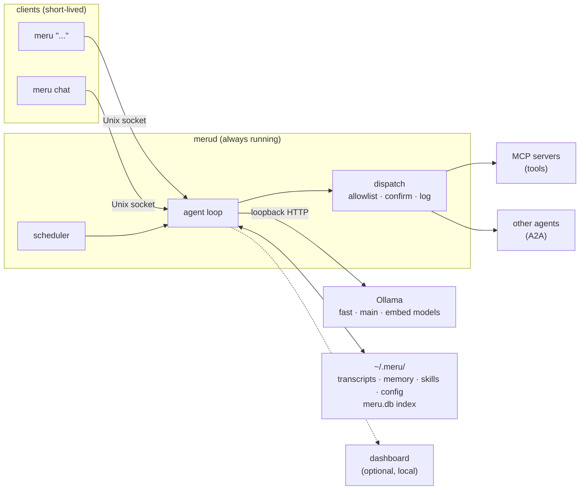
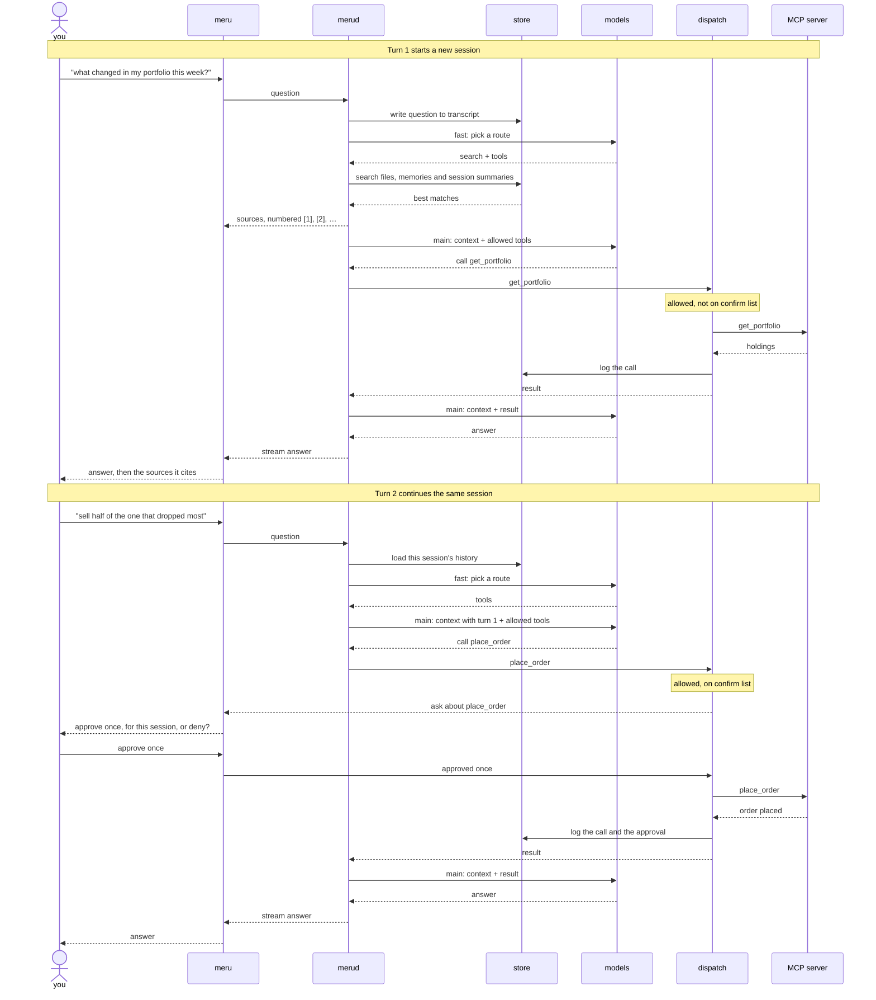
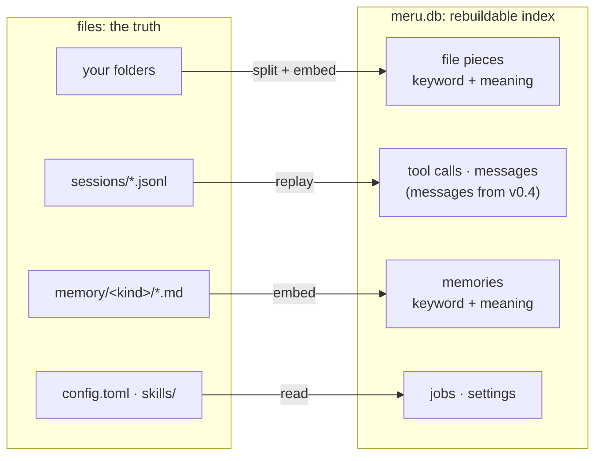
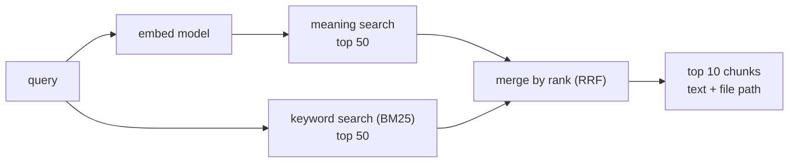
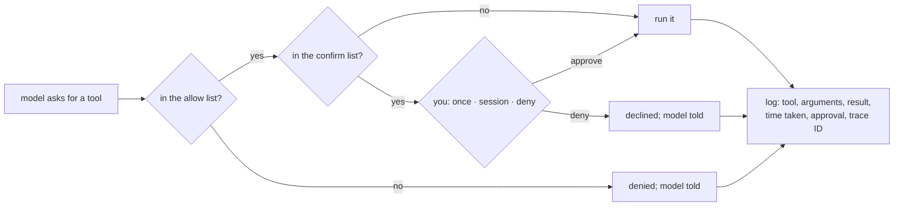

# Meru architecture, level 200: how it works

*Meru* (मेरु) is a personal AI assistant that runs on a machine you control. This page
explains each part in plain words, for readers who want to understand the system
without building it. [Level 100](100.md) gives the big picture.
[Level 300](../../ARCHITECTURE.md) is the full design; where the two disagree, level
300 wins.

## What Meru is

Meru answers questions, searches your notes and calls tools you already use, such as
your calendar or email. Every model it runs sits on the same machine as your files: a
Mac first, a Linux box or a cloud server you rent. Windows 10 and later should work
but is untested at first.

An assistant that reads your notes, mail and brokerage account could leak all three.
A *cloud model*, one that runs on another company's servers, would see every prompt.
Meru has no code that talks to one. It runs open-weight models through Ollama, a free
program that serves models on your own computer, and reaches Ollama over *loopback*,
the 127.0.0.1 address that never leaves the machine. Tools you add run as separate
programs, and one such as web search or Gmail can reach the network on its own (see
[Tools over MCP](#tools-over-mcp-other-agents-over-a2a)).

## Two programs: merud and meru

A tool that loaded a model for each question would make you wait every time: the
larger main model weighs about 18 GB and takes many seconds to read from disk. So Meru
runs as two programs.

- **`merud`** is a *daemon*, a program that runs in the background all the time. It
  keeps the models loaded, owns your stored data, holds the connections to tools, runs
  scheduled jobs and runs the *agent loop*, the code that turns a question into an
  answer.
- **`meru`** is the client you type into. It reaches `merud` through a *Unix socket*,
  a file (`~/.meru/merud.sock`) that two local programs talk through. It starts in
  about 50 ms, prints the answer as the model writes it, and exits.

**Why Go.** Both programs are written in Go rather than Python, the usual language
for AI tools. Each builds into one file of tens of megabytes that runs on macOS, Linux
or Windows with nothing else installed; a Python app would also need an interpreter
and its packages. `merud` runs all day, so its small memory use matters, and it
matters more when one server runs a Meru for each of many people, sharing one Ollama.
Go also runs streaming, parallel tool calls and background jobs side by side without
extra machinery, and its standard library covers most of what Meru needs, so Meru
depends on fewer outside packages. [Level 300](../../ARCHITECTURE.md#why-go) lists
all the reasons and the trade-off.

`meru "..."` asks one question and prints plain text, so it works in scripts.
`meru chat` keeps a conversation open in the terminal until you quit. On a cloud
server you run `meru` over SSH. After a reboot the operating system restarts `merud`:
`launchd` on macOS, `systemd` on Linux, a Windows service on Windows.



Two arrows leave `merud` for programs it doesn't own: one to Ollama, and one from
`dispatch` to tools and other agents. Each passes through one place in the code, and
the privacy rules sit in those two places.

## A question, end to end

A *turn* runs from your question to the finished answer. A *session* is one
conversation, a run of turns that share one transcript file. Four parts do the work:

- The **fast model** acts as the *router*. It picks a *route*: answer directly,
  search your files, call tools, or search and call tools. It picks nothing else;
  from v0.4 a second short call will pick which *skills*, files of instructions for
  one kind of task, to load.
  The router doesn't write its choice out as text, which a small model can garble.
  It labels the four routes A to D, asks for a single letter, and reads how likely
  the model thought each letter was. The most likely letter wins, and its likelihood
  is the router's confidence. When the router isn't confident enough, Meru searches
  your files and allows tools, which costs a little more but never leaves a question
  without the context it needs. The router's prompt names the folders you index,
  so it can tell that "what database does meru use" asks about your own project.
  On a labelled set of questions it held back from tuning, the router picks the
  right route for 32 of 40, in about 28 ms. When it still picks "answer directly"
  for a question that names one of your folders, Meru searches anyway. When a
  question names a tool server you connected, such as "search my Obsidian vault",
  Meru offers the tools even if the router left them out.
  ([Level 300](../../ARCHITECTURE.md#routing) and the
  [router design note](../fast-router.md) have the details.)
- The **main model** chooses tools and writes the answer.
- **`dispatch`** is the one function every tool call passes through. It checks the
  call against your config, asks you when config says to, runs it and logs it.
- An **MCP server** is a separate program that offers tools, such as a brokerage
  server's `get_portfolio`.



**Turn 1.** You ask what changed in your portfolio. `merud` writes the question to the
transcript, and the router picks "search and call tools". `merud` searches your files,
your memories and the summaries of past sessions for your question, sends the client
the numbered list of what it found, then gives the main model the best matches, your
question and a description of each tool you allowed. The model asks for `get_portfolio`, which is
allowed and needs no yes from you, so `dispatch` calls it and logs the call. The model
reads the holdings and writes an answer that cites the files it used by number, and
`meru` lists those files under the answer.

**Turn 2.** You type "sell half of the one that dropped most". `merud` loads this
session's earlier questions and answers, newest first, until their share of the
prompt fills. The router reads them too, and picks "call tools". It doesn't rewrite
your words. The main model reads turn 1's answer and works out which stock dropped
most. On a turn that searches, `merud` adds an earlier question to the search, so
a follow-up such as "and the one after that?" still finds the right files. It skips
questions such as "try that again" that name no subject. The model asks for `place_order`, which sits on the
server's *confirm list*, the tools that need your yes on every call. So `dispatch`
stops and asks.

Within a turn the main model either asks for tools or answers. Each time it asks,
`merud` runs the calls at the same time and hands back the results, and the client
shows a line for each call as it starts and ends. The turn ends when the model
answers, or after 8 rounds (a config setting); the last round offers no tools, so
the model has to answer. Only the two routes with tools send tool descriptions, and
a model can't call a tool it hasn't seen. The model reads up to 16,000 characters
of each result; the log keeps the first 4,000.

### Approving a tool call

| Choice | What happens |
| --- | --- |
| Approve once | This call runs. The next call to the same tool asks again. |
| Approve for this session | This call runs, and Meru stops asking about that tool, whatever its arguments, until the session ends. |
| Deny | The call doesn't run. The model hears that you said no, so it can answer without the tool or ask you what to do. |

The question and your answer travel over the same socket as the answer text.
`meru chat` shows the call in a box that opens with deny selected, so a stray Enter
runs nothing. One-shot `meru` asks on the terminal, `[o]nce [s]ession [d]eny`.
`merud` writes your choice to the transcript. A session approval never reaches the
config file; to stop Meru asking about a tool for good, you take it off the confirm
list yourself. When nobody can answer, as in a script, a pipe or a scheduled job,
the call doesn't run, and the log records it as declined.

## Models: three jobs, two profiles

Meru gives models three jobs, called *tiers*. The code asks for a tier, and the config
file names the model that fills it.

| Tier | Job |
| --- | --- |
| `fast` | routing, trivial answers |
| `main` | reasoning, choosing tools, writing the answer |
| `embed` | turning text into embeddings for search |

An *embedding* is a list of numbers that stands for a text's meaning. Two passages
that say the same thing in different words get lists that sit close together.

Two *profiles*, sets of models for the tiers, ship with Meru:

| | `lite` (the default) | `full` |
| --- | --- | --- |
| Chat models | MiniCPM5-2B (1.6 GB) fills both `fast` and `main` | MiniCPM5-2B for `fast`, Qwen 3.8 27B (about 18 GB) for `main` |
| Embedding model | `nomic-embed-text` (about 260 MB) | `qwen3-embedding:0.6b` |
| Needs | 16 GB of RAM; runs on a CPU, faster with a GPU or Apple silicon | Apple silicon with 32 GB (64 GB is comfortable), or a GPU with about 24 GB |

`merud` loads every tier at startup and asks Ollama to keep them loaded, so no
question waits for a model. Switching embedding models makes every stored embedding
useless, since each model makes lists of a different length. The index records which
model made its embeddings. When config names a different one, `merud` drops the old
embeddings, keeps keyword search working, and embeds your files again.

## Where data lives

**Files hold the truth, and the database is an index built from them.** Delete the
database and `merud` rebuilds it. The files are:

- the folders you ask Meru to index: notes, documents, PDFs, code;
- session transcripts in `~/.meru/sessions/`, one file per session;
- memories in `~/.meru/memory/`, one Markdown file per fact;
- `config.toml` and the `skills/` folder.

A transcript is a *JSON Lines* file: one small JSON record per line, one line per
event. `merud` adds lines and never rewrites old ones, so a crash loses at most the
line it was writing, and `grep` or `tail -f` can read it. Two lines from turn 1:

```json
{"ts":"2026-09-23T10:15:03Z","type":"tool_call","call_id":"call-1","kind":"mcp","server":"robinhood","tool":"get_portfolio","args":{},"trace_id":"4bf9…"}
{"ts":"2026-09-23T10:15:09Z","type":"assistant","text":"Two positions moved…","tokens_in":2310,"tokens_out":188,"trace_id":"4bf9…"}
```

The index is one SQLite file, `~/.meru/meru.db`, readable only by you. It holds your
files cut into pieces, with a keyword index and an embedding for each piece, and
since v0.3 a row for every tool call. Later milestones add the rest: every message
and your memories (v0.4), and your scheduled jobs with the outcome of each run
(v0.5). If you delete `meru.db`, `merud` rebuilds the tool calls from the
transcripts when it next starts. Each message and tool call keeps its turn's
*trace ID*, a label that links it to the timing data in
[What you can see](#what-you-can-see).



## Getting your content in

Meru reads only the folders you list under `[index] folders` in `config.toml`, and
none until you list one. Inside them the *indexer* skips, in order: symbolic links,
which it never follows; secret files such as `.env` or `id_rsa`, which no ignore
file can bring back; hidden files; build folders such as `node_modules`; anything a
`.gitignore` or `.meruignore` names; media, archives and programs; files over 5 MB;
and anything else that isn't text. A `.meruignore` uses `.gitignore` syntax, so you
can skip more, or bring back with `!name` a file git ignores.

The indexer cuts each file into *chunks* of about 500 tokens along its own
structure: Markdown by heading, Go code by function or type, other code and text by
blank lines, HTML by heading, and PDFs by page, as plain text without layout. Each
chunk repeats the last 50 tokens of the one before, so a sentence cut at a boundary
still appears whole somewhere.

`merud` reads the folder list when it starts, so a change takes a restart. It scans
the folders at startup and re-reads a file only when its timestamp or contents
change. While it runs it watches the folders, and re-indexes a file half a second
after you save it. `meru index` rescans on demand, and `meru index -status` shows
what the index holds. Email, calendar and Drive stay out of the index: Meru asks
their tools at question time, so your mail never lands in `meru.db`.

## Finding things: hybrid search

Each common way to search misses one kind of question:

- **Search by meaning** compares embeddings. It finds a note about "Nvidia's quarterly
  results" when you ask about earnings, but can miss an exact string such as a ticker.
- **Keyword search** ranks chunks with *BM25*, the standard formula for how well a
  passage's words match the query's. It finds "NVDA" every time, and misses a note
  that uses other words.

Meru runs both, takes the top 50 from each, and merges the two lists. Their scores
use different scales, so adding them would let one list drown the other.
*Reciprocal-rank fusion* (RRF) ignores the scores and uses only each chunk's place: a
chunk earns 1 ÷ (60 + its place) from every list it appears in, and the amounts add
up.

Take the query "NVDA results". Suppose keyword search returns `trades.md`,
`earnings.md`, `watchlist.md`, and meaning search returns `earnings.md`,
`chip-stocks.md`, `trades.md`:

| Chunk | Keyword place | Meaning place | Sum | Score |
| --- | --- | --- | --- | --- |
| `earnings.md` | 2 | 1 | 1/62 + 1/61 | 0.0325 |
| `trades.md` | 1 | 3 | 1/61 + 1/63 | 0.0323 |
| `chip-stocks.md` | — | 2 | 1/62 | 0.0161 |
| `watchlist.md` | 3 | — | 1/63 | 0.0159 |

`earnings.md` wins because both searches rank it high. `chip-stocks.md` never names
the ticker but still makes the list through meaning. The 60 keeps first and second
place within about 1.6% of each other, so a chunk both lists agree on beats one that
only a single list ranks first. Meru keeps the top 10, loads their text and file
paths, and numbers them in the prompt. The main model cites them as `[1]`, `[2]`, and
`meru` prints the cited files under the answer. When the answer cites nothing,
`meru` lists every excerpt the model read, unless the turn called a tool: then the
answer may come from the tool, and `meru` lists none. The prompt also names the folders
Meru indexes, so the model doesn't claim it can't see your files while it reads
them. The sizes 50 and 10 are constants in
the code, not settings; we'll tune them once we have measurements.

Meru stores each embedding as a plain row in `meru.db` and compares the question
with every one. On the development machine that takes 13 ms over 10,000 chunks and
about 150 ms over 100,000, fast enough for a personal index.

The search runs on the two routes that search, and looks for your question, plus an
earlier question on a follow-up. The tools route searches too, because the router
sends some questions about your files there. So far it searches file chunks; from
v0.4 it also searches memories and the summaries of past sessions. RRF merges the
two lists within each source, and each source gets its own share of the prompt, so
one busy source can't crowd out the others.



## Memory

Meru remembers facts about you between sessions. Each memory is a small Markdown file,
one fact per file, in a folder named for its kind:

```text
~/.meru/memory/
  me/            who you are: role, family, where you live
  preferences/   how you like things done
  projects/      ongoing work, goals, deadlines
  people/        people you mention and how they relate to you
  reference/     where things live: accounts, URLs, tools
  other/         anything worth keeping that fits no folder above
```

```markdown
---
created: 2026-09-23
source: session 2026-09-23T101502-7f3a
---
Prefers index funds over individual stocks for retirement accounts.
```

The header names the session the fact came from, so you can read the exchange that
produced it. To make Meru forget, delete the file or run `meru memory forget`. A new
folder becomes a new kind with no code change.

- **Saving.** The model calls `remember`, a *built-in tool* that `merud` provides
  itself. The call goes through `dispatch`, so it lands in the log. Memories save
  without asking unless you add `remember` to the built-in confirm list, which ships
  empty. `remember` arrives in v0.4.
- **Recall.** Every turn searches memories by meaning and by keyword, adds a third
  list ranked by recency, and merges the three with RRF. Recall runs on every route,
  so a preference such as "always ask before trading" reaches the model on the turn
  that trades.
- **Episodes.** When a session ends, the fast model writes a one- or two-sentence
  summary into the transcript, and Meru embeds it. "What did we decide about the
  portfolio last week?" then finds the right session.

If Meru believes something wrong about you, you find the file and fix it. You could
not check or correct a memory stored only as numbers.

## Skills

A skill is a Markdown file of instructions at `~/.meru/skills/<name>/SKILL.md`, with a
name and a short description of when to use it. The prompt carries only names and
descriptions. `merud` loads a skill's full text when a short model call picks it, so
adding skills barely grows the prompt.

Two skills ship inside the program:

| Skill | What it does |
| --- | --- |
| `writing` | plain-English rules for any prose Meru writes: emails, summaries, reports |
| `explainer` | builds a self-contained web page that teaches a topic, with diagrams |

On first run `merud` copies them to `~/.meru/skills/`. It never overwrites a skill
you've edited, and `meru skills reset <name>` restores the shipped one. You add a
skill by dropping in a folder. Skills that make files will use the built-in
`write_file` tool (v0.4), which writes only inside `~/meru-output/` unless you
change it. These skills
work best on the `full` profile; the 2B model writes weaker pages.

## Tools over MCP, other agents over A2A

*MCP* (Model Context Protocol) is an open standard for programs that offer tools to an
assistant. Meru is an MCP client. It either starts a local server and talks over its
input and output (*stdio*), or connects to a server already running at a URL
(*Streamable HTTP*). The model sees each allowed tool as `<server>.<tool>`, such
as `obsidian.search_vault`. *A2A* (Agent2Agent) is an open standard for handing a
task to another agent. The model sees each allowed agent skill as one more tool,
named `a2a.<agent>.<skill>`, that takes a message and returns the agent's answer.
Meru reads an agent's *card*, the file where it lists its skills, the first time a
turn needs it, so an agent that starts after `merud` still shows up.

Both follow the same rules, set per server or agent in `config.toml`:

- **Deny by default.** A server that offers 40 tools gives the model none until you
  name specific ones in its `allow` list. Wildcards aren't allowed: a `*` would let
  in tools a server adds in a later release, which nobody has read.
- **Confirm.** Tools on the `confirm` list ask you on every call.
- **Loopback unless you say otherwise.** `merud` refuses a server or agent URL off
  this machine unless its entry says `network = true`. An agent elsewhere may pass
  your message to a cloud model, so that setting means consent for your data to
  leave. The A2A client checks each address again as it connects, and follows no
  redirects, so an agent's card can't point the calls somewhere else.
- **One door.** MCP tools, A2A agents and the built-in tools all go through
  `dispatch`. No other code reaches them. v0.3 has one built-in tool, `configure`;
  `remember` and `write_file` come in v0.4. The built-in tools need no allow entry:
  the model always sees them.



`dispatch` logs every call to the transcript and the `tool_calls` table, and
`meru log` shows the newest ones (`-n` for how many, `-v` for each result).
`meru tools` shows each server, whether `merud` reached it, and the tools the model
may use. A call to a tool you didn't allow doesn't run, but it still
gets a row, so a model that keeps reaching for forbidden tools shows up in the log. An assistant that can place orders or send email needs a record
you can read afterwards.

Each call has a time limit, 60 seconds unless the server's entry sets another. A
server that crashes restarts on the next call to one of its tools, at most once
every 10 seconds. A server Meru starts gets only a short list of environment
variables plus its own, so it can't read another tool's API key from `merud`'s
environment.

Meru doesn't confine MCP servers. Each runs as an ordinary program with your
permissions and can read files or reach the network on its own. The allowlist decides
which tools the model may call; the server decides what each call does. Adding a
server means trusting it, as with any program you install.

## Scheduled jobs

A job is a prompt plus a *cron expression*, the standard format for "run at these
times", such as every weekday at 7:00. You list jobs in `config.toml`. `merud` runs the prompt through the same agent
loop as a typed question and sends the output to a digest, a file or a notification;
`meru brief` shows the day's digest. Nobody watches a job, so no tool on a confirm
list runs, and the output names the calls it skipped. Each run is a
session with its own transcript, so a job's work shows up in the same log and traces
as your questions, and it uses the same loaded models.

## First run and setup

`meru setup` walks you through five steps in the terminal. You can run it again at
any time; v0.3 doesn't start it for you the first time you run `meru`.

1. **Ollama.** Meru checks that Ollama runs, and if not, prints the install step
   and waits.
2. **Models.** You pick `lite` or `full`, and Meru downloads the models with
   `ollama pull`.
3. **Your files.** Meru asks which folders to index and writes a short
   `config.toml`. It never rewrites a config file you already have, because that
   would drop your comments; it tells you what to edit instead.
4. **Tools.** Meru offers its starter MCP servers one at a time. You can skip any.
5. **A test question**, when `merud` runs, so you see it work.

The starter catalog covers Brave web search, web page fetch, Gmail, Calendar, Drive
and Docs, and Obsidian. Each entry knows how to start its server, what it needs (an
API key, or a Google sign-in), and safe starting lists: reading allowed, anything
that sends, writes or changes something on the confirm list. For each server you
pick **"Do it for me"**, where Meru asks for what the server needs and writes the
config block after you approve it, or **"Show me how"**, where Meru prints the block
and you paste it in. Later, `meru mcp add gmail` offers the same choice.

For a server outside the catalog, `meru mcp add <name> -- <command>` (or `--url`)
writes an entry that allows no tools yet. Meru can't know a server's tool names
before it connects, so after a restart you run `meru tools`, see what the server
offers, and add the tools you want.

In chat, "connect my Gmail" makes the model call the built-in `configure` tool,
which adds the entry and reloads the servers without a restart. `configure` asks
every time and offers only "approve once" or "deny". No setting turns that prompt
off, so the model can't grant itself lasting trust. It never takes an API key:
when a server needs one that isn't saved yet, it sends you to `meru mcp add` in a
terminal, so the key never passes through the model.

API keys go in `~/.meru/secrets.toml`, and config names them as `secret:<name>`.
`merud` refuses to start if other users can read that file, and strips the keys
from transcripts, the tool log, logs and traces.

## What you can see

Meru times every stage of a turn with *OpenTelemetry*, the open standard for timing
and counting what software does. A *trace* follows one turn and splits it into timed
steps: routing, search, each model call, each tool call. A slow answer then shows
which step took the time. A *metric* adds numbers up across turns, such as tokens per
model or how often a tool fails.

- Export stays off until you set an address in config, and `merud` refuses to start
  if that address isn't on loopback.
- Traces carry token counts, times, model names and tool names, and no prompt or
  answer text unless you switch it on. Each tool call gets a span of its own, with
  its outcome and your approval.
- The repo ships one container, `grafana/otel-lgtm`, that stores the data and shows a
  ready-made Meru dashboard in Grafana, listening on 127.0.0.1 only.

The trace ID ties the two views together: a slow step in Grafana leads to the exact
messages and tool calls in the log, and back.

Without the dashboard, `merud`'s own log file answers the same question. By default it
writes one line per turn with its route, total time and time to first token. Started
with `merud -v`, it writes a line for each step as well, each with the turn's trace ID
and none with your text.

## The privacy rules

- The code has no path to a cloud model. The engine talks only to Ollama on loopback.
- You allow MCP tools and A2A agent skills one by one. An agent or Streamable HTTP
  server off this machine needs `network = true` in its config entry.
- Meru doesn't sandbox MCP servers, so choose them as you would any program.
- API keys sit in one file only you can read, never in config, and never pass
  through the model.
- No telemetry leaves your machine. Meru's timing data goes only to loopback, without
  your text unless you opt in. Meru sends no crash reports and never checks for
  updates.
- Your data lives in plain files and one SQLite file that you can back up or delete.
- `meru log` and the `tool_calls` table show every action Meru took outside itself.

## Where to go next

- [Level 100](100.md): the big picture in two diagrams.
- [Level 300, ARCHITECTURE.md](../../ARCHITECTURE.md): the full design, with the
  engine interface, database tables, metric names, config keys and open questions.
- [ROADMAP.md](../../ROADMAP.md): the five milestones, in shipping order.
- [README.md](../../README.md): commands and hardware.
- [The Meru poster](../posters/meru-poster.html): the design on one printable page.
