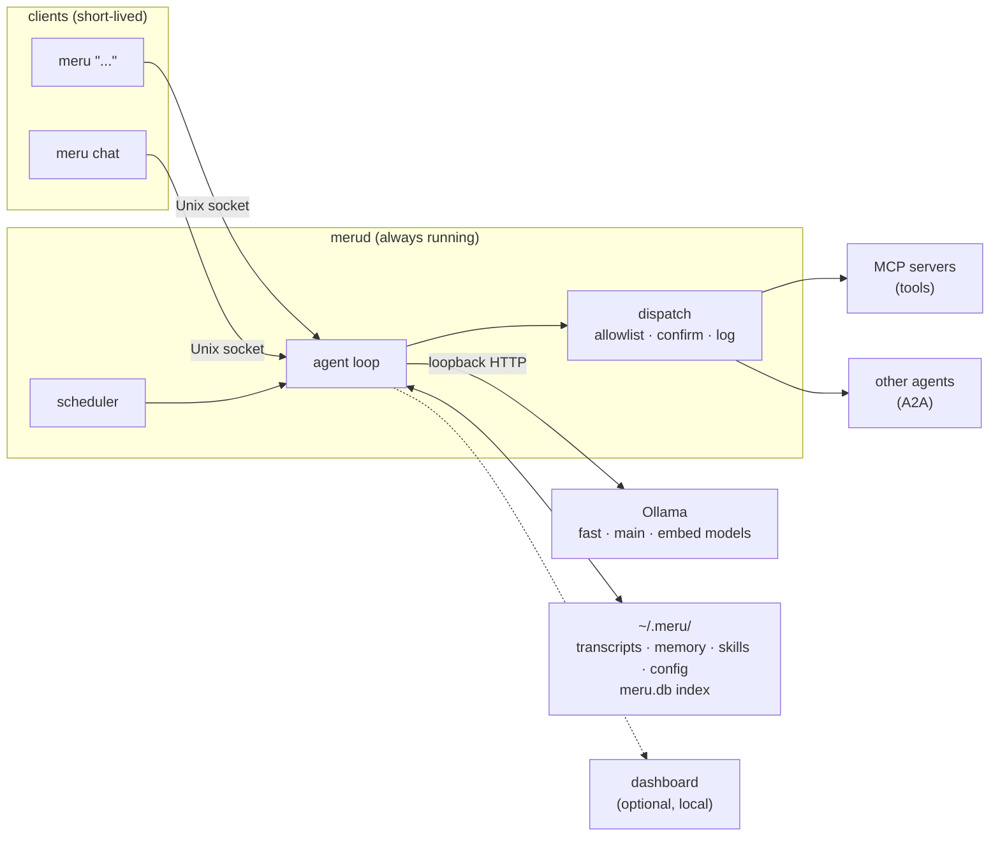
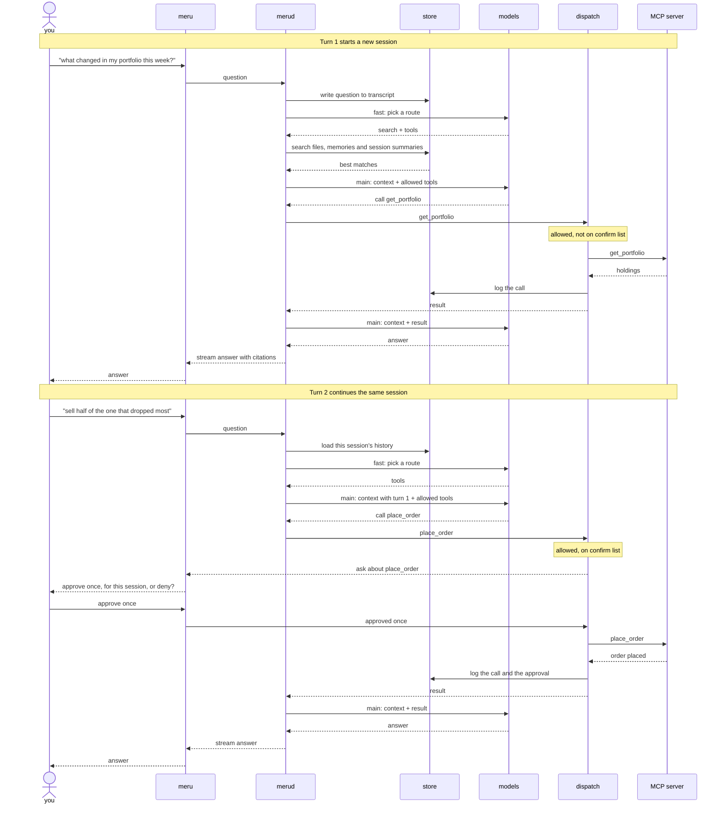
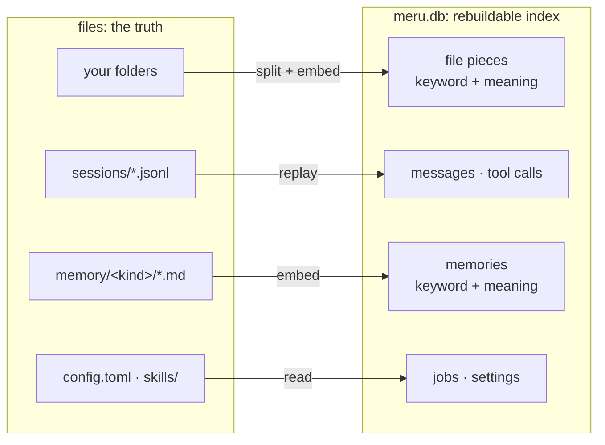
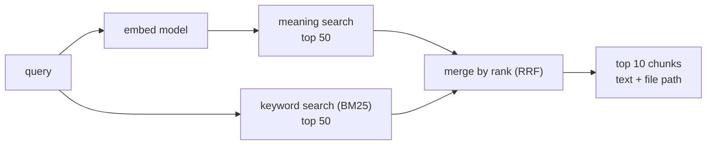
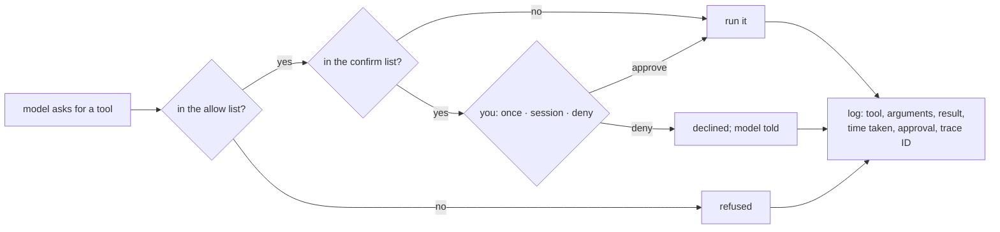

# Meru architecture, level 200: how it works

*Meru* (मेरु) is a personal AI assistant that runs on a machine you control. This page
explains each part in plain words, for readers who want to understand the system
without building it. [Level 100](100.md) gives the big picture.
[Level 300](../../ARCHITECTURE.md) is the full design; where the two disagree, level
300 wins.

## What Meru is

Meru answers questions, searches your notes and calls tools you already use, such as
your calendar or email. Every model it runs sits on the same machine as your files: a
Mac first, a Linux box or a cloud server you rent. Windows 10 and later should work
but is untested at first.

An assistant that reads your notes, mail and brokerage account could leak all three.
A *hosted model*, one that runs on another company's servers, would see every prompt.
Meru has no code that talks to one. It runs open-weight models through Ollama, a free
program that serves models on your own computer, and reaches Ollama over *loopback*,
the 127.0.0.1 address that never leaves the machine. Tools you add run as separate
programs, and one such as web search or Gmail can reach the network on its own (see
[Tools over MCP](#tools-over-mcp-other-agents-over-a2a)).

## Two programs: merud and meru

A tool that loaded a model for each question would make you wait every time: the
larger main model weighs about 18 GB and takes many seconds to read from disk. So Meru
runs as two programs.

- **`merud`** is a *daemon*, a program that runs in the background all the time. It
  keeps the models loaded, owns your stored data, holds the connections to tools, runs
  scheduled jobs and runs the *agent loop*, the code that turns a question into an
  answer.
- **`meru`** is the client you type into. It reaches `merud` through a *Unix socket*,
  a file (`~/.meru/merud.sock`) that two local programs talk through. It starts in
  about 50 ms, prints the answer as the model writes it, and exits.

`meru "..."` asks one question and prints plain text, so it works in scripts.
`meru chat` keeps a conversation open in the terminal until you quit. On a cloud
server you run `meru` over SSH. After a reboot the operating system restarts `merud`:
`launchd` on macOS, `systemd` on Linux, a Windows service on Windows.



Two arrows leave `merud` for programs it doesn't own: one to Ollama, and one from
`dispatch` to tools and other agents. Each passes through one place in the code, and
the privacy rules sit in those two places.

## A question, end to end

A *turn* runs from your question to the finished answer. A *session* is one
conversation, a run of turns that share one transcript file. Four parts do the work:

- The **fast model** acts as the *router*. It rewrites your question into a better
  search query and picks a *route*: answer directly, search your files, call tools,
  or search and call tools. It also picks which *skills*, files of instructions for
  one kind of task, to load.
- The **main model** chooses tools and writes the answer.
- **`dispatch`** is the one function every tool call passes through. It checks the
  call against your config, asks you when config says to, runs it and logs it.
- An **MCP server** is a separate program that offers tools, such as a brokerage
  server's `get_portfolio`.



**Turn 1.** You ask what changed in your portfolio. `merud` writes the question to the
transcript, and the router picks "search and call tools". `merud` searches your files,
your memories and the summaries of past sessions, then gives the main model the best
matches, your question and a description of each tool you allowed. The model asks for `get_portfolio`, which is
allowed and needs no yes from you, so `dispatch` calls it and logs the call. The model
reads the holdings and writes an answer that cites the files it used.

**Turn 2.** You type "sell half of the one that dropped most". `merud` loads this
session's earlier questions and answers, newest first, until their share of the
prompt fills. The router reads them too, so it can rewrite "the one that dropped most"
into a query that names the stock. The model asks for `place_order`, which sits on the
server's *confirm list*, the tools that need your yes on every call. So `dispatch`
stops and asks.

Within a turn the main model either asks for a tool or answers. Each time it asks,
`merud` runs the tool and hands back the result. The turn ends when the model answers,
or after 8 rounds (a config setting). When the route leaves tools out, `merud` sends
no tool descriptions, and a model can't call a tool it hasn't seen.

### Approving a tool call

| Choice | What happens |
| --- | --- |
| Approve once | This call runs. The next call to the same tool asks again. |
| Approve for this session | This call runs, and Meru stops asking about that tool, whatever its arguments, until the session ends. |
| Deny | The call doesn't run. The model hears that you said no, so it can answer without the tool or ask you what to do. |

`merud` writes your choice to the transcript. A session approval never reaches the
config file; to stop Meru asking about a tool for good, you take it off the confirm
list yourself. When nobody can answer, as in a script or a scheduled job, `dispatch`
denies the call.

## Models: three jobs, two profiles

Meru gives models three jobs, called *tiers*. The code asks for a tier, and the config
file names the model that fills it.

| Tier | Job |
| --- | --- |
| `fast` | routing, rewriting queries, trivial answers |
| `main` | reasoning, choosing tools, writing the answer |
| `embed` | turning text into embeddings for search |

An *embedding* is a list of numbers that stands for a text's meaning. Two passages
that say the same thing in different words get lists that sit close together.

Two *profiles*, sets of models for the tiers, ship with Meru:

| | `lite` (the default) | `full` |
| --- | --- | --- |
| Chat models | MiniCPM5-2B (1.6 GB) fills both `fast` and `main` | MiniCPM5-2B for `fast`, Qwen 3.8 27B (about 18 GB) for `main` |
| Embedding model | `nomic-embed-text` (about 260 MB) | `qwen3-embedding:0.6b` |
| Needs | 16 GB of RAM; runs on a CPU, faster with a GPU or Apple silicon | Apple silicon with 32 GB (64 GB is comfortable), or a GPU with about 24 GB |

`merud` loads every tier at startup and asks Ollama to keep them loaded, so no
question waits for a model. Switching embedding models makes every stored embedding
useless, since each model makes lists of a different length. The index records which
model made its embeddings, and when config names a different one, `merud` rebuilds
them from your files.

## Where data lives

**Files hold the truth, and the database is an index built from them.** Delete the
database and `merud` rebuilds it. The files are:

- the folders you ask Meru to index: notes, documents, PDFs, code;
- session transcripts in `~/.meru/sessions/`, one file per session;
- memories in `~/.meru/memory/`, one Markdown file per fact;
- `config.toml` and the `skills/` folder.

A transcript is a *JSON Lines* file: one small JSON record per line, one line per
event. `merud` adds lines and never rewrites old ones, so a crash loses at most the
line it was writing, and `grep` or `tail -f` can read it. Two lines from turn 1:

```json
{"ts":"2026-09-23T10:15:03Z","type":"tool_call","kind":"mcp","server":"robinhood","tool":"get_portfolio","args":{},"trace_id":"4bf9…"}
{"ts":"2026-09-23T10:15:09Z","type":"assistant","text":"Two positions moved…","tokens_in":2310,"tokens_out":188,"trace_id":"4bf9…"}
```

The index is one SQLite file, `~/.meru/meru.db`. It holds your files cut into pieces,
with a keyword index and an embedding for each piece; every message and tool call;
your memories; and your scheduled jobs with the outcome of each run. Each message and tool call keeps its turn's
*trace ID*, a label that links it to the timing data in
[What you can see](#what-you-can-see).



## Finding things: hybrid search

The indexer cuts each file into *chunks* along its own structure: Markdown by
heading, code by function, PDFs by page. It re-reads a file only when its timestamp
and contents change.

Each common way to search misses one kind of question:

- **Search by meaning** compares embeddings. It finds a note about "Nvidia's quarterly
  results" when you ask about earnings, but can miss an exact string such as a ticker.
- **Keyword search** ranks chunks with *BM25*, the standard formula for how well a
  passage's words match the query's. It finds "NVDA" every time, and misses a note
  that uses other words.

Meru runs both, takes the top 50 from each, and merges the two lists. Their scores
use different scales, so adding them would let one list drown the other.
*Reciprocal-rank fusion* (RRF) ignores the scores and uses only each chunk's place: a
chunk earns 1 ÷ (60 + its place) from every list it appears in, and the amounts add
up.

Take the query "NVDA results". Suppose keyword search returns `trades.md`,
`earnings.md`, `watchlist.md`, and meaning search returns `earnings.md`,
`chip-stocks.md`, `trades.md`:

| Chunk | Keyword place | Meaning place | Sum | Score |
| --- | --- | --- | --- | --- |
| `earnings.md` | 2 | 1 | 1/62 + 1/61 | 0.0325 |
| `trades.md` | 1 | 3 | 1/61 + 1/63 | 0.0323 |
| `chip-stocks.md` | — | 2 | 1/62 | 0.0161 |
| `watchlist.md` | 3 | — | 1/63 | 0.0159 |

`earnings.md` wins because both searches rank it high. `chip-stocks.md` never names
the ticker but still makes the list through meaning. The 60 keeps first and second
place within about 1.6% of each other, so a chunk both lists agree on beats one that
only a single list ranks first. Meru keeps the top 10, loads their text and file
paths, and the main model cites those paths. The sizes 50 and 10 are starting values
in config.

Each turn runs this search over three sources: file chunks, memories and the summaries
of past sessions. RRF merges the two lists within each source, and each source gets its
own share of the prompt, so one busy source can't crowd out the others.



## Memory

Meru remembers facts about you between sessions. Each memory is a small Markdown file,
one fact per file, in a folder named for its kind:

```text
~/.meru/memory/
  me/            who you are: role, family, where you live
  preferences/   how you like things done
  projects/      ongoing work, goals, deadlines
  people/        people you mention and how they relate to you
  reference/     where things live: accounts, URLs, tools
  other/         anything worth keeping that fits no folder above
```

```markdown
---
created: 2026-09-23
source: session 2026-09-23T101502-7f3a
---
Prefers index funds over individual stocks for retirement accounts.
```

The header names the session the fact came from, so you can read the exchange that
produced it. To make Meru forget, delete the file or run `meru memory forget`. A new
folder becomes a new kind with no code change.

- **Saving.** The model calls `remember`, a *built-in tool* that `merud` provides
  itself. The call goes through `dispatch`, so it lands in the log. Memories save
  without asking unless you add `remember` to the built-in confirm list, which ships
  holding only `write_file`.
- **Recall.** Every turn searches memories by meaning and by keyword, adds a third
  list ranked by recency, and merges the three with RRF. Recall runs on every route,
  so a preference such as "always ask before trading" reaches the model on the turn
  that trades.
- **Episodes.** When a session ends, the fast model writes a one- or two-sentence
  summary into the transcript, and Meru embeds it. "What did we decide about the
  portfolio last week?" then finds the right session.

If Meru believes something wrong about you, you find the file and fix it. You could
not check or correct a memory stored only as numbers.

## Skills

A skill is a Markdown file of instructions at `~/.meru/skills/<name>/SKILL.md`, with a
name and a short description of when to use it. The prompt carries only names and
descriptions. `merud` loads a skill's full text when the router picks it, so adding
skills barely grows the prompt.

Three skills ship inside the program:

| Skill | What it does |
| --- | --- |
| `writing` | plain-English rules for any prose Meru writes: emails, summaries, reports |
| `explainer` | builds a self-contained web page that teaches a topic, with diagrams |
| `poster-making` | builds a printable one-page poster as HTML, plus PNG and PDF when a browser is available |

On first run `merud` copies them to `~/.meru/skills/`. It never overwrites a skill
you've edited, and `meru skills reset <name>` restores the shipped one. You add a
skill by dropping in a folder. Skills that make files use the built-in `write_file`
tool, which writes only inside `~/meru-output/` unless you change it, and asks you
before each write. These skills
work best on the `full` profile; the 2B model writes weaker pages.

## Tools over MCP, other agents over A2A

*MCP* (Model Context Protocol) is an open standard for programs that offer tools to an
assistant. Meru is an MCP client. It either starts a local server and talks over its
input and output (*stdio*), or connects to a server already running at a URL
(*Streamable HTTP*). *A2A* (Agent2Agent) is an open standard for handing a task to
another agent. The model sees each allowed agent skill as one more tool, named
`a2a.<agent>.<skill>`.

Both follow the same rules, set per server or agent in `config.toml`:

- **Deny by default.** A server that offers 40 tools gives the model none until you
  name specific ones in its `allow` list.
- **Confirm.** Tools on the `confirm` list ask you on every call.
- **Loopback unless you say otherwise.** `merud` refuses a server or agent URL off
  this machine unless its entry says `network = true`. An agent elsewhere may pass
  your message to a hosted model, so that setting means consent for your data to
  leave.
- **One door.** MCP tools, A2A agents and the built-in tools (`remember`, `write_file`,
  `configure`) all go through `dispatch`. No other code reaches them. The built-in
  tools need no allow entry: the model always sees all three.



`dispatch` logs every call to the transcript and the `tool_calls` table, and
`meru log` shows them. A call to a tool you didn't allow doesn't run, but it still
gets a row, so a model that keeps reaching for forbidden tools shows up in the log. An assistant that can place orders or send email needs a record
you can read afterwards.

Meru doesn't confine MCP servers. Each runs as an ordinary program with your
permissions and can read files or reach the network on its own. The allowlist decides
which tools the model may call; the server decides what each call does. Adding a
server means trusting it, as with any program you install.

## Scheduled jobs

A job is a prompt plus a *cron expression*, the standard format for "run at these
times", such as every weekday at 7:00. You list jobs in `config.toml`. `merud` runs the prompt through the same agent
loop as a typed question and sends the output to a digest, a file or a notification;
`meru brief` shows the day's digest. Nobody watches a job, so `dispatch` denies every
tool on a confirm list, and the output names the calls it skipped. Each run is a
session with its own transcript, so a job's work shows up in the same log and traces
as your questions, and it uses the same loaded models.

## First run and setup

The first time you run `meru`, or whenever you run `meru setup`, Meru walks you
through five steps in the terminal:

1. **Ollama.** Meru checks that Ollama runs, and if not, prints the install command.
2. **Models.** You pick `lite` or `full`, and Meru downloads them.
3. **Your files.** Meru writes its config and built-in skills to `~/.meru/` and asks
   which folders to index.
4. **Tools.** Meru offers its starter MCP servers one at a time. You can skip any.
5. **A test question**, so you see it work.

The starter catalog covers web search, web page fetch, Gmail, Calendar, Drive and
Docs, and Obsidian. Each entry knows how to install its server, what it needs (a URL,
an API key or a Google sign-in), and safe starting lists: reading allowed, anything
that sends, deletes or shares on the confirm list. For each server you pick **"Do it
for me"**, where Meru asks for what the server needs and writes the config block after
you approve it, or **"Show me how"**, where Meru prints the block and you paste it in.
Later, `meru mcp add gmail` or "connect my Gmail" in chat offers the same choice. For a
server outside the catalog, Meru proposes an entry with every tool on the confirm
list.

The built-in `configure` tool, which edits `config.toml`, asks every time and offers
only "approve once" or "deny". No setting turns that prompt off, so the model can't
grant itself lasting trust. API keys
go in `~/.meru/secrets.toml`, readable only by you, and `merud` strips them from
transcripts and logs.

## What you can see

Meru times every stage of a turn with *OpenTelemetry*, the open standard for timing
and counting what software does. A *trace* follows one turn and splits it into timed
steps: routing, search, each model call, each tool call. A slow answer then shows
which step took the time. A *metric* adds numbers up across turns, such as tokens per
model or how often a tool fails.

- Export stays off until you set an address in config, and `merud` refuses to start
  if that address isn't on loopback.
- Traces carry token counts, times, model names and tool names, and no prompt or
  answer text unless you switch it on.
- The repo ships one container, `grafana/otel-lgtm`, that stores the data and shows a
  ready-made Meru dashboard in Grafana, listening on 127.0.0.1 only.

The trace ID ties the two views together: a slow step in Grafana leads to the exact
messages and tool calls in the log, and back.

## The privacy rules

- The code has no path to a hosted model. The engine talks only to Ollama on loopback.
- You allow MCP tools and A2A agent skills one by one. An agent or Streamable HTTP
  server off this machine needs `network = true` in its config entry.
- Meru doesn't sandbox MCP servers, so choose them as you would any program.
- Meru sends no telemetry or crash reports and never checks for updates. Its timing
  data goes only to loopback, without your text unless you opt in.
- Your data lives in plain files and one SQLite file that you can back up or delete.
- `meru log` and the `tool_calls` table show every action Meru took outside itself.

## Where to go next

- [Level 100](100.md): the big picture in two diagrams.
- [Level 300, ARCHITECTURE.md](../../ARCHITECTURE.md): the full design, with the
  engine interface, database tables, metric names, config keys and open questions.
- [ROADMAP.md](../../ROADMAP.md): the five milestones, in shipping order.
- [README.md](../../README.md): commands and hardware.
- [The Meru poster](../posters/meru-poster.html): the design on one printable page.
