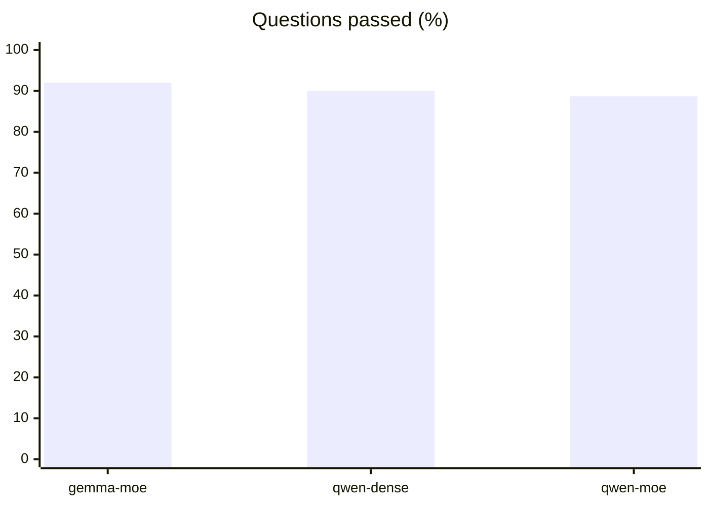
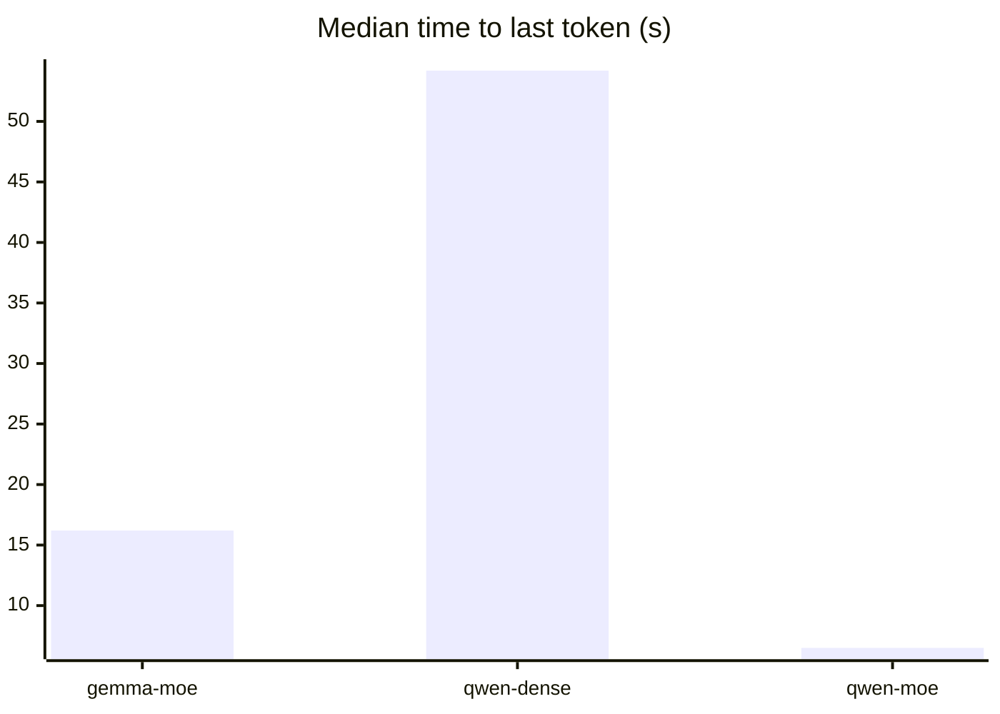
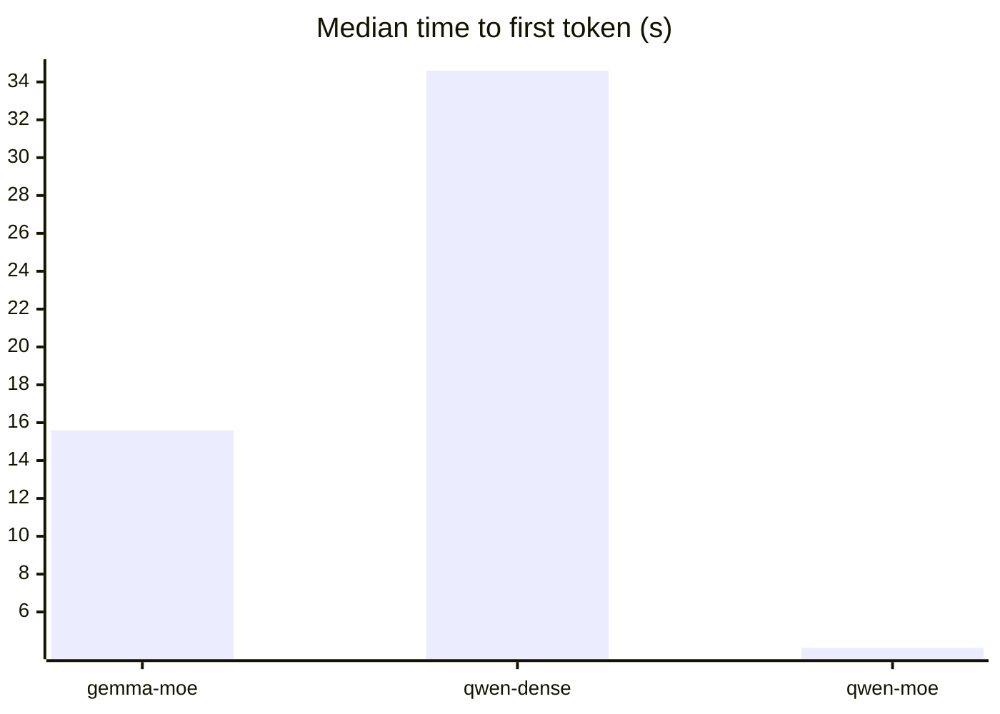

# Meru benchmark results

> [!IMPORTANT]
> These numbers come from the author's private dataset: questions about the author's own files,
> notes, mail and calendar, which aren't published. You can't rerun them, and your numbers on
> your own data will differ. [README.md](README.md) says how to build a dataset of your own.

Generated by `meru check report` on 27 September 2026.

## Pass rate

| Model set | Answer model | Runs | Results | Passed | Lowest run | Highest run |
| --- | --- | ---: | ---: | ---: | ---: | ---: |
| gemma-moe | `gemma4:26b-mxfp8` | 3 | 150 | 92% | 88% | 96% |
| qwen-dense | `qwen3.8:27b` | 3 | 150 | 90% | 88% | 92% |
| qwen-moe | `qwen3.6:35b-a3b-mxfp8` | 3 | 150 | 89% | 84% | 92% |

## Pass rate by category

| Category | gemma-moe | qwen-dense | qwen-moe |
| --- | ---: | ---: | ---: |
| t0-direct | 100% (24/24) | 100% (24/24) | 100% (24/24) |
| t1-retrieval | 100% (27/27) | 96% (26/27) | 100% (27/27) |
| t2-one-tool | 95% (37/39) | 95% (37/39) | 95% (37/39) |
| t3-multi-tool | 78% (28/36) | 67% (24/36) | 61% (22/36) |
| t4-multi-turn | 100% (12/12) | 100% (12/12) | 92% (11/12) |
| t5-honesty | 83% (10/12) | 100% (12/12) | 100% (12/12) |

## Speed

Times count from when `merud` got the question, so they include routing, search and tool rounds.
TTFT is the time to the answer's first token and TTLT the time to its last. TPOT is the model's
writing time per output token.

| Model set | TTFT p50 | TTFT p95 | TTLT p50 | TTLT p95 | TPOT p50 | Tokens in, p50 | Tokens out, p50 |
| --- | ---: | ---: | ---: | ---: | ---: | ---: | ---: |
| gemma-moe | 15.6 s | 33.5 s | 16.2 s | 34.3 s | 17.5 ms | 21293 | 90 |
| qwen-dense | 34.6 s | 100.3 s | 54.2 s | 129.4 s | 58.6 ms | 21202 | 128 |
| qwen-moe | 4.1 s | 13.1 s | 6.5 s | 29.2 s | 15.6 ms | 21887 | 123 |
