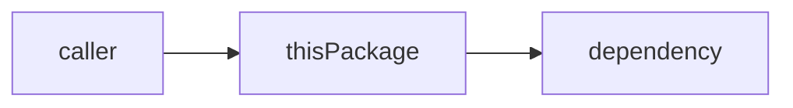

# Coding notes

Plain-English explainers of Meru's code, for a reader who has never written Go.
Each note explains one package: what it does, how the pieces fit, and every Go
feature it uses, with links to short concept notes.

There's no code yet, so there are no notes yet. The first v0.1 PR adds the first ones.

## How to read these

1. Start with [ARCHITECTURE.md](../../ARCHITECTURE.md) for the big picture.
2. Read the package notes in the order the index lists them. Each one builds on the
   ones before it.
3. When a note uses a Go idea you don't know, follow its link into `go-basics/`.
4. Keep the code open next to the note. Every note names the files it covers.

## Index

### Packages

*None yet.* Expected order, following the roadmap: `config`, `rpc`, `engine`, `obs`,
`agent`, then `cmd/merud` and `cmd/meru`.

### Go basics

*None yet.* We write each concept note the first time the code needs it.

## Rules for writing a note

- **Assume no Go.** Define every term the first time you use it, even simple ones
  like "package", "struct" or "method".
- **Show, then explain.** Quote a few lines of real code, then say what they do in
  plain words. Keep each snippet under about 15 lines.
- **Draw it.** Each package note has at least one mermaid diagram showing how its
  parts connect, or the order things happen in.
- **Say why.** Say what problem the code solves, and name the simpler option you
  didn't take and why.
- **Stay current.** A PR that changes the code updates the note in the same PR.
- Follow the `writing` skill: short words, active voice, no filler.

## Template for a package note

Copy this into `docs/coding-notes/<package>.md`.

````markdown
# <package>

**Code:** `internal/<package>/` (`file1.go`, `file2.go`)
**Milestone:** v0.x
**Architecture:** [section name](../../ARCHITECTURE.md#section)

## What it does

One short paragraph. What job does this package do for Meru, and who calls it?

## The picture



## Walk through the code

### file1.go

What lives here, then the key pieces one at a time:

```go
// a short, real snippet
```

What each line does, in plain words.

## Go ideas used here

- **<idea>** — one line on what it is. More in [go-basics/<idea>.md](go-basics/<idea>.md).

## Try it

Commands to run, and what you should see:

```sh
go test ./internal/<package>/...
```

## Why it's built this way

The simpler alternatives and why they weren't enough, or why this *is* the simple one.
````

## Template for a Go concept note

Copy this into `docs/coding-notes/go-basics/<idea>.md`.

````markdown
# <idea>

**In one line:** what it is.

## Why Go has it

The problem it solves, in two or three sentences.

## Smallest example

```go
// ten lines or fewer that run on their own
```

## Where Meru uses it

- `internal/<package>/<file>.go` — what for.

## Mistakes to avoid

- One or two common traps.
````
