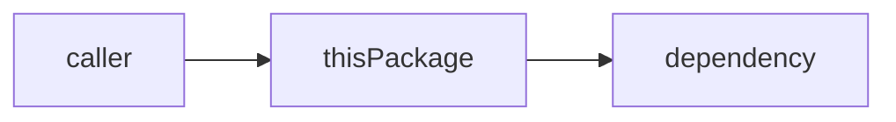

# Coding notes

Plain-English explainers of Meru's code, for a reader who has never written Go.
Each note explains one package: what it does, how the pieces fit, and every Go
feature it uses, with links to short concept notes.

## How to read these

1. Start with [ARCHITECTURE.md](../../ARCHITECTURE.md) for the big picture, then
   [docs/lld.md](../lld.md) for how the packages fit together.
2. Read the package notes in the order the index lists them. Each one builds on the
   ones before it.
3. When a note uses a Go idea you don't know, follow its link into `go-basics/`.
4. Keep the code open next to the note. Every note names the files it covers.

## Index

### Packages

Read them in this order; each builds on the ones before it.

1. [config](config.md): reading and checking `config.toml`
2. [engine](engine.md): the four-method `Engine` interface and the Ollama client
3. [router](router.md): picking a route from one token's probabilities
4. [transcript](transcript.md): session files, one JSON object per line
5. [rpc](rpc.md): the socket protocol between `meru` and `merud`
6. [store](store.md): `meru.db`, the SQLite file of documents, chunks and vectors
7. [retrieve](retrieve.md): hybrid search, merged by reciprocal-rank fusion, and citations
8. [index](index.md): reading your folders into the store: skip rules, chunking, watching
9. [agent](agent.md): one turn, from question to streamed answer
10. [obs](obs.md): OpenTelemetry metrics and traces, loopback only
11. [merud and meru](merud.md): the two programs and how they start
12. [tui](tui.md): `meru chat`, the Bubble Tea terminal UI
13. [mcp](mcp.md): the MCP client pool, groundwork for tools in v0.3
14. [dispatch](dispatch.md): the one path every tool call takes, with approvals and the audit log
15. [a2a](a2a.md): the A2A client, which turns other agents' skills into tools
16. [secrets](secrets.md): `secrets.toml`, where API keys live, and redacting them
17. [catalog](catalog.md): the starter MCP servers, the safe way to add one to `config.toml` or change one list in it, and the SearXNG check
18. [builtin](builtin.md): merud's built-in tools, from `configure` and `remember` to the file and web tools
19. [commands](commands.md): local programs you declare in `[[commands]]`, run with no shell
20. [skills](skills.md): `SKILL.md` folders and the built-in skills, groundwork for v0.4
21. [memory](memory.md): one Markdown file per memory, and the profile in every prompt
22. [summarize](summarize.md): session summaries, written when a session goes quiet, for recall by episode
23. [opener](opener.md): opening a clicked link with the system's opener, `http`, `https` and `file` only
24. [desktop](desktop.md): the desktop app, its Bridge to `merud`, and the page in its window
25. [about](about.md): the tagline, the version and the links both clients show
26. [installer](installer.md): the Mac installer's ten steps, its allowlist of programs, and its window
27. [connectors](connectors.md): the connector manifests, their pinned versions and checks, the installs of Node, uv and each connector into ~/.meru/runtime, the supervisor that runs each stdio connector, and the one that runs the SearXNG container
28. [testing](testing.md): how Meru tests itself, from unit tests to fakes
29. [end-to-end tests](e2e.md): the real binaries, run against a fake Ollama
30. [render](render.md): `web_fetch`'s page reader, a headless Chrome per page that needs JavaScript, behind a proxy

### Go basics

- [Packages and imports](go-basics/packages-and-imports.md)
- [Struct tags](go-basics/struct-tags.md)
- [Errors](go-basics/errors.md)
- [defer](go-basics/defer.md)
- [Interfaces](go-basics/interfaces.md)
- [HTTP clients](go-basics/http-clients.md)
- [Iterators](go-basics/iterators.md)
- [context](go-basics/context.md)
- [Goroutines](go-basics/goroutines.md)
- [Channels](go-basics/channels.md)
- [Type switches](go-basics/type-switches.md)
- [sync/atomic](go-basics/atomic.md)
- [Testing](go-basics/testing.md)
- [Build tags](go-basics/build-tags.md)
- [database/sql](go-basics/sql.md)
- [Transactions](go-basics/transactions.md)
- [filepath](go-basics/filepath.md)
- [select](go-basics/select.md)
- [os/exec](go-basics/os-exec.md)
- [Pipes and extra files](go-basics/pipes-and-extra-files.md)
- [encoding/json](go-basics/json.md)
- [embed](go-basics/embed.md)
- [os.Root](go-basics/os-root.md)

## Rules for writing a note

- **Assume no Go.** Define every term the first time you use it, even simple ones
  like "package", "struct" or "method".
- **Show, then explain.** Quote a few lines of real code, then say what they do in
  plain words. Keep each snippet under about 15 lines.
- **Draw it.** Each package note has at least one mermaid diagram showing how its
  parts connect, or the order things happen in.
- **Say why.** Say what problem the code solves, and name the simpler option you
  didn't take and why.
- **Stay current.** A PR that changes the code updates the note in the same PR.
- Follow the `writing` skill: short words, active voice, no filler.

## Template for a package note

Copy this into `docs/coding-notes/<package>.md`.

````markdown
# <package>

**Code:** `internal/<package>/` (`file1.go`, `file2.go`)
**Milestone:** v0.x
**Architecture:** [section name](../../ARCHITECTURE.md#section)

## What it does

One short paragraph. What job does this package do for Meru, and who calls it?

## The picture



## Walk through the code

### file1.go

What lives here, then the key pieces one at a time:

```go
// a short, real snippet
```

What each line does, in plain words.

## Go ideas used here

- **<idea>** — one line on what it is. More in [go-basics/<idea>.md](go-basics/<idea>.md).

## Try it

Commands to run, and what you should see:

```sh
go test ./internal/<package>/...
```

## Why it's built this way

The simpler alternatives and why they weren't enough, or why this *is* the simple one.
````

## Template for a Go concept note

Copy this into `docs/coding-notes/go-basics/<idea>.md`.

````markdown
# <idea>

**In one line:** what it is.

## Why Go has it

The problem it solves, in two or three sentences.

## Smallest example

```go
// ten lines or fewer that run on their own
```

## Where Meru uses it

- `internal/<package>/<file>.go` — what for.

## Mistakes to avoid

- One or two common traps.
````
