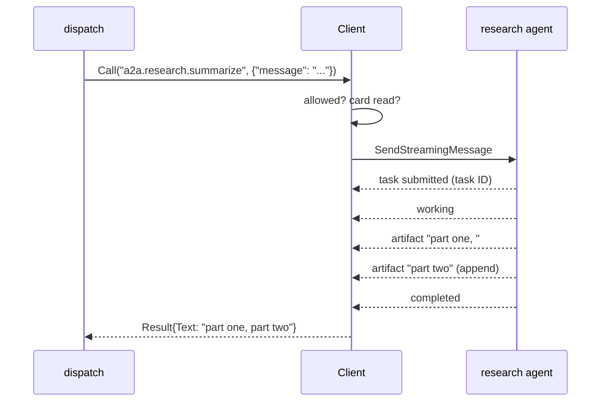

# a2a

**Code:** `internal/a2a/` (`doc.go`, `config.go`, `client.go`, `call.go`, and the
tests `config_test.go`, `client_test.go`, `call_test.go`, `testserver_test.go`)
**Milestone:** v0.3
**Architecture:** [Other agents (A2A)](../../ARCHITECTURE.md#other-agents-a2a),
[Privacy boundary](../../ARCHITECTURE.md#privacy-boundary)

## What it does

A2A, the Agent2Agent protocol, lets one agent hand a task to another over HTTP.
An A2A agent publishes an *agent card*: a small JSON file that gives its name,
the URLs it answers on, whether it can stream updates, and a list of *skills*,
each with an ID and a description.

This package is Meru's A2A client. A `Client` reads the card of each agent in
`[[a2a.agents]]`, and turns each skill that the entry's `allow` list names into a
tool called `a2a.<agent>.<skill>`. Every such tool takes one argument, a
`message`. A call sends that message to the agent, waits for the task to finish,
and hands the answer back as text.

`Client` implements `dispatch.Backend`, the interface that the MCP pool and the
built-in tools also implement. `dispatch` is the only caller: it checks the
allowlist, asks the user when a skill needs a yes, and writes the `tool_calls` row
and the transcript lines.

The protocol code comes from the A2A project's Go SDK,
`github.com/a2aproject/a2a-go/v2`. It speaks version 1.0 of the protocol, over
JSON-RPC or REST.

## The picture

```mermaid
flowchart LR
    cfg["[[a2a.agents]] in config.toml"] --> v["ValidateAll"]
    v --> new["New (no I/O)"]
    d["dispatch"] --> tools["Tools / Status"]
    d --> call["Call(name, {message})"]
    tools -- "no card yet,<br/>wait passed" --> fetch["fetch card"]
    call -- "no card yet,<br/>wait passed" --> fetch
    fetch --> card["agent card<br/>skills, URLs, streaming?"]
    card --> kept["allowed skills →<br/>a2a.agent.skill tools"]
    call -- "not in allow" --> denied["ErrNotAllowed<br/>(no agent contact)"]
    call -- "allowed" --> agent["agent<br/>(loopback unless network = true)"]
```

One call to an agent that streams:



## Walk through the code

### config.go

`AgentConfig` is one `[[a2a.agents]]` entry. merud fills it from `config.toml`: it
parses `timeout` into a `time.Duration` and swaps `secret:<name>` header values for
the secrets they name.

```go
type AgentConfig struct {
    Name    string
    URL     string
    Network bool
    Headers map[string]string
    Allow   []string
    Confirm []string
    Timeout time.Duration
}
```

`Validate` follows the MCP rules, so both kinds of entry fail the same way. It
collects every problem and joins them with `errors.Join`. It refuses:

- a URL that isn't loopback, unless `network = true`. The rule lives in
  `loopback.CheckURL`, which MCP, the engine and the telemetry exporter share;
- a name with anything but letters, digits, `-` and `_`, because the name sits
  between two dots in the tool name;
- `*` or any other wildcard in `allow` or `confirm`;
- a skill ID with characters a model can't put in a tool name. The A2A spec lets
  an ID hold any text, so an agent may offer a skill Meru can't use;
- a `confirm` entry missing from `allow`;
- a header name that isn't a legal HTTP name, or a header value with a line
  break, which could smuggle a second header into the request.

`ValidateAll` also refuses two agents with one name. `DefaultCallTimeout` is 60
seconds, as for MCP.

### client.go

**New does no I/O.** It validates the config and builds one `agent` record per
entry. The first time `Tools`, `Status` or `Call` needs an agent, the Client
fetches its card:

```go
func (c *Client) fetchIfDueLocked(a *agent) {
    if a.client != nil || a.closed || time.Since(a.lastTry) < c.retryAfter {
        return
    }
    ctx, cancel := context.WithTimeout(context.Background(), cardTimeout)
    defer cancel()
    _ = c.fetchLocked(ctx, a)
}
```

If the fetch fails, the agent waits 10 seconds (`defaultRetryAfter`) before the
next try. Inside that wait, `Tools` gives no tools for the agent and `Call` fails
at once with `ErrUnavailable`. `Tools` and `Status` take no context, so a
5-second cap (`cardTimeout`) bounds each fetch they start.

`fetchCard` reads the card with the SDK's `agentcard.Resolver`, then asks the SDK
for a client on one of the URLs the card lists. It offers the SDK two ways to
talk, JSON-RPC and REST, both over Meru's own HTTP client. It offers no gRPC, so
the SDK's gRPC code never enters merud.

`allowedTools` keeps the skills in `allow`, names each `a2a.<agent>.<skill>`,
and sorts them so the prompt stays the same from turn to turn. The description is
the skill's own, plus the agent's name. Allow entries the card doesn't list go
into `Status` as `Unknown`, most often from a typo.

**The HTTP client.** `newHTTPClient` builds one client per agent, with three
guards:

1. **A dialer that refuses other machines.** A `net.Dialer` opens TCP
   connections, and its `Control` function runs with the real IP address just
   before each connect. `refuseNonLoopback` returns an error for any address
   outside `127.0.0.0/8` and `::1`. The config check covers only the card's URL,
   and the card names the URLs the calls go to. The dialer covers those too, after
   DNS, so a card on loopback can't send Meru's messages to another machine.
   `network = true` turns this guard off.
2. **No redirects.** Headers may carry an API key, and a redirect could carry it
   to another host. A2A servers have no reason to redirect.
3. **Headers on every request.** An `http.Client` sends each request through its
   `Transport`, a value with one method, `RoundTrip`. `headerTransport` wraps the
   real transport: it copies each request, sets the configured headers on the
   copy, and passes it on. The card fetch goes through the same client, so it
   gets the headers too.

```go
func (t headerTransport) RoundTrip(req *http.Request) (*http.Response, error) {
    if len(t.headers) > 0 {
        req = req.Clone(req.Context())
        for k, v := range t.headers {
            req.Header.Set(k, v)
        }
    }
    return t.base.RoundTrip(req)
}
```

A `RoundTripper` must not change the request it gets, which is why it sets the
headers on a clone.

`Confirm` returns `dispatch.ConfirmAsk` for a skill in `confirm`, and
`dispatch.ConfirmNever` for the rest. `Locate("a2a.research.summarize")` returns
`("research", "summarize")`. `Close` drops each agent's SDK client and idle
connections; calls after it fail with `ErrUnavailable`.

### call.go

`Call` works through five steps:

1. **Allowlist.** A skill outside `allow`, or an agent not in config, gets
   `ErrNotAllowed` before any agent hears about it.
2. **Arguments.** They must be a JSON object with a non-empty `message` string.
3. **Card.** `clientFor` returns the agent's SDK client, fetching the card if
   the retry wait has passed.
4. **Send.** `send` calls `SendStreamingMessage` under the agent's timeout.
   The SDK returns an iterator, and a `for ... range` loop reads one update at a
   time. When the card says the agent can't stream, the SDK sends a plain request
   instead and yields the one reply, so `Call` has a single code path for both.
5. **Answer.** `answer.add` folds each update in: the task's ID and state, its
   status message, and each artifact's text. An update marked `Append` adds to
   the artifact with the same ID; any other replaces it. The loop stops when the
   task reaches a final state or stops to ask for input.

A2A has no field that picks a skill. The agent reads the message and decides what
to do; the skill in the tool name only picks the description the model sees and
the allow entry the call needs.

`answer.result` turns the updates into a `dispatch.Result`:

| The agent ends with | Result |
| --- | --- |
| a completed task | the artifacts' text, or the status message if it has no artifacts |
| a message and no task | the message's text |
| a failed, rejected or canceled task | `IsError`, with the state and the agent's reason |
| a task that needs input or credentials | `IsError`; Meru can't answer an agent's question yet |

Text parts pass through as they are. Structured data becomes JSON, and a file
shows as a placeholder such as `[file image/png, 3 bytes]`.

**Timeouts and cancels.** When the timeout passes or the user cancels the turn,
`Call` returns an error that wraps `context.DeadlineExceeded` or
`context.Canceled`, so `dispatch` can tell them apart with `errors.Is`. If the
agent had started a task, `cancelTask` asks it to stop. It uses
`context.WithoutCancel(ctx)` with a fresh 2-second limit: the call's own context
has ended, but the cancel request should still carry the turn's trace.

**Reconnects.** When a call can't reach the agent at all (the HTTP client returns
a `*url.Error` and the context hasn't ended), `markFailed` drops the SDK client.
The next use fetches the card again, which picks up an agent that restarted on a
new port. An agent that answered with an error keeps its client.

**Spans.** Each call records a client span. The OpenTelemetry GenAI conventions
name a call to a remote agent `invoke_agent {gen_ai.agent.name}`, so the span is
`invoke_agent research`, with `gen_ai.operation.name = invoke_agent`,
`gen_ai.agent.name`, `server.address` and `server.port`. Meru adds
`meru.a2a.skill`, `meru.a2a.task.id`, `meru.a2a.task.state`, and the
`meru.tool.server` and `meru.tool.allowed` that MCP spans carry. `error.type` uses
the MCP values: `tool_error`, `denied`, `unavailable` and `timeout`. The message
and the answer go on the span only when `capture_content = true`.

## Go ideas used here

- **Iterators** — `SendStreamingMessage` returns one, and `range` pulls updates
  from it. More in [go-basics/iterators.md](go-basics/iterators.md).
- **Type switches and type assertions** — `answer.add` handles each kind of
  update, and `newHTTPClient` pulls the `*http.Transport` out of
  `http.DefaultTransport`. More in [go-basics/type-switches.md](go-basics/type-switches.md).
- **HTTP clients** — one client per agent, with its own transport. More in
  [go-basics/http-clients.md](go-basics/http-clients.md).
- **context** — per-call timeouts, and `context.WithoutCancel` for the cancel
  request. More in [go-basics/context.md](go-basics/context.md).
- **errors.Join, `%w` and errors.Is** — `Validate` joins its problems, and
  `ErrNotAllowed` and `ErrUnavailable` travel up wrapped. More in
  [go-basics/errors.md](go-basics/errors.md).
- **Renamed imports** — the SDK's core package is also called `a2a`, so the code
  imports it as `sdk`. More in
  [go-basics/packages-and-imports.md](go-basics/packages-and-imports.md).

## Try it

```sh
go test -race ./internal/a2a/...
go test -race -run 'TestStreamingCall|TestCallTimeout' -v ./internal/a2a/
```

The tests run a real A2A server, built with the SDK's `a2asrv` package, on
127.0.0.1 through `httptest`. Each test scripts what the agent sends back:
a finished task, a stream of chunks, a failure, or a task that hangs until the
timeout. The server counts card fetches and calls and keeps the last request's
headers, so the tests can check the retry wait and the header injection.
`TestCardCannotPointOffMachine` serves a loopback card that names an agent at
`192.0.2.1`, an address reserved for documentation, and checks that the dialer
refuses it.

## Why it's built this way

- **The official SDK.** It implements the card format, both HTTP bindings,
  streaming over server-sent events, and task cancel, and the A2A project keeps
  it in step with the spec. It adds one module to merud's build,
  `golang.org/x/mod`, which it uses to compare protocol versions.
- **Lazy card fetch.** Fetching at `New` would make merud's start wait on every
  agent, and an agent that starts after merud would need a restart or a
  background loop. Fetching on first use needs one time check, and an agent
  that comes up later shows up on the next turn.
- **Always ask for a stream.** The SDK falls back to a plain request when the
  card says the agent can't stream, so one code path covers both.
- **A dialer guard as well as a URL check.** The URL check alone would trust
  whatever URL the card lists. Checking at connect time also covers DNS answers
  and any URL the SDK builds.
- **No follow-up turns.** An agent that asks for more input ends the call with
  an error result. Carrying a task across turns would need task IDs in the
  transcript and a way for the model to reply; nothing in v0.3 needs it yet.
