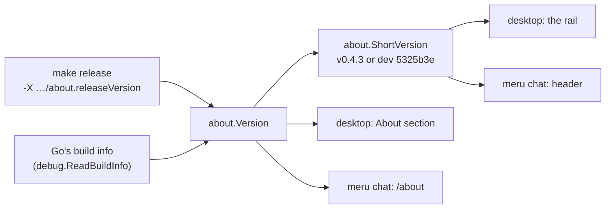

# about

**Code:** `internal/about/` (`doc.go`, `about.go`)
**Milestone:** after v0.4, when `meru chat` got the desktop app's About and the version in its header
**Architecture:** [Terminal UI](../../ARCHITECTURE.md#terminal-ui), [Desktop app](../../ARCHITECTURE.md#desktop-app)

## What it does

`about` holds what Meru says about itself: the one line that says what it is, its
version, its license and the project's pages on GitHub. The desktop app's About
section and rail show them, and so do `meru chat`'s header and `/about` box. The
chat may not import the desktop package, so the two clients read one small package
that imports only the standard library.

## The picture



## Walk through the code

### about.go

`Tagline`, `License` and the four URLs are constants. `Links` returns the pages as
`Link` values, a label and a URL each, in a new slice every call, so no caller can
change the list another sees. The `json:"..."` struct tags name the fields in the
JSON the desktop app's page gets; `internal/desktop` calls its own type `Link` with
`type Link = about.Link`, which gives the same type a second name.

`Version` returns the version `make release` stamped in, or else what the Go
toolchain wrote into the binary. The stamp works through the linker: `-X
github.com/aarora79/meru/internal/about.releaseVersion=v0.4.1` sets the package
variable `releaseVersion` while the binary links, and every other build leaves it
empty. [releasing.md](../releasing.md) shows the flag. Without a stamp,
`buildVersion` reads `debug.ReadBuildInfo`, which returns two values, the build
information and whether the binary carries any: a tag such as `v0.4.1` for `go
install …@v0.4.1`, or `(devel)` and the git commit for a local build, with
`modified` when the tree had changes.

`ShortVersion` cuts that to fit beside the name. A release tag stays as it is. A
build between tags gets a Go pseudo-version such as
`v0.4.4-0.20260927021103-5325b3ef94cb`, which names a release that doesn't exist
yet, so `short` turns it into `dev 5325b3e`; `pseudoVersion` is the regular
expression that finds the commit in it, with Go's `+dirty` on the end or not. A
version that says nothing useful, such as `unknown`, gives "".

## Go ideas used here

- **Linker flags**: `-X` sets a string variable in a package at link time, so a
  release names its version with no edit to the code.
- **Multiple return values**: `debug.ReadBuildInfo` returns the information and a
  bool, and `buildVersion` takes both.
- **Type aliases**: `type Link = about.Link` in `internal/desktop` is the same
  type under a second name, not a new one.

## Try it

```sh
go test ./internal/about
```

`TestBuildVersion` feeds `buildVersion` release, local and bare build information.
`TestVersion` sets `releaseVersion` as the linker would and puts it back.
`TestShort` checks each shape of version, and `TestLinks` that every link goes to
the project and that one caller can't change another's list.

## Why it's built this way

**Why a package of its own?** The desktop app kept these in `internal/desktop`, and
the chat can't import that package. Two copies of the version rules would drift, so
the second client moved them out.

**Why not ask `merud` for its version?** `merud` reports none over the socket, and
the clients build from the same tree, so a client's own build stands in, as it did
in the app. The About box and section work while `merud` is down.
