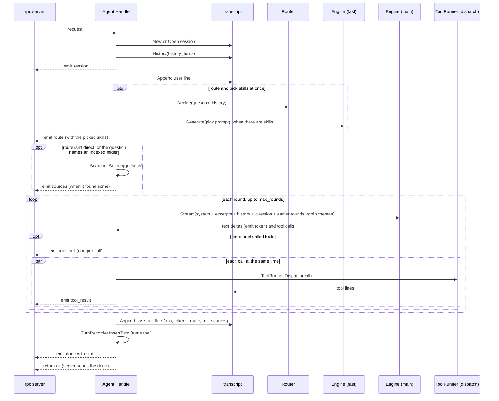

# agent

**Code:** `internal/agent/` (`doc.go`, `agent.go`, `tools.go`, `profile.go`, `skills.go`, `agent_test.go`, `tools_test.go`, `search_test.go`, `observe_test.go`, `usage_test.go`, `profile_test.go`, `skills_test.go`, `skills_integration_test.go`, `e2e_test.go`)
**Milestone:** v0.1; search in v0.2; tool rounds and usage in v0.3; the profile and skills in v0.4
**Architecture:** [Agent loop](../../ARCHITECTURE.md#agent-loop), [A question, end to end](../../ARCHITECTURE.md#a-question-end-to-end), [Who decides what](../../ARCHITECTURE.md#who-decides-what), [Retrieval](../../ARCHITECTURE.md#retrieval), [Skills](../../ARCHITECTURE.md#skills)

## What it does

`agent` runs one turn: the work between "a question arrived" and "the answer
is saved". `merud` hands `Agent.Handle` to the socket server, and the server
calls it once per question.

The router picks a route, and the route decides whether the turn looks in
your files first and whether the model may call tools:

| Route | Searches your files? | Offers tools? |
| --- | --- | --- |
| `direct` | no, unless the question names an indexed folder | no |
| `search` | yes | no |
| `tools` | yes (the router sends some file questions here, see below) | yes |
| `search+tools` | yes | yes |

A turn with no tools makes one model call. A turn with tools runs in
**rounds**: each round is one model call, and a round in which the model calls
tools runs them and starts another. The turn ends when the model answers
without calling a tool, or at the round cap.

## The picture



## Walk through the code

### The Router interface

```go
type Router interface {
    Decide(ctx context.Context, question string, history []engine.Message) (Decision, error)
}
```

An **interface** lists methods; any type with those methods satisfies it. The
agent declares only the one method it calls, so it doesn't import the router
package, and tests pass in a fake that returns a fixed route. `merud` wraps the
real router in a small adapter.

### The Searcher interface

```go
type Searcher interface {
    Search(ctx context.Context, query string) ([]retrieve.Result, error)
}
```

The same trick as `Router`: the agent names the one method it needs. `merud`
passes `searchAdapter`, which calls `retrieve.Search` over the store; tests pass
`fakeSearcher`, which returns fixed results. A `nil` Searcher turns search off,
which is what most of the older tests pass.

### The ToolRunner interface

```go
type ToolRunner interface {
    Tools() []engine.ToolSpec
    Dispatch(ctx context.Context, c dispatch.Call) (dispatch.Result, dispatch.Outcome)
}
```

`Tools` lists the tools config allows, with the schemas the model reads.
`Dispatch` runs one call. Every tool call in Meru goes through dispatch, which
checks the allowlist, asks you when the tool needs a yes, writes the
transcript lines and the `tool_calls` row, and records the span and metrics.
The agent only builds the `dispatch.Call` and reads what comes back.
`Dispatch` returns no error: a call that couldn't run still comes back with
an outcome (`denied`, `declined`, `error`, `timeout` or `cancelled`) and a
`Result` whose text tells the model what happened.

`merud` passes `*dispatch.Dispatcher`, which has these two methods. Tests
pass `fakeTools`, which answers from a table by tool name. A `nil`
ToolRunner turns tools off.

### The TurnRecorder interface

```go
type TurnRecorder interface {
    InsertTurn(ctx context.Context, t store.Turn) error
}
```

After each answered turn the agent hands a `store.Turn` row to its
TurnRecorder, and `meru usage` adds the rows up. `merud` passes the
`*store.Store` itself, which has this method, so no adapter sits between them.
Tests pass `fakeTurns`, which keeps the rows in a slice. A `nil` TurnRecorder
keeps no rows, which is what most tests pass.

The agent writes the row, rather than `merud` reading it back from the
transcript, because the agent already holds every fact the row needs: the
session, the source, the final route and the tool-call count. `merud` would
have to reopen the session file after each turn to find them.

### The Profile interface

```go
type Profile interface {
    Profile() ([]memory.Memory, error)
}
```

The profile is what Meru knows about you: the memory files in `me/` and
`preferences/` (`rpc.ProfileKinds()`). `merud` passes `profileAdapter`, which
reads those two folders with `memory.Store.ListKind`. Tests pass
`fakeProfile`. A `nil` Profile leaves the section out.

`Profile` may return memories and an error together, when one file can't be
read and the rest can. The agent logs the error as a warning and uses what it
got. A folder it can't read at all gives no memories, and the turn goes on
without the section.

### New and filesNote

`New` builds the system prompt once and adds `filesNote(cfg.Index.Folders)` to
the end of it, so every turn tells the model which folders Meru searches:

```text
Meru indexes and searches the user's files in these folders: ~/notes, ~/repos/meru. When a question needs them, Meru searches first and puts the best excerpts below. You can't open or list files yourself.
```

With no folders, the note says instead that Meru hasn't indexed any files yet
and that the user lists folders under `[index] folders` in
`~/.meru/config.toml`. Without the note a small model answered "I don't have
access to your files" while it read excerpts from them, and couldn't say what
Meru had indexed.

Before the files note comes `whoIsWho`: the person asking is the user, the files
are theirs, and "I", "me" and "my" in a question mean the user, never the model.
It joins every system prompt, a custom one from config too. Without it, the 2B
model read "did I visit Amsterdam?" as a question about Meru, and answered that
Meru had no record of a visit while the excerpts named the user as the
traveller.

`New` also keeps `folderNames(cfg.Index.Folders)`: the last part of each folder
path, in lower case, such as `meru` for `~/repos/meru`. It drops names under
three letters, which match too many ordinary words, and keeps each name once.

### The profile section (profile.go)

`New` keeps the configured prompt with `whoIsWho` in `a.system`, and the files
note in `a.filesNote`. On each turn, `prompt` puts the profile between them:

```text
<system prompt>

<whoIsWho>

What you know about the user:
- Name is Amit Arora
- Works on the AI registry team at Example Corp
- Likes short answers

<filesNote>
```

The profile follows `whoIsWho`, so the rule that "I" means the user and the
facts about who the user is sit side by side. Without them, the 2B model read a
visa letter and guessed that you were the co-applicant it named.

`formatProfile` builds the section, and it is a plain function so the tests can
call it with any memories:

- **Order.** `me` first, then `preferences`, oldest first inside each, so your
  name, usually the first fact saved, leads. `Created` holds only a date, so the
  file's modification time breaks a tie between two facts from one day, and the
  ID breaks any tie left.
- **One line each.** `strings.Fields` splits a fact at every run of spaces and
  line breaks, and joining the pieces with one space gives one line.
- **The cap.** The section holds at most 2,000 characters, header included. When
  the facts hold more, `formatProfile` walks them newest first and keeps each one
  that still fits, so a newer fact, which more often corrects an older one, wins.
  It returns how many it left out, and `profileSection` logs that at debug.
- **Empty means nothing.** With no facts, the section is `""` and the prompt has
  no header. `meru chat` is the one that tells you Meru doesn't know you yet.

`profileSection` reads the files on every turn, so a hand edit shows in the next
answer. Reading 20 files takes about 0.6 ms, too little to earn a cache. It
records the section's size as `meru.context.tokens` with section `memories`.

### The remember rule

A third rule gives tools to a turn that asks Meru to remember something. The
router can send "remember that my name is Amit" to `direct`, which offers no
tools, and the model then says it will remember and saves nothing. So when the
question holds `remember` as a whole word, the route has no tools, and the
tools on offer include `remember`, `withTools` adds them, as for a tool server.
`asksToRemember` makes the check with `namesFolder`, so "remembered" doesn't
count. A wrong guess, such as "do you remember the budget?", costs a prompt
that holds the tool schemas; the model need not call any.

### Skills (skills.go)

A skill is a Markdown file of instructions for one kind of task (see
[skills](skills.md)). The agent lists every skill in the prompt and loads the
full instructions of only the ones a question needs. That split is called
**progressive disclosure**: a new skill costs the prompt one line until a
question calls for it.

```go
type Skills interface {
    Registry(ctx context.Context) *skills.Registry
}
```

`merud` passes its skill service, which loads the registry again when you edit
`~/.meru/skills` (see [merud](merud.md)). Tests pass `fixedSkills`. The agent
gets it through `UseSkills`, called once before the first turn, rather than as
a parameter of `New`, so the many tests that build an agent without skills
stay as they were. With no `Skills`, turns list and load none.

**The pick runs beside the router.** `routeAndPick` replaces the plain
`route` call in `Handle`. It starts two goroutines with an `errgroup`: one asks
the router for the route, the other asks the fast model which skills the
question needs. Neither needs the other's answer. Only the route can fail the
turn; a failed pick logs a warning and the turn goes on with no skills.

Side by side is also faster than it looks. On the development machine with
MiniCPM5-2B, `TestIntegrationRouteAndPick` measured 70 ms a turn for the route
then the pick, and 28 ms for both at once. One after the other, the two prompts
take turns in one Ollama slot and each throws away the other's cached prompt;
side by side, each keeps a slot and its cache.

**The pick call.** `pickSkills` skips the call when the registry is empty.
Otherwise it sends the fast model a short prompt with thinking off
(`engine.Options.NoThink`), temperature 0 and at most 20 tokens:

```text
You choose which skills help answer the user's message. A skill is a set of instructions for one kind of task.

Skills:
- explainer: Build a self-contained HTML explainer for a technical topic ...
- writing: Write prose people will actually read. ...

Reply with the names of the skills this message needs, at most 2, separated by commas. Reply "none" when no skill fits, as for a plain question, a lookup or small talk. Reply with names only, no other words.
```

The question follows as the user's message. `parsePick` splits the answer at
anything that can't be part of a skill name, keeps the words that name a loaded
skill, drops repeats and stops at two. "none", "None." or a made-up name all
give no skills, so the model can't load something that isn't there. On the
built-in skills, `TestIntegrationPickSkills` saw it pick `writing` for "write a
short email to my landlord" and for a paragraph to tidy, nothing for a lookup,
the weather or "hi there", and `explainer` with `writing` for an explainer page,
each in about 35 to 65 ms.

**The prompt sections.** `skillsSection` builds the text that `prompt` puts
after the tools note and before the excerpts from your files:

```text
Skills you can use:
- explainer: Build a self-contained HTML explainer ...
- writing: Write prose people will actually read. ...

Follow these instructions for this answer:

Skill: writing

# Writing Skill
...
```

The list goes into every turn that has skills; the second part only when the
pick chose some. `formatBodies` caps the instructions at 3,000 tokens (12,000
characters). The first skill goes in whole even past the cap, because half a
skill's steps can mislead the model more than none. A second skill gets what is
left, cut at a line break and closed with a note that Meru cut the rest.
`skillsSection` records the whole section's size as `meru.context.tokens` with
section `skills`.

**Who sees the pick.** The `route` event carries the names in `Skills`, each an
`rpc.SkillInfo` with only `Name` set, and `meru chat` shows them in the route
badge, as in `direct · 0.91 · writing`. The turn span gets `meru.skills`, the
names joined with commas; they come from the registry, so the attribute stays
a small set. The pick has its own `meru.skills.pick` span with a `gen_ai.chat`
span under it, and a `skills picked` debug line.

### Handle

`Handle` has the signature of `rpc.Handler`, so `merud` passes `a.Handle`
straight to `rpc.Serve`. Its steps follow the diagram, and each is a short
method that opens its own span under `meru.turn` and writes one debug line:
`openSession` (`meru.session`), `appendLine` (`meru.transcript.append`),
`routeAndPick` (the router's `meru.route` and `meru.skills.pick`, side by
side), `searchFiles` (`meru.search`, with
retrieval's `meru.retrieve` under it), `prompt` (`meru.prompt`) and `answer`
(`gen_ai.chat`, once per round). Two details:

**The turn span and metrics are recorded in one deferred function.**

```go
func (a *Agent) Handle(ctx context.Context, req rpc.Request, emit func(rpc.Event) error, approve rpc.ApproveFunc) (err error) {
    ...
    defer func() {
        outcome := outcomeOf(ctx, err)
        ...
        span.End()
        obs.RecordTurn(context.WithoutCancel(ctx), obs.Turn{...})
    }()
```

`err` is a **named result**: the deferred function reads the error `Handle`
returns, from any of its `return` statements, and records
`ok`, `error` or `cancelled`, with the number of rounds as
`meru.turn.iterations`. `context.WithoutCancel` keeps the trace but drops
the cancel, so a cancelled turn still gets its metric. The same function
writes the turn's one info line, `logTurn`.

`approve` is the rpc server's way to ask you about a tool call. The agent
never calls it; it hands it to dispatch in each `dispatch.Call`.

**History is read before the question is written**, so the new question doesn't
show up twice in the prompt.

### searchFiles

On every route but `direct`, `Handle` calls `searchFiles` between routing and
the prompt. `searches(route)` is `route != "direct"`. `tools` searches too:
the router sends some questions about your files to `tools`, and an answer
from the files beats one from the model alone.

One rule runs first. When the router says `direct` and the question names an
indexed folder, the route becomes `search`:

```go
if dec.Route == "direct" && a.search != nil && namesFolder(question, a.folderNames) {
    dec.Route = "search"
}
```

`namesFolder` splits the question into words with `words` and looks for one of
the folder names. It matches whole words and ignores case, so "Meru" and
"meru's" match `meru` and "merudaemon" doesn't. Even with the folders in its
prompt, the router sent "what database does Meru use to store its index?" to
`direct` at 0.621, and the model made up an answer. A wrong guess costs one
search of about 50 ms, and the model uses only the excerpts that help. "hey
meru, what's the capital of France" searches too, because the assistant shares
its name with the folder. The `route` event, the turn's log line and its span
show `search`, with a debug line that says why; the router's own `meru.route`
span and metric keep what the router chose.

A second rule does the same for tools. When a question names a connected tool
server, such as "search my obsidian vault", and the route offers no tools,
`withTools` adds them: `direct` becomes `tools` and `search` becomes
`search+tools`. `toolServers` reads the server names from the tool names:
`obsidian` from `obsidian.search_vault`, `research` from
`a2a.research.summarize`. It leaves out the built-in tools, whose owner,
`meru`, is also the assistant's name. It reads them on each turn, because the
configure tool can add a server while `merud` runs. In testing, the router
sent "Search my Obsidian vault for notes mentioning 'AI'" to `search`, and
the model, offered no tools, said it couldn't search the vault.

Then the search:

```go
if searches(dec.Route) && a.search != nil {
    var sources []rpc.Citation
    files, sources, docs, err = a.searchFiles(ctx, searchQuery(question, history))
    ...
    if len(sources) > 0 {
        emit(rpc.Event{Type: rpc.EventSources, Sources: sources})
    }
}
msgs := a.prompt(ctx, history, question, files)
```

- **What it searches for.** No model rewrites the query, so `searchQuery`
  uses the question. A question with at least three words that aren't filler
  (`subjectWords`, `standaloneWords`) is searched alone: it names its own
  subject. "i think i did some work on the bakery site, remind me" has four
  (work, bakery, site, remind). In testing, a question like it about a work
  project, searched together with the question before it about a trip, came
  back with travel papers and no project notes. A shorter question is a follow-up, and `searchQuery` adds one earlier
  question after it, because "and the one after that?" finds nothing alone.
  "how much did it cost?" has two subject words, so it still borrows; the
  filler list also holds words that point back, such as one, other, after and
  those. It walks back from the
  newest and takes the first one that `namesSubject`: a question with at least
  one word that `isFiller` doesn't list. The filler list holds short common
  words and the words people use to retry, such as try, again, search, check,
  last, question, docs, files and notes. So "search again i think it is
  specified", after "try the last question again now", after "what database
  does meru use", searches for `search again i think it is specified` and `what
  database does meru use`. The question goes first: keyword search keeps only a
  query's first 32 words.
- **What the model sees.** `retrieve.Format` numbers the excerpts `[1]`,
  `[2]` and so on, each under a citation line with its file, heading and
  lines. `searchFiles` puts `citeRule` in front of them, which tells the model
  to cite with `[n]`, to cite only the numbers listed, and never to invent a
  source. The whole section joins the end of the system prompt, because some
  chat templates accept a system message only in first place.
- **When it finds nothing.** An empty index, a search with no match, and a
  search that fails all give the model the `noResults` note ("found nothing
  relevant … don't cite any files") and no `sources` event, and the turn
  answers anyway. A failed search is logged as a warning; only a cancelled
  turn stops here.
- **Paths.** `shortPath` writes a file under your home folder as
  `~/notes/garden.md`, for the model and for the client. Other paths stay
  whole. Before it shortens them, `searchFiles` keeps each file's full path
  once, in the order the results rank them, and returns that list as `docs`
  for the transcript. A shortened path would read differently on a machine
  with another home folder.
- **The sources event** lists every excerpt the model got, numbered as the
  prompt numbers them, with its heading, lines or page, and score. It goes out
  before the first token, so a client can show it however it likes; `meru`
  and `meru chat` show the ones the answer cites (see `rpc.Cited`).
- **The metric.** `meru.context.tokens` with `section = "chunks"` records the
  section's size, estimated as characters divided by four.

### answer

`answer` streams one round of the main model's reply:

```go
stream, err := a.engine.Stream(ctx, msgs, tools, engine.Options{Model: model})
...
for delta, err := range stream {
    if err != nil {
        return fail(err)
    }
    if delta.Text != "" {
        if ttft == 0 {
            firstToken = time.Now()
            ttft = firstToken.Sub(start)
        }
        text.WriteString(delta.Text)
        if err := emit(rpc.Event{Type: rpc.EventToken, Text: delta.Text}); err != nil { ... }
    }
    calls = append(calls, delta.ToolCalls...)
    if delta.Done {
        usage = delta.Usage
    }
}
```

- `tools` holds the schemas to offer, or `nil` for none. Ollama sends each
  tool call whole, in a chunk of its own, so `answer` collects them with one
  `append` and never joins pieces.
- `ttft` (time to first token) feeds the v0.1 target "first token in under a
  second".
- The last delta carries Ollama's token counts, which go into the transcript
  line and the metrics. Meru never estimates them.
- If `emit` fails, the client has gone, and the turn stops.
- The first piece of text adds a `first_token` event to the span, with
  `meru.ttft_ms`. At the end, `obs.ChatResult` puts the token counts and
  Ollama's timings on the span.

`answer` returns a small `reply` struct: the text, the usage counters, and
`firstToken`, the moment the first text arrived.

The assistant line holds the answer and the turn's facts, so the `turns`
table can rebuild from the transcript:

```go
answer := transcript.Line{
    Type: transcript.TypeAssistant, Text: rep.text,
    TokensIn: rep.usage.PromptTokens, TokensOut: rep.usage.OutputTokens,
    Route: route, Ms: time.Since(start).Milliseconds(), Sources: docs, ...
}
```

`Route` is the route after both override rules, the one the `route` event
showed. `Ms` counts from `start`, when `merud` received the question. `Sources`
is the `docs` list from `searchFiles`, empty on a turn that didn't search. The
user line carries `start` as its time too, so a row rebuilt from the file gets
the same time as the row written live.

Then `recordUsage` writes the `turns` row through the TurnRecorder and records
`meru.turn.tokens` and `meru.turn.docs`. A failed insert logs a warning and the
turn goes on: the transcript already holds the turn, and a rebuilt `meru.db`
brings the row back. When `Handle` starts a new session it also adds one to
`meru.sessions`.

Once the assistant line is in the transcript, `Handle` sends a last event
built by `doneEvent`:

```go
return emit(doneEvent(start, rep))
```

`doneEvent` measures time to first token and total time from `start`, when
`merud` received the question, so both include routing. That is the wait the
person at the terminal sees. It adds the token counts and Ollama's
`eval_duration` (the model's own writing time), which `meru chat` shows under
the answer. The rpc server holds this `done` back and sends it last, or drops
it if `Handle` fails.

The `route` event also says whether the router fell back: `Fallback` is true
for any outcome but `ok`, and `meru chat` draws such a route in amber.

### The tool rounds (tools.go)

**Which turns offer tools.** `toolSpecs(route)` returns the ToolRunner's
schemas on `tools` and `search+tools`, and `nil` on the other routes or when
the ToolRunner is `nil`. A model can't call a tool it hasn't seen, and the
prompt stays shorter. On a turn that offers tools, `prompt` adds `toolsNote`
to the system prompt: the model may call the tools, and some calls ask you
first. `Handle` also records the schemas' size, characters divided by four,
as `meru.context.tokens` with `section = "tools"`.

**The loop.** `converse` runs the rounds:

```go
for {
    t.rounds++
    offer := specs
    if t.rounds >= a.maxRounds {
        offer = nil // the last round: answer with what you have
    }
    rep, err := a.answer(ctx, msgs, offer, t.emit)
    ...
    if len(rep.calls) == 0 || len(offer) == 0 {
        total.text = rep.text
        return total, nil
    }
    msgs = append(msgs, engine.Message{Role: engine.RoleAssistant, Content: rep.text, ToolCalls: rep.calls})
    results, err := a.runTools(ctx, t, rep.calls)
    ...
    msgs = append(msgs, results...)
}
```

- **The cap.** `[agent] max_rounds` (default 8) caps model calls per turn.
  The last round offers no tools, so the model has to answer. A model that
  calls a tool it wasn't offered gets no call run; that round is its answer.
- **What the model reads next round.** Its own message with the calls, then
  one `RoleTool` message per call, in call order, with `ToolName` set to the
  tool's full name and `Content` set to `Result.Text`. A denied or declined
  call reaches the model the same way, so it can answer without the tool or
  ask you what to do.
- **The stats.** `reply.add` sums each round's token counts and durations,
  and keeps the turn's first text token for time to first token. The
  transcript's assistant line holds the final round's text and the summed
  counts. `reply.add` has a pointer receiver (`r *reply`), so it changes the
  caller's `reply` in place.
- **`turn`** is a small struct that carries what the rounds need: the
  session, source, trace ID, `emit`, `approve`, and two counters, `rounds`
  and `calls`. `Handle` reads `t.rounds` in its deferred function, so a
  failed turn still reports how many rounds it ran.

**Running the calls.** `runTools` does one round's calls:

1. It gives each call an ID, `call-1`, `call-2` and so on across the turn,
   or the engine's own ID when Ollama sent one, and emits a `tool_call`
   event with the name, the kind and the arguments. `toolKind` reads the
   kind from the name: `a2a.` in front means an A2A agent, any other dot
   means an MCP server, and no dot means a built-in tool.
2. It starts every call at once in an `errgroup`, each with a
   `dispatch.Call` holding the ID, name, arguments (`{}` when the model sent
   none), session ID, source, trace ID, `approve`, and `Append`. `Append`
   writes to this session's transcript through `appendLine`, so dispatch's
   tool lines get the same span and debug line as the agent's own.
3. Each goroutine writes its result into its own slot of a slice, so the
   results come out in call order with no lock, and emits its `tool_result`
   event (outcome and milliseconds) as soon as it ends. A quick call reports
   before a slow one.

```go
g, gctx := errgroup.WithContext(ctx)
for i, c := range calls {
    g.Go(func() error {
        res, outcome := a.tools.Dispatch(gctx, dispatch.Call{...})
        out[i] = engine.Message{Role: engine.RoleTool, ToolName: c.Name, Content: res.Text}
        return t.emit(rpc.Event{Type: rpc.EventToolResult, ...})
    })
}
if err := g.Wait(); err != nil {
    return nil, err
}
```

`g.Wait` waits for every goroutine, so none outlives the turn. When one
returns an error (only `emit` can fail, when the client has gone), `gctx`
ends and the other calls stop.

**Events from several goroutines.** While calls run, `emit` runs from
several goroutines at once, and dispatch may call `approve` from them too.
The rpc server's `emit` takes a lock around each write, so that is safe; the
tests' collector takes a lock too.

### Cancellation

When the client hangs up, the rpc server cancels `ctx`. The engine's stream
ends, `answer` returns `ctx.Err()`, and `Handle` returns without writing an
assistant line or a `turns` row. The user line stays in the file, and `History` leaves an
unanswered question out of later prompts.

A hang-up during a tool call works the same way. `gctx` ends, dispatch
records each open call as `cancelled`, and `runTools` returns `ctx.Err()`
once every call has returned. The model isn't called again.

### The transcript

The agent writes two lines per turn: the question and the final answer.
Dispatch writes the tool lines (`tool_call`, `approval`, `tool_result`)
between them. `transcript.History` reads only user and assistant lines, so
earlier tool results stay out of later prompts: the answer already holds
what mattered from them.

### What it logs

At info level, one `turn` line per turn in `merud.log`: session ID, route,
source, outcome, total milliseconds, `ttft_ms`, token counts, the trace ID, and
the error when there is one. At debug level each stage adds a line: `turn
started`, `session created` or `session opened`, `history loaded`,
`transcript appended` (once per line, dispatch's tool lines included),
`route` (from the router), `skills picked` (with the names and the time),
`search done` (on search routes, with the result count, the section's size
and the time), `prompt built`, and per round `answer finished` (with its
`tool_calls` count) and `round finished` (round number, tool calls and
milliseconds).

Every line goes through `a.log.DebugContext(ctx, ...)` or `InfoContext`, so the
log handler from `obs` adds the turn's `trace_id`. The lines carry lengths
(`question_chars`, `answer_chars`) and never the text. With
`capture_content = true`, `turn started` and `answer finished` add the first
200 characters, and the `meru.turn` span gets the whole question and answer.

## Go ideas used here

- **Interfaces** — `Router`, `Searcher`, `ToolRunner`, `TurnRecorder`, and
  `engine.Engine`.
- **`errgroup`** — runs a round's tool calls at the same time and waits for
  them all, and runs the route and the skill pick side by side. More in
  [go-basics/goroutines.md](go-basics/goroutines.md).
- **Embedding a struct** — the test's `pickEngine` holds a `*fakeEngine`
  without a field name, so it gets `fakeEngine`'s methods and replaces only
  `Generate`.
- **Pointer receivers** — `reply.add` changes the reply it is called on.
- **Named results with `defer`** — record the outcome once, whatever path
  returns. More in [go-basics/defer.md](go-basics/defer.md).
- **`context`** — one context runs through the whole turn and stops it. More in
  [go-basics/context.md](go-basics/context.md).
- **Wrapped errors** — `fmt.Errorf("main model %s: %w", model, err)`. More in
  [go-basics/errors.md](go-basics/errors.md).
- **`strings.Builder`** — collects the answer without copying it on every piece.
- **Range over a function** — `for delta, err := range stream`.
- **A function as an argument** — `words` hands `strings.FieldsFunc` a small
  function that says where to split: at any rune that isn't a letter, a digit
  or a hyphen, so "personal-knowledge-base" stays one word.
- **`switch` with a list of cases** — `isFiller` lists its words in one `case`,
  and the switch returns true when `w` matches any of them.

## Try it

```sh
go test -race ./internal/agent/...
```

`search_test.go` checks the search step: the search routes and `tools` add
the excerpts and send `sources` before the tokens, `direct` doesn't search
unless the question names an indexed folder, an empty or failed search still
answers, and `TestSearchQuery` checks which earlier question joins the query.
`TestFilesNote` checks the folders reach the system prompt, and
`TestFolderNames` checks the names the folder rule matches.

`tools_test.go` checks the tool rounds with `fakeTools` and a `fakeEngine`
that scripts one reply per round: which routes offer tools, the event order
(`session`, `route`, `sources`, `tool_call`, `tool_result`, tokens, `done`),
two calls that must run at the same time (one waits on a channel the other
closes) with results in call order, the round cap, denied and declined calls
reaching the model, `approve` and a job's source reaching dispatch, a hang-up
during a call, one `gen_ai.chat` span per round, and a transcript and
history that hold only the question and the answer.

`TestEndToEnd` starts the real socket server with this agent over a fake
engine, asks a question with the real client and checks the streamed answer and
the transcript file. `TestEndToEndToolRound` does the same with the real
`OllamaEngine` against the fake Ollama, which answers the first chat request
with a tool call and the second with text. It checks the events and what the
second request sent Ollama: the call, its result and the tool schema.

`profile_test.go` checks `formatProfile` (order, one line per fact, the cap
keeping the newest, empty), where the section sits in the system prompt, that
an empty or unreadable profile leaves the header out without failing the
turn, and which questions the remember rule gives tools.

`skills_test.go` checks the skills step with `pickEngine`, a fake whose
`Generate` plays the fast model. `TestPickWritingForEmail` asks "write a short
email to my landlord" over the real built-in skills and checks the pick call's
options, that the `route` event names `writing`, and that the list, the header
and the writing body land in the system prompt in that order. Other tests
cover a pick of "none", no skills or an empty folder (no pick call at all), a
failed pick that still answers, a failed route, `parsePick` and the cap in
`formatBodies`.

`skills_integration_test.go` runs the pick against the real local Ollama:

```sh
go test -tags integration -v -run Integration ./internal/agent/
```

`usage_test.go` checks what a turn keeps for `meru usage`: the assistant
line's route (after the override rules), duration and full source paths, each
file once; the row the TurnRecorder gets, with its time equal to the user
line's; a failed insert that leaves the answer alone; and no row for a turn
that failed.

`observe_test.go` runs turns through the socket server, the agent and the real
router over a fake engine. It records spans with `tracetest.SpanRecorder` and
checks the tree (`rpc.request` → `meru.turn` → one span per stage), the key
attributes and the `first_token` event. It logs into a buffer and checks each
debug line, the trace ID on every line, and that neither the spans nor the log
hold the question or answer until `capture_content` is on.

## Why it's built this way

- **No agent framework.** The loop is short, and the rules Meru enforces
  (audit, budgets, approvals) must live in code we can read.
- **The agent returns errors; the server sends them.** The agent never writes
  to the socket itself, so the same code can later serve scheduled jobs.
- **Route recorded from day one.** Route metrics collected since v0.1 give
  search (v0.2) and tools (v0.3) real numbers to test against.
- **A failed search doesn't fail the turn.** The excerpts help the answer, but
  the model can still answer without them, and the note in the prompt stops it
  from pretending it looked.
- **Sources before the answer.** The client learns what the model read while
  the answer streams, and picks which to show once it has the whole text.
- **The agent never runs a tool itself.** It hands every call to the
  ToolRunner, so dispatch stays the one path that checks allowlists, asks
  you, and logs each call.
- **Calls in a round run at the same time.** The model asked for them
  together, so none needs another's result, and a slow MCP server doesn't
  hold up a quick built-in.
- **A separate pick call, not a longer router.** The router reads one token's
  probabilities and can't name skills. A second short call keeps the router's
  prompt and its calibration as they are, and running both at once costs no
  extra time.
