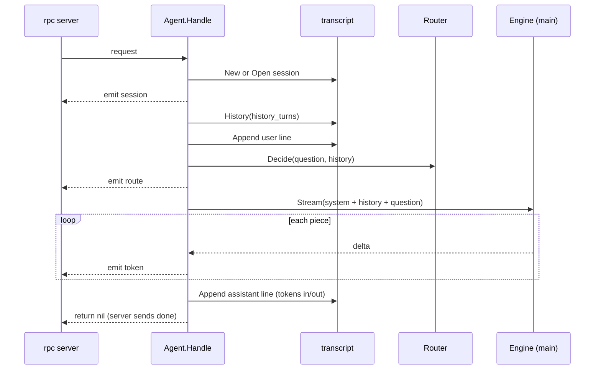

# agent

**Code:** `internal/agent/` (`doc.go`, `agent.go`)
**Milestone:** v0.1
**Architecture:** [Agent loop](../../ARCHITECTURE.md#agent-loop), [A question, end to end](../../ARCHITECTURE.md#a-question-end-to-end)

## What it does

`agent` runs one turn: the work between "a question arrived" and "the answer
is saved". `merud` hands `Agent.Handle` to the socket server, and the server
calls it once per question.

In v0.1 a turn makes one model call. The router still picks a route and the
agent reports it, but every route answers directly for now: search arrives in
v0.2 and tools in v0.3.

## The picture



## Walk through the code

### The Router interface

```go
type Router interface {
    Decide(ctx context.Context, question string, history []engine.Message) (Decision, error)
}
```

An **interface** lists methods; any type with those methods satisfies it. The
agent declares only the one method it calls, so it doesn't import the router
package, and tests pass in a fake that returns a fixed route. `merud` wraps the
real router in a small adapter.

### Handle

`Handle` has the signature of `rpc.Handler`, so `merud` passes `a.Handle`
straight to `rpc.Serve`. Its steps follow the diagram. Two details:

**The turn span and metrics are recorded in one deferred function.**

```go
func (a *Agent) Handle(ctx context.Context, req rpc.Request, emit func(rpc.Event) error) (err error) {
    ...
    defer func() {
        outcome := outcomeOf(ctx, err)
        ...
        span.End()
        obs.RecordTurn(context.WithoutCancel(ctx), obs.Turn{...})
    }()
```

`err` is a **named result**: the deferred function reads the error `Handle`
returns, from any of its `return` statements, and records
`ok`, `error` or `cancelled`. `context.WithoutCancel` keeps the trace but drops
the cancel, so a cancelled turn still gets its metric.

**History is read before the question is written**, so the new question doesn't
show up twice in the prompt.

### answer

`answer` streams the main model's reply:

```go
stream, err := a.engine.Stream(ctx, msgs, nil, engine.Options{Model: model})
...
for delta, err := range stream {
    if err != nil {
        return fail(err)
    }
    if delta.Text != "" {
        if ttft == 0 {
            ttft = time.Since(start)
        }
        text.WriteString(delta.Text)
        if err := emit(rpc.Event{Type: rpc.EventToken, Text: delta.Text}); err != nil { ... }
    }
    if delta.Done {
        usage = delta.Usage
    }
}
```

- `nil` for tools: v0.1 sends the model no tool schemas.
- `ttft` (time to first token) feeds the v0.1 target "first token in under a
  second".
- The last delta carries Ollama's token counts, which go into the transcript
  line and the metrics. Meru never estimates them.
- If `emit` fails, the client has gone, and the turn stops.

### Cancellation

When the client hangs up, the rpc server cancels `ctx`. The engine's stream
ends, `answer` returns `ctx.Err()`, and `Handle` returns without writing an
assistant line. The user line stays in the file, and `History` leaves an
unanswered question out of later prompts.

### What it logs

One `turn` line per turn in `merud.log`: session ID, route, source, outcome,
milliseconds and the error, if any. Never the question or the answer. Spans
carry the text only when `capture_content = true`.

## Go ideas used here

- **Interfaces** — `Router`, and `engine.Engine`.
- **Named results with `defer`** — record the outcome once, whatever path
  returns. More in [go-basics/defer.md](go-basics/defer.md).
- **`context`** — one context runs through the whole turn and stops it. More in
  [go-basics/context.md](go-basics/context.md).
- **Wrapped errors** — `fmt.Errorf("main model %s: %w", model, err)`. More in
  [go-basics/errors.md](go-basics/errors.md).
- **`strings.Builder`** — collects the answer without copying it on every piece.
- **Range over a function** — `for delta, err := range stream`.

## Try it

```sh
go test -race ./internal/agent/...
```

`TestEndToEnd` starts the real socket server with this agent over a fake
engine, asks a question with the real client and checks the streamed answer and
the transcript file.

## Why it's built this way

- **No agent framework.** The loop is short, and the rules Meru enforces
  (audit, budgets, approvals) must live in code we can read.
- **The agent returns errors; the server sends them.** The agent never writes
  to the socket itself, so the same code can later serve scheduled jobs.
- **Route recorded, not yet acted on.** Collecting route metrics from day one
  gives v0.2 and v0.3 real numbers to test against.
