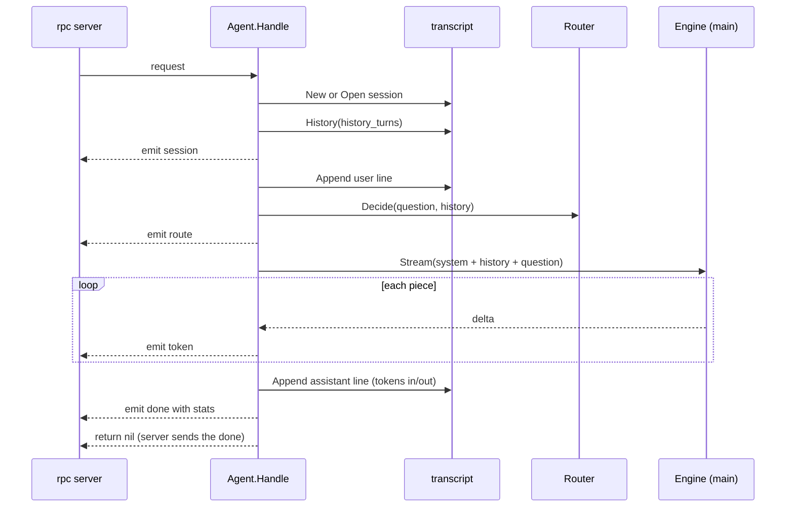

# agent

**Code:** `internal/agent/` (`doc.go`, `agent.go`, `agent_test.go`, `observe_test.go`)
**Milestone:** v0.1
**Architecture:** [Agent loop](../../ARCHITECTURE.md#agent-loop), [A question, end to end](../../ARCHITECTURE.md#a-question-end-to-end)

## What it does

`agent` runs one turn: the work between "a question arrived" and "the answer
is saved". `merud` hands `Agent.Handle` to the socket server, and the server
calls it once per question.

In v0.1 a turn makes one model call. The router still picks a route and the
agent reports it, but every route answers directly for now: search arrives in
v0.2 and tools in v0.3.

## The picture



## Walk through the code

### The Router interface

```go
type Router interface {
    Decide(ctx context.Context, question string, history []engine.Message) (Decision, error)
}
```

An **interface** lists methods; any type with those methods satisfies it. The
agent declares only the one method it calls, so it doesn't import the router
package, and tests pass in a fake that returns a fixed route. `merud` wraps the
real router in a small adapter.

### Handle

`Handle` has the signature of `rpc.Handler`, so `merud` passes `a.Handle`
straight to `rpc.Serve`. Its steps follow the diagram, and each is a short
method that opens its own span under `meru.turn` and writes one debug line:
`openSession` (`meru.session`), `appendLine` (`meru.transcript.append`),
`route` (the router's `meru.route`), `prompt` (`meru.prompt`) and `answer`
(`gen_ai.chat`). Two details:

**The turn span and metrics are recorded in one deferred function.**

```go
func (a *Agent) Handle(ctx context.Context, req rpc.Request, emit func(rpc.Event) error) (err error) {
    ...
    defer func() {
        outcome := outcomeOf(ctx, err)
        ...
        span.End()
        obs.RecordTurn(context.WithoutCancel(ctx), obs.Turn{...})
    }()
```

`err` is a **named result**: the deferred function reads the error `Handle`
returns, from any of its `return` statements, and records
`ok`, `error` or `cancelled`. `context.WithoutCancel` keeps the trace but drops
the cancel, so a cancelled turn still gets its metric. The same function
writes the turn's one info line, `logTurn`.

**History is read before the question is written**, so the new question doesn't
show up twice in the prompt.

### answer

`answer` streams the main model's reply:

```go
stream, err := a.engine.Stream(ctx, msgs, nil, engine.Options{Model: model})
...
for delta, err := range stream {
    if err != nil {
        return fail(err)
    }
    if delta.Text != "" {
        if ttft == 0 {
            firstToken = time.Now()
            ttft = firstToken.Sub(start)
        }
        text.WriteString(delta.Text)
        if err := emit(rpc.Event{Type: rpc.EventToken, Text: delta.Text}); err != nil { ... }
    }
    if delta.Done {
        usage = delta.Usage
    }
}
```

- `nil` for tools: v0.1 sends the model no tool schemas.
- `ttft` (time to first token) feeds the v0.1 target "first token in under a
  second".
- The last delta carries Ollama's token counts, which go into the transcript
  line and the metrics. Meru never estimates them.
- If `emit` fails, the client has gone, and the turn stops.
- The first piece of text adds a `first_token` event to the span, with
  `meru.ttft_ms`. At the end, `obs.ChatResult` puts the token counts and
  Ollama's timings on the span.

`answer` returns a small `reply` struct: the text, the usage counters, and
`firstToken`, the moment the first text arrived. Once the assistant line is in
the transcript, `Handle` sends a last event built by `doneEvent`:

```go
return emit(doneEvent(start, rep))
```

`doneEvent` measures time to first token and total time from `start`, when
`merud` received the question, so both include routing. That is the wait the
person at the terminal sees. It adds the token counts and Ollama's
`eval_duration` (the model's own writing time), which `meru chat` shows under
the answer. The rpc server holds this `done` back and sends it last, or drops
it if `Handle` fails.

The `route` event also says whether the router fell back: `Fallback` is true
for any outcome but `ok`, and `meru chat` draws such a route in amber.

### Cancellation

When the client hangs up, the rpc server cancels `ctx`. The engine's stream
ends, `answer` returns `ctx.Err()`, and `Handle` returns without writing an
assistant line. The user line stays in the file, and `History` leaves an
unanswered question out of later prompts.

### What it logs

At info level, one `turn` line per turn in `merud.log`: session ID, route,
source, outcome, total milliseconds, `ttft_ms`, token counts, the trace ID, and
the error when there is one. At debug level each stage adds a line: `turn
started`, `session created` or `session opened`, `history loaded`,
`transcript appended` (twice), `prompt built` and `answer finished`.

Every line goes through `a.log.DebugContext(ctx, ...)` or `InfoContext`, so the
log handler from `obs` adds the turn's `trace_id`. The lines carry lengths
(`question_chars`, `answer_chars`) and never the text. With
`capture_content = true`, `turn started` and `answer finished` add the first
200 characters, and the `meru.turn` span gets the whole question and answer.

## Go ideas used here

- **Interfaces** — `Router`, and `engine.Engine`.
- **Named results with `defer`** — record the outcome once, whatever path
  returns. More in [go-basics/defer.md](go-basics/defer.md).
- **`context`** — one context runs through the whole turn and stops it. More in
  [go-basics/context.md](go-basics/context.md).
- **Wrapped errors** — `fmt.Errorf("main model %s: %w", model, err)`. More in
  [go-basics/errors.md](go-basics/errors.md).
- **`strings.Builder`** — collects the answer without copying it on every piece.
- **Range over a function** — `for delta, err := range stream`.

## Try it

```sh
go test -race ./internal/agent/...
```

`TestEndToEnd` starts the real socket server with this agent over a fake
engine, asks a question with the real client and checks the streamed answer and
the transcript file.

`observe_test.go` runs turns through the socket server, the agent and the real
router over a fake engine. It records spans with `tracetest.SpanRecorder` and
checks the tree (`rpc.request` → `meru.turn` → one span per stage), the key
attributes and the `first_token` event. It logs into a buffer and checks each
debug line, the trace ID on every line, and that neither the spans nor the log
hold the question or answer until `capture_content` is on.

## Why it's built this way

- **No agent framework.** The loop is short, and the rules Meru enforces
  (audit, budgets, approvals) must live in code we can read.
- **The agent returns errors; the server sends them.** The agent never writes
  to the socket itself, so the same code can later serve scheduled jobs.
- **Route recorded, not yet acted on.** Collecting route metrics from day one
  gives v0.2 and v0.3 real numbers to test against.
