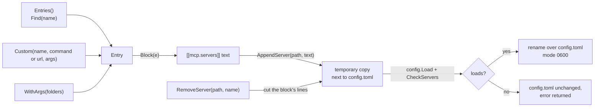

# catalog

**Code:** `internal/catalog/` (`doc.go`, `catalog.go`, `args.go`, `block.go`,
`append.go`, `remove.go`, and the tests `catalog_test.go`, `args_test.go` and
`remove_test.go`)
**Milestone:** v0.3
**Architecture:** [Adding an MCP server](../../ARCHITECTURE.md#adding-an-mcp-server),
[MCP](../../ARCHITECTURE.md#mcp)

## What it does

The catalog is the short list of MCP servers Meru knows how to set up, built into
the binary. Each entry says how to start the server, what it needs from you, and
which of its tools the model may use at first. Three things use it: `meru setup`,
`meru mcp` (add, list and remove), and the built-in `configure` tool that `merud`
offers the model.

| Name | Server | Needs | Allowed | Asks first |
| --- | --- | --- | --- | --- |
| `brave` | `npx -y @brave/brave-search-mcp-server` | Brave Search API key | `brave_web_search`, `brave_news_search` | none |
| `fetch` | `uvx mcp-server-fetch` | nothing | `fetch` | none |
| `filesystem` | `npx -y @modelcontextprotocol/server-filesystem <folders>` | folders | list, search and read files; write, edit, move, make a folder | write, edit, move, make a folder |
| `shell` | `uvx mcp-shell-server` | the programs to allow (`ALLOW_COMMANDS`) | `shell_execute` | `shell_execute` |
| `google` | `uvx workspace-mcp --tools gmail calendar drive docs` | Google OAuth client, sign-in | the `gmail`, `calendar` and `drive` lists | theirs too |
| `gmail` | `uvx workspace-mcp --tools gmail` | Google OAuth client, sign-in | search and read mail, list labels, draft, send | draft, send |
| `calendar` | `uvx workspace-mcp --tools calendar` | Google OAuth client, sign-in | list calendars and events, free/busy, manage an event | manage an event |
| `drive` | `uvx workspace-mcp --tools drive docs` | Google OAuth client, sign-in | search and read files and Docs, create and edit a doc | create, edit |
| `obsidian` | `uvx mcp-obsidian` | Local REST API plugin key | list, read and search notes, append to a note | append |
| `windows` | `uvx windows-mcp serve`, Windows only | nothing | see the screen, list apps, click, type, PowerShell, files, processes | all but the six read-only ones |

The tool names are exact. Tools are deny-by-default, so an allow entry with a typo
gives the model nothing. The comment at the top of `catalog.go` names the source
file each list came from, the version checked, why `shell` uses
`mcp-shell-server`, and why the Google entries use `workspace-mcp` rather than
Google's own servers (those run only on Google's machines).

## The picture



## Walk through the code

### catalog.go

An `Entry` holds everything one server needs. `Needs` lists the questions to ask,
in order. A `Need` has a `Kind`: `api_key` (saved to `secrets.toml` under
`SecretName`), `path`, `url` or `text` (put in the env variable `Env`; a value
the entry already has is the default), `folders` (added to the end of `Args`), or
`note` (something you do yourself, such as signing in to Google). `Requires` sums
the needs up in a few words for `meru mcp list`, and `OS` names the one system an
entry runs on, when there is one (`windows`).

`Entries` builds the list fresh on every call:

```go
func Entries() []Entry {
    return []Entry{
        {Name: "brave", Command: "npx", ...},
        ...
    }
}
```

A package-level `var` would let one caller change the list for every other caller.
No caller can change what a function returns to the next caller, which follows
the "no package-level mutable state" rule in AGENTS.md.

One Google Workspace server covers Gmail, Calendar, Drive and Docs. The `google`
entry runs it once for all four. The `gmail`, `calendar` and `drive` entries each
run it with one service, so you can add only what you want, and each asks Google
for its own permissions and no more. Six small functions (`gmailAllow`,
`gmailConfirm` and so on) return the lists; `google` joins them with
`slices.Concat`. They are functions so that no two entries share a slice.

### args.go

`RunsOn(goos)` reports whether an entry works on a system; `meru mcp list` and
setup use it to show `windows` only on Windows.

`WithArgs(args)` fills in the words typed after an entry's name. For an entry
with a `folders` need, each word goes through `ExpandFolder`, which turns `~` into
the home folder (`merud` starts the server with no shell to do that), makes the
path absolute and checks that it is a folder. The folders go on the end of
`Args`, and the need goes away, since nothing is left to ask. An entry without
that need refuses any args. The built-in `configure` tool calls `WithArgs(nil)`
on the entry it adds, so `filesystem` from chat fails with the command to type
instead.

`SecretNames` lists the `secrets.toml` entries an entry uses, from both its env
and its Needs. `configure` checks them before it writes anything.

### block.go

`Block` writes an entry as the text you would type into `config.toml`:

```toml
# Web page fetch: Reads a web page and hands it to the model as Markdown.
# Docs: https://github.com/modelcontextprotocol/servers/tree/main/src/fetch
[[mcp.servers]]
name    = "fetch"
command = "uvx"
args    = ["mcp-server-fetch"]
allow   = ["fetch"]
confirm = []
```

It builds the text by hand instead of through the TOML encoder, to put a comment
on top and keep the keys in reading order. `quote` escapes strings the TOML way.
Go's `strconv.Quote` looks close, but writes escapes such as `\x00` that TOML
refuses.

`Custom` makes an entry for a server outside the catalog, with an empty `allow`
list. `meru mcp add` fills the list from the probe (see the merud note); an entry
written with an empty list says in a comment to run `meru tools` and name the
tools. A URL that isn't loopback gets `network = true`; `meru mcp add http`
refuses such a URL unless you pass `--network`.

### append.go

`AppendServer` adds one block to the end of `config.toml`, as plain text, so
every comment and setting already there stays as it was:

1. Parse the block alone and read its server name.
2. Load the current config; refuse when a server has that name already.
3. Write old text + blank line + block to a temporary file in the same folder.
4. `config.Load` the temporary file, then `CheckServers` its servers.
5. Rename it over `config.toml`. The file ends up with mode `0600`.

Steps 3 to 5 live in `writeChecked`, which `RemoveServer` shares. A block that
would break config never reaches the real file. `CheckServers`
repeats the rules from `internal/mcp` that a new entry is most likely to break:
the name's characters, exactly one of `command` and `url`, no duplicate names, no
wildcards, `confirm` inside `allow`. The thin client may not import
`internal/mcp`, so the check lives here too; `merud` still runs the full check
when it starts.

### remove.go

`RemoveServer(path, name)` takes one server out and returns the lines it cut.
The TOML library can't write a file back with its comments, so `cutServer`
works on lines:

1. Walk the table headers (`[index]`, `[[mcp.servers]]`). A header that starts
   with `mcp.servers.`, such as `[mcp.servers.env]`, belongs to the server above
   it. For each `[[mcp.servers]]`, parse its lines alone with the TOML library
   and read the name, so any way of writing the name matches.
2. The block runs to the next header. The comment lines touching that header
   belong to the next table and stay; so do the blank lines before them.
3. The comment lines right above the block go with it: `Block` writes two there.
4. Drop one blank line where two now meet, and blank lines at the end.

Line-based editing can misread a file, so `writeChecked` checks the result:
it must load, and hold the same servers in the same order, minus the one
removed. If not, nothing changes and the error says to edit the file by hand.

## Go ideas used here

- **Struct literals** — `Entry{Name: "brave", ...}` builds a value by naming its
  fields; fields you leave out get their zero value.
- **`strings.Builder`** — collects text piece by piece without copying it on each
  append; `fmt.Fprintf(&b, ...)` writes formatted text into it.
- **Iterators** — `slices.Sorted(maps.Keys(set))` collects a map's keys in order.
  More in [go-basics/iterators.md](go-basics/iterators.md).
- **`defer`** — removes the temporary file on every return path. More in
  [go-basics/defer.md](go-basics/defer.md).

## Try it

```sh
go test ./internal/catalog/
```

`TestBlocksLoad` appends every catalog block to one file and loads it.
`TestAppendServerKeepsFile` checks that the old text, comments included, comes
through byte for byte. `TestAppendServerRefuses` feeds duplicates, wildcards and
broken blocks, and checks that the file stays as it was. `TestRemoveServer`
removes the first, middle and last of three servers (one with a sub-table and a
multi-line array) and checks every other line stays; `TestAppendThenRemove`
gets back the file it started with. `TestWithArgsFolders` covers `~`, a missing
folder and a file given as a folder.

## Why it's built this way

- **Append, don't rewrite.** Rewriting `config.toml` through the TOML encoder
  would drop your comments. Appending text keeps the file yours, and loading the
  result before the rename catches any mistake.
- **Starter allow lists, not every tool.** Reading tools are safe to allow;
  anything that sends, writes or changes something asks first. You can widen the
  list later in `config.toml`.
- **Edit lines, then check.** Removing a block by lines keeps your comments,
  and loading the result before the rename catches a line read wrong.
- **Unpinned versions.** `npx` and `uvx` fetch the latest release, so security
  fixes arrive. A new tool in a later release gives the model nothing until you
  allow it.
