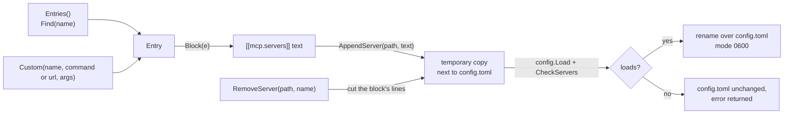

# catalog

**Code:** `internal/catalog/` (`doc.go`, `catalog.go`, `block.go`, `append.go`,
`remove.go`, `searxng.go`, and the tests `catalog_test.go`, `remove_test.go` and
`searxng_test.go`)
**Milestone:** v0.3
**Architecture:** [Adding an MCP server](../../ARCHITECTURE.md#adding-an-mcp-server),
[MCP](../../ARCHITECTURE.md#mcp), [Web search](../../ARCHITECTURE.md#web-search)

## What it does

The catalog is the short list of MCP servers Meru knows how to set up, built into
the binary. Each entry says how to reach the server, what it needs from you, and
which of its tools the model may use at first. Three things use it: `meru setup`,
`meru mcp` (add, list and remove), and the built-in `configure` tool that `merud`
offers the model. The package also holds `CheckSearXNG`, the check `meru setup`
and `merud` share for web search.

It holds two servers, one for each kind of example the docs use, in this order:

| Name | Server | Transport | Needs | Allowed | Asks first |
| --- | --- | --- | --- | --- | --- |
| `google` | `uvx workspace-mcp --transport streamable-http --tools gmail calendar drive docs --tool-tier extended`, which you start | Streamable HTTP at `http://127.0.0.1:8000/mcp` | Google OAuth client, sign-in, the server running | search and read mail and threads, save a mail's attachment, send mail, list and change events, search Drive, read a doc | send mail, change an event |
| `obsidian` | `uvx mcp-obsidian` | stdio | Local REST API plugin key | list, read and search notes, append to a note | append |

The tool names are exact. Tools are deny-by-default, so an allow entry with a typo
gives the model nothing. The comment at the top of `catalog.go` names the source
file each list came from, the version checked, and why the `google` entry uses
`workspace-mcp` rather than Google's own servers (those run only on Google's
machines).

The catalog has no shell server. An earlier version carried `mcp-shell-server`,
which runs the programs its `ALLOW_COMMANDS` list names. A list of program names
can't make a shell safe, since `find -exec` or `git -c core.pager=…` runs
anything, and the real policy sat in the server where `dispatch` couldn't log it.
`merud` now runs the programs you declare in `[[commands]]` itself; see
[commands](commands.md).

The catalog has no web search server either. Web search is the built-in
`web_search` tool, which asks a SearXNG you run on loopback; see
[builtin](builtin.md). It needs no key, no Node.js and no catalog entry.

## The picture



## Walk through the code

### catalog.go

An `Entry` holds everything one server needs. `Needs` lists the questions to ask,
in order. A `Need` has a `Kind`: `api_key` (saved to `secrets.toml` under
`SecretName`), `path` or `url` (put in the env variable `Env`; a value the
entry already has is the default), or `note` (something you do yourself, such as
starting a server or signing in to Google). `Requires` sums the needs up in a few
words for `meru mcp list`.

`Remote` lets `merud` connect to a URL off this machine. `Start` holds the command
that starts a server you run; `meru mcp add` prints it, and nothing in Meru runs
it. `Env` belongs to stdio entries only: `merud` sets it when it starts the child,
and a `url` entry has none, because `merud` starts no process for it.

`Entries` builds the list fresh on every call:

```go
func Entries() []Entry {
    return []Entry{
        {Name: "google", URL: "http://127.0.0.1:8000/mcp", ...},
        ...
    }
}
```

A package-level `var` would let one caller change the list for every other caller.
No caller can change what a function returns to the next caller, which follows
the "no package-level mutable state" rule in AGENTS.md.

`google` is the one `url` entry. The server's README calls stdio legacy, and its
OAuth 2.1 mode needs HTTP, so you run it and `merud` connects to it. The command
lives in one constant, so the entry's `Start`, its first note and its `Install`
text all print the same line:

```go
const googleStart = "USER_GOOGLE_EMAIL=<your Google address> " +
    "WORKSPACE_ATTACHMENT_DIR=~/meru-output/attachments " +
    "GOOGLE_OAUTH_CLIENT_ID=<your client ID> GOOGLE_OAUTH_CLIENT_SECRET=<your client secret> " +
    "uvx workspace-mcp --transport streamable-http --tools gmail calendar drive docs --tool-tier extended"
```

The OAuth client ID and secret go in the server's environment when you start it,
so the entry has no `api_key` need and nothing of Google's passes through
`secrets.toml`. The server offers 120-odd tools. `--tools` limits the process to
four services, and `--tool-tier extended` to their 45 core and extended tools.
Extended is the smallest tier that holds every tool in `Allow`:
`get_gmail_thread_content` and `get_gmail_attachment_content` sit there, not in
core. Without the flag the server loads every tool of the four services, or the
tier that `WORKSPACE_MCP_TOOL_TIER` names, so the flag also keeps your shell from
changing the tier. `TestGoogleToolTier` checks the flag. `Allow` names nine tools;
`send_gmail_message` and `manage_event` sit in `Confirm`.

`get_gmail_attachment_content` saves a mail's attachment to disk and returns the
saved filename, not the text. `WORKSPACE_ATTACHMENT_DIR` tells the server where
to save: `~/meru-output/attachments`, inside the default `[skills] output_dir`,
which `read_file` reads. The model then passes the filename to `read_file`. A
shell expands the `~` in `NAME=~/path` before the server starts, and the server
runs Python's `expanduser` on the value too, so the line also works from
`launchd` or `systemd`, where no shell runs. `"$HOME/..."` would fail there,
since neither expands it. The server deletes each saved file after an hour; the
entry's third note says so.

The tool sits last in `Allow`. The router names each server by the nouns in its
first allowed tools, five at most (`internal/agent/toolnouns.go`), and at the end
the new tool leaves "drive" in that list. `TestGoogleAttachments` checks that
`Allow` holds the tool, `Confirm` doesn't, and the start command sets the
variable before `uvx`.

The catalog once held six more entries: a web page reader, a server for files in
chosen folders, a Windows desktop server, and three that each ran the Google
server with one service. With them went `NeedFolders`, `WithArgs`, `ExpandFolder`,
`Entry.OS`, `RunsOn` and the file `args.go`. A catalog entry now takes no words
after its name. `always_confirm` stays in `Entry` and in config, with no catalog
entry that uses it today.

`SecretNames` lists the `secrets.toml` entries an entry uses, from both its env
and its Needs. `configure` checks them before it writes anything.

### block.go

`Block` writes an entry as the text you would type into `config.toml`:

```toml
# Obsidian: Lists, searches and reads the notes in your open Obsidian vault; appending to a note asks first.
# Docs: https://github.com/MarkusPfundstein/mcp-obsidian
[[mcp.servers]]
name    = "obsidian"
command = "uvx"
args    = ["mcp-obsidian"]
env     = { OBSIDIAN_API_KEY = "secret:obsidian_api_key", OBSIDIAN_HOST = "127.0.0.1", OBSIDIAN_PORT = "27124" }
allow   = ["obsidian_list_files_in_vault", "obsidian_list_files_in_dir", "obsidian_get_file_contents", "obsidian_simple_search", "obsidian_append_content"]
confirm = ["obsidian_append_content"]
```

For a `url` entry, `Block` writes `url` in place of `command` and `args`, and
`remote = true` when the entry has `Remote`.

It builds the text by hand instead of through the TOML encoder, to put a comment
on top and keep the keys in reading order. `quote` escapes strings the TOML way.
Go's `strconv.Quote` looks close, but writes escapes such as `\x00` that TOML
refuses.

`Custom` makes an entry for a server outside the catalog, with an empty `allow`
list. `meru mcp add` fills the list from the probe (see the merud note); an entry
written with an empty list says in a comment to run `meru tools` and name the
tools. A URL that isn't loopback gets `remote = true`; `meru mcp add http`
refuses such a URL unless you pass `--remote`.

### append.go

`AppendServer` adds one block to the end of `config.toml`, as plain text, so
every comment and setting already there stays as it was:

1. Parse the block alone and read its server name.
2. Load the current config; refuse when a server has that name already.
3. Write old text + blank line + block to a temporary file in the same folder.
4. `config.Load` the temporary file, then `CheckServers` its servers.
5. Rename it over `config.toml`. The file ends up with mode `0600`.

Steps 3 to 5 live in `writeChecked`, which `RemoveServer` shares. A block that
would break config never reaches the real file. `CheckServers`
repeats the rules from `internal/mcp` that a new entry is most likely to break:
the name's characters, exactly one of `command` and `url`, no duplicate names, no
wildcards, `confirm` inside `allow`. The thin client may not import
`internal/mcp`, so the check lives here too; `merud` still runs the full check
when it starts.

### remove.go

`RemoveServer(path, name)` takes one server out and returns the lines it cut.
The TOML library can't write a file back with its comments, so `cutServer`
works on lines:

1. Walk the table headers (`[index]`, `[[mcp.servers]]`). A header that starts
   with `mcp.servers.`, such as `[mcp.servers.env]`, belongs to the server above
   it. For each `[[mcp.servers]]`, parse its lines alone with the TOML library
   and read the name, so any way of writing the name matches.
2. The block runs to its last key before the next header. Comment and blank
   lines after that key stay: they belong to the next table, or, in a file
   written from the config template, they are the commented examples below a
   server.
3. The comment lines right above the block go with it: `Block` writes two there.
   A blank line or a bare `#` stops the walk up; the template parts a server's
   comments from the text above with a bare `#`, and `Block` never writes one.
4. Drop one blank line where two now meet, and blank lines at the end.

Line-based editing can misread a file, so `writeChecked` checks the result:
it must load, and hold the same servers in the same order, minus the one
removed. If not, nothing changes and the error says to edit the file by hand.

### edit.go

The desktop app's settings change one list at a time, and `merud` writes each
change with the two functions here.

`SetEntryLists(path, table, name, lists)` sets keys such as `allow` and `confirm`
in one `[[mcp.servers]]` or `[[a2a.agents]]` entry. `entrySpan` finds the entry
the way `cutServer` does, parsing each block alone to read its name.
`SetTableLists(path, table, lists, check)` does the same for a plain table, such
as `[index]` with `folders` or `[builtin]` with `tools` and `confirm`, and adds the
table at the end when the file has none. Two keys of one table change in one
write, so nobody reads one changed without the other.

`SetTableString(path, table, key, value, check)` sets one string the same way,
such as `main = "gemma3:12b"` in `[models]` when you press "Use for answers" in
the desktop app. Both table functions call `setTableValues`, which takes each
value already written as TOML: a list from `list`, or a string from `quote`.

`setValues` does the line work (`setKeys` writes each list as TOML and calls
it). For each key, in sorted order:

1. Find the table's own lines: from its header to the next header of any kind,
   so a key never lands in `[mcp.servers.env]`.
2. `keySpan` finds the key's line, skipping comment lines, and follows a list
   over as many lines as it runs: `bracketDepth` counts `[` and `]` outside
   strings and before a `#`, until the brackets close.
3. Replace those lines with one: whatever came before the `=`, so `allow   =`
   keeps its spacing, then the new value, then any comment the value's last line
   had (`trailingComment`).
4. A key the table lacks goes in after its last key line, before trailing
   comments and blank lines.

`writeChecked` then loads the result. `SetEntryLists` checks that the entry holds
exactly the lists asked for and that the servers and agents are the same ones, in
the same order, and runs `CheckServers`; `SetTableLists` runs the caller's
`check`. On any failure the file stays as it was.

`SetTableStrings` sets several string keys of one plain table in one write, such
as `main` and `fast` in `[models]` for `merud`'s `model_save`, so a reader never
sees one changed without the other. `SetTableString` calls it with one key.

### searxng.go

`CheckSearXNG(ctx, baseURL)` answers one question: does SearXNG answer JSON at
this URL? `meru setup` asks it in its Web search step, and `merud` asks it once at
startup to log `web search ready` or why not. It lives here because the thin
client may import `catalog` and not `builtin`, which pulls in the indexer.

It sends `GET <baseURL>/search?q=&format=json` with a 3-second limit, no proxy
and no redirects. The empty query matters: SearXNG refuses it at once, before it
asks any search engine, so the check sends nothing off the machine. How it
refuses tells the two setups apart:

| SearXNG | Answer | `CheckSearXNG` returns |
| --- | --- | --- |
| JSON on | `400` and `{"error": "No query"}` | `nil` |
| JSON off (a fresh install) | `403` and an HTML page | an error wrapping `ErrSearXNGNoJSON` |
| not running | the dial fails | an error wrapping `ErrSearXNGDown` |
| anything else | say, a `500` | an error naming the status |

`classify` reads the status and the first 512 bytes. The two sentinel errors
let `meru setup` pick its message with `errors.Is`: the container commands for
`ErrSearXNGDown`, and `SearXNGFormatsHint`, the text that names
`search: formats:` in `settings.yml`, for `ErrSearXNGNoJSON`. `web_search` uses
the same hint text, so the terminal and the model say the same thing.

## Go ideas used here

- **Struct literals** — `Entry{Name: "obsidian", ...}` builds a value by naming its
  fields; fields you leave out get their zero value.
- **`strings.Builder`** — collects text piece by piece without copying it on each
  append; `fmt.Fprintf(&b, ...)` writes formatted text into it.
- **Iterators** — `slices.Sorted(maps.Keys(set))` collects a map's keys in order.
  More in [go-basics/iterators.md](go-basics/iterators.md).
- **`defer`** — removes the temporary file on every return path. More in
  [go-basics/defer.md](go-basics/defer.md).
- **Sentinel errors** — `ErrSearXNGDown` and `ErrSearXNGNoJSON` are values
  callers compare against with `errors.Is`, through any `%w` wrapping. More in
  [go-basics/errors.md](go-basics/errors.md).

## Try it

```sh
go test ./internal/catalog/
```

`TestBlocksLoad` appends every catalog block to one file and loads it.
`TestAppendServerKeepsFile` checks that the old text, comments included, comes
through byte for byte. `TestAppendServerRefuses` feeds duplicates, wildcards and
broken blocks, and checks that the file stays as it was. `TestRemoveServer`
removes the first, middle and last of three servers (one with a sub-table and a
multi-line array) and checks every other line stays; `TestAppendThenRemove`
gets back the file it started with. `TestRemoveServerFromTemplate` uncomments
the `google` block in the config template, appends a server, removes both, and
checks the commented examples stay. `TestTemplateHoldsCatalog` checks that the
config template holds each catalog entry exactly as `Block` renders it,
commented out. `TestCatalogIsTwoServers` checks the
names and their order, `google`'s URL and start command, and that its sending
and changing tools ask first. `TestCheckSearXNG` runs the check against
`httptest` servers that answer JSON, the `403` page, HTML with a `200` and a
`500`, and against a closed port.

## Why it's built this way

- **Append, don't rewrite.** Rewriting `config.toml` through the TOML encoder
  would drop your comments. Appending text keeps the file yours, and loading the
  result before the rename catches any mistake.
- **Starter allow lists, not every tool.** Reading tools are safe to allow;
  anything that sends, writes or changes something asks first. You can widen the
  list later in `config.toml`.
- **Edit lines, then check.** Removing a block by lines keeps your comments,
  and loading the result before the rename catches a line read wrong.
- **Unpinned versions.** `uvx` fetches the latest release, so security
  fixes arrive. A new tool in a later release gives the model nothing until you
  allow it.
