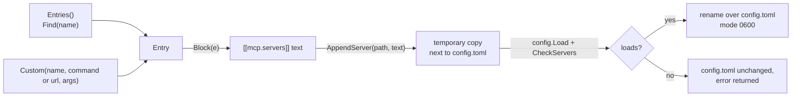

# catalog

**Code:** `internal/catalog/` (`doc.go`, `catalog.go`, `block.go`, `append.go`, and
the test `catalog_test.go`)
**Milestone:** v0.3
**Architecture:** [Adding an MCP server](../../ARCHITECTURE.md#adding-an-mcp-server),
[MCP](../../ARCHITECTURE.md#mcp)

## What it does

The catalog is the short list of MCP servers Meru knows how to set up, built into
the binary. Each entry says how to start the server, what it needs from you, and
which of its tools the model may use at first. Three things use it: `meru setup`,
`meru mcp add`, and the built-in `configure` tool that `merud` offers the model.

| Name | Server | Needs | Allowed | Asks first |
| --- | --- | --- | --- | --- |
| `brave` | `npx -y @brave/brave-search-mcp-server` | Brave Search API key | `brave_web_search`, `brave_news_search` | none |
| `fetch` | `uvx mcp-server-fetch` | nothing | `fetch` | none |
| `gmail` | `uvx workspace-mcp --tools gmail` | Google OAuth client, sign-in | search and read mail, list labels, draft, send | draft, send |
| `calendar` | `uvx workspace-mcp --tools calendar` | Google OAuth client, sign-in | list calendars and events, free/busy, manage an event | manage an event |
| `drive` | `uvx workspace-mcp --tools drive docs` | Google OAuth client, sign-in | search and read files and Docs, create and edit a doc | create, edit |
| `obsidian` | `uvx mcp-obsidian` | Local REST API plugin key | list, read and search notes, append to a note | append |

The tool names are exact. Tools are deny-by-default, so an allow entry with a typo
gives the model nothing. The comment at the top of `catalog.go` names the source
file each list came from and the version checked.

## The picture



## Walk through the code

### catalog.go

An `Entry` holds everything one server needs. `Needs` lists the questions to ask,
in order. A `Need` has a `Kind`: `api_key` (saved to `secrets.toml` under
`SecretName`), `path` or `url` (put in the env variable `Env`), or `note`
(something you do yourself, such as signing in to Google).

`Entries` builds the list fresh on every call:

```go
func Entries() []Entry {
    return []Entry{
        {Name: "brave", Command: "npx", ...},
        ...
    }
}
```

A package-level `var` would let one caller change the list for every other caller.
No caller can change what a function returns to the next caller, which follows
the "no package-level mutable state" rule in AGENTS.md.

One Google Workspace server covers Gmail, Calendar, Drive and Docs. The catalog
still has three entries, each running it with its own `--tools` flag. You add only
the services you want, and each server asks Google for its own permissions and no
more. The cost is a small process per entry.

`SecretNames` lists the `secrets.toml` entries an entry uses, from both its env
and its Needs. `configure` checks them before it writes anything.

### block.go

`Block` writes an entry as the text you would type into `config.toml`:

```toml
# Web page fetch: Reads a web page and hands it to the model as Markdown.
# Docs: https://github.com/modelcontextprotocol/servers/tree/main/src/fetch
[[mcp.servers]]
name    = "fetch"
command = "uvx"
args    = ["mcp-server-fetch"]
allow   = ["fetch"]
confirm = []
```

It builds the text by hand instead of through the TOML encoder, to put a comment
on top and keep the keys in reading order. `quote` escapes strings the TOML way.
Go's `strconv.Quote` looks close, but writes escapes such as `\x00` that TOML
refuses.

`Custom` makes an entry for a server outside the catalog. Nobody knows its tool
names until `merud` connects to it, so its `allow` list is empty and the block says
to run `meru tools` after restarting `merud`. A URL that isn't loopback gets
`network = true`, because you typed it on purpose.

### append.go

`AppendServer` adds one block to the end of `config.toml`, as plain text, so
every comment and setting already there stays as it was:

1. Parse the block alone and read its server name.
2. Load the current config; refuse when a server has that name already.
3. Write old text + blank line + block to a temporary file in the same folder.
4. `config.Load` the temporary file, then `CheckServers` its servers.
5. Rename it over `config.toml`. The file ends up with mode `0600`.

A block that would break config never reaches the real file. `CheckServers`
repeats the rules from `internal/mcp` that a new entry is most likely to break:
the name's characters, exactly one of `command` and `url`, no duplicate names, no
wildcards, `confirm` inside `allow`. The thin client may not import
`internal/mcp`, so the check lives here too; `merud` still runs the full check
when it starts.

## Go ideas used here

- **Struct literals** — `Entry{Name: "brave", ...}` builds a value by naming its
  fields; fields you leave out get their zero value.
- **`strings.Builder`** — collects text piece by piece without copying it on each
  append; `fmt.Fprintf(&b, ...)` writes formatted text into it.
- **Iterators** — `slices.Sorted(maps.Keys(set))` collects a map's keys in order.
  More in [go-basics/iterators.md](go-basics/iterators.md).
- **`defer`** — removes the temporary file on every return path. More in
  [go-basics/defer.md](go-basics/defer.md).

## Try it

```sh
go test ./internal/catalog/
```

`TestBlocksLoad` appends every catalog block to one file and loads it.
`TestAppendServerKeepsFile` checks that the old text, comments included, comes
through byte for byte. `TestAppendServerRefuses` feeds duplicates, wildcards and
broken blocks, and checks that the file stays as it was.

## Why it's built this way

- **Append, don't rewrite.** Rewriting `config.toml` through the TOML encoder
  would drop your comments. Appending text keeps the file yours, and loading the
  result before the rename catches any mistake.
- **Starter allow lists, not every tool.** Reading tools are safe to allow;
  anything that sends, writes or changes something asks first. You can widen the
  list later in `config.toml`.
- **Unpinned versions.** `npx` and `uvx` fetch the latest release, so security
  fixes arrive. A new tool in a later release gives the model nothing until you
  allow it.
