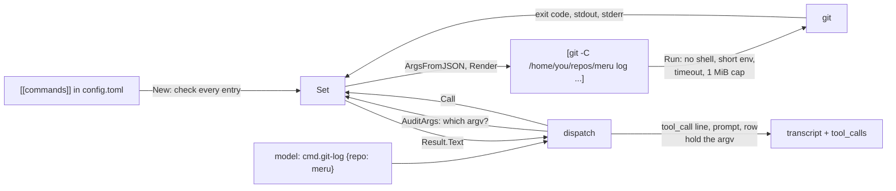

# commands

**Code:** `internal/commands/` (`doc.go`, `commands.go`, `render.go`, `run.go`,
`group_unix.go`, `group_other.go`, `set.go`, and the tests `commands_test.go`,
`render_test.go`, `run_unix_test.go`, `set_test.go`, `set_unix_test.go`,
`example_test.go`, with the script `testdata/talk.sh`)
**Milestone:** v0.3
**Architecture:** [Local commands](../../ARCHITECTURE.md#local-commands),
[Approving a tool call](../../ARCHITECTURE.md#approving-a-tool-call)

## What it does

`commands` lets the model run programs on your machine that you declared in
`config.toml`. Each `[[commands]]` entry becomes one tool, `cmd.<name>`. The model
picks a command and fills in its parameters; it never writes a command line.

```toml
[[commands]]
name        = "git-log"
description = "Commits from the past week in one of the user's repositories"
argv        = ["git", "-C", "{repo}", "log", "--since=1.week", "--oneline"]

  [commands.params.repo]
  type  = "path"
  under = "~/repos"
```

The model sends `{"repo": "meru"}`. The package checks the value, puts it into
the argv, runs `git` with no shell, and hands back the exit code and what `git`
printed. `merud` builds the set at startup with `New`, and `dispatch` reaches it
through `Set`, a `dispatch.Backend` like the MCP pool.

## The picture



## Walk through the code

### commands.go: the types and the startup checks

`Command` is one checked entry, and `Param` one of its parameters:

```go
type Command struct {
    Name        string
    Description string
    Argv        []string          // elements may hold {param} placeholders
    Params      map[string]Param
    Cwd         string
    Timeout     time.Duration
    Confirm     bool
    EnvAllow    []string
}
```

`New(decls, log)` turns the `config.Command` values that `config.Load` decoded
into `Command` values. It checks each entry with `check` and collects every
problem, each wrapped as `command "git-log": ...`, then joins them with
`errors.Join`, so you fix the whole file in one pass. It refuses:

- a name that is empty, not letters, digits, `-` and `_`, or used twice;
- an empty `argv`, a placeholder in `argv[0]`, or an interpreter there;
- a brace that isn't part of `{name}`, `{{` or `}}`;
- a placeholder with no parameter, or a parameter no placeholder uses;
- an unknown type, or a key the type doesn't take (`under` on a `string`);
- a `path` with no `under`, and an `under` or `cwd` that isn't a folder;
- an `enum` with no `values`, `min` above `max`, a bad `env_allowlist` name;
- a `pattern` on a type other than `string`, or one that doesn't compile;
- a timeout that doesn't parse or is over 300 seconds.

After the checks, `New` looks up each `argv[0]` with `exec.LookPath` and logs a
warning for one it can't find. A missing program is not fatal: you may install
it later, and until then its calls fail with a clear message.

**The interpreter rule.** `isInterpreter` takes the base name of `argv[0]`,
lowercases it, drops `.exe` and a trailing version, and looks it up in a list of
shells and script languages:

```go
base = strings.ToLower(base)
base = strings.TrimSuffix(base, ".exe")
base = strings.TrimRight(base, "0123456789.") // python3.12 → python
return slices.Contains(interpreters, base)
```

`bash -c {script}` would hand the model a shell again, so the entry never loads.
A script of your own, named by its path, is fine: the rule guards against a
slip, not against you.

**The placeholder syntax.** `parse` splits one argv element into `segment`
values, each literal text or a parameter name. `{name}` is a placeholder; `{{`
and `}}` are a literal brace, the rule Python's `str.format` uses. Any other
brace is an error, so a typo such as `{repo` fails at startup instead of reaching
`git` as text.

**`~`.** `expandHome` replaces a leading `~` in each argv element, `cwd` and
`under` with your home folder. Only a leading one: `--dir=~/x` stays as written.

**Patterns.** A string parameter may set `pattern`, a regular expression in
Go's RE2 syntax. `checkParam` compiles it once, wrapped as `^(?:...)$`, into
`Param.Pattern`, a `*regexp.Regexp`:

```go
re, err := regexp.Compile("^(?:" + p.Pattern + ")$")
```

The wrapping makes the pattern match the whole value. Without it,
`[A-Za-z0-9_.-]+/[A-Za-z0-9_.-]+` would find `a/b` inside
`a/b --web` and let the rest through. The GitHub samples in the config
template use it for `owner/name`.

### render.go: from the model's JSON to an argv

`ArgsFromJSON` reads the model's arguments. It decodes with `UseNumber`, so a
number keeps the text the model wrote (`json.Number`), and a type switch turns
each value into a string:

```go
switch v := v.(type) {
case string:
    out[k] = v
case json.Number:
    out[k] = v.String()
default:
    return nil, fmt.Errorf("parameter %q must be a string or a number", k)
}
```

A **type switch** runs the case that matches the value's dynamic type. More in
[go-basics/type-switches.md](go-basics/type-switches.md).

`Render` then checks each value with its `Param` and builds the argv. Every
parameter is required, and an unknown one is an error. Each placeholder becomes
part of exactly one element, so `hello; rm -rf ~` reaches the program as one
argument, semicolon and all. The checks by type:

| Type | Check | The argv gets |
| --- | --- | --- |
| `string` | not empty, no null byte, at most `MaxLen` bytes, a whole match for `Pattern` when set, no leading `-` when it fills a whole element | the value |
| `int` | `strconv.ParseInt`, within `Min` and `Max` | the number in plain form: `" 007"` gives `7` |
| `enum` | one of `Values` | the value |
| `path` | exists, and lies inside `Under` once every link is resolved | the resolved path |

The leading `-` rule stops a value from becoming a flag: `--output=/etc/x` in
place of a branch name would change what `git` does. Inside a longer element,
such as `--grep={text}`, a leading `-` is safe, since the element is one flag
already.

**Paths.** `checkPath` expands `~`, joins a relative path onto `Under`, cleans
it, and resolves every link with `filepath.EvalSymlinks` before it checks:

```go
real, err := filepath.EvalSymlinks(filepath.Clean(path))
...
if !inside(p.Under, real) {
    return "", fmt.Errorf("%s is outside %s, ...", v, p.Under)
}
return real, nil
```

The order matters. A check on the path as written would pass `~/repos/escape`, a
link inside `~/repos` that points at `/etc`. `New` resolves `Under` itself once,
since on macOS `/tmp` is a link to `/private/tmp` and an unresolved `Under`
would refuse every path in it. `inside` uses `filepath.Rel`, which gives a path
starting with `..` for anything elsewhere. The argv gets the resolved path, so a
link swapped after the check can't redirect the program.

### run.go: running the program

`Run(ctx, c, argv)` starts the program and waits for it:

```go
ctx, cancel := context.WithTimeout(ctx, c.Timeout)
defer cancel()
cmd := exec.CommandContext(ctx, argv[0], argv[1:]...)
cmd.Dir = c.Cwd
cmd.Env = childEnv(c.EnvAllow)
cmd.Stdout = &stdout
cmd.Stderr = &stderr
cmd.WaitDelay = waitDelay
ownGroup(cmd)
```

- **No shell.** `exec.CommandContext` starts `argv[0]` directly and hands it the
  rest as separate arguments. Nothing in them has special meaning. More in
  [go-basics/os-exec.md](go-basics/os-exec.md).
- **A short environment.** `childEnv` passes `PATH`, `HOME` and `LANG`, the
  names in `env_allowlist`, and on Windows `SystemRoot` and `USERPROFILE`, each
  only when `merud` has it. An empty list stays empty rather than `nil`, because
  a `nil` `Env` would give the child `merud`'s whole environment.
- **The timeout.** `context.WithTimeout` ends `ctx` after `c.Timeout`, and
  `exec.CommandContext` then runs `cmd.Cancel`. `defer cancel()` frees the timer
  when `Run` returns.
- **The cap.** `capped` is an `io.Writer` that keeps the first 1 MiB and drops
  the rest. It reports every write as complete: an error would make `os/exec`
  stop reading, and a program whose output pipe fills stops too, until the
  timeout kills it. A `sync.Mutex` guards its fields, since `os/exec` writes from
  its own goroutine.
- **WaitDelay.** A child the program left behind can hold the output pipes open
  after the program exits. `WaitDelay` caps how long `Wait` waits for them;
  `Run` then keeps what it has and treats `exec.ErrWaitDelay` as success.

`Run` sorts what happened. When `ctx` ended, the timeout fired or the turn was
cancelled, and `Run` returns an error wrapping `ctx.Err()`, which `dispatch`
turns into outcome `timeout` or `cancelled`. An `*exec.ExitError`, found with
`errors.As`, means the program ran and exited non-zero: that is a `Result`, not
an error. Anything else, such as a missing program, is an error.

`Result.Text` formats the result for the model:

```text
exit code: 2
stdout:
out: x
stderr:
err: x
```

It leaves out an empty stderr and adds a line when `Run` cut the output.

### group_unix.go and group_other.go: killing the whole program

On Unix, `ownGroup` puts the program in a process group of its own and makes
cancelling kill that group:

```go
cmd.SysProcAttr = &syscall.SysProcAttr{Setpgid: true}
cmd.Cancel = func() error {
    err := syscall.Kill(-cmd.Process.Pid, syscall.SIGKILL)
    ...
}
```

A negative process ID tells `kill` to signal every process in the group. Without
it, a timeout would kill `git` and leave the pager it started running as an
orphan. The file starts with `//go:build unix`, so only Unix builds compile it.
`group_other.go` carries `//go:build !unix` and does nothing, so Windows keeps
`exec.CommandContext`'s default: it kills the program alone. More in
[go-basics/build-tags.md](go-basics/build-tags.md).

### set.go: the dispatch backend

`Set` holds the commands in config order and implements `dispatch.Backend`:

| Method | For a command |
| --- | --- |
| `Kind` | `"command"` |
| `Tools` | one spec per command, named `cmd.<name>`; the description ends with the argv template, and the schema has one required property per parameter, a string's with its anchored `pattern` |
| `Confirm` | `ConfirmAsk` when the entry says `confirm = true`, else `ConfirmNever` |
| `Locate` | `("meru", "cmd.<name>")`: `merud` runs it, so the server is `meru` |
| `Call` | `ArgsFromJSON`, `Render`, `Run`, then `Result.Text` |
| `Status` | one source named `commands`, each tool with its `Argv` for `meru tools` |

A bad argument comes back as a `Result` with `IsError` set and a line that says
the program didn't run, so the model reads why. `Call` also puts
`meru.command.exit_code` and `meru.command.truncated` on the `meru.dispatch` span,
which it finds on `ctx` with `trace.SpanFromContext`.

`Set` is also a `dispatch.Auditor`. `AuditArgs` renders the model's arguments
and returns `{"argv":[...],"params":{...}}`, argv first, so a cut log line still
shows the program. `dispatch` records that in place of the model's arguments in
the `tool_call` line, the approval prompt, the `tool_calls` row and, with
`capture_content` on, the span. When the arguments don't render it returns
`nil`; `Call` then fails with the reason, and the row keeps what the model sent.
`Call` renders again when it runs. Both renders read the same arguments a moment
apart, so they agree unless a path changes in between.

```go
var (
    _ dispatch.Backend = (*Set)(nil)
    _ dispatch.Auditor = (*Set)(nil)
)
```

These lines make the compiler check that `*Set` has every method of both
interfaces. `(*Set)(nil)` is a nil pointer of type `*Set`, enough for the check.

## Go ideas used here

- **os/exec** — running a program with no shell, `Cancel` and `WaitDelay`. More
  in [go-basics/os-exec.md](go-basics/os-exec.md).
- **Build tags** — `group_unix.go` and `group_other.go`. More in
  [go-basics/build-tags.md](go-basics/build-tags.md).
- **context** — the per-command timeout. More in
  [go-basics/context.md](go-basics/context.md).
- **Type switches** — reading the model's JSON values. More in
  [go-basics/type-switches.md](go-basics/type-switches.md).
- **errors.As and errors.Join** — finding an `*exec.ExitError`, and reporting
  every bad entry at once. More in [go-basics/errors.md](go-basics/errors.md).
- **filepath** — `EvalSymlinks`, `Rel` and `Clean` for the path check. More in
  [go-basics/filepath.md](go-basics/filepath.md).
- **Interfaces** — `Set` satisfies `dispatch.Backend` and `dispatch.Auditor`
  with no `implements` keyword. More in
  [go-basics/interfaces.md](go-basics/interfaces.md).
- **Pointers for "not set"** — `Min` and `Max` are `*int64`, so `nil` means no
  bound and differs from 0. `Pattern` is a `*regexp.Regexp`, `nil` for none.
- **`regexp`** — Go's regular expressions (RE2) run in time linear in the
  input, so no value the model sends can make a pattern check hang.

## Try it

```sh
go test -race ./internal/commands/
go test -race -tags e2e -run TestLocalCommand ./test/e2e/
```

`TestNewRejects` has one case per startup refusal and checks each error names
the command. `TestRender` passes values with spaces, quotes, `$(id)` and a
semicolon and checks each stays one element. `TestRenderPath` covers `..`, a
symlink out of the tree and one inside it. `TestRunTimeoutKillsGroup` runs
`testdata/talk.sh hang`, which starts a child and waits; after the timeout it
checks the child is gone. `TestRunEnvironment` sets a variable outside
`env_allowlist` and checks the program never sees it.
`TestConfirmingCommandInAJob` runs a `confirm = true` command under a scheduled
job through a real `Dispatcher`: it is declined without a prompt, and its row
still holds the argv. `TestRenderPattern` checks that `owner/name` passes and
that a bare name, a URL, an extra path part and `owner/name --web` don't, and
that the schema carries the anchored pattern. `TestExampleCommands` loads the
`[[commands]]` samples in `config.example.toml`, the six GitHub ones included,
checks that none of those asks first, renders `gh-prs` and `gh-pr` to the argv
`gh` gets, and checks that `gh-prs` refuses a repository that isn't
`owner/name` and `gh-repos` an owner with a slash. It also renders `csv-sum`
and `file-lines` to check that `{{` and `}}` reach `awk` as single braces, and
that a line number or a process name can't carry script text or a semicolon.

To see it live, add the `git-log` entry above to `~/.meru/config.toml`, restart
`merud`, and run:

```sh
meru tools
meru "what changed in the meru repo this week?"
meru log -n 1
```

## Why it's built this way

- **Named commands, not a command allowlist.** A `run_command` tool with a list
  of allowed programs looks safe and isn't: `find -exec`, `git -c core.pager=…`,
  `awk 'BEGIN{system(…)}'` and `ssh host …` each run anything. Making that safe
  means an argument checker that is never finished. With the whole command in
  config, a parameter can only fill its own element.
- **No MCP shell server.** A shell server confines nothing Meru doesn't, adds a
  Python runtime and a process to supervise, and keeps the real policy where
  `dispatch` can't log it.
- **Resolve, then check.** Checking a path before resolving its links lets a
  link out of the tree. `write_file` follows the same rule for its folder.
- **A non-zero exit is a result.** `grep` exits 1 when nothing matches, and
  `git` exits non-zero on a bad ref. The model should read that and react, not
  get "the call failed".
- **A pattern, not a GitHub type.** A `repo` type would teach this package
  about one service. A regular expression on a string covers `owner/name` and
  any other shape a user needs, with one small key.
- **The backend in this package, not in cmd/merud.** The MCP pool needs an
  adapter because `mcp` doesn't import `dispatch`. `commands` has no such
  reason, so `Set` implements `Backend` itself, as `builtin.Tools` does.
- **Checks at startup, not in config.Load.** `config` is imported by the thin
  client, which must not pull in code that runs programs, so the rules live
  here and `merud` runs them when it starts, as it does for `[[mcp.servers]]`.
