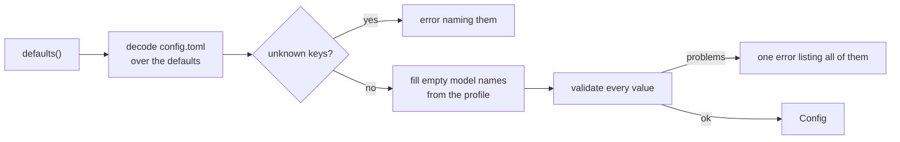

# config

**Code:** `internal/config/` (`config.go`, `load.go`, `loopback.go`)
**Milestone:** v0.1
**Architecture:** [Model tiers](../../ARCHITECTURE.md#model-tiers), [Observability](../../ARCHITECTURE.md#observability)

## What it does

`config` reads `~/.meru/config.toml` once, when `merud` starts. It fills in a
default for every key the file leaves out, picks model names from the chosen
profile, and checks every value. If anything is wrong, `merud` stops with a
message that names the key. After `Load` returns, the rest of Meru trusts the
values it gets.

Meru never writes this file. `config.example.toml` at the repo root lists every
key with its default.

## The picture



## Walk through the code

### config.go

The structs that mirror the file. Each field carries a **struct tag** that tells
the TOML parser which key fills it:

```go
type Ollama struct {
    BaseURL   string `toml:"base_url"`
    KeepAlive string `toml:"keep_alive"`
}
```

A **struct** is a named group of fields, like a Python dataclass. The text in
backticks is the tag. More in [go-basics/struct-tags.md](go-basics/struct-tags.md).

### load.go

`Load` starts from a `Config` full of defaults and lets the TOML parser write
over it:

```go
cfg := defaults()
md, err := toml.DecodeFile(path, &cfg)
switch {
case errors.Is(err, fs.ErrNotExist):
    // No file yet: keep the defaults.
case err != nil:
    return Config{}, fmt.Errorf("read config %s: %w", path, err)
default:
    if unknown := md.Undecoded(); len(unknown) > 0 { ... }
}
```

- `&cfg` passes the address of `cfg`, so the parser can change it in place.
- The parser only sets keys the file contains. Every missing key keeps its
  default. This also means a user can set `min_confidence = 0` on purpose;
  a "zero means unset" rule would have turned that back into 0.45.
- A missing file isn't an error. `errors.Is` checks whether the error, or any
  error it wraps, is "file not found".
- `md.Undecoded()` lists keys the file has but no struct field wants. That
  catches typos such as `profil = "full"`, which would otherwise do nothing
  without a word.

Next, `Load` sets `Dir` to the folder that holds the config file. Pointing
`merud -config` at another folder moves the whole Meru home there, which is
handy for tests.

Model names come from the profile only when the file leaves them empty:

```go
p := profiles[cfg.Profile]
if cfg.Models.Fast == "" {
    cfg.Models.Fast = p.Fast
}
```

`profiles` is a **map** from profile name to `Models`, like a Python dict. Looking
up a missing key returns the zero value (all empty strings), and `validate`
reports the unknown profile.

`validate` collects every problem before it returns, so the user fixes them all
in one pass:

```go
var errs []error
add := func(format string, args ...any) {
    errs = append(errs, fmt.Errorf(format, args...))
}
...
return errors.Join(errs...)
```

`add` is a **closure**: a function defined inside another function that can
read and change the outer function's variables (`errs` here). `errors.Join`
glues the errors together and returns `nil` when the list is empty.

### loopback.go

`checkLoopbackURL` refuses any Ollama or OTLP address that could reach another
machine. It accepts `127.0.0.0/8`, `::1` and the name `localhost`:

```go
addr, err := netip.ParseAddr(host)
if err != nil {
    return fmt.Errorf("%q must use a loopback address ...", raw)
}
if !addr.Unmap().IsLoopback() { ... }
```

- Only the literal name `localhost` gets resolved, and every address it
  resolves to must be loopback. Any other host name is refused unresolved,
  because a name that points at 127.0.0.1 today can point elsewhere tomorrow.
- `Unmap` turns `::ffff:127.0.0.1` (IPv4 written as IPv6) back into
  `127.0.0.1`, so both spellings get the same answer.
- `0.0.0.0` and `::` are refused. They mean "every interface" when listening,
  never "this machine" when connecting.

## Go ideas used here

- **Multiple return values and `if err != nil`** — functions return a result
  and an error; the caller checks the error first. More in
  [go-basics/errors.md](go-basics/errors.md).
- **Struct tags** — metadata on a field that a library reads. More in
  [go-basics/struct-tags.md](go-basics/struct-tags.md).
- **`defer`** — `checkLocalhost` uses `defer cancel()` to free its timer. More in
  [go-basics/defer.md](go-basics/defer.md).
- **`context.WithTimeout`** — caps how long the `localhost` lookup may take.
  More in [go-basics/context.md](go-basics/context.md).
- **Closures** — `add` inside `validate`.

## Try it

```sh
go test ./internal/config/...
```

`TestExampleMatchesDefaults` loads `config.example.toml` and checks that it
shows the same values as `defaults()`, so the example can't drift from the code.

## Why it's built this way

- **Decode over defaults** is the simplest way to get "missing means default"
  without pointer fields or a second "was it set?" struct.
- **Reject unknown keys.** A silent typo in a privacy setting such as
  `otlp_endpont` is worse than a refusal to start.
- **Report every problem at once.** Stopping at the first error makes the
  user restart `merud` once per mistake.
- **Our own loopback check.** The engine package has one too; the two will
  merge into one later. Both use only the standard library.
