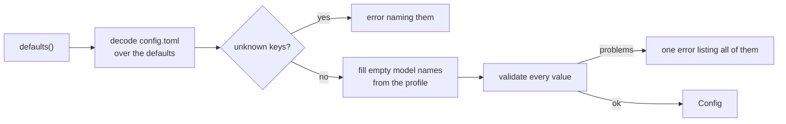

# config

**Code:** `internal/config/` (`config.go`, `load.go`, `template.go`, `template.toml`, `loopback.go`)
**Milestone:** v0.1
**Architecture:** [Model tiers](../../ARCHITECTURE.md#model-tiers), [Observability](../../ARCHITECTURE.md#observability), [Web search](../../ARCHITECTURE.md#web-search), [Approving a tool call](../../ARCHITECTURE.md#approving-a-tool-call), [Skills](../../ARCHITECTURE.md#skills), [First run and setup](../../ARCHITECTURE.md#first-run-and-setup)

## What it does

`config` reads `~/.meru/config.toml` once, when `merud` starts. It fills in a
default for every key the file leaves out, picks model names from the chosen
profile, and checks every value. If anything is wrong, `merud` stops with a
message that names the key. After `Load` returns, the rest of Meru trusts the
values it gets.

This package never writes the file. It holds the config template,
`template.toml`: every key, with what is on by default uncommented at its
default value and what is off in comments. `meru setup` writes the template as
a new `config.toml`, and `meru config template` prints it. `config.example.toml`
at the repo root is a byte-for-byte copy.

## The picture



## Walk through the code

### config.go

The structs that mirror the file. Each field carries a **struct tag** that tells
the TOML parser which key fills it:

```go
type Ollama struct {
    BaseURL   string `toml:"base_url"`
    KeepAlive string `toml:"keep_alive"`
}
```

A **struct** is a named group of fields, like a Python dataclass. The text in
backticks is the tag. More in [go-basics/struct-tags.md](go-basics/struct-tags.md).

`Agent` holds the loop's limits. `MaxRounds` caps model calls per turn,
`MaxOutputTokens` caps the tokens one call may write, hidden thinking
included, and `TurnTimeout` is how long a turn may run, a Go duration string
such as `"5m"`. `validate` wants `max_output_tokens` at 1 or more and
`turn_timeout` a positive duration, as it wants `summary_idle`.

`Commands` holds the `[[commands]]` entries (v0.3): each is a `Command` with a
name, a description, an `argv`, a `cwd`, a `timeout`, `confirm`, an
`env_allowlist`, and a `params` table of `CommandParam` values keyed by
parameter name. The double brackets in `[[commands]]` make a TOML array of
tables, which the parser decodes into a slice (`[]Command`); each
`[commands.params.<name>]` becomes one entry of the `Params` map. `Min` and
`Max` are `*int64`, pointers, so that "no bound" (`nil`) differs from a bound of
0. A string parameter's `Pattern` is the text of a regular expression. `Load`
only decodes these entries. The rules for placeholders, paths, patterns and
interpreters live in [commands](commands.md), which checks the entries when
`merud` starts, as the MCP pool checks `[[mcp.servers]]`.

`MCPServer` is one `[[mcp.servers]]` entry and `A2AAgent` one `[[a2a.agents]]`
entry. Each has a `Remote` field:

```go
// Remote lets merud connect to a URL that isn't loopback. It covers
// only where merud connects; it says nothing about what the server
// itself reaches. It was called network before.
Remote bool `toml:"remote"`
```

The key was `network` until the rename. `network = false` on a Gmail server read
as "this server stays off the network", which is false: the `google` server runs
on loopback and talks to Google. `remote` names the one thing the key controls.
`MCPServer.Env` belongs to a stdio server; the `mcp` package refuses it on a `url`
entry, because `merud` starts no process whose environment it could set (see
[mcp.md](mcp.md)).

`Web` is the `[web]` section (v0.3), for the built-in web tools
([builtin](builtin.md)):

```go
type Web struct {
    SearXNGURL string `toml:"searxng_url"` // default "http://127.0.0.1:8888"; "" turns web_search off
    MaxResults int    `toml:"max_results"` // default 8, at most MaxWebResults (20)
}
```

`validate` runs `searxng_url` through the same `loopback.CheckURL` as the Ollama
and OTLP addresses, because `merud` connects to it. It skips the check for an
empty URL, which is how you turn web search off. The default URL isn't empty, so
a file that leaves `[web]` out searches at `127.0.0.1:8888`, and `web_search`
explains what to do when nothing answers there. `MaxWebResults` is exported
because `web_search` checks a call's own `max_results` against the same cap.

`Chat` is the `[chat]` section, which only `meru chat` reads; `merud` loads it
with the rest and ignores it:

```go
type Chat struct {
    MouseCopy bool `toml:"mouse_copy"` // default true
}
```

`MouseCopy` lets a click on a code block's `⧉ copy N` label copy the block (see
[tui](tui.md)). It is on by default. To see clicks, the chat has to capture the
mouse, and the terminal's own click-and-drag selection then needs Option (iTerm2)
or Shift (most others); `false` gives plain selection back. Because the default is
true, `defaults()` sets it, where a Go zero value would give false. `meru` may import `config`, so reading the key
keeps the client thin.

`Builtin` is the `[builtin]` section, for the tools built into `merud`:

```go
type Builtin struct {
    Tools   []string `toml:"tools"`   // default: all eleven, from BuiltinTools()
    Confirm []string `toml:"confirm"` // default ["write_file"]
}
```

`Tools` is the one switch for each built-in, `web_fetch` included; `[web]` has
no `fetch` key any more. A name left out means [builtin](builtin.md) doesn't
register that tool. The TOML parser writes over the default only when the key
is there, so `tools = []` sticks and turns every built-in off. `web_fetch`
connects off this machine, which is why its own guard, and not config, decides
when it asks.

`Skills` holds `OutputDir`, the folder `write_file` writes in, and `Disabled`,
the skill names `merud` neither installs nor loads (see [skills](skills.md)).
`Disabled` defaults to an empty list and isn't checked: a name may match a
skill the user adds later.

### load.go

`Load` starts from a `Config` full of defaults and lets the TOML parser write
over it:

```go
cfg := defaults()
md, err := toml.DecodeFile(path, &cfg)
switch {
case errors.Is(err, fs.ErrNotExist):
    // No file yet: keep the defaults.
case err != nil:
    return Config{}, fmt.Errorf("read config %s: %w", path, err)
default:
    if unknown := md.Undecoded(); len(unknown) > 0 { ... }
}
```

- `&cfg` passes the address of `cfg`, so the parser can change it in place.
- The parser only sets keys the file contains. Every missing key keeps its
  default. This also means a user can set `min_confidence = 0` on purpose;
  a "zero means unset" rule would have turned that back into 0.45.
- A missing file isn't an error. `errors.Is` checks whether the error, or any
  error it wraps, is "file not found".
- `md.Undecoded()` lists keys the file has but no struct field wants. That
  catches typos such as `profil = "full"`, which would otherwise do nothing
  without a word.

One unknown key gets its own message. A config written before the rename still
says `network`, and "unknown keys: mcp.servers.network" wouldn't say what to
change. So inside the loop over the unknown keys, `Load` asks `renamedNetwork`
first:

```go
func renamedNetwork(k toml.Key) bool {
    return len(k) == 3 && k[2] == "network" &&
        ((k[0] == "mcp" && k[1] == "servers") || (k[0] == "a2a" && k[1] == "agents"))
}
```

A `toml.Key` is a slice of strings, one per level of the key's path, so
`network` inside `[[mcp.servers]]` arrives as `["mcp", "servers", "network"]`.
When it matches, `Load` fails with "network was renamed remote: write remote =
true in mcp.servers to let merud connect to a URL on another machine".
`TestLoadErrors` covers the old key in both tables.

`[web] fetch`, which `[builtin] tools` replaced, gets the same treatment, and
so does `read_pages`, its name before that. `Load` compares the key's dotted
form, `k.String()`, with `"web.fetch"` and `"web.read_pages"`, and fails with
the constant `movedFetch`: "web.fetch moved: list web_fetch in [builtin] tools,
or remove it to turn page fetching off". `Load` doesn't read the old value
across; the user decides once, in one place.

Next, `Load` sets `Dir` to the folder that holds the config file. Pointing
`merud -config` at another folder moves the whole Meru home there, which is
handy for tests.

Model names come from the profile only when the file leaves them empty:

```go
p := profiles[cfg.Profile]
if cfg.Models.Fast == "" {
    cfg.Models.Fast = p.Fast
}
```

`profiles` is a **map** from profile name to `Models`, like a Python dict. Looking
up a missing key returns the zero value (all empty strings), and `validate`
reports the unknown profile. `ProfileModels(name)` hands out one profile's
models, and `false` for a name it doesn't know; `meru setup` calls it to
download a profile's models before any `config.toml` exists.

`validate` collects every problem before it returns, so the user fixes them all
in one pass:

```go
var errs []error
add := func(format string, args ...any) {
    errs = append(errs, fmt.Errorf(format, args...))
}
...
return errors.Join(errs...)
```

`add` is a **closure**: a function defined inside another function that can
read and change the outer function's variables (`errs` here). `errors.Join`
glues the errors together and returns `nil` when the list is empty.

`checkIndex` also checks `[index] retrieval`: `"auto"`, the default, or
`"agentic"`, the two constants `RetrievalAuto` and `RetrievalAgentic`. Agentic
retrieval runs no search before the answer, so `validate` refuses it when
`[builtin] tools` leaves out `search_files`: the model would lose search by
meaning altogether and keep only `grep` (see
[Retrieval](../../ARCHITECTURE.md#retrieval)).

`checkBuiltin` adds two rules for `[builtin]`. A name in `tools` must be one of
the eleven in `builtinTools`, and the message lists them. A name in `confirm` must
also be in `tools`; otherwise the confirm line would do nothing, which is
almost always a typo. `builtinTools` lives here, not in `internal/builtin`,
because `builtin` imports `config` and Go refuses an import cycle. A test in
`builtin` checks that the two lists agree. `BuiltinTools()` hands out a copy,
made with `slices.Clone`, so no caller can change the defaults.

`[log] level` must be `debug`, `info`, `warn` or `error`. `LogLevel` turns the
name into the `slog.Level` `merud` logs at, and returns `false` for any other
name, so `validate` and `merud`'s `openLog` share one list. `merud -v` sets
`cfg.Log.Level` to `debug` after `Load` returns, so the flag beats the file.

### template.go and template.toml

`template.toml` is the config template. Every section and key sits in it.
The uncommented lines hold the defaults, so `Load` of the template gives the
same `Config` as no file at all; `TestTemplateMatchesDefaults` checks that.
The `[models]` lines stay empty, with the `lite` names in comments, because a
name there would override the profile: a user who then picked `full` would
still run the `lite` model. The MCP servers, local commands and A2A agent
sit in comments, ready to uncomment. So do six read-only GitHub commands for
the `gh` CLI: nothing runs until the user takes the `# ` off an entry, which
keeps tools deny-by-default.

`template.go` compiles the file into the binary:

```go
//go:embed template.toml
var templateText string

func Template() string { return templateText }
```

The `//go:embed` line is a directive to the compiler: at build time it copies
the file's bytes into the string, so `meru` needs no data file next to it.
The package imports `embed` with a blank name (`_`), which turns the
directive on without using anything from the package. More in
[go-basics/embed.md](go-basics/embed.md).

`config.example.toml` at the repo root is a copy, for readers of the repo.
Two files could drift, so `TestExampleIsTemplate` fails when they differ and
says which command copies one over the other. A generate step that writes the
example from the template would need a `go generate` line and a check that
someone ran it; the test is the simpler guard.

Two more tests keep the comments honest. `TestTemplateCommentedBlocks`
uncomments every `# [[` block and loads the result, and checks it holds three
servers, one agent and ten commands, the GitHub ones included. The catalog's two server
blocks can't come from `catalog.Block` here, because `catalog` imports
`config`, so the template holds a hand copy, and `TestTemplateHoldsCatalog` in
the catalog package checks it against `Block`'s output.

### Model sets

`Models.Sets` holds the `[[models.sets]]` entries, each a `ModelSet`: a name, a
main model, and optional fast and embed models. In TOML, `[[models.sets]]`
starts one entry of an array of tables, so each block becomes one element of
the slice. `Think` is a `*bool`, a pointer to a bool, so that a key left out
(`nil`) differs from `think = false`; `ThinkOff` reports the second. A test
writes `new(false)`, which since Go 1.26 makes a `*bool` that points at `false`.

`checkSets` refuses an entry with no name, a name with anything but letters,
digits, `.`, `-` and `_`, a name used twice, and a set that names no model. It
doesn't ask Ollama whether the models exist: `config` never talks to Ollama, and
`merud` warns about a missing one when it starts. `FindSet` looks a set up by
name for `merud`'s model ops.

`Models` now holds a slice, and Go can't compare a struct that holds a slice
with `==`, so the tests compare its three model names one by one.

### known.go

`KnownModels()` lists the six models we offer as the answer model, smallest
first: MiniCPM5-2B, `gemma3:12b`, `gemma4:26b-a4b-it-qat`, `qwen3.6:35b`,
`gemma4:26b-mxfp8` and `qwen3.6:35b-a3b-mxfp8`. The good and bad lines of the
last two quote our September 2026 benchmark (ARCHITECTURE.md, "Models we
tried"); `gemma4:26b-a4b-it-qat`'s bad line says we haven't benchmarked it.
`qwen3.8:27b` stays off the list: it took several times as long per task. Each `KnownModel` holds the name
Ollama gives it, a label, its size on disk, one line on what it did well and one
on what it did badly, and the capabilities Ollama's `/api/show` listed for it.
`merud` sends the list to the desktop app's Settings, Models, which offers each
one with its `ollama pull` and `ollama run` commands and a "Use for answers"
button. `FindKnownModel(name)` looks one up; `merud` refuses to switch to a name
it doesn't find.

The list returns a new slice on each call, as `BuiltinTools()` does, so no
caller can change it for the next. It names models in code, as the profiles do,
because it records what we tested; `config.toml` still says which model runs.
`TestKnownModels` checks every field is set, that the names are the six we
offer in order, and that the main model of each profile, `lite` and `full`, is
one of them, so Settings can always switch back to it.

### loopback.go

`checkLoopbackURL` refuses any Ollama or OTLP address that could reach another
machine. It accepts `127.0.0.0/8`, `::1` and the name `localhost`:

```go
addr, err := netip.ParseAddr(host)
if err != nil {
    return fmt.Errorf("%q must use a loopback address ...", raw)
}
if !addr.Unmap().IsLoopback() { ... }
```

- Only the literal name `localhost` gets resolved, and every address it
  resolves to must be loopback. Any other host name is refused unresolved,
  because a name that points at 127.0.0.1 today can point elsewhere tomorrow.
- `Unmap` turns `::ffff:127.0.0.1` (IPv4 written as IPv6) back into
  `127.0.0.1`, so both spellings get the same answer.
- `0.0.0.0` and `::` are refused. They mean "every interface" when listening,
  never "this machine" when connecting.

## Go ideas used here

- **Multiple return values and `if err != nil`** — functions return a result
  and an error; the caller checks the error first. More in
  [go-basics/errors.md](go-basics/errors.md).
- **Struct tags** — metadata on a field that a library reads. More in
  [go-basics/struct-tags.md](go-basics/struct-tags.md).
- **`defer`** — `checkLocalhost` uses `defer cancel()` to free its timer. More in
  [go-basics/defer.md](go-basics/defer.md).
- **`context.WithTimeout`** — caps how long the `localhost` lookup may take.
  More in [go-basics/context.md](go-basics/context.md).
- **Closures** — `add` inside `validate`.

## Try it

```sh
go test ./internal/config/...
```

`TestTemplateMatchesDefaults` loads the template and checks that it shows the
same values as `defaults()`, so the template can't drift from the code.
`TestExampleIsTemplate` checks that `config.example.toml` is still a copy.
`go run ./cmd/meru config template` prints the template.

## Why it's built this way

- **Decode over defaults** is the simplest way to get "missing means default"
  without pointer fields or a second "was it set?" struct.
- **Reject unknown keys.** A silent typo in a privacy setting such as
  `otlp_endpont` is worse than a refusal to start.
- **Report every problem at once.** Stopping at the first error makes the
  user restart `merud` once per mistake.
- **One template, embedded.** The file setup writes, the file `meru config
  template` prints and the example in the repo come from one source, and tests
  tie it to the defaults and the catalog.
- **Our own loopback check.** The engine package has one too; the two will
  merge into one later. Both use only the standard library.
