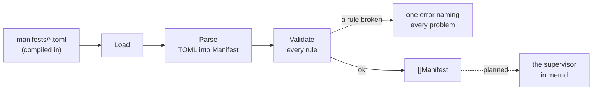

# connectors

**Code:** `internal/connectors/` (`doc.go`, `manifest.go`, `manifests/*.toml`)
**Milestone:** v0.5 (issue #87, step 1)
**Architecture:** [Connectors and the supervisor](../../ARCHITECTURE.md#connectors-and-the-supervisor)

## What it does

A connector is a program Meru will install, start and check for you: SearXNG
for web search, the Obsidian and Google MCP servers, and Ollama, which Meru
only reports on. Each one has a **manifest**, a TOML file in `manifests/` that
pins its version and says how to install it, how to start it, what to ask the
user and how to tell that it works.

This first step only reads and checks the manifests. `Load` parses all four
and refuses the set when one breaks a rule. No code calls `Load` yet apart from
the tests; the supervisor that uses the manifests comes in later steps. The
package runs no program, reads no user file and touches no network, and the
clients never import it.

## The picture



## Walk through the code

### The manifests

`searxng.toml` is the shortest real one:

```toml
id = "searxng"
kind = "container"

[install]
type = "container"
image = "docker.io/searxng/searxng:2026.9.29-4e2c1ea7f@sha256:3284e890…"

[launch]
url = "http://127.0.0.1:8888"
port = 8080
volumes = ["{meru_dir}/searxng:/etc/searxng"]
```

The image ends in `@sha256:` and a digest, the hash of the image's contents.
A tag such as `2026.9.29-4e2c1ea7f` can be moved to a new image; a digest
can't. `obsidian.toml` pins the npm package `obsidian-mcp` at `2.0.1`, and
`google.toml` the Python package `workspace-mcp` at `1.30.0`. A comment at the
top of each file says where its pin came from and on what date. `ollama.toml`
installs nothing: `merud` only asks Ollama's `/api/version`.

`{pkg}`, `{meru_dir}` and `{field.vault_path}` are placeholders. The
supervisor will fill them in: the install folder, `~/.meru`, and the value the
user gave for a field.

### manifest.go

The file starts with the types. `Manifest` holds the top-level keys, and one
struct each for `[install]`, `[launch]`, `[[field]]`, `[health]` and `[mcp]`:

```go
type Manifest struct {
    ID     string  `toml:"id"`
    Kind   string  `toml:"kind"`
    Install Install `toml:"install"`
    Fields []Field `toml:"field"` // each [[field]] table
    ...
}
```

The text in backticks is a **struct tag**: it tells the TOML parser which key
fills the field (see [go-basics/struct-tags.md](go-basics/struct-tags.md)).
`[[field]]` in TOML is an array of tables, so it decodes into a slice.

The manifests reach the binary through `embed`:

```go
//go:embed manifests/*.toml
var manifestFiles embed.FS
```

`embed.FS` is a read-only file system inside the binary. `Load` hands it to
`loadFS`, which takes any `fs.FS`, so a test can pass a made-up one from
`testing/fstest` (see [go-basics/embed.md](go-basics/embed.md)).

**Parse** decodes one file. A binary download needs a URL and a checksum per
platform, written `url_darwin_arm64` and `sha256_darwin_arm64`. A struct tag
can't name a key that changes with the platform, so `Parse` reads `[install]` a
second time into a `map[string]any` and picks those keys out into
`Install.Binaries`. Any other key the types don't know, most often a typo,
fails the parse, the way `config.Load` refuses one.

**Validate** checks one manifest and joins every problem into one error, so a
manifest author fixes them all in one pass. It uses the closure pattern
`config` uses (`add := func(format string, args ...any) {...}`) and one helper
per table: `checkInstall`, `checkFields`, `checkLaunch`, `checkHealth` and
`checkMCP`. The rules:

| Rule | Why |
| --- | --- |
| a version is one exact release: no `latest`, `""`, `^`, `~`, `>`, `<`, `*`, `x`, bare major or tag | a pin that can match two releases isn't a pin |
| a container image ends in `@sha256:<64 hex>`, and isn't tagged `latest` | a tag can move; a digest can't |
| a binary has an https URL and a SHA-256 for each platform it names | the supervisor checks the download before it unpacks it |
| kind, install type, field type and auth are known, and the install fits the kind | a typo would otherwise do nothing |
| `id`, `name` and each field's `id` are set and unique | IDs end up in config keys and secret names |
| a secret has no default | a default secret would sit in the binary, the same for everyone |
| a `pattern` compiles | a bad pattern would refuse every value |
| an http or container `url` is loopback | `merud` connects only to loopback (`internal/loopback`) |
| a placeholder names a real field; a secret never goes in `args` | any user can read another's command line in the process list |
| no wildcard in a tool list; every `confirm` tool is in `allow` | tools stay deny-by-default |

Each install type has its own version pattern. npm takes a full semantic
version such as `2.0.1`; pip takes a Python release number such as `1.30.0` or
`1.0rc1`; a binary takes `v0.12.4` or `0.12.4`. Checking `2.0.x` against a
single loose pattern would let it through, so each pattern spells out what one
release looks like.

`checkImage` reads the tag with care. In `localhost:5000/search@sha256:…` the
`:5000` is a port, not a tag, so it looks for `:` only after the last `/`.

## Go ideas used here

- **embed** — `//go:embed` copies the manifests into the binary. More in
  [go-basics/embed.md](go-basics/embed.md).
- **Struct tags** — map TOML keys to fields. More in
  [go-basics/struct-tags.md](go-basics/struct-tags.md).
- **Type assertions** — `v.(string)` asks whether the value in an `any` is a
  string. More in [go-basics/type-switches.md](go-basics/type-switches.md).
- **Errors** — `errors.Join` turns a list of problems into one error, and
  returns `nil` for an empty list. More in [go-basics/errors.md](go-basics/errors.md).

## Try it

```sh
go test ./internal/connectors/...
go test -run 'TestManifestsPinned|TestNoUnpinnedVersions' ./internal/policy/
```

`TestValidate` breaks one rule per case, starting from a manifest that passes,
and checks that the error names it. `TestLoadRealManifests` loads the four real
files. The policy tests load them too, and scan the repo for unpinned versions
(see [testing](testing.md)).

## Why it's built this way

- **Plain structs, checked by hand.** A schema library would add a dependency
  and a second language to read. `Validate` is a list of `if` statements a
  reader can follow top to bottom.
- **One file per connector, compiled in.** A pin changes only in a Meru release,
  so nobody can point a working install at a new, untested version by editing a
  file on disk.
- **Checks before behaviour.** The rules and the pins land first, with a test
  that keeps new code pinned, so the steps that install and run programs build
  on manifests that already pass.
