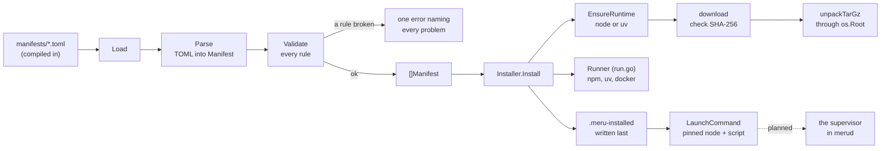

# connectors

**Code:** `internal/connectors/` (`doc.go`, `manifest.go`, `manifests/*.toml`,
`runtimes.go`, `download.go`, `install.go`, `launch.go`, `run.go`)
**Milestone:** v0.5 (issue #87, steps 1 and 2)
**Architecture:** [Connectors and the supervisor](../../ARCHITECTURE.md#connectors-and-the-supervisor),
[The runtime folder](../../ARCHITECTURE.md#the-runtime-folder)

## What it does

A connector is a program Meru will install, start and check for you: SearXNG
for web search, the Obsidian and Google MCP servers, and Ollama, which Meru
only reports on. Each one has a **manifest**, a TOML file in `manifests/` that
pins its version and says how to install it, how to start it, what to ask the
user and how to tell that it works.

The package has two parts so far. Step 1 reads and checks the manifests:
`Load` parses all four and refuses the set when one breaks a rule. Step 2
installs them: an `Installer` downloads the pinned Node and uv into
`~/.meru/runtime`, checks each archive's SHA-256 before it unpacks it, installs
a connector's package into `~/.meru/runtime/pkg/<id>-<version>/`, and says how
to start the installed program. No code in `merud` calls any of it yet; the
supervisor that will comes in step 3. The clients never import the package.

## The picture



## Walk through the code

### The manifests

`searxng.toml` is the shortest real one:

```toml
id = "searxng"
kind = "container"

[install]
type = "container"
image = "docker.io/searxng/searxng:2026.9.29-4e2c1ea7f@sha256:3284e890…"

[launch]
url = "http://127.0.0.1:8888"
port = 8080
volumes = ["{meru_dir}/searxng:/etc/searxng"]
```

The image ends in `@sha256:` and a digest, the hash of the image's contents.
A tag such as `2026.9.29-4e2c1ea7f` can be moved to a new image; a digest
can't. `obsidian.toml` pins the npm package `obsidian-mcp` at `2.0.1`, and
`google.toml` the Python package `workspace-mcp` at `1.30.0`. A comment at the
top of each file says where its pin came from and on what date. `ollama.toml`
installs nothing: `merud` only asks Ollama's `/api/version`.

`{pkg}`, `{meru_dir}` and `{field.vault_path}` are placeholders.
`LaunchCommand` fills them in: the install folder, `~/.meru`, and the value the
user gave for a field.

For an npm or pip connector, `launch.command` is the bare name of a program
the package installs, such as `command = "obsidian-mcp"` in `obsidian.toml`.
Meru finds the program in the install folder itself; the section on
`launch.go` below says why.

### manifest.go

The file starts with the types. `Manifest` holds the top-level keys, and one
struct each for `[install]`, `[launch]`, `[[field]]`, `[health]` and `[mcp]`:

```go
type Manifest struct {
    ID     string  `toml:"id"`
    Kind   string  `toml:"kind"`
    Install Install `toml:"install"`
    Fields []Field `toml:"field"` // each [[field]] table
    ...
}
```

The text in backticks is a **struct tag**: it tells the TOML parser which key
fills the field (see [go-basics/struct-tags.md](go-basics/struct-tags.md)).
`[[field]]` in TOML is an array of tables, so it decodes into a slice.

The manifests reach the binary through `embed`:

```go
//go:embed manifests/*.toml
var manifestFiles embed.FS
```

`embed.FS` is a read-only file system inside the binary. `Load` hands it to
`loadFS`, which takes any `fs.FS`, so a test can pass a made-up one from
`testing/fstest` (see [go-basics/embed.md](go-basics/embed.md)).

**Parse** decodes one file. A binary download needs a URL and a checksum per
platform, written `url_darwin_arm64` and `sha256_darwin_arm64`. A struct tag
can't name a key that changes with the platform, so `Parse` reads `[install]` a
second time into a `map[string]any` and picks those keys out into
`Install.Binaries`. Any other key the types don't know, most often a typo,
fails the parse, the way `config.Load` refuses one.

**Validate** checks one manifest and joins every problem into one error, so a
manifest author fixes them all in one pass. It uses the closure pattern
`config` uses (`add := func(format string, args ...any) {...}`) and one helper
per table: `checkInstall`, `checkFields`, `checkLaunch`, `checkHealth` and
`checkMCP`. The rules:

| Rule | Why |
| --- | --- |
| a version is one exact release: no `latest`, `""`, `^`, `~`, `>`, `<`, `*`, `x`, bare major or tag | a pin that can match two releases isn't a pin |
| a container image ends in `@sha256:<64 hex>`, and isn't tagged `latest` | a tag can move; a digest can't |
| a binary has an https URL and a SHA-256 for each platform it names | the supervisor checks the download before it unpacks it |
| kind, install type, field type and auth are known, and the install fits the kind | a typo would otherwise do nothing |
| `id`, `name` and each field's `id` are set and unique | IDs end up in config keys and secret names |
| a secret has no default | a default secret would sit in the binary, the same for everyone |
| a `pattern` compiles | a bad pattern would refuse every value |
| an http or container `url` is loopback | `merud` connects only to loopback (`internal/loopback`) |
| a placeholder names a real field; a secret never goes in `args` | any user can read another's command line in the process list |
| no wildcard in a tool list; every `confirm` tool is in `allow` | tools stay deny-by-default |
| an npm or pip `command` is a bare program name; a binary `command` sits under `{pkg}/` (`checkCommand`) | `LaunchCommand` finds the program itself, so a path such as `node_modules/.bin/obsidian-mcp` can't sneak `PATH` back in |

Each install type has its own version pattern. npm takes a full semantic
version such as `2.0.1`; pip takes a Python release number such as `1.30.0` or
`1.0rc1`; a binary takes `v0.12.4` or `0.12.4`. Checking `2.0.x` against a
single loose pattern would let it through, so each pattern spells out what one
release looks like.

`checkImage` reads the tag with care. In `localhost:5000/search@sha256:…` the
`:5000` is a port, not a tag, so it looks for `:` only after the last `/`.

### run.go: the one place that starts a program

Every install step builds a `Cmd`, a plain struct with the program's absolute
path, its arguments, its whole environment and the folder to start in, and
hands it to a `Runner`:

```go
type Runner func(ctx context.Context, c Cmd, line func(string)) (string, error)
```

`Runner` is a **function type**: any function with that signature is a
`Runner`. `ExecRunner` returns the real one, which calls `exec.CommandContext`
with the path and arguments as separate strings, so no shell reads them (see
[go-basics/os-exec.md](go-basics/os-exec.md)). It refuses a path that isn't
absolute with `ErrNotAbsolute`. It sets `cmd.Env` to exactly the `Cmd`'s list;
a nil `Env` would hand the child all of `merud`'s environment, which may hold
another tool's API key. A goroutine reads the output line by line, hands each
line to `line` for progress, and keeps the last 40 for the error message. The
tests pass a fake `Runner` that records each `Cmd` and writes the files npm
would, so no test runs npm, uv or docker.

A policy test, `TestConnectorsRunOnlyThroughRun`, fails the build if another
file in the package imports `os/exec`.

### runtimes.go and download.go: Node and uv

`Runtimes()` returns the two pins. Each `Runtime` has a version, one download
per platform with its SHA-256, and the path of its main program once unpacked:

```go
RuntimeNode: {
    Name: RuntimeNode, Version: "24.21.0", Program: "bin/node",
    Downloads: map[string]Binary{
        "darwin_arm64": {
            URL:    "https://nodejs.org/dist/v24.21.0/node-v24.21.0-darwin-arm64.tar.gz",
            SHA256: "bed7eea5…6057",
        },
        ...
```

It builds a fresh map on each call, so no caller can change a pin for the rest
of the program; the package keeps no mutable state of its own. A comment above
each pin names the page its hashes came from and the date.

`EnsureRuntime` makes one runtime ready, in this order:

1. If `node-24.21.0/.meru-installed` exists and names the same version, it
   returns at once.
2. It makes a temporary folder under `~/.meru/runtime`, on the same disk as the
   final one.
3. `download` fetches the archive into it. `io.MultiWriter` sends each byte to
   the file and to the SHA-256 hash at once, and `io.LimitReader` caps the
   download at 512 MiB. The file keeps a temporary name until the hash matches;
   on a mismatch `download` deletes it and the error wraps `ErrChecksum`.
4. `unpackTarGz` unpacks it, dropping the archive's one top folder.
5. It checks that `bin/node` (or `uv`) is there, writes the marker, and renames
   the whole folder into place. A rename on one disk happens in one step, so
   the final folder is either missing or complete.
6. It deletes the folders of older Node versions.

`unpackTarGz` refuses an entry whose name is absolute or has a `..` part, a
symbolic link whose target is absolute or climbs out, a hard link, a device, or
anything but a folder, a file or a link, with `ErrUnsafeArchive`. It also writes
through an **`os.Root`**, a handle on one folder whose methods refuse any path
that leaves it, even through a link (see [go-basics/os-root.md](go-basics/os-root.md)).
The name checks give a clear error; `os.Root` catches anything they miss.
Node's archive holds relative links such as `bin/npm ->
../lib/node_modules/npm/bin/npm-cli.js`, which stay inside and pass.

### install.go: one folder per connector and version

`Installer` holds what an install needs: the Meru home, the user's home (for
docker only), the platform, the pins, an HTTP client, a `Runner` and the places
docker may live. Its fields are exported so a test can swap each one for a
fake; `merud` will use `NewInstaller`.

`Install` runs these steps:

1. Validate the manifest, and return at once if `Installed` finds the marker.
2. `EnsureRuntime` for npm (Node) or pip (uv).
3. Delete `pkg/<id>-<version>/` if it is there, since it has no marker, then
   make it again.
4. Run the install for the type.
5. Write the marker last, then delete the connector's older folders.

A failure at step 4 deletes the folder, so nothing half-made stays behind. The
install works in the final folder, not a temporary one, because a Python
environment records its own path and can't move.

The marker is JSON:

```json
{
  "id": "obsidian",
  "version": "2.0.1",
  "runtime": "node-24.21.0"
}
```

`Installed` compares all three with today's pins, so a new Node pin makes the
npm package install again.

**npm.** `npmCmd` runs npm's own script with the pinned Node, both by absolute
path:

```text
<node>/bin/node <node>/lib/node_modules/npm/bin/npm-cli.js install
    --prefix <dir> obsidian-mcp@2.0.1
    --no-audit --no-fund --no-update-notifier --ignore-scripts
```

The environment holds a `PATH` that starts with the pinned Node's `bin`, a
`HOME` of `~/.meru/runtime/home`, `npm_config_cache` under `cache/npm`, and
`npm_config_userconfig` pointing at an empty file. The first real run found
that pointing `npm_config_globalconfig` at the same file makes npm stop with
"double-loading config", so only the user file is set; the global one already
lives inside the pinned Node's folder.

**pip.** `pipCmds` builds two commands with the pinned uv: `uv venv <dir>/.venv
--python 3.12`, then `uv pip install --python <dir>/.venv/bin/python
workspace-mcp==1.30.0`. `uvEnv` moves each folder uv would use in your home
under `~/.meru/runtime` (`UV_CACHE_DIR`, `UV_PYTHON_INSTALL_DIR`,
`UV_PYTHON_BIN_DIR`, `UV_PYTHON_CACHE_DIR`, `UV_TOOL_DIR`, `UV_TOOL_BIN_DIR`),
sets `UV_PYTHON_PREFERENCE=only-managed` so uv uses a Python it downloaded
there, and `UV_NO_CONFIG=1` so your `uv.toml` plays no part.

**binary.** `installBinary` downloads this platform's file through the same
`download`, so the SHA-256 check applies, and marks it runnable by its owner.

**container.** `findDocker` checks a fixed list of absolute paths, the same
idea as the Mac installer's allowlist. None found is `ErrDockerMissing`. A
failing `docker info` is `ErrDockerNotRunning`. Then `docker pull
<image>@sha256:<digest>` runs. The step 3 supervisor will turn these errors
into "Docker isn't installed" and "Docker isn't running".

### launch.go: how to start what's installed

`LaunchCommand(m, installed, fields)` returns the program, its arguments and
the variables to add to its environment. It starts nothing.

For npm it reads `node_modules/obsidian-mcp/package.json`, finds `"bin":
{"obsidian-mcp": "dist/main.js"}`, and returns:

```text
program  ~/.meru/runtime/node-24.21.0/bin/node
args     ~/.meru/runtime/pkg/obsidian-2.0.1/node_modules/obsidian-mcp/dist/main.js
         serve --vault notes=/Users/you/Notes/vault
```

`dist/main.js` begins with `#!/usr/bin/env node`. Run as a program, that line
asks `PATH` for `node`: the same lookup that makes today's hand-added `npx`
entry fail under launchd, whose short `PATH` holds no Node. Handing the script to the pinned `node` by path skips the line,
so no `PATH` has to be right. The returned `PATH` still starts with the pinned
Node's `bin`, so a `node` the server starts in turn is the same one.

`bin` in a `package.json` is either one path or a map from names to paths.
`json.RawMessage` keeps it undecoded, and two `json.Unmarshal` calls try each
shape. `npmScript` refuses a script path that would leave the package's folder.

For pip it returns `<dir>/.venv/bin/<name>`, whose first line uv wrote as the
environment's own Python by absolute path. For a binary it returns the filled-in
path under `{pkg}`. `fillPlaceholders` fills `{pkg}`, `{meru_dir}` and each
`{field.<id>}`; a field with no value and no default fails with
`ErrMissingField`.

## Go ideas used here

- **embed** — `//go:embed` copies the manifests into the binary. More in
  [go-basics/embed.md](go-basics/embed.md).
- **Struct tags** — map TOML keys to fields. More in
  [go-basics/struct-tags.md](go-basics/struct-tags.md).
- **Type assertions** — `v.(string)` asks whether the value in an `any` is a
  string. More in [go-basics/type-switches.md](go-basics/type-switches.md).
- **Errors** — `errors.Join` turns a list of problems into one error, and
  returns `nil` for an empty list. `ErrChecksum`, `ErrUnsafeArchive`,
  `ErrDockerMissing` and the rest are sentinel errors a caller tests with
  `errors.Is`. More in [go-basics/errors.md](go-basics/errors.md).
- **os/exec** — runs npm, uv and docker with no shell, in `run.go` only. More in
  [go-basics/os-exec.md](go-basics/os-exec.md).
- **os.Root** — a folder handle whose methods refuse paths that leave it, used
  to unpack archives. More in [go-basics/os-root.md](go-basics/os-root.md).
- **Function types** — `Runner` is a type for any function with its signature,
  so a test can pass a fake; the Mac installer's `Runner` works the same way (see [installer](installer.md)).
- **Goroutines** — `runLines` reads output while the program runs, and waits
  for the reader before it returns. More in
  [go-basics/goroutines.md](go-basics/goroutines.md).

## Try it

```sh
go test ./internal/connectors/...
go test -run 'TestManifestsPinned|TestNoUnpinnedVersions|TestConnectorsRunOnlyThroughRun' ./internal/policy/
# Downloads Node and obsidian-mcp for real, into a temporary folder:
go test -tags integration -run TestIntegrationObsidian ./internal/connectors/
```

`TestValidate` breaks one rule per case, starting from a manifest that passes,
and checks that the error names it. `TestLoadRealManifests` loads the four real
files. The policy tests load them too, and scan the repo for unpinned versions
(see [testing](testing.md)).

The install tests need no network. They build small `.tar.gz` archives in
memory, serve them from `httptest.NewTLSServer` on loopback, and pin a made-up
platform, `test_os`, at them:

- `TestDownload` and `TestEnsureRuntimeRefuses` check that a wrong SHA-256
  leaves no file and no runtime folder;
- `TestUnpackTarGz` tries each unsafe entry and checks nothing lands outside;
- `TestEnsureRuntimeReplacesPartial` and `TestInstallReinstall` leave a folder
  with no marker and check that Install replaces it, and that a new version removes the
  old one;
- `TestInstallNPM` and `TestInstallPip` check the exact argument list and that
  every cache and settings folder sits inside `~/.meru/runtime`;
- `TestInstallContainer` checks "docker missing" and "docker not running"
  apart;
- `TestLaunchCommandRealObsidian` runs the real Obsidian manifest through a fake
  install;
- `TestExecRunner` runs the test binary itself as the child, and checks the
  child sees only the variables its `Cmd` lists.

`TestIntegrationObsidian`, behind the `integration` build tag, downloads Node
24.21.0 and `obsidian-mcp` 2.0.1 into a temporary Meru home and runs the
server's `--help` with the pinned Node. CI doesn't run it.

## Why it's built this way

- **Plain structs, checked by hand.** A schema library would add a dependency
  and a second language to read. `Validate` is a list of `if` statements a
  reader can follow top to bottom.
- **One file per connector, compiled in.** A pin changes only in a Meru release,
  so nobody can point a working install at a new, untested version by editing a
  file on disk.
- **Checks before behaviour.** The rules and the pins land first, with a test
  that keeps new code pinned, so the steps that install and run programs build
  on manifests that already pass.
- **Meru's own Node and uv.** Relying on a Node or Python the user has would
  tie each connector to whatever version Homebrew last installed, and to a
  `PATH` launchd doesn't give. A pinned runtime per Meru release costs about
  50 MiB for Node and 16 MiB for uv, downloaded once.
- **A marker file, not a lock or a database.** A folder with the marker is
  finished; Meru deletes one without. A crash at any step leaves nothing a later
  run trusts.
- **Standard library only.** The Node and uv archives come as `.tar.gz` on
  every pinned platform, so `archive/tar` and `compress/gzip` unpack them and no
  new module is needed. Windows, where Node ships a `.zip`, has no pin yet.
