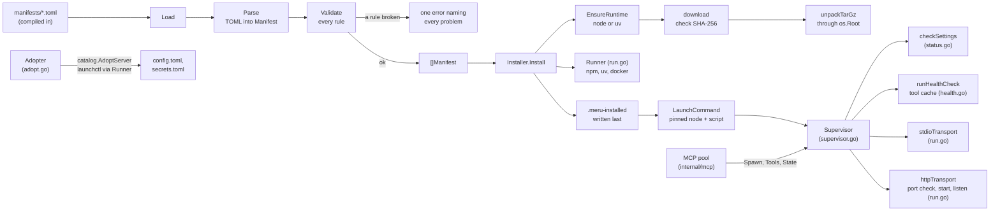
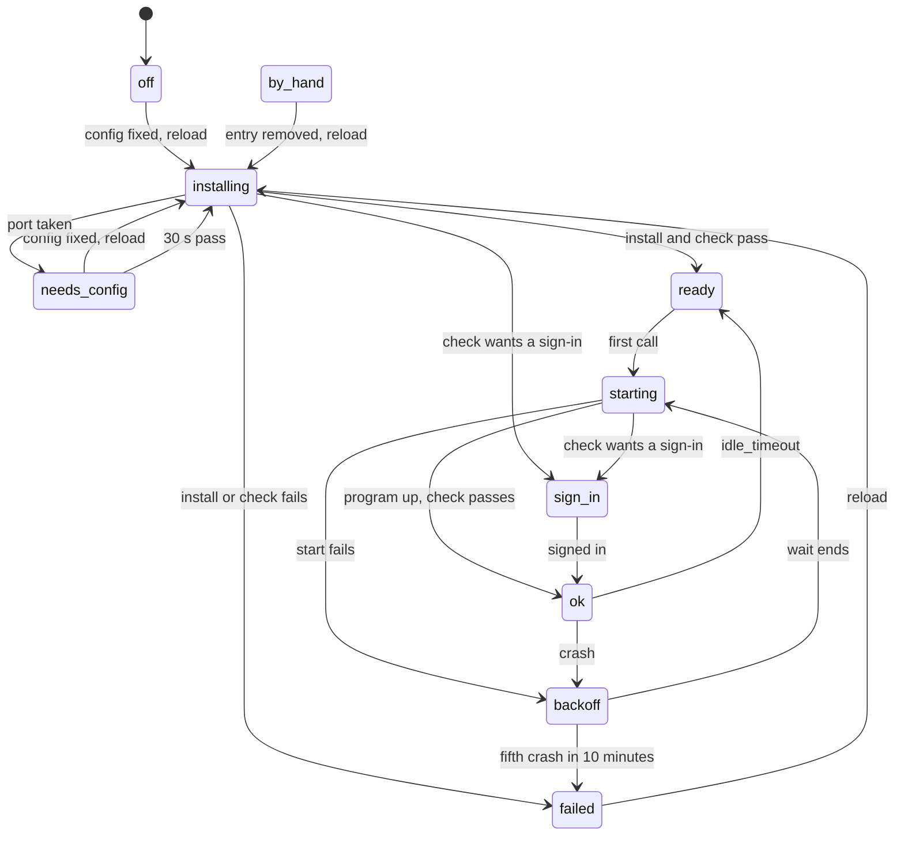

# connectors

**Code:** `internal/connectors/` (`doc.go`, `manifest.go`, `manifests/*.toml`,
`runtimes.go`, `download.go`, `install.go`, `launch.go`, `run.go`, `status.go`,
`health.go`, `supervisor.go`, `container.go`, `adopt.go`)
**Milestone:** v0.5 (issue #87, steps 1 to 5)
**Architecture:** [Connectors and the supervisor](../../ARCHITECTURE.md#connectors-and-the-supervisor),
[The runtime folder](../../ARCHITECTURE.md#the-runtime-folder),
[The supervisor](../../ARCHITECTURE.md#the-supervisor),
[Google](../../ARCHITECTURE.md#google),
[SearXNG and Ollama](../../ARCHITECTURE.md#searxng-and-ollama),
[Moving to connectors](../../ARCHITECTURE.md#moving-to-connectors)

## What it does

A connector is a program Meru will install, start and check for you: SearXNG
for web search, the Obsidian and Google MCP servers, and Ollama, which Meru
only reports on. Each one has a **manifest**, a TOML file in `manifests/` that
pins its version and says how to install it, how to start it, what to ask the
user and how to tell that it works.

The package has four parts so far. Step 1 reads and checks the manifests:
`Load` parses all four and refuses the set when one breaks a rule. Step 2
installs them: an `Installer` downloads the pinned Node and uv into
`~/.meru/runtime`, checks each archive's SHA-256 before it unpacks it, installs
a connector's package into `~/.meru/runtime/pkg/<id>-<version>/`, and says how
to start the installed program. Step 3 runs them: `merud` builds one
`Supervisor` per MCP connector (Obsidian over stdio, and since step 5 Google
over HTTP), which checks
the user's `[connectors.<id>]` table, installs and checks the connector, starts
it on the first tool call, stops it when idle, and restarts it after a crash.
The MCP pool asks the supervisor for a session through its `Spawn` method (see
[mcp](mcp.md)); `cmd/merud/connectors.go` joins the two (see
[merud](merud.md)). The clients never import the package; they ask `merud`
through the `connectors` op (see [rpc](rpc.md)). Step 4 adds a `Container`,
the supervisor for SearXNG: it checks `[web] searxng_url` every minute and, when
config turns it on and nothing answers, pulls the pinned image and runs Meru's
container. Ollama, the fourth manifest, needs no supervisor here: `merud` only
reports on it (`cmd/merud/ollama.go`, see [merud](merud.md)).

Step 5 adds Google, an `http` connector: the supervisor starts
`workspace-mcp` on port 8000, waits for it to listen, and talks Streamable
HTTP to it; when the health check's error carries a sign-in link, the
supervisor keeps the program running and shows the link until the user signs
in. Step 5 also adds `Adopter` (`adopt.go`), which moves a hand-added
`obsidian` or `google` entry over to its connector, and back, when the user
runs `meru mcp adopt`.

Still to come, in step 6: the ops and forms that let a client set a
connector's fields. Until then a user sets them in `config.toml`.

## The picture



## Walk through the code

### The manifests

`searxng.toml` is the shortest real one:

```toml
id = "searxng"
kind = "container"

[install]
type = "container"
image = "docker.io/searxng/searxng:2026.9.29-4e2c1ea7f@sha256:3284e890…"

[launch]
url = "http://127.0.0.1:8888"
port = 8080
volumes = ["{meru_dir}/searxng:/etc/searxng"]
```

The image ends in `@sha256:` and a digest, the hash of the image's contents.
A tag such as `2026.9.29-4e2c1ea7f` can be moved to a new image; a digest
can't. `obsidian.toml` pins the npm package `obsidian-mcp` at `2.0.1`, and
`google.toml` the Python package `workspace-mcp` at `1.30.0`. A comment at the
top of each file says where its pin came from and on what date. `ollama.toml`
installs nothing: `merud` only asks Ollama's `/api/version`.

`{pkg}`, `{meru_dir}` and `{field.vault_path}` are placeholders.
`LaunchCommand` fills them in: the install folder, `~/.meru`, and the value the
user gave for a field.

For an npm or pip connector, `launch.command` is the bare name of a program
the package installs, such as `command = "obsidian-mcp"` in `obsidian.toml`.
Meru finds the program in the install folder itself; the section on
`launch.go` below says why.

### manifest.go

The file starts with the types. `Manifest` holds the top-level keys, and one
struct each for `[install]`, `[launch]`, `[[field]]`, `[health]` and `[mcp]`:

```go
type Manifest struct {
    ID     string  `toml:"id"`
    Kind   string  `toml:"kind"`
    Install Install `toml:"install"`
    Fields []Field `toml:"field"` // each [[field]] table
    ...
}
```

The text in backticks is a **struct tag**: it tells the TOML parser which key
fills the field (see [go-basics/struct-tags.md](go-basics/struct-tags.md)).
`[[field]]` in TOML is an array of tables, so it decodes into a slice.

The manifests reach the binary through `embed`:

```go
//go:embed manifests/*.toml
var manifestFiles embed.FS
```

`embed.FS` is a read-only file system inside the binary. `Load` hands it to
`loadFS`, which takes any `fs.FS`, so a test can pass a made-up one from
`testing/fstest` (see [go-basics/embed.md](go-basics/embed.md)).

**Parse** decodes one file. A binary download needs a URL and a checksum per
platform, written `url_darwin_arm64` and `sha256_darwin_arm64`. A struct tag
can't name a key that changes with the platform, so `Parse` reads `[install]` a
second time into a `map[string]any` and picks those keys out into
`Install.Binaries`. Any other key the types don't know, most often a typo,
fails the parse, the way `config.Load` refuses one.

**Validate** checks one manifest and joins every problem into one error, so a
manifest author fixes them all in one pass. It uses the closure pattern
`config` uses (`add := func(format string, args ...any) {...}`) and one helper
per table: `checkInstall`, `checkFields`, `checkLaunch`, `checkHealth` and
`checkMCP`. The rules:

| Rule | Why |
| --- | --- |
| a version is one exact release: no `latest`, `""`, `^`, `~`, `>`, `<`, `*`, `x`, bare major or tag | a pin that can match two releases isn't a pin |
| a container image ends in `@sha256:<64 hex>`, and isn't tagged `latest` | a tag can move; a digest can't |
| a binary has an https URL and a SHA-256 for each platform it names | the supervisor checks the download before it unpacks it |
| kind, install type, field type and auth are known, and the install fits the kind | a typo would otherwise do nothing |
| `id`, `name` and each field's `id` are set and unique | IDs end up in config keys and secret names |
| a secret has no default | a default secret would sit in the binary, the same for everyone |
| a `pattern` compiles | a bad pattern would refuse every value |
| an http or container `url` is loopback | `merud` connects only to loopback (`internal/loopback`) |
| a placeholder names a real field; a secret never goes in `args` | any user can read another's command line in the process list |
| no wildcard in a tool list; every `confirm` tool is in `allow` | tools stay deny-by-default |
| an npm or pip `command` is a bare program name; a binary `command` sits under `{pkg}/` (`checkCommand`) | `LaunchCommand` finds the program itself, so a path such as `node_modules/.bin/obsidian-mcp` can't sneak `PATH` back in |

Each install type has its own version pattern. npm takes a full semantic
version such as `2.0.1`; pip takes a Python release number such as `1.30.0` or
`1.0rc1`; a binary takes `v0.12.4` or `0.12.4`. Checking `2.0.x` against a
single loose pattern would let it through, so each pattern spells out what one
release looks like.

`checkImage` reads the tag with care. In `localhost:5000/search@sha256:…` the
`:5000` is a port, not a tag, so it looks for `:` only after the last `/`.

### run.go: the one place that starts a program

Every install step builds a `Cmd`, a plain struct with the program's absolute
path, its arguments, its whole environment and the folder to start in, and
hands it to a `Runner`:

```go
type Runner func(ctx context.Context, c Cmd, line func(string)) (string, error)
```

`Runner` is a **function type**: any function with that signature is a
`Runner`. `ExecRunner` returns the real one, which calls `exec.CommandContext`
with the path and arguments as separate strings, so no shell reads them (see
[go-basics/os-exec.md](go-basics/os-exec.md)). It refuses a path that isn't
absolute with `ErrNotAbsolute`. It sets `cmd.Env` to exactly the `Cmd`'s list;
a nil `Env` would hand the child all of `merud`'s environment, which may hold
another tool's API key. A goroutine reads the output line by line, hands each
line to `line` for progress, and keeps the last 40 for the error message. The
tests pass a fake `Runner` that records each `Cmd` and writes the files npm
would, so no test runs npm, uv or docker.

A running connector starts here too. `stdioTransport` turns a `Cmd` into the
MCP transport the supervisor connects over: the child's stdin and stdout carry
MCP, and its stderr goes to a writer the supervisor reads.

```go
cmd := exec.CommandContext(procCtx, c.Path, c.Args...)
cmd.Env = append([]string{}, c.Env...)
cmd.Stderr = stderr
cmd.WaitDelay = childStopWait
return &mcp.CommandTransport{Command: cmd, TerminateDuration: childStopWait}, nil
```

It refuses a relative path, as `ExecRunner` does. `procCtx` bounds the
child's life: when the supervisor cancels it, Go kills the program. That is
the backstop; the SDK first closes the child's stdin, waits `childStopWait`
(2 seconds), sends a signal, and waits as long again. The pool waits the same
for a server added by hand.

An http connector starts here as well. `httpTransport` first looks at the
connector's port with `Listening`, a TCP dial with a short timeout, and waits
up to 3 seconds for it to come free, since Meru's own last program may still
be exiting. If another program still holds it, it returns `ErrPortBusy` and
starts nothing: that program may be the user's own server, and Meru never
stops it. Otherwise it starts the program with its stdout and stderr going to
the supervisor's writer, and waits until the program listens or exits:

```go
exited := make(chan struct{})
go func() {
	_ = cmd.Wait()
	close(exited)
}()
if err := waitListening(ctx, addr, exited); err != nil { ... }
return &mcp.StreamableClientTransport{Endpoint: endpoint, HTTPClient: loopbackClient(), DisableStandaloneSSE: true}, exited, nil
```

The goroutine reaps the program and **closes** `exited` when it ends; a closed
channel is ready for every reader, so anyone can wait on it (see
[go-basics/goroutines.md](go-basics/goroutines.md)). A Streamable HTTP session
knows nothing of the program behind it, so the supervisor watches `exited` to
learn of a crash. `loopbackClient` refuses a redirect off this machine, as the
pool's client for a hand-added server does.

A policy test, `TestConnectorsRunOnlyThroughRun`, fails the build if another
file in the package imports `os/exec`. Adopt runs `launchctl` through the same
`Runner`, by its absolute path, `/bin/launchctl`.

### runtimes.go and download.go: Node and uv

`Runtimes()` returns the two pins. Each `Runtime` has a version, one download
per platform with its SHA-256, and the path of its main program once unpacked:

```go
RuntimeNode: {
    Name: RuntimeNode, Version: "24.21.0", Program: "bin/node",
    Downloads: map[string]Binary{
        "darwin_arm64": {
            URL:    "https://nodejs.org/dist/v24.21.0/node-v24.21.0-darwin-arm64.tar.gz",
            SHA256: "bed7eea5…6057",
        },
        ...
```

It builds a fresh map on each call, so no caller can change a pin for the rest
of the program; the package keeps no mutable state of its own. A comment above
each pin names the page its hashes came from and the date.

`EnsureRuntime` makes one runtime ready, in this order:

1. If `node-24.21.0/.meru-installed` exists and names the same version, it
   returns at once.
2. It makes a temporary folder under `~/.meru/runtime`, on the same disk as the
   final one.
3. `download` fetches the archive into it. `io.MultiWriter` sends each byte to
   the file and to the SHA-256 hash at once, and `io.LimitReader` caps the
   download at 512 MiB. The file keeps a temporary name until the hash matches;
   on a mismatch `download` deletes it and the error wraps `ErrChecksum`.
4. `unpackTarGz` unpacks it, dropping the archive's one top folder.
5. It checks that `bin/node` (or `uv`) is there, writes the marker, and renames
   the whole folder into place. A rename on one disk happens in one step, so
   the final folder is either missing or complete.
6. It deletes the folders of older Node versions.

`unpackTarGz` refuses an entry whose name is absolute or has a `..` part, a
symbolic link whose target is absolute or climbs out, a hard link, a device, or
anything but a folder, a file or a link, with `ErrUnsafeArchive`. It also writes
through an **`os.Root`**, a handle on one folder whose methods refuse any path
that leaves it, even through a link (see [go-basics/os-root.md](go-basics/os-root.md)).
The name checks give a clear error; `os.Root` catches anything they miss.
Node's archive holds relative links such as `bin/npm ->
../lib/node_modules/npm/bin/npm-cli.js`, which stay inside and pass.

### install.go: one folder per connector and version

`Installer` holds what an install needs: the Meru home, the user's home (for
docker only), the platform, the pins, an HTTP client, a `Runner` and the places
docker may live. Its fields are exported so a test can swap each one for a
fake; `merud` uses `NewInstaller`.

`Install` runs these steps:

1. Validate the manifest, and return at once if `Installed` finds the marker.
2. `EnsureRuntime` for npm (Node) or pip (uv).
3. Delete `pkg/<id>-<version>/` if it is there, since it has no marker, then
   make it again.
4. Run the install for the type.
5. Write the marker last, then delete the connector's older folders.

A failure at step 4 deletes the folder, so nothing half-made stays behind. The
install works in the final folder, not a temporary one, because a Python
environment records its own path and can't move.

The marker is JSON:

```json
{
  "id": "obsidian",
  "version": "2.0.1",
  "runtime": "node-24.21.0"
}
```

`Installed` compares all three with today's pins, so a new Node pin makes the
npm package install again.

**npm.** `npmCmd` runs npm's own script with the pinned Node, both by absolute
path:

```text
<node>/bin/node <node>/lib/node_modules/npm/bin/npm-cli.js install
    --prefix <dir> obsidian-mcp@2.0.1
    --no-audit --no-fund --no-update-notifier --ignore-scripts
```

The environment holds a `PATH` that starts with the pinned Node's `bin`, a
`HOME` of `~/.meru/runtime/home`, `npm_config_cache` under `cache/npm`, and
`npm_config_userconfig` pointing at an empty file. The first real run found
that pointing `npm_config_globalconfig` at the same file makes npm stop with
"double-loading config", so only the user file is set; the global one already
lives inside the pinned Node's folder.

**pip.** `pipCmds` builds two commands with the pinned uv: `uv venv <dir>/.venv
--python 3.12`, then `uv pip install --python <dir>/.venv/bin/python
workspace-mcp==1.30.0`. `uvEnv` moves each folder uv would use in your home
under `~/.meru/runtime` (`UV_CACHE_DIR`, `UV_PYTHON_INSTALL_DIR`,
`UV_PYTHON_BIN_DIR`, `UV_PYTHON_CACHE_DIR`, `UV_TOOL_DIR`, `UV_TOOL_BIN_DIR`),
sets `UV_PYTHON_PREFERENCE=only-managed` so uv uses a Python it downloaded
there, and `UV_NO_CONFIG=1` so your `uv.toml` plays no part.

**binary.** `installBinary` downloads this platform's file through the same
`download`, so the SHA-256 check applies, and marks it runnable by its owner.

**container.** `findDocker` checks a fixed list of absolute paths, the same
idea as the Mac installer's allowlist. None found is `ErrDockerMissing`. A
failing `docker info` is `ErrDockerNotRunning`. Then `docker pull
<image>@sha256:<digest>` runs. The `Container` supervisor checks for docker
first and turns these errors into "Web search needs Docker, which isn't
installed." and "Web search can't start: Docker isn't running."

### launch.go: how to start what's installed

`LaunchCommand(m, installed, fields)` returns the program, its arguments and
the variables to add to its environment. It starts nothing.

For npm it reads `node_modules/obsidian-mcp/package.json`, finds `"bin":
{"obsidian-mcp": "dist/main.js"}`, and returns:

```text
program  ~/.meru/runtime/node-24.21.0/bin/node
args     ~/.meru/runtime/pkg/obsidian-2.0.1/node_modules/obsidian-mcp/dist/main.js
         serve --vault notes=/Users/you/Notes/vault
```

`dist/main.js` begins with `#!/usr/bin/env node`. Run as a program, that line
asks `PATH` for `node`: the same lookup that makes today's hand-added `npx`
entry fail under launchd, whose short `PATH` holds no Node. Handing the script to the pinned `node` by path skips the line,
so no `PATH` has to be right. The returned `PATH` still starts with the pinned
Node's `bin`, so a `node` the server starts in turn is the same one.

`bin` in a `package.json` is either one path or a map from names to paths.
`json.RawMessage` keeps it undecoded, and two `json.Unmarshal` calls try each
shape. `npmScript` refuses a script path that would leave the package's folder.

For pip it returns `<dir>/.venv/bin/<name>`, whose first line uv wrote as the
environment's own Python by absolute path. For a binary it returns the filled-in
path under `{pkg}`. `fillPlaceholders` fills `{pkg}`, `{meru_dir}` and each
`{field.<id>}`; a field with no value and no default fails with
`ErrMissingField`.

### status.go: states, sentences and the settings check

A user sees six states, as string constants: `StateOK`, `StateOff`,
`StateNeedsConfig`, `StateStarting`, `StateFailed` and `StateByHand`. `Status`
is one connector as the `connectors` op reports it: its ID, name and kind, its
state and a one-line sentence, each field with its value, and `Fix`, the IDs of
the fields to ask again. A secret's value never goes in `FieldStatus`; `Saved`
only says whether `secrets.toml` holds `connector_<id>_<field>` (`SecretName`).

`checkSettings` holds the user's table up against the manifest's fields. It
never fails; a problem becomes the `needs_config` sentence. One rule per
field type:

| Field | Problem | Sentence |
| --- | --- | --- |
| any required field | empty, with no default | Obsidian needs your vault folder. |
| `folder` | the folder doesn't exist | Obsidian can't find the vault folder ~/Notes. |
| `email` | no `@` | Obsidian needs an email address as your … |
| `choice` | not one of the choices | Obsidian's … must be one of: a, b. |
| any field with a `pattern` | the value doesn't match | Obsidian's vault name doesn't fit the form it needs (…). |
| a key the manifest lacks | most often a typo | Obsidian has no setting called vault; remove it from [connectors.obsidian]. |

The first problem becomes the sentence, and each field at fault goes in the fix
list. A folder written `~/Notes` turns into a full path (`expandHome`), but the
sentence names it as the user wrote it, or as the default reads. `lowerFirst`
lower-cases a label inside a sentence ("vault folder") but leaves one that
starts with an acronym, such as "API token". The check sorts the table's keys
before it looks for unknown ones: Go visits a map's keys in a random order,
and the same config should always give the same sentence.

`fillMadeUp` fills in one value the user may leave empty: Obsidian's
`vault_name`. `vaultName` makes it from the folder's name, lower-cased, with
any character outside `a-z`, `0-9`, `-` and `_` turned into `-`, and leading
digits, dashes and underscores dropped, so `My Notes` becomes `my-notes`.

`settings.same` tells the supervisor whether a reload changed anything that
would start the program another way.

An `oauth` field, Google's `sign_in`, has no value in config, so the check
skips it: the server runs the sign-in. An MCP connector's table may also hold
`allow`, `confirm` and `always_confirm`, lists that take the place of the
manifest's; Adopt writes them. `checkTools` puts them through the manifest's
own rule, `checkMCP`: no wildcard, and every `confirm` tool also in `allow`.
The supervisor's `Lists` hands them to the pool. `Status` gained `Link`, the
sign-in link while Google waits for the user.

### health.go: the check and the tool cache

`runHealthCheck` calls the manifest's `[health] tool` and checks its answer
against `expect`:

- `nonempty`: the answer holds some text;
- `contains:<text>`: the text holds `<text>`;
- `json_key:<key>`: the answer, read as a JSON object, has that key;
- empty: any answer that isn't an error.

The error it returns fits a status line, such as "the check
obsidian_list_vaults gave an empty answer".

After a good check the supervisor saves the tool list to
`~/.meru/runtime/state/<id>.json`:

```json
{ "id": "obsidian", "version": "2.0.1", "tools": [ ... ] }
```

`writeToolCache` writes a temporary file and renames it over the old one, so a
reader never sees half a file. `readToolCache` counts a file from another
connector or version as missing, since a new version may offer other tools.
This cache lets a fresh `merud` offer a ready connector's tools before the
program runs.

For an OAuth connector, a failed check may mean "sign in first". With `oauth`
true, `runHealthCheck` looks in the error's text for a sign-in link
(`signInLink`) and returns a `*SignInError` holding it:

```go
type SignInError struct {
	URL string
}

func (e *SignInError) Error() string {
	return "the server needs you to sign in"
}
```

A struct with an `Error() string` method is an `error`, so the caller finds it
with `errors.As`, which walks an error's chain and fills in a pointer of the
type asked for (see [go-basics/errors.md](go-basics/errors.md)). `Error`
leaves the link out, since an error text may reach a log. `signInLink` takes
the link on workspace-mcp's "Authorization URL:" line, or any https link whose
query names both `client_id` and `redirect_uri`; a help page in an error, such
as one that says an API is off, doesn't count. The regular expressions write
`//` as `/{2}`, so the privacy policy test, which looks for links to other
machines in the code, doesn't take them for one.

### supervisor.go: one state machine per connector

A `Supervisor` runs one MCP connector, stdio or http. Inside, it moves through
ten **phases**, which fold into the six states a user sees:



`installing`, `starting` and `backoff` all show as `starting`; `ready` and
`ok` both show as `ok`, since the model can use the tools either way;
`sign_in` shows as `needs_config`. The
phases are numbers:

```go
type phase int

const (
    phaseOff phase = iota // 0
    phaseByHand           // 1
    ...
)
```

`iota` is Go's counter inside a `const` block: it starts at 0 and adds one per
line, so each phase gets its own number without anyone typing them.
`phase.String` names each one for the log, and `phase.state` folds it into a
user's state.

**Configure.** `merud` calls `Configure(table, secrets, byHand)` at startup
and on each reload. When nothing changed and the connector hasn't failed, a
running program keeps running. Otherwise `resetLocked` stops what runs,
forgets the crashes, and picks the phase config asks for: `by_hand`, `off`,
`needs_config`, `ready` when the install and its tool cache are on disk, or
`installing`, which starts a worker. A reload is also how a user retries a
failed connector.

**Install and check.** The `installAndCheck` worker installs the pinned
version if it isn't there. Then `open` starts the program once, runs the MCP
handshake, lists the tools and runs the health check, all within
`startTimeout` (30 seconds). The worker saves the tool list, stops the program
and moves to `ready`. A failure sets `failed` with "couldn't install: …" or
"failed its check: …".

**Spawn.** The MCP pool calls `Spawn(ctx, limit)` for each tool call. It loops:

- `ok`: count one more call in use, stop the idle timer, hand back the session
  and a `done` function;
- `ready`: move to `starting`, start a worker that runs `start`, and wait;
- `starting` or `installing`: wait;
- `backoff`: fail at once if this call already waited through a start that
  failed; otherwise wait for the restart;
- anything else: fail at once with the sentence, such as "Obsidian needs your
  vault folder."

The wait uses a channel, `changed`, and `select`:

```go
changed := s.changed
s.mu.Unlock()
select {
case <-changed:          // the phase moved; look again
case <-wait.Done():      // limit passed, or ctx ended
    return nil, nil, fmt.Errorf("%s didn't start within %s: %s", ...)
}
```

A **channel** passes values between goroutines, and a read from a closed
channel never blocks, for every reader at once. So `setPhaseLocked` closes
`changed` and puts a fresh one in its place at each change of phase, and every
call waiting in `Spawn` wakes and looks again. `select` waits on several
channels and runs the case whose channel is ready first (see
[go-basics/channels.md](go-basics/channels.md) and
[go-basics/select.md](go-basics/select.md)).

**done and the idle timer.** The pool calls `done` when the call ends. When the
last call ends, `armIdleLocked` sets a timer for the manifest's
`idle_timeout` (Obsidian: 10 minutes). If no call comes, `idleStop` stops the
program and moves back to `ready`. The timer starts only when the count of
calls in use reaches zero, so a running call holds the program up. `done`
wraps its work in `sync.Once`, whose `Do` runs its function the first time
only, so a second call of `done` can't count a call twice.

**Crashes and backoff.** `watch` waits for the running session to end. If it
is still the current session, the program crashed: `crashLocked` keeps the
crashes of the last ten minutes, adds this one, and either waits before the
next start or gives up.

```go
delay := min(firstBackoff<<(len(s.crashes)-1), maxBackoff)
```

`firstBackoff` is 1 second, and `<<` shifts left, which doubles it once per
earlier crash: 1, 2, 4, then 8 seconds, capped at 60. The fifth crash in the
window sets `failed` with "keeps stopping:" and the last line the program
wrote to stderr, which `tailLog` keeps. A start that fails counts as a crash
too. The call that was running when the program died fails with its error, and
nothing sends it again: the tool may have run before the crash.

**gen: dropping stale work.** Workers and timers run late. A reload may stop
the program while a start is still on its way, or an idle timer may fire
as a call comes in. The supervisor keeps a counter, `gen`, and adds one at each
stop, crash and new config. Each worker, timer and `done` remembers the `gen`
it began under. When it runs, it takes the lock and checks:

```go
if gen != s.gen || s.closed {
    return // the machine moved on; leave the state alone
}
```

Stale work then changes nothing, and no code has to find and cancel it.

**Clock.** The waits go through a `Clock` interface with `Now` and
`AfterFunc`. `merud` uses `realClock`, which calls `time.Now` and
`time.AfterFunc`. Tests use a fake clock they move by hand, so a test of the
ten-minute crash window runs in a moment.

**Function fields for the machine.** `install`, `installed`, `launch` and
`dial` are fields that hold functions. `New` fills them from an `Installer`,
`childCmd` and `stdioTransport`; a test's fake connector puts in its own, so
no test installs or starts a real program. `newSupervisor` sets up the rest,
for both.

**Goroutine ownership.** The supervisor owns every goroutine it starts: one
worker at a time for an install or a start (`workLocked`), and one watcher
per running program. `goLocked` counts each one on a `sync.WaitGroup`.
`Close` stops the program, cancels the worker, and waits for the count to
reach zero. After `Close`, `Spawn` fails with "stopped with merud".

**The child's environment.** `childCmd` builds a short list: the `PATH` and
variables `LaunchCommand` gives, the user's real `HOME`, where a connector
keeps its own settings, and `TMPDIR` when `merud` has one. `tailLog` takes the
child's stderr: it logs each line at debug level, keeps the last one that
isn't blank, cuts a line at 300 bytes, and stops logging after 64 KiB, so a
chatty program can't fill the disk. `Write` always reports every byte written,
since an error would stop the pipe draining and block the program.

**Status for the clients.** `Tools` returns the tool list while the phase is
`ok` or `ready`, and nil otherwise, so a connector that is down offers the
model nothing. `State` returns the state and its sentence; `Status` adds the
fields and the fix list for the `connectors` op.

`*Supervisor` has `Spawn`, `Tools` and `State` with the signatures that
`internal/mcp`'s `Spawner` interface lists, so a supervisor is a `Spawner`. Go
needs no `implements` line: any type with the right methods satisfies an
interface. That lets `mcp` define the interface it uses without importing
`connectors`.

**An http connector.** `New` fills `dial` with `httpTransport` for Google and
with `stdioTransport` for Obsidian; the rest of the machine is the same. `dial`
returns the transport and, for http, the `exited` channel. `open` makes `stop`
wait on it, so the port is free before the next start, and starts one more
goroutine, counted on the `WaitGroup`, that closes the session when the
program exits; `watch` then sees the end of the session as a crash, as for a
stdio program. Adding to the `WaitGroup` there is safe while `Close` waits,
because `open` runs inside a worker that the group already counts.

**Port taken.** When `dial` fails with `ErrPortBusy`, `blockLocked` moves to
`needs_config` with a reason, "Google can't start: another program listens on
127.0.0.1:8000. …", which `sentenceLocked` shows in place of the settings
problem, and sets `retryTimer` for 30 seconds. `unblock` then installs and
checks again, which starts with the port. A reload tries at once:
`Configure` doesn't keep a connector that waits for its port.

**Sign-in.** When `open`'s health check returns a `*SignInError`, `open` hands
back the live session with the error instead of stopping the program: the
link calls back to that program. `signInLocked` keeps the session, stores the
link, moves to `sign_in`, starts the watcher, and sets `signInTimer`.
Every 15 seconds `checkSignIn` starts a worker, `recheck`, that runs the
health check again on the same session. A pass moves to `ok`, saves the tool
list and starts the idle timer; another `*SignInError` keeps the newer link
and sets the timer again; any other error sets `failed` and stops the program.
`Spawn` and `Tools` treat `sign_in` as not ready, so the model sees none of
Google's tools until the user signs in. `hideQueries` cuts the query off every
link in a line before `tailLog` logs it or keeps it, so the sign-in link's
one-time state never lands in `merud.log`.

### adopt.go: moving a hand-added entry over

`Adopter` holds what Adopt touches: the paths of `config.toml` and
`secrets.toml`, the home folder, the `Runner` for `launchctl`, the user's ID,
the operating system and a clock for the marker's date. `merud` fills it in
(`cmd/merud/connectors.go`); tests fill it with a temporary home and a fake
`launchctl`.

Each direction has two halves, so the client can show the changes before any
happen:

- `PlanAdopt` reads config and works out an `AdoptPlan`: the table to write
  (`catalog.ConnectorTable`), the secrets to save, the launchd job to stop,
  and `Changes`, one line per step for the user. It changes nothing.
  `obsidianFields` reads the vault from `--vault name=path` and refuses
  `mcp-obsidian`, no vault or two, and `env`; `googleFields` checks the URL,
  reads `start.sh` with `readStartScript` (a regular expression per `export`
  line; nothing runs), and lets values from the command line take the place
  of what it read. `checkFieldValues` runs the manifest's rules on the values,
  so Adopt never writes a table the supervisor would refuse. `differentLists`
  keeps each of the entry's tool lists that differs from the manifest's.
- `Adopt` carries the plan out in order: `stopJob` (`launchctl bootout`,
  rename the plist to `.disabled`, wait for the port), `secrets.Set` for each
  secret, `catalog.AdoptServer` for the one config edit, then `reload`. When
  the edit fails, the function `stopJob` returned starts the job again.
- `PlanUnadopt` and `Unadopt` do the reverse: `catalog.UnadoptServer`, the
  reload, which stops the connector's program, then `startJob` (rename back,
  `launchctl bootstrap`) once the port is free.

Google's address comes from the manifest's URL, `hostPort(m.Launch.URL)`, not
from a constant, so the tests can move Google to a free port and never touch
port 8000.

A plan's `Nothing` says there is nothing to do: the entry is adopted, or
restored, already. So both commands are safe to run twice.

### container.go: SearXNG

`ContainerMode(m, table, url, toolListed)` picks what `merud` does for a
container connector, from config:

| Config | Mode |
| --- | --- |
| no `url` | `ModeOff` |
| `enabled = false` | `ModeOff` |
| `enabled = true`, and `url` is the manifest's `launch.url` | `ModeRun` |
| `enabled = true`, another `url` | `ModeWatch` |
| no `enabled` key, `default_on` and the tool listed | `ModeWatch` |
| anything else | `ModeOff` |

`ModeWatch` is how a config from before connectors keeps working: `merud`
checks the URL and reports, and never runs docker. `Mode` is an `int` with
constants counted by `iota`.

A `Container` holds the manifest, the `Installer` (its `Run` and docker paths),
a `check` function and a `prepare` function. `merud` passes
`catalog.CheckSearXNG`, wrapped so a refused connection wraps
`ErrNothingListens`, and a `prepare` that writes SearXNG's `settings.yml`. The
package imports neither `catalog` nor anything SearXNG-specific for the check:
the two functions come in from the caller.

`Configure(table, url, toolListed)` stops the old loop, waits for it, and
starts a new one in a goroutine, unless nothing changed. The loop runs `pass`,
then sleeps the time `pass` returned on the `Clock`, until its context ends.
Leaving `ModeRun` first stops Meru's own container with `docker stop`.

`pass` checks the URL once:

1. It passes: `ok`. In run mode, `isOurs` asks `docker inspect` whether a
   running container named `meru-searxng` carries the label
   `meru.connector=searxng`; the sentence says "running in the container
   meru-searxng" or "uses the SearXNG already running at …".
2. Watch mode: `needs_config`, with the reason.
3. Meru's container was `ok` and stopped answering: `crash`, which waits 1, 2,
   4 and 8 seconds and sets `failed` at the fifth crash in ten minutes, the
   same rule and constants as the stdio supervisor.
4. `failed`: nothing more; the next minute's check can still find it healthy.
5. Something answers, badly, and it isn't Meru's container: `needs_config`.
6. No docker, or its engine down: `needs_config`.
7. A container of Meru's name without Meru's label: `needs_config`, and
   nothing is pulled or run.
8. Otherwise: `Install` (the `docker pull`), then `start`, then `waitHealthy`,
   which checks every 2 seconds for up to 90.

`start` reads `inspect` and picks: `runNew` when no container exists, `docker
rm --force` then `runNew` when the image is an older pin, `docker restart` when
it runs, and `docker start` when it is stopped. `runArgs` builds `docker run`'s
arguments from the manifest: the name, the label, `--restart no`, `--publish`
from the URL's host and port and `launch.port`, each volume with `{meru_dir}`
filled in, and the environment in sorted order.

`sleep` shows how to wait on a clock that tests replace: the timer's function
closes a channel, and a `select` waits for that channel or the context.

```go
fired := make(chan struct{})
t := c.clock.AfterFunc(d, func() { close(fired) })
select {
case <-fired:
	return true
case <-ctx.Done():
	t.Stop()
	return false
}
```

`container_test.go` drives a `Container` with a fake docker, a `Runner` that
keeps one container's state and records each command, and a fake check.
`TestContainerStartsMeruContainer` checks the pull, the settings, and every
`docker run` argument. `TestContainerStartFailsBacksOff` moves the fake clock
through the 1, 2, 4 and 8 second waits to `failed`.
`TestContainerRestartsAfterItStops` stops Meru's container at a minute's check.
`TestContainerDocker` covers Docker missing and stopped. `TestContainerExternal`
checks that a server Meru doesn't own, working or not, in run or watch mode,
and a foreign `meru-searxng` never see a `pull`, `run`, `start`, `restart`,
`stop` or `rm`. `TestContainerOffStopsOurs` checks that turning the connector
off stops Meru's container and nothing else.

## Go ideas used here

- **embed** — `//go:embed` copies the manifests into the binary. More in
  [go-basics/embed.md](go-basics/embed.md).
- **Struct tags** — map TOML keys to fields. More in
  [go-basics/struct-tags.md](go-basics/struct-tags.md).
- **Type assertions** — `v.(string)` asks whether the value in an `any` is a
  string. More in [go-basics/type-switches.md](go-basics/type-switches.md).
- **Errors** — `errors.Join` turns a list of problems into one error, and
  returns `nil` for an empty list. `ErrChecksum`, `ErrUnsafeArchive`,
  `ErrDockerMissing` and the rest are sentinel errors a caller tests with
  `errors.Is`. More in [go-basics/errors.md](go-basics/errors.md).
- **os/exec** — runs npm, uv and docker with no shell, in `run.go` only. More in
  [go-basics/os-exec.md](go-basics/os-exec.md).
- **os.Root** — a folder handle whose methods refuse paths that leave it, used
  to unpack archives. More in [go-basics/os-root.md](go-basics/os-root.md).
- **Function types** — `Runner` is a type for any function with its signature,
  so a test can pass a fake; the Mac installer's `Runner` works the same way (see [installer](installer.md)).
- **Goroutines** — `runLines` reads output while the program runs, and waits
  for the reader before it returns. The supervisor starts a worker and a
  watcher, and counts each on a `sync.WaitGroup` so `Close` can wait for them.
  More in [go-basics/goroutines.md](go-basics/goroutines.md).
- **Closing a channel to wake waiters** — a read from a closed channel returns
  at once, for every reader, so closing `changed` wakes every call waiting in
  `Spawn`. More in [go-basics/channels.md](go-basics/channels.md).
- **select** — waits on several channels and runs the first that is ready:
  a change of phase, or the end of the wait. More in
  [go-basics/select.md](go-basics/select.md).
- **sync.Mutex** — `mu` guards the supervisor's fields. A method whose name
  ends in `Locked` expects the caller to hold it.
- **sync.Once** — `once.Do(f)` runs `f` the first time only; `done` uses it.
- **iota** — counts up inside a `const` block, numbering the phases.
- **Interfaces, satisfied without a word** — `*Supervisor` is an
  `mcp.Spawner` because it has the three methods; `Clock` lets a test swap
  the time source. More in [go-basics/interfaces.md](go-basics/interfaces.md).
- **Function fields** — `install`, `launch` and `dial` hold functions, so a
  test swaps in fakes without an interface for each.
- **errors.As** — finds a `*SignInError` in an error's chain and hands back the
  link it holds. More in [go-basics/errors.md](go-basics/errors.md).

## Try it

```sh
go test ./internal/connectors/...
go test -run 'TestManifestsPinned|TestNoUnpinnedVersions|TestConnectorsRunOnlyThroughRun' ./internal/policy/
# Downloads Node and obsidian-mcp for real, into a temporary folder:
go test -tags integration -run TestIntegrationObsidian ./internal/connectors/
# Downloads uv and workspace-mcp 1.30.0, runs it on a free port, and checks
# that its health check asks for a sign-in:
go test -tags integration -run TestIntegrationGoogle ./internal/connectors/
```

`TestValidate` breaks one rule per case, starting from a manifest that passes,
and checks that the error names it. `TestLoadRealManifests` loads the four real
files. The policy tests load them too, and scan the repo for unpinned versions
(see [testing](testing.md)).

The install tests need no network. They build small `.tar.gz` archives in
memory, serve them from `httptest.NewTLSServer` on loopback, and pin a made-up
platform, `test_os`, at them:

- `TestDownload` and `TestEnsureRuntimeRefuses` check that a wrong SHA-256
  leaves no file and no runtime folder;
- `TestUnpackTarGz` tries each unsafe entry and checks nothing lands outside;
- `TestEnsureRuntimeReplacesPartial` and `TestInstallReinstall` leave a folder
  with no marker and check that Install replaces it, and that a new version removes the
  old one;
- `TestInstallNPM` and `TestInstallPip` check the exact argument list and that
  every cache and settings folder sits inside `~/.meru/runtime`;
- `TestInstallContainer` checks "docker missing" and "docker not running"
  apart;
- `TestLaunchCommandRealObsidian` runs the real Obsidian manifest through a fake
  install;
- `TestExecRunner` runs the test binary itself as the child, and checks the
  child sees only the variables its `Cmd` lists.

`TestIntegrationObsidian`, behind the `integration` build tag, downloads Node
24.21.0 and `obsidian-mcp` 2.0.1 into a temporary Meru home and runs the
server's `--help` with the pinned Node. CI doesn't run it.

`health_test.go` covers the pieces around the supervisor: `TestRunHealthCheck`
tries each kind of `expect` on good and bad answers, `TestToolCache` checks
that a saved list comes back only for the same connector and version,
`TestSecretField` checks that a secret comes from `secrets.toml`, never from
config, and that only its saved flag shows, and `TestTailLog` checks the last
line, the cut of a long line, and `wrap`.

The supervisor tests (`supervisor_test.go`) start no program and wait out no
real backoff. They use two fakes:

- `fakeClock`, a `Clock` a test moves with `Advance`. Its timers fire inside
  `Advance`, in the order they fall due.
- `fakeConnector`, which fills the supervisor's function fields. Each start
  runs an in-memory MCP server offering Obsidian's three tools, behind a
  `closableTransport`: the server's end of the pipe, which the test cuts to
  play a crash. A dying process closes its stdout the same way, so a call in
  flight gets no answer.

The tests walk each path: the state and sentence for each kind of config
(`TestConfigureStates`); `needs_config`, then an install, then `ready`, and a
second supervisor that is `ready` at once from the tool cache
(`TestNeedsConfigThenInstallThenReady`); a failed install and its retry on
reload; a lazy start and an idle stop; a crash that waits 1 second, then 2;
five crashes that fail, while crashes older than ten minutes drop out; failed
starts that count; a call in flight during a crash that fails and never
reaches the server twice; a reload that keeps a running program, and one with
`byHand` that stops it; `Close`; and `TestVaultName`.

`http_test.go` runs the supervisor with Google's manifest over a fake
`workspace-mcp` served by `httptest` over Streamable HTTP, which answers
`list_calendars` with a sign-in link until the test says the user signed in.
`TestGoogleSignIn` walks the wait, a second check, and the sign-in, and checks
that the log never holds the link's query; `TestGoogleCrashWhileSignIn`,
`TestGoogleSignedInAlready` and `TestGooglePortBusy` cover a crash while
waiting, a saved sign-in, and a taken port. `TestHTTPTransportPortBusy` runs
the real `httpTransport` against a port a test listener holds.
`TestSignInLink`, `TestHideQueries` and `TestToolListOverrides` cover the
pieces.

`TestIntegrationGoogle`, behind the `integration` tag, is the evidence for
Google's health tool: it installs the real `workspace-mcp` 1.30.0 into a
temporary Meru home, starts it on a free port with an empty home folder and a
made-up OAuth client, checks that it offers `list_calendars` and every
allowed tool (45 tools in all), and that the check comes back as a
`*SignInError` whose link goes to `accounts.google.com` and calls back to the
server's own port.

`adopt_test.go` runs Adopt on real-shaped config files, with a temporary home
and a fake `launchctl`: an `npx obsidian-mcp` entry with `--vault`, and a
`google` entry with a `start.sh` fixture and a loaded launchd job. After each
adopt and unadopt the file equals the original byte for byte, the secret file
has mode 0600, and the fake saw `bootout` and then `bootstrap`.
`TestAdoptGoogleByHand` plays the case of a server started in a terminal: it
refuses while a test listener holds the port and without values, and works
once both are dealt with. The refusal tests check that a refused adopt leaves
`config.toml` as it was.

`pool_test.go` puts a real MCP pool over a supervisor, the way `merud` joins
them: the pool offers the cached tools before the program runs, `Refresh`
starts nothing, the first call starts the program, a call in flight during a
crash fails once, and closing the pool leaves the program to the supervisor.

## Why it's built this way

- **Plain structs, checked by hand.** A schema library would add a dependency
  and a second language to read. `Validate` is a list of `if` statements a
  reader can follow top to bottom.
- **One file per connector, compiled in.** A pin changes only in a Meru release,
  so nobody can point a working install at a new, untested version by editing a
  file on disk.
- **Checks before behaviour.** The rules and the pins land first, with a test
  that keeps new code pinned, so the steps that install and run programs build
  on manifests that already pass.
- **Meru's own Node and uv.** Relying on a Node or Python the user has would
  tie each connector to whatever version Homebrew last installed, and to a
  `PATH` launchd doesn't give. A pinned runtime per Meru release costs about
  50 MiB for Node and 16 MiB for uv, downloaded once.
- **A marker file, not a lock or a database.** A folder with the marker is
  finished; Meru deletes one without. A crash at any step leaves nothing a later
  run trusts.
- **One small state machine, owned by `merud`.** A process manager such as
  launchd would restart a crashed program, but only `merud` knows when a tool
  call needs one, when it sits idle, and what to tell the user. One mutex, one
  worker at a time and a `gen` counter keep it to one file.
- **Docker restarts nothing.** Meru's container runs with `--restart no`, so
  the supervisor alone decides when it starts and counts every crash. With
  `unless-stopped`, Docker would restart a crashing container on its own, the
  crash count would mean nothing, and SearXNG would come back after a reboot
  with no `merud` to use it.
- **A label, not a name, marks Meru's container.** The Mac installer and users
  have made containers named `meru-searxng`. Only the label tells Meru which one
  it may stop, restart or replace.
- **Start on first use.** Most questions call no Obsidian tool. The tool cache
  lets the model see the tools without a Node process running all day.
- **No retry of a failed call.** The pool never sends a call twice, for a
  server added by hand or a connector: a tool may have acted before the crash.
- **Keep the program for the sign-in.** Google's sign-in link calls back to
  the program that made it, so the supervisor keeps that program running and
  checks again every 15 seconds, rather than stopping it and making a link
  that would point at nothing.
- **Adopt asks, and never kills.** Adopt changes nothing until the user says
  yes, and it refuses while a program Meru didn't start holds Google's port.
  It stops a launchd job only because that job is the one the docs and the
  installer set up, and Unadopt starts it again.
- **Comments, not a backup file.** Adopt keeps the old entry in
  `config.toml` itself, as comments between two marker lines, so the user can
  read it, and Unadopt restores it in place, byte for byte, with every other
  edit since kept.
- **Standard library only.** The Node and uv archives come as `.tar.gz` on
  every pinned platform, so `archive/tar` and `compress/gzip` unpack them and no
  new module is needed. Windows, where Node ships a `.zip`, has no pin yet.
