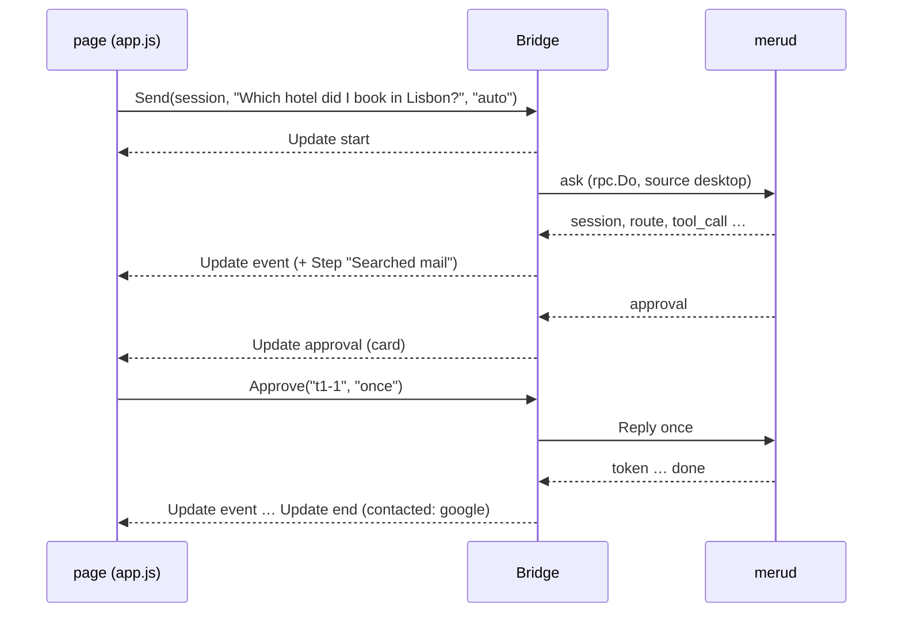

# desktop

**Code:** `internal/desktop/` (`doc.go`, `bridge.go`, `views.go`, `history.go`, `status.go`, `settings.go`, `connectors.go`, `about.go`, `files.go`, `thumbs.go`, `commands.go`, `options.go`, `assets.go`, and the page in `web/`; tests include `attach_test.go` and `thumbs_test.go`), plus `cmd/meru-desktop/main.go`
**Milestone:** the desktop app, asked for ahead of v0.5
**Architecture:** [Desktop app](../../ARCHITECTURE.md#desktop-app)

## What it does

The desktop app is a third client for `merud`, next to `meru` and `meru chat`. It
shows the conversation in a native window. The window comes from Wails v3, a Go
library that pairs a Go program with the system's own WebView, the browser engine
macOS, Linux and Windows already ship. The window shows a page written in plain
HTML, CSS and JavaScript, and the page calls Go.

Beside the chat, the app has a Settings screen, where you set what each tool may do,
which folders Meru reads, what it knows about you and which skills it loads, and a
Setup screen for a first run. Neither writes a file: each change goes to `merud`
as a request, and `merud` makes it.

The package splits the app in two. `cmd/meru-desktop` holds the few lines that need
Wails, which needs cgo (Go's bridge to C) and the WebView's headers. Everything
else sits here, in `internal/desktop`, which doesn't import Wails, so its tests run
on any machine: the **Bridge**, the Go value whose methods the page calls; the
**views**, plain structs the Bridge sends the page; and the **page** itself.

## The picture



## Walk through the code

### bridge.go

`Bridge` holds the socket path, the answer model's name, the home folder and two
functions: `emit`, which sends an update to the page, and `open`, which opens a
link. In the app, `emit` is Wails' `app.Event.Emit`; in tests, it records the
updates. Passing functions in keeps Wails out of this package.

```go
type Bridge struct {
    // ...
    wg sync.WaitGroup

    mu        sync.Mutex // guards the fields below
    turn      *turn
    last      int
    session   string
    scope     string
    queue     []outgoing
    attached  []Attachment
    approvals map[string]chan rpc.Choice
    saves     int
}
```

The page calls the Bridge from Wails' goroutines, and each turn runs in a goroutine
of its own, so the running turn, the session, the scope, the queue and the open
approval cards sit behind one mutex. A
**mutex** lets one goroutine at a time touch the fields it guards; `mu.Lock()` waits
for its turn and `defer mu.Unlock()` gives it back when the function returns.

`Send` trims the question and checks the scope, which the composer's "Where Meru
looks" switch sets: `""` or `auto` lets the router pick, and `files`, `mail`,
`web` or `talk` go to `merud` as `Request.Scope`. It adds a "Read this file"
line for each attached file, keeps the attached images beside the text in an
`outgoing` value, and clears the attachments. `start` puts the images' full
paths in `Request.Images` and sends the page a `start` update whose `Images`
carry their previews, for the question's bubble. While a turn runs, it adds
the question, images and all, to the queue,
five at most, as `meru chat` does. Otherwise `start` opens a turn: it makes a
context with its own cancel function, emits a `start` update, and runs `run` in a
new goroutine with `wg.Go`, which counts it so `ServiceShutdown` can wait for it.

`run` ranges over `rpc.Do`, the same client call `meru` uses, and hands each event
to `event`. `event` checks that the turn is still the running one, since `Stop` may
have ended it, and emits an `Update`. For a `session` event it keeps the ID, so the
queued questions continue the same chat. For a tool event it adds a `Step` with a
friendly label from views.go. It also collects the answer's tokens in a
`strings.Builder` and keeps the latest `sources` list, so the turn's end can say
which sources the answer cites.

Approvals take a channel. `approver` returns the `rpc.ApproveFunc` that `rpc.Do`
calls when `merud` asks about a tool call:

```go
ch := make(chan rpc.Choice, 1)
view.ID, view.Task = prefix+a.ID, task
b.approvals[view.ID] = ch
b.emit(UpdateEvent, Update{Turn: n, Kind: KindApproval, Approval: &view})
// ...
select {
case c := <-ch:
    return c, nil
case <-ctx.Done():
    return "", ctx.Err()
}
```

The turn's goroutine blocks in `select` until one of two things happens: the page
calls `Approve`, which puts the choice on the channel, or the turn ends. The
channel has room for one value, so `Approve` never waits. A save asks through the
same function, so the card's ID gets a prefix, `t3-` for turn 3 or `save1-` for
the first save: `merud` numbers approvals per connection, and a save runs on a
connection of its own. A deferred function takes the card out of the map however
the wait ends.

`finish` ends a turn, emits `end` with the servers it contacted and the sources
the answer cites, and starts the oldest queued question. `rpc.Cited` picks those
sources, as it does for `meru` and `meru chat`: the ones whose number the answer
writes as `[1]` or `[1, 3]`. A search can return ten files for an answer that
cites none, and the page shows only the cited ones under the answer. `Stop` cancels the running turn, which closes the
connection and so tells `merud` to stop, and drops the queue with a notice.

`ServiceShutdown` has that name because Wails calls a method by that name when the
app quits, and hides it from the page. It cancels the turn and waits for the
goroutine.

### views.go

The `Update` struct is the one message type the page receives, on one Wails event,
`meru:update`. Its `Kind` says which fields matter: `start`, `event`, `approval`,
`end` or `queue`.

`stepLabel` turns a tool call into words: `google.search_gmail_messages` becomes
"Searched mail", `read_file` with `{"path":"~/Notes/lisbon.md"}` becomes "Read
lisbon.md". It reads the tool's name for words such as "mail", "send" or "calendar",
so it works for servers it has never seen, and falls back to "Used google list
drive items".

`contacted` lists who a turn's tools reached, for the privacy line: MCP servers and
A2A agents by name, "web search", and the host `web_fetch` read. A denied or
declined call reached no one.

`approvalView` builds the card. When the arguments hold `to` or `subject`, it lifts
To, Cc, Bcc, Subject and Body out as fields and shows the rest as indented JSON.
`encoding/json` sorts a map's keys, so the card reads the same each time. It also
names the server and tool, for the "Why Meru is asking" panel, and writes the
`Draft` that Edit first puts in the composer: "Send this mail instead:" with the
fields, or "Run write_file with these arguments instead:" with the JSON.
`approvalView` has a named result, `(v ApprovalView)`, so a deferred function can
set `v.Draft` after the fields are in, whichever `return` runs.

Edit first answers `deny` and puts the draft in the composer. `merud` runs a call
with the arguments it asked about or not at all, so the edited text goes back as a
new question, and the model's new call brings a new card.

### history.go and status.go

`Sessions` sends the new `sessions` op and files each session under Today,
Yesterday or Earlier with `groupOf`, which compares against local midnight.
`SessionTurns` sends `session_turns` and shapes each past turn like a live one, so
the page draws both with the same code; each past turn carries its `Cited`
sources and its `Notice` too. Both go through `one`, which sends a
request and waits, at most five seconds, for the one event that answers it.

`Status` asks for `index_status`, `mcp_status` and `connectors`. It never fails. When nothing
listens on the socket, the connection fails at once and `Status` gives `Up: false`
with the reason and the command that starts `merud`. When `merud` takes the
connection but doesn't answer within the five seconds `one` allows, the error
wraps `context.DeadlineExceeded`, and `Status` sets `Busy` instead, with no start
hint: `merud` runs, but a long answer or a Mac short of memory slowed it. Before
this, a busy `merud` showed as "merud isn't running" while it answered questions.

When `index_status` fails some other way, `waitingFor` asks for the
`connectors` op. A `merud` that waits for Ollama answers it with Ollama's row,
not ok; `Status` then sets `Waiting` with Ollama's sentence, such as "Ollama
isn't running at http://127.0.0.1:11434.", and no start hint, and the rail
shows "Waiting for Ollama". A `merud` that runs adds the connectors
`mcp_status` doesn't list to `Connections`: web search by its name when ok, or
with its state, as in "Web search (needs config)", and Ollama only when it
isn't ok. `TestStatusWaitingAndWeb` covers both.

`OpenURL` checks the link with `opener.Check`; `OpenSource` turns a source's
`~/Notes/lisbon.md` into a `file://` URL with `rpc.FileURL` first.

`one` now waits up to 90 seconds, instead of five, for an op that changes a
setting: after a change `merud` may restart every MCP server, and each may take a
while to start. `done` is `one` for an op that `merud` answers with `done` alone.
`Status` also carries the folder and profile counts: with both at zero, the page
opens Setup on its own. Its `Connections`, the names the rail shows, lists
each MCP server `merud` holds a connection to, and each connector the pool
runs that isn't `ok`, with its state in brackets: `obsidian (needs config)`.
`rpc.ConnectorWords` writes the state, so the rail and `meru chat` say it the
same way. A connector that is `ok` shows by name alone, like a connected
server.

### The chat list (history.go, web/js/organize.js)

`SessionView` carries each chat's `Folder` and `Tags`. `DeleteSession`,
`MoveSession`, `TagSession`, `ChatFolders`, `AddChatFolder`, `RenameChatFolder`
and `RemoveChatFolder` each send one op; `folderOp` returns an empty slice rather
than nil, so the page always gets an array. `Send` and `Retry` take an `incognito`
flag, which the Bridge puts on the first question of a new chat. When a `session`
event says the chat is incognito, the Bridge remembers its ID, and
`ServiceShutdown` sends `session_delete` for it as the app quits.

In the page, `drawSessions` in `app.js` draws the folders first, each a group
whose head folds it, then the day groups. `organize.js` holds the right-click
menu, positioned at the pointer with `element.style`, which the page's policy
allows because it isn't an inline `style` attribute, and one `<dialog>` for
Delete, Move to folder, Tags, New folder, Rename and Delete folder. Delete asks
with Cancel focused, so a stray Enter deletes nothing. The context-menu key and
Shift+F10 open the same menus from the keyboard.

### settings.go

One method per thing Settings and Setup show or change, each a single request:
`Connections`, `SetPolicy`, `AddConnection`, `AddCustomServer`, `RemoveConnection`, `SetSecret`,
`Folders`, `AddFolder`, `RemoveFolder`, `Memories`, `AddMemory`, `ForgetMemory`,
`Skills`, `SetSkill`, `Models`, `UseModel`, `Activity` and `Usage`. Each hands
back what `merud` sent, shaped for the page: a view struct such as
`ConnectionsView`, with an empty list in place of `nil`, since `nil` reaches
JavaScript as `null`.

`UseModel(name)` is the "Use for answers" button on a model card. It sends
`model_set` with the model's name, and `merud` refuses a model Ollama doesn't
have, unloads the old answer model, loads the new one, writes `[models] main`,
and answers the next question with it, with no restart. `UseModelSet(name,
rebuild)` sends `model_use` for a model set, the Settings screen's **Use** and the
composer's `/model <name>`, and `SaveModels` sends `model_save`, **Make
default** and `/model save`. A switch gets `switchTimeout`, three minutes, in
`one`, since a large model can take a minute to load. The reply is the models view after the change, with a `Warning` for a
model that can't call tools, such as `gemma3:12b`. The status block names the
answer model, and any client can switch it, so `models` keeps the name each
models reply gives in the Bridge's `model` field.
That field now sits under the Bridge's mutex, `mu`, since `Status` reads it
while a call from Settings may write it.

`AddConnection` saves the key first, with `secret_set`, then adds the server with
`mcp_add`: `merud` refuses to add a catalog server whose key it lacks.

`AddCustomServer` adds a server of the user's own, from the "Add your own MCP
server" form. It takes an `rpc.CustomServer`: a name, then a program with its
arguments and environment variables, or a URL with the "on another computer"
tick. Wails decodes the object the page passes into that struct by its JSON tags.
The method sends it as `mcp_add` with `Request.Custom` set, and `merud` checks
every field. A secret variable's value travels in the same request: `merud` must
save it before it writes the entry, or the reload that follows would fail on a
`secret:` reference with nothing behind it.

### connectors.go

The Bridge methods behind the connector cards. `Connectors` sends the
`connectors` op and returns every connector with each list set to `[]`
(`pageConnector`), since the page can't loop over `null`. `SetConnector(id,
change)` sends `connector_set` with an `rpc.ConnectorChange`, which Wails
decodes from the page's plain object; `FixConnector(id)` sends
`connector_fix`. Both go through `follow`, which reads every `connector`
event, emits each to the page as a `KindConnector` Update, and returns the
last, where the connector settled. A first install can take minutes, so
`follow` allows `connectorTimeout`, six minutes, where the settings ops get
their usual short timeout. `AdoptConnector(id, apply)` sends
`connector_adopt`, first without `Apply` for the plan and then with it.

`connectorDots` builds `Status.Connectors`, the rail's dots: every connector
that isn't off, with its state and the words for it.

`connectors_test.go` runs each method against a fake `merud`: the request
merud gets, the two steps a save emits to the page, the field Fix names,
the plan and the apply, merud's refusal as the error, and the rail's dots.

### about.go

`Tagline` holds the one line that says what Meru is: "A personal AI assistant
that runs entirely on your own computer". It comes from `internal/about` (see
[about](about.md)), which `meru chat` reads too. `WindowTitle` puts "Meru · " in
front of it for the title bar; the name comes first, because macOS cuts a long
title from the end. `index.html` repeats the line as the logo's tooltip, and
`TestTaglineEverywhere` fails when the page or `main.go` drifts from it.

`About` returns what the About section of Settings needs from Go: the tagline, the
version and its short form, the license, where `config.toml` and Meru's folder
are, written with `~`, and the project's four links on GitHub. `internal/about`
supplies all but the paths. `merud` reports no version over the socket, so the
app shows its own build's: the one `make release` stamps in, or what Go recorded
in the binary. The short form sits under the wordmark in the rail: a release tag
such as `v0.4.1` stays, and a build between tags shows as `dev` and the commit,
such as `dev 5325b3e`. The rail shows the full version as the label's tooltip.
`type Link = about.Link` gives the package's link type a second name here, so the
page gets the same JSON as before. In the About section, the license, the settings
file and Meru's folder are link-styled buttons (`openable` in `settings.js`): the
license opens on GitHub through `OpenURL`, and the two paths open through
`OpenSource`, the file in its default app and the folder in Finder.

The links live in Go on purpose. `assets_test.go` fails when the page's own files
name any host, so the page asks `About` for the links and opens each through
`OpenURL`, whose check allows `https`. `internal/policy/allowed_urls.txt` lists the
project's GitHub address, because the policy test reads every string literal in
Go for hosts off this machine; the app never fetches the page itself, the
system's browser does.

### files.go

`SaveChat` and `SaveNote` send `save_file` and wait for the `saved` event, showing
the write_file card through `approver`. `Reveal` opens the folder that holds a
saved file, and only a file inside the output folder. `ChooseFolder` and
`AttachFile` show the system's dialogs through the functions `main.go` passes in.

The Bridge keeps the files attached to the next question in `attached`, as it
keeps the queue. `AttachFile` takes the files the dialog returns, and `Drop` the
files dropped on the window; both call `attach`. For each path, `attach` sends
`attach_file` and waits for the `saved` event that names `merud`'s copy, since
the app writes no file itself. It stops at five files, the `maxAttachments` cap,
and emits a `KindAttachments` update with the chips and a notice that names each
file that stayed out, with `merud`'s reason. A chip shows the name of the user's
file, the copy's path in the `~` form `read_file` takes, and the size from
`sizeText`. `Detach` takes one chip off and `DetachAll`, for New chat, takes all.

The `saved` event's `Kind` says whether `merud` took the file as an image.
`attachment` copies it onto the chip's `Kind`, keeps the copy's full path in
the unexported field `full`, and for an image asks `thumbnail` for a preview.
`encoding/json` skips a field whose name starts with a lower-case letter, so
the page never gets `full`; Go sends it to `merud` when the question goes.
`withAttachments` writes "Read this file" lines for files alone, and `imagesOf`
picks out the images.

Try again calls `Retry`, which is `Send` with the images the first asking
carried. The page passes the `~/meru-output/uploads/...` paths it got on the
turn; `Retry` turns each back into a full path with `expandTilde`, refuses one
outside the uploads folder, and hands them to `send` with the composer's own
attachments. Without it, Try again on a question about a photo would ask the
model blind.

`Drop` is a plain function, `desktop.Drop(b, paths)`, not a method. Wails binds
every exported method of the Bridge, so the page could call `Drop` with any path
it liked; the page can't reach a plain function. Only a real drop, which Wails
reports to Go, gets there. `Drop` runs `attach` in a goroutine that `wg` counts,
so the window's event loop never waits on `merud`.

### thumbs.go

`thumbnail` makes the preview an image chip and a question bubble show, as a
`data:` URL, which the page's Content-Security-Policy allows for images. It
reads only a regular file inside `<output_dir>/uploads/`, the folder `merud`
copies into; `inside` resolves symbolic links first, so a link can't pass.
`thumbFor` then picks by the bytes, with `http.DetectContentType`:

- an image up to 64 KiB (`rawThumbMax`) goes out as it stands, WebP included;
- a larger PNG, JPEG or GIF goes through that format's own decoder. First
  `DecodeConfig` reads the size from the header, and a picture over 50 million
  pixels gets no preview, since a small file can claim a huge size and fill
  memory. `shrink` scales it to fit 160 pixels (`thumbSide`) by taking the
  nearest source pixel for each preview pixel, lays it on white with
  `draw.Draw`, and `jpeg.Encode` writes it;
- a larger WebP gets none, since the standard library can't decode WebP, and
  the chip shows an image icon.

`SessionTurns` does the same for a reopened chat: `TurnInfo.Images` holds the
copies' full paths, and each becomes an `Attachment` with its preview. A copy
the user deleted keeps its name and loses its preview.

### commands.go

`commandList` holds the slash commands `meru chat` has, from `/new` to `/exit`,
with a line on each for the menu. Each runs through the app's own screen or
button: `/chats` opens the rail with the words in its search box, `/retry` is Try
again on the newest answer, `/scope` flips the Where Meru looks switch, `/attach`
opens the file dialog, `/save` is Save to a note (`/save chat` is Share as file),
`/used` opens the side panel on the newest answer, `/copy answer` copies the whole
answer, `/folders`, `/skills`, `/log` and `/about` open their Settings sections, and
`/help` opens the command menu. `app.js` hands `commands.js` the functions these
need. `TestEveryCommandRuns` fails when a listed command has no case in
`commands.js`. In the page, `/model` alone opens Settings, Models; `/model save` calls
`SaveModels` and `/model <name>` calls `UseModelSet`, and both say on the
notice line how it went. A switch waits while a turn runs, as in `meru chat`.
`TestModelCommandRouting` reads `commands.js` and checks that each form reaches
the Bridge, since the page has no tests of its own. `Commands` hands the
page a copy. `TestCommandsMatchChat` reads `commandList` out of
`internal/tui/commands.go`'s source and fails when the two lists differ; it reads
the file because `internal/desktop` may not import `internal/tui`. `Quit` closes
the app for `/exit`.

### assets.go

```go
//go:embed web
var web embed.FS
```

The `//go:embed` line copies the `web` folder into the binary. `Assets` serves it
with `http.FileServerFS` and sets a Content-Security-Policy header on every file:
scripts, styles, fonts and connections from the app only, no inline script, and
nothing from the network.

### The page (web/)

The page is ES modules, which the WebView loads as they are: no Node, npm or
bundler.

- `js/api.js` calls the Bridge by name, `Call.ByName("github.com/aarora79/meru/internal/desktop.Bridge.Send", ...)`,
  through Wails' runtime, which the app serves at `/wails/runtime.js`. Calling by
  name needs no generated bindings, so no Wails command-line tool either.
- `js/app.js` keeps the page's state and wires the rail, the composer, the queue and
  the side panel to the updates. It shows one of three screens in the middle
  column: the chat, Settings or Setup. The rail folds to a column of icons; its
  logo and name are one button that opens About in Settings. A new chat shows
  the logo beside "Ask Meru", as an `` with empty alt text, since the heading
  already says Meru. The side panel starts closed, and the header's button opens
  it; the page stores nothing, so the choice lasts until the window closes. It
  shows what the selected answer used, Remembered included, or "Why Meru is
  asking" while a card is open, or "On this Mac" in Settings. The approval card
  says why Meru asks on its own, with a link to the panel, because the panel may be
  closed. The composer holds the "Where Meru looks" switch, a radio group the
  arrow keys move through, and the attach button. `onAttachments` draws the
  chips from each `attachments` update, each with its remove button, shows the
  update's notice, and switches a scope other than Auto or My files to My files
  when a file arrives; an image switches nothing, since it goes with the
  question in any scope. An image's chip shows its preview in place of the
  file icon. `thumb` in `js/turns.js` builds that ``, and sets `src` only
  to a `data:image/png`, `jpeg`, `gif` or `webp` URL with base64 data, so
  nothing else reaches it; otherwise it draws the image icon. `createTurn`
  shows the question's images above its text in the bubble, for a live turn
  and a reopened one.
- The chat screen, `<main id="chat-view">`, carries `data-file-drop-target`. While
  files hover over it, Wails' runtime adds the class `file-drop-target-active`,
  and `app.css` shows the "Drop to attach" overlay for that class, so the overlay
  needs no script. The overlay has `pointer-events: none`, so the drop lands on
  the screen beneath it.
- `js/commands.js` runs the slash commands and draws their menu: a listbox under
  the question box, which is its combobox, with `aria-activedescendant` naming the
  option the arrow keys point at. `/copy N` counts the code blocks in the chat's
  finished answers in order, as `meru chat` does, and each block's header shows its
  number.
- `js/settings.js` draws the eight sections of Settings: Connections, with an Off /
  Ask / Allow switch per tool, Folders, About you, Skills, Models, Activity, Usage
  and About. Under the catalog cards, "Add your own MCP server" opens a form: a
  name, then a program with its arguments and environment variables, or a URL with
  a tick for a server on another computer. Each argument gets a field of its own,
  so an argument with a space in it needs no quotes, and no quoting rule can cut
  one in the wrong place. A variable ticked Secret shows as a password field. The form checks the
  name's pattern to answer sooner; `merud` checks everything again. A connector
  `merud` runs gets its own card: "Connector" in place of "MCP server", a pill
  from `CONNECTOR_PILLS` (Ready in green; Starting, Needs setup, Failed and Off
  in amber), its sentence under the title, and, for one that isn't ready, a
  "Set it up" link that scrolls to its connector card above (see
  connectors.js below). The card has no Remove button, since config has no
  `[[mcp.servers]]` entry to take out. `connectorManaged` tells the two apart; a server added by hand in a
  connector's place shows "set up by hand", keeps its Remove, and shows
  `merud`'s sentence, which ends with the `meru mcp adopt` command that moves
  it over. The Web search card, cut from the built-in tools' connection,
  takes that connection's `web` and `web_sentence` as its connector state, so
  it shows the SearXNG connector's pill and sentence in place of a flat
  "Connected". Models shows
  the tiers, then "Models you can use for answers": a card per model we tried,
  with its size, a pill per capability, "No tools" and what that means for a
  model without them, a line on what it did well and one on what it did badly,
  its `ollama pull` and `ollama run` commands in copy lines, and "Use for
  answers", which stays off until Ollama has the model. About shows
  the tagline, the name, what Meru does and why it runs on your computer, the
  version and folders, a "Run setup again" link, and the three links the
  Bridge hands it.
- `js/setup.js` draws the four Setup steps. `app.js` opens them on its own the
  first time `merud` reports no folders and no profile; the rail has no Setup
  button, so after that the only way in is "Run setup again", which calls
  `pages.openSetup`.
- `js/turns.js` draws one turn. Each part (work strip, approval card, body,
  sources line, footer) has its own draw function, so a token redraws only the
  body. The strip's first chip comes from `workLabel`, which reads what the turn
  did: "Used tools" once a `tool_call` event came, "Searched your files" once a
  `sources` event came, both together, "Answered from the model" for a finished
  turn with neither, and "Answering" while text streams. It never reads the
  route: the router's pick says what the turn could do, and a `tools` turn
  whose model called no tool once said "Used tools". `app.js` redraws the strip
  on `sources`, on each tool event and on the first token. The route and the
  router's confidence stay behind Show steps. `TestWorkLabelReadsWhatHappened`
  in `assets_test.go` reads `workLabel`'s source, since the page has no test
  runner, and fails if it reads `t.route`. The sources line shows only the cited sources, closed, as "3 sources"
  with a chevron; the button, with `aria-expanded`, opens a chip per source. An
  answer that cites nothing shows no line. `drawNotice` draws `merud`'s `notice`
  event, sent when the answer claims an action no tool performed, as an amber
  note with a warning icon, in the approval card's colours; a past turn carries
  it as `TurnView.Notice`. The event comes with #29, and `app.js` names the
  `"notice"` type in one place; the page skips any type it doesn't know, so
  nothing breaks before #29 merges. All text goes in with `textContent`,
  which the browser never reads as HTML.
- `js/markdown.js` renders a finished answer: `marked` turns Markdown into HTML with
  raw HTML escaped, and DOMPurify keeps a short list of tags and only `http`,
  `https` and `file` links, and returns DOM nodes. While an answer streams, the page
  shows plain text, because half-written Markdown renders wrong. `wrapCode` gives
  each code block a header with a Copy button, and `addPreview` draws a block that
  holds an SVG (tagged `svg`, or starting with an `<svg>` element) as a picture,
  with a Preview / Code switch. The picture is an `` whose `src` is a `data:`
  URL of the SVG. A browser treats an SVG shown as an image as a picture only: it
  runs no script inside it and loads no file it names, so a model's drawing can't
  do anything but draw. Parsing the SVG into the page would run its event
  handlers, which is why `TestSVGPreviewIsAnImage` fails if the code ever uses
  `DOMParser` or `createElementNS`. An SVG over 200,000 characters, or one the
  browser can't read, stays as code.
- `vendor/` and `fonts/` hold the two libraries and the three fonts, with their
  licenses; `THIRD-PARTY.md` lists versions and checksums.
- `img/meru-logo.svg` is a copy of the project logo in `docs/img/`. The rail and
  the new chat show it with an `` tag, which the page's policy allows for its
  own files.

#### connectors.js: the connector cards

`connectorCard(c, ctx, mark)` draws one connector from its status alone. It
names no connector: `TestConnectorFormsFromSchema` fails if the file holds a
connector's ID, a field's ID or a config key. The card has a pill from
`PILLS`, the sentence, an on and off switch for any kind but `dependency`,
and, when the connector has fields, a form. `INPUTS` maps each field type
to the function that draws it, and every entry returns the same three
things: the element, the control to focus, and `read`, which returns what
the user entered. So the form's Save loops over the fields without knowing
their types, but for two rules: a secret goes in `secrets` and only when
typed, and any other value goes in `values` only when it changed.

- `text` and `email`: a text field holding the value config has.
- `secret`: an empty password field whose placeholder says whether one is
  saved, with a "saved" pill. The page never holds the secret.
- `folder`: a text field and Choose…, which calls `bridge.chooseFolder`, the
  folder dialog Settings' Folders section uses.
- `choice`: a `<select>` of the choices, with an empty one when the field is
  optional.
- `oauth`: the "Sign in to Google" button while `merud` has a link, opened
  through `bridge.openURL`, and a note otherwise.

`run(promise, after)` wraps a save or a fix: it turns the card's buttons
off, shows "Asking merud…", and puts a function in `live`, a map from the
connector's ID to the card's progress line. app.js hands each
`KindConnector` Update to `connectorProgress`, which finds the card in
`live` and shows the step. When the promise ends, `settled` hands the result
to Settings, which draws the section again with a notice. Fix that names
fields draws a new card with `mark` set, which gives those fields an amber
edge (`.connector-field.needs`) and moves the cursor to the first. `askFields`
picks them by `rpc.AskFields`'s rule; `TestAskFieldsMatchesRPC` reads it.

A connector set up by hand gets only Adopt. `adoptDialog` asks the Bridge for
the plan and fills the page's one `<dialog>` with it, each change in an
ordered list and a table's lines in a `<pre>`, with Cancel, which has the
focus, and Adopt, which applies. The page has no `window.confirm`: the
viewer blocks it, and the dialog shows the plan in full.

In app.js, the rail draws `status.connectors` as a row of dots, each a
button that opens Settings at the card: `goSettings("connections",
"connector:" + id)`, which the section's focus code scrolls to. The
Connections line lists only the servers the dots don't cover.

### cmd/meru-desktop/main.go

`//go:build desktop` at the top keeps the go command away from this file unless you
pass `-tags desktop`. `run` builds the Bridge with `DefaultOptions`, creates the
Wails app with the Bridge as a service and `Assets` as its file server, and opens a
1440 by 900 window that shrinks to 1000 by 640. The title bar reads
`WindowTitle` and never changes; the chat's title shows in the page's header.

The window sets `EnableFileDrop`. On macOS a view that Wails lays over the
WebView takes the drop, reads the files' full paths, and asks the page's runtime
which element sits under the pointer. When that element, or one around it,
carries `data-file-drop-target`, Wails fires `events.Common.WindowFilesDropped`
on the window. `main.go` listens with `window.OnWindowEvent` and hands
`e.Context().DroppedFiles()` to `desktop.Drop`. The page never sees the paths,
since a WebView hides them from JavaScript. The file dialog uses
`PromptForMultipleSelection` and sets no starting folder, so the user can pick
several files from anywhere.

`make desktop-app` builds `bin/Meru.app` from three files: the binary,
`Info.plist`, and `Meru.icns`, the icon macOS shows in the Dock and Finder.
`CFBundleIconFile` in `Info.plist` names it. The icon is the logo from
`docs/img/meru-logo.svg` on a light rounded square, in the size and shape macOS
icons use: an 824-pixel tile with 185-pixel corners inside a 1024-pixel canvas.
To remake it after the logo changes, draw that 1024-pixel PNG (any tool that
renders SVG will do), scale it with `sips` to the ten sizes an `.iconset` folder
holds (16 to 512 pixels, each also at double size), and run
`iconutil -c icns Meru.iconset -o cmd/meru-desktop/Meru.icns`.

## Go ideas used here

- **Goroutines** — each turn reads its events in its own. More in
  [go-basics/goroutines.md](go-basics/goroutines.md).
- **Channels and select** — an approval waits for the page's answer or the turn's
  end. More in [go-basics/channels.md](go-basics/channels.md) and
  [go-basics/select.md](go-basics/select.md).
- **Iterators** — `for ev, err := range rpc.Do(...)`. More in
  [go-basics/iterators.md](go-basics/iterators.md).
- **Struct tags** — `json:"turn"` names each field in the JSON the page receives.
  More in [go-basics/struct-tags.md](go-basics/struct-tags.md).
- **embed** — the page ships inside the binary. More in
  [go-basics/embed.md](go-basics/embed.md).
- **Build tags** — `//go:build desktop` keeps cgo out of the usual build. More in
  [go-basics/build-tags.md](go-basics/build-tags.md).

## Try it

Typing "/" at the start of the question box opens the command menu; `/copy 2`
copies the second code block of the chat. The Settings button sits at the
foot of the rail, and "Run setup again" in Settings, About opens Setup.

```sh
go test ./internal/desktop/...      # runs anywhere, no cgo
make desktop                        # builds bin/meru-desktop (macOS, needs Xcode tools)
./bin/meru-desktop                  # with merud running
```

The tests run the Bridge against an rpc server in the same process, over a real
Unix socket: a turn's updates in order, each approval answer, the queue's limit and
order, Stop, the session list and past turns, the status with and without `merud`,
and which links open. The fake server's `gate` holds each question until the
test releases it. A test that stops a turn waits for that turn's handler to
return before it releases the next one: until the server notices the stop, the
stopped handler still waits too and could take the release meant for the next
turn, which made `TestStopDropsQueue` fail on a slow CI runner.
`settings_test.go` checks that each settings method sends
the request `merud` expects, that `UseModel` changes the model the status block
names, passes a warning on and leaves the model alone when `merud` refuses, that a save shows its card and returns the path,
which saved files `Reveal` opens, the scope, and the slash commands against
`meru chat`'s. `attach_test.go` runs the attachments against a fake `merud` that
copies files and refuses one with "secret" in its name: a cancelled dialog sends
nothing, two picked files become two chips with `~` paths and sizes, the refused
file's reason shows in the notice, `Detach` and `DetachAll` take chips off, a
drop of seven files attaches up to the cap of five and says how many stayed out,
and `Send` puts a "Read this file" line per file in the question and clears the
chips. `thumbs_test.go` builds PNGs with `image/png`: a small one comes back as
it stands, and a large noisy one as a 160 by 80 JPEG, while text named
`notes.png`, a link, a file outside uploads, a missing file and a Bridge with
no output folder get none. `TestShrinkKeepsShape` checks wide, tall and small
pictures. `TestAttachImages` attaches a PNG and a Markdown file through a fake
`merud` that marks `.png` copies as images: the image chip has its preview and
the file none, `Send` writes the file's line alone and sends the image's full
path in `Request.Images`, the `start` update carries the preview, and a
reopened session shows the image again. `draft_test.go` checks Edit first's drafts.
`about_test.go` checks the About data, the version read from build information,
that a version `make release` stamps in wins over it, and the tagline in the page and the window. `assets_test.go` checks the security headers, and fails when
the page's own code uses `innerHTML`, `eval`, inline scripts or styles, or names a
host on the network.

## Why it's built this way

- **Previews built in Go.** The page can't read files, and shouldn't: its
  policy keeps it to `data:` images and its own files. The Bridge reads only
  the uploads folder, and a preview of 160 pixels keeps each update small.

- **Wails v3 over a local web server and a browser tab.** A tab would need a port
  on loopback, which any local program could reach, and the browser's own
  extensions would see the conversation. Wails serves the page straight into its
  own WebView, with no port.
- **The Bridge in Go, not in JavaScript.** The queue, the approval wait and the
  labels are state and rules; Go's tests pin them down, and the repository has no
  JavaScript test runner. The page keeps what it draws.
- **No generated bindings.** Wails can generate a JavaScript file per bound type,
  but that takes its command-line tool and Node. Methods called by name need
  neither.
- **Settings change in `merud`.** The app could edit `config.toml` itself, but then
  two programs would write one file, and `merud` would run with stale settings
  until a restart. `merud` owns the file's edits, keeps its comments, and applies
  each change at once.
- **Edit first says no.** Approving with edited arguments would make `dispatch` run
  a call the model never made. A new question gets a new call and a new card, so
  the user sees exactly what runs.
- **Two libraries, vendored.** A Markdown parser and a sanitizer are the two jobs
  easy to get wrong by hand; both ship as single ES module files.
