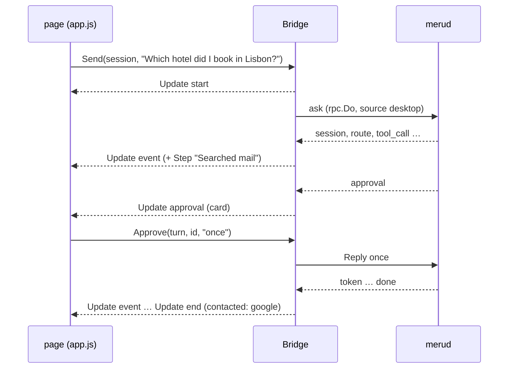

# desktop

**Code:** `internal/desktop/` (`doc.go`, `bridge.go`, `views.go`, `history.go`, `status.go`, `options.go`, `assets.go`, and the page in `web/`), plus `cmd/meru-desktop/main.go`
**Milestone:** the desktop app, asked for ahead of v0.5
**Architecture:** [Desktop app](../../ARCHITECTURE.md#desktop-app)

## What it does

The desktop app is a third client for `merud`, next to `meru` and `meru chat`. It
shows the conversation in a native window. The window comes from Wails v3, a Go
library that pairs a Go program with the system's own WebView, the browser engine
macOS, Linux and Windows already ship. The window shows a page written in plain
HTML, CSS and JavaScript, and the page calls Go.

The package splits the app in two. `cmd/meru-desktop` holds the few lines that need
Wails, which needs cgo (Go's bridge to C) and the WebView's headers. Everything
else sits here, in `internal/desktop`, which doesn't import Wails, so its tests run
on any machine: the **Bridge**, the Go value whose methods the page calls; the
**views**, plain structs the Bridge sends the page; and the **page** itself.

## The picture



## Walk through the code

### bridge.go

`Bridge` holds the socket path, the answer model's name, the home folder and two
functions: `emit`, which sends an update to the page, and `open`, which opens a
link. In the app, `emit` is Wails' `app.Event.Emit`; in tests, it records the
updates. Passing functions in keeps Wails out of this package.

```go
type Bridge struct {
    // ...
    wg sync.WaitGroup

    mu      sync.Mutex // guards the fields below
    turn    *turn
    last    int
    session string
    queue   []string
}
```

The page calls the Bridge from Wails' goroutines, and each turn runs in a goroutine
of its own, so the running turn, the session and the queue sit behind one mutex. A
**mutex** lets one goroutine at a time touch the fields it guards; `mu.Lock()` waits
for its turn and `defer mu.Unlock()` gives it back when the function returns.

`Send` trims the question. While a turn runs, it adds the question to the queue,
five at most, as `meru chat` does. Otherwise `start` opens a turn: it makes a
context with its own cancel function, emits a `start` update, and runs `run` in a
new goroutine with `wg.Go`, which counts it so `ServiceShutdown` can wait for it.

`run` ranges over `rpc.Do`, the same client call `meru` uses, and hands each event
to `event`. `event` checks that the turn is still the running one, since `Stop` may
have ended it, and emits an `Update`. For a `session` event it keeps the ID, so the
queued questions continue the same chat. For a tool event it adds a `Step` with a
friendly label from views.go.

Approvals take a channel. `approver` returns the `rpc.ApproveFunc` that `rpc.Do`
calls when `merud` asks about a tool call:

```go
ch := make(chan rpc.Choice, 1)
t.pending[a.ID] = ch
b.emit(UpdateEvent, Update{Turn: t.n, Kind: KindApproval, Approval: &view})
// ...
select {
case c := <-ch:
    return c, nil
case <-ctx.Done():
    return "", ctx.Err()
}
```

The turn's goroutine blocks in `select` until one of two things happens: the page
calls `Approve`, which puts the choice on the channel, or the turn ends. The
channel has room for one value, so `Approve` never waits.

`finish` ends a turn, emits `end` with the servers it contacted, and starts the
oldest queued question. `Stop` cancels the running turn, which closes the
connection and so tells `merud` to stop, and drops the queue with a notice.

`ServiceShutdown` has that name because Wails calls a method by that name when the
app quits, and hides it from the page. It cancels the turn and waits for the
goroutine.

### views.go

The `Update` struct is the one message type the page receives, on one Wails event,
`meru:update`. Its `Kind` says which fields matter: `start`, `event`, `approval`,
`end` or `queue`.

`stepLabel` turns a tool call into words: `google.search_gmail_messages` becomes
"Searched mail", `read_file` with `{"path":"~/Notes/lisbon.md"}` becomes "Read
lisbon.md". It reads the tool's name for words such as "mail", "send" or "calendar",
so it works for servers it has never seen, and falls back to "Used google list
drive items".

`contacted` lists who a turn's tools reached, for the privacy line: MCP servers and
A2A agents by name, "web search", and the host `web_fetch` read. A denied or
declined call reached no one.

`approvalView` builds the card. When the arguments hold `to` or `subject`, it lifts
To, Cc, Bcc, Subject and Body out as fields and shows the rest as indented JSON.
`encoding/json` sorts a map's keys, so the card reads the same each time.

### history.go and status.go

`Sessions` sends the new `sessions` op and files each session under Today,
Yesterday or Earlier with `groupOf`, which compares against local midnight.
`SessionTurns` sends `session_turns` and shapes each past turn like a live one, so
the page draws both with the same code. Both go through `one`, which sends a
request and waits, at most five seconds, for the one event that answers it.

`Status` asks for `index_status` and `mcp_status`. It never fails: a `merud` that
doesn't answer gives `Up: false` with the reason and the command that starts it.

`OpenURL` checks the link with `opener.Check`; `OpenSource` turns a source's
`~/Notes/lisbon.md` into a `file://` URL with `rpc.FileURL` first.

### assets.go

```go
//go:embed web
var web embed.FS
```

The `//go:embed` line copies the `web` folder into the binary. `Assets` serves it
with `http.FileServerFS` and sets a Content-Security-Policy header on every file:
scripts, styles, fonts and connections from the app only, no inline script, and
nothing from the network.

### The page (web/)

The page is ES modules, which the WebView loads as they are: no Node, npm or
bundler.

- `js/api.js` calls the Bridge by name, `Call.ByName("github.com/aarora79/meru/internal/desktop.Bridge.Send", ...)`,
  through Wails' runtime, which the app serves at `/wails/runtime.js`. Calling by
  name needs no generated bindings, so no Wails command-line tool either.
- `js/app.js` keeps the page's state and wires the rail, the composer, the queue and
  the side panel to the updates.
- `js/turns.js` draws one turn. Each part (work strip, approval card, body, source
  chips, footer) has its own draw function, so a token redraws only the body. All
  text goes in with `textContent`, which the browser never reads as HTML.
- `js/markdown.js` renders a finished answer: `marked` turns Markdown into HTML with
  raw HTML escaped, and DOMPurify keeps a short list of tags and only `http`,
  `https` and `file` links, and returns DOM nodes. While an answer streams, the page
  shows plain text, because half-written Markdown renders wrong. `wrapCode` gives
  each code block a header with a Copy button, and `addPreview` draws a block that
  holds an SVG (tagged `svg`, or starting with an `<svg>` element) as a picture,
  with a Preview / Code switch. The picture is an `` whose `src` is a `data:`
  URL of the SVG. A browser treats an SVG shown as an image as a picture only: it
  runs no script inside it and loads no file it names, so a model's drawing can't
  do anything but draw. Parsing the SVG into the page would run its event
  handlers, which is why `TestSVGPreviewIsAnImage` fails if the code ever uses
  `DOMParser` or `createElementNS`. An SVG over 200,000 characters, or one the
  browser can't read, stays as code.
- `vendor/` and `fonts/` hold the two libraries and the three fonts, with their
  licenses; `THIRD-PARTY.md` lists versions and checksums.
- `img/meru-logo.svg` is a copy of the project logo in `docs/img/`. The rail shows
  it with an `` tag, which the page's policy allows for its own files.

### cmd/meru-desktop/main.go

`//go:build desktop` at the top keeps the go command away from this file unless you
pass `-tags desktop`. `run` builds the Bridge with `DefaultOptions`, creates the
Wails app with the Bridge as a service and `Assets` as its file server, and opens a
1440 by 900 window that shrinks to 1000 by 640.

## Go ideas used here

- **Goroutines** — each turn reads its events in its own. More in
  [go-basics/goroutines.md](go-basics/goroutines.md).
- **Channels and select** — an approval waits for the page's answer or the turn's
  end. More in [go-basics/channels.md](go-basics/channels.md) and
  [go-basics/select.md](go-basics/select.md).
- **Iterators** — `for ev, err := range rpc.Do(...)`. More in
  [go-basics/iterators.md](go-basics/iterators.md).
- **Struct tags** — `json:"turn"` names each field in the JSON the page receives.
  More in [go-basics/struct-tags.md](go-basics/struct-tags.md).
- **embed** — the page ships inside the binary. More in
  [go-basics/embed.md](go-basics/embed.md).
- **Build tags** — `//go:build desktop` keeps cgo out of the usual build. More in
  [go-basics/build-tags.md](go-basics/build-tags.md).

## Try it

```sh
go test ./internal/desktop/...      # runs anywhere, no cgo
make desktop                        # builds bin/meru-desktop (macOS, needs Xcode tools)
./bin/meru-desktop                  # with merud running
```

The tests run the Bridge against an rpc server in the same process, over a real
Unix socket: a turn's updates in order, each approval answer, the queue's limit and
order, Stop, the session list and past turns, the status with and without `merud`,
and which links open. `assets_test.go` checks the security headers, and fails when
the page's own code uses `innerHTML`, `eval`, inline scripts or styles, or names a
host on the network.

## Why it's built this way

- **Wails v3 over a local web server and a browser tab.** A tab would need a port
  on loopback, which any local program could reach, and the browser's own
  extensions would see the conversation. Wails serves the page straight into its
  own WebView, with no port.
- **The Bridge in Go, not in JavaScript.** The queue, the approval wait and the
  labels are state and rules; Go's tests pin them down, and the repository has no
  JavaScript test runner. The page keeps what it draws.
- **No generated bindings.** Wails can generate a JavaScript file per bound type,
  but that takes its command-line tool and Node. Nine methods called by name need
  neither.
- **Two libraries, vendored.** A Markdown parser and a sanitizer are the two jobs
  easy to get wrong by hand; both ship as single ES module files.
