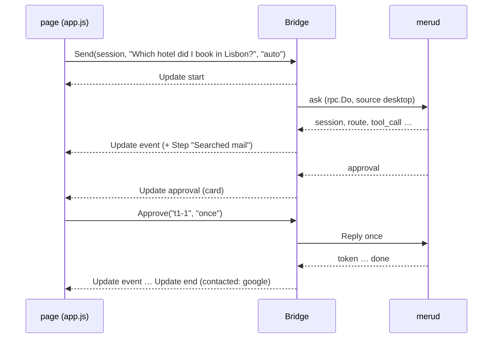

# desktop

**Code:** `internal/desktop/` (`doc.go`, `bridge.go`, `views.go`, `history.go`, `status.go`, `settings.go`, `about.go`, `files.go`, `commands.go`, `options.go`, `assets.go`, and the page in `web/`), plus `cmd/meru-desktop/main.go`
**Milestone:** the desktop app, asked for ahead of v0.5
**Architecture:** [Desktop app](../../ARCHITECTURE.md#desktop-app)

## What it does

The desktop app is a third client for `merud`, next to `meru` and `meru chat`. It
shows the conversation in a native window. The window comes from Wails v3, a Go
library that pairs a Go program with the system's own WebView, the browser engine
macOS, Linux and Windows already ship. The window shows a page written in plain
HTML, CSS and JavaScript, and the page calls Go.

Beside the chat, the app has a Library, where you set what each tool may do,
which folders Meru reads, what it knows about you and which skills it loads, and a
Setup screen for a first run. Neither writes a file: each change goes to `merud`
as a request, and `merud` makes it.

The package splits the app in two. `cmd/meru-desktop` holds the few lines that need
Wails, which needs cgo (Go's bridge to C) and the WebView's headers. Everything
else sits here, in `internal/desktop`, which doesn't import Wails, so its tests run
on any machine: the **Bridge**, the Go value whose methods the page calls; the
**views**, plain structs the Bridge sends the page; and the **page** itself.

## The picture



## Walk through the code

### bridge.go

`Bridge` holds the socket path, the answer model's name, the home folder and two
functions: `emit`, which sends an update to the page, and `open`, which opens a
link. In the app, `emit` is Wails' `app.Event.Emit`; in tests, it records the
updates. Passing functions in keeps Wails out of this package.

```go
type Bridge struct {
    // ...
    wg sync.WaitGroup

    mu        sync.Mutex // guards the fields below
    turn      *turn
    last      int
    session   string
    scope     string
    queue     []string
    approvals map[string]chan rpc.Choice
    saves     int
}
```

The page calls the Bridge from Wails' goroutines, and each turn runs in a goroutine
of its own, so the running turn, the session, the scope, the queue and the open
approval cards sit behind one mutex. A
**mutex** lets one goroutine at a time touch the fields it guards; `mu.Lock()` waits
for its turn and `defer mu.Unlock()` gives it back when the function returns.

`Send` trims the question and checks the scope, which the composer's "Where Meru
looks" switch sets: `""` or `auto` lets the router pick, and `files`, `mail`,
`web` or `talk` go to `merud` as `Request.Scope`. While a turn runs, it adds the
question to the queue,
five at most, as `meru chat` does. Otherwise `start` opens a turn: it makes a
context with its own cancel function, emits a `start` update, and runs `run` in a
new goroutine with `wg.Go`, which counts it so `ServiceShutdown` can wait for it.

`run` ranges over `rpc.Do`, the same client call `meru` uses, and hands each event
to `event`. `event` checks that the turn is still the running one, since `Stop` may
have ended it, and emits an `Update`. For a `session` event it keeps the ID, so the
queued questions continue the same chat. For a tool event it adds a `Step` with a
friendly label from views.go. It also collects the answer's tokens in a
`strings.Builder` and keeps the latest `sources` list, so the turn's end can say
which sources the answer cites.

Approvals take a channel. `approver` returns the `rpc.ApproveFunc` that `rpc.Do`
calls when `merud` asks about a tool call:

```go
ch := make(chan rpc.Choice, 1)
view.ID, view.Task = prefix+a.ID, task
b.approvals[view.ID] = ch
b.emit(UpdateEvent, Update{Turn: n, Kind: KindApproval, Approval: &view})
// ...
select {
case c := <-ch:
    return c, nil
case <-ctx.Done():
    return "", ctx.Err()
}
```

The turn's goroutine blocks in `select` until one of two things happens: the page
calls `Approve`, which puts the choice on the channel, or the turn ends. The
channel has room for one value, so `Approve` never waits. A save asks through the
same function, so the card's ID gets a prefix, `t3-` for turn 3 or `save1-` for
the first save: `merud` numbers approvals per connection, and a save runs on a
connection of its own. A deferred function takes the card out of the map however
the wait ends.

`finish` ends a turn, emits `end` with the servers it contacted and the sources
the answer cites, and starts the oldest queued question. `rpc.Cited` picks those
sources, as it does for `meru` and `meru chat`: the ones whose number the answer
writes as `[1]` or `[1, 3]`. A search can return ten files for an answer that
cites none, and the page shows only the cited ones under the answer. `Stop` cancels the running turn, which closes the
connection and so tells `merud` to stop, and drops the queue with a notice.

`ServiceShutdown` has that name because Wails calls a method by that name when the
app quits, and hides it from the page. It cancels the turn and waits for the
goroutine.

### views.go

The `Update` struct is the one message type the page receives, on one Wails event,
`meru:update`. Its `Kind` says which fields matter: `start`, `event`, `approval`,
`end` or `queue`.

`stepLabel` turns a tool call into words: `google.search_gmail_messages` becomes
"Searched mail", `read_file` with `{"path":"~/Notes/lisbon.md"}` becomes "Read
lisbon.md". It reads the tool's name for words such as "mail", "send" or "calendar",
so it works for servers it has never seen, and falls back to "Used google list
drive items".

`contacted` lists who a turn's tools reached, for the privacy line: MCP servers and
A2A agents by name, "web search", and the host `web_fetch` read. A denied or
declined call reached no one.

`approvalView` builds the card. When the arguments hold `to` or `subject`, it lifts
To, Cc, Bcc, Subject and Body out as fields and shows the rest as indented JSON.
`encoding/json` sorts a map's keys, so the card reads the same each time. It also
names the server and tool, for the "Why Meru is asking" panel, and writes the
`Draft` that Edit first puts in the composer: "Send this mail instead:" with the
fields, or "Run write_file with these arguments instead:" with the JSON.
`approvalView` has a named result, `(v ApprovalView)`, so a deferred function can
set `v.Draft` after the fields are in, whichever `return` runs.

Edit first answers `deny` and puts the draft in the composer. `merud` runs a call
with the arguments it asked about or not at all, so the edited text goes back as a
new question, and the model's new call brings a new card.

### history.go and status.go

`Sessions` sends the new `sessions` op and files each session under Today,
Yesterday or Earlier with `groupOf`, which compares against local midnight.
`SessionTurns` sends `session_turns` and shapes each past turn like a live one, so
the page draws both with the same code; each past turn carries its `Cited`
sources and its `Notice` too. Both go through `one`, which sends a
request and waits, at most five seconds, for the one event that answers it.

`Status` asks for `index_status` and `mcp_status`. It never fails: a `merud` that
doesn't answer gives `Up: false` with the reason and the command that starts it.

`OpenURL` checks the link with `opener.Check`; `OpenSource` turns a source's
`~/Notes/lisbon.md` into a `file://` URL with `rpc.FileURL` first.

`one` now waits up to 90 seconds, instead of five, for an op that changes a
setting: after a change `merud` may restart every MCP server, and each may take a
while to start. `done` is `one` for an op that `merud` answers with `done` alone.
`Status` also carries the folder and profile counts: with both at zero, the page
opens Setup on its own.

### settings.go

One method per thing the Library and Setup show or change, each a single request:
`Connections`, `SetPolicy`, `AddConnection`, `AddCustomServer`, `RemoveConnection`, `SetSecret`,
`Folders`, `AddFolder`, `RemoveFolder`, `Memories`, `AddMemory`, `ForgetMemory`,
`Skills`, `SetSkill`, `Models`, `Activity` and `Usage`. Each hands back what
`merud` sent, shaped for the page: a view struct such as `ConnectionsView`, with
an empty list in place of `nil`, since `nil` reaches JavaScript as `null`.

`AddConnection` saves the key first, with `secret_set`, then adds the server with
`mcp_add`: `merud` refuses to add a catalog server whose key it lacks.

`AddCustomServer` adds a server of the user's own, from the "Add your own MCP
server" form. It takes an `rpc.CustomServer`: a name, then a program with its
arguments and environment variables, or a URL with the "on another computer"
tick. Wails decodes the object the page passes into that struct by its JSON tags.
The method sends it as `mcp_add` with `Request.Custom` set, and `merud` checks
every field. A secret variable's value travels in the same request: `merud` must
save it before it writes the entry, or the reload that follows would fail on a
`secret:` reference with nothing behind it.

### about.go

`Tagline` holds the one line that says what Meru is: "A personal AI assistant
that runs entirely on your own computer". `WindowTitle` puts "Meru · " in front
of it for the title bar; the name comes first, because macOS cuts a long title
from the end. `index.html` repeats the line as the logo's tooltip, and
`TestTaglineEverywhere` fails when the page or `main.go` drifts from it.

`About` returns what the Library's About section needs from Go: the tagline, the
version, where `config.toml` and Meru's folder are, written with `~`, and the
project's three links on GitHub. `merud` reports no version over the socket, so
`buildVersion` reads the app's own: `debug.ReadBuildInfo` returns what the Go
toolchain wrote into the binary, a tag such as `v0.3.0` for a release, or
`(devel)` plus the git commit for a local build. The app and `merud` build from
the same tree, so the app's version stands in.

The links live in Go on purpose. `assets_test.go` fails when the page's own files
name any host, so the page asks `About` for the links and opens each through
`OpenURL`, whose check allows `https`. `internal/policy/allowed_urls.txt` lists the
project's GitHub address, because the policy test reads every string literal in
Go for hosts off this machine; the app never fetches the page itself, the
system's browser does.

### files.go

`SaveChat` and `SaveNote` send `save_file` and wait for the `saved` event, showing
the write_file card through `approver`. `Reveal` opens the folder that holds a
saved file, and only a file inside the output folder. `ChooseFolder` and
`AttachFile` show the system's dialogs through the functions `main.go` passes in.
`AttachFile` then checks the file against the folders `read_file` may read, the
`[index]` folders from `index_status` and the output folder, with symlinks
resolved, so a link can't pass for a file inside.

### commands.go

`commandList` holds the six slash commands, `/new`, `/usage`, `/me`, `/mcp`,
`/copy [N]` and `/exit`, with a line on each for the menu. `Commands` hands the
page a copy. `TestCommandsMatchChat` reads `commandList` out of
`internal/tui/commands.go`'s source and fails when the two lists differ; it reads
the file because `internal/desktop` may not import `internal/tui`. `Quit` closes
the app for `/exit`.

### assets.go

```go
//go:embed web
var web embed.FS
```

The `//go:embed` line copies the `web` folder into the binary. `Assets` serves it
with `http.FileServerFS` and sets a Content-Security-Policy header on every file:
scripts, styles, fonts and connections from the app only, no inline script, and
nothing from the network.

### The page (web/)

The page is ES modules, which the WebView loads as they are: no Node, npm or
bundler.

- `js/api.js` calls the Bridge by name, `Call.ByName("github.com/aarora79/meru/internal/desktop.Bridge.Send", ...)`,
  through Wails' runtime, which the app serves at `/wails/runtime.js`. Calling by
  name needs no generated bindings, so no Wails command-line tool either.
- `js/app.js` keeps the page's state and wires the rail, the composer, the queue and
  the side panel to the updates. It shows one of three screens in the middle
  column: the chat, the Library or Setup. The rail folds to a column of icons; its
  logo and name are one button that opens the Library's About. A new chat shows
  the logo beside "Ask Meru", as an `` with empty alt text, since the heading
  already says Meru. The side panel starts closed, and the header's button opens
  it; the page stores nothing, so the choice lasts until the window closes. It
  shows what the selected answer used, Remembered included, or "Why Meru is
  asking" while a card is open, or "On this Mac" in the Library. The approval card
  says why Meru asks on its own, with a link to the panel, because the panel may be
  closed. The composer holds the "Where Meru looks" switch, a radio group the
  arrow keys move through, and the attach button.
- `js/commands.js` runs the slash commands and draws their menu: a listbox under
  the question box, which is its combobox, with `aria-activedescendant` naming the
  option the arrow keys point at. `/copy N` counts the code blocks in the chat's
  finished answers in order, as `meru chat` does, and each block's header shows its
  number.
- `js/library.js` draws the Library's eight sections: Connections, with an Off /
  Ask / Allow switch per tool, Folders, About you, Skills, Models, Activity, Usage
  and About. Under the catalog cards, "Add your own MCP server" opens a form: a
  name, then a program with its arguments and environment variables, or a URL with
  a tick for a server on another computer. Each argument gets a field of its own,
  so an argument with a space in it needs no quotes, and no quoting rule can cut
  one in the wrong place. A variable ticked Secret shows as a password field. The form checks the
  name's pattern to answer sooner; `merud` checks everything again. About shows
  the tagline, the name, what Meru does and why it runs on your computer, the
  version and folders, and the three links the Bridge hands it.
- `js/setup.js` draws the four Setup steps.
- `js/turns.js` draws one turn. Each part (work strip, approval card, body,
  sources line, footer) has its own draw function, so a token redraws only the
  body. The sources line shows only the cited sources, closed, as "3 sources"
  with a chevron; the button, with `aria-expanded`, opens a chip per source. An
  answer that cites nothing shows no line. `drawNotice` draws `merud`'s `notice`
  event, sent when the answer claims an action no tool performed, as an amber
  note with a warning icon, in the approval card's colours; a past turn carries
  it as `TurnView.Notice`. The event comes with #29, and `app.js` names the
  `"notice"` type in one place; the page skips any type it doesn't know, so
  nothing breaks before #29 merges. All text goes in with `textContent`,
  which the browser never reads as HTML.
- `js/markdown.js` renders a finished answer: `marked` turns Markdown into HTML with
  raw HTML escaped, and DOMPurify keeps a short list of tags and only `http`,
  `https` and `file` links, and returns DOM nodes. While an answer streams, the page
  shows plain text, because half-written Markdown renders wrong. `wrapCode` gives
  each code block a header with a Copy button, and `addPreview` draws a block that
  holds an SVG (tagged `svg`, or starting with an `<svg>` element) as a picture,
  with a Preview / Code switch. The picture is an `` whose `src` is a `data:`
  URL of the SVG. A browser treats an SVG shown as an image as a picture only: it
  runs no script inside it and loads no file it names, so a model's drawing can't
  do anything but draw. Parsing the SVG into the page would run its event
  handlers, which is why `TestSVGPreviewIsAnImage` fails if the code ever uses
  `DOMParser` or `createElementNS`. An SVG over 200,000 characters, or one the
  browser can't read, stays as code.
- `vendor/` and `fonts/` hold the two libraries and the three fonts, with their
  licenses; `THIRD-PARTY.md` lists versions and checksums.
- `img/meru-logo.svg` is a copy of the project logo in `docs/img/`. The rail and
  the new chat show it with an `` tag, which the page's policy allows for its
  own files.

### cmd/meru-desktop/main.go

`//go:build desktop` at the top keeps the go command away from this file unless you
pass `-tags desktop`. `run` builds the Bridge with `DefaultOptions`, creates the
Wails app with the Bridge as a service and `Assets` as its file server, and opens a
1440 by 900 window that shrinks to 1000 by 640. The title bar reads
`WindowTitle` and never changes; the chat's title shows in the page's header.

## Go ideas used here

- **Goroutines** — each turn reads its events in its own. More in
  [go-basics/goroutines.md](go-basics/goroutines.md).
- **Channels and select** — an approval waits for the page's answer or the turn's
  end. More in [go-basics/channels.md](go-basics/channels.md) and
  [go-basics/select.md](go-basics/select.md).
- **Iterators** — `for ev, err := range rpc.Do(...)`. More in
  [go-basics/iterators.md](go-basics/iterators.md).
- **Struct tags** — `json:"turn"` names each field in the JSON the page receives.
  More in [go-basics/struct-tags.md](go-basics/struct-tags.md).
- **embed** — the page ships inside the binary. More in
  [go-basics/embed.md](go-basics/embed.md).
- **Build tags** — `//go:build desktop` keeps cgo out of the usual build. More in
  [go-basics/build-tags.md](go-basics/build-tags.md).

## Try it

Typing "/" at the start of the question box opens the command menu; `/copy 2`
copies the second code block of the chat. The Library and Setup buttons sit at the
foot of the rail.

```sh
go test ./internal/desktop/...      # runs anywhere, no cgo
make desktop                        # builds bin/meru-desktop (macOS, needs Xcode tools)
./bin/meru-desktop                  # with merud running
```

The tests run the Bridge against an rpc server in the same process, over a real
Unix socket: a turn's updates in order, each approval answer, the queue's limit and
order, Stop, the session list and past turns, the status with and without `merud`,
and which links open. The fake server's `gate` holds each question until the
test releases it. A test that stops a turn waits for that turn's handler to
return before it releases the next one: until the server notices the stop, the
stopped handler still waits too and could take the release meant for the next
turn, which made `TestStopDropsQueue` fail on a slow CI runner.
`settings_test.go` checks that each settings method sends
the request `merud` expects, that a save shows its card and returns the path,
which attached files may go, which saved files `Reveal` opens, the scope, and the
slash commands against `meru chat`'s. `draft_test.go` checks Edit first's drafts.
`about_test.go` checks the About data, the version read from build information,
and the tagline in the page and the window. `assets_test.go` checks the security headers, and fails when
the page's own code uses `innerHTML`, `eval`, inline scripts or styles, or names a
host on the network.

## Why it's built this way

- **Wails v3 over a local web server and a browser tab.** A tab would need a port
  on loopback, which any local program could reach, and the browser's own
  extensions would see the conversation. Wails serves the page straight into its
  own WebView, with no port.
- **The Bridge in Go, not in JavaScript.** The queue, the approval wait and the
  labels are state and rules; Go's tests pin them down, and the repository has no
  JavaScript test runner. The page keeps what it draws.
- **No generated bindings.** Wails can generate a JavaScript file per bound type,
  but that takes its command-line tool and Node. Methods called by name need
  neither.
- **Settings change in `merud`.** The app could edit `config.toml` itself, but then
  two programs would write one file, and `merud` would run with stale settings
  until a restart. `merud` owns the file's edits, keeps its comments, and applies
  each change at once.
- **Edit first says no.** Approving with edited arguments would make `dispatch` run
  a call the model never made. A new question gets a new call and a new card, so
  the user sees exactly what runs.
- **Two libraries, vendored.** A Markdown parser and a sanitizer are the two jobs
  easy to get wrong by hand; both ship as single ES module files.
