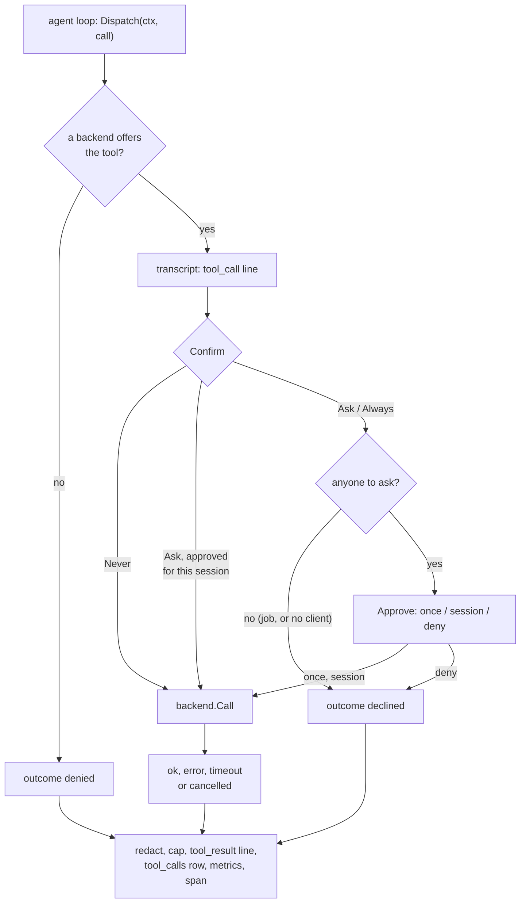

# dispatch

**Code:** `internal/dispatch/` (`doc.go`, `dispatch.go`, `dispatcher.go`,
`dispatcher_test.go`), and `cmd/merud/backends.go` for the MCP backend. The
commands backend lives in [commands](commands.md).
**Milestone:** v0.3
**Architecture:** [Agent loop](../../ARCHITECTURE.md#agent-loop) step 4,
[Approving a tool call](../../ARCHITECTURE.md#approving-a-tool-call)

## What it does

When the model asks for a tool, the agent loop hands the call to `dispatch`, and
`dispatch` alone runs it. It finds the tool's owner, asks you when the tool needs a
yes, runs the call, and records it in three places: the session transcript, the
`tool_calls` table in `meru.db`, and the tool metrics and span. AGENTS.md makes this
the one path to every tool, whether MCP, A2A, built-in or a local command, so every
call leaves the same trail.

A tool source is a **backend**. There are four: the MCP client pool, the A2A
client, merud's built-in tools and the local commands. `dispatch` knows only the
`Backend` interface; how MCP, A2A or a command works inside stays in their own
packages.

## The picture



A denied call still gets a `tool_call` line before its `tool_result` line, so every
call in a transcript has the same shape and replay can pair its lines.

## Walk through the code

### dispatch.go: the types

The skeleton types live here. `Backend` is the interface each tool source
implements:

```go
type Backend interface {
    Kind() string
    Tools() []engine.ToolSpec
    Confirm(name string) Confirm
    Locate(name string) (server, tool string)
    Call(ctx context.Context, name string, args json.RawMessage) (Result, error)
    Status() []rpc.ServerInfo
}
```

An **interface** in Go lists methods; any type that has them all satisfies it, with
no `implements` keyword. More in [go-basics/interfaces.md](go-basics/interfaces.md).
Four backends exist, which is what earns an interface here. `Kind` returns one of
four constants: `KindMCP`, `KindA2A`, `KindBuiltin` and `KindCommand`.

**Auditor.** A backend may have one more method, `AuditArgs`, which makes it an
`Auditor`:

```go
type Auditor interface {
    AuditArgs(name string, args json.RawMessage) json.RawMessage
}
```

The local commands need it. The model sends `{"repo":"meru"}`, but an audit log
must show the program that ran, `["git","-C","/home/you/repos/meru","log"]`.
`Dispatch` writes the `tool_call` line before the call runs, so it can't learn the
argv from the result. Instead it asks up front: after it finds the backend, it
checks whether the backend is an `Auditor`, and when `AuditArgs` returns something,
records that in place of the model's arguments, in the `tool_call` line, the
approval prompt, the row and the span. `nil` keeps the model's arguments.

```go
if a, ok := b.(Auditor); ok {
    if audit := a.AuditArgs(c.Name, c.Args); audit != nil {
        args = d.redactArgs(audit)
    }
}
```

`b.(Auditor)` is a **type assertion** on an interface: `ok` is true when the value
inside `b` also has the `AuditArgs` method. The backend still gets the model's own
arguments in `Call`; the audit changes only what gets recorded. A second option
was a field on `Result` that `dispatch` would prefer for the `tool_result` line and
the row. It would leave the `tool_call` line and the prompt showing the model's
arguments, so you would approve `{"repo":"meru"}` without seeing the command.

**Connector.** A backend may also have `ConnectMissing`, which makes it a
`Connector`:

```go
type Connector interface {
    ConnectMissing(ctx context.Context)
}
```

`ConnectMissing` tries once to reach each of the backend's servers that isn't
connected, and returns when every try has ended. The MCP backend is the one
`Connector`. `merud` never retries an MCP server in the background, so the agent
loop calls this at the start of a turn that offers tools, before it lists them
(see [mcp.md](mcp.md)). The built-ins, the commands and the A2A client have no
servers to reach this way, so they don't need a stub method.

**CallConfirmer.** `Confirm` answers per tool. `web_fetch` needs an answer per
call: a URL a search showed may run, a URL the model made up must ask. So a
backend may also have `ConfirmCall`:

```go
type CallConfirmer interface {
    ConfirmCall(c Call) (confirm Confirm, ok bool)
}
```

`confirmFor` asks it first, and falls back to `Confirm` when the backend isn't a
`CallConfirmer` or says `ok = false`:

```go
func confirmFor(b Backend, c Call) Confirm {
    if cc, ok := b.(CallConfirmer); ok {
        if confirm, ok := cc.ConfirmCall(c); ok {
            return confirm
        }
    }
    return b.Confirm(c.Name)
}
```

The built-ins are the one `CallConfirmer` (see [builtin](builtin.md)). Nothing
else in `Dispatch` changed: the answer feeds the same `approve`, with the same
job rule and the same lines.

`Call` carries one tool call: its ID, the tool's full name, the arguments, the
session, `Question` (the user's words, which the agent fills: this turn's question
and the earlier ones in the history), where the question came from, and two
functions: `Append` writes a line to
the transcript, and `Approve` asks the user. A nil `Approve` means nobody can answer.

**SessionFrom.** `Backend.Call` takes no session, but the `remember` tool needs one:
each memory file records the chat it came from. Rather than add a parameter every
backend would carry for one tool, `Dispatch` puts the call's session on the
context it hands the backend, and a backend reads it back:

```go
type sessionKey struct{}

func SessionFrom(ctx context.Context) string {
    s, _ := ctx.Value(sessionKey{}).(string)
    return s
}
```

`context.WithValue` returns a copy of a context that carries one extra value
under a key. The key is a private struct type, so no other package can read or
overwrite the value by mistake. `ctx.Value` returns `any`, and the `, ok` form of
the type assertion gives `""` instead of a panic when there is no session, as
outside a call.

**Result.Sources and CiteNumbers.** A `Result` holds `Text`, `IsError`, and
`Sources`: the excerpts from your files that `Text` holds, as `rpc.Citation`
values. `search_files` fills it; every other tool leaves it `nil`. `Dispatch`
passes it through untouched, and the agent adds it to the turn's sources.

Each excerpt needs a number that no other excerpt in the turn has, and only the
agent knows how many it has handed out. So the agent puts a counter on the
context, the same way the session rides there, and a backend reserves numbers
from it:

```go
ctx = dispatch.WithCiteNumbers(ctx, t.nextCites) // the agent, before Dispatch
first := dispatch.CiteNumbers(ctx, len(results)) // search_files, in Call
```

`CiteNumbers(ctx, n)` reserves `n` numbers and returns the first. Outside a
turn, or for `n` of 0, it reserves nothing and returns 1. The value on the
context is a plain function, `func(int) int`; the agent's version takes a lock,
so two calls that run at once get ranges that don't overlap.

### dispatcher.go: the Dispatcher

```go
type Dispatcher struct {
    rec    Recorder
    redact func(string) string
    log    *slog.Logger

    mu       sync.Mutex
    backends []Backend
    approved map[approvalKey]bool
}
```

`mu` is a lock that guards the two fields under it. The agent loop runs independent
calls at the same time, and merud may swap the MCP backend while a turn runs, so
both fields need it. `approved` holds your "for this session" answers, keyed by
session and tool. It lives in memory only, so it ends when merud stops and never
reaches `config.toml`.

`Recorder` is an interface with one method, `InsertToolCall`. `*store.Store`
satisfies it, and the tests pass a fake. Go's rule is to define an interface where
it's used, with only the methods the user calls.

**Tools, Asks and Replace.** `Tools` walks the backends in order and merges their
tools. When two backends offer the same name, the first keeps it and a warning goes
to the log. `find`, which picks the backend for a call, walks in the same order, so
the model always reaches the tool it saw. `Asks` reports whether a tool would ask
before it runs; the agent loop uses it to offer the "search" route only the
commands that don't ask. A tool no backend offers counts as asking. `Replace` swaps
in a new backend of one kind; merud calls it after the `configure` tool changes the
MCP servers.

**Dispatch.** The function runs eight steps, commented in the code. Four details
matter:

- **The call must reach the transcript before it runs.** If the `tool_call` line
  can't be written, the call ends with outcome `error` and doesn't run.
- **Redact, then cut.** `Redact` removes secret values from the arguments, the
  result and any error text. It runs before the cut, so a secret split by the cut
  still goes. The model gets up to 16,000 characters, with a note when the result
  was longer; the transcript and the row keep 4,000.
- **Timeouts versus cancellation.** Each backend enforces its own timeout. When
  the error wraps `context.DeadlineExceeded` and the turn's own `ctx` is still live,
  the backend's timeout fired: outcome `timeout`. When `ctx` itself has ended, you
  cancelled the turn: outcome `cancelled`.
- **The row outlives a cancelled turn.** `context.WithoutCancel(ctx)` makes a
  context that keeps `ctx`'s values (the trace) but never ends, so the
  `tool_calls` row still goes in after you press Esc. A failed row only logs a
  warning, because replay can rebuild it from the transcript.

**approve.** `approve` holds the rules from ARCHITECTURE.md:

| `Confirm` | Asks? | Choices offered |
| --- | --- | --- |
| `ConfirmNever` | never | none |
| `ConfirmAsk` | unless approved for this session | once, session, deny |
| `ConfirmAlways` | every time | once, deny |

A job (`Source == "job"`) and a client with no `Approve` function can't say yes, so
those calls end `declined` without a prompt. An answer the prompt didn't offer
counts as deny. Each answer gets an `approval` line in the transcript.

**The span.** `Dispatch` starts a `meru.dispatch` span and passes its `ctx`, with
the session added, to the backend, so the MCP pool's `tools/call <tool>` span nests under it. The span
carries `gen_ai.tool.name`, `meru.tool.kind`, `meru.tool.server`,
`meru.tool.outcome` and `meru.tool.approval`. Arguments and results go on it only
when `capture_content = true`; for a command the arguments are the argv.

**ConnectMissing.** The agent loop reaches the backends through the Dispatcher,
so the Dispatcher passes the call on:

```go
func (d *Dispatcher) ConnectMissing(ctx context.Context) {
    for _, b := range d.snapshot() {
        if c, ok := b.(Connector); ok {
            c.ConnectMissing(ctx)
        }
    }
}
```

`snapshot` copies the backend list under the lock, so a reload can swap the MCP
backend while the tries run. The backends go one after another; with one
`Connector` today, running them side by side would buy nothing.

**A denied name.** When no backend offers a tool, `guessLocation` splits its name
for the row: `a2a.` names an agent, `cmd.` a command, a dot an MCP server, and no
dot a built-in.

### cmd/merud/backends.go: the MCP backend

`mcpBackend` wraps `*mcp.Pool` so it satisfies `Backend`. Each method is a line or
two: `Confirm` asks the pool's confirm list, `Locate` splits `server.tool` at the
first dot, and `Call` keeps the result's text and error flag. `Status` joins the
pool's health report with its tool list for `meru tools list`. `ConnectMissing`
calls `pool.ConnectMissing`, which makes `mcpBackend` a `Connector`.

```go
var _ dispatch.Backend = mcpBackend{}
```

This line assigns an `mcpBackend` to a `Backend` and throws it away. It exists so
the compiler fails the build if `mcpBackend` ever misses a method.

`mcpServerConfigs` turns `[[mcp.servers]]` entries into `mcp.ServerConfig` values.
It parses each `timeout`, passes every `env` and `headers` value through `resolve`
(which swaps `secret:<name>` for the stored secret), and runs the pool's own
checks. Its errors name the server and the key, never a value, since the value may
be a secret.

## Go ideas used here

- **Interfaces** — `Backend`, `Auditor`, `Connector` and `Recorder`, and type
  assertions to find an `Auditor` or a `Connector`. More in [go-basics/interfaces.md](go-basics/interfaces.md).
- **`sync.Mutex`** — guards the backend list and the session approvals.
- **context** — cancellation, `context.WithoutCancel` for the row, and
  `context.WithValue` for the session. More in
  [go-basics/context.md](go-basics/context.md).
- **errors.Is** — sorts a failed call into `timeout` or `cancelled`. More in
  [go-basics/errors.md](go-basics/errors.md).
- **encoding/json** — `json.Compact` and `json.Valid` keep the arguments valid
  JSON in the transcript. More in [go-basics/json.md](go-basics/json.md).
- **Structs as map keys** — `approvalKey{session, tool}` works as a key because Go
  compares structs field by field.

## Try it

```sh
go test -race ./internal/dispatch/
go test -race -run MCP ./cmd/merud/
```

`TestDispatchOutcomes` runs one table row per outcome. `TestSessionApproval` walks
a series of calls through the approval rules. `TestRedaction` plants a secret in
the arguments and the error text and checks it reaches no line, row or prompt.
`TestSessionOnContext` checks that a backend reads the call's session with
`SessionFrom`. `TestCiteNumbersAndSources` puts a counter that has handed out
ten numbers on the context, has a backend reserve two, and checks that the
backend's `Sources` come back through `Dispatch` as `[11]` and `[12]`.
`TestAuditor` checks that an Auditor's arguments reach the line,
the prompt and the row, redacted. `TestCallConfirmer` checks that a per-call
answer wins, that `Confirm` decides when there is none, that the question
reaches the backend, and that a job's asking call is declined. `TestMCPBackend` runs the backend against a real
MCP server on 127.0.0.1.

## Why it's built this way

- **One function, no middleware chain.** Allowlist, approval, call and logging
  could be separate wrappers stacked around each other. One function that runs the
  steps in order reads top to bottom, and the order matters: the transcript line
  must come before the call.
- **No Go errors out of Dispatch.** The agent loop would only turn an error into
  text for the model. `Dispatch` does it once, so every caller gets the same
  wording and the same records.
- **The session on the context, not in the interface.** One tool needs it, so
  one small function beats a new parameter on every backend's `Call`.
- **Optional interfaces for the audit, the connect and the per-call confirm.**
  One backend needs each, so a type assertion beats a new method on `Backend`
  that three backends would stub out.
- **A repeated call never gets here.** When the model asks for a call it
  already made this turn, same name and same arguments, the agent hands back
  the earlier result and doesn't call `Dispatch` (see [agent](agent.md)). A
  repeat runs nothing, so it isn't a tool call and leaves no `tool_call` line or
  `tool_calls` row. Sending it through would log work that never happened and
  ask you a second time about a call that asks first.
- **A skill can't widen the allowlist.** A picked skill's `allowed-tools` only
  adds tools that `Tools()` already lists, so config stays the one place that
  turns a tool on.
- **Session approvals in memory.** Writing them to disk would make them outlive the
  session, which ARCHITECTURE.md rules out. Config stays the one place that grants
  lasting trust.
