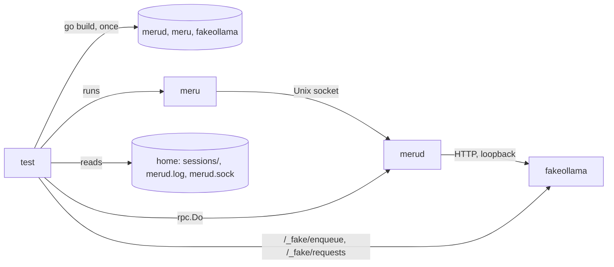
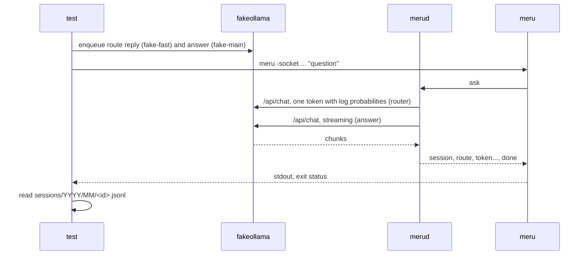

# e2e

**Code:** `test/e2e/` (`main_test.go`, `harness_test.go`, `ask_test.go`, `failure_test.go`,
`daemon_test.go`, `integration_test.go`, `race_test.go`, `norace_test.go`)
**Milestone:** v0.1
**Architecture:** [The shape: daemon + thin client](../../ARCHITECTURE.md#the-shape-daemon--thin-client),
[Privacy boundary](../../ARCHITECTURE.md#privacy-boundary)

## What it does

The end-to-end suite runs Meru the way a user does. It builds the real `merud`,
`meru` and `fakeollama` programs, starts them as separate processes, and checks
what comes out: stdout, stderr, exit statuses, the socket, and the files merud
writes. Unit tests call Go functions inside one process; these tests only see
what a person at a terminal would see, plus the files on disk.

Every test gets its own Meru home in a fresh temporary directory, with its own
`config.toml`, socket, log and fake Ollama on its own port. So the tests run in
parallel and never touch `~/.meru`.

## The picture



One question, as the tests drive it:



## Walk through the code

### main_test.go: build once

A package may define `TestMain`. When it does, `go test` calls it instead of
running the tests straight away, and the tests run when it calls `m.Run()`.
Meru's `TestMain` builds the three programs into a temporary directory first:

```go
args := []string{"build", "-o", dir + string(filepath.Separator)}
args = append(args, raceBuildFlags...)
args = append(args, "./cmd/merud", "./cmd/meru", "./cmd/fakeollama")
cmd := exec.Command("go", args...)
cmd.Dir = root
```

`exec.Command` runs another program, here the `go` command itself. `root` is
the module's root directory, which `go env GOMOD` reveals. Building once saves
about a second per test.

`raceBuildFlags` comes from one of two tiny files. `race_test.go` has the tag
`e2e && race`, and the go command sets the `race` tag itself under
`go test -race`; that file sets the flags to `-race`. `norace_test.go` has
`e2e && !race` and sets none. So `make e2e`, which passes `-race`, also builds
merud with the race detector, and a data race inside merud fails the run.

### harness_test.go: processes, homes and the fake

`startProc` starts one program and returns a `proc`:

```go
go func() {
    _ = cmd.Wait()
    close(p.done)
}()
t.Cleanup(func() {
    p.stop(t)
    checkNoRace(t, p)
})
```

The goroutine (a function running alongside the test) waits for the process to
exit and then closes the `done` channel. A closed channel never blocks, so any
code can ask "has it exited?" or wait for it with a deadline. `t.Cleanup`
registers a function that runs when the test ends: it sends SIGTERM, waits,
kills the process only if it ignores SIGTERM, and fails the test if the race
detector printed a report. No process outlives its test.

The process's stdout and stderr go into a `syncBuffer`, a `bytes.Buffer` with a
mutex (a lock), because `os/exec` writes to it from its own goroutine while the
test reads it.

`newHome` makes the private Meru home with `os.MkdirTemp`, not `t.TempDir`.
`t.TempDir` puts the test's name in the path, and macOS refuses a Unix socket
path longer than 104 bytes.

`fakeConfig` writes a `config.toml` that points `ollama.base_url` at the fake
and names three made-up models: `fake-fast`, `fake-main` and `fake-embed`. Fast
and main differ on purpose. The fake keeps a queue of scripted replies per
model, so a test queues the router's reply on `fake-fast` and the answer on
`fake-main`, and each call takes the right one.

`startFake` runs `fakeollama -addr 127.0.0.1:0`. Port 0 asks the operating
system for a free port, and the fake prints `listening on http://127.0.0.1:PORT`,
which the harness reads. The test then scripts the fake over HTTP:

| Helper | Endpoint | Does |
| --- | --- | --- |
| `enqueue` | `POST /_fake/enqueue` | Queues replies for one model |
| `failNext` | `POST /_fake/fail` | Fails the next request to a path |
| `requests` | `GET /_fake/requests` | Returns every request, with a `cancelled` flag |

`routeReply` builds the router's reply: one token with each route letter among
the alternatives. Ollama reports natural logarithms, so the helper passes
`math.Log(0.9)` for a probability of 0.9.

`startStack` puts a fake, a home and merud together, and `waitReady` runs
`meru ping` until it succeeds. If merud exits first, or 30 seconds pass,
`waitReady` fails the test and prints merud's stderr and `merud.log`, which
usually says what went wrong.

Two ways to ask a question:

- `runMeru` runs the `meru` program and returns its stdout, stderr and exit
  status. Use it to test what a user sees.
- `ask` calls `rpc.Do` from `internal/rpc`, the library `meru` itself uses, and
  returns every event. Use it to see what `meru` hides: the session ID and the
  route with its confidence.

No test uses a sleep to wait for something to happen. `waitFor` checks a
condition every 10 ms until it holds or a deadline passes, so a slow machine
makes a test slower, not flaky.

### The tests

| Test | File | Checks |
| --- | --- | --- |
| `TestAsk` | `ask_test.go` | `meru "question"` prints the answer and exits 0; the transcript holds a user line and an assistant line with token counts |
| `TestStreaming` | `ask_test.go` | Token events arrive in order and complete; meru's stdout grows piece by piece, each state a prefix of the final answer |
| `TestSessionContinues` | `ask_test.go` | A second question on the same session sends the first turn to the model; the transcript has four lines |
| `TestRouting` | `ask_test.go` | Clear winners give their route and probability; a low or letterless distribution gives the fallback, `search+tools` |
| `TestCancelMidAnswer` | `failure_test.go` | SIGINT to meru mid-answer: exit 130, the fake sees the call cancelled, no answer line, the next question works |
| `TestOllamaErrors` | `failure_test.go` | HTTP 500 on the router call, 503 on the answer, a stream that breaks part way: meru exits 1 with the reason, merud stays up |
| `TestOllamaDown` | `failure_test.go` | The fake stops: meru exits 1 naming `/api/chat` and "connection refused"; merud still answers a ping |
| `TestStartupRefusals` | `daemon_test.go` | Ollama 0.12.0, a non-loopback `base_url`, a non-loopback `otlp_endpoint`: merud exits 1, names the problem, leaves no socket |
| `TestSingleInstance` | `daemon_test.go` | A second merud on a held socket exits 1; the first keeps answering |
| `TestShutdown` | `daemon_test.go` | SIGTERM and SIGINT: merud exits 0, removes its socket, logs the stop |
| `TestFilePermissions` | `daemon_test.go` | Session directories 0700; transcript, socket and log 0600 |
| `TestNoTelemetryByDefault` | `daemon_test.go` | With no `otlp_endpoint`, merud contacts nothing but the fake |
| `TestIntegrationLiteTTFT` | `integration_test.go` | Real Ollama, lite profile: "Paris", and the first token within one second after two warm-up questions |

`TestNoTelemetryByDefault` can't watch merud's network connections without
root, so it sets traps. It starts a canary HTTP server in the test and points
the OpenTelemetry environment variables and the proxy variables
(`HTTP_PROXY`, `HTTPS_PROXY`) at it. Go's HTTP client sends any request for a
non-loopback host through the proxy, so a stray request from Meru's code or a
library would land on the canary. After one question and a clean shutdown,
which flushes any exporter, the canary must have seen nothing. Setting
`otlp_endpoint` to the canary makes the test fail with `POST /v1/metrics` and
`POST /v1/traces`, which shows the trap works.

### integration_test.go: the real Ollama

This file has the tags `e2e && integration`, so it builds only when you pass
both. It loads the default config from a home with no `config.toml`, which
gives the lite profile's model names and Ollama address without naming them in
the test. It skips itself when `/api/version` doesn't answer or `/api/tags`
lacks one of the three models.

It asks "What is the capital of France? Answer in one word." three times. The
first two warm the models and the caches; the third is the measurement. The
time runs from the moment the client sends the request to the first token
event, so it includes the router's call and the socket, as a user would feel
it. The test fails above one second, the v0.1 target in ROADMAP.md.

## Go ideas used here

- **`TestMain`** — setup that runs once before a package's tests. More in
  [go-basics/testing.md](go-basics/testing.md).
- **Build tags** — `//go:build e2e` keeps the suite out of `go test ./...`, and
  the `race` tag picks the build flags. More in
  [go-basics/build-tags.md](go-basics/build-tags.md).
- **`os/exec`** — start another program, feed it arguments and environment
  variables, collect its output and exit status.
- **Goroutines and channels** — one goroutine per process waits for it and
  closes a channel. More in [go-basics/goroutines.md](go-basics/goroutines.md)
  and [go-basics/channels.md](go-basics/channels.md).
- **`t.Cleanup` and `t.Parallel`** — cleanups run last-registered-first when a
  test ends, so merud stops before its fake; parallel tests each get their own
  home and ports.
- **Iterators** — `rpc.Do` returns an iterator the test ranges over. More in
  [go-basics/iterators.md](go-basics/iterators.md).
- **`sync/atomic`** — the canary counts requests without a lock. More in
  [go-basics/atomic.md](go-basics/atomic.md).

## Try it

```sh
make e2e                                             # what CI runs, with -race
go test -tags e2e -count=1 -v ./test/e2e/...         # every test, by name
go test -tags e2e -count=1 -run TestRouting -v ./test/e2e/...
go test -tags 'e2e integration' -count=1 -v -run Integration ./test/e2e/...
```

`make e2e` takes about seven seconds on an M-series Mac, most of it building
the three programs with the race detector. The integration test needs Ollama
running with the lite models pulled and prints the measured time to first
token, around 0.2 seconds on an M-series Mac with warm models.

## Why it's built this way

- **Real processes.** `internal/agent/e2e_test.go` already runs a turn inside
  one process. Only separate processes test the parts between them: flag
  parsing, signals, exit statuses, the socket file and its mode, and merud
  refusing to start.
- **A fake Ollama as its own program.** The fake speaks Ollama's real JSON, so
  merud's HTTP client code runs in full. Running it as a process, scripted over
  HTTP, lets a test stop it to simulate Ollama going away.
- **Build in `TestMain`, not `go run`.** `go run` would compile on every start,
  and the process it starts would be `go`, not merud, so signals would reach
  the wrong process.
- **Traps over packet capture.** Watching merud's connections would need root
  or a platform tool such as `lsof`. The canary and proxy trap work anywhere a
  test runs and fail loudly when something leaks.
