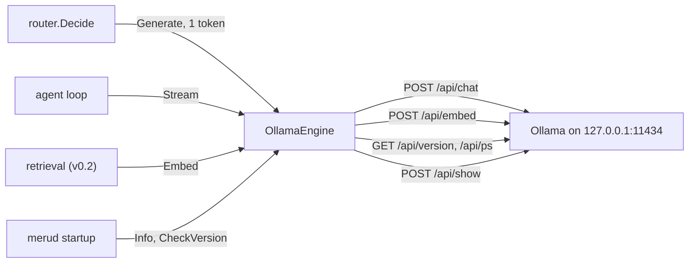

# engine

**Code:** `internal/engine/` (`engine.go`, `ollama.go`, `ollama_wire.go`, `version.go`,
`observe_test.go`, `images_test.go`), and the loopback check in `internal/loopback/loopback.go`
**Milestone:** v0.1; `Options.NoThink` in v0.4; `Message.Images` and
`Capabilities` with the desktop app's image attachments; `Details` with the
`about_meru` tool
**Architecture:** [Engine layer](../../ARCHITECTURE.md#engine-layer), [Model tiers](../../ARCHITECTURE.md#model-tiers)

## What it does

The engine package is the only code in Meru that talks to a model. It defines the
`Engine` interface, four methods that every model call goes through, and
`OllamaEngine`, which implements them by sending HTTP (Hypertext Transfer Protocol)
requests to Ollama on this machine. The agent loop and the router call the
interface and never see Ollama's JSON (JavaScript Object Notation).

## The picture



## Walk through the code

### engine.go

The interface and the types that pass through it: `Message`, `Options`,
`Completion`, `Delta`, `Usage`, and the log-probability types the router reads.
`Message.Images` holds the raw bytes of each image on a user message, and the
constant `Vision` names the capability a model needs to read them. `ToolUse`
names the one it needs to take a list of tools; Ollama refuses tools to a model
without it, such as `gemma3:12b`. A
Go *interface* is a list of method signatures; any type with those methods counts
as that interface. See [go-basics/interfaces.md](go-basics/interfaces.md).

### The loopback check

`NewOllama` calls `loopback.CheckURL`, which lives in its own package,
`internal/loopback/loopback.go`, so config, obs and the clients can share it. It
decides whether a URL points at this machine:

```go
if strings.EqualFold(host, "localhost") {
    addrs, err := net.DefaultResolver.LookupNetIP(ctx, "ip", host)
    // ... every address must be loopback
}
addr, err := netip.ParseAddr(host)
if !addr.Unmap().IsLoopback() { /* refuse */ }
```

It accepts an IP address in 127.0.0.0/8, `::1`, or the name `localhost` when
every address it resolves to is loopback. It refuses every other host name
without a lookup, because only `localhost` is reserved for this machine; another
name could point here today and elsewhere tomorrow. `Unmap` turns
`::ffff:127.0.0.1`, an IPv4 address written as IPv6, back into plain IPv4 so the
test sees it. `loopback.IsURL` wraps it for callers that want a yes or no.

### ollama.go

`NewOllama` checks the URL, turns `keep_alive` into the JSON Ollama accepts, and
copies the HTTP client so it can refuse redirects. A redirect could bounce a
prompt to another host. Its last argument is a `*slog.Logger` for debug lines;
nil means no lines.

`ContextLength` is an exported field, not an argument, so the many tests that
build an engine didn't change. `merud` sets it once, from
`[ollama] context_length`, before the first call. When it is above 0, every
chat call sends it as `num_ctx` in `options`, so each model loads with room for
Meru's prompts of about 20,000 tokens whatever Ollama's own default is. Every
call sends the same value, since Ollama reloads a model when `num_ctx` changes.

```go
if n, err := strconv.Atoi(s); err == nil {
    return json.RawMessage(strconv.Itoa(n)), nil // "-1" goes out as the number -1
}
```

Ollama reads a JSON number as seconds and a JSON string as a Go duration. The
string `"-1"` fails there with "missing unit", so whole numbers go out as numbers
and `"5m"` goes out as a string.

`Generate` posts to `/api/chat` with `stream: false` and copies the reply into a
`Completion`: the text, any tool calls, the stop reason, the counters and the log
probabilities. When the caller sets `Options.LogProbs` or `Options.NoThink`, the
request also carries `think: false`. MiniCPM5 is a "thinking" model: by default
its first tokens are hidden reasoning, so a one-token call would return the
probabilities of the word "We" instead of a route letter. We checked this
against Ollama 0.34. The agent's skill pick and the session summarizer set `NoThink`: one wants a
skill name within 20 tokens, the other two sentences, and neither gains from
reasoning first.

`Unload(ctx, model)` drops a model from Ollama's memory. It posts to
`/api/generate` with the model, no prompt, `stream: false` and `keep_alive: 0`,
which is how Ollama's docs unload a model; config's `keep_alive` doesn't apply
to this one call. Ollama answers at once and frees the memory a moment later,
so `merud` then asks `/api/ps` until the model is gone (`cmd/merud/models.go`).
`Pulled` reads `/api/tags` and now returns a `PulledModel` for each model, its
name and its size in bytes. Both sit outside the `Engine` interface, which keeps
its four methods.

`Stream` posts with `stream: true`. Ollama answers with NDJSON (newline-delimited
JSON): one JSON object per line. `Stream` returns an iterator that reads a line,
turns it into a `Delta` and hands it to the caller's loop. The last line has
`done: true` and carries the counters. See
[go-basics/iterators.md](go-basics/iterators.md).

```go
for sc.Scan() {
    var r chatResponse
    if err := json.Unmarshal(line, &r); err != nil { ... }
    if r.Done { yield(d, nil); return }
    if !yield(d, nil) { return } // the caller left the loop
}
```

A line with an `error` field ends the stream with an error. Ollama sends one
when its parser for the model's own format rejects what the model wrote,
most often a tool call, and by then it has already answered 200 OK. Ollama
0.34 sent `{"error":"XML syntax error on line 8: element <function> closed
by </parameter>"}` for a malformed call from a qwen model. `Stream` wraps
every such line in the sentinel error `ErrModelOutput`:

```go
var ErrModelOutput = errors.New("ollama couldn't read the model's output")
...
fail(fmt.Errorf("ollama stream: %w: %s", ErrModelOutput, r.Error))
```

A *sentinel* is one error value made once with `errors.New` for callers to
compare against. `%w` wraps it, so `errors.Is(err, engine.ErrModelOutput)`
finds it under any context the callers add, and the agent retries the round
(see [agent](agent.md)). `Stream` reads nothing more into Ollama's wording:
any error line counts. A failure before the stream starts, such as a non-2xx
status or Ollama down, is an `*APIError` or a transport error instead, and
asking the model again won't fix it.

`Embed` posts all texts to `/api/embed` in one request and checks that one vector
came back per text. `Info` reads `/api/version` and `/api/ps`.

`do` sends every request. It builds it with `http.NewRequestWithContext`, so
cancelling the context aborts the connection, even partway through a stream. On a
status outside 200–299 it reads Ollama's `{"error": "..."}` body and returns an
`*APIError`. Callers can find that error with `errors.As`, for example to spot a
404 for a model that isn't pulled. See [go-basics/http-clients.md](go-basics/http-clients.md).

`Details(ctx, model)` sends `POST /api/show` with `{"model": ...}` and
returns a `ModelDetails`: the `capabilities` list, such as
`["completion", "vision", "tools", "thinking"]`, the parameter size (`36.0B`),
the quantization (`Q4_K_M`) and the context length. Ollama files the context
length under the model's architecture, as `qwen35moe.context_length`, so
`showResponse.details` finds the key by its ending. The reply also holds the
license and the list of tensors, over 100 KB for a large model; the decoder
skips every field `showResponse` doesn't name.

`Capabilities(ctx, model)` returns `Details(ctx, model).Capabilities`.
`Pulled(ctx)` sends `GET /api/tags` and returns the names of the models Ollama
has on disk, such as `gemma3:12b` and `nomic-embed-text:latest`. None of the
three is one of the four `Engine` methods: only a question with images asks
`Capabilities`, only `about_meru` and the models in Settings ask `Details`, only
the models in Settings ask `Pulled`, and `merud` hands each caller the one method
it needs. The answer for each model goes in a map, `shown`, so a
second question about the same model doesn't wait on Ollama; a failed call
stores nothing. Several turns can ask at once, so a `sync.Mutex`, `mu`, sits
next to the map and every read and write takes it. `clone` hands the caller a
copy made with `slices.Clone`, so no caller can change the cached list.

### What each call logs and traces

Each HTTP call gets a client span from `startSpan`, named like `POST /api/chat`,
with `http.request.method`, `url.full` and the body's size. It nests under the
caller's span: the router's or the agent's `gen_ai.chat`. `do` adds
`http.response.status_code` and writes one debug line:

```text
msg="ollama http" method=POST path=/api/chat status=200 headers_ms=29 model=… stream=true num_predict=0 logprobs=false images=0
```

`headers_ms` is the time until Ollama's response headers arrived. A streaming
call then logs `ollama first token`, with the time since the request started
and `thinking_chunks`: how many chunks carried only hidden reasoning before the
first word. A thinking model can spend seconds there, and this count is how the
log shows it. Every chat call ends with `ollama done`, which holds Ollama's
counters: `prompt_tokens`, `output_tokens`, `load_ms`, `prompt_eval_ms`,
`eval_ms` and `tokens_per_s`. The streaming span also gets
`meru.ollama.thinking_chunks`.

A failed call goes through `fail`, which marks the span through
`obs.EndSpanErr` and logs `ollama error` with the path, the time and the error,
Ollama's own message included. `fail` returns the error too, so the caller
still decides what the user sees; the debug line adds only the timing.

The stream's span stays open while the caller reads the stream, and the
iterator ends it when the stream ends. No span or log line holds a message's
text, and none holds an image: the `images` field counts them.

### ollama_wire.go

Ollama's own JSON shapes (`chatRequest`, `chatResponse`, `wireLogProb`, …) and the
functions that convert them to and from Meru's types. Ollama nests a tool call's
name and arguments inside a `function` object, and a tool spec inside
`{"type": "function", "function": ...}`; this file is the only place that knows.

Ollama reports durations in nanoseconds. `time.Duration` also counts
nanoseconds, so `time.Duration(r.LoadDuration)` converts one to the other.

`chatMessage.Images` is a `[][]byte` with the JSON key `images`. Ollama wants
each image as a base64 string, and `encoding/json` writes any `[]byte` as
base64, so the conversion needs no code. `showRequest` and `showResponse` are
the two shapes of `/api/show`; Meru reads only `capabilities` from the reply.

### version.go

`CheckVersion` reads `/api/version` and fails below `MinOllamaVersion` (0.12.11,
the first release with log probabilities). The error names both versions, so the
user knows what they have and what to install.

## Go ideas used here

- **Interfaces** — a type satisfies an interface by having its methods. More in
  [go-basics/interfaces.md](go-basics/interfaces.md).
- **HTTP clients and context** — requests tied to a `context.Context`, bodies you
  must close. More in [go-basics/http-clients.md](go-basics/http-clients.md).
- **Iterators (`iter.Seq2`)** — a function you can range over. More in
  [go-basics/iterators.md](go-basics/iterators.md).
- **Struct tags** — the `` `json:"model"` `` text after a field tells
  `encoding/json` which key to use; `omitempty` drops empty fields.
- **`json.RawMessage`** — bytes of JSON passed through untouched. Tool arguments
  and `keep_alive` use it.
- **Arrays** — `[3]int` has a fixed length that is part of its type;
  `parseVersion` returns one, and two arrays compare with `==`.
- **`[]byte` in JSON** — `encoding/json` writes a byte slice as a base64
  string and reads one back the same way. `Message.Images` relies on it.
- **`sync.Mutex`** — `mu.Lock()` lets one goroutine at a time into the
  capabilities map. More in [go-basics/goroutines.md](go-basics/goroutines.md).

## Try it

```sh
go test -race ./internal/engine/
```

The unit tests start a fake Ollama with `httptest` and need no model.
`observe_test.go` checks the span, the status attribute and each debug line,
and that no message text reaches either. `TestStreamErrors` checks that an
error line, Ollama's XML error among them, satisfies
`errors.Is(err, ErrModelOutput)` and that a bad JSON line or a stream with no
done line doesn't. `TestStreamHTTPErrorIsNotModelOutput` checks that an HTTP
500 stays an `*APIError`. `images_test.go` checks that a user message's images
reach `/api/chat` as base64 strings and the system message carries none, and
`TestCapabilities` feeds `/api/show` replies for a model with vision, one
without, an older reply with no `capabilities` key and a 404; a good answer is
asked for once, a failure twice. `TestDetails` reads size, quantization and
context length from a reply shaped like Ollama 0.34's for `qwen3.6:35b`, checks
that changing the returned list leaves the cache alone, and that `Details` and
`Capabilities` share one request. To run against the real Ollama:

```sh
go test -tags integration -v -run Integration ./internal/engine/
```

You should see the one-token call pick `B` with a log probability near 0.

## Why it's built this way

- **Native `/api/chat`, not Ollama's OpenAI-compatible endpoint.** The native API
  returns the counters (`load_duration`, `eval_count`, …) that
  [Observability](../../ARCHITECTURE.md#observability) needs, and takes
  `keep_alive`.
- **`/api/chat` for the router too.** The design note sketches `/api/generate`, but
  Ollama 0.34 returns log probabilities from `/api/chat`, so one endpoint covers
  every answer. `/api/generate` with a raw prompt would also skip the model's chat
  template, and Meru would then have to know each model's template.
- **Thinking off only when a caller asks.** A call that asks for log
  probabilities wants the answer's tokens, so `LogProbs` turns thinking off by
  itself. The skill pick and the session summarizer need thinking off without log
  probabilities, so `Options` gained `NoThink`. It is a field on `Options`, not a new
  method: the `Engine` interface keeps its four methods. Every other call leaves
  the model's default alone.
- **Images as a field, capabilities as one method outside the interface.** A
  question with images still goes through `Stream`, so the images ride on the
  `Message`. Asking what a model can do is Ollama's business, and only the
  agent's image turns need it, so it stays off the interface, which keeps its
  four methods.
- **No overall client timeout.** A long answer can stream for minutes. The caller's
  context decides when to give up.
