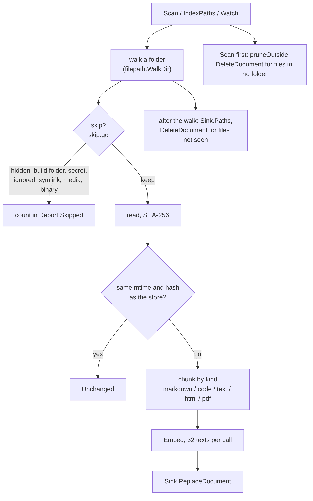

# index

**Code:** `internal/index/` (`doc.go`, `indexer.go`, `skip.go`, `ignore.go`,
`chunk.go`, `markdown.go`, `code.go`, `html.go`, `pdf.go`, `watch.go`,
`memories.go`, `files.go`)
**Milestone:** v0.2; the memory syncer and `files.go` v0.4
**Architecture:** [Storage](../../ARCHITECTURE.md#storage), [Retrieval](../../ARCHITECTURE.md#retrieval)

## What it does

`index` reads the folders you list under `[index] folders` in `config.toml` and
keeps the store's copy of them current. For each file it decides whether to read
it at all, cuts its text into chunks of about 500 tokens along the file's own
structure, turns each chunk into a vector with the embedding model, and hands
the document, chunks and vectors to the store. When a file changes it does that
again; when a file goes away it tells the store to drop it.

`merud` calls `Scan` at startup and runs `Watch` while it stays up. `IndexPaths`
indexes a few paths on demand; the watcher uses it, and `meru index` will.

From v0.4 the package also holds `Memories`, a small syncer that copies the memory
folder, `~/.meru/memory`, into the store's `memories` table (see
[memories.go](#memoriesgo) below), and four methods that let the file tools in
[builtin](builtin.md) see the folders the way the indexer does (see
[files.go](#filesgo) below).

## The picture



## Walk through the code

### indexer.go

`Indexer` holds the expanded folder list, the compiled `[index] ignore`
patterns, the chunk limits and two things it talks to: a `Sink` and an
`engine.Engine`.

`Sink` is a four-method interface for the part of the store the indexer uses:

```go
type Sink interface {
    Document(ctx context.Context, path string) (doc store.Document, ok bool, err error)
    ReplaceDocument(ctx context.Context, doc store.Document, chunks []store.Chunk, vecs []engine.Vector) error
    DeleteDocument(ctx context.Context, path string) error
    Paths(ctx context.Context, prefix string) ([]string, error)
}
```

`*store.Store` has these methods, so merud passes it straight in. The tests pass
a map-backed fake instead, which is why the interface lives here and not in
`store` (see [interfaces](go-basics/interfaces.md)).

`scanTree` walks one folder with `filepath.WalkDir` (see
[filepath](go-basics/filepath.md)). For each folder it asks `skipReason`; a
non-empty answer returns `fs.SkipDir`, so the walk never enters `node_modules`.
For each file it calls `indexFile`. After the walk it asks the store for every
path it holds under the folder and deletes the ones the walk didn't keep. That
one step removes deleted files and files a new ignore rule now covers. It
spares folders the walk couldn't read, so a permission problem doesn't wipe
their entries, and `Scan` leaves a folder that doesn't exist at all alone, in
case it lives on an unplugged drive.

`scanTree` only looks inside the folders it walks, so it never sees files from a
folder you took out of `[index] folders`. `pruneOutside` covers them. Before the
walks, `scan` calls it with the resolved folders. It asks the store for every
path (`Paths("")`) and deletes each one that sits under no folder, checked with
`within`, the same test `IndexPaths` uses before it returns `ErrOutsideFolders`.
`within` compares whole folder names through `filepath.Rel`, so `/notes` doesn't
claim `/notes-old/a.md`. The list of folders to keep holds each folder twice:
resolved, where the walk stores its files, and as written in config, so a folder
on an unplugged drive still keeps its entries. `slices.Concat` joins the two
lists into a new slice, which leaves both originals untouched. The removals count
in `Removed`, and one info line gives how many files went; the paths go to the
debug log only.

`indexFile` does the per-file work under a mutex, so `Scan` and the watcher
never store two versions of one file in the wrong order:

1. Check the size against `max_file_mb`, then read the file. `readFile` checks
   with `os.SameFile` that the file it opened is the one `Lstat` saw, so a file
   swapped for a symlink mid-scan doesn't get read.
2. Skip it as binary if the first 8 KB hold a NUL byte (PDFs excepted).
3. Hash it with SHA-256. If the store holds the same hash and the same mtime
   (to the second), stop: the file is unchanged.
4. Chunk it, number the chunks, embed them 32 at a time, and call
   `ReplaceDocument`.

An empty file gets a document row and no chunks; the store accepts a
`ReplaceDocument` with zero chunks, so the next scan sees it as unchanged.

**Re-embedding.** `Reembed` is `Scan` with the "unchanged" check in step 3
turned off: it chunks and embeds every file again. merud calls it in place of
`Scan` when `store.NeedsReembed` says some chunks have no vector, which happens
after the embedding model or its vector size changes. The `force` flag travels
from `scan` through `scanTree` and `indexFile` to `indexFileLocked`;
`IndexPaths`, and so the watcher, never forces.

A file that can't be read or parsed counts as `Failed` and the scan moves on.
An error from the engine or the store stops the scan, because Ollama being down
would fail every file after it too.

Each embedded text starts with the chunk's heading path. The third chunk of a
long "Garden > Spring" section doesn't repeat the heading line, and the path keeps
its vector about spring planting.

### skip.go and ignore.go

`skipReason` checks one entry in a fixed order and returns the first reason
that applies:

| Order | Reason | What it catches |
| --- | --- | --- |
| 1 | `symlink` | any symlink; the indexer never follows one |
| 2 | `secret` | `.env*`, `*.pem`, `*.key`, `id_rsa*`, `*.kdbx`, `credentials*`, `.netrc` and the rest |
| 3 | `hidden` | a name starting with `.` |
| 4 | `build-folder` | `node_modules`, `.venv`, `venv`, `vendor`, `target`, `dist`, `build`, `__pycache__` |
| 5 | `ignored` | `[index] ignore`, then each folder's `.gitignore` and `.meruignore` |
| 6 | `media`, `binary`, `unsupported` | by extension |

Secrets come first and nothing can re-include them: a key in the index would
end up in a prompt. Config patterns come next and a `.gitignore` can't undo
them either. Within the ignore files, git's rule holds: the last matching line
wins, and a deeper folder's file beats a shallower one's. `.meruignore` is read
after `.gitignore` in the same folder, so it can re-include with `!name`.

`ignore.go` turns each gitignore line into a regular expression:

```go
case c == '*' && strings.HasPrefix(glob[i:], "**/") && atSegmentStart:
    b.WriteString("(?:.*/)?") // zero or more folders
```

`*` becomes "anything but `/`", `**/` becomes "zero or more folders", and a
pattern with no slash in it gets `(?:.*/)?` in front so it matches its name at
any depth. `rulesFor` caches each folder's parsed files behind a mutex; every
walk and every change to an ignore file clears the cache for its folder.

### chunk.go

Every chunker works in **spans**: byte ranges `[start, end)` over the file's
text. A chunk's text is always an exact slice of the source, which keeps line
numbers right.

`pack` is the one grouping rule. It takes small units in order, such as
paragraphs, and adds them to the current chunk while the chunk stays within
`chunk_tokens × 4` characters. When the next unit doesn't fit, it closes the
chunk and starts the next one with the last `overlap_tokens × 4` characters of
the previous chunk, cut at a word boundary. A unit too big for any chunk gets
split first: at line breaks, then between words, and last every N characters.
No chunk passes the limit.

The token estimate is characters divided by four. Ollama doesn't expose the
embedding model's tokenizer, and a chunk a few tokens off target does no harm.

### markdown.go, code.go, html.go, pdf.go

| Kind | Split | Heading | Location |
| --- | --- | --- | --- |
| markdown | by `#` heading, then paragraphs | heading path, `Garden > Spring` | lines |
| Go | by top-level declaration, via `go/parser` | `Scan`, `Indexer.Scan`, `Report` | lines |
| other code, text | by blank-line blocks | none | lines |
| html | by `<h1>`–`<h6>`, then paragraphs | heading path | none |
| pdf | by page, then paragraphs | none | page |

Markdown treats a fenced code block as one paragraph, blank lines and all, so
`pack` splits it only when it alone passes the limit. A `#` inside a fence is
not a heading. A heading with nothing under it but another heading makes no
chunk; its title already sits in the path below.

The Go chunker uses the standard library's own parser, so it never mistakes a
brace in a string for the end of a function. A file that doesn't parse falls
back to blank-line blocks.

HTML goes through `golang.org/x/net/html`'s tokenizer, which copes with broken
markup. Scripts, styles, `<head>` and `<title>` drop out of the text, entities
decode, and white space collapses except in `<pre>`. `readHTML` keeps the first
`<title>` on the side, for `web_fetch`. The extracted text doesn't line up with lines in
the file, so HTML chunks carry no line numbers.

PDF text comes from `github.com/ledongthuc/pdf`, one page at a time, and chunks
never cross a page. That library panics on some broken files, so `chunkPDF`
recovers the panic and returns it as an error; the file counts as `Failed`. The
page reading lives in `pdfPages`, which `chunkPDF` shares with `PDFText`, and
the HTML reading in `readHTML`, which `chunkHTML` shares with `HTMLText`.
`ReadText` calls the two exported readers, and so does the `web_fetch` tool
in [builtin](builtin.md), so a page from the web reads the way a file on disk
does. A PDF with no text layer (a scan) fails the same way. PDF quality is an open
question for v0.2.

### watch.go

`Watch` asks the OS, through `fsnotify`, to report changes in every folder the
skip rules keep. Its loop is one `select` over four channels: the context, the
event stream, the error stream and a timer (see [select](go-basics/select.md)).

Each event records its path in `pending` with a due time 500 ms away. A later
event for the same path pushes the time back. When the timer fires, `flush`
hands every due path to `IndexPaths`, which indexes, re-indexes or removes it.
The wait lets an editor finish a save that takes several writes.

A new folder gets watches of its own before its files get indexed. A changed
`.gitignore` or `.meruignore` clears its cached rules and re-checks its whole
folder. When the OS refuses another watch (Linux's inotify limit, or the
open-file limit that macOS's kqueue hits), `Watch` logs one warning and keeps
the watches it has; the next startup scan catches changes in the rest.

### files.go

The file tools, `read_file`, `list_folder` and `grep`, must reach exactly what
search reaches. Rather than copy the skip rules, `builtin` calls four methods on
the same `*Indexer` that `merud` indexes with:

```go
func (ix *Indexer) Roots() []string
func (ix *Indexer) Check(p string) (Checked, error)
func (ix *Indexer) Walk(ctx context.Context, dir string, fn func(p string, info fs.FileInfo, reason string) error) error
func (ix *Indexer) ReadText(p string) (text Text, reason string, err error)
```

- **`Roots`** returns the `[index] folders` with symlinks resolved, leaving out
  the ones that don't exist now, then any folder `ReadAlso` added.
- **`Check`** takes one absolute path and returns a `Checked`: the path under
  its folder, the folder, what `os.Lstat` says, and a `Reason…` constant, or
  `""` when the indexer reads it. It runs `skipPath`, which checks every folder
  between the indexed folder and the path, then, for a file, the size cap and
  the NUL-byte test (`contentReason`). A path outside every folder fails with
  `ErrOutsideFolders`. `Check` first matches the path as written against each
  folder, as configured and resolved, so `~/notes/a.md` works when `~/notes`
  is a link. It never resolves anything below the folder, so a link there comes
  back as `symlink`.
- **`Walk`** walks a folder with `filepath.WalkDir`, which never follows a
  link, and calls `fn` for each entry with its reason. It skips the inside of a
  skipped folder itself; `fn` may return `fs.SkipDir` or `fs.SkipAll`.
- **`ReadText`** returns a `Text`: the file's kind and its pages. A PDF has one
  page per PDF page; every other kind has one page, the whole text. HTML comes
  back as the text `readHTML` pulls out. It opens the file through an `os.Root`
  on its folder, so `..` or a link swapped in after the check can't lead out,
  and it checks the size and the NUL byte again. `reason` is set when the file
  turns out to be skipped; `err` when it can't be read or a PDF has no text.

**`ReadAlso(dir)`** adds a folder the four methods reach but `Scan` and the
watcher never see. `builtin.New` adds the `[skills] output_dir` this way, so the
model can `read_file` and `grep` what `write_file` wrote, what `web_fetch`
downloaded and the mail attachments the `google` server saved, under the same
rules: no symlinks, no hidden or secret files, the size cap. Nothing in the
folder reaches the store or search, so a web page or an attachment can't reach
a later turn through search. `New` runs once at startup, before any tool call,
because the methods read the list without a lock.

**`Folders()`** returns the `[index] folders` alone, without what `ReadAlso`
added. `search_files` names these in its description, since search reaches
only them. `locate` loops over `slices.Concat(ix.folders,
ix.readOnly)`, a new slice that holds both lists.

`Check` and `Walk` clear the cached ignore rules for the folder first, so a
`.meruignore` you edited a moment ago counts even with `[index] watch = false`.
The four methods need no store and no engine, so a test can build the
`Indexer` with `New(cfg, nil, nil, nil)`.

### memories.go

Memory files differ from the `[index]` folders in three ways, so they get their own
small syncer instead of the `Indexer`. They sit in one folder `merud` owns. Each is
one short fact, so it needs no chunking and becomes one row with one vector. And
they go to their own tables, `memories`, `memory_vec` and `memory_fts`, not to
`documents` and `chunks`. The syncer borrows the indexer's batch size (32 texts per
`Embed` call) and its 500 ms debounce.

`Sync` compares the files with the table:

1. `memory.Store.List` reads every memory file.
2. `MemoryIDs` returns what the store holds for each memory ID: its mtime, a hash,
   and whether it still has a vector.
3. A memory whose mtime and hash match, and which has a vector, is unchanged. Every
   other one gets embedded and stored with `ReplaceMemory`.
4. A stored memory whose file is gone gets `DeleteMemory`.

The hash is SHA-256 over the parsed parts the store keeps (kind, created date,
source and text), each followed by a zero byte, so two different memories can't run
together into the same bytes. A memory past 4 KiB, which only a hand edit makes,
sends only its first 4 KiB to the embedding model, cut at a character boundary by
`cutText`; keyword search still covers the whole text.

When `List` can't read some files, `Sync` stores the rest and removes nothing. It
can't tell a file it couldn't read from one that is gone, and a memory shouldn't
drop out of recall over a permission problem. A mutex lets one `Sync` run at a time,
because the watcher, a memory op and the `remember` tool can all ask for one at
once.

`Watch` runs `Sync` once, then again each time the folder has been quiet for 500 ms
after a change. It watches the memory folder and each kind folder, and adds a watch
for a new kind folder before the next sync. `watch.go` keeps a due time for each
changed path; this watcher resets one timer on every event, because `Sync` reads
every file anyway and has no use for a list of changed paths.

## Go ideas used here

- **filepath.WalkDir and fs.SkipDir** — walking a folder tree and pruning it.
  More in [go-basics/filepath.md](go-basics/filepath.md).
- **select** — waiting on several channels at once. More in
  [go-basics/select.md](go-basics/select.md).
- **Interfaces defined by the user** — `Sink` lists only what the indexer calls.
  More in [go-basics/interfaces.md](go-basics/interfaces.md).
- **sync.Mutex** — `fileMu` and `rulesMu` each guard the fields declared next to
  them.
- **Type switches** — `declName` branches on the kind of Go declaration. More in
  [go-basics/type-switches.md](go-basics/type-switches.md).
- **recover** — a deferred function in `chunkPDF` turns the PDF library's panic
  into an error.
- **iota** — numbers the four file outcomes in `indexer.go`.

## Try it

```sh
go test -race ./internal/index/
go test -race -run TestSkipRules -v ./internal/index/
go test -race -run TestWatch -v ./internal/index/
go test -race -run 'TestMemory' -v ./internal/index/
```

`store_test.go` runs the indexer against the real SQLite store to check the
contract between the two packages: a deleted file in `notes` leaves
`notes2/c.md` alone (the store treats a prefix as a folder), an empty file
stores with zero chunks, and after a change of embedding model `Scan` leaves
the vectors missing while `Reembed` restores them. `TestScanDropsFoldersLeftConfig`
indexes `notes` and `notes-old`, then scans with a new folder list: dropping
either one, dropping both, keeping both, and keeping a folder that no longer
exists on disk. Each case checks `Removed`, the counts of documents, chunks and
vectors, and a keyword search for a word from each file.

`TestSkipRules` builds a folder with one file for every skip rule and checks
what got indexed and the count for each reason. `TestWatch` starts `Watch` on a
temporary folder, then creates, edits and deletes files and polls the fake
store until each change shows up.

`memories_test.go` runs the memory syncer against a real memory folder and the real
store: add, a sync with nothing to do, a hand edit, a touched file, a forget, a
file too big to read (its row stays), an embedding model change (the memory gets a
vector again), and the watcher picking up a new file, a deleted one and a file in a
new kind folder.

`files_test.go` checks the four methods the file tools use: `Check` on a kept
file, a secret, a file under a folder a `.meruignore` names, a NUL byte, a file
over the cap, a link and a path through one, a path outside and a missing one;
`Walk`'s reasons and its stops; and `ReadText` for each kind of file.

## Why it's built this way

- **One grouping rule for every kind.** Each chunker only says where the
  paragraphs are; `pack` does the sizing and overlap for all of them. A new file
  kind needs a function that finds its paragraphs, nothing more.
- **Hash every file on every scan.** Comparing mtimes alone would skip reading,
  but some sync tools and editors keep the mtime when content changes. Reading a
  few thousand small files at startup takes seconds.
- **Symlinks are never followed.** Following links inside the folder would index
  some files twice and risk loops; following links out of it would break the
  promise that Meru reads only the folders you list. The target of an inside
  link is indexed at its real path anyway.
- **Rejected:** a tokenizer for exact token counts (Ollama doesn't expose one),
  a Markdown library (headings and fences are all the chunker needs), and cgo
  PDF libraries such as poppler bindings (Meru builds without a C compiler).
