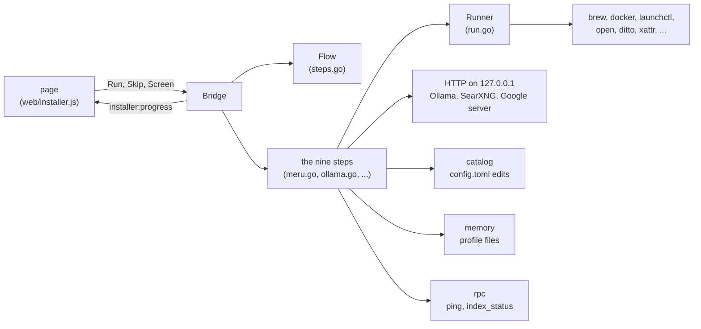

# installer

**Code:** `internal/installer/` (`doc.go`, `run.go`, `steps.go`, `bridge.go`,
`machine.go`, `configfile.go`, `meru.go`, `ollama.go`, `folders.go`,
`websearch.go`, `commands.go`, `google.go`, `profile.go`, `merud.go`,
`assets.go`, the page in `web/`, and `launchd/com.meru.merud.plist`, a copy of
the one in `deploy/`), plus `cmd/meru-installer/main.go` and its `Info.plist`
**Milestone:** the Mac installer, asked for ahead of v0.5
**Architecture:** [Installer](../../ARCHITECTURE.md#installer)

## What it does

The Mac installer is "Install Meru.app" on each release's disk image. It walks a
person through nine steps, from checking the Mac to starting `merud`, and each step
says what it does and what it downloads before it runs.

The installer runs before `merud` exists, so it has to do what the clients never
do: run programs such as `brew` and `docker`, and write files such as launchd jobs.
To keep that safe and testable, the code splits in two, as the desktop app's does.
`cmd/meru-installer` opens the window with Wails, a Go library that shows an HTML
page in the Mac's own WebView. Everything else sits here, in `internal/installer`,
which doesn't import Wails, so its tests run on any machine with fakes in place of
the real programs and servers.

## The picture



The page calls the Bridge; the Bridge asks `Flow` whether a step may start, runs
it, and sends each line of news back to the page. Every program goes through the
Runner, every `config.toml` change through `catalog`.

## Walk through the code

### run.go

This is the only file that starts programs. `Programs()` returns the allowlist, a
map from each program's name to the absolute paths it may live at:

```go
"docker": {
    "/usr/local/bin/docker", "/opt/homebrew/bin/docker", "~/.orbstack/bin/docker",
    "~/.docker/bin/docker", "/Applications/Docker.app/Contents/Resources/bin/docker",
},
```

`Locate(program, home)` returns the first path that exists, or `ErrNotAllowed`
for a name the map lacks, or `ErrMissing` when none of the paths exists. The
installer never searches `PATH`, because an app opened from Finder gets a short
`PATH` that holds neither Homebrew nor Docker.

`Runner` is a function type:

```go
type Runner func(ctx context.Context, program string, args []string, line func(string)) (string, error)
```

Any function with that signature is a Runner. `ExecRunner(home)` returns the real
one: it finds the program with `Locate`, runs it with `exec.CommandContext`, which
takes each argument as its own string and uses no shell, and hands each line of
output to `line` as it comes, so the screen shows `brew` and `docker` working. The
tests pass a fake that records each call and runs nothing. `runLines` joins stdout
and stderr through an `io.Pipe` and reads it in a goroutine while the program
runs.

### steps.go

`Flow` holds the nine steps and their states: pending, running, done, failed or
skipped. `Start` moves a step to running and refuses while another runs, `Finish`
moves it to done or failed with the reason, and `Skip` refuses for About you,
the one step with `Skippable` false. A `sync.Mutex` guards the list, because Wails
runs each call from the page on its own goroutine. Each `Step` carries the text
its screen shows: what it does, why, and what it costs.

### bridge.go

The `Bridge` is what the window binds. `Detect` looks for work an earlier run
did and notes it on each step. `Screen(id)` returns the data a step's screen
needs, such as the Mac's facts or the folder list. `Run(id, input)` asks `Flow`,
calls the step, and records how it ended; a step that fails comes back as a
failed step with its reason, not as an error, so the page can show Retry and
Skip. `Links()` maps each name a screen may open to a fixed `https` address, so
the page can never open an address of its own.

### machine.go

`CheckMachine` asks `sysctl` for the memory and chip, `sw_vers` for the macOS
version and `df` for the free disk, and fills in the model choices from
`config.Recommendations` (see [config](config.md)).

### configfile.go

`Paths` names every place the installer writes, all under one home folder, so the
tests point it at `t.TempDir()`. `EnsureConfig` writes the config template when
`config.toml` is missing, through a temporary file that must load first.

### meru.go

`InstallMeru` copies `meru`, `merud` and Meru.app from the payload inside the
installer's bundle with `ditto`, each to a new name first and then renamed over
the old one, because writing over a running `merud` would make macOS stop it. It
clears the quarantine mark with `xattr` only when the user ticked the box.
`ensurePath` adds the `PATH` line to `~/.zshrc` once.

### ollama.go

`InstallOllama` tries `brew install ollama`; when the Runner says `brew` is
missing, it downloads Ollama.app from Ollama's site, unpacks it with `ditto`, and
checks its signature with `codesign`. `PullModel` sends `POST /api/pull` and reads
the answer one JSON object per line. `readPull` adds up each layer's `completed`
and `total`, so the bar shows the whole model:

```go
if l.Digest != "" && l.Total > 0 {
    layers[l.Digest] = layer{completed: l.Completed, total: l.Total}
}
```

### folders.go

`SuggestFolders` lists the folders config has, then Documents, Desktop and Notes,
each with a file count that stops at 20,000 files or two seconds. `SaveFolders`
writes `[index] folders` with `catalog.SetTableLists`.

### websearch.go

`SearXNGSettings` writes the `settings.yml`: JSON on, a random `secret_key` from
`crypto/rand`, the limiter off. `DockerRunArgs` builds the `docker run` arguments,
publishing port 8080 of the container on `127.0.0.1:8888` only. `SetUpWebSearch`
keeps a SearXNG that already answers, and otherwise pulls the image, starts the
container and waits for `VerifySearXNG`, one test search, to pass. Then it sets
`[web] searxng_url` and makes sure `[builtin] tools` has both web tools.

### commands.go

`SampleBlocks` finds each commented `# [[commands]]` sample in the config template
and takes the `# ` off its lines. `SampleCommands` marks which ones this Mac can
run: a sample whose program isn't installed, or whose `under` folder is missing,
can't be ticked, because `merud` refuses to start with a bad `under`. A program
outside launchd's short `PATH`, such as `gh` from Homebrew, gets its full path in
`argv`. `SaveSkillsAndCommands` appends the ticked ones with
`catalog.AppendCommand` and takes the built-in skills out of `[skills] disabled`.

### google.go

`GoogleInput.check` refuses an empty field, and any space, quote or `$`, before
anything is written, and its messages never quote the secret. `WriteStartScript`
writes `start.sh` through a temporary file made with mode `0600`, sets `0700`, and
renames it into place, so no other user can read the secret at any moment.
`GooglePlist` and `loadJob` start it at login. `SetUpGoogle` waits up to three
minutes for the server, because its first start downloads it, then adds the
catalog's `google` entry.

### profile.go

`SaveProfile` writes "Name: …", "Email: …" and "Answers: …" as memory files
through `internal/memory`, the files `meru setup user` makes. A field that didn't
change keeps its file. `LoadProfile` reads them back for a second run.
`Profile.Check` requires the name, and the email after the Google step.

### merud.go

`MerudPlist` fills in the plist from `deploy/launchd`, embedded with `//go:embed`
from a copy in `launchd/`, because an embedded file must sit in the package's
folder; `TestMerudPlistIsDeployCopy` keeps the two equal. `StartMerud` loads the
job and waits for `Ping`. `FollowScan` asks `index_status` every two seconds while
`merud`'s own startup scan runs, and stops watching after two minutes; the scan
carries on in `merud`.

### assets.go and web/

`Assets(fallback)` serves `web/` and passes any other path to `fallback`, which
the window sets to Meru.app's page. So `app.css`, the fonts and the logo come from
Meru.app, and the installer looks the same without a second copy.
`installer.css` adds the layout and a dark palette for
`prefers-color-scheme: dark`. `installer.js` draws one screen per step and calls
the Bridge by name through Wails' runtime.

## Go ideas used here

- **Function types.** `Runner` is a type whose values are functions, so a test
  passes a fake without an interface. More in
  [go-basics/interfaces.md](go-basics/interfaces.md).
- **os/exec with no shell.** Each argument is its own string. More in
  [go-basics/os-exec.md](go-basics/os-exec.md).
- **Mutex.** `Flow` guards its steps with a `sync.Mutex`. More in
  [go-basics/goroutines.md](go-basics/goroutines.md).
- **embed.** The page and the plist ride inside the binary. More in
  [go-basics/embed.md](go-basics/embed.md).
- **Iterators.** `rpc.Do` returns one, and `Ping` ranges over it. More in
  [go-basics/iterators.md](go-basics/iterators.md).
- **Build tags.** `cmd/meru-installer` builds only with `-tags desktop`. More in
  [go-basics/build-tags.md](go-basics/build-tags.md).

## Try it

```sh
go test ./internal/installer/        # every step, with fakes
go test ./internal/policy/           # the allowlist and import rules
make installer-app                   # bin/Install Meru.app, with its payload
make dmg                             # dist/Meru-dev-macos-arm64.dmg
```

The tests start no real program and reach no real server: a fake Runner stands in
for `brew`, `docker` and `launchctl`, `httptest` servers stand in for Ollama,
SearXNG and the Google server, and a small socket server stands in for `merud`.

## Why it's built this way

A shell script already installs Meru (`scripts/install.sh`), and it could have
grown a web of prompts. A window suits people who don't use Terminal, and a Go
package lets CI test each step, which a script's `curl | bash` flow doesn't.

The installer could have asked `merud` to do the work, as the desktop app does.
But nothing runs `merud` until the last step, and `merud` needs Ollama and the
models before it starts, so the installer must act on its own. The allowlist keeps
that power narrow: ten programs at fixed paths, no shell, and a policy test that
fails the build if a second way to start a program appears.

Each step writes config through `catalog`, the code `meru setup` and `merud`
already use, so the comments in `config.toml` survive and a bad write never lands.
The profile goes through `memory` for the same reason: one format, whoever writes
it.
