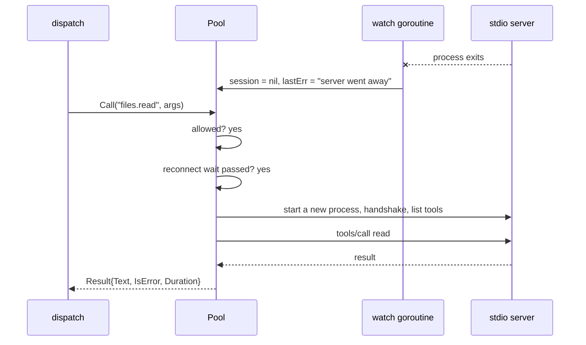

# mcp

**Code:** `internal/mcp/` (`doc.go`, `config.go`, `pool.go`, `call.go`, `stdio.go`,
and the tests `config_test.go`, `pool_test.go`, `call_test.go`, `headers_test.go`,
`stdio_test.go`, `stdio_unix_test.go`, `testserver_test.go`)
**Milestone:** v0.3
**Architecture:** [MCP](../../ARCHITECTURE.md#mcp),
[Agent loop](../../ARCHITECTURE.md#agent-loop) step 4

## What it does

MCP, the Model Context Protocol, is how Meru gets tools. An MCP server is a program
that offers named tools, each with a description and a JSON Schema for its
arguments. Meru is the client: it asks each server what it offers, shows the model
the tools you allowed, and runs the ones the model asks for.

This package holds the client side. A `Pool` starts or connects to every server in
config, keeps each server's allowed tools, and renames them `<server>.<tool>`.
`dispatch` reaches the pool through `mcpBackend` in `cmd/merud/backends.go`: it
reads `Pool.Tools` for the prompt and calls `Pool.Call` to run a tool. `dispatch`
owns the confirmation prompt, the `tool_calls` row and the metrics; see
[dispatch.md](dispatch.md).

The package speaks both transports in the current MCP spec, through the official
Go SDK (`github.com/modelcontextprotocol/go-sdk`):

- **stdio.** The Pool starts the server as a child process and sends JSON-RPC
  messages, one per line, over its stdin and stdout.
- **Streamable HTTP.** The Pool connects to a server that is already running, at a
  URL. The URL must be loopback unless the entry says `network = true`.

## The picture

```mermaid
flowchart LR
    cfg["[[mcp.servers]] in config.toml"] --> v["Validate"]
    v --> np["NewPool"]
    np -- "command" --> child["child process<br/>stdin / stdout"]
    np -- "url" --> http["Streamable HTTP<br/>on loopback"]
    child --> list["list tools, keep allowed,<br/>rename server.tool"]
    http --> list
    list --> tools["Pool.Tools()"]
    loop["agent loop / dispatch"] --> tools
    loop --> call["Pool.Call(name, args)"]
    call -- "not in allow" --> denied["ErrNotAllowed<br/>(no server contact)"]
    call -- "allowed" --> child
    call -- "allowed" --> http
```

A call from the agent loop, when the server has died since the last call:



## Walk through the code

### config.go

`ServerConfig` is one `[[mcp.servers]]` entry. merud fills it from `config.toml`
(`mcpServerConfigs` in `cmd/merud/backends.go`, which also swaps `secret:<name>`
values for the stored secrets); this package only defines it and checks it.

```go
type ServerConfig struct {
    Name    string
    Command string
    Args    []string
    Env     map[string]string
    URL     string
    Network bool
    Headers map[string]string
    Allow   []string
    Confirm []string
    Timeout time.Duration
}
```

`Validate` collects every problem before it returns, then joins them with
`errors.Join`, so you fix `config.toml` in one pass instead of one error per run.
It refuses:

- an entry with both `command` and `url`, or neither;
- a URL that isn't loopback, unless `network = true` (the rule lives in
  `loopback.CheckURL`, which the engine and the telemetry exporter also use);
- a name with anything but letters, digits, `-` and `_`. The name becomes the
  prefix of every tool name, so a `.` in it would make `a.b.c` ambiguous;
- `*` or any other wildcard in `allow` or `confirm`. Deny-by-default means you name
  each tool. A wildcard would also let in tools a server adds in a later release
  that no one has read;
- `headers` on a stdio entry, a header name with a space, colon or line break, or
  a header value with a line break, which could smuggle in a second header;
- a `confirm` entry missing from `allow`. That tool never reaches the model, so
  the entry does nothing, and it is almost always a typo.

`ValidateAll` also refuses two servers with one name, because their tool names
would collide.

### stdio.go

`newStdioTransport` builds the child process:

```go
cmd := exec.CommandContext(procCtx, cfg.Command, cfg.Args...)
cmd.Env = childEnv(cfg.Env)
cmd.Stderr = &stderrLog{log: log.With("mcp_server", cfg.Name)}
cmd.WaitDelay = terminateWait
return &mcp.CommandTransport{Command: cmd, TerminateDuration: terminateWait}
```

- `exec.CommandContext` runs the program directly, with no shell. More in
  [go-basics/os-exec.md](go-basics/os-exec.md).
- `childEnv` hands the child a short list of merud's variables (`PATH`, `HOME` and
  a few that Windows programs need) plus the entry's own `env`. The rest of merud's
  environment stays out, because it may hold another tool's API key.
- `stderrLog` copies each line the server writes to stderr into merud's log at
  debug level. It cuts lines at 1 KiB and stops after 64 KiB, so a noisy server
  can't fill the disk.
- The SDK's `CommandTransport` shuts a child down the way the MCP spec asks: close
  its stdin, wait, send SIGTERM, wait, then kill. `terminateWait` sets each wait to
  two seconds.

### pool.go

`NewPool` validates the config, then connects each server in turn:

```go
s.mu.Lock()
err := p.connectLocked(ctx, s)
s.mu.Unlock()
if err != nil {
    log.Warn("mcp server failed to start", ...)
    continue
}
```

A server that fails to start doesn't stop the others. The Pool logs it, `Status`
reports it, and a later call tries again.

`tryConnectLocked` holds the details:

1. It creates the child's process context from `context.Background()`, not from
   `ctx`. merud passes `NewPool` a startup context, and the child must outlive it.
   `s.stop` cancels this context at `Close`.
2. It runs the MCP handshake and lists the tools, both bounded by
   `connectTimeout` (30 s).
3. `allowedTools` keeps the tools in `allow`, renames each to `<server>.<tool>`,
   and sorts them. A stable order keeps the prompt the same from turn to turn.
4. It starts a goroutine, `watch`, that blocks on `cs.Wait()` until the session
   ends. When a server dies, `watch` marks it disconnected at once and reaps the
   child process.

**Reconnects.** The rule is: a dead server restarts on the next call to one of its
tools, at most once every 10 seconds (`defaultReconnectAfter`). A call inside that
wait fails fast with `ErrUnavailable`. There is no background restart loop, so a
server that crashes on start doesn't spin, and a server nobody calls stays down
until someone needs it. `Tools` keeps listing a dead server's tools so the model
can still call one and bring it back.

Each `server` has a `sync.Mutex` next to the fields it guards. Calls lock it only
to read or swap the session, never during the tool call itself, so many calls to
one server can run at once.

`Close` ends every session, cancels every process context, and then waits on the
`watchers` wait group until every `watch` goroutine has returned.

**Headers.** A Streamable HTTP server that wants an API key gets it in `Headers`.
`httpClient` wraps Go's default transport in a `headerTransport`, an
`http.RoundTripper` (the interface an `http.Client` sends each request through):

```go
func (t *headerTransport) RoundTrip(req *http.Request) (*http.Response, error) {
    if req.URL.Host != t.host {
        return t.base.RoundTrip(req)
    }
    r := req.Clone(req.Context())
    for k, v := range t.headers {
        r.Header.Set(k, v)
    }
    return t.base.RoundTrip(r)
}
```

A `RoundTripper` must not change the request it gets, so it sets the headers on a
copy. It adds them only for the server's own host: a server marked
`network = true` may redirect elsewhere, and the key must not follow. More on
clients and transports in [go-basics/http-clients.md](go-basics/http-clients.md).

### call.go

`Call` does four things in order:

```go
s, tool, known := p.lookup(name)
allowed := known && s.allow[tool]
...
if !allowed {
    return Result{}, fmt.Errorf("%w: %q", ErrNotAllowed, name)
}
```

1. **Allowlist.** It splits `files.read` at the first `.` and checks the server's
   `allow` list. A tool outside it gets `ErrNotAllowed` before any server hears
   about the call. `dispatch` only calls tools the pool listed, so it records a
   made-up name as `denied` before the pool sees it.
2. **Arguments.** They must be a JSON object; empty means `{}`.
3. **Session.** `sessionFor` returns the live session, restarting the server if
   the reconnect wait has passed.
4. **Call.** `cs.CallTool` runs under a timeout (60 s unless the entry sets
   `Timeout`). If you cancel `ctx`, or the timeout passes, the SDK sends the server
   a `notifications/cancelled` message and `Call` returns an error that wraps
   `context.Canceled` or `context.DeadlineExceeded`.

`toResult` turns the server's answer into a `Result`: the text blocks joined by
newlines, a placeholder such as `[image image/png]` for other content, the
structured content as raw JSON, and the server's `isError` flag. A tool that
reports failure is a normal result; the model reads the text to learn why.

**Spans.** Each call gets a span named `tools/call <tool>`, with the attribute
names from the OpenTelemetry MCP semantic conventions: `mcp.method.name`,
`gen_ai.tool.name`, `gen_ai.operation.name = execute_tool`, `network.transport`
(`pipe` for stdio, `tcp` for HTTP), `mcp.session.id` and `mcp.protocol.version`.
Meru adds `meru.tool.server` and `meru.tool.allowed`. `error.type` says how a call
failed: `tool_error` (the convention's name), or Meru's `denied`, `unavailable` or
`timeout`. The arguments and result text go on the span only when
`capture_content = true`.

## Go ideas used here

- **os/exec** — start a program and talk to its stdin, stdout and stderr. More in
  [go-basics/os-exec.md](go-basics/os-exec.md).
- **encoding/json and json.RawMessage** — pass tool schemas and arguments through
  without decoding them. More in [go-basics/json.md](go-basics/json.md).
- **context** — `Call` stops when its context ends. More in
  [go-basics/context.md](go-basics/context.md).
- **goroutines and sync.WaitGroup** — `watch` runs beside everything else, and
  `Close` waits for it. More in [go-basics/goroutines.md](go-basics/goroutines.md).
- **errors.Join, `%w` and errors.Is** — `Validate` joins its problems;
  `ErrNotAllowed` travels up wrapped. More in [go-basics/errors.md](go-basics/errors.md).
- **Type switches** — `toResult` handles each kind of content. More in
  [go-basics/type-switches.md](go-basics/type-switches.md).
- **Iterators** — `cs.Tools` pages through the server's tool list. More in
  [go-basics/iterators.md](go-basics/iterators.md).
- **Build tags** — `stdio_unix_test.go` runs only on Unix-like systems. More in
  [go-basics/build-tags.md](go-basics/build-tags.md).

## Try it

```sh
go test -race ./internal/mcp/...
go test -race -run TestCrashedServerRestarts -v ./internal/mcp/
```

The tests start one test server, written with the same SDK, three ways: in memory,
as a stdio child, and over Streamable HTTP on 127.0.0.1. The stdio child is the
test binary itself. `TestMain` checks the `MERU_MCP_TESTSERVER` variable; when it
is set, the binary serves MCP instead of running tests. Go's own `os/exec` tests
use the same trick, and it needs no build step.

## Why it's built this way

- **The official SDK.** It implements both transports, the handshake, paging and
  cancellation, and the MCP maintainers keep it current with the spec. Writing our
  own JSON-RPC client would be several hundred lines to test and keep in step.
- **Lazy restarts.** A background loop that restarts dead servers needs its own
  goroutine, backoff and shutdown. Restarting on the next call needs one time check.
- **No wildcards.** A wildcard is one character, and the cost of one shows up later:
  a server update adds `delete_everything`, and the model can call it.
- **Servers start one after another.** Most setups have a handful of servers, and
  each start is capped at 30 seconds. Starting them in parallel would need
  `errgroup`; we'll add it if startup time turns out to hurt.
- **A trimmed environment.** Passing merud's whole environment is the default in
  `os/exec`, and it would give every server every secret merud can see.
