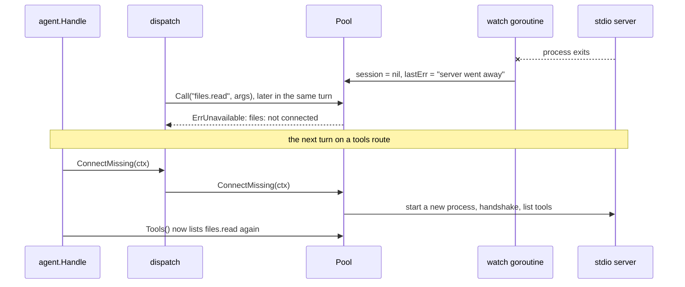

# mcp

**Code:** `internal/mcp/` (`doc.go`, `config.go`, `pool.go`, `call.go`, `stdio.go`,
`probe.go`, and the tests `config_test.go`, `pool_test.go`, `call_test.go`,
`headers_test.go`, `stdio_test.go`, `stdio_unix_test.go`, `probe_test.go`,
`probe_unix_test.go`, `testserver_test.go`)
**Milestone:** v0.3
**Architecture:** [MCP](../../ARCHITECTURE.md#mcp),
[Agent loop](../../ARCHITECTURE.md#agent-loop) step 4

## What it does

MCP, the Model Context Protocol, is how Meru gets tools. An MCP server is a program
that offers named tools, each with a description and a JSON Schema for its
arguments. Meru is the client: it asks each server what it offers, shows the model
the tools you allowed, and runs the ones the model asks for.

This package holds the client side. A `Pool` starts or connects to every server in
config, keeps each server's allowed tools, and renames them `<server>.<tool>`.
`dispatch` reaches the pool through `mcpBackend` in `cmd/merud/backends.go`: it
reads `Pool.Tools` for the prompt and calls `Pool.Call` to run a tool. `dispatch`
owns the confirmation prompt, the `tool_calls` row and the metrics; see
[dispatch.md](dispatch.md).

`Probe` is the one piece outside the Pool. It starts a server for a moment, lists
every tool it offers with the hints the server gives, and stops it. `meru mcp add`
uses it, through merud, to show you a new server's tools before you pick which to
allow.

The package speaks both transports in the current MCP spec, through the official
Go SDK (`github.com/modelcontextprotocol/go-sdk`):

- **stdio.** The Pool starts the server as a child process and sends JSON-RPC
  messages, one per line, over its stdin and stdout.
- **Streamable HTTP.** The Pool connects to a server that is already running, at a
  URL. The URL must be loopback unless the entry says `remote = true`.

The Pool supervises nothing. It starts a stdio server because the transport is the
child's stdin and stdout, and it connects to an HTTP server that you start. It
never restarts either one on its own, checks its health or retries on a timer:

| When | What the Pool does |
| --- | --- |
| `NewPool`, at `merud`'s start | one try per server |
| a turn on a tools route (`ConnectMissing`) | one try per server that isn't connected |
| a turn that offers no tools, or no turn at all | nothing |
| a call to a server that isn't connected | fails at once with `ErrUnavailable` |

## The picture

```mermaid
flowchart LR
    cfg["[[mcp.servers]] in config.toml"] --> v["Validate"]
    v --> np["NewPool"]
    np -- "command" --> child["child process<br/>stdin / stdout"]
    np -- "url" --> http["Streamable HTTP<br/>on loopback"]
    child --> list["list tools, keep allowed,<br/>rename server.tool"]
    http --> list
    list --> tools["Pool.Tools()"]
    loop["agent loop / dispatch"] --> tools
    loop --> call["Pool.Call(name, args)"]
    call -- "not in allow" --> denied["ErrNotAllowed<br/>(no server contact)"]
    call -- "allowed" --> child
    call -- "allowed" --> http
```

A stdio server that crashes, and comes back on the next turn on a tools route:



## Walk through the code

### config.go

`ServerConfig` is one `[[mcp.servers]]` entry. merud fills it from `config.toml`
(`mcpServerConfigs` in `cmd/merud/backends.go`, which also swaps `secret:<name>`
values for the stored secrets); this package only defines it and checks it.

```go
type ServerConfig struct {
    Name    string
    Command string
    Args    []string
    Env     map[string]string
    URL     string
    Remote  bool
    Headers map[string]string
    Allow   []string
    Confirm []string
    AlwaysConfirm []string
    Timeout time.Duration
}
```

`Validate` collects every problem before it returns, then joins them with
`errors.Join`, so you fix `config.toml` in one pass instead of one error per run.
It refuses:

- an entry with both `command` and `url`, or neither;
- a URL that isn't loopback, unless `remote = true` (the rule lives in
  `loopback.CheckURL`, which the engine and the telemetry exporter also use).
  `remote` covers only where `merud` connects. It says nothing about what the
  server reaches: the catalog's `google` server sits on loopback and talks to
  Google. A config written before the rename says `network`, and `config.Load`
  names the rename when it finds that key (see [config.md](config.md));
- a name with anything but letters, digits, `-` and `_`. The name becomes the
  prefix of every tool name, so a `.` in it would make `a.b.c` ambiguous;
- `*` or any other wildcard in `allow` or `confirm`. Deny-by-default means you name
  each tool. A wildcard would also let in tools a server adds in a later release
  that no one has read;
- `headers` or `remote` on a stdio entry, `args` on a `url` entry, a header name
  with a space, colon or line break, or a header value with a line break, which
  could smuggle in a second header;
- `env` on a `url` entry. `merud` starts no process for an HTTP server, so the
  variables would go nowhere. The message says so and points at `headers`: "env
  does nothing on a url server, because merud doesn't start it. Set the variables
  where you start the server, or send a key with headers";
- a `confirm` entry missing from `allow`. That tool never reaches the model, so
  the entry does nothing, and it is almost always a typo.

`ValidateAll` also refuses two servers with one name, because their tool names
would collide.

### stdio.go

`newStdioTransport` builds the child process:

```go
cmd := exec.CommandContext(procCtx, cfg.Command, cfg.Args...)
cmd.Env = childEnv(cfg.Env)
cmd.Stderr = &stderrLog{log: log.With("mcp_server", cfg.Name)}
cmd.WaitDelay = terminateWait
return &mcp.CommandTransport{Command: cmd, TerminateDuration: terminateWait}
```

- `exec.CommandContext` runs the program directly, with no shell. More in
  [go-basics/os-exec.md](go-basics/os-exec.md).
- `childEnv` hands the child a short list of merud's variables (`PATH`, `HOME` and
  a few that Windows programs need) plus the entry's own `env`. The rest of merud's
  environment stays out, because it may hold another tool's API key.
- `stderrLog` copies each line the server writes to stderr into merud's log at
  debug level. It cuts lines at 1 KiB and stops after 64 KiB, so a noisy server
  can't fill the disk.
- The SDK's `CommandTransport` shuts a child down the way the MCP spec asks: close
  its stdin, wait, send SIGTERM, wait, then kill. `terminateWait` sets each wait to
  two seconds.

### pool.go

`NewPool` validates the config, then connects each server in turn:

```go
s.mu.Lock()
err := p.connectLocked(ctx, s, connectTimeout)
s.mu.Unlock()
if err != nil {
    log.Warn("mcp server failed to start", ...)
    continue
}
```

A server that fails to start doesn't stop the others. The Pool logs it, `Status`
reports it, and `ConnectMissing` tries it again at the start of the next turn that
offers tools.

`tryConnectLocked` holds the details:

1. It creates the child's process context from `context.Background()`, not from
   `ctx`. merud passes `NewPool` a startup context, and the child must outlive it.
   `s.stop` cancels this context at `Close`.
2. It runs the MCP handshake and lists the tools, both bounded by `limit`:
   `connectTimeout` (30 s) at startup and for a stdio server, `httpRetryTimeout`
   (5 s) when a turn tries an HTTP server again.
3. `allowedTools` keeps the tools in `allow`, renames each to `<server>.<tool>`,
   and sorts them. A stable order keeps the prompt the same from turn to turn.
4. It starts a goroutine, `watch`, that blocks on `cs.Wait()` until the session
   ends. When a server dies, `watch` marks it not connected at once and reaps the
   child process. It never starts the server again.

**Connecting again.** `ConnectMissing` is the one path that reconnects, and only a
turn calls it:

```go
func (p *Pool) ConnectMissing(ctx context.Context) {
    for _, s := range p.servers {
        s.mu.Lock()
        if s.closed || s.session != nil {
            s.mu.Unlock()
            continue
        }
        limit := connectTimeout
        if s.cfg.URL != "" {
            limit = httpRetryTimeout
        }
        err := p.connectLocked(ctx, s, limit)
        ...
```

It walks the servers in config order and tries each one that isn't connected,
once. An HTTP server gets 5 seconds: it is somebody else's process, and it
either answers at once or isn't running. A stdio server gets the full 30, because
`npx -y` or `uvx` may still be downloading it. A failure goes to the log and to
`lastErr` for `Status`, and the turn carries on without that server. The agent
loop reaches this method through `dispatch.Connector` (see
[dispatch.md](dispatch.md) and [agent.md](agent.md)).

`Tools` lists only the tools of servers with a live session, so a dead server's
tools drop out of the next prompt. `sessionFor`, which `Call` uses, never
connects:

```go
switch {
case s.closed:
    return nil, fmt.Errorf("%w: %s: pool closed", ErrUnavailable, s.cfg.Name)
case s.session == nil:
    return nil, fmt.Errorf("%w: %s: not connected: %s", ErrUnavailable, s.cfg.Name, s.lastErr)
}
```

A `switch` with no value after it tests each `case` in turn and runs the first
that is true, like a chain of `if … else if`. `%w` wraps `ErrUnavailable` in the
error, so `dispatch` can find it with `errors.Is`.

With no timer, no background loop and no wait, nothing runs while nobody asks. A
server that crashes on start doesn't spin, and a server nobody needs is never
touched again. `markFailed` drops the session when a call finds the connection
gone, so the server shows as not connected, and the next turn tries it.

**Status.** `Status` reports each server in config order from what the Pool
holds, and sends nothing to any server. `ServerStatus` carries the name, the
transport, the `URL` of an HTTP server, `Connected`, `Offered` (tools the server
listed), `Allowed` (tools the model sees), `Unknown` (allow entries the server
doesn't offer) and `LastError`. Two counts come from config, so they show while
the server is down: `Listed`, the length of `allow`, and `Confirms`, the allowed
tools that ask first. `Confirms` counts a tool once when both `confirm` and
`always_confirm` name it. `meru tools` and `meru mcp` both read `Status`, through
`cmd/merud` (see [merud.md](merud.md)).

Each `server` has a `sync.Mutex` next to the fields it guards. Calls lock it only
to read or swap the session, never during the tool call itself, so many calls to
one server can run at once.

`Close` ends every session, cancels every process context, and then waits on the
`watchers` wait group until every `watch` goroutine has returned.

**Headers.** A Streamable HTTP server that wants an API key gets it in `Headers`.
`httpClient` wraps Go's default transport in a `headerTransport`, an
`http.RoundTripper` (the interface an `http.Client` sends each request through):

```go
func (t *headerTransport) RoundTrip(req *http.Request) (*http.Response, error) {
    if req.URL.Host != t.host {
        return t.base.RoundTrip(req)
    }
    r := req.Clone(req.Context())
    for k, v := range t.headers {
        r.Header.Set(k, v)
    }
    return t.base.RoundTrip(r)
}
```

A `RoundTripper` must not change the request it gets, so it sets the headers on a
copy. It adds them only for the server's own host: a server marked
`remote = true` may redirect elsewhere, and the key must not follow. More on
clients and transports in [go-basics/http-clients.md](go-basics/http-clients.md).

### probe.go

`Probe(ctx, cfg, log)` answers "what does this server offer?" before the server
goes into config. It returns a `ProbeInfo`: the name and version the server gives
in the handshake, and every tool it offers, sorted by name.

```go
cfg.Allow, cfg.Confirm, cfg.Timeout = nil, nil, 0
if err := cfg.Validate(); err != nil {
    return ProbeInfo{}, err
}
```

`cfg` arrives as a copy, since Go passes structs by value, so clearing the allow
and confirm lists touches nothing the caller holds. What's left for `Validate` to
check is how to reach the server: the name, `command` or `url`, the loopback rule,
and the header and env names. An empty allow list was always valid; it gives the
model nothing.

`Probe` reaches the server with `dialTransport` and `newClient`, the same two
functions the Pool uses, so a probe sees what the Pool would see: the same trimmed
environment for a stdio child, and the same loopback redirect rule and headers for
Streamable HTTP. It then runs the handshake and `listTools` under one 30-second
limit (`connectTimeout`). A first `npx -y` or `uvx` run downloads the server
before it starts, so a timeout says that, and says to try again.

**Hints.** MCP lets a server annotate each tool. `Probe` copies two of the
annotations into `ProbeTool`, as `*bool` so "not given" stays apart from
"false":

- `ReadOnly`, from `readOnlyHint`: the tool changes nothing. The Go SDK decodes
  this one into a plain `bool`, so a missing hint reads as `false`, which is also
  MCP's default. `ReadOnly` is nil only when the tool has no annotations at all.
- `Destructive`, from `destructiveHint`: the tool may delete or overwrite. The SDK
  keeps it as a pointer, so nil means the server left it out.

MCP calls both hints from the server, not promises. Meru uses them only to
propose which tools to allow and which to confirm; you decide.

**No stray processes.** The child must end whatever happens, so the cleanup comes
in two `defer`s, which run last-in, first-out when `Probe` returns:

```go
procCtx, stop := context.WithCancel(context.Background())
defer stop()
...
cs, err := newClient(log).Connect(cctx, t, nil)
if err != nil { ... } // the SDK closes the connection itself
defer func() { _ = cs.Close() }()
```

`cs.Close` closes the child's stdin and waits for it to exit; `stop` kills it if
it hasn't. `probe_unix_test.go` proves it: a test server that never answers the
handshake, and one that answers it but never lists its tools, both leave no
process behind once `Probe` gives up.

The probe calls no tool, so it doesn't go through `dispatch`.

### call.go

`Call` does four things in order:

```go
s, tool, known := p.lookup(name)
allowed := known && s.allow[tool]
...
if !allowed {
    return Result{}, fmt.Errorf("%w: %q", ErrNotAllowed, name)
}
```

1. **Allowlist.** It splits `files.read` at the first `.` and checks the server's
   `allow` list. A tool outside it gets `ErrNotAllowed` before any server hears
   about the call. `dispatch` only calls tools the pool listed, so it records a
   made-up name as `denied` before the pool sees it.
2. **Arguments.** They must be a JSON object; empty means `{}`.
3. **Session.** `sessionFor` returns the live session, or fails at once with
   `ErrUnavailable` when the server isn't connected. It never starts the server.
4. **Call.** `cs.CallTool` runs under a timeout (60 s unless the entry sets
   `Timeout`). If you cancel `ctx`, or the timeout passes, the SDK sends the server
   a `notifications/cancelled` message and `Call` returns an error that wraps
   `context.Canceled` or `context.DeadlineExceeded`.

`toResult` turns the server's answer into a `Result`: the text blocks joined by
newlines, a placeholder such as `[image image/png]` for other content, the
structured content as raw JSON, and the server's `isError` flag. A tool that
reports failure is a normal result; the model reads the text to learn why.

**Spans.** Each call gets a span named `tools/call <tool>`, with the attribute
names from the OpenTelemetry MCP semantic conventions: `mcp.method.name`,
`gen_ai.tool.name`, `gen_ai.operation.name = execute_tool`, `network.transport`
(`pipe` for stdio, `tcp` for HTTP), `mcp.session.id` and `mcp.protocol.version`.
Meru adds `meru.tool.server` and `meru.tool.allowed`. `error.type` says how a call
failed: `tool_error` (the convention's name), or Meru's `denied`, `unavailable` or
`timeout`. The arguments and result text go on the span only when
`capture_content = true`.

## Go ideas used here

- **os/exec** — start a program and talk to its stdin, stdout and stderr. More in
  [go-basics/os-exec.md](go-basics/os-exec.md).
- **encoding/json and json.RawMessage** — pass tool schemas and arguments through
  without decoding them. More in [go-basics/json.md](go-basics/json.md).
- **context** — `Call` stops when its context ends. More in
  [go-basics/context.md](go-basics/context.md).
- **goroutines and sync.WaitGroup** — `watch` runs beside everything else, and
  `Close` waits for it. More in [go-basics/goroutines.md](go-basics/goroutines.md).
- **errors.Join, `%w` and errors.Is** — `Validate` joins its problems;
  `ErrNotAllowed` travels up wrapped. More in [go-basics/errors.md](go-basics/errors.md).
- **Type switches** — `toResult` handles each kind of content. More in
  [go-basics/type-switches.md](go-basics/type-switches.md).
- **Iterators** — `cs.Tools` pages through the server's tool list. More in
  [go-basics/iterators.md](go-basics/iterators.md).
- **Build tags** — `stdio_unix_test.go` and `probe_unix_test.go` run only on
  Unix-like systems. More in [go-basics/build-tags.md](go-basics/build-tags.md).

## Try it

```sh
go test -race ./internal/mcp/...
go test -race -run 'TestCrashedServerComesBackOnTheNextTurn|TestConnectOnDemand|TestNoBackgroundWork' -v ./internal/mcp/
go test -race -run TestProbe -v ./internal/mcp/
```

The tests start one test server, written with the same SDK, three ways: in memory,
as a stdio child, and over Streamable HTTP on 127.0.0.1. The stdio child is the
test binary itself. `TestMain` checks the `MERU_MCP_TESTSERVER` variable; when it
is set, the binary serves MCP instead of running tests. Go's own `os/exec` tests
use the same trick, and it needs no build step. The variable's value picks a
behaviour: `1` serves the tools, `hang` never answers, and `hanglist` answers the
handshake but never lists its tools. The last two drive the probe timeout tests.

Four tests check the connect rule. `TestConnectOnDemand` counts dials against a
server that is down: one at startup, none for a call between turns, exactly one
per `ConnectMissing`, and none once the server is connected.
`TestNoBackgroundWork` points the Pool at an HTTP server that answers 503, reads
`Status` and `Tools`, waits, and checks that the server got no request after the
startup try. `TestCrashedServerComesBackOnTheNextTurn` crashes a stdio child and
checks that calls fail and its tools leave the list until `ConnectMissing` starts
a new process. `TestStatusCountsFromConfig` checks `URL`, `Listed` and
`Confirms` for a server that never connected.

## Why it's built this way

- **The official SDK.** It implements both transports, the handshake, paging and
  cancellation, and the MCP maintainers keep it current with the spec. Writing our
  own JSON-RPC client would be several hundred lines to test and keep in step.
- **No supervision.** The operating system already runs processes and restarts
  them (`launchd`, `systemd`). A restart loop inside `merud` would need its own
  goroutine, backoff and shutdown, and would do work while nobody asks. One try
  per turn that offers tools needs a loop over the servers and nothing else. An
  earlier version retried on the next call, at most once every 10 seconds; the
  turn-level try replaced it, so a call never waits on a server start.
- **No wildcards.** A wildcard is one character, and the cost of one shows up later:
  a server update adds `delete_everything`, and the model can call it.
- **Servers start one after another.** Most setups have a handful of servers, and
  each start is capped at 30 seconds. Starting them in parallel would need
  `errgroup`; we'll add it if startup time turns out to hurt.
- **A trimmed environment.** Passing merud's whole environment is the default in
  `os/exec`, and it would give every server every secret merud can see.
- **Probe with the Pool's own code.** `Probe` could have been a small client of
  its own. Sharing `dialTransport` and `newClient` means a server that passes a
  probe starts the same way in the Pool, environment and headers included.
- **`mcp` returns its own `ProbeInfo`.** The package imports nothing from `rpc`,
  so it stays a plain MCP client. `cmd/merud` copies the result into
  `rpc.ProbeResult`, field for field.
