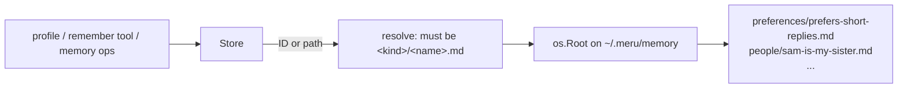

# memory

**Code:** `internal/memory/` (`doc.go`, `memory.go`, `file.go`)
**Milestone:** v0.4
**Architecture:** [Memory](../../ARCHITECTURE.md#memory)

## What it does

Meru remembers facts about you as small Markdown files, one fact per file, under
`~/.meru/memory/<kind>/`. The folder names the kind: `me`, `preferences`,
`projects`, `people`, `reference`, `other`, or any folder you create. This package
adds, lists, reads and deletes those files.

Four callers use it from v0.4, all inside `merud`, which owns the folder:

- **The profile.** Every turn, the agent reads the `me` and `preferences` folders
  and puts each fact into the system prompt (see [agent](agent.md)).
- **The `remember` tool.** The model saves a fact you tell it in chat (see
  [builtin](builtin.md)).
- **The memory ops.** `meru memory list | add | forget` and `meru setup user` ask
  `merud` over the socket (see [merud](merud.md)).
- **The memory syncer.** `index.Memories` calls `List` and copies every memory into
  the store's `memories` table, where recall searches it by meaning, keyword and
  recency (see [index](index.md), [store](store.md) and [retrieve](retrieve.md)).

A memory file looks like this:

```markdown
---
created: 2026-09-23
source: session 2026-09-23T101502-7f3a
---
Prefers short replies, with the answer in the first sentence.
```

## The picture



## Walk through the code

### memory.go

`Open(dir)` makes the memory folder and the six default kind folders, all mode
`0700`, and returns a `Store`. The `Store` holds only the folder's path and a
clock, so it is safe to share between goroutines.

Each memory comes back as a `Memory`:

| Field | What it holds |
| --- | --- |
| `ID` | the path inside the memory folder, with `/`: `preferences/prefers-short-replies.md` |
| `Kind` | the folder: `preferences` |
| `Path` | the absolute path on disk |
| `Text` | the fact |
| `Created`, `Source` | from the frontmatter; empty for a file you wrote by hand |
| `Modified` | the file's modification time |

The `ID` is stable for as long as the file stays put, so the indexer can key its
database rows on it and use `Modified` to spot hand edits.

**Add.** `Add(kind, text, source)` checks its inputs first: the kind must be a valid
folder name, the text non-empty, valid UTF-8 and at most 4 KiB, and the source one
line. A source with a line break could forge an extra frontmatter line, so `Add`
refuses it. Then it picks a file name from the text (see `slugify` below) and
creates the file:

```go
f, err := root.OpenFile(filepath.FromSlash(id), os.O_WRONLY|os.O_CREATE|os.O_EXCL, 0o600)
if errors.Is(err, fs.ErrExist) {
    continue // the name is taken: try "-2", "-3", ...
}
```

`O_EXCL` asks the operating system to fail when the file already exists. Two
`Add` calls racing for the same name can't both get it; the loser moves on to the
next number. `TestSlugUnique` runs twenty at once to prove it.

**List.** `List()` walks each kind folder and reads every `.md` file. A file it can't
use (a symbolic link, a file over 64 KiB, a folder with a name like `my notes`)
doesn't stop the listing. `List` returns the memories it could read and an error
that names what it skipped, built with `errors.Join`.

**ListKind.** `ListKind(kind)` does the same for one folder and reads no other.
The agent reads the profile on every turn, so it asks for `me` and `preferences`
alone. Reading every folder took 13 ms with 500 other memories; reading the two
takes about 0.6 ms for 20 files. A kind with no folder has no memories, and a kind
that isn't a plain folder name fails with `ErrBadID`. `List` and `ListKind` share
one helper, `listKind`, which reads one checked folder.

**Get and Forget.** Both take an ID or an absolute path and send it through
`resolve`, then check the file with `Lstat` before touching it.

### Keeping every path inside the memory folder

`Forget` deletes files, and its argument can come from the model. Three layers keep
it inside `~/.meru/memory/`:

1. **`resolve`** turns the argument into `<kind>/<name>.md` or fails with `ErrBadID`.
   An absolute path must sit under the memory folder. `filepath.IsLocal` rejects
   `..`, absolute paths and Windows device names such as `NUL`. The result must have
   exactly two parts, a valid kind and a name ending in `.md`.
2. **`Lstat` checks.** `checkKindDir` and `statFile` look at the folder and the file
   without following symbolic links, and refuse either one when it is a link. A link
   in the memory folder could point anywhere, so Meru won't read or delete through it.
3. **`os.Root`.** Every file operation goes through `root`, an `*os.Root` opened on
   the memory folder:

   ```go
   root, err := os.OpenRoot(s.dir)
   defer root.Close()
   ...
   root.Remove(filepath.FromSlash(id))
   ```

   An `os.Root` is a handle on one folder. Its methods (`OpenFile`, `ReadFile`,
   `Remove`, `Lstat` and the rest) refuse any path that would leave that folder,
   including through a link swapped in after the checks above ran. If a bug ever
   let a bad path past `resolve`, the operating system would still refuse it.

`TestRefusesTraversal` and `TestRefusesSymlinks` try `../`, absolute paths,
backslashes, hidden files, linked folders and linked files, and check that nothing
outside the memory folder changes.

### file.go

**parse** reads a memory file. Writing is strict, because `Add` always writes the
same shape. Reading is forgiving, because you may have edited the file by hand. A
file with no frontmatter is all text. A frontmatter that never closes makes the
whole file text. An unknown key is ignored, and a date that doesn't parse leaves
`Created` empty. A typo in a file you edited should never make the memory vanish.

**slugify** turns text into a file name:

```go
words := strings.FieldsFunc(strings.ToLower(text), func(r rune) bool {
    return (r < 'a' || r > 'z') && (r < '0' || r > '9')
})
```

`strings.FieldsFunc` splits the text wherever the function returns true, here at
anything that isn't an ASCII letter or digit. `slugify` joins the words with `-`
until the next word would pass 48 bytes. "Prefers short replies with the
answer first." becomes `prefers-short-replies-with-the-answer-first`. The result can't hold
`/`, `.` or a space, so it is safe on every file system. Text with no ASCII letters
becomes `memory`, and a Windows device name such as `con` becomes `memory-con`.

## Go ideas used here

- **os.Root** — a handle that confines file operations to one folder, added in Go
  1.24. See the section above.
- **Errors you can test for** — `ErrNotFound` and `ErrBadID` are wrapped with `%w`;
  `errors.Join` merges List's problems into one error. More in
  [go-basics/errors.md](go-basics/errors.md).
- **defer** — `defer root.Close()` closes the handle on every return path. More in
  [go-basics/defer.md](go-basics/defer.md).
- **A clock in a field** — `Store.now` is a function value. `Open` sets it to
  `time.Now`, and the tests set a fixed time so created dates are predictable.
- **sync.WaitGroup** — the uniqueness test starts twenty goroutines with `wg.Go` and
  waits for them with `wg.Wait`. More in [go-basics/goroutines.md](go-basics/goroutines.md).

## Try it

```sh
go test -race ./internal/memory/...
go test -run 'TestRefuses' -v ./internal/memory/
```

## Why it's built this way

- **One file per fact.** Forgetting means deleting one file, and you can audit what
  Meru believes with `ls` and a text editor (ARCHITECTURE.md, "Memory").
- **The folder is the kind.** No `kind:` field can disagree with the path, so the
  frontmatter holds only `created` and `source`.
- **A hand parser, not the skills parser.** Memory frontmatter has two flat keys and
  must never fail. Sharing the strict skills parser would mean either loosening it
  or losing hand-edited memories, so each package keeps its own small reader.
- **The file name comes from the text.** A random ID would be unique for free, but a
  name you can read is how you find a memory in a file manager.
- **Search lives elsewhere.** This package only reads and writes files. The syncer
  keys its rows on the stable `ID` and spots hand edits by `Modified` and a hash of
  the parsed fields, so this package needs no index of its own.
- **Read on each turn, no cache.** The profile is a few small files, so reading
  them costs well under a millisecond, and a hand edit shows in the next answer.
