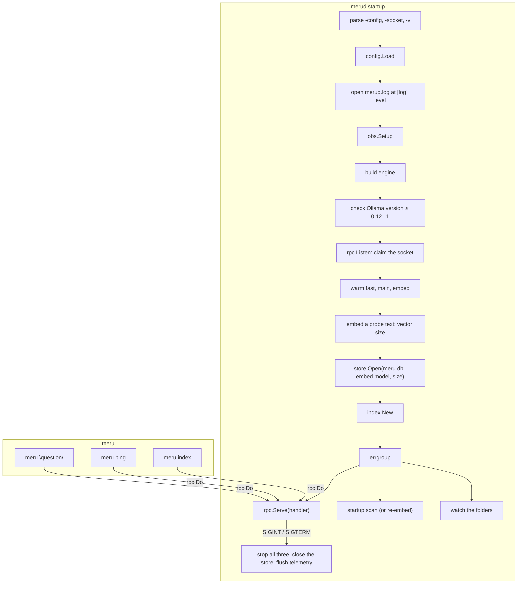

# merud and meru

**Code:** `cmd/merud/` (`main.go`, `runtime.go`, `index.go`, `backends.go`), `cmd/meru/` (`main.go`, `index.go`)
**Milestone:** v0.1; the store, the indexer and `meru index` in v0.2
**Architecture:** [The shape: daemon + thin client](../../ARCHITECTURE.md#the-shape-daemon--thin-client), [Model tiers](../../ARCHITECTURE.md#model-tiers)

## What it does

These are Meru's two programs. In Go, a folder under `cmd/` with
`package main` and a `func main()` builds into one program.

- **`merud`** runs all the time. It reads config, checks Ollama, loads the
  models, opens the search index (`~/.meru/meru.db`), keeps it up to date with
  your `[index]` folders, and answers questions on `~/.meru/merud.sock`.
- **`meru`** is the command you type. It sends one request to `merud`, prints
  the reply and exits. It holds no model or storage code.

## The picture



## Walk through the code

### merud: main.go

`main` does two things: it turns Ctrl-C and `SIGTERM` into a cancelled
context, and turns an error into exit status 1.

```go
ctx, stop := signal.NotifyContext(context.Background(), os.Interrupt, syscall.SIGTERM)
err := run(ctx, os.Args[1:], os.Stderr, newEngine)
stop()
```

Everything else lives in `run`, which tests can call. `run` takes the engine
builder as a parameter, so `TestRunServesAndStops` runs the whole daemon over
a fake engine. `TestRunLogLevel` does the same with and without `-v`, and
checks what `merud.log` holds at each level.

`serve` claims the socket **before** warming the models. Warming the `full`
profile's main model can take a minute, and a second `merud` should fail at
once rather than after that minute. Clients that connect during warm-up wait
in the socket's queue.

After warming, `serve` opens the store with `openStore`. The store needs the
embedding model's vector size, and `embedDims` learns it by embedding one
short probe text, so config never holds a number that could go stale. When
the model or the size changed since the last run, the store drops the old
vectors (`store.NeedsReembed` then reports true).

Then three jobs run side by side in an **errgroup** from
`golang.org/x/sync`:

```go
g, gctx := errgroup.WithContext(ctx)
g.Go(func() error { return rpc.Serve(gctx, ln, handler(a, idx), log) })
g.Go(func() error { idx.startupScan(gctx); return nil })
g.Go(func() error { idx.watch(gctx); return nil })
return g.Wait()
```

`g.Go` starts a function in its own goroutine, and `g.Wait` waits for all of
them. `gctx` ends when `ctx` does, or when one function returns an error, so
all three stop together. The scan and the watcher log their own errors and
return `nil`, so a folder that can't be read never stops `merud`. Because the
scan runs beside the server, questions get answers during a long first scan;
they search whatever the index holds so far.

`handler` sends each request to the right place: `ask` to the agent, `index`
and `index_status` to the index service. The rpc server answers `ping` itself.

Shutdown needs no special code. The cancelled context makes `rpc.Serve` close
the listener, cancel every open turn, wait for them and return; the scan and
the watcher see the same context and return too. The deferred calls then close
the store and give telemetry a fresh five-second context to send its last
batch.

**The log.** `openLog` opens `merud.log` for appending and builds the logger
every package shares. `-v` sets the level to `debug`, whatever `[log] level`
says. The text handler goes inside `obs.LogHandler`, which adds the turn's
`trace_id` to each line logged with a span in its context:

```go
text := slog.NewTextHandler(f, &slog.HandlerOptions{Level: lv})
return slog.New(obs.LogHandler(text)), func() { _ = f.Close() }, nil
```

The first line `run` writes is `merud starting`, with the settings that decide
how a turn runs: the profile, each tier's model, Ollama's address and
`keep_alive`, `history_turns`, the OTLP endpoint (or `off`), the log level,
and how many `[index]` folders it indexes.
`serve` passes the same logger to the engine (`newEngine`), the router
(`newRouter` sets `router.Config.Log`), the agent and the socket server.
`engineBuilder` names the engine builder's type, so tests can pass a fake.

### merud: runtime.go

`checkRuntime` asks the engine for Ollama's version and refuses anything older
than 0.12.11, the first release that reports log probabilities.
`versionAtLeast` compares versions number by number, so `0.12.11` beats
`0.9.99`, which a plain string comparison gets wrong.

`warm` sends a one-token request to each chat model and one embedding
request, and logs `warmed` with the time each took. At debug level the
engine's own lines show each call's status and Ollama's load time. When `fast` and `main` name the same model, as in the `lite` profile,
it loads that model once. A failure says which model and suggests
`ollama pull`.

### merud: index.go

`indexService` owns everything about the index outside a turn:

- **`startupScan`** runs `Scan`, or `Reembed` when the store dropped its
  vectors for a new embedding model. `Reembed` embeds every file again even
  though none changed, so search by meaning works again. The indexer logs the
  scan's counts and time at info level, and each file at debug.
- **`watch`** runs the indexer's file watcher.
- **`run`** makes scans take turns. `turn` is a channel with room for one
  value: sending into it takes the turn, reading from it gives the turn back.
  Unlike `sync.Mutex`, a `select` can wait for the turn and for `ctx` at once,
  so `meru index` gives up cleanly when you press Ctrl-C while it waits.
- **`handleIndex`** answers `meru index`: a rescan of every folder, or
  `IndexPaths` for one path. A path outside every `[index]` folder comes back
  as `index.ErrOutsideFolders`, which `handleIndex` turns into a message that
  names the config file and says to restart `merud`. For v0.2, config is the
  only way to add a folder.
- **`handleStatus`** answers `meru index -status` with the store's counts,
  whether a scan runs, and the last full scan's report.

`searchAdapter` joins the agent's `Searcher` interface to `retrieve.Search`
over the store, the way `routerAdapter` joins the router.

### merud: backends.go

`mcpBackend` joins the MCP pool to `dispatch`, and `mcpServerConfigs` turns the
`[[mcp.servers]]` entries into the pool's settings, secrets resolved. Both are
described in [dispatch.md](dispatch.md).

### meru: main.go

```go
switch {
case flags.NArg() == 1 && flags.Arg(0) == "ping":
    err = ping(ctx, *socket, stdout)
case flags.NArg() == 1 && flags.Arg(0) == "chat":
    err = tui.Run(ctx, *socket, chatInfo())
case flags.Arg(0) == "index":
    err = indexCmd(ctx, *socket, flags.Args()[1:], stdout, stderr)
default:
    err = ask(ctx, *socket, strings.Join(flags.Args(), " "), stdout)
}
```

- `meru "question"` and `meru question words` both work; the words are joined.
  A question whose first word is `ping`, `chat` or `index` needs quotes.
- `ask` writes each token to standard output the moment it arrives, as plain
  text, so pipes and scripts work. When `merud` sent a `sources` event, a
  `Sources:` list follows the answer: one line per file the answer cites, such
  as `[1] ~/notes/garden.md, "Budget", lines 3–5`. `rpc.Cited` picks those
  lines; when the answer cites no number, it lists every excerpt the model
  read.
- `meru chat` is the Bubble Tea terminal UI in `internal/tui`.
- Exit status: 0 on success, 1 on any error, 130 after Ctrl-C (the shell's
  convention: 128 plus signal number 2).

### meru: index.go

`meru index` has its own small `flag.FlagSet`, for `-status`. It sends one
request and prints what comes back: progress lines to standard error, the
report to standard output. A relative folder becomes absolute here with
`filepath.Abs`, because `merud` runs in a different folder. `reportLine` and
`statusText` only format numbers; `merud` decides what to index and whether a
folder is allowed.

```text
$ meru index -status
Folders:    ~/notes
Index:      12 files, 87 chunks, 87 vectors
Scanning:   no
Last scan:  2026-09-23T10:15:00-04:00, 3 files indexed (5 chunks), 9 unchanged, 0 removed, 0 failed, 2 skipped, in 1.2s
```

## Go ideas used here

- **`signal.NotifyContext`** — a context that ends on a signal. More in
  [go-basics/context.md](go-basics/context.md).
- **`flag.FlagSet`** — the standard library's command-line flag parser. A
  `FlagSet` of our own, rather than the global one, lets tests call `run` many
  times.
- **Functions as values** — `run` takes `buildEngine engineBuilder`, a named
  type for `func(config.Config, *slog.Logger) (engine.Engine, error)`.
- **`errgroup.Group`** — runs the server, the scan and the watcher, and waits
  for all three. More in [go-basics/goroutines.md](go-basics/goroutines.md).
- **A channel as a lock** — `indexService.turn`, which `select` can wait on
  together with `ctx.Done()`.
- **`defer`** — closes the log file and the store and flushes telemetry on
  every exit path.
  More in [go-basics/defer.md](go-basics/defer.md).
- **Errors up to `main`** — every function returns its error; only `main`
  prints it. More in [go-basics/errors.md](go-basics/errors.md).

## Try it

```sh
go test -race ./cmd/...
go run ./cmd/merud -v -config /tmp/meru-test/config.toml   # -v: debug lines in /tmp/meru-test/merud.log
go run ./cmd/meru ping
go run ./cmd/meru "hello"
go run ./cmd/meru index -status
```

`index_test.go` runs `merud` over a fake engine with a notes folder: a
question gets its answer while the startup scan waits inside `Embed`, a new
vector size makes the next start embed every file again, and the index ops
answer, refuse a folder outside `[index]`, and explain an empty config.

## Why it's built this way

- **`run` returns instead of exiting.** `os.Exit` skips deferred calls and
  can't be tested; returning an error or a status code avoids both problems.
- **The socket before the warm-up**, so a duplicate daemon fails fast.
- **`meru` stays thin.** It imports only `rpc`, `tui` and `config` (for the
  default socket path), and starts in milliseconds.
- **The scan runs in the background.** A first scan of a big folder can take
  minutes of embedding; `merud` shouldn't sit silent for that long.
- **Folders come from config only.** `meru index <folder>` rescans a folder
  you already listed; it can't add one. One place decides what `merud` may
  read.
