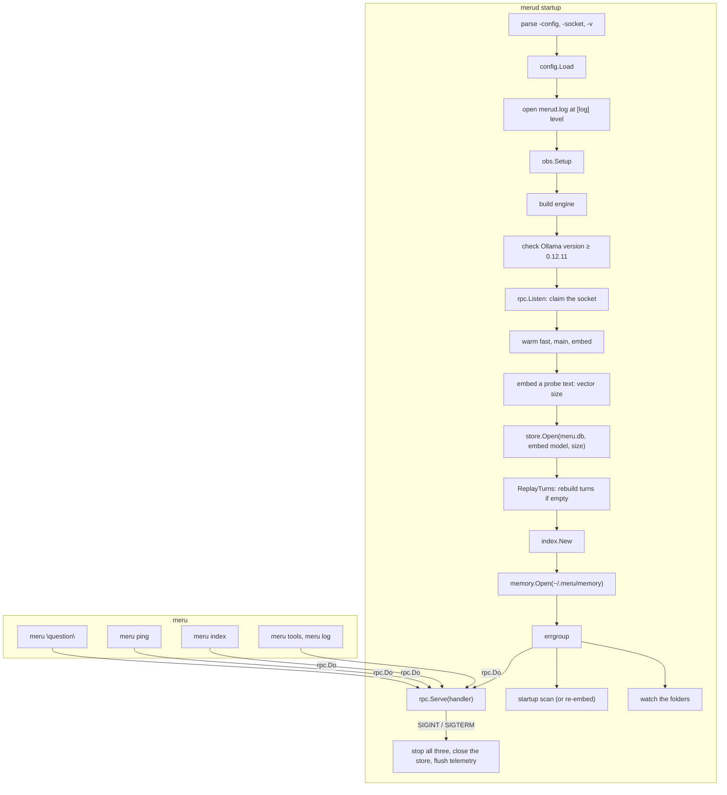

# merud and meru

**Code:** `cmd/merud/` (`main.go`, `runtime.go`, `index.go`, `backends.go`, `tools.go`, `memory.go`), `cmd/meru/` (`main.go`, `index.go`, `approve.go`, `tools.go`, `log.go`, `usage.go`, `look.go`, `setup.go`)
**Milestone:** v0.1; the store, the indexer and `meru index` in v0.2; the approval prompt, `meru tools`, `meru log`, `meru setup`, `meru mcp add` and `meru usage` in v0.3; the memory folder and its ops in v0.4
**Architecture:** [The shape: daemon + thin client](../../ARCHITECTURE.md#the-shape-daemon--thin-client), [Model tiers](../../ARCHITECTURE.md#model-tiers)

## What it does

These are Meru's two programs. In Go, a folder under `cmd/` with
`package main` and a `func main()` builds into one program.

- **`merud`** runs all the time. It reads config, checks Ollama, loads the
  models, opens the search index (`~/.meru/meru.db`), keeps it up to date with
  your `[index]` folders, and answers questions on `~/.meru/merud.sock`.
- **`meru`** is the command you type. It sends one request to `merud`, prints
  the reply and exits. It holds no model or storage code.

## The picture



## Walk through the code

### merud: main.go

`main` does two things: it turns Ctrl-C and `SIGTERM` into a cancelled
context, and turns an error into exit status 1.

```go
ctx, stop := signal.NotifyContext(context.Background(), os.Interrupt, syscall.SIGTERM)
err := run(ctx, os.Args[1:], os.Stderr, newEngine)
stop()
```

Everything else lives in `run`, which tests can call. `run` takes the engine
builder as a parameter, so `TestRunServesAndStops` runs the whole daemon over
a fake engine. `TestRunLogLevel` does the same with and without `-v`, and
checks what `merud.log` holds at each level.

`serve` claims the socket **before** warming the models. Warming the `full`
profile's main model can take a minute, and a second `merud` should fail at
once rather than after that minute. Clients that connect during warm-up wait
in the socket's queue.

After warming, `serve` opens the store with `openStore`. The store needs the
embedding model's vector size, and `embedDims` learns it by embedding one
short probe text, so config never holds a number that could go stale. When
the model or the size changed since the last run, the store drops the old
vectors (`store.NeedsReembed` then reports true).

Then three jobs run side by side in an **errgroup** from
`golang.org/x/sync`:

```go
g, gctx := errgroup.WithContext(ctx)
g.Go(func() error { return rpc.Serve(gctx, ln, handler(a, idx, tools, mems, st), log) })
g.Go(func() error { idx.startupScan(gctx); return nil })
g.Go(func() error { idx.watch(gctx); return nil })
return g.Wait()
```

`g.Go` starts a function in its own goroutine, and `g.Wait` waits for all of
them. `gctx` ends when `ctx` does, or when one function returns an error, so
all three stop together. The scan and the watcher log their own errors and
return `nil`, so a folder that can't be read never stops `merud`. Because the
scan runs beside the server, questions get answers during a long first scan;
they search whatever the index holds so far.

`handler` sends each request to the right place: `ask` to the agent, `index`
and `index_status` to the index service, `tools` and `log` to the tool service,
the three memory ops to the memory service, and `usage` to `handleUsage`. The
rpc server answers `ping` itself.

**Memory.** Before the tools, `serve` opens the memory folder with
`memory.Open(<home>/memory)`, which creates the six default kind folders. One
`*memory.Store` then reaches three places: the built-in `remember` tool
(through `newToolService` and `builtin.New`), the agent (through
`profileAdapter`, the agent's `Profile`), and the memory service.

**Usage.** Right after `openStore`, `replayTurns` calls `store.ReplayTurns`,
which fills the `turns` table from the session transcripts when the table is
empty, and logs how many rows it wrote. A failed replay logs a warning and
`merud` starts anyway: it costs `meru usage` some history, not the answer to
any question. `serve` passes the store to `agent.New` as the agent's
`TurnRecorder`, so each answered turn adds its row. `handleUsage` answers
`OpUsage` with one `usage` event that holds `store.Usage(ctx, time.Now())`: six
windows, with today, week and month in `merud`'s local time.

Shutdown needs no special code. The cancelled context makes `rpc.Serve` close
the listener, cancel every open turn, wait for them and return; the scan and
the watcher see the same context and return too. The deferred calls then close
the store and give telemetry a fresh five-second context to send its last
batch.

**The log.** `openLog` opens `merud.log` for appending and builds the logger
every package shares. `-v` sets the level to `debug`, whatever `[log] level`
says. The text handler goes inside `obs.LogHandler`, which adds the turn's
`trace_id` to each line logged with a span in its context:

```go
text := slog.NewTextHandler(f, &slog.HandlerOptions{Level: lv})
return slog.New(obs.LogHandler(text)), func() { _ = f.Close() }, nil
```

The first line `run` writes is `merud starting`, with the settings that decide
how a turn runs: the profile, each tier's model, Ollama's address and
`keep_alive`, `history_turns`, the OTLP endpoint (or `off`), the log level,
and how many `[index]` folders it indexes.
`serve` passes the same logger to the engine (`newEngine`), the router
(`newRouter` sets `router.Config.Log`), the agent and the socket server.
`engineBuilder` names the engine builder's type, so tests can pass a fake.

### merud: runtime.go

`checkRuntime` asks the engine for Ollama's version and refuses anything older
than 0.12.11, the first release that reports log probabilities.
`versionAtLeast` compares versions number by number, so `0.12.11` beats
`0.9.99`, which a plain string comparison gets wrong.

`warm` sends a one-token request to each chat model and one embedding
request, and logs `warmed` with the time each took. At debug level the
engine's own lines show each call's status and Ollama's load time. When `fast` and `main` name the same model, as in the `lite` profile,
it loads that model once. A failure says which model and suggests
`ollama pull`.

### merud: index.go

`indexService` owns everything about the index outside a turn:

- **`startupScan`** runs `Scan`, or `Reembed` when the store dropped its
  vectors for a new embedding model. `Reembed` embeds every file again even
  though none changed, so search by meaning works again. The indexer logs the
  scan's counts and time at info level, and each file at debug.
- **`watch`** runs the indexer's file watcher.
- **`run`** makes scans take turns. `turn` is a channel with room for one
  value: sending into it takes the turn, reading from it gives the turn back.
  Unlike `sync.Mutex`, a `select` can wait for the turn and for `ctx` at once,
  so `meru index` gives up cleanly when you press Ctrl-C while it waits.
- **`handleIndex`** answers `meru index`: a rescan of every folder, or
  `IndexPaths` for one path. A path outside every `[index]` folder comes back
  as `index.ErrOutsideFolders`, which `handleIndex` turns into a message that
  names the config file and says to restart `merud`. For v0.2, config is the
  only way to add a folder.
- **`handleStatus`** answers `meru index -status` with the store's counts,
  the size of `meru.db` with its `-wal` and `-shm` files (`DBBytes`, from
  `store.DiskBytes`), whether a scan runs, and the last full scan's report.

`handleStatus` also fills `Memories` and `Profile` from the memory service:
how many memory files there are, and how many sit in `me/` and `preferences/`.
Both are -1 when the memory folder can't be read. A `Profile` of 0 tells `meru
chat` that Meru doesn't know you yet.

`searchAdapter` joins the agent's `Searcher` interface to `retrieve.Search`
over the store, the way `routerAdapter` joins the router.

### merud: memory.go

`memoryService` answers the three ops that `meru memory` and `meru setup user`
send:

| Op | What it does | Reply |
| --- | --- | --- |
| `memory_list` | `memory.Store.List` | one `memories` event with every memory |
| `memory_add` | `memory.Store.Add(req.Kind, req.Text, "meru")` | one `memories` event with the new memory |
| `memory_forget` | `memory.Store.Forget(req.ID)` | `done` |

`memoryInfo` copies each `memory.Memory` into `rpc.MemoryInfo`, with `Created`
as `YYYY-MM-DD`, or `""` for a file you wrote by hand. `handleForget` turns
`memory.ErrNotFound` and `memory.ErrBadID` into messages that say how to find
the right ID, and `errors.Is` finds them through the wrapping.

A memory you add through the client gets the source `meru`. `Request.Source`
can't say whether it came from `meru setup user` or `meru memory add`: it is a
metric attribute with three fixed values. `meru` still tells your own facts
apart from the model's, which carry `session <id>`.

These ops don't go through `dispatch`. They are your own commands
(ARCHITECTURE.md, "Memory", "Your commands"), like editing a file by hand. The
model's way to save a memory, the `remember` tool, does go through `dispatch`,
so every memory the model writes lands in `tool_calls` and the transcript.

`profileAdapter` gives the agent the profile. It reads the `me` and
`preferences` folders with `memory.Store.ListKind`, and no others. Reading
every folder took 13 ms per turn with 500 other memories; the two folders take
about 0.6 ms for 20 files, so there is no cache.

### merud: backends.go

`mcpBackend` joins the MCP pool to `dispatch`, and `mcpServerConfigs` turns the
`[[mcp.servers]]` entries into the pool's settings, secrets resolved. Both are
described in [dispatch.md](dispatch.md).

### meru: main.go

```go
switch {
case flags.NArg() == 1 && flags.Arg(0) == "ping":
    err = ping(ctx, *socket, stdout)
case flags.NArg() == 1 && flags.Arg(0) == "chat":
    err = tui.Run(ctx, *socket, chatInfo())
case flags.Arg(0) == "index":
    err = indexCmd(ctx, *socket, flags.Args()[1:], stdout, stderr)
case flags.Arg(0) == "tools":
    err = toolsCmd(ctx, *socket, flags.Args()[1:], stdout)
case flags.Arg(0) == "log":
    err = logCmd(ctx, *socket, flags.Args()[1:], stdout, stderr)
case flags.NArg() == 1 && flags.Arg(0) == "usage":
    err = usageCmd(ctx, *socket, stdout)
default:
    p := newPrompter(os.Stdin, stderr, isTerminal(os.Stdin))
    err = ask(ctx, *socket, strings.Join(flags.Args(), " "), stdout, stderr, p.approve)
}
```

- `meru "question"` and `meru question words` both work; the words are joined.
  A question whose first word is `ping`, `chat`, `index`, `tools`, `log`,
  `usage`, `setup` or `mcp` needs quotes. `usage`, like `ping` and `chat`, is a
  command only as the one word, so `meru usage of semicolons` asks a question.
- `ask` writes each token to standard output the moment it arrives, as plain
  text, so pipes and scripts work. When `merud` sent a `sources` event, a
  `Sources:` list follows the answer: one line per file the answer cites, such
  as `[1] ~/notes/garden.md, "Budget", lines 3–5`. `rpc.Cited` picks those
  lines; when the answer cites no number, it lists every excerpt the model
  read, unless the turn called a tool, whose result may be the whole answer.
  When standard output is a styled terminal (`look.links`), each line is a
  link to its file (`rpc.FileURL`, `rpc.Hyperlink`); a pipe gets plain text.
- Tool calls show on standard error as dim lines, `→ notes.search
  {"query":"garden"}` when a call starts and `✓ notes.search 120 ms` or
  `✗ mail.send declined` when it ends. They and the approval prompt stay off
  standard output, so `meru "..." > answer.txt` saves only the answer. When the
  answer stopped mid-line, `breakLine` starts a new line on standard error
  first, so the tool line doesn't run into the text.
- `meru chat` is the Bubble Tea terminal UI in `internal/tui`.
- Exit status: 0 on success, 1 on any error, 130 after Ctrl-C (the shell's
  convention: 128 plus signal number 2).

### meru: index.go

`meru index` has its own small `flag.FlagSet`, for `-status`. It sends one
request and prints what comes back: progress lines to standard error, the
report to standard output. A relative folder becomes absolute here with
`filepath.Abs`, because `merud` runs in a different folder. `reportLine` and
`statusText` only format numbers; `merud` decides what to index and whether a
folder is allowed.

```text
$ meru index -status
Folders:    ~/notes
Index:      12 files, 87 chunks, 87 vectors
Scanning:   no
Last scan:  2026-09-23T10:15:00-04:00, 3 files indexed (5 chunks), 9 unchanged, 0 removed, 0 failed, 2 skipped, in 1.2s
```

### meru: approve.go

When a tool is in a `confirm` list, `merud` sends an `approval` event and holds
the call until the client answers. `rpc.Do` calls the `ApproveFunc` it was given
and writes the answer back. For one-shot `meru`, that function is the
`approve` method of a `prompter`:

```text
Meru wants to run mail.send (mcp) with:
  {
    "to": "sam@example.com",
    "subject": "Garden budget"
  }
Run mail.send? [o]nce  [s]ession  [d]eny:
```

- It shows only the choices `merud` offers; the `configure` tool offers once and
  deny. A key (`o`) or the whole word (`once`), in any case, picks a choice. An
  empty or unknown answer asks again, and end of input denies.
- It reads from standard input, and only when standard input is a terminal.
  `isTerminal` checks `os.ModeCharDevice` on `os.Stdin.Stat()`, from the
  standard library. In a pipe or a script, `approve` denies without asking and
  prints one line saying so. We don't open `/dev/tty` instead: Windows has no
  such file, and a script should get a deny, not a prompt it can't see.
- A read from a terminal blocks until Enter, and nothing can interrupt it. So
  `readLine` reads in a goroutine and waits with `select` for either the line
  or the end of `ctx` ([go-basics/select.md](go-basics/select.md)). Ctrl-C ends
  `ctx`, `approve` returns its error, and the turn stops as it always did.
- Tests pass a `strings.Reader` as the keyboard and choose `terminal` themselves,
  so they never touch the real standard input.

### meru: tools.go and log.go

`meru tools` (or `meru tools list`) sends `OpTools` and prints each tool
source: its name, kind, transport and whether `merud` reached it, then the
tools the model may use, with "asks first" or "always asks" beside those that
need approval, the count allowed out of the count offered, and a warning for
each `allow` entry the source doesn't offer. With no source, it says how to
add one. `toolsText` pads tool names with `%-*s`, whose `*` takes the width
from the argument list.

`meru log` sends `OpLog` with `Limit` from `-n` (20 by default) and prints one
line per call, newest first. `writeLog` lines up the columns with
`text/tabwriter`, which pads each tab-separated cell to the widest in its
column. It writes the table into a buffer first, so `-v` can put each call's
result on its own line under it without breaking the columns.

`rpc.ArgsLines` and `rpc.ArgsLine` format arguments for the prompt and the log,
so `meru chat` shows them the same way.

### meru: usage.go

`meru usage` sends `OpUsage` and prints what `merud` counted, one column per
window of time:

```text
                  1h   today     week   month     30d     all
sessions           1       2        5      12      14      30
questions          4       9       31      88      97     212
tokens in        18k     41k     150k    420k    468k    1.4M
tokens out      2.1k    5.3k      19k     61k     66k    180k
active time   2m 14s  5m 01s  20m 10s  1h 01m  1h 07m  3h 05m
docs touched       3       7       22      51      55     140
tool calls         1       2        6      14      15      40

Today, week and month follow the local calendar.
```

`rpc.UsageTable` gives the cells, so `meru chat`'s `/usage` box shows the same
ones. `writeUsage` lines up the numbers with a `text/tabwriter` in `AlignRight`
mode, which pads each cell on the left so the numbers line up on their last
digit. The labels stay out of the tabwriter, because that mode would push them
right too; `%-*s` pads each one on the right and it joins its line afterwards.
A `merud` older than `OpUsage` answers with an error event, and `meru usage`
fails with `merud gave no usage numbers: unknown op "usage"`.

### meru: look.go

`newLook` builds the few styles the plain-text output uses: dim, bold, green,
red and amber. Each comes from a `lipgloss.Renderer` made for the writer it
styles, which checks whether that writer is a terminal, how many colours it has
and whether `NO_COLOR` is set. Without colour, a style adds no escape codes, so
a pipe, a file and the tests all get plain text.

### meru: setup.go

`meru setup` and `meru mcp add` talk to a person, not to `merud`, so they live
in the client. They write `config.toml` and `secrets.toml` through
`internal/catalog` and `internal/secrets`, the two packages the thin client may
import besides `rpc`, `config`, `tui` and `loopback`.

Every flow runs on a `console`: a reader for the answers, a writer for the
prompts, and three functions that touch the world, so a test can swap each one:

```go
type console struct {
    in            *bufio.Reader
    out           io.Writer
    readSecret    func() (string, error)
    run           func(ctx context.Context, name string, args ...string) error
    ollamaVersion func(ctx context.Context, baseURL string) (string, error)
}
```

- `readSecret` reads a key with echo off (`golang.org/x/term`) when standard
  input is a terminal. From a pipe it reads a plain line.
- `run` starts `ollama pull` with the terminal attached, so Ollama draws its own
  progress bar. More in [go-basics/os-exec.md](go-basics/os-exec.md).
- `ollamaVersion` makes one `GET /api/version` with `net/http`. The client may
  not import the engine, and one plain call is all the check needs.

`offer` shows one server and asks for a path: `d` asks for each key without
echo, shows the block, and writes it after a yes; `s` prints the block, the
install step and the `secrets.toml` lines, and writes nothing; `k` skips.
`setupCmd` runs the five steps from ARCHITECTURE.md "First run and setup". It
writes `config.toml` only when none exists. Rewriting an existing one would
drop your comments, so setup tells you what to change instead.

`config.toml` sits next to the socket, so `meru -socket /tmp/x/merud.sock setup`
works on the Meru home in `/tmp/x`, the same one `merud -config
/tmp/x/config.toml` uses.

`setup_test.go` scripts whole sessions: the answers go in as a string, and the
test reads back the files and the output.

## Go ideas used here

- **`signal.NotifyContext`** — a context that ends on a signal. More in
  [go-basics/context.md](go-basics/context.md).
- **`flag.FlagSet`** — the standard library's command-line flag parser. A
  `FlagSet` of our own, rather than the global one, lets tests call `run` many
  times.
- **Functions as values** — `run` takes `buildEngine engineBuilder`, a named
  type for `func(config.Config, *slog.Logger) (engine.Engine, error)`.
- **`errgroup.Group`** — runs the server, the scan and the watcher, and waits
  for all three. More in [go-basics/goroutines.md](go-basics/goroutines.md).
- **A channel as a lock** — `indexService.turn`, which `select` can wait on
  together with `ctx.Done()`.
- **`defer`** — closes the log file and the store and flushes telemetry on
  every exit path.
  More in [go-basics/defer.md](go-basics/defer.md).
- **Errors up to `main`** — every function returns its error; only `main`
  prints it. More in [go-basics/errors.md](go-basics/errors.md).

## Try it

```sh
go test -race ./cmd/...
go run ./cmd/merud -v -config /tmp/meru-test/config.toml   # -v: debug lines in /tmp/meru-test/merud.log
go run ./cmd/meru ping
go run ./cmd/meru "hello"
go run ./cmd/meru index -status
```

`index_test.go` runs `merud` over a fake engine with a notes folder: a
question gets its answer while the startup scan waits inside `Embed`, a new
vector size makes the next start embed every file again, and the index ops
answer, refuse a folder outside `[index]`, and explain an empty config.

`memory_test.go` drives the memory ops over the socket: add, list, the counts
in the index status, the profile in the next question's system prompt, each
refusal, and forget.

## Why it's built this way

- **`run` returns instead of exiting.** `os.Exit` skips deferred calls and
  can't be tested; returning an error or a status code avoids both problems.
- **The socket before the warm-up**, so a duplicate daemon fails fast.
- **`meru` stays thin.** It imports only `rpc`, `tui`, `config` (for the
  default socket path), and `catalog` and `secrets` (for setup), and starts in
  milliseconds. `meru tools` and `meru log` format what `merud` sends; `merud`
  decides what is allowed and reads the audit log.
- **A deny when nobody can answer.** A script can't approve a tool call, and a
  call that runs unseen is worse than an answer without the tool.
- **The scan runs in the background.** A first scan of a big folder can take
  minutes of embedding; `merud` shouldn't sit silent for that long.
- **merud owns the memory folder.** `meru` never touches `~/.meru/memory`;
  it asks `merud`, so one process writes the files, and the thin client stays
  free of storage code.
- **Folders come from config only.** `meru index <folder>` rescans a folder
  you already listed; it can't add one. One place decides what `merud` may
  read.
