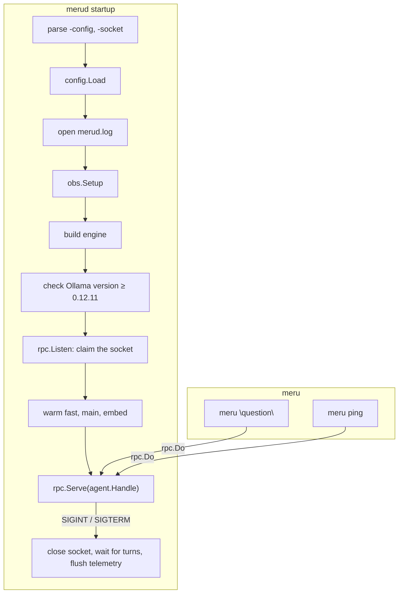

# merud and meru

**Code:** `cmd/merud/` (`main.go`, `runtime.go`), `cmd/meru/` (`main.go`)
**Milestone:** v0.1
**Architecture:** [The shape: daemon + thin client](../../ARCHITECTURE.md#the-shape-daemon--thin-client), [Model tiers](../../ARCHITECTURE.md#model-tiers)

## What it does

These are Meru's two programs. In Go, a folder under `cmd/` with
`package main` and a `func main()` builds into one program.

- **`merud`** runs all the time. It reads config, checks Ollama, loads the
  models, and answers questions on `~/.meru/merud.sock`.
- **`meru`** is the command you type. It sends one request to `merud`, prints
  the reply and exits. It holds no model or storage code.

## The picture



## Walk through the code

### merud: main.go

`main` does two things: it turns Ctrl-C and `SIGTERM` into a cancelled
context, and turns an error into exit status 1.

```go
ctx, stop := signal.NotifyContext(context.Background(), os.Interrupt, syscall.SIGTERM)
err := run(ctx, os.Args[1:], os.Stderr, newEngine)
stop()
```

Everything else lives in `run`, which tests can call. `run` takes the engine
builder as a parameter, so `TestRunServesAndStops` runs the whole daemon over
a fake engine.

`serve` claims the socket **before** warming the models. Warming the `full`
profile's main model can take a minute, and a second `merud` should fail at
once rather than after that minute. Clients that connect during warm-up wait
in the socket's queue.

Shutdown needs no special code. The cancelled context makes `rpc.Serve` close
the listener, cancel every open turn, wait for them and return. The deferred
telemetry shutdown then gets a fresh five-second context to send its last batch.

**Two seams wait for other packages.** Each is marked `TODO(coordinator)`:

- `newEngine` returns an error until the Ollama engine lands.
- `newRouter` returns `fallbackRouter`, which always picks the configured
  fallback route with outcome `degraded`, until the router lands.

### merud: runtime.go

`checkRuntime` asks the engine for Ollama's version and refuses anything older
than 0.12.11, the first release that reports log probabilities.
`versionAtLeast` compares versions number by number, so `0.12.11` beats
`0.9.99`, which a plain string comparison gets wrong.

`warm` sends a one-token request to each chat model and one embedding
request. When `fast` and `main` name the same model, as in the `lite` profile,
it loads that model once. A failure says which model and suggests
`ollama pull`.

### meru: main.go

```go
switch {
case flags.NArg() == 1 && flags.Arg(0) == "ping":
    err = ping(ctx, *socket, stdout)
case flags.NArg() == 1 && flags.Arg(0) == "chat":
    ...
default:
    err = ask(ctx, *socket, strings.Join(flags.Args(), " "), stdout)
}
```

- `meru "question"` and `meru question words` both work; the words are joined.
- `ask` writes each token to standard output the moment it arrives, as plain
  text, so pipes and scripts work.
- Exit status: 0 on success, 1 on any error, 130 after Ctrl-C (the shell's
  convention: 128 plus signal number 2).

`meru chat` is the Bubble Tea terminal UI, written in `chat.go`. `main.go`
declares a variable that `chat.go` fills in:

```go
var runChat func(ctx context.Context, socket string) error
```

Until `chat.go` exists, `runChat` is `nil` and `meru chat` prints
"chat not built".

## Go ideas used here

- **`signal.NotifyContext`** — a context that ends on a signal. More in
  [go-basics/context.md](go-basics/context.md).
- **`flag.FlagSet`** — the standard library's command-line flag parser. A
  `FlagSet` of our own, rather than the global one, lets tests call `run` many
  times.
- **Functions as values** — `run` takes `buildEngine func(config.Config) (engine.Engine, error)`.
- **`defer`** — closes the log file and flushes telemetry on every exit path.
  More in [go-basics/defer.md](go-basics/defer.md).
- **Errors up to `main`** — every function returns its error; only `main`
  prints it. More in [go-basics/errors.md](go-basics/errors.md).

## Try it

```sh
go test -race ./cmd/...
go run ./cmd/merud -config /tmp/meru-test/config.toml   # fails until the engine is wired in
go run ./cmd/meru ping
go run ./cmd/meru "hello"
```

## Why it's built this way

- **`run` returns instead of exiting.** `os.Exit` skips deferred calls and
  can't be tested; returning an error or a status code avoids both problems.
- **The socket before the warm-up**, so a duplicate daemon fails fast.
- **`meru` stays thin.** It imports only `rpc` and `config` (for the default
  socket path), and starts in milliseconds.
