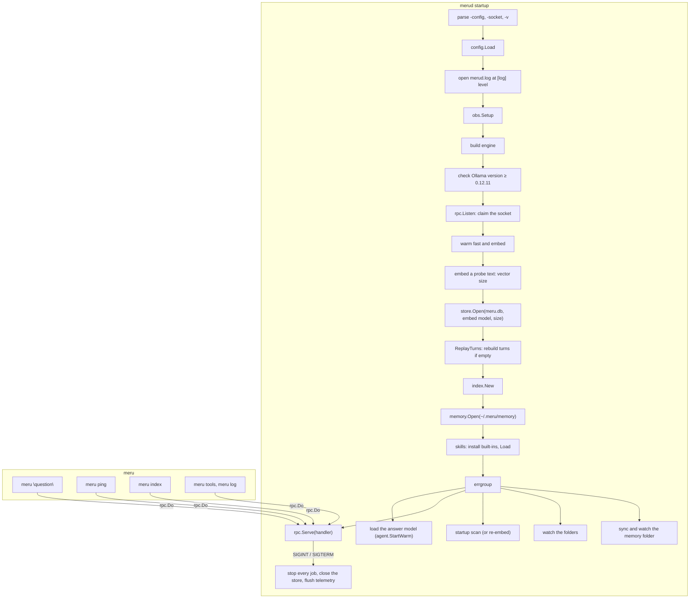

# merud and meru

**Code:** `cmd/merud/` (`main.go`, `runtime.go`, `ollama.go`, `index.go`, `backends.go`, `tools.go`, `connectors.go`, `memory.go`, `skills.go`, `sessions.go`, `history.go`, `attach.go`, `about.go`), `cmd/meru/` (`main.go`, `index.go`, `approve.go`, `tools.go`, `log.go`, `usage.go`, `run.go`, `look.go`, `setup.go`, `mcp.go`, `probe.go`, `user.go`, `memory.go`, `skills.go`, `check.go`, `checkfile.go`)
**Milestone:** v0.1; the store, the indexer and `meru index` in v0.2; the approval prompt, `meru tools`, `meru log`, `meru setup`, `meru mcp` and `meru usage` in v0.3; the memory folder and its ops, `meru setup user`, `meru memory`, memory recall, `meru skills`, the session replay and the summarizer in v0.4; `meru check` in v0.4
**Architecture:** [The shape: daemon + thin client](../../ARCHITECTURE.md#the-shape-daemon--thin-client), [Model tiers](../../ARCHITECTURE.md#model-tiers)

## What it does

These are Meru's two programs. In Go, a folder under `cmd/` with
`package main` and a `func main()` builds into one program.

- **`merud`** runs all the time. It reads config, checks Ollama, loads the
  models, opens the search index (`~/.meru/meru.db`), keeps it up to date with
  your `[index]` folders, and answers questions on `~/.meru/merud.sock`.
- **`meru`** is the command you type. It sends one request to `merud`, prints
  the reply and exits. It holds no model or storage code.

## The picture



## Walk through the code

### merud: main.go

`main` does two things: it turns Ctrl-C and `SIGTERM` into a cancelled
context, and turns an error into exit status 1.

```go
ctx, stop := signal.NotifyContext(context.Background(), os.Interrupt, syscall.SIGTERM)
err := run(ctx, os.Args[1:], os.Stderr, newEngine)
stop()
```

Everything else lives in `run`, which tests can call. `run` takes the engine
builder as a parameter, so `TestRunServesAndStops` runs the whole daemon over
a fake engine. `TestRunLogLevel` does the same with and without `-v`, and
checks what `merud.log` holds at each level.

`serve` claims the socket **before** it checks Ollama, and starts
`rpc.Serve` at once, so a second `merud` fails at once and a client can hear
why `merud` can't answer yet. Until `merud` is ready, every request goes
through a `gate` (see [ollama.go](#merud-ollamago)): it waits while Ollama is
checked and the fast and embedding models load, and it answers from the watch
on Ollama while Ollama is down or too old. `ollama.waitReady` returns once
Ollama answers and the models are warm; only then does `serve` build anything
that needs the engine. The answer model, which can take minutes, loads in the
background once the server runs (see below).

Because `rpc.Serve` runs from the start, a step that fails later must stop it
before `serve` returns. `fail` does that: it cancels the errgroup's context,
waits for the group, and returns the error. A test that waits for a ready
`merud` asks for `index_status`, which goes through the gate; `ping`, which the
rpc server answers itself, succeeds as soon as the socket opens.

After warming, `serve` opens the store with `openStore`. The store needs the
embedding model's vector size, and `embedDims` learns it by embedding one
short probe text, so config never holds a number that could go stale. When
the model or the size changed since the last run, the store drops the old
vectors (`store.NeedsReembed` then reports true).

Then seven jobs run side by side in an **errgroup** from
`golang.org/x/sync`, the server first and the rest once `merud` is ready:

```go
g, gctx := errgroup.WithContext(ctx)
requests := newGate(ollama)
g.Go(func() error { return rpc.Serve(gctx, ln, requests.handle, log) })
if !ollama.waitReady(gctx) {
	return g.Wait() // stopped while waiting
}
g.Go(func() error { ollama.watch(gctx); return nil })
// ... the store, the tools, the agent ...
warmAnswer := a.StartWarm()
g.Go(func() error { warmAnswer(gctx); return nil })
requests.open(handler(svc))
g.Go(func() error { idx.startupScan(gctx); return nil })
g.Go(func() error { idx.watchAndRescan(gctx); return nil })
g.Go(func() error { sum.Run(gctx); return nil })
g.Go(func() error { mems.watch(gctx); return nil })
return g.Wait()
```

`g.Go` starts a function in its own goroutine, and `g.Wait` waits for all of
them. `gctx` ends when `ctx` does, or when one function returns an error, so
all seven stop together. The answer model's load, the scan, the summarizer and the two watchers log their
own errors and return `nil`, so a folder that can't be read never stops `merud`. Because the
scan runs beside the server, questions get answers during a long first scan;
they search whatever the index holds so far.

`a.StartWarm()` returns a function, and a Go function can do that: the
function it returns keeps the variables it uses, here a channel, and runs
later. `serve` calls `StartWarm` before the gate opens, so the agent knows
a load is on its way before any question can arrive; the errgroup then runs
the load in its own goroutine. A question that reaches the answer model before
the load ends waits for it (`agent.WaitWarm`), and so does a model switch, so
Ollama never loads the answer model twice. See the agent's coding note,
"The startup warm-up", for why the load sends a real prompt and not "hi".

`handler` sends each request to the right place: `ask` to the agent, `index`
and `index_status` to the index service, `tools` and `log` to the tool service,
the three memory ops to the memory service, the three skill ops to the skill
service, and `usage` to `handleUsage`. The rpc server answers `ping` itself.

**Memory.** Before the tools, `serve` opens the memory folder with
`memory.Open(<home>/memory)`, which creates the six default kind folders. One
`*memory.Store` then reaches four places: the built-in `remember` tool
(through `newToolService` and `builtin.New`), the agent (through
`profileAdapter`, the agent's `Profile`), the memory service, and the memory
syncer, `index.NewMemories`, which the memory service owns. `newToolService`
also gets `mems.syncNow`, which `builtin.New` runs after each `remember`.

**Skills.** Next, `newSkillService(<home>/skills)` copies the built-in skills in
where no folder of that name exists and loads the registry. `serve` hands it to
the agent with `a.UseSkills(sk)`. `newToolService` expands the `~` in `[skills]
output_dir` with `expandHome` and passes the folder to `builtin.New` for
`write_file`.

**Usage.** Right after `openStore`, `replayTurns` calls `store.ReplayTurns`,
which fills the `turns` table from the session transcripts when the table is
empty, and logs how many rows it wrote. A failed replay logs a warning and
`merud` starts anyway: it costs `meru usage` some history, not the answer to
any question. `serve` passes `turnRecorder` to `agent.New` as the agent's
`TurnRecorder`, so each answered turn adds its row; see sessions.go below. `handleUsage` answers
`OpUsage` with one `usage` event that holds `store.Usage(ctx, time.Now())`: six
windows, with today, week and month in `merud`'s local time.

Shutdown needs no special code. The cancelled context makes `rpc.Serve` close
the listener, cancel every open turn, wait for them and return; the scan and
the watcher see the same context and return too. The deferred calls then close
the store and give telemetry a fresh five-second context to send its last
batch.

**The log.** `openLog` opens `merud.log` for appending and builds the logger
every package shares. `-v` sets the level to `debug`, whatever `[log] level`
says. The text handler goes inside `obs.LogHandler`, which adds the turn's
`trace_id` to each line logged with a span in its context:

```go
text := slog.NewTextHandler(f, &slog.HandlerOptions{Level: lv})
return slog.New(obs.LogHandler(text)), func() { _ = f.Close() }, nil
```

The first line `run` writes is `merud starting`, with the settings that decide
how a turn runs: the profile, each tier's model, Ollama's address and
`keep_alive`, `history_turns`, the OTLP endpoint (or `off`), the log level,
and how many `[index]` folders it indexes.
`serve` passes the same logger to the engine (`newEngine`), the router
(`newRouter` sets `router.Config.Log`), the agent and the socket server.
`engineBuilder` names the engine builder's type, so tests can pass a fake.

### merud: runtime.go

`versionAtLeast` compares versions number by number, so `0.12.11` beats
`0.9.99`, which a plain string comparison gets wrong. `checkOllama` in
`ollama.go` uses it to refuse an Ollama older than 0.12.11, the first release
that reports log probabilities.

`warm` sends a one-token request to the fast model and one embedding
request, and logs `warmed` with the time each took. The router needs the
first on every question, and `openStore` needs the second. At debug level the
engine's own lines show each call's status and Ollama's load time. A failure
says which model and suggests `ollama pull`; the watch on Ollama reports it
as failed and tries again in 30 seconds. The answer
model isn't here: the agent loads it in the background (see `StartWarm`
above), logs `answer model warm` when it is, and logs `couldn't load the
answer model` with the `ollama pull` command when it can't, without stopping
`merud`. In the `lite` profile the fast model is the answer model, so `warm`
has loaded it already and the background load is quick.

### merud: ollama.go

This file holds the watch on Ollama, the one connector `merud` only reports on,
and the `gate` in front of `merud`'s handler (ARCHITECTURE.md, "SearXNG and
Ollama").

`ollamaWatch` keeps Ollama's state and sentence under a mutex, as a
`connectors.Status` with the ollama manifest's name, kind and `Required`:

| Method | What it does |
| --- | --- |
| `waitReady(ctx)` | `tryReady` now, then after each `wait`, until it passes or `ctx` ends |
| `tryReady(ctx)` | `checkOllama`, then `warm`; sets `failed`, `starting` or `ok` with the sentence |
| `wait(ctx)` | sleeps 30 seconds, or until `poke` |
| `poke()` | asks for a check now; never blocks |
| `watch(ctx)` | after `merud` is ready, checks every 30 seconds so the status stays true |
| `answer(req, emit)` | while Ollama fails: Ollama's row for `connectors`, no servers for `mcp_status`, and `notReady`'s error for the rest |

`checkOllama` returns the version and a sentence: "Ollama isn't running at
http://127.0.0.1:11434.", "Ollama 0.12.0 is too old; Meru needs 0.12.11 or
later.", or "" when all is well. A down Ollama gives every request the error
"Ollama isn't running, so Meru can't answer yet."; any other failure gives
"Meru can't answer yet: " and the sentence.

`poke` sends on a **buffered channel** of size 1 inside a `select` with a
`default`. The buffer holds one signal, so many requests at once make one
check, and the `default` case makes the send give up at once when the buffer
is full, so a request never blocks:

```go
select {
case o.nudge <- struct{}{}:
default:
}
```

`set` closes `changed` and makes a new one at each change of state, the same
trick the connector supervisor uses: a closed channel is ready to read for
every reader at once, so each request waiting in the gate wakes up.

`gate.handle` answers one request. Once `open` has run, it calls the full
handler. Before that, while Ollama fails, it pokes the watch and answers from
it. Otherwise it waits for whichever comes first: the gate opening, Ollama's
state changing, or the client hanging up. `open` writes `full` before it
closes `ready`, and `handle` reads `full` only after `ready` is closed, so
`full` needs no lock: Go's memory model orders a channel's close before any
receive that sees it.

`ollama_test.go` runs `merud` over a fake engine whose `Info` fails, then
reports 0.11.0, then 0.13.0 (`TestServeWaitsForOllama`), and checks the
connectors op, the error a question gets, `mcp_status` with no servers, and
the answer once Ollama is ready. `TestServeStopsWhileWaiting` stops `merud`
before Ollama ever answers, and `TestOllamaWatchAfterReady` stops and starts
Ollama under a ready `merud`. `TestCheckOllama` in `main_test.go` covers each
sentence.

### merud: index.go

`indexService` owns everything about the index outside a turn:

- **`startupScan`** runs `Scan`, or `Reembed` when the store dropped its
  vectors for a new embedding model. `Reembed` embeds every file again even
  though none changed, so search by meaning works again. The indexer logs the
  scan's counts and time at info level, and each file at debug.
- **`watch`** runs the indexer's file watcher.
- **`run`** makes scans take turns. `turn` is a channel with room for one
  value: sending into it takes the turn, reading from it gives the turn back.
  Unlike `sync.Mutex`, a `select` can wait for the turn and for `ctx` at once,
  so `meru index` gives up cleanly when you press Ctrl-C while it waits.
- **`handleIndex`** answers `meru index`: a rescan of every folder, or
  `IndexPaths` for one path. A path outside every `[index]` folder comes back
  as `index.ErrOutsideFolders`, which `handleIndex` turns into a message that
  names the config file and says to restart `merud`. For v0.2, config is the
  only way to add a folder.
- **`handleStatus`** answers `meru index -status` with the store's counts,
  the size of `meru.db` with its `-wal` and `-shm` files (`DBBytes`, from
  `store.DiskBytes`), whether a scan runs, and the last full scan's report.

`handleStatus` also fills `Memories` and `Profile` from the memory service:
how many memory files there are, and how many sit in `me/` and `preferences/`.
Both are -1 when the memory folder can't be read. A `Profile` of 0 tells `meru
chat` that Meru doesn't know you yet.

`searchAdapter` joins the agent's `Searcher` interface to `retrieve.Search`
and `retrieve.SearchSessions` over the store, the way `routerAdapter` joins the
router.

### merud: sessions.go

This file keeps the past-conversation tables (`sessions`, `messages` and
their indexes) in step with the transcripts, at three moments:

- **At startup.** `replaySessions` runs right after `replayTurns`. On a fresh
  `meru.db` it reads every transcript; after that, only the lines added while
  `merud` was stopped, because the store remembers how many bytes of each file
  it has read. A failure logs a warning and `merud` starts anyway.
- **After each turn.** `turnRecorder` is the agent's `TurnRecorder`. Its
  `InsertTurn` writes the `turns` row, then calls `store.ReplaySession` for the
  turn's session, which reads only the turn's new lines. A failed replay logs a
  warning; the next replay catches up.
- **After each summary.** The summarizer replays the session itself.

`newSummarizer` reads `[agent] summary_idle` and builds a
`summarize.Summarizer` on the `fast` model. `serve` runs its `Run` as the
errgroup's fourth job: a pass at once, then one a minute, until `merud` stops.
See [summarize](summarize.md).

### merud: history.go

This file answers the two ops the desktop app uses for past chats. The handler
sends `sessions` and `session_turns` to a `historyService`, which holds the
sessions folder and the home folder.

- `handleSessions` calls `transcript.List`, 200 sessions at most by default, and
  writes each time in RFC 3339.
- `handleTurns` opens the session with `transcript.Open`, which checks the ID's
  shape, so a client can't name a file outside the folder. `turnsOf` then walks
  the lines once: a user line starts a turn, a `tool_call` line adds a step and
  remembers its index by call ID in a map, the matching `tool_result` line fills in
  the outcome and time, and the assistant line adds the answer, the route, the
  notice the user read under it, if any, and the sources, shortened to `~/...`
  with `rpc.ShortPath`. The line's `Notice` field comes with #29; this branch
  adds the same field, word for word, so the desktop app can show the note again
  when a chat reopens. A user line's `Images` go on the turn as they stand, full
  paths, since the app reads the copies to show their previews.

Both read the files, never `meru.db`, so deleting the database loses no chat.

### merud: chats.go

The chat list ops. `handleDelete` forgets an incognito chat through the agent's
`ForgetIncognito`, or deletes a chat's file with `transcript.Delete` and then its
content rows with `store.DeleteSession`, which keeps its `tool_calls` rows without
arguments or results. A file that is already gone still gets the same.
`handleMove` and `handleTag` go through `changeMeta`: open the chat, read its
`Meta`, change it, `SetMeta`, replay the session so search sees new tags, and
answer with the chat's row from `Session.Info`. The folder ops read and write
`folders.json`; rename and remove call `refile`, which appends a meta line to each
chat in the folder.

`historyService` gained the store, the forget function, a logger and `mu`, a
`*sync.Mutex`. It is a pointer because `historyService` is passed by value and all
copies must share one lock; `newHistoryService` builds it. `save.go` refuses an
incognito chat before it opens anything.

### merud: memory.go

`memoryService` answers the three ops that `meru memory` and `meru setup user`
send:

| Op | What it does | Reply |
| --- | --- | --- |
| `memory_list` | `memory.Store.List` | one `memories` event with every memory |
| `memory_add` | `memory.Store.Add(req.Kind, req.Text, "meru")` | one `memories` event with the new memory |
| `memory_forget` | `memory.Store.Forget(req.ID)` | `done` |

`memoryInfo` copies each `memory.Memory` into `rpc.MemoryInfo`, with `Created`
as `YYYY-MM-DD`, or `""` for a file you wrote by hand. `handleForget` turns
`memory.ErrNotFound` and `memory.ErrBadID` into messages that say how to find
the right ID, and `errors.Is` finds them through the wrapping.

A memory you add through the client gets the source `meru`. `Request.Source`
can't say whether it came from `meru setup user` or `meru memory add`: it is a
metric attribute with three fixed values. `meru` still tells your own facts
apart from the model's, which carry `session <id>`.

These ops don't go through `dispatch`. They are your own commands
(ARCHITECTURE.md, "Memory", "Your commands"), like editing a file by hand. The
model's way to save a memory, the `remember` tool, does go through `dispatch`,
so every memory the model writes lands in `tool_calls` and the transcript.

`profileAdapter` gives the agent the profile. It reads the `me` and
`preferences` folders with `memory.Store.ListKind`, and no others. Reading
every folder took 13 ms per turn with 500 other memories; the two folders take
about 0.6 ms for 20 files, so there is no cache.

`profileAdapter.Recall` gives the agent the memories recalled for a question:
`retrieve.SearchMemories` over the store, leaving out the profile kinds, top
`recallN` (5).

**Keeping the store in step.** The memory service holds the syncer and copies the
folder into the store's `memories` table four ways:

| When | How |
| --- | --- |
| at start | `watch` runs `Sync` once before it starts watching |
| `memory_add` or `memory_forget` succeeds | `syncNow`, before the reply |
| `remember` saves a memory | `syncNow`, through `builtin.New`'s `onRemember` |
| you edit a file by hand | the watcher runs `Sync` once the folder has been quiet for 500 ms |

`Sync` embeds only files whose mtime or hash changed, so the calls after an add
cost one embedding. A failed `syncNow` logs a warning and leaves the op's reply
alone: the file already holds the change, and the next sync copies it over. The
next question, even a moment later, can recall a memory you just added.

### merud: skills.go

`skillService` owns `~/.meru/skills` while `merud` runs. It holds the last
registry and the `skills.Stamp` taken just before loading it, both guarded by
one `sync.Mutex`, because turns ask for the registry from many goroutines.

`Registry(ctx)` is the method the agent calls once per turn. It takes a fresh
stamp, and when the stamp differs from the one it holds, it loads the registry
again. A stamp costs one directory read and one stat per skill, a few
microseconds, so a skill you add or edit by hand counts from the next turn with
no restart. A file watcher would do the same with more moving parts: a watch on
the folder and on each skill folder, kept in step as folders come and go, and a
goroutine to own it. Each load logs one `skill skipped` warning per bad folder
and one `skills loaded` line with the names and the disabled ones.

`newSkillService` takes `[skills] disabled` and hands it to both
`skills.InstallBuiltins` and `skills.Load`, so a disabled skill is neither
installed nor loaded. A disabled name that is neither a built-in nor a folder
under `~/.meru/skills` gets one info line, `disabled skill not found`; it isn't
an error, because you may add that skill later. `TestSkillServiceDisabled`
checks that a disabled built-in stays off disk and out of the list.

The service answers three ops:

| Op | What it does | Reply |
| --- | --- | --- |
| `skills` | every loaded skill, with `Builtin` from `skills.IsBuiltin` and `Edited` from `skills.Edited` | one `skills` event; its `Text` holds the skipped folders' reasons, one per line |
| `skill_show` | `Registry.File(req.ID)`, the whole `SKILL.md` | one `skills` event with `Body` set |
| `skill_reset` | `skills.Reset(dir, req.ID)`, then a reload | `done` |
| `skill_enable`, `skill_disable` | `handleSetDisabled`: edits `[skills] disabled` with `catalog.SetTableLists`, installs a built-in that comes back on, and reloads | one `skills` event |

The `skills` list ends with the disabled skills, each with `Disabled` set, so the
desktop app can show a switch that turns one back on. `disabled` now sits behind
the service's mutex, since `handleSetDisabled` changes it while turns read it.

`Edited` compares your file's bytes with the copy inside the binary, so saving
the file unchanged doesn't mark it. A reset of a skill Meru doesn't ship fails
with a message that names the two built-ins.

These ops don't go through `dispatch`: they are your commands, like editing a
file by hand. The model's way to write a file, `write_file`, does.

`names` returns the loaded skills and the disabled ones, for `about_meru`. It
goes through `Registry`, so a skill added by hand counts at once.

### merud: backends.go

`mcpBackend` joins the MCP pool to `dispatch`, and `mcpServerConfigs` turns the
`[[mcp.servers]]` entries into the pool's settings, secrets resolved. Both are
described in [dispatch.md](dispatch.md). `probeConfig` does the same for the one
server a probe names, and `probeResult` copies `mcp.ProbeInfo` into
`rpc.ProbeResult`. The `mcp` package doesn't import `rpc`, so `main` joins them.

`mcpBackend` also has a `Refresh` method, one line that calls `pool.Refresh`.
That method makes it a `dispatch.Refresher`, so the agent loop's refresh at the
start of a tools turn reaches the pool: a fresh `tools/list` from each connected
server, and one try at each server that isn't connected (see [mcp.md](mcp.md)).
Go has no `implements` keyword: a type satisfies an interface by having its
methods, and `Dispatcher.Refresh` checks for the method at run time.

`mcpStatus` turns the pool's `[]mcp.ServerStatus` into the rows `meru mcp`
prints:

```go
row := rpc.MCPStatus{
    Name:      st.Name,
    Transport: st.Transport,
    State:     rpc.MCPConnected,
    URL:       st.URL,
    Tools:     st.Offered,
    Allowed:   st.Listed,
    Confirm:   st.Confirms,
}
if !st.Connected {
    row.State, row.Tools, row.Err = rpc.MCPNotConnected, -1, st.LastError
}
```

A server that isn't connected gets `Tools = -1`, which the client draws as `—`:
with no tool list, any count would be a guess. `Allowed` and `Confirm` come from
config, so they show either way. The line inside the `if` sets three fields at
once, in the order the line names them.

A connector's row comes from a managed pool entry (`st.Managed`). `mcpStatus`
copies its state and sentence into `Connector` and `Sentence`, since they say
more than connected or not: "Obsidian is ready. It starts when a question needs
it." `mcpBackend.Status`, the list `meru tools` and `about_meru` read, does the
same for `rpc.ServerInfo`.

### merud: tools.go

`toolService` owns what tool calls need while `merud` runs: the secrets, the MCP
pool, the A2A client, the built-in tools, the local commands and the
`dispatch.Dispatcher` that joins them.

`newToolService` checks the `[[commands]]` entries with `commands.New` first,
before any MCP server starts, so a bad entry stops `merud` with an error that
names it and leaves nothing to clean up. Next it builds the connector
supervisors with `newConnectorSet` (see [connectors.go](#merud-connectorsgo)
below), then the pool with `newPool(ctx, cfg, sec, conns, log)`. The connectors
come first because the pool reaches each one through its supervisor. `newPool`
works in this order:

1. `mcpServerConfigs` resolves the secrets in each `[[mcp.servers]]` entry and
   checks it. A bad entry fails here, before the connectors see the new
   config, so it changes nothing.
2. `conns.configure` hands each supervisor its `[connectors.<id>]` table.
3. `mcp.NewPool` starts over both lists: the entries added by hand, which it
   connects to now, and `conns.serverConfigs()`, one managed entry per
   connector that is on, which its supervisor starts on the first call.

It then joins the four backends in this order:

```go
s.dispatcher = dispatch.New(
    []dispatch.Backend{bt, cmds, mcpBackend{pool: pool}, ac},
    st,
    dispatch.Options{Redact: s.redact, Log: log},
)
```

Before it builds the dispatcher, it calls `bt.ReadSessions` with the sessions
folder under the Meru home, so `list_folder`, `grep` and `read_file` read the
past chats; the indexer never indexes them (see [builtin](builtin.md)).

The first backend to offer a name keeps it, so no MCP server can shadow
`configure`, and one named `cmd` can't shadow a command. The commands don't
reload with the MCP servers: a change to `[[commands]]` needs a restart. Besides
`tools` and `log`, it answers the two ops `meru mcp add` uses, and the one behind
`meru mcp` and `/mcp`:

| Op | What it does | Reply |
| --- | --- | --- |
| `mcp_probe` | reads `secrets.toml`, resolves the `secret:` values in `req.Server`, and calls `mcp.Probe` | one `probe` event with every tool the server offers and its hints |
| `mcp_reload` | `reloadMCP`, then the same reply as `tools` | one `tools` event |
| `mcp_status` | `handleMCPStatus`: `mcpStatus(pool.Status())` | one `mcp_status` event, a row per server in config order, then one per connector the pool runs |
| `connectors` | `handleConnectors`: `conns.statuses(ollama.status())`, read from each supervisor and the watch on Ollama; starts nothing | one `connectors` event, a row per connector in manifest order (obsidian, ollama, searxng), off and set up by hand included |

**Status.** `handleMCPStatus` takes the current pool under `s.mu`, since a reload
may swap it, and reads `pool.Status()`. That reads what the pool holds and sends
nothing to any server, so `meru mcp` answers at once while a server is down.
`TestMCPStatusOp` builds a pool with one server up and one that answers 503,
checks both rows, and checks that the op sent the down server no request.

**Probe.** `handleProbe` loads `secrets.toml` from disk each time instead of using
the copy it holds, because `meru mcp add` may have saved the server's key a moment
before. The probe calls no tool and the model never sees what it finds, so it
skips `dispatch`: like the memory ops, it is a command you run. The error text
goes through `Redact` before it leaves, in case a server echoes a key back.

**Reload.** `reloadMCP` is the path the `configure` tool already used. It loads
`config.toml` and `secrets.toml`, builds a new pool from the servers config lists
now, swaps it into the dispatcher with `Replace`, and closes the old pool:

```go
s.mu.Lock()
old := s.pool
s.pool, s.secrets = pool, sec
s.started.MCP = cfg.MCP
s.started.Connectors = cfg.Connectors
s.connected = agent.ConnectedTools(s.conns.routerServers(s.started))
s.mu.Unlock()
s.dispatcher.Replace(dispatch.KindMCP, mcpBackend{pool: pool})
old.Close()
```

`connected` is the list of servers, commands and web search that the router's
prompt names (see [router.md](router.md)). `newToolService` builds it from
config at startup, and a reload builds it again with the new `[mcp]` servers
and connectors and the rest as `merud` started, since only the pool reloads.
`routerServers` adds an entry for each connector the pool runs, with its name
and allow list, so the router names Obsidian whether you added it by hand or
turned the connector on. `newRouter` takes
`connectedTools`, the method that reads it under the lock, so `merud` builds
the router after the tool service. The list changes only at startup and on a
reload, so the router's prompt opens the same way from turn to turn.

The new pool has no memory of the old one, so a server you added appears, one you
changed restarts with its new settings, and one you removed is gone. `old.Close()`
stops every child the old pool started, the removed server's included. The
connectors are the exception: their supervisors outlive the pool. `newPool`
hands each one its table again, and one whose config didn't change keeps its
program running across the reload, while one that failed gets a fresh try. A config
that fails to load, or a bad server entry, returns the error before anything
changes, and the old pool keeps running. `reload`, a second mutex, lets one
reload run at a time.

`Close` stops the pool first, then the connectors with `conns.Close`, then the
A2A client. With the pool gone, no call can ask a supervisor for a session
while it stops.

`handleReload` passes `context.WithoutCancel(ctx)`: a context with the request's
values but none of its cancellation. A client that hangs up mid-reload then can't
leave `merud` with a pool whose servers all failed to start.
`TestMCPReloadStopsOldChildren` runs the test binary as a stdio server, changes
and then removes it, and checks each old process is gone.

**Built-in tools.** `newToolService` hands `cfg.Builtin` to `builtin.New`, whose
`tools` list says which built-ins the model may use. Right after, it logs one
`built-in tool off` info line for each entry of `bt.Off()`: a tool the list
names whose setting is missing, such as `grep` with no `[index] folders`. The
e2e test `TestBuiltinToolsSwitch` cuts the list to `datetime` and `grep`, and
checks what `meru tools` shows and that the log says why `grep` is off.

**Web search.** `newToolService` also hands `cfg.Web` to `builtin.New`, which
offers `web_search` when `searxng_url` is set. `web_fetch` needs no `[web]`
key. `builtin.New` calls `ix.ReadAlso` on the output folder, so the file tools
can read what `web_fetch` downloads and the mail attachments the `google`
server saves. `newToolService` passes `bt.AttachmentText` to `dispatch.New`
as `Options.Attachments`, so a result that names an attachment the call just saved
gets its text (see [dispatch](dispatch.md)). After `New`, it calls
`bt.UseModel(eng, cfg.Models.Fast)`, so `web_fetch` can answer a prompt with the
fast model. `newToolService` takes the engine as a `builtin.Generator`, the one
method that needs. Then it calls `bt.UseWebCheck(conns.webOK)`, so the model
gets `web_search` only while the SearXNG connector is ok. `merud` no longer
logs a web search line of its own at startup: the connector logs each change
of state. `TestWebSearchMissingSearXNG` in `test/e2e` starts `merud` with
nothing on the SearXNG port and no `[connectors.searxng]` table, and checks
that `meru mcp status` gives the reason, `meru tools` lists `web_fetch`
without `web_search`, and a turn offers the model no `web_search`.

### merud: connectors.go

This file joins the connector supervisors (see [connectors](connectors.md)) to
the rest of `merud`. `connectorSet` holds one `*connectors.Supervisor` per stdio
connector, in manifest order, and `web`, the `*connectors.Container` for
SearXNG. `newConnectorSet` loads the manifests, makes an `Installer` over
`~/.meru` and the home folder, and builds each supervisor. It hands the
container two functions: `checkSearXNG`, which wraps `catalog.CheckSearXNG`
and turns a refused connection into `connectors.ErrNothingListens`, and a
`prepare` that writes `~/.meru/searxng/settings.yml` with
`catalog.WriteSearXNGSettings` before Meru's container first starts.
The set is built once and never swapped: `toolService.conns` keeps it for
`merud`'s whole life, and every pool a reload builds asks the same supervisors
for sessions.

| Method | What it does |
| --- | --- |
| `configure(cfg, sec)` | hands each supervisor its `[connectors.<id>]` table and the secrets, with `byHand` true when `[[mcp.servers]]` has an entry of the same name, then calls `configureWeb` |
| `configureWeb(cfg)` | hands the SearXNG container its table, `[web] searxng_url`, and whether `[builtin] tools` lists `web_search`; `reloadBuiltin` calls it too |
| `webOK()` | whether web search works now, with the sentence; the built-in tools' `UseWebCheck` |
| `serverConfigs()` | one managed pool entry per connector that isn't off or set up by hand: its ID as the name, the manifest's tool lists, the supervisor as `Spawn` |
| `routerServers(cfg)` | `cfg` with an `[[mcp.servers]]` entry added per connector the pool runs, for the router's list |
| `statuses(extra...)` | every connector's `rpc.ConnectorStatus`, Ollama's row passed in as `extra`, sorted by ID, for the `connectors` op |
| `byID(id)` | one stdio connector's status, for `connections.go` |
| `Close()` | stops each supervisor and waits for its goroutines |

**The hand-added entry wins.** An `[[mcp.servers]]` entry named `obsidian`
runs through the pool's own rules, unchanged, and the connector reports
`by_hand`. `serverConfigs` then gives it no pool entry, so the pool and the
router hold one `obsidian` at most. A connector that is off gets no entry
either, so it stays out of `mcp_status`.

`handleConnectors` answers the `connectors` op from what each supervisor holds,
so it answers at once while a connector installs or restarts.

`connectors_test.go` builds a real set over a temporary `~/.meru`.
`TestConnectorsJoinThePool` walks the join table-driven: no table gives `off`;
a hand-added entry gives `by_hand`, with or without a table that turns the
connector on; a table with no vault gives `needs_config` and a managed entry.
Each case checks that the hand-added entry reaches the pool unchanged, and
that the pool and the router each hold one `obsidian`, or none when it is off.
One case is the owner's own setup, an `npx obsidian-mcp` entry with no
`[connectors.obsidian]` table, which must keep working as it did.
`TestConnectorsOp` checks the op's reply for a connector that needs config,
and that it lists obsidian, ollama and searxng in manifest order.
`TestWebConnectorRule` runs the SearXNG connector against a fake SearXNG and a
closed port: a config from before connectors is checked and reported, a
working SearXNG reads "uses the SearXNG already running", and `enabled =
false`, a missing URL or `web_search` left out turn it off. No case lets it run
docker.

### merud: connections.go

The desktop app's Settings changes tools through four ops, and lists them through
a fifth. `connectionsEvent` loads `config.toml` fresh and joins it with
`dispatcher.Servers()`: a `Connection` for the built-in tools, each MCP server,
each A2A agent and the local commands. `fillPolicies` lists every tool a source
offers (from `OfferedTools`) plus any config allows, each with `policyOf`'s
answer: `off` when `allow` leaves it out, `always` when `always_confirm` names it,
`ask` when `confirm` does, `allow` otherwise. `catalogEntries` adds the catalog,
marking what config has and which keys `secrets.toml` holds.

After the `[[mcp.servers]]` entries come the connectors the pool runs, one
`Connection` each from `connectorConnection`. The card carries the connector's
state, sentence and fix list, and is `Fixed`, with a note that says its tool
lists come from its manifest: config has no lists to change yet, so the
switches don't move and the card has no Remove. A hand-added server that takes
a connector's place gets `Connector = by_hand` and the connector's sentence.

- `handleToolPolicy` checks the change, then `setEntryPolicy` or
  `setBuiltinPolicy` computes the new lists with `newLists` and writes them with
  `catalog.SetEntryLists` or `catalog.SetTableLists`. A tool must be one the
  source offers or config names. `allow` is refused for an `always_confirm` tool
  and for `configure`. Then the matching reload runs: `reloadMCP`, `reloadA2A`, or
  `reloadBuiltin`, which hands `bt.SetLists` the new `[builtin]` lists.
- `handleMCPAdd` appends a catalog server's block once `secrets.toml` holds its
  key, and reloads. `handleMCPRemove` takes a block out and reloads.
- When the request carries `Custom`, `handleMCPAdd` hands it to
  `handleCustomAdd`, the app's form for a server of the user's own. `customEntry`
  checks it with the rules `meru mcp add stdio` and `meru mcp add http` follow:
  `catalog.CheckName` for the name, a command or a URL but not both, a URL off
  this machine only with the "on another computer" tick, and environment
  variables only for a program `merud` starts. Any program may be the command,
  `npx` and `uvx` included; only `[[commands]]` entries refuse interpreters. A
  variable ticked Secret becomes `secret:<server>_<name>` in `config.toml`, and
  its value goes to `secrets.toml` before the block does, because a reload with a
  missing secret fails for every server. The block comes from `catalog.Custom`
  with an empty `allow`, so every tool the server offers shows Off until the user
  turns it on. `custom_test.go` checks each refusal, that comments survive, and
  that the secret's value lands in `secrets.toml` and nowhere else.
- `handleSecretSet` saves a key under a name config or the catalog uses, then
  reloads, and replies with `done` alone, so no key ever comes back.

Each write runs inside `s.bt.EditConfig`, the lock `configure` holds, so two
writers never read the same file and each replace it with their own change.
`reloadA2A` builds a new A2A client and swaps it in with `dispatcher.Replace`, as
`reloadMCP` does for the pool; `started` now holds config as `merud` last loaded
each part, and the router's list of what is connected follows every reload.

### merud: folders.go

`handleFolders` lists the `[index]` folders with `store.CountPaths` for each, and
the suggested folders (`~/Documents`, `~/Notes`, `~/Desktop`) that exist and
overlap no indexed folder, each counted by `index.CountFiles` up to 2,000 files
and 3 seconds in all. `handleFolderAdd` refuses a path that isn't full, doesn't
exist, isn't a folder, is the disk's root, the home folder or Meru's own home, or
overlaps an indexed folder. Both it and `handleFolderRemove` go through
`changeFolders`, which runs the change under the config lock, writes `[index]
folders` with a check that the list came out as asked, calls
`index.Indexer.SetFolders`, and stores the list that `currentFolders` hands the
agent and the router every turn.

`changeFolders` then sends on `changed`, a channel with room for one value, inside
a `select` with a `default`: a second change before the loop wakes needs no second
signal. `watchAndRescan`, which `serve` runs in place of the plain watcher, waits
on that channel. On a signal it stops the watcher, starts a new one over the new
folders, and scans. The watcher runs in a goroutine the loop owns: `stop` cancels
it and waits on its `done` channel, which the goroutine closes as it returns.

### merud: save.go

`saveService.handleSave` answers `save_file`. It reads the session's turns with
`turnsOf`, writes the Markdown (`chatMarkdown` for the whole chat, or the note as
sent), picks `chats/` or `notes/` and a name from the date and `slug` of the title,
and with `freeName` adds `-2` and up when a file has the name already. Then it
makes one `dispatch.Call` to `write_file`, with the session's `Append` and the
request's `approve`, so the save lands in `tool_calls` and the transcript and asks
first as `write_file` does. `saveSource` names the client on the call: `tui` when
`meru chat`'s `/save` sent it, and `desktop` for anything else, so the source stays
one of a fixed few, as a metric attribute must. The outcome decides the reply: a
`saved` event with the path, or an error that says whether the user said no or
`write_file` is off.

### merud: attach.go

`toolService.handleAttach` answers `attach_file`, which the desktop app sends for
each file the user picks or drops, and `meru chat` for each path `/attach` names. It hands the path to the built-in tools'
`Upload` (see [builtin](builtin.md)), which copies the file into
`<output_dir>/uploads/`, and replies with a `saved` event that names the copy.
`Upload`'s error goes back as it stands, because the app shows it to the user.
The event's `Kind` passes on what `Upload` found, `image` or `file`. The copy is
the user's act, not the model's, so it skips `dispatch`; the `read_file` call
that later reads a file's copy goes through it.

The same file holds `capabilityCheck(eng, capability)`, which `run` hands the
agent twice: `a.UseImages(tools.bt.Image, capabilityCheck(eng, engine.Vision))`
and `a.UseToolCheck(capabilityCheck(eng, engine.ToolUse))`. The agent reads a
question's images through the built-in tools' `Image`, which refuses any path
outside the uploads folder, and asks the vision check whether the main model
can look at them. It asks the tools check whether the main model can take a
list of tools at all (see [agent](agent.md), "Answer models without tools").
`capabilityCheck` needs `OllamaEngine.Capabilities`, which sits outside the
`Engine` interface, so it asks with a *type assertion*:
`oe, ok := eng.(*engine.OllamaEngine)` gives the concrete engine and `ok`
true when `eng` holds one. The tests' fake engine isn't one, so
`capabilityCheck` returns nil: the agent then refuses questions with images
rather than send them to a model that might not see them, and offers tools
without a check.

### merud: about.go

`aboutService` gathers what the built-in `about_meru` tool reports (see
[builtin](builtin.md)). `serve` builds it last, once the store, the indexer,
the tool service, the skills and the machine line exist, and hands its
`facts` method to `tools.bt.UseAbout`. `facts` runs on each call, so the answer
shows the setup as it is then, a folder the desktop app just added included.

Each fact comes from a place `merud` already keeps:

| Fact | Source |
| --- | --- |
| profile, the fast and embed models | `cfg`, as `merud` started with it |
| the answer model | `main`, which is the agent's `Main`, since Settings can switch it |
| Ollama's version | `eng.Info`, at most 3 seconds |
| the main model's capabilities, size, quantization, context | `Details`, through the `modelDetailer` interface, at most 3 seconds |
| the computer | the `machineLine` the prompt carries |
| folders, files, chunks, database size | `idx.currentFolders`, `st.Stats`, `st.DiskBytes` |
| MCP servers, A2A agents, commands | `tools.dispatcher.Servers`, the list `meru tools` prints, with a connector's sentence |
| web search | `web`, the SearXNG connector's `webOK`: its sentence, such as "Web search is off." |
| skills on and off | `skillService.names` |
| memories by kind | `mem.List`, keeping only each memory's kind |

`modelDetailer` is an interface with the one method `Details`, defined here,
where it is used. `eng.(modelDetailer)` asks whether the engine has it:
`OllamaEngine` does, so the real `merud` reports the details; the tests' fake
engine gets a `Details` method in `about_test.go`. A fact that fails stays out,
with a debug line, and the tool still answers.

`facts` copies names, counts and paths only. `rpc.ServerInfo` holds no env or
header values, and `facts` skips each server's last error, which can quote a
URL, and each memory's text. `TestAboutMeruFacts` builds a real tool service
over a Streamable HTTP server reached with a `secret:` header and a stdio
server started with a `secret:` env value and a plain one, runs `about_meru`
through `dispatch`, and checks that the answer names the models, both servers,
the command, the disabled skill and the memory count, and holds neither secret,
the plain env value nor the memory's text.

### merud: models.go

This file answers the four model ops: `models`, `model_use`, `model_save` and
`model_set`. `newModelService` builds the service once at startup. It finds the
model set in use, the first `[[models.sets]]` entry whose models match the ones
`merud` started with, and tells the agent that set's think setting with
`SetMain`. When no set matches, `[models] think` decides, off unless it says
`true`, so a fresh install answers without thinking, as the benchmark ran.
`handleModelSet` follows the same rule for a model picked in Settings. The service is a pointer, `*modelService`, because it holds a
mutex and the name of the set in use, and a copy of either would be a bug.

`modelService.handleModels`
answers `models`, and `info` gathers the reply: the profile, the fast and embed
models from config, and the answer model from the agent's `Main`, since a
switch can change it. It asks the engine's `Info` for the Ollama version
and the models it holds, and waits at most 3 seconds. A runtime that doesn't
answer leaves the list empty and says why in `Err`.

`info` also fills `Choices` from `config.KnownModels()`, the models we
tried as the answer model. For each, `Pulled` (GET `/api/tags`) says whether
Ollama has it, and for one it has, `Details` gives Ollama's own list of what it
can do; one it lacks keeps the list from `known.go`. `Tiers` names `main` and
`fast` where the model fills them, and `Pull` and `Run` hold the two commands the
page shows. Both engine methods sit outside the `Engine` interface, so
`modelService` reaches them with a type assertion, `m.eng.(modelLister)`, as
`about.go` does for `Details`.

`handleModelSet` answers `model_set`, the Settings screen's "Use for answers" button.
When you pick `gemma3:12b` it:

1. refuses a name that isn't on the known list, and one `Pulled` doesn't list,
   with `ollama pull gemma3:12b` in the error;
2. writes `main = "gemma3:12b"` with `catalog.SetTableString`, inside
   `edit`, which is `builtin.Tools.EditConfig`: the lock every writer of
   `config.toml` in `merud` holds;
3. calls `SetMain` on the agent, so the next question goes to Gemma;
4. replies with the new `info`, and `noToolsWarning` in `Warning`, since
   Ollama lists no `tools` for Gemma.

`answerModel` is the interface for step 3, with the two methods `Main` and
`SetMain`. `*agent.Agent` has both; the tests pass a small struct.

`info` also fills `Sets`, one `rpc.ModelSet` per set: its models, its think
setting, the main model's size from `Pulled`, whether Ollama holds it now
(`Info`'s loaded list), whether it is the set in use, and what the main model can
do. A set whose main model is one we tried shows the capabilities from
`known.go` before it is pulled, as its Settings card does.

**One switch path.** `switchMain(ctx, to, noThink)` is the only code that
changes the answer model. `handleModelUse`, `handleModelSet` and nothing else
call it, and each holds `switchMu` while it runs, so a second switch waits
rather than loading a third model beside the first two. In order, it:

1. waits for the answer model's startup load to end with
   `m.answer.WaitWarm`, so it never unloads a model Ollama is loading, then
   asks `Pulled` whether Ollama has `to`, and refuses before it unloads
   anything when it doesn't;
2. calls the engine's `Unload` on the old answer model, which sends
   `keep_alive: 0`;
3. calls `waitUnloaded`, which asks `Info` every 100 ms until the old model
   leaves Ollama's list, for at most 10 seconds;
4. loads `to` with a one-token `Generate`;
5. calls `SetMain(to, noThink)` on the agent.

Steps 2 and 3 are skipped when the old model is also the fast or embed model,
since the router needs it. Each failure returns an error that starts "step N of
3", and the agent keeps its model. `waitUnloaded` waits with `select`, which
blocks until one of its cases can go: the next poll, from `time.After`, or
`ctx.Done()`, which closes when the client hangs up.

`handleModelUse` answers `model_use`, `/model <name>`. It looks the set up with
`config.FindSet`, refuses a set that changes `embed` unless `Request.Rebuild` is
set, switches, and records the set's name with `setActive`. `active` has its own
small mutex, `mu`, apart from `switchMu`, so `models` answers while a switch
loads a model. The reply's `Warning` joins `fastWarning` for a set that changes
the router's model, a line saying the set's fast and embed models wait for a
save and a restart, and `noToolsWarning`.

`handleModelSave` answers `model_save`. It writes the answer model, and the set's
fast and embed models when it names them, with `catalog.SetTableStrings`, one
write for all keys, under the same config lock. `handleModelSet`, the Settings screen's
"Use for answers", now calls `switchMain` too, then saves `main`; a pick in Settings
is a setting, so it lands in `config.toml` at once.

`warnMissingSetModels` runs once after `warm` and logs a warning for each model a
set names that Ollama doesn't list. It doesn't stop `merud`.

### merud: handler

`handler` takes one `services` value, which holds each service, in place of a
long list of parameters, and sends each op to its service.

### meru: main.go

```go
switch {
case flags.NArg() == 1 && flags.Arg(0) == "ping":
    err = ping(ctx, *socket, stdout)
case flags.NArg() == 1 && flags.Arg(0) == "chat":
    err = tui.Run(ctx, *socket, chatInfo())
case flags.Arg(0) == "index":
    err = indexCmd(ctx, *socket, flags.Args()[1:], stdout, stderr)
case flags.Arg(0) == "tools":
    err = toolsCmd(ctx, *socket, flags.Args()[1:], stdout)
case flags.Arg(0) == "log":
    err = logCmd(ctx, *socket, flags.Args()[1:], stdout, stderr)
case flags.NArg() == 1 && flags.Arg(0) == "usage":
    err = usageCmd(ctx, *socket, stdout)
case flags.NArg() == 2 && flags.Arg(0) == "setup" && flags.Arg(1) == "user":
    err = setupUserCmd(ctx, *socket, terminal(stdout))
case flags.NArg() == 2 && flags.Arg(0) == "config" && flags.Arg(1) == "template":
    err = configTemplateCmd(stdout)
case flags.Arg(0) == "memory":
    err = memoryCmd(ctx, *socket, flags.Args()[1:], stdout)
case flags.Arg(0) == "check":
    err = checkCmd(ctx, *socket, flags.Args()[1:], stdout, stderr)
default:
    p := newPrompter(os.Stdin, stderr, isTerminal(os.Stdin))
    err = ask(ctx, *socket, strings.Join(flags.Args(), " "), stdout, stderr, p.approve)
}
```

- `meru "question"` and `meru question words` both work; the words are joined.
  A question whose first word is `ping`, `chat`, `index`, `tools`, `log`,
  `usage`, `setup`, `memory`, `mcp` or `check` needs quotes. `usage`, like `ping` and `chat`, is a
  command only as the one word, so `meru usage of semicolons` asks a question.
  `config template` is a command only as those two words; it needs no `merud`
  and prints the config template from `internal/config`.
- `ask` writes each token to standard output the moment it arrives, as plain
  text, so pipes and scripts work. When `merud` sent a `sources` event, a
  `Sources:` list follows the answer: one line per file the answer cites, such
  as `[1] ~/notes/garden.md, "Planting", lines 3–5`. `rpc.Cited` picks those
  lines; an answer that cites no number gets no list.
  When standard output is a styled terminal (`look.links`), each line is a
  link to its file (`rpc.FileURL`, `rpc.Hyperlink`); a pipe gets plain text.
- Tool calls show on standard error as dim lines, `→ notes.search
  {"query":"garden"}` when a call starts and `✓ notes.search 120 ms` or
  `✗ mail.send declined` when it ends. They and the approval prompt stay off
  standard output, so `meru "..." > answer.txt` saves only the answer. When the
  answer stopped mid-line, `breakLine` starts a new line on standard error
  first, so the tool line doesn't run into the text.
- When `merud` sends a `notice`, because the answer claimed an action and no
  tool call in the turn succeeded, `ask` prints it after the answer as a dim
  line on standard error: `note: Meru didn't run any tool for this answer, so
  nothing changed on your computer.` `TestAskNotice` checks that it stays out
  of standard output.
- `meru chat` is the Bubble Tea terminal UI in `internal/tui`.
- Exit status: 0 on success, 1 on any error, 130 after Ctrl-C (the shell's
  convention: 128 plus signal number 2).

### meru: index.go

`meru index` has its own small `flag.FlagSet`, for `-status`. It sends one
request and prints what comes back: progress lines to standard error, the
report to standard output. A relative folder becomes absolute here with
`filepath.Abs`, because `merud` runs in a different folder. `reportLine` and
`statusText` only format numbers; `merud` decides what to index and whether a
folder is allowed.

```text
$ meru index -status
Folders:    ~/notes
Index:      12 files, 87 chunks, 87 vectors
Scanning:   no
Last scan:  2026-09-23T10:15:00-04:00, 3 files indexed (5 chunks), 9 unchanged, 0 removed, 0 failed, 2 skipped, in 1.2s
```

### meru: approve.go

When a tool is in a `confirm` list, `merud` sends an `approval` event and holds
the call until the client answers. `rpc.Do` calls the `ApproveFunc` it was given
and writes the answer back. For one-shot `meru`, that function is the
`approve` method of a `prompter`:

```text
Meru wants to run mail.send (mcp) with:
  {
    "to": "sam@example.com",
    "subject": "Garden plan"
  }
Run mail.send? [o]nce  [s]ession  [d]eny:
```

- It shows only the choices `merud` offers; the `configure` tool offers once and
  deny. A key (`o`) or the whole word (`once`), in any case, picks a choice. An
  empty or unknown answer asks again, and end of input denies.
- It reads from standard input, and only when standard input is a terminal.
  `isTerminal` checks `os.ModeCharDevice` on `os.Stdin.Stat()`, from the
  standard library. In a pipe or a script, `approve` denies without asking and
  prints one line saying so. We don't open `/dev/tty` instead: Windows has no
  such file, and a script should get a deny, not a prompt it can't see.
- A read from a terminal blocks until Enter, and nothing can interrupt it. So
  `readLine` reads in a goroutine and waits with `select` for either the line
  or the end of `ctx` ([go-basics/select.md](go-basics/select.md)). Ctrl-C ends
  `ctx`, `approve` returns its error, and the turn stops as it always did.
- Tests pass a `strings.Reader` as the keyboard and choose `terminal` themselves,
  so they never touch the real standard input.

### meru: tools.go and log.go

`meru tools` (or `meru tools list`) sends `OpTools` and prints each tool
source: its name, kind, transport and whether `merud` reached it, then the
tools the model may use, with "asks first" or "always asks" beside those that
need approval, the count allowed out of the count offered, and a warning for
each `allow` entry the source doesn't offer. A local command gets one more
line, `runs:` and its argv template, from `ToolInfo.Argv`. With no source, it
says how to add one. `toolsText` pads tool names with `%-*s`, whose `*` takes
the width from the argument list.

`meru log` sends `OpLog` with `Limit` from `-n` (20 by default) and prints one
line per call, newest first. `writeLog` lines up the columns with
`text/tabwriter`, which pads each tab-separated cell to the widest in its
column. It writes the table into a buffer first, so `-v` can put each call's
result on its own line under it without breaking the columns. `argsCell` fills
the last column: the arguments as compact JSON cut to 60 characters, or for a
local command (`kind` "command") the `argv` from the row, written as a command
line with `rpc.ArgvLine` and cut to 160, since the argv is the audit record.
A call `merud` made itself, before the model's first round, shows `by meru`
in the approval column, from the entry's `Caller`, where a call nobody was
asked about shows `-`. `handleLog` in `cmd/merud/tools.go` copies `Caller`
from the row.

`rpc.ArgsLines` and `rpc.ArgsLine` format arguments for the prompt and the log,
so `meru chat` shows them the same way. `rpc.ArgvLine` joins an argv with spaces
and quotes an element that holds a space or a quote, for display only.

### meru: usage.go

`meru usage` sends `OpUsage` and prints what `merud` counted, one column per
window of time:

```text
                  1h   today     week   month     30d     all
sessions           1       2        5      12      14      30
questions          4       9       31      88      97     212
tokens in        18k     41k     150k    420k    468k    1.4M
tokens out      2.1k    5.3k      19k     61k     66k    180k
active time   2m 14s  5m 01s  20m 10s  1h 01m  1h 07m  3h 05m
docs touched       3       7       22      51      55     140
tool calls         1       2        6      14      15      40

Today, week and month follow the local calendar.
```

`rpc.UsageTable` gives the cells, so `meru chat`'s `/usage` box shows the same
ones. `writeUsage` lines up the numbers with a `text/tabwriter` in `AlignRight`
mode, which pads each cell on the left so the numbers line up on their last
digit. The labels stay out of the tabwriter, because that mode would push them
right too; `%-*s` pads each one on the right and it joins its line afterwards.
A `merud` older than `OpUsage` answers with an error event, and `meru usage`
fails with `merud gave no usage numbers: unknown op "usage"`.

In `merud`, `handleUsage` answers `OpUsage` from the store: `Usage` for the
windows of time, or `UsageByModel` when `Request.Kind` is `rpc.UsageByModel`,
which `/usage by model` in `meru chat` sends.

### meru: run.go

`meru run --json "question"` is the headless mode: it lets a script drive
`merud` as an agent without importing any of Meru's code. `runCmd` sends one
`ask` and writes each event of the reply to stdout as one line of JSON, in the
shape `merud` sent it. `main.go` sends the arguments here only when `--json`
follows `run` (`isRunCmd`), so `meru run the tests` is still a question.

```text
{"type":"session","session":"2026-09-27T200303-9751"}
{"type":"route","route":"search+tools","confidence":0.5330759022261689}
{"type":"sources","sources":[…]}
{"type":"token","text":"I"}
{"type":"tool_call","tool":{"id":"call_z3a4grsm","name":"obsidian.obsidian_list_vaults","kind":"mcp","args":{}}}
{"type":"tool_result","tool":{"id":"call_z3a4grsm","name":"obsidian.obsidian_list_vaults","kind":"mcp","outcome":"ok","duration_ms":3}}
{"type":"done","ttft_ms":11739,"duration_ms":19973,"tokens_in":73020,"tokens_out":390,"eval_ms":5779,"ttlt_ms":19970,"tpot_ms":14.819407692307694}
```

A `json.Encoder` writes each value and a newline, which is the JSON Lines
format that `jq` and a line-by-line loop in any language read. `SetEscapeHTML`
is off, so a `<` in an answer stays `<` instead of `\u003c`. The request goes
out with `Source` `cli`, the same as `meru "..."`, so `merud` needed no change
to accept it.

No one can answer an approval here. `deny` has the shape of `rpc.ApproveFunc`:
it writes the `approval` event to stdout, then answers deny, as any client with
no one to ask does. `dispatch` records the call as `declined`, and its
`tool_result` line follows. Writing the approval first lets the script see
which call was refused and why. A flag naming tools the script may approve
would be a second place to grant trust, next to the `confirm` lists in
`config.toml`, so the mode has none.

`runCmd` fails, and `meru` exits with 1, when merud can't be reached, when
stdout closes, or when the turn ends with an `error` event, which it has
already written to stdout. Ctrl-C exits with 130, as for any `meru` command.

`docs/examples/vault-digest.sh` is a second agent built on this mode: a weekly
digest of an Obsidian vault through the `obsidian` server, with the
instructions in the question and Meru's prompt left as it is. It prints each
tool call and the stats to stderr and the digest to stdout, and `meru log`
lists its calls afterwards.

Building it showed where the seam between the harness and the assistant runs
today:

- `agent.New` and `Agent.Handle` needed no change. The agent runs on `Handle`
  as it stands, through the socket.
- The assistant layer runs on every script turn. The router picked
  `search+tools` for one version of the question, so `retrieve` put ten
  excerpts from unrelated folders into the prompt, and the rounds read
  73,020 prompt tokens. A script can't turn routing or search off.
  `Request.Scope` skips the router for the desktop app, but it names where to
  look (files, mail, web), not "only these tools".
- Token events don't say which round they belong to. The model writes a line
  before each tool round ("Let me read them."), so the script takes the text
  after the last `tool_result` as the answer.
- A script's turns count as `cli` in `meru usage` and the metrics.
  `agent.sourceOf` accepts only the four sources in `rpc`, so a `script`
  source would be a change to `Handle`.
- A tool that asks first is declined, so an agent that writes, such as one
  that sends mail, can't run headless until its tools leave the `confirm` list.

### meru: model.go

`meru model` prints the model sets with `tui.ModelTable`, the same lines the
chat's `/model` box draws. `meru model use <name>` sends `OpModelUse`, with
`Rebuild` set when `--rebuild` follows the name, and `meru model save` sends
`OpModelSave`. `modelCmd` checks the words before it sends anything, and gives a
switch or a save three minutes, since `merud` unloads one model and loads
another before it answers. `context.WithTimeout` returns a copy of `ctx` that
ends after the timeout; `defer cancel()` frees its timer. merud's `Warning`, when
it sends one, prints as a `note:` line.

### meru: look.go

`newLook` builds the few styles the plain-text output uses: dim, bold, green,
red and amber. Each comes from a `lipgloss.Renderer` made for the writer it
styles, which checks whether that writer is a terminal, how many colours it has
and whether `NO_COLOR` is set. Without colour, a style adds no escape codes, so
a pipe, a file and the tests all get plain text.

### meru: setup.go

`meru setup` and `meru mcp add` talk to a person, not to `merud`, so they live
in the client. They write `config.toml` and `secrets.toml` through
`internal/catalog` and `internal/secrets`, the two packages the thin client may
import besides `rpc`, `config`, `tui` and `loopback`.

Every flow runs on a `console`: a reader for the answers, a writer for the
prompts, and the functions that touch the world, so a test can swap each one:

```go
type console struct {
    in            *bufio.Reader
    out           io.Writer
    readSecret    func() (string, error)
    run           func(ctx context.Context, name string, args ...string) error
    ollamaVersion func(ctx context.Context, baseURL string) (string, error)
    answers       func(ctx context.Context, rawURL string) bool
    searxng       func(ctx context.Context, baseURL string) error
}
```

- `readSecret` reads a key with echo off (`golang.org/x/term`) when standard
  input is a terminal. From a pipe it reads a plain line.
- `run` starts `ollama pull` with the terminal attached, so Ollama draws its own
  progress bar. More in [go-basics/os-exec.md](go-basics/os-exec.md).
- `ollamaVersion` makes one `GET /api/version` with `net/http`. The client may
  not import the engine, and one plain call is all the check needs.
- `answers` is `urlAnswers` from `probe.go`: does anything accept a TCP
  connection at a server's URL within a second?
- `searxng` is `catalog.CheckSearXNG`: does SearXNG answer JSON at
  `[web] searxng_url`? `TestSetupWebSearch` swaps it for a script of answers;
  `TestSetupWebSearchReal` keeps the real check and runs it against `httptest`
  servers and a closed port.

`offer` shows one server and asks for a path: `d` runs `doIt`; `s` prints the
block, the install step and the `secrets.toml` lines, and writes nothing; `k`
skips. `doIt` goes in this order:

1. Ask for what the entry needs: each key without echo, and a note for each
   thing you do yourself. An entry with `Start`, such as `google`, prints the
   command that starts the server; Meru never runs it.
2. Ping `merud`. When it answers, save the keys to `secrets.toml` now, because
   `merud` starts the server in the next step and reads them from there.
3. Try the server (`probeAndPick` in `probe.go`, below) and let the user pick
   its tools. Without `merud`, skip this: a catalog entry keeps its own lists,
   and a server of your own gets an empty `allow`. For an entry with `Start`,
   `doIt` first calls `c.answers(ctx, e.URL)`. When nothing answers, it skips the
   probe, keeps the catalog's lists, and says `merud` connects on the next
   question after you start the server.
4. Show the block and write it after a yes.
5. Send `mcp_reload` (`reload` in `mcp.go`), so the server works without a
   restart, and print its state as `meru tools` would.

`setupCmd` runs the seven steps from ARCHITECTURE.md "First run and setup". It
writes `config.toml` only when none exists. Its last parameter, `main`, comes
from `meru setup --main <model>`: `scripts/install.sh` passes the answer model it
picked for the Mac's memory and downloaded. Setup then skips the profile
question, uses `lite` with that model as `[models] main`, and writes it into the
new config, so Meru answers with it from the first question. Rewriting an existing one would
drop your comments, so setup tells you what to change instead, and points at
`meru config template`.

Step 3 writes the config template with your answers in it. `firstConfig`
replaces whole lines of `config.Template()`: `profile = "lite"`,
`folders = []`, and, when setup picked an answer model, the `[models] main`
line, `mainLine`. Matching `"\n" + line + "\n"` hits the line itself, never the
same words inside a comment, and every comment stays. When either line isn't
there exactly once, `firstConfig` fails; `TestFirstConfig` catches that in CI,
and checks that only those lines change and that the result loads. `writeNewConfig` then loads the
text through `config.Load` before it renames it into place, as before.
`configTemplateCmd` prints the same template for `meru config template`.

Step 4, Web search, is `checkWebSearch`. It calls `c.searxng`, which is
`catalog.CheckSearXNG` outside tests, on `[web] searxng_url`. When SearXNG answers
JSON it says so and moves on. When nothing answers (`ErrSearXNGDown`) at
Meru's own address, `http://127.0.0.1:8888`, it prints `searxngStart`, the
`[connectors.searxng]` table that has `merud` run SearXNG, and says to restart
`merud`; at another address it says to start the SearXNG the user runs there.
When SearXNG answers HTML (`ErrSearXNGNoJSON`) it prints
`catalog.SearXNGFormatsHint`. Then it waits: Enter checks again, `s` skips. Web
search is optional, so the step never stops setup. An empty `searxng_url` says
web search is off and asks nothing.

Step 6 offers `meru setup user` when `merud` answers a ping, and says to run it
later when it doesn't: the answers go to `merud`, which owns the memory folder.

`config.toml` sits next to the socket, so `meru -socket /tmp/x/merud.sock setup`
works on the Meru home in `/tmp/x`, the same one `merud -config
/tmp/x/config.toml` uses.

`setup_test.go` scripts whole sessions: the answers go in as a string, and the
test reads back the files and the output.

Setup offers each catalog entry, in catalog order: `google`, then `obsidian`.

### meru: mcp.go

`mcpCmd` reads the words after `meru mcp`. With no words, or `status`, it calls
`mcpStatus`, which sends `mcp_status` and prints the rows with `tui.MCPTable`, the
same function the chat's `/mcp` box uses, so the two views can't drift apart.
A connector's row shows its state words, such as `needs config`, and its
sentence. Below the table, `connectorRows` sends `connectors` and
`tui.ConnectorTable` prints every connector `merud` knows, off and set up by
hand included, with where to set a field one needs. A `merud` from before the
op answers with an error, and the first table is all that prints.
`--json` prints both lists as one JSON object instead,
`{"servers": [...], "connectors": [...]}`. Before step 3 it printed the
server list alone as an array, so a script that read it must now read
`.servers`. An anonymous struct, declared where
it is needed, names the two keys with struct tags. `rows` starts as
`[]rpc.MCPStatus{}`, and `connectorRows` returns `[]rpc.ConnectorStatus{}` when
`merud` can't say, so an empty list prints `[]`; a nil slice would print
`null`.

`addEntry` turns the words after `add` into a `catalog.Entry`:

| Words | Entry |
| --- | --- |
| `stdio <name> -- <command> [args...]` | `catalog.Custom`, a server `merud` starts |
| `http <name> <url> [--remote]` | `catalog.Custom` with a URL; a URL off this machine needs `--remote` |
| `<name> -- <command>`, `<name> --url <url>` | the older forms, read as `stdio` and `http` |
| `<catalog-name>` | `catalog.Find`; any word after the name is an error |

`mcpList` prints the catalog, then each server in `config.toml` with what
`merud` says about it (from `tools`): connected or not, how many tools it offers,
and how many the model may use. A server in the file that `merud` doesn't list
says "not loaded yet". Without `merud`, the list comes from the file alone.

`remove` asks first (or not, with `--yes`), calls `catalog.RemoveServer`, prints
the lines it took out, and sends `mcp_reload`. It leaves `secrets.toml` alone,
since another server may use the same key.

`reload` sends `mcp_reload` and prints the new server's block with `toolsText`,
the function behind `meru tools`. A reload that fails doesn't fail the command:
`config.toml` is already written, so `reload` prints how to restart `merud`
instead.

### meru: probe.go

`probeAndPick` sends `mcp_probe` with the entry's command, args, env and URL.
Env values go as written, so `secret:obsidian_api_key` stays a reference and
`merud` looks up the key. When the probe fails (a missing program, a timeout on
a first `npx` download), it prints `merud`'s reason and offers `r` to try again,
`w` to write the entry anyway, or `c` to cancel.

`urlAnswers(ctx, rawURL)` dials the URL's host and port over TCP, with a
one-second limit, and closes the connection at once. It sends no request, so it
says only that something listens there; the probe finds out what. `doIt` asks it
before it probes a server the user runs, because a probe of nothing would fail
after its own timeout.

`propose` gives each tool a state: `off`, `ask` (allowed, in `confirm`) or
`allow`. The three are constants numbered by `iota`, which counts up from 0
inside one `const` block.

- For a catalog entry, the catalog's lists decide. A tool the catalog doesn't
  name starts `off`, with its hint shown, since nobody has read it.
- For a server of your own, the hints decide. A tool that says `readOnlyHint`
  starts as `allow`; every other tool starts as `ask`. A hint is the server's
  claim, so a tool with no hint counts as one that may change something.

The table's last column comes from `hint`: `read-only`, `may delete`,
`changes things` (the tool carries hints, but neither of those), or `no hint`.
The hints arrive as `*bool` pointers, and nil means the server said nothing.
merud's MCP library reads a missing `readOnlyHint` as false, so `ReadOnly` is
nil only for a tool with no hints at all.

`pickTools` prints the table and reads one line. Enter accepts. Any other line
is a list of edits: `-name` turns a tool off, `+name` allows it without asking,
`?name` makes it ask. `applyEdits` checks every word before it changes any
state, so a typo in the third word doesn't leave the first two applied.

`mcp_test.go` runs each command against `fakeMerud`, a few lines that speak the
socket protocol by hand: read one JSON request, write events. It records the ops
it saw, so a test can check that a write ends with `mcp_reload`. `TestMCPStatus`
checks the table from `meru mcp` and `meru mcp status`, reads `--json` back into
the same structs, and checks the output with no servers and with `merud` down.
`TestMCPStatusConnectors` checks that the text and the JSON both carry the
connectors `merud` reports, with the same fields.

### meru: user.go

`meru setup user` tells Meru who you are. It first lists the memories of the
profile kinds, `rpc.ProfileKinds()`, which `merud` puts into every prompt. When
there are some, it asks whether to keep them and add more (the default) or to
forget them all first. Then it asks five things, and Enter skips any of them:
your name, your email, your work, where you live, any other facts (one per line, until an
empty line), and how you like answers. Each answer becomes one memory through
`OpMemoryAdd`, of kind `me`, or `preferences` for the last one, and saves as soon
as you type it.

Answers save as `Label: answer`, such as `Name: Dana Reyes` or
`Lives in: Boston`. The label says what the fact is, and the prompt section they
land in says whose it is, so each reads as a fact about you in the third person.
A full sentence such as "The user's name is Dana Reyes" says the same in more
words, and an answer like "staff engineer at Acme" doesn't fit one without
rewording. The free lines save as you typed them: the client has no model to
turn "I have two kids" around, and the system prompt already tells the model
that "I" means you.

At the end it prints each memory's ID and text, and says that `meru memory list`
shows them and that you can also tell Meru things in chat.

### meru: memory.go

`meru memory` has three words:

```text
$ meru memory list
me
  me/name-dana-reyes.md         Name: Dana Reyes  2026-09-24 · meru setup user

preferences
  preferences/answers-short.md  Answers: short  2026-09-24 · meru setup user

$ meru memory add me I have two kids
Saved me/i-have-two-kids.md
$ meru memory forget me/i-have-two-kids.md
Forgot me/i-have-two-kids.md: I have two kids
```

`list [kind]` groups the memories by kind, the profile kinds first, and dims
each one's date and source. `add <kind> <text...>` joins the words, as a
question does. `forget <id>` looks the memory up first, because `merud`'s reply
to a forget carries no text, and fails with a pointer to `meru memory list` when
no memory has that ID.

`listMemories`, `addMemory` and `forgetMemory` are the three calls to `merud`,
shared with `meru setup user`. `merud` names the files and writes them; the
client never touches `~/.meru/memory/` and never imports `internal/memory`.

`memory_test.go` runs both commands against an in-process server that keeps its
memories in a slice, so each test can check what `merud` would hold afterwards.

### meru: skills.go

`meru skills` has three words:

```text
$ meru skills list
explainer  Build a self-contained HTML explainer for a technical topic - what it i…  [built-in]
notes      Take meeting notes.
writing    Write prose people will actually read. Use for any prose you produce -…     [built-in] [edited]
$ meru skills show notes
---
name: notes
...
$ meru skills reset writing
Replace your copy of writing with the shipped one? [y/N] y
Reset writing to the shipped copy.
```

`list` pads each name to one width, folds each description onto one line and
cuts it to 72 characters, and dims the `[built-in]`, `[edited]` and `[disabled]`
marks; a skill `[skills] disabled` names comes last, with no description. Folders
`merud` skipped follow under `Skipped:`, so a typo in a `SKILL.md` doesn't go
unseen. `show` prints the file as `merud` sent it.

`reset` throws your edits away, so `resetSkill` checks first. It lists the
skills and looks the name up: a skill that isn't built-in fails at once, and a
copy with no edits resets without a question. Otherwise it asks on a terminal
and reads one line; only `y` or `yes` goes ahead. When standard input isn't a
terminal, nobody can answer, so it refuses and names the `--yes` flag. `--yes`
or `-y` may sit before or after the name.

`skills_test.go` runs the three words against an in-process server and feeds
`skillsCmd` scripted answers, with and without a terminal.

### meru: check.go, checkfile.go and checkreport.go

`meru check` reruns a fixed set of your own questions and grades each answer,
so you can see what a change made better or worse. The questions sit in
`~/.meru/checks.jsonl`, one JSON object per line, outside the repo;
[running.md](../running.md#check-answers-on-your-own-files) gives the format.
`checkfile.go` reads the file and grades a turn; `check.go` asks `merud` and
prints.

```text
$ meru check --only direct,web-go
PASS  direct-capital  direct  direct          1.0s  -
FAIL  web-go          web     tools          31.0s  web_search, web_fetch
      answer lacks all of: 1.27.1

direct  1/1
web     0/1

1 of 2 passed in 32s
```

- `parseChecks` reads the file line by line with a `bufio.Scanner` and skips
  blank lines and `#` comments. `parseCheckLine` decodes each line with a
  `json.Decoder` set to `DisallowUnknownFields`, so a typo such as `answr_any`
  stops the run with its line number instead of passing every answer. A
  missing `id`, `category` or `question`, and an `id` used twice, stop it too.
- `runChecks` asks the questions one at a time with `askCheck`, which is `ask`
  without the printing: it gathers the route, the tools, the sources, the
  answer and the time from the events. A map from session group to `merud`'s
  session ID lets questions with the same `"session"` value continue one
  session. The first of a group sends no session, and the `session` event
  gives the ID the rest send.
- Nobody watches a check, so the `ApproveFunc` given to `rpc.Do` denies every
  call and notes `approval denied: <tool>`. A refused call reaches the turn's
  `Tools` from its `tool_call` event but stays out of `Ran`, since its
  `tool_result` says `declined`. `grade` checks `tools` against `Ran`, so a
  question that needs an approved tool fails.
- `grade` returns one reason per `want` field that fails, such as `route
  search, want direct` or `tool web_fetch not called`. An empty list is a pass.
  `answer_none` fails an answer that holds any of its words, such as "I've
  sent" after the send was declined, so a check can catch a claim of an
  action no tool took.
  `toolMatches` accepts a full name, a server prefix ending at a dot, or the
  name after the prefix, so `"obsidian"` and `"git-log"` both work.
- Each result prints as soon as `grade` returns, since a run of 17 questions
  takes minutes. `writeCheckLine` pads the id and category to the widest in
  the file, so the lines line up without a `tabwriter`, which needs every row
  before it can print one. PASS is green and FAIL red through `look`.
- Before the first question, `activeModels` sends the `models` op and keeps
  the set in use and its answer model. Each `checkResult` carries them, with
  the `done` event's `ttft_ms`, `ttlt_ms`, `tpot_ms`, `tokens_in` and
  `tokens_out`, so a saved run says which model produced it and how fast. A
  `merud` that can't say leaves the two names empty.
- `--json` prints each `checkResult` as one line of JSON instead of the table.
  `--save` appends the same records to `~/.meru/checks-results/<date>.jsonl`,
  with the run's start time in each, so two runs can be compared later.
  `compactJSON` turns off HTML escaping, so an answer with `<` stays readable.
- `checkCmd` returns `errChecksFailed` when any question fails. `run` exits 1
  on it without printing it, because the summary already says how many
  failed. A file that isn't there, or `merud` not answering, fails at once
  with a message.
- `check_test.go` runs `meru check` against a fake `merud` over a real socket.
  It checks the session IDs each question sends, that approvals get a deny,
  the printed table, the saved records and the exit code.
- `meru check report <file>...` (`checkreport.go`) reads saved results and
  prints one Markdown page. `summarize` groups them by model set, in the order
  they first appear, and counts passes overall, by category and by run, so the
  page shows each set's lowest and highest run next to its total. `quantile`
  takes the nearest-rank value from a sorted copy: the p50 of 1, 2, 3, 4, 5 is
  3. A turn that failed before its `done` event has no stats and stays out of
  the timings, which would otherwise show a zero. `barChart` writes a Mermaid
  `xychart-beta` block, which GitHub draws, so the page needs no image files.
  It puts the best set first: the highest pass rate, and the lowest time. It
  sorts a copy, so the tables below each chart keep their own order.
  `defaultsTable` opens the page with the answer model each size of Mac gets.
  It reads `config.Recommendations`, the table the Mac installer picks from and
  `install.sh` follows, so the page shows what the installers do. A row with no
  answer model of its own takes its profile's, from `config.ProfileModels`. It
  adds the pass rate and median times of the set here that ran that model, or
  "not run".
  `tradeoffChart` draws pass rate against a median time, once for the first
  token and once for the last, so you can see both at once. Mermaid has no
  plain scatter chart, so it writes a `quadrantChart`, whose axes run from 0
  to 1: it scales time from 0 to the slowest set rounded up to 10 s, and pass
  rate from the lowest set rounded down to 10% up to 100%, and puts both
  ranges in the title. Each set keeps one colour from `pointColors` in both
  charts. Mermaid prints each name just under its point and can't move it, so
  two sets close together, such as the two Qwen sets, would print their names
  over each other. `tradeoffChart` places names from the rightmost point to the
  leftmost, and when a name below its dot would hit one already placed
  (`labelBox.hits`), it puts the name above instead: the dot gets a blank name,
  a run of zero-width spaces (`\u200b`), and a second point with radius 0, just
  above it, carries the real name. A key under each chart names every colour,
  with an emoji dot from `pointDots`, since a Markdown table can't colour its
  text.
  The page opens with a notice that the numbers come from private data, since
  `make bench-report` writes it into `docs/benchmarks/results.md`.
- `make bench` runs `scripts/bench.sh`, which runs `meru check` over
  `bench/tasks.jsonl` in a Meru home of its own, `bench/home/`, once per model
  set and pass. [docs/benchmarks/README.md](../benchmarks/README.md) explains
  it. `bench/` is in `.gitignore`: the tasks quote the owner's own mail and
  files.

## Go ideas used here

- **`signal.NotifyContext`** — a context that ends on a signal. More in
  [go-basics/context.md](go-basics/context.md).
- **`flag.FlagSet`** — the standard library's command-line flag parser. A
  `FlagSet` of our own, rather than the global one, lets tests call `run` many
  times.
- **Functions as values** — `run` takes `buildEngine engineBuilder`, a named
  type for `func(config.Config, *slog.Logger) (engine.Engine, error)`.
- **`errgroup.Group`** — runs the server, the scan and the watcher, and waits
  for all three. More in [go-basics/goroutines.md](go-basics/goroutines.md).
- **A channel as a lock** — `indexService.turn`, which `select` can wait on
  together with `ctx.Done()`.
- **`defer`** — closes the log file and the store and flushes telemetry on
  every exit path.
  More in [go-basics/defer.md](go-basics/defer.md).
- **Errors up to `main`** — every function returns its error; only `main`
  prints it. More in [go-basics/errors.md](go-basics/errors.md).

## Try it

```sh
go test -race ./cmd/...
go run ./cmd/merud -v -config /tmp/meru-test/config.toml   # -v: debug lines in /tmp/meru-test/merud.log
go run ./cmd/meru ping
go run ./cmd/meru "hello"
go run ./cmd/meru index -status
```

`index_test.go` runs `merud` over a fake engine with a notes folder: a
question gets its answer while the startup scan waits inside `Embed`, a new
vector size makes the next start embed every file again, and the index ops
answer, refuse a folder outside `[index]`, and explain an empty config.

`memory_test.go` drives the memory ops over the socket: add, list, the counts
in the index status, the profile and the recalled project in the next
question's system prompt, each refusal, and forget, after which recall drops
the project. `TestMemoryHandEdit` writes a memory file by hand while `merud`
runs and waits for it to reach the prompt.

`settings_test.go` drives the desktop app's ops over the socket. Its
`TestAttachFileOp` attaches a file from a folder `merud` doesn't index, then the
same file again, which gets `-2`, and checks that a symbolic link, a folder, a
file over 50 MiB, a `.env` file and a missing file each come back as an error
that says why.

`images_test.go` attaches a PNG with no `[index]` folders and gets kind
`image` back, then sends `ask` requests that name the original outside
uploads, a symbolic link inside it, six images, and the good copy on a merud
whose fake engine can't check for vision. Each fails with its reason, and none
starts a session. `TestCapabilityCheck` runs both checks against the fake
Ollama's `/api/show`.

`skills_test.go` checks the skill service: the first-run install, a skill added
by hand and an edited built-in picked up on the next call, a broken folder in
the warnings, `show`, `reset` and its refusal, a restart that keeps your edits,
and `expandHome`.

## Why it's built this way

- **`run` returns instead of exiting.** `os.Exit` skips deferred calls and
  can't be tested; returning an error or a status code avoids both problems.
- **The socket before the warm-up**, so a duplicate daemon fails fast.
- **The answer model loads in the background.** It can take minutes; the
  router, pings and settings needn't wait for it, and a question that
  needs it waits on the same load rather than starting another.
- **`meru` stays thin.** It imports only `rpc`, `tui`, `config` (for the
  default socket path), and `catalog` and `secrets` (for setup), and starts in
  milliseconds. `meru tools` and `meru log` format what `merud` sends; `merud`
  decides what is allowed and reads the audit log. `meru memory` and `meru
  setup user` send requests too: `merud` owns the memory folder, so one program
  writes it.
- **A deny when nobody can answer.** A script can't approve a tool call, and a
  call that runs unseen is worse than an answer without the tool.
- **The scan runs in the background.** A first scan of a big folder can take
  minutes of embedding; `merud` shouldn't sit silent for that long.
- **merud owns the memory folder.** `meru` never touches `~/.meru/memory`;
  it asks `merud`, so one process writes the files, and the thin client stays
  free of storage code. The skills folder works the same way.
- **A stamp per turn, not a watcher.** Checking the skills folder costs
  microseconds and needs no goroutine; a watcher would need one watch per
  skill folder.
- **Folders come from config only.** `meru index <folder>` rescans a folder
  you already listed; it can't add one. One place decides what `merud` may
  read.

### merud: machine.go

`machineLine` reads, once at startup, the facts a model needs to give commands and
paths that fit: the OS and its version (`sw_vers` on macOS, `/etc/os-release` on
Linux), the processor (`sysctl machdep.cpu.brand_string`, `/proc/cpuinfo`), the
memory (`hw.memsize`, `/proc/meminfo`), the shell (`$SHELL`) and the time zone
(`TZ`, else where `/etc/localtime` points). It runs each program with no shell and
a two-second limit, leaves out any part it can't read, and never includes the host
or user name. `agent.UseMachine` puts the line after today's date, in the part of
the prompt that stays the same from turn to turn. merud also logs it at startup.
