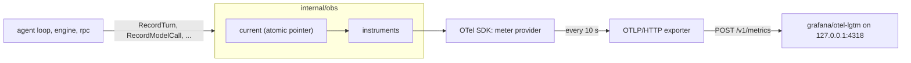

# obs

**Code:** `internal/obs/` (`doc.go`, `obs.go`, `instruments.go`, `setup.go`, `obs_test.go`)
**Milestone:** v0.1
**Architecture:** [Observability](../../ARCHITECTURE.md#observability)

## What it does

`obs` measures `merud`. The agent loop, the engine and the socket server call small
functions such as `obs.RecordTurn` and `obs.RecordModelCall`, and `obs` turns each call
into OpenTelemetry (OTel) metrics: numbers such as "this turn took 1.2 s" or "this call
used 120 input tokens". It can also hand out a tracer for spans, the timed steps inside
one turn. When config names an endpoint, `obs` sends both to it over OTLP (the
OpenTelemetry Protocol) on HTTP. The endpoint must be on this machine.

## The picture



Before `Setup`, `current` holds nil, so every record call returns at once.

## Walk through the code

### instruments.go

This file holds every name the package uses, so a reader can check them against the
metrics table in ARCHITECTURE.md in one place:

```go
const (
    metricTokenUsage        = "gen_ai.client.token.usage"
    metricTimeToFirstToken  = "gen_ai.server.time_to_first_token"
    metricTurnDuration      = "meru.turn.duration"
    ...
)
```

Names that start with `gen_ai.` come from the OTel GenAI semantic conventions, a
shared list of names for AI metrics. Dashboards built for those conventions work
with Meru unchanged. Names that start with `meru.` cover what the conventions don't.

Each metric carries attributes, the labels a dashboard groups by: model, tier, route.
The storage behind the dashboard keeps one series per distinct set of labels, so a
label that could take any value (a session ID, a file path) would make it grow
without end. `bounded` guards against that:

```go
func bounded(v string, allowed ...string) string {
    if slices.Contains(allowed, v) {
        return v
    }
    return other
}
```

`RecordRoute(ctx, "fifth-route", "ok")` records the route as `other`. A bug that
passes the wrong value shows up as an `other` line on the dashboard rather than as
thousands of new series.

`newInstruments` creates one handle per metric and sets its unit and histogram
buckets. A histogram counts values into buckets (under 0.5 s, under 1 s, and so on)
so Grafana can work out percentiles. The SDK's default buckets suit milliseconds,
and Meru records seconds, so each histogram gets its own edges. Time to first token
has an edge at exactly 1 s, the v0.1 target.

### obs.go

This file holds the functions other packages call. They share one pattern:

```go
func RecordRoute(ctx context.Context, route, outcome string) {
    in := load()
    if in == nil {
        return
    }
    in.routeDecisions.Add(ctx, 1, metric.WithAttributes(...))
}
```

`load()` reads the package's one piece of state, `current`, an `atomic.Pointer`. Nil
means export is off. The functions are safe to call before `Setup`, after shutdown
and from many goroutines at once.

`RecordModelCall` writes five metrics from one struct. It works out decode speed as
`EvalDuration / OutputTokens`, using Ollama's own clock, and skips it when either
number is zero. It skips time to first token for calls that didn't stream. It records
model load time on every call, zero included, so the dashboard can count how many
calls paid for a cold load.

### setup.go

`Setup` runs once when `merud` starts:

1. With no endpoint, it stores `capture_content` and returns a shutdown function that
   does nothing.
2. `loopbackURL` checks the endpoint. It accepts a literal loopback address
   (`127.0.0.1`, `::1`) and the name `localhost`, and only when every address
   `localhost` resolves to is loopback. It refuses every other name without looking
   it up, since DNS could point that name somewhere else later.
3. It builds a metric exporter and, when `traces = true`, a trace exporter. Both get
   `noProxy`, so an `HTTPS_PROXY` variable can't route the data off the machine.
4. It installs the providers with `otel.SetMeterProvider` and `otel.SetTracerProvider`,
   starts the Go runtime metrics (heap, garbage collection, goroutines) and stores the
   new state.

The shutdown function it returns sets `current` back to nil, then flushes both
providers so the last batch reaches the collector.

## Go ideas used here

- **Packages and imports** — how `obs` names the OTel packages it uses, including
  renamed imports such as `sdkmetric`. More in
  [go-basics/packages-and-imports.md](go-basics/packages-and-imports.md).
- **Atomic values** — `current` is an `atomic.Pointer[state]`, read by every record
  call without a lock. More in [go-basics/atomic.md](go-basics/atomic.md).
- **Variadic parameters** — `bounded(v string, allowed ...string)` takes any number of
  strings; `bounded(route, routes...)` passes a slice.
- **Closures** — `keep` in `newInstruments` and the returned `shutdown` are function
  values that use variables from the function that made them.
- **Generics in tests** — `histPoint[N int64 | float64]` in `obs_test.go` works for
  integer and float histograms alike.

## Try it

```sh
go test -race ./internal/obs/...
```

The tests read metrics with the SDK's `ManualReader`, read spans with `tracetest`'s
in-memory exporter, and run the real exporters against an `httptest` server on
127.0.0.1.

To see the dashboard, start the stack and point `merud` at it (details in
[deploy/README.md](../../deploy/README.md)):

```sh
docker compose -f deploy/observability/compose.yaml up -d
# then browse to http://127.0.0.1:3000 (user admin, password admin)
```

## Why it's built this way

**Free functions and one package variable.** AGENTS.md rules out package-level
mutable state. The alternative was an `*obs.Recorder` passed into the agent loop, the
engine and the socket server, and on to anything they call. That adds a parameter to
dozens of signatures to carry something every caller shares. One atomic pointer,
written by `Setup` and read everywhere, is the smaller exception.

**Instruments made at Setup.** OTel's global meter can hand out instruments before a
provider exists and connect them later. That hookup works only for the first
provider installed, which makes tests that each want a fresh provider awkward.
Building the handles in `Setup` from a provider we hold keeps each test separate, and
the no-op path stays one nil check.

**Refusing names instead of resolving them.** Resolving `metrics.example.com` and
checking the answer would accept a name that points at 127.0.0.1 today and at a
remote host tomorrow. Only `localhost` gets resolved, and every address must be
loopback.
