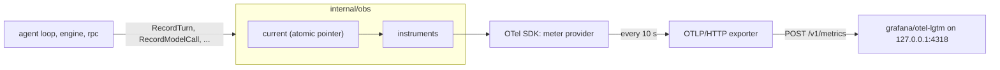

# obs

**Code:** `internal/obs/` (`doc.go`, `obs.go`, `instruments.go`, `setup.go`, `spans.go`,
`log.go`, `obs_test.go`, `log_test.go`)
**Milestone:** v0.1; the `sessions` section and stage in v0.4
**Architecture:** [Observability](../../ARCHITECTURE.md#observability)

## What it does

`obs` measures `merud`. The agent loop, the engine and the socket server call small
functions such as `obs.RecordTurn` and `obs.RecordModelCall`, and `obs` turns each call
into OpenTelemetry (OTel) metrics: numbers such as "this turn took 1.2 s" or "this call
used 120 input tokens". It can also hand out a tracer for spans, the timed steps inside
one turn. When config names an endpoint, `obs` sends both to it over OTLP (the
OpenTelemetry Protocol) on HTTP. The endpoint must be on this machine.

It also holds the helpers that tie the log to the traces: a `slog` handler that
stamps each log line with its turn's trace ID, the `gen_ai.chat` span every model
call gets, and one function that marks a span failed or cancelled.

## The picture



Before `Setup`, `current` holds nil, so every record call returns at once.

## Walk through the code

### instruments.go

This file holds every name the package uses, so a reader can check them against the
metrics table in ARCHITECTURE.md in one place:

```go
const (
    metricTokenUsage        = "gen_ai.client.token.usage"
    metricTimeToFirstToken  = "gen_ai.server.time_to_first_token"
    metricTurnDuration      = "meru.turn.duration"
    ...
)
```

Names that start with `gen_ai.` come from the OTel GenAI semantic conventions, a
shared list of names for AI metrics. Dashboards built for those conventions work
with Meru unchanged. Names that start with `meru.` cover what the conventions don't.

Each metric carries attributes, the labels a dashboard groups by: model, tier, route.
The storage behind the dashboard keeps one series per distinct set of labels, so a
label that could take any value (a session ID, a file path) would make it grow
without end. `bounded` guards against that:

```go
func bounded(v string, allowed ...string) string {
    if slices.Contains(allowed, v) {
        return v
    }
    return other
}
```

`RecordRoute(ctx, "fifth-route", "ok")` records the route as `other`. A bug that
passes the wrong value shows up as an `other` line on the dashboard rather than as
thousands of new series.

`newInstruments` creates one handle per metric and sets its unit and histogram
buckets. A histogram counts values into buckets (under 0.5 s, under 1 s, and so on)
so Grafana can work out percentiles. The SDK's default buckets suit milliseconds,
and Meru records seconds, so each histogram gets its own edges. Time to first token
has an edge at exactly 1 s, the v0.1 target.

`meru.model.malformed_calls` is a counter with one attribute, the model. The
agent adds one for each tool call the main model wrote that Meru couldn't run as
written: output Ollama couldn't read (`engine.ErrModelOutput`), a call to a tool
the round didn't offer, or arguments that aren't a JSON object. The tool's name
stays off the metric, because a model can make up any name and each would start
a new series.

### obs.go

This file holds the functions other packages call. They share one pattern:

```go
func RecordRoute(ctx context.Context, route, outcome string) {
    in := load()
    if in == nil {
        return
    }
    in.routeDecisions.Add(ctx, 1, metric.WithAttributes(...))
}
```

`load()` reads the package's one piece of state, `current`, an `atomic.Pointer`. Nil
means export is off. The functions are safe to call before `Setup`, after shutdown
and from many goroutines at once.

`RecordToolCall` (v0.3) takes one finished tool call from `dispatch` and writes
two metrics: `meru.tool.calls`, a counter by kind, server, tool and outcome, and
`meru.tool.duration`, a histogram by kind, server and tool. The duration covers
only the time the tool ran, so a call that never ran (denied, declined, or
cancelled before it started) adds to the counter and records no duration. Server
and tool names come from config, so they form a small set, with one exception: a
denied call names a tool the model made up. `RecordToolCall` reports those names
as `other`, so a model that invents names can't grow the series without end.
The kind is one of `mcp`, `a2a`, `builtin` and `command`, the last for a local
command, whose server is `meru` and whose tool is `cmd.<name>`: a name from
config, never its arguments.

A turn's outcome is one of `ok`, `error`, `cancelled`, `timeout`, `cut_off`,
`gave_up` and `bad_output`. The last four name a turn that ended without a
full answer and still said something to the user (see [agent](agent.md)).

v0.4 adds `sessions` to two bounded sets: the prompt sections of
`meru.context.tokens`, for the "From earlier conversations" section, and the
retrieval stages of `meru.retrieval.duration`, for the recall of past sessions.

Three functions (v0.3) feed the "Meru usage" dashboard, which shows the same
trends as `meru usage`:

- `RecordSession` adds one to `meru.sessions`, by source, when a turn starts a
  new session.
- `RecordTurnUsage` runs once per answered turn. It adds the main model's tokens
  to `meru.turn.tokens`, a counter by `gen_ai.token.type` (`input` or
  `output`), route and source, and records the number of files the turn read in
  `meru.turn.docs`, a histogram by route. A turn that read no file records 0,
  so the histogram's count is the number of answered turns.
- Active time needs no new metric: the sum of `meru.turn.duration` already adds
  up the seconds merud spent answering.

`gen_ai.client.token.usage` counts the same tokens, once per model call and by
model and tier. A turn with tool rounds makes several calls, and a call doesn't
know its turn's route or source. `meru.turn.tokens` adds those two labels, and
it leaves out turns that failed, so its totals match the `turns` table that
`meru usage` reads.

`RecordModelCall` writes five metrics from one struct. It works out decode speed as
`EvalDuration / OutputTokens`, using Ollama's own clock, and skips it when either
number is zero. It skips time to first token for calls that didn't stream. It records
model load time on every call, zero included, so the dashboard can count how many
calls paid for a cold load.

`RecordMalformedCall(ctx, model)` adds one to `meru.model.malformed_calls`. The
agent calls it from `internal/agent/malformed.go`.

### setup.go

`Setup` runs once when `merud` starts:

1. With no endpoint, it installs the ID-only tracer provider (below), stores
   `capture_content` and returns a shutdown function that does nothing.
2. `loopbackURL` checks the endpoint. It accepts a literal loopback address
   (`127.0.0.1`, `::1`) and the name `localhost`, and only when every address
   `localhost` resolves to is loopback. It refuses every other name without looking
   it up, since DNS could point that name somewhere else later.
3. It builds a metric exporter and, when `traces = true`, a trace exporter. Both get
   `noProxy`, so an `HTTPS_PROXY` variable can't route the data off the machine.
4. It installs the providers with `otel.SetMeterProvider` and `otel.SetTracerProvider`,
   starts the Go runtime metrics (heap, garbage collection, goroutines) and stores the
   new state. With `traces = false` it installs the ID-only tracer provider instead.

`idOnlyProvider` is a tracer provider whose sampler, `NeverSample`, drops every span
as it starts. A dropped span ignores attributes and events and is never exported,
but it still has a random trace ID. So with export off, each turn keeps an ID that
its log lines and transcript lines share.

`BuildVersion` names `merud`'s version for the traces and for `about_meru`.
`make release` sets the string `releaseVersion` through the Go linker's `-X`
flag, which writes a value into a package variable while it links the binary,
so a release build reports `v0.4.1`. Every other build leaves it empty, and
`BuildVersion` falls back to what `debug.ReadBuildInfo` holds: a tag for
`go install …@v0.4.1`, or `(devel)`. [releasing.md](../releasing.md) shows the
flag.

### spans.go

The router, the agent and the summarizer all call a model, so the `gen_ai.chat`
span lives here:

```go
ctx, span := obs.StartChat(ctx, obs.Chat{Tier: "fast", Model: m, MaxTokens: 1})
defer span.End()
...
obs.ChatResult(span, usage, comp.DoneReason)
```

`StartChat` sets the GenAI names (`gen_ai.operation.name`, `gen_ai.request.model`,
`gen_ai.request.max_tokens`) and `meru.tier`. `ChatResult` adds the token counts,
the finish reason and Ollama's own timings in milliseconds (`meru.ollama.load_ms`,
`meru.ollama.prompt_eval_ms`, `meru.ollama.eval_ms`). Those three say whether a
slow call spent its time loading the model, reading the prompt or writing.

`EndSpanErr(ctx, span, err)` is the one way a span ends badly. A cancel (the user
pressed Ctrl-C) adds a `cancelled` event and leaves the status alone, because it
isn't a fault. Any other error goes through `span.RecordError`, which adds an
`exception` event, and sets the status to Error.

### log.go

`LogHandler` wraps the `slog` handler `merud` writes with:

```go
func (h traceHandler) Handle(ctx context.Context, r slog.Record) error {
    if sc := trace.SpanContextFromContext(ctx); sc.HasTraceID() {
        r.AddAttrs(slog.String("trace_id", sc.TraceID().String()))
    }
    return h.next.Handle(ctx, r)
}
```

Code that logs with `log.DebugContext(ctx, ...)` passes the context along, and the
handler reads the current span out of it. So every line of a turn carries
`trace_id=...` without any caller adding it. A plain `log.Debug(...)` has no
context and gets no ID.

`Preview` cuts a text to 200 characters for the debug log. Callers use it only when
`CaptureContent()` is true. `Discard` returns a logger that writes nothing, for
packages whose logger is optional.

The shutdown function it returns sets `current` back to nil, then flushes both
providers so the last batch reaches the collector.

## Go ideas used here

- **Packages and imports** — how `obs` names the OTel packages it uses, including
  renamed imports such as `sdkmetric`. More in
  [go-basics/packages-and-imports.md](go-basics/packages-and-imports.md).
- **Atomic values** — `current` is an `atomic.Pointer[state]`, read by every record
  call without a lock. More in [go-basics/atomic.md](go-basics/atomic.md).
- **Variadic parameters** — `bounded(v string, allowed ...string)` takes any number of
  strings; `bounded(route, routes...)` passes a slice.
- **Closures** — `keep` in `newInstruments` and the returned `shutdown` are function
  values that use variables from the function that made them.
- **Generics in tests** — `histPoint[N int64 | float64]` in `obs_test.go` works for
  integer and float histograms alike.
- **Interfaces** — `traceHandler` satisfies `slog.Handler` by having its four
  methods; there is no "implements" keyword. More in
  [go-basics/interfaces.md](go-basics/interfaces.md).

## Try it

```sh
go test -race ./internal/obs/...
```

The tests read metrics with the SDK's `ManualReader`, read spans with `tracetest`'s
in-memory exporter and span recorder, and run the real exporters against an
`httptest` server on 127.0.0.1. `log_test.go` logs into a buffer and checks that
the trace ID appears only on lines logged with a span in their context.

To see the dashboard, start the stack and point `merud` at it (details in
[observability.md](../observability.md)):

```sh
docker compose -f deploy/observability/compose.yaml up -d
# then browse to http://127.0.0.1:3000 (user admin, password admin)
```

Grafana opens on the Meru dashboard. The "Meru usage" dashboard, in the same
folder, shows totals for the chosen time range, then one bar per day over the
last 30 days.

## Why it's built this way

**Free functions and one package variable.** AGENTS.md rules out package-level
mutable state. The alternative was an `*obs.Recorder` passed into the agent loop, the
engine and the socket server, and on to anything they call. That adds a parameter to
dozens of signatures to carry something every caller shares. One atomic pointer,
written by `Setup` and read everywhere, is the smaller exception.

**Instruments made at Setup.** OTel's global meter can hand out instruments before a
provider exists and connect them later. That hookup works only for the first
provider installed, which makes tests that each want a fresh provider awkward.
Building the handles in `Setup` from a provider we hold keeps each test separate, and
the no-op path stays one nil check.

**Trace IDs with export off.** The owner's first question about a slow turn comes
from `merud.log`, usually with no collector running. Without trace IDs, the debug
lines of two turns running at once would mix with nothing to tell them apart. The
`NeverSample` provider gives every turn an ID for the cost of two random numbers
and exports nothing.

**Refusing names instead of resolving them.** Resolving `metrics.example.com` and
checking the answer would accept a name that points at 127.0.0.1 today and at a
remote host tomorrow. Only `localhost` gets resolved, and every address must be
loopback.
