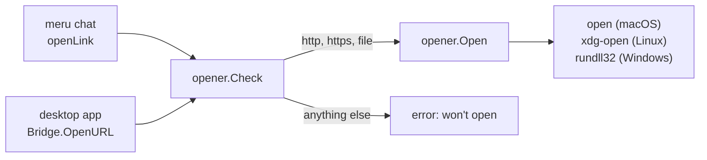

# opener

**Code:** `internal/opener/` (`doc.go`, `opener.go`)
**Milestone:** v0.3 (moved out of `internal/tui` for the desktop app)
**Architecture:** [Terminal UI](../../ARCHITECTURE.md#terminal-ui) and [Desktop app](../../ARCHITECTURE.md#desktop-app)

## What it does

`opener` opens a link the user clicked: it hands the URL to the program the system
uses for files and links, which starts the browser or the file's own app. `meru
chat` calls it when a click lands on a link, and the desktop app calls it for links
in answers and for source chips. Both clients show model output, so both need the
same rule for which links may open, and one package holds it.

## The picture



## Walk through the code

### opener.go

```go
func Check(u string) error {
    if strings.HasPrefix(u, "-") || !allowed(u) {
        return fmt.Errorf("won't open %s: only http, https and file links open", cut(u))
    }
    return nil
}
```

`Check` refuses two kinds of URL. `allowed` parses the URL with `net/url` and keeps
only the `http`, `https` and `file` schemes, so a `javascript:` or `mailto:` link in
an answer opens nothing; it also refuses a space or a control character. A URL that
starts with `-` fails too: the opener gets the URL as an argument, and a program
reads an argument that starts with `-` as an option.

`Open` calls `Check`, then runs the program `command` picks for `runtime.GOOS`:

```go
cmd := exec.CommandContext(ctx, argv[0], argv[1:]...)
if err := cmd.Run(); err != nil {
    return fmt.Errorf("%s: %w", argv[0], err)
}
```

`exec.CommandContext` starts the program with no shell and the URL as one argument,
so nothing in the URL can run as a command. The context carries a ten-second
timeout, so an opener stuck without a display doesn't wait for ever. Standard
output stays unset, so `Run` doesn't wait on a browser the opener leaves running.

`command` takes the system's name as a parameter, so one test checks all three
systems on any machine.

## Go ideas used here

- **os/exec** — starts another program without a shell. More in
  [go-basics/os-exec.md](go-basics/os-exec.md).
- **context** — `WithTimeout` bounds how long the program may run. More in
  [go-basics/context.md](go-basics/context.md).
- **defer** — `defer cancel()` frees the timer on every return. More in
  [go-basics/defer.md](go-basics/defer.md).

## Try it

```sh
go test ./internal/opener/...
```

The tests never start a browser: `Open` runs only with URLs that `Check` refuses.

## Why it's built this way

The code lived in `internal/tui/open.go` until the desktop app needed it. Copying it
would have left two rules for which links open, and two places to fix a hole. The
desktop page could open links through Wails' own browser call, but that call opens
any scheme; this package keeps Meru's rule in Go, where a test pins it down.
