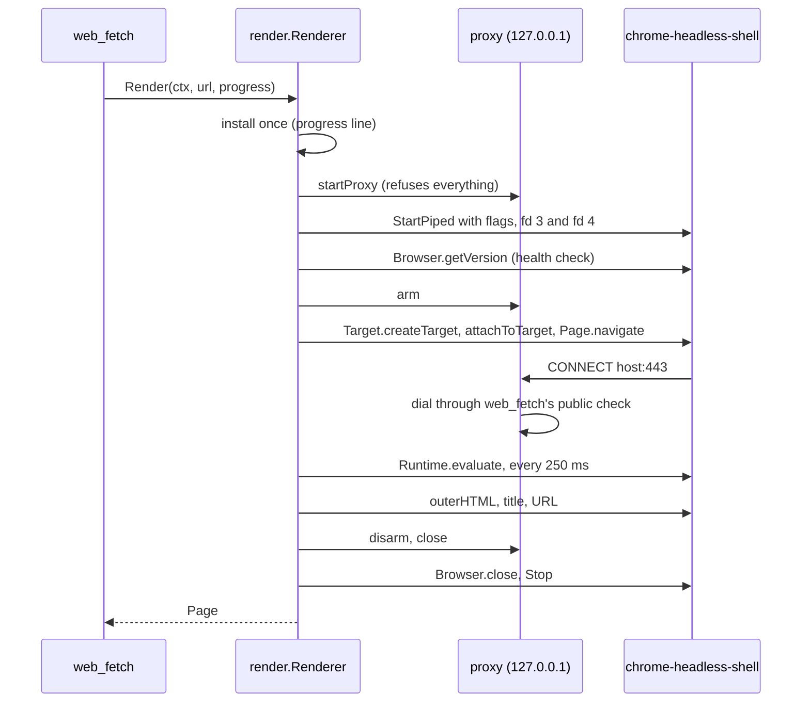

# render

**Code:** `internal/render/` (`doc.go`, `render.go`, `browser.go`, `cdp.go`, `proxy.go`)
**Milestone:** none; shipped outside the milestones ([#100](https://github.com/aarora79/meru/issues/100))
**Architecture:** [Pages that need JavaScript](../../ARCHITECTURE.md#pages-that-need-javascript)

## What it does

Many web pages send an almost empty HTML file and let JavaScript fill it in: a
Workday job posting is a `<div>` and a `<script>`. `web_fetch` reads HTML and runs no
scripts, so it found no text on such pages. `render` loads the page in a real
browser, a headless Chrome, waits for the scripts to finish, and hands back the
HTML the page shows.

`web_fetch` (in `internal/builtin`) calls it only when plain HTTP brings back a shell.
For each page, `render`:

1. installs the pinned `chrome-headless-shell` the first time (through
   `internal/connectors`, about 95 MB);
2. starts a small proxy on `127.0.0.1` and a fresh Chrome with a fresh profile;
3. tells Chrome, over two pipes, to open the page;
4. waits until the text and the traffic hold still;
5. reads the page's HTML, title and final URL;
6. stops Chrome and the proxy, and deletes the profile.

No browser runs between pages.

## The picture



## Walk through the code

### render.go: the Renderer

```go
type Renderer struct {
    inst *connectors.Installer
    dial DialFunc
    log  *slog.Logger
    ctx    context.Context
    cancel context.CancelFunc
    one chan struct{}
    mu     sync.Mutex
    closed bool
    wg     sync.WaitGroup
}
```

`merud` builds one `Renderer` at start with `render.New` and keeps it for its whole
life. `dial` is `web_fetch`'s own dialer (`builtin.PublicDialContext`), so a rendered
page faces the same address check as a fetch.

**One page at a time.** `one` is a channel with room for one value. A render puts a
value in before it starts and takes it out when it ends; a second render waits. It
works like a lock, but a `select` can give up waiting when the caller's context
ends, which `sync.Mutex` can't do:

```go
select {
case r.one <- struct{}{}:      // got the token
    defer func() { <-r.one }() // give it back when Render returns
case <-ctx.Done():             // the turn was stopped first
    return Page{}, cancelled(ctx, r.ctx)
}
```

**Close never waits behind a render.** `r.ctx` ends when `Close` runs. Each render
ties its own context to it with `context.AfterFunc(r.ctx, cancel)`: when `r.ctx`
ends, Go calls `cancel`, and the render stops at its next wait. `Close` then waits on
`wg` until every render has returned. `mu` makes sure no render calls `wg.Add` after
`Close` has started waiting, which `sync.WaitGroup` forbids.

**The span and the metric.** A deferred function records `meru.web.render.duration`
and fills in the `meru.web.render` span when `Render` returns. It can see the result
because `Render` names its results (`page Page, err error`), and a deferred function
reads named results after the `return` sets them.

**waitForText.** Scripts often fill a page after its `load` event, so the event
alone says nothing. Every 250 ms the reader asks Chrome for
`[document.readyState, document.body.innerText.length]`. It takes the page when the
state is `complete`, the length hasn't changed for 750 ms, and no bytes have moved
through the proxy for 500 ms. Without the traffic check, the Workday page looked done
while its posting was still on the wire. After 8 seconds it takes whatever the page
shows.

### browser.go: starting Chrome

`chromeFlags` lists every flag, each with its reason. The ones that matter most:

| Flag | Why |
| --- | --- |
| `--remote-debugging-pipe` | Commands go over fd 3 and 4, so Chrome opens no port another program could find |
| `--proxy-server=…`, `--proxy-bypass-list=<-loopback>` | Every request goes to the proxy, loopback included, where it fails |
| `--disable-quic`, `--force-webrtc-ip-handling-policy=disable_non_proxied_udp` | QUIC and WebRTC use UDP, which the proxy doesn't carry. A test showed WebRTC sent 3 packets around the proxy without the second flag |
| `--disable-background-networking` and friends | No updates, sync or reports |
| `--use-mock-keychain`, `--password-store=basic` | Chrome would otherwise ask the Mac's keychain, which shows a prompt |

Chrome runs with one environment variable, `HOME`, pointing into
`~/.meru/runtime/home`. `startBrowser` sends `Browser.getVersion` as a health check
and turns downloads off.

### cdp.go: talking to Chrome

The DevTools Protocol is JSON. With `--remote-debugging-pipe`, Chrome reads commands
from its fd 3 and writes replies to its fd 4, each message ending in a NUL byte.
[Pipes and extra files](go-basics/pipes-and-extra-files.md) explains the pipes.

- **Framing.** `readMessage` reads up to the next NUL with `bufio.Reader.ReadSlice`,
  and refuses a message over 32 MiB.
- **Replies.** Each command gets a number, its `id`. `call` stores a channel under
  that number in `pending`, writes the command, and waits on the channel or the
  context. One reader goroutine hands each reply to the channel with the same `id`.
  A message with no `id` is an event; the reader drops it, because the renderer polls
  instead of waiting for events.

The reply channel has room for one value, so the reader never blocks, even when the
caller has given up and gone. A caller that gives up deletes its entry with `forget`,
so `pending` doesn't grow.

### proxy.go: the guard

An `http.Server` on `127.0.0.1:0` (a free port). For `CONNECT host:port`, the way a
browser asks for an HTTPS tunnel, it dials through `dial` and, once connected, takes
the raw connection from the server (`Hijack`) and copies bytes both ways. TLS runs
inside the tunnel from Chrome to the site; the proxy sees only the host and port.
Plain `http://` requests go on through an `http.Transport` that dials the same way,
with the hop-by-hop headers (`Connection`, `Proxy-Authorization` and the rest)
dropped.

- **Armed or not.** Until `arm`, every request gets 403. Chrome's start-up requests
  land here and go nowhere; `TestRenderNoBackgroundTraffic` counts zero.
- **Counts.** `requests` and `refused` go on the span.
- **Quiet.** Every byte copied updates `lastByte`, an `atomic.Int64`, which the copy
  goroutines write and `waitForText` reads with no lock.
- **Owners.** The two copy goroutines of each tunnel join `copies`, a `WaitGroup`,
  and `close` waits for them after `disarm` has closed their connections. The `Add`
  happens in `track`, under the same lock `disarm` takes, so it always comes before
  the `Wait`.

## Go ideas used here

- [Pipes and extra files](go-basics/pipes-and-extra-files.md): fd 3 and 4,
  NUL-framed messages.
- `context.AfterFunc` (Go 1.21+): run a function when a context ends; the returned
  `stop` undoes it.
- A buffered channel of size 1 as a lock that `select` can give up on.
- Named results read by a deferred function.
- `sync/atomic.Int64` for a value goroutines share without a lock.
- `http.Hijacker`: taking a raw connection back from `net/http`.

## Try it

```sh
# The integration tests download the browser once into your cache folder.
go test -race -tags integration -run Render -v ./internal/render/
# The real Workday page from the issue; it reaches the public web.
MERU_RENDER_NET=1 go test -tags integration -run Workday -v ./internal/render/
```

## Why it's built this way

- **A fresh Chrome per page** costs about a second, and leaves nothing running: no
  idle timer, no crash restarts, no stale profile. A warm Chrome can come later if
  `meru.web.render.duration` shows the start matters.
- **A pipe, not a port.** `chromedp`, the usual Go library, drives Chrome over a
  WebSocket on a loopback port, which another program could reach while Chrome runs.
  Meru needs about eight commands, so a small client over the pipe is less code to
  trust and to read.
- **The proxy, not flags alone.** Chrome resolves names and connects on its own, so
  only a check on the real connection, after DNS, stops a page from reaching your
  router or this machine. The proxy reuses `web_fetch`'s check instead of writing a
  second one.
- **Chrome starts only through `connectors.StartPiped`.** `internal/policy` fails the
  build if `render` imports `os/exec`, so `internal/connectors/run.go` stays the one
  place that starts a pinned program.
