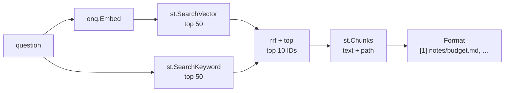

# retrieve

**Code:** `internal/retrieve/` (`doc.go`, `rrf.go`, `search.go`, `format.go`,
`memories.go`)
**Milestone:** v0.2; memory recall in v0.4
**Architecture:** [Retrieval](../../ARCHITECTURE.md#retrieval) and
[How hybrid search works](../../ARCHITECTURE.md#how-hybrid-search-works)

## What it does

`retrieve.Search` finds the chunks of your files that best answer a question.
It runs two searches and merges them:

- **Vector search** compares the question's embedding with each chunk's. It
  finds a note about "Nvidia's quarterly results" when you ask about earnings.
- **Keyword search** ranks chunks by BM25, the standard formula for how well a
  passage's words match. It finds the ticker "NVDA" every time.

`Format` then turns the results into a prompt section with numbered
citations, so the model can answer "the budget is 40k [1]" and the user can
open the file.

`retrieve.SearchMemories` does the same for memories, with a third list: the
newest memories. See [memories.go](#memoriesgo-recall) below.

## The picture



## Walk through the code

### rrf.go: merging two rankings

BM25 scores and vector distances use different scales, so adding them would
let one list drown the other. Reciprocal-rank fusion (RRF) uses only each
chunk's position:

```go
func rrf(lists ...[]int64) map[int64]float64 {
    const k = 60
    scores := map[int64]float64{}
    for _, list := range lists {
        for rank, id := range list {
            scores[id] += 1.0 / float64(k+rank+1)
        }
    }
    return scores
}
```

A chunk earns `1/(60 + place)` from each list it appears in. With the "NVDA
results" example from [200.md](../architecture/200.md), `earnings.md` is
second by keyword and first by meaning: `1/62 + 1/61 = 0.0325`, the top score.

`top` sorts the map into a list, highest score first, and keeps `n`. Go walks
a map in a different order on every run, so two chunks with equal scores
would swap places from run to run. `top` breaks ties by chunk ID:

```go
slices.SortFunc(out, func(a, b scored) int {
    return cmp.Or(cmp.Compare(b.score, a.score), cmp.Compare(a.id, b.id))
})
```

`cmp.Compare(b, a)` sorts high to low. `cmp.Or` returns its first non-zero
argument, so the ID only decides when the scores are equal.

### search.go: the pipeline

`Search` runs the stages one after the other: embed, vector search, keyword
search, fusion, load. It times each stage and records three of them in the
`meru.retrieval.duration` histogram with `obs.RecordRetrieval`, under the
stage names `vector`, `fts` and `fusion`.

It also opens one `meru.retrieve` span. The span carries counts and
milliseconds (`meru.retrieve.vector_hits`, `meru.retrieve.fts_ms`, …) and never
the question or any chunk text. The engine's own HTTP span for the embedding
call nests under it.

`Options` holds the three list sizes. Its zero value means ARCHITECTURE.md's
starting values: 50 from each search and 10 after the merge.

`Result` embeds `store.ChunkWithDoc` and adds the RRF score, so `r.Path`,
`r.Heading` and `r.Text` work directly.

### format.go: citations

`Cite(1, r)` returns one line:

```text
[1] notes/budget.md, "Q3 budget", lines 12–40
```

A PDF chunk gets `page 3` instead of lines, and a chunk with no heading leaves
the heading out. `Format` writes a one-line instruction ("Cite the ones you
use by number") and then each chunk's text under its citation line.

### memories.go: recall

`SearchMemories(ctx, st, eng, query, exclude, n)` finds the `n` memories that best
fit a question. It embeds the query once, then asks the store for three lists of up
to 50 memories each, leaving out the kinds in `exclude`:

1. by meaning: `SearchMemoryVector`;
2. by keyword: `SearchMemoryKeyword`;
3. by recency: `RecentMemories`.

The same `rrf` merges the three, and `top` keeps `n`. A memory high in one list
scores well; one high in two or three scores best. The recency list lets a fact
saved yesterday surface even when the question shares no word with it and its
vector sits far off. In the tests, "who is my boss?" brings back Sam (first by
meaning and keyword) and then the newest memory, a hair ahead of an older one
that ranks above it by meaning.

The store returns whole rows, so the merge keeps each row in a map by ID and picks
the winners from it; no second query loads the text. `Memory` embeds
`store.Memory` and adds the RRF score.

`SearchMemories` records the three queries and the merge as one
`meru.retrieval.duration` stage, `memories`, and opens a `meru.recall` span with
the list sizes and timings (`meru.recall.embed_ms`, `meru.recall.search_ms`),
never text.

## Go ideas used here

- **Variadic parameters** — `rrf(lists ...[]int64)` accepts any number of lists.
- **Maps** — `map[int64]float64` holds one score per chunk ID. Go randomizes a
  map's walking order, which is why `top` needs a tie-breaker.
- **`slices.SortFunc` and `cmp`** — sort with a comparison function; `cmp.Or`
  chains comparisons.
- **Struct embedding** — `Result` embeds `store.ChunkWithDoc`.
- **Named results with `defer`** — `Search` names its `err` result so the
  deferred function can mark the span with it. More in
  [go-basics/defer.md](go-basics/defer.md).
- **Interfaces** — `Search` takes an `engine.Engine`; the tests pass a fake.
  More in [go-basics/interfaces.md](go-basics/interfaces.md).

## Try it

```sh
go test -race ./internal/retrieve/
```

`TestRRF` checks the scores in the 200.md table to four places. `TestSearch`
builds a real store in a temporary folder with hand-placed vectors and a fake
engine. One of its cases shows RRF at work: a PDF chunk that ranks last by
meaning but second by keyword beats a chunk that only vector search found.

`TestSearchMemories` works the three-list sums by hand in its comments: a
keyword hit that is second newest beats the memory nearest by meaning, and with
no shared word and equal distances the recency list decides.
`TestSearchMemoriesRecencyAlone` checks that a memory the question shares nothing
with still comes back when it is the only one outside the excluded kinds.

## Why it's built this way

- **Merge in Go, not SQL.** SQLite could merge both lists in one query with
  window functions. Two short queries and a pure function read more easily,
  test without a database, and give each stage its own timing.
- **Stages run one after the other.** The two searches together take
  milliseconds inside `merud`. Running them at the same time would add
  goroutines for no measured gain.
- **Errors stop the search.** If the embedding fails, `Search` returns the
  error instead of falling back to keyword results alone, and the agent
  decides what to do.
