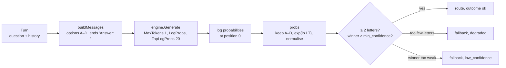

# router

**Code:** `internal/router/` (`router.go`, `prompt.go`, `probs.go`)
**Milestone:** v0.1
**Architecture:** [Routing](../../ARCHITECTURE.md#routing); full design in [docs/fast-router.md](../fast-router.md)

## What it does

Each turn starts with a choice of route: answer from the model alone (`direct`),
search the user's files first (`search`), call tools (`tools`), or both
(`search+tools`). The router makes that choice. The agent loop calls
`router.Decide` once per turn and gets back a route, how sure the router was, and
an outcome.

The router doesn't ask the model to write its answer. It asks for one token and
reads how likely the model thought each of the letters A, B, C and D was.

## The picture



## Walk through the code

### prompt.go

The four options and their letters live in one array next to the prompt builder,
so the prompt and the letter table can't drift apart:

```go
var options = [...]option{
    {"A", RouteDirect, "Answer from what you already know. No files or tools needed."},
    {"B", RouteSearch, "The answer is in the user's own notes, documents or repositories. Retrieve first."},
    ...
}
```

`buildMessages` writes the history newest first, then the question, the four
options, and ends with `Answer: ` so the model's next token is a letter.

`routeForLetter` trims spaces and ignores case. A tokenizer may emit `A`, ` A` or
`a` for the same answer; all three map to `direct`. `AB`, `Alpha` and `1` map to
nothing.

### probs.go

`probs` turns log probabilities into a distribution over routes:

```go
for _, alt := range pos.Top {
    r, ok := routeForLetter(alt.Token)
    if !ok {
        continue
    }
    raw[r] += math.Exp(alt.LogProb / temp)
}
// ... then divide each by the sum
```

A log probability is the natural logarithm of a probability, so `math.Exp` turns
it back. Dividing by a temperature above 1 flattens the distribution: small models
claim more certainty than they have. The temperature never changes which route
wins. Tokens that map to the same route, such as `A` and ` A`, add up.

`raw` is a *map*: Go's hash table, here from `Route` to `float64`. Reading a key
that isn't there gives 0. Go walks a map in random order, so `best` walks the
fixed `options` array instead. On a tie, the earlier letter wins, and the same
input always gives the same route.

### router.go

`Decide` starts a `meru.route` span, asks the engine for one token, and hands the
reply to `decide`:

```go
if len(p) < 2 {
    return Decision{Route: cfg.Fallback, Outcome: OutcomeDegraded, Probs: p}
}
win, conf := best(p)
if conf < cfg.MinConfidence {
    return Decision{Route: cfg.Fallback, Confidence: conf, Outcome: OutcomeLowConfidence, Probs: p}
}
```

Fewer than two letters means the model didn't weigh the options, so the numbers
mean nothing. A winner below `min_confidence` means the model couldn't decide.
Both take the fallback, `search+tools`, which is the one route that can't fail a
turn for lack of context.

`Decide` returns an error only when the model call fails or the config is
invalid. An unsure model isn't an error. `Decide` then records
`meru.route.decisions` through `obs.RecordRoute` and sets `meru.route.decision`,
`meru.route.confidence` and `meru.route.outcome` on the span. The whole
distribution goes on the span only when `capture_content` is on, because it
says something about the question.

`ConfigFrom` builds a `Config` from the `[router]` table in `config.toml` and the
fast model's name, and checks every value: `top_logprobs` 1 to 20, `temperature`
above 0, `min_confidence` 0 to 1, `fallback` one of the four routes.

## Go ideas used here

- **Maps** — `map[Route]float64`; a missing key reads as 0.
- **Named string types** — `Route` and `Outcome` are strings the compiler keeps
  apart from plain strings.
- **Interfaces** — `Decide` takes an `engine.Engine`, so tests pass a fake. More
  in [go-basics/interfaces.md](go-basics/interfaces.md).
- **Embedding an interface in a struct** — the test's `fakeEngine` embeds
  `engine.Engine` to get the three methods it doesn't need, and writes only
  `Generate`.
- **Build tags** — `//go:build integration` at the top of `integration_test.go`
  keeps the real-model test out of a plain `go test`.

## Try it

```sh
go test -race ./internal/router/
go test -tags integration -v -run Integration ./internal/router/
```

The second command needs Ollama running with the fast model pulled. It routes
seven questions and prints each distribution and its time. On the development
machine (Ollama 0.34, MiniCPM5-2B at Q4_K_M, temperature 1.0) a warm decision
took about 13 ms. The router picked the expected route for 2 of the 7 questions
and leaned towards `search+tools`, which is what the uncalibrated threshold is
for; see [Calibration](../fast-router.md#calibration).

## Why it's built this way

Asking a 2B model to write `{"route": "search"}` fails three ways: broken JSON, an
invented fifth route, or a confident wrong answer with no sign of doubt. Reading
one token's probabilities removes the first two, because the answer comes from a
fixed set of letters. It also turns the third into a number the router can act on
and the dashboard can count. The model decodes one token, so the whole decision
costs one prompt evaluation.
