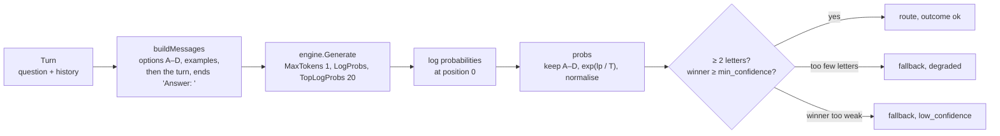

# router

**Code:** `internal/router/` (`router.go`, `prompt.go`, `probs.go`; the scoring
harness in `eval_test.go` and `eval_integration_test.go`)
**Milestone:** v0.1
**Architecture:** [Routing](../../ARCHITECTURE.md#routing); full design in [docs/fast-router.md](../fast-router.md)

## What it does

Each turn starts with a choice of route: answer from the model alone (`direct`),
search the user's files first (`search`), call tools (`tools`), or both
(`search+tools`). The router makes that choice. The agent loop calls
`router.Decide` once per turn and gets back a route, how sure the router was, and
an outcome.

The router doesn't ask the model to write its answer. It asks for one token and
reads how likely the model thought each of the letters A, B, C and D was.

## The picture



## Walk through the code

### prompt.go

The four options and their letters live in one array next to the prompt builder,
so the prompt and the letter table can't drift apart:

```go
var options = [...]option{
    {"A", RouteDirect, "General knowledge, chit-chat, maths, coding or writing help. ..."},
    {"B", RouteSearch, "Look in the user's own saved notes, documents, code repos or past chats. ..."},
    ...
}
```

A second array, `examples`, holds two short questions per route. Each example
names its route, and `letterFor` turns the route into its letter, so changing a
letter can't leave an example pointing at the wrong option.

`buildMessages` writes the fixed part first (the options, then the examples),
then the history newest first, then the question, and ends with `Answer: ` so
the model's next token is a letter. The fixed part comes first for two reasons
the labelled set measured: accuracy rose, and Ollama can reuse its work on a
prompt opening it saw on the last turn, so the longer prompt still runs faster.

`routeForLetter` trims spaces and ignores case. A tokenizer may emit `A`, ` A` or
`a` for the same answer; all three map to `direct`. `AB`, `Alpha` and `1` map to
nothing.

### probs.go

`probs` turns log probabilities into a distribution over routes:

```go
for _, alt := range pos.Top {
    r, ok := routeForLetter(alt.Token)
    if !ok {
        continue
    }
    raw[r] += math.Exp(alt.LogProb / temp)
}
// ... then divide each by the sum
```

A log probability is the natural logarithm of a probability, so `math.Exp` turns
it back. Dividing by a temperature above 1 flattens the distribution, for a model
that claims more certainty than it has. The fitted default is 1.25. The
temperature never changes which route wins. Tokens that map to the same route,
such as `A` and ` A`, add up.

`raw` is a *map*: Go's hash table, here from `Route` to `float64`. Reading a key
that isn't there gives 0. Go walks a map in random order, so `best` walks the
fixed `options` array instead. On a tie, the earlier letter wins, and the same
input always gives the same route.

### router.go

`Decide` starts a `meru.route` span. `ask` sends the routing prompt for one token
inside a `gen_ai.chat` span (tier `fast`), and `Decide` hands the reply to
`decide`:

```go
if len(p) < 2 {
    return Decision{Route: cfg.Fallback, Outcome: OutcomeDegraded, Probs: p}
}
win, conf := best(p)
if conf < cfg.MinConfidence {
    return Decision{Route: cfg.Fallback, Confidence: conf, Outcome: OutcomeLowConfidence, Probs: p}
}
```

Fewer than two letters means the model didn't weigh the options, so the numbers
mean nothing. A winner below `min_confidence` means the model couldn't decide.
Both take the fallback, `search+tools`, which is the one route that can't fail a
turn for lack of context.

`Decide` returns an error only when the model call fails or the config is
invalid. An unsure model isn't an error. `Decide` then records
`meru.route.decisions` through `obs.RecordRoute` and sets `meru.route.decision`,
`meru.route.confidence` and `meru.route.outcome` on the span, plus one number per
route: `meru.route.p.direct`, `meru.route.p.search`, `meru.route.p.tools` and
`meru.route.p.search+tools`. They are numbers about the router, never the
question's text, so they go on every span. The metric keeps only route and
outcome, because a probability would make a new series for every value.

At debug level `Decide` writes one line to `cfg.Log` with the route, the
confidence, the outcome, the whole distribution and the time taken:

```text
msg=route route=tools confidence=0.958 outcome=ok probs="direct=0.005 search=0.001 tools=0.958 search+tools=0.036" model=… ms=10 trace_id=…
```

`Config.Log` is optional. `ConfigFrom` leaves it nil, and `logger` turns nil into
a logger that writes nothing, so tests need no logger. `merud` sets it to its own.

`ConfigFrom` builds a `Config` from the `[router]` table in `config.toml` and the
fast model's name, and checks every value: `top_logprobs` 1 to 20, `temperature`
above 0, `min_confidence` 0 to 1, `fallback` one of the four routes.

### eval_test.go and eval_integration_test.go

These two files score the router; neither ships in `merud`.

`eval_test.go` has no build tag, so a plain `go test` checks its arithmetic
against fixtures. `loadLabelled` reads `testdata/routes.jsonl`, one JSON object
per line:

```json
{"q": "what did I change in the portfolio repo this week?", "route": "search", "why": "the owner's own repository history"}
```

A follow-up row adds `"history": [{"q": "...", "a": "..."}]`, and `turn` turns
it into user and assistant messages. `split` puts the 3rd, 6th and 9th row of
every ten with the same route into the held-out set, so each route keeps its
share and every run gets the same split. `score` replays `decide` over saved
completions and fills a `report`: accuracy, per-route precision and recall, the
confusion matrix, `ece` (expected calibration error over ten bins), the fallback
rate, the missed rate and latency percentiles. `fitTemperature` runs `score`
over a grid of temperatures and keeps the one with the lowest ECE.

`eval_integration_test.go` has the `integration` tag. It wraps the real engine
in a `recorder`, a struct that embeds `engine.Engine` and overrides `Generate`
to keep the last completion. Each labelled question goes through `Decide`, the
real code path, and the recorder hands the raw log probabilities to `score`.
One pass over the model then covers every temperature and threshold.

## Go ideas used here

- **Maps** — `map[Route]float64`; a missing key reads as 0.
- **Named string types** — `Route` and `Outcome` are strings the compiler keeps
  apart from plain strings.
- **Interfaces** — `Decide` takes an `engine.Engine`, so tests pass a fake. More
  in [go-basics/interfaces.md](go-basics/interfaces.md).
- **Embedding an interface in a struct** — the test's `fakeEngine` embeds
  `engine.Engine` to get the three methods it doesn't need, and writes only
  `Generate`.
- **Build tags** — `//go:build integration` at the top of `integration_test.go`
  and `eval_integration_test.go` keeps the real-model tests out of a plain
  `go test`.

## Try it

```sh
go test -race ./internal/router/
go test -tags integration -v -run Integration ./internal/router/
make router-eval
```

The last two need Ollama running with the fast model pulled. The second routes
seven questions and prints each distribution. `make router-eval` scores all 121
labelled questions and prints the report, a temperature sweep and a
`min_confidence` sweep. On the development machine (Ollama 0.34, MiniCPM5-2B at
Q4_K_M) the router picked the labelled route for 28 of 36 held-out questions,
up from 17 with the v0.1 prompt, at about 28 ms per warm decision. See
[Calibration](../fast-router.md#calibration) and the notes at the end of that
page.

## Why it's built this way

Asking a 2B model to write `{"route": "search"}` fails three ways: broken JSON, an
invented fifth route, or a confident wrong answer with no sign of doubt. Reading
one token's probabilities removes the first two, because the answer comes from a
fixed set of letters. It also turns the third into a number the router can act on
and the dashboard can count. The model decodes one token, so the whole decision
costs one prompt evaluation.
