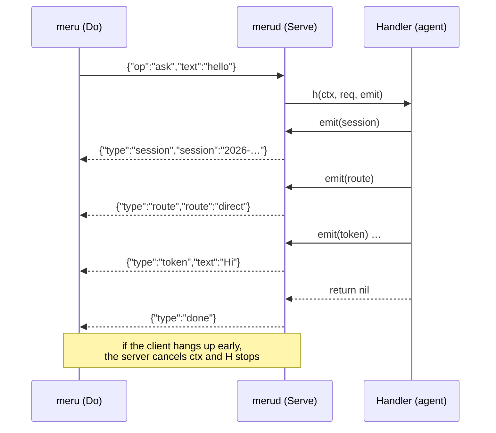

# rpc

**Code:** `internal/rpc/` (`protocol.go`, `client.go`, `server.go`)
**Milestone:** v0.1
**Architecture:** [The shape: daemon + thin client](../../ARCHITECTURE.md#the-shape-daemon--thin-client)

## What it does

`rpc` carries messages between `meru` (the client) and `merud` (the daemon)
over a Unix socket at `~/.meru/merud.sock`. A Unix socket works like a network
connection, but it is a file on disk, and only processes on this machine can
open it.

The protocol is newline-delimited JSON. The client opens a connection and
writes one `Request`. The server writes `Event`s back, one JSON object per
line, and the last one is `done` or `error`. One connection carries one
request, and closing the connection cancels the turn.

## The picture



## Walk through the code

### protocol.go

The message types. `Request` has an `Op` (`ask` or `ping`), an optional
`Session` to continue, the question `Text`, and a `Source` (`cli`, `tui` or
`job`). `Event` has a `Type` and only the fields that type needs.

### client.go

`Do` dials the socket, sends the request and returns the events as an
iterator, which callers read with `for ev, err := range rpc.Do(...)`. Cancelling
the caller's context closes the connection.

### server.go

**Listen** claims the socket. A socket file can outlive a `merud` that crashed,
so `Listen` checks what is there first:

```go
case info.Mode()&fs.ModeSocket == 0:
    return nil, fmt.Errorf("%s exists and isn't a socket; ...", path)
default:
    if pingOK(ctx, path) {
        return nil, fmt.Errorf("another merud is already listening on %s", path)
    }
    if err := os.Remove(path); err != nil { ... }
```

A live `merud` answers the ping, and `Listen` refuses to start a second one. A
dead one doesn't answer, and `Listen` deletes its leftover file. `Listen` never
deletes a regular file it didn't make. After listening it sets the socket's
mode to `0600`, so other users on the machine can't connect.

**Serve** accepts connections until its context is cancelled and runs each one
in its own goroutine:

```go
stop := context.AfterFunc(ctx, func() { ln.Close() })
defer stop()

var wg sync.WaitGroup
defer wg.Wait()

for {
    conn, err := ln.Accept()
    ...
    wg.Go(func() { serveConn(ctx, conn, h, log) })
}
```

- `context.AfterFunc` runs `ln.Close()` when `ctx` is cancelled. That makes the
  blocked `Accept` return an error, and the loop ends.
- `wg.Go` starts a goroutine and counts it. `defer wg.Wait()` makes `Serve`
  wait for every connection to finish before it returns, so no goroutine
  outlives the server.

**serveConn** handles one connection. It reads the request line, answers
`ping` itself, and passes `ask` to the handler. The handler is a function type:

```go
type Handler func(ctx context.Context, req Request, emit func(Event) error) error
```

The handler calls `emit` for each event. When it returns, the server writes the
closing `done` (on `nil`) or `error` (with the error's text). Keeping the last
event in the server means every reply ends the same way.

The client sends nothing after its request, so any further read returns only
when the client hangs up. A small goroutine waits for that and cancels the
handler's context:

```go
wg.Go(func() { watchHangup(br, cancel) })
```

That is how Ctrl-C in `meru` stops the model in `merud`: the client closes its
end, the read fails, `cancel` runs, and the agent's model call sees `ctx.Done()`.

One more guard: once `ctx` is cancelled, `serveConn` sets the connection's
deadline to now. A client that stopped reading can't then hold a write, and
its goroutine, open forever.

## Go ideas used here

- **Goroutines and `sync.WaitGroup`** — one goroutine per connection, all
  waited for. More in [go-basics/goroutines.md](go-basics/goroutines.md).
- **`context`** — cancels the handler when the client leaves or `merud`
  stops. More in [go-basics/context.md](go-basics/context.md).
- **`defer`** — deferred calls run last in, first out; `serveConn` relies on
  that order. More in [go-basics/defer.md](go-basics/defer.md).
- **Function types** — `Handler` is a type whose values are functions, so a
  method value such as `agent.Handle` fits it.
- **Iterators (`iter.Seq2`)** — `Do` returns a function that `for ... range`
  can loop over.
- **`sync.Mutex`** — `serveConn` locks around writes so two events never mix
  on the wire.

## Try it

```sh
go test -race ./internal/rpc/...
```

`TestClientDisconnectCancelsHandler` hangs up mid-answer and checks that the
handler's context ends with `context.Canceled`.

## Why it's built this way

- **One request per connection.** No request IDs, no multiplexing, and
  "close the connection" means "stop" without a separate cancel message.
- **Newline-delimited JSON** instead of gRPC or HTTP. You can debug it with
  `nc -U ~/.meru/merud.sock`, and it needs nothing outside the standard library.
- **The server writes `done` and `error`**, so a handler can't forget to end
  the reply or end it twice.
